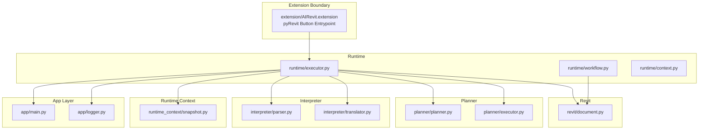
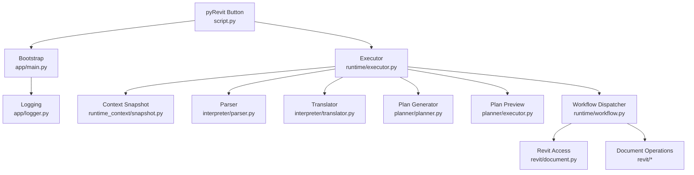
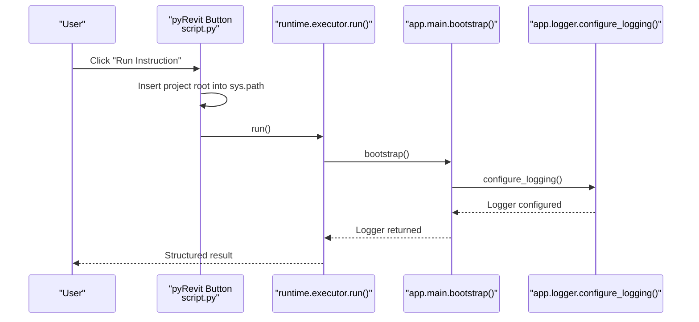
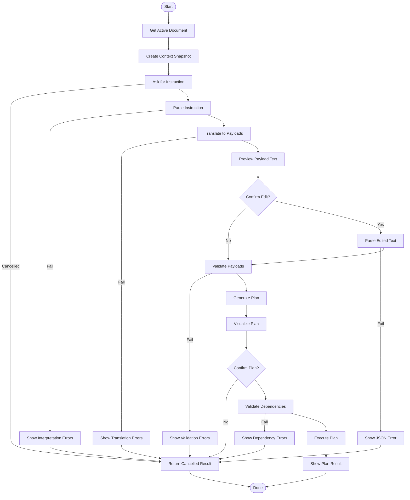
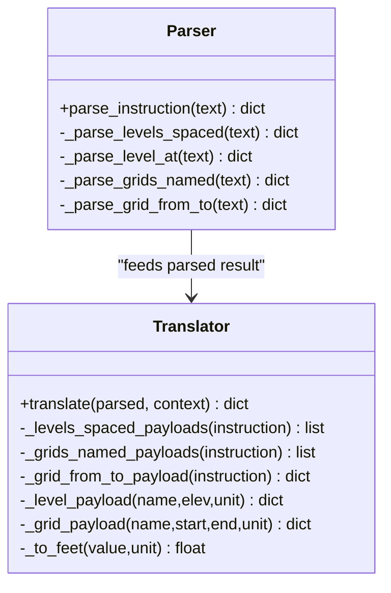
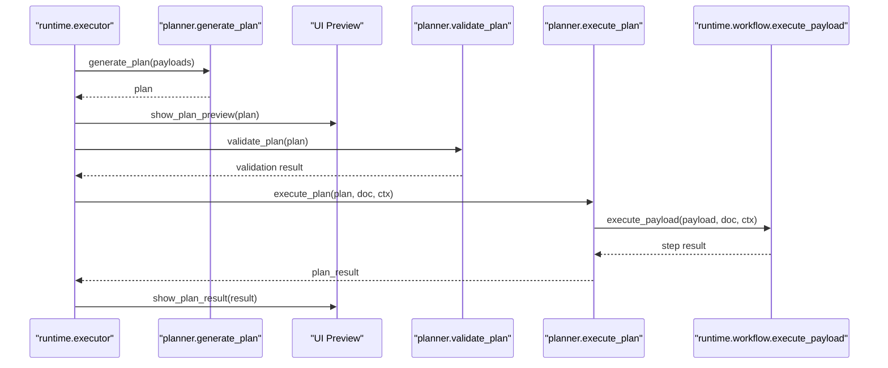
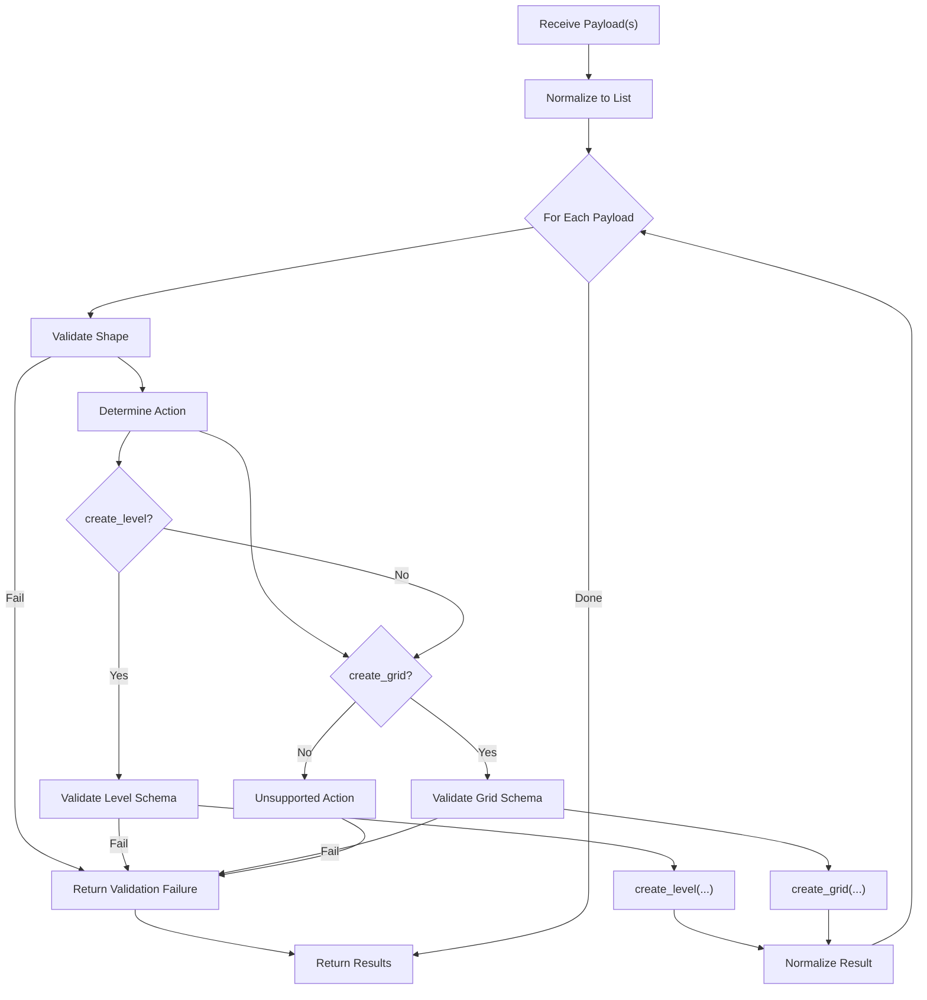
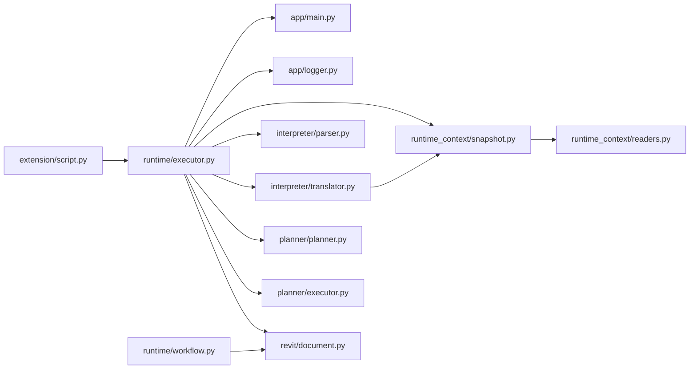

# Architecture Deep Dive

<cite>
**Referenced Files in This Document**
- [README.md](file://README.md)
- [requirements.txt](file://requirements.txt)
- [script.py](file://extension/AIRevit.extension/AI Revit.tab/Execution.panel/Run Instruction.pushbutton/script.py)
- [app/main.py](file://app/main.py)
- [app/logger.py](file://app/logger.py)
- [runtime/executor.py](file://runtime/executor.py)
- [runtime/workflow.py](file://runtime/workflow.py)
- [runtime/context.py](file://runtime/context.py)
- [runtime_context/snapshot.py](file://runtime_context/snapshot.py)
- [interpreter/parser.py](file://interpreter/parser.py)
- [interpreter/translator.py](file://interpreter/translator.py)
- [planner/planner.py](file://planner/planner.py)
- [planner/executor.py](file://planner/executor.py)
- [revit/document.py](file://revit/document.py)
</cite>

## Table of Contents
1. [Introduction](#introduction)
2. [Project Structure](#project-structure)
3. [Core Components](#core-components)
4. [Architecture Overview](#architecture-overview)
5. [Detailed Component Analysis](#detailed-component-analysis)
6. [Dependency Analysis](#dependency-analysis)
7. [Performance Considerations](#performance-considerations)
8. [Troubleshooting Guide](#troubleshooting-guide)
9. [Conclusion](#conclusion)
10. [Appendices](#appendices)

## Introduction
This document presents a deep dive into the AI Revit Agent architecture, a clean-architecture system designed for deterministic, human-in-the-loop BIM automation using Python and pyRevit. The system enforces strict separation of concerns across four primary layers:
- Interpreter: Controlled natural-language parsing and payload translation
- Planner: Deterministic plan generation, validation, and visualization
- Runtime: Orchestration, workflow sequencing, and context management
- Revit: Exclusive, thin layer for direct pyRevit/Revit API interactions

The design avoids external dependencies, minimizes runtime coupling, and emphasizes determinism, auditability, and safety via context snapshots and structured validation.

## Project Structure
The repository is organized around a clean architecture with feature-oriented packages and a minimal extension boundary for pyRevit integration.

**Diagram sources**
- [script.py:1-21](file://extension/AIRevit.extension/AI Revit.tab/Execution.panel/Run Instruction.pushbutton/script.py#L1-L21)
- [app/main.py:10-15](file://app/main.py#L10-L15)
- [app/logger.py:13-29](file://app/logger.py#L13-L29)
- [runtime/executor.py:15-42](file://runtime/executor.py#L15-L42)
- [runtime/workflow.py:10-14](file://runtime/workflow.py#L10-L14)
- [runtime_context/snapshot.py:10-26](file://runtime_context/snapshot.py#L10-L26)
- [interpreter/parser.py:18-30](file://interpreter/parser.py#L18-L30)
- [interpreter/translator.py:17-39](file://interpreter/translator.py#L17-L39)
- [planner/planner.py:34-60](file://planner/planner.py#L34-L60)
- [planner/executor.py:39-51](file://planner/executor.py#L39-L51)
- [revit/document.py:10-13](file://revit/document.py#L10-L13)

**Section sources**
- [README.md:14-34](file://README.md#L14-L34)
- [requirements.txt:1-3](file://requirements.txt#L1-L3)

## Core Components
- Extension Entrypoint: A minimal pyRevit button script that injects the project root into sys.path and invokes the runtime executor.
- App Bootstrap and Logging: Centralized logging configuration and application initialization.
- Runtime Executor: Orchestrates the end-to-end flow: context snapshot, instruction intake, payload generation, plan creation, visualization, approval, dependency validation, and execution.
- Workflow Dispatcher: Validates and executes payloads against the Revit layer, enforcing deterministic actions and structured results.
- Interpreter: Controlled-language parser and translator that produces standardized payloads without touching Revit.
- Planner: Generates, validates, and visualizes deterministic execution plans with dependency-aware failure propagation.
- Revit Layer: Single-responsibility module for accessing the active document and delegating all BIM operations to the workflow layer.

**Section sources**
- [script.py:11-21](file://extension/AIRevit.extension/AI Revit.tab/Execution.panel/Run Instruction.pushbutton/script.py#L11-L21)
- [app/main.py:10-15](file://app/main.py#L10-L15)
- [app/logger.py:13-29](file://app/logger.py#L13-L29)
- [runtime/executor.py:49-94](file://runtime/executor.py#L49-L94)
- [runtime/workflow.py:40-91](file://runtime/workflow.py#L40-L91)
- [interpreter/parser.py:18-30](file://interpreter/parser.py#L18-L30)
- [interpreter/translator.py:17-39](file://interpreter/translator.py#L17-L39)
- [planner/planner.py:34-60](file://planner/planner.py#L34-L60)
- [planner/executor.py:39-51](file://planner/executor.py#L39-L51)
- [revit/document.py:10-13](file://revit/document.py#L10-L13)

## Architecture Overview
The system adheres to clean architecture with bounded contexts and unidirectional data flow. The pyRevit button acts as the UI façade, delegating control to the runtime executor. The runtime orchestrates interpreter and planner stages, then delegates validated actions to the workflow layer, which interacts exclusively with the Revit layer.

**Diagram sources**
- [script.py:17-20](file://extension/AIRevit.extension/AI Revit.tab/Execution.panel/Run Instruction.pushbutton/script.py#L17-L20)
- [app/main.py:10-15](file://app/main.py#L10-L15)
- [app/logger.py:13-29](file://app/logger.py#L13-L29)
- [runtime/executor.py:97-131](file://runtime/executor.py#L97-L131)
- [runtime_context/snapshot.py:10-26](file://runtime_context/snapshot.py#L10-L26)
- [interpreter/parser.py:18-30](file://interpreter/parser.py#L18-L30)
- [interpreter/translator.py:17-39](file://interpreter/translator.py#L17-L39)
- [planner/planner.py:34-60](file://planner/planner.py#L34-L60)
- [planner/executor.py:39-51](file://planner/executor.py#L39-L51)
- [runtime/workflow.py:10-14](file://runtime/workflow.py#L10-L14)
- [revit/document.py:10-13](file://revit/document.py#L10-L13)

## Detailed Component Analysis

### Extension Entrypoint and PyRevit Integration
- Purpose: Minimal wrapper to load the project root and invoke the runtime executor.
- Behavior: Adds the project root to sys.path and calls runtime.executor.run().
- Safety: No logic beyond bootstrapping; all heavy lifting is delegated.

**Diagram sources**
- [script.py:11-21](file://extension/AIRevit.extension/AI Revit.tab/Execution.panel/Run Instruction.pushbutton/script.py#L11-L21)
- [app/main.py:10-15](file://app/main.py#L10-L15)
- [app/logger.py:13-29](file://app/logger.py#L13-L29)
- [runtime/executor.py:49-64](file://runtime/executor.py#L49-L64)

**Section sources**
- [script.py:11-21](file://extension/AIRevit.extension/AI Revit.tab/Execution.panel/Run Instruction.pushbutton/script.py#L11-L21)

### Runtime Executor: Human-in-the-Loop Orchestration
- Responsibilities:
  - Prepare context snapshot
  - Collect and parse instruction
  - Translate to payloads
  - Inspect and optionally edit payloads
  - Validate payloads against context
  - Generate, visualize, and approve plan
  - Validate plan dependencies
  - Execute plan with failure propagation
  - Report structured results
- Error handling: Converts exceptions into structured results and logs failures.

**Diagram sources**
- [runtime/executor.py:67-225](file://runtime/executor.py#L67-L225)
- [runtime/workflow.py:66-81](file://runtime/workflow.py#L66-L81)
- [planner/planner.py:63-90](file://planner/planner.py#L63-L90)
- [planner/executor.py:39-94](file://planner/executor.py#L39-L94)

**Section sources**
- [runtime/executor.py:49-285](file://runtime/executor.py#L49-L285)

### Interpreter: Controlled Natural-Language Processing
- Parser: Recognizes controlled patterns for levels and grids, returning structured results or errors.
- Translator: Converts parsed results into standardized payloads, applies unit conversions, and checks for context conflicts.

**Diagram sources**
- [interpreter/parser.py:18-141](file://interpreter/parser.py#L18-L141)
- [interpreter/translator.py:17-155](file://interpreter/translator.py#L17-L155)

**Section sources**
- [interpreter/parser.py:18-141](file://interpreter/parser.py#L18-L141)
- [interpreter/translator.py:17-155](file://interpreter/translator.py#L17-L155)

### Planner: Deterministic Plan Generation and Execution
- Plan Generation: Converts payloads into execution steps with deterministic IDs and default sequential dependencies.
- Plan Validation: Ensures structural correctness, absence of missing references, and acyclic dependency graphs.
- Plan Execution: Executes steps in topological order, propagating failures to dependents and skipping affected steps.

**Diagram sources**
- [runtime/executor.py:164-225](file://runtime/executor.py#L164-L225)
- [planner/planner.py:34-90](file://planner/planner.py#L34-L90)
- [planner/executor.py:39-94](file://planner/executor.py#L39-L94)
- [runtime/workflow.py:84-91](file://runtime/workflow.py#L84-L91)

**Section sources**
- [planner/planner.py:34-234](file://planner/planner.py#L34-L234)
- [planner/executor.py:39-226](file://planner/executor.py#L39-L226)

### Runtime Workflow: Validation and Dispatch
- Validation: Checks payload shape, action support, schema compliance, and duplicate names using context-aware helpers.
- Dispatch: Routes validated payloads to deterministic actions (create_level, create_grid) and normalizes results.

**Diagram sources**
- [runtime/workflow.py:40-194](file://runtime/workflow.py#L40-L194)

**Section sources**
- [runtime/workflow.py:40-235](file://runtime/workflow.py#L40-L235)

### Revit Layer: Thin API Access
- Purpose: Provides exclusive access to the active document, ensuring no direct Revit API imports leak into higher layers.
- Usage: Called by the workflow layer for actual BIM operations.

**Section sources**
- [revit/document.py:10-13](file://revit/document.py#L10-L13)

### Runtime Context: Snapshots and Serialization
- Snapshot Creation: Captures document name, units, levels, grids, and summary counts.
- Context Utilities: Exposes helpers to extract names from snapshots for validation and duplicate detection.

**Section sources**
- [runtime_context/snapshot.py:10-37](file://runtime_context/snapshot.py#L10-L37)

## Dependency Analysis
The system maintains low coupling and high cohesion across layers. Imports flow inward toward the core runtime and Revit layer, preventing upward leakage of implementation details.

**Diagram sources**
- [runtime/executor.py:15-42](file://runtime/executor.py#L15-L42)
- [runtime/workflow.py:10-14](file://runtime/workflow.py#L10-L14)
- [interpreter/translator.py:7-8](file://interpreter/translator.py#L7-L8)
- [runtime_context/snapshot.py:7](file://runtime_context/snapshot.py#L7)

**Section sources**
- [runtime/executor.py:15-42](file://runtime/executor.py#L15-L42)
- [runtime/workflow.py:10-14](file://runtime/workflow.py#L10-L14)
- [interpreter/translator.py:7-8](file://interpreter/translator.py#L7-L8)
- [runtime_context/snapshot.py:7](file://runtime_context/snapshot.py#L7)

## Performance Considerations
- Deterministic Planning: Pre-generating and validating plans eliminates runtime ambiguity and reduces repeated parsing overhead.
- Context Snapshots: Using snapshots avoids repeated live API reads during validation and approval phases.
- Unit Conversions: Precomputed conversion factors minimize per-payload computation.
- Logging: Single-file logging with minimal handlers ensures predictable I/O characteristics under pyRevit.

[No sources needed since this section provides general guidance]

## Troubleshooting Guide
- Logging Setup: Ensure logs/runtime directory exists and is writable; verify logger formatter and handler configuration.
- Context Snapshot: Confirm snapshot creation and persistence paths; validate JSON readability.
- Validation Failures: Review structured validation messages for shape, schema, and duplicate-name issues.
- Plan Execution: Check dependency validation errors and step-by-step summaries for skipped or failed steps.
- Cancellations: Verify cancellation flows at instruction, payload edit, and plan approval stages.

**Section sources**
- [app/logger.py:13-29](file://app/logger.py#L13-L29)
- [runtime/executor.py:97-104](file://runtime/executor.py#L97-L104)
- [runtime/workflow.py:94-96](file://runtime/workflow.py#L94-L96)
- [planner/executor.py:97-118](file://planner/executor.py#L97-L118)

## Conclusion
The AI Revit Agent embraces clean architecture to deliver a safe, deterministic, and extensible automation framework. By isolating concerns across interpreter, planner, runtime, and Revit layers—and by maintaining zero external dependencies—the system balances simplicity, auditability, and scalability. The pyRevit extension boundary remains minimal, enabling seamless integration while preserving architectural integrity.

[No sources needed since this section summarizes without analyzing specific files]

## Appendices

### System Context and Deployment Topology
- Context: pyRevit loads the extension, which triggers the runtime executor.
- Topology: Single-user, deterministic execution per pyRevit command invocation; logs and snapshots reside locally.
- Scalability: Current design targets deterministic workflows; future phases can introduce caching, plan reuse, and incremental updates without altering core boundaries.

**Section sources**
- [README.md:36-54](file://README.md#L36-L54)
- [requirements.txt:1-3](file://requirements.txt#L1-3)

### Technology Stack and Rationale
- Language/Runtime: Python with pyRevit/Revit APIs
- External Dependencies: None (zero external dependencies)
- Rationale: Eliminates third-party maintenance, simplifies deployment, and reduces attack surface; leverages pyRevit’s runtime for API access.

**Section sources**
- [requirements.txt:1-3](file://requirements.txt#L1-L3)
- [README.md:10-12](file://README.md#L10-L12)

### Cross-Cutting Concerns
- Logging: Centralized configuration with deterministic file naming and formatting.
- Context Management: Immutable snapshots enable reproducible reasoning and validation.
- Error Handling: Structured results unify success/failure reporting across layers.

**Section sources**
- [app/logger.py:13-29](file://app/logger.py#L13-L29)
- [runtime/executor.py:258-284](file://runtime/executor.py#L258-L284)
- [runtime/workflow.py:197-205](file://runtime/workflow.py#L197-L205)