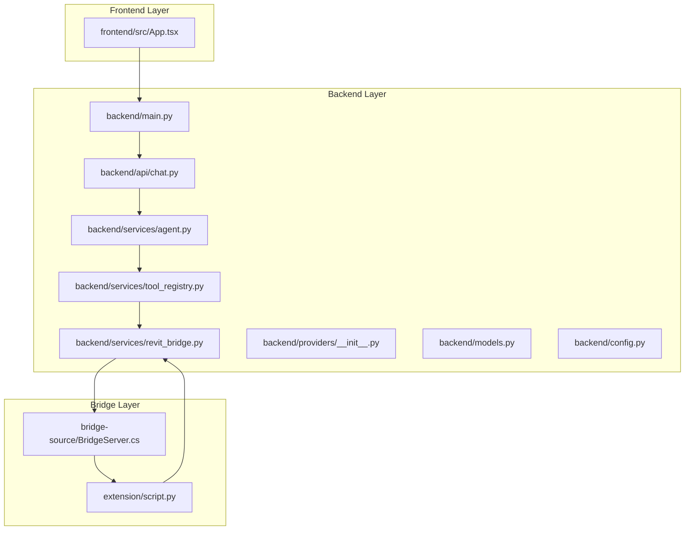
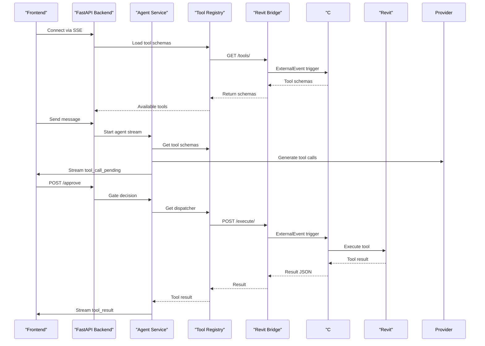
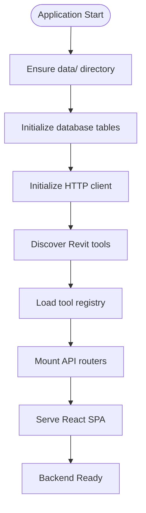
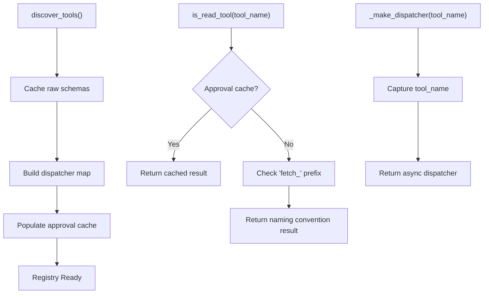
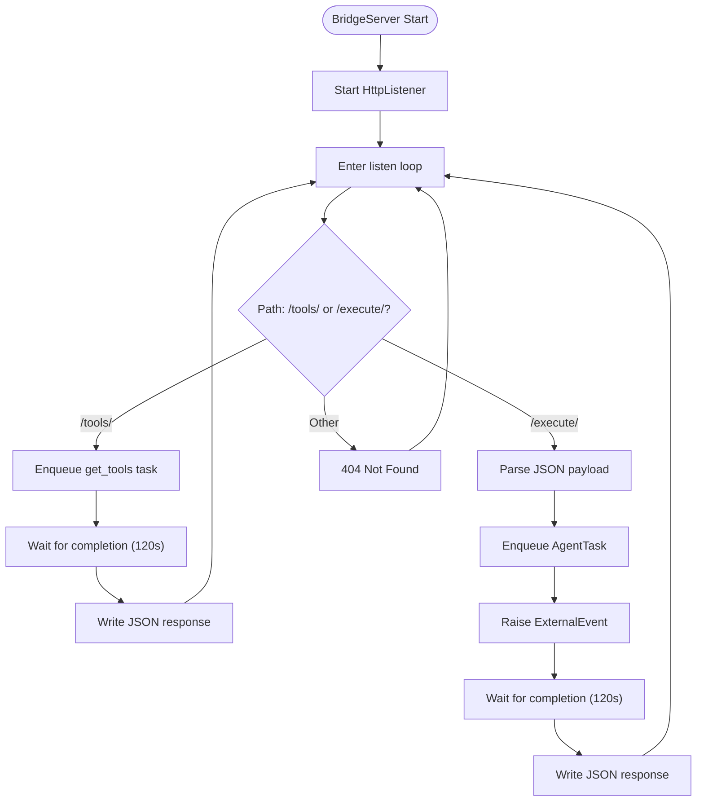
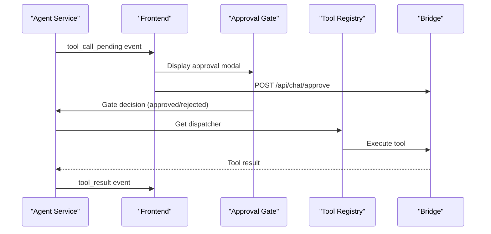
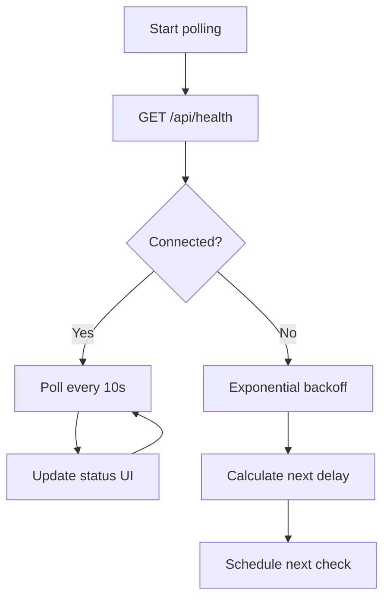
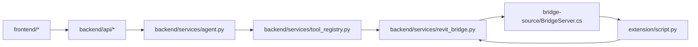
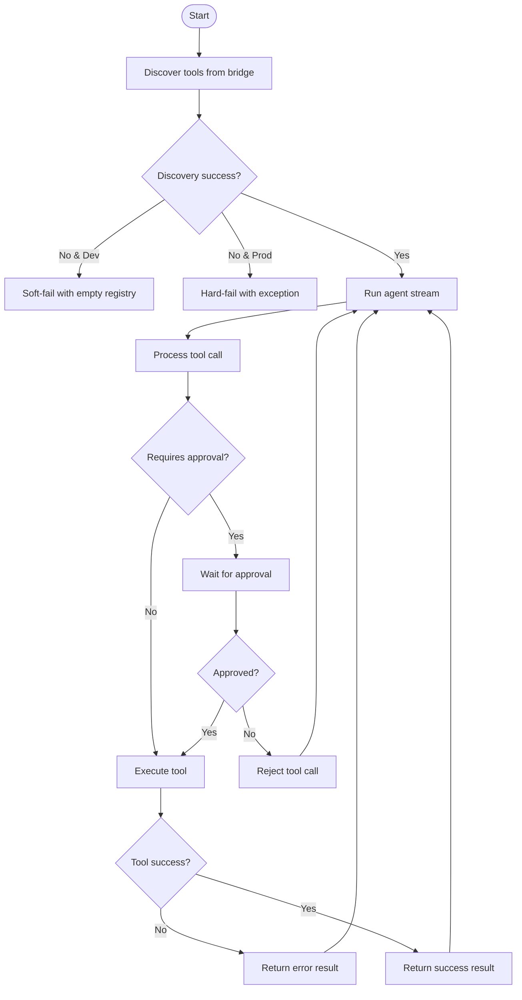

# Component Responsibilities and Boundaries

<cite>
**Referenced Files in This Document**
- [backend/main.py](file://backend/main.py)
- [backend/services/tool_registry.py](file://backend/services/tool_registry.py)
- [backend/services/revit_bridge.py](file://backend/services/revit_bridge.py)
- [backend/api/chat.py](file://backend/api/chat.py)
- [backend/services/agent.py](file://backend/services/agent.py)
- [backend/services/streaming.py](file://backend/services/streaming.py)
- [backend/providers/__init__.py](file://backend/providers/__init__.py)
- [backend/models.py](file://backend/models.py)
- [backend/config.py](file://backend/config.py)
- [bridge-source/BridgeServer.cs](file://bridge-source/BridgeServer.cs)
- [extension/script.py](file://extension/script.py)
- [frontend/src/App.tsx](file://frontend/src/App.tsx)
</cite>

## Update Summary
**Changes Made**
- Replaced interpreter and runtime components with FastAPI backend architecture
- Introduced C# BridgeServer for Revit integration
- Added dynamic tool registry replacing traditional interpreter functionality
- Updated architecture to support human-in-the-loop approval via streaming events
- Enhanced error handling and approval gate mechanisms

## Table of Contents
1. [Introduction](#introduction)
2. [Project Structure](#project-structure)
3. [Core Components](#core-components)
4. [Architecture Overview](#architecture-overview)
5. [Detailed Component Analysis](#detailed-component-analysis)
6. [Dependency Analysis](#dependency-analysis)
7. [Performance Considerations](#performance-considerations)
8. [Troubleshooting Guide](#troubleshooting-guide)
9. [Conclusion](#conclusion)

## Introduction
This document defines the component responsibilities and architectural boundaries for the AI Revit Agent. The system is organized into distinct layers with strict separation of concerns:
- FastAPI Backend: Central orchestration layer handling HTTP requests, tool registry management, and AI provider integration
- C# Bridge System: Native Revit integration via HTTP server and external event handling
- Dynamic Tool Registry: Live tool schema discovery and dispatch mechanism
- Human-in-the-Loop Approval: Streaming-based approval system with gate management
- Frontend Interface: Real-time chat interface with Revit status monitoring

The design enforces no cross-layer dependencies. Each layer exposes a narrow interface to the adjacent layers, ensuring determinism, auditability, and safety for BIM operations.

## Project Structure
The repository is organized by functional layer and responsibility:
- backend: FastAPI application with API routes, services, and database models
- bridge-source: C# BridgeServer implementation for Revit integration
- extension: pyRevit entrypoint and UI trigger
- frontend: React SPA with real-time chat interface
- schemas: Tool schema snapshots and configuration

**Diagram sources**
- [backend/main.py](file://backend/main.py)
- [backend/api/chat.py](file://backend/api/chat.py)
- [backend/services/agent.py](file://backend/services/agent.py)
- [backend/services/tool_registry.py](file://backend/services/tool_registry.py)
- [backend/services/revit_bridge.py](file://backend/services/revit_bridge.py)
- [bridge-source/BridgeServer.cs](file://bridge-source/BridgeServer.cs)
- [extension/script.py](file://extension/script.py)
- [frontend/src/App.tsx](file://frontend/src/App.tsx)

**Section sources**
- [backend/main.py:1-183](file://backend/main.py#L1-L183)

## Core Components
- FastAPI Backend
  - Application lifecycle management with startup/shutdown hooks
  - Database initialization and schema migrations
  - HTTP client management for bridge communication
  - API router mounting and CORS configuration
  - React SPA serving in production mode
- Dynamic Tool Registry
  - Live tool schema discovery from C# BridgeServer
  - Tool classification (read vs write operations)
  - Approval requirement determination
  - Async dispatcher factory for tool execution
- C# Bridge System
  - HTTP listener for tool discovery and execution
  - External event handling for Revit main thread operations
  - Python execution router for dynamic tool registration
  - Safe tool execution with error handling
- Human-in-the-Loop Approval
  - Streaming Server-Sent Events for real-time communication
  - Approval gate management with asyncio synchronization
  - Automatic approval bypass in development mode
  - Tool result aggregation and persistence
- Frontend Interface
  - Real-time chat with streaming message display
  - Revit bridge status polling with exponential backoff
  - Approval modal overlay for user decisions
  - Provider selection and settings management

**Section sources**
- [backend/main.py:62-104](file://backend/main.py#L62-L104)
- [backend/services/tool_registry.py:62-192](file://backend/services/tool_registry.py#L62-L192)
- [bridge-source/BridgeServer.cs:79-210](file://bridge-source/BridgeServer.cs#L79-L210)
- [backend/services/agent.py:39-367](file://backend/services/agent.py#L39-L367)
- [frontend/src/App.tsx:25-127](file://frontend/src/App.tsx#L25-L127)

## Architecture Overview
The system follows a streaming-based, approval-gated architecture:
1. Frontend connects to FastAPI backend via SSE streams
2. Backend initializes tool registry from C# BridgeServer
3. AI provider generates tool calls with arguments
4. Agent service validates tool availability and approval requirements
5. Approval gates pause execution for user consent
6. Tools execute through C# BridgeServer to Revit API
7. Results stream back to frontend with real-time updates

**Diagram sources**
- [backend/api/chat.py:74-261](file://backend/api/chat.py#L74-L261)
- [backend/services/agent.py:94-367](file://backend/services/agent.py#L94-L367)
- [backend/services/tool_registry.py:171-183](file://backend/services/tool_registry.py#L171-L183)
- [backend/services/revit_bridge.py:167-202](file://backend/services/revit_bridge.py#L167-L202)
- [bridge-source/BridgeServer.cs:120-187](file://bridge-source/BridgeServer.cs#L120-L187)

## Detailed Component Analysis

### FastAPI Backend Layer
Responsibilities:
- Application lifecycle management with proper startup/shutdown sequences
- Database initialization and schema migrations
- HTTP client management for bridge communication
- API router mounting and CORS configuration
- React SPA serving in production mode

Key behaviors:
- Startup sequence ensures data directory, database tables, and HTTP client initialization
- Tool registry loading with soft-failure handling in development mode
- CORS middleware configuration based on development/production settings
- SPA fallback routing for single-page application support

**Diagram sources**
- [backend/main.py:62-104](file://backend/main.py#L62-L104)

**Section sources**
- [backend/main.py:62-166](file://backend/main.py#L62-166)

### Dynamic Tool Registry
Responsibilities:
- Live tool schema discovery from C# BridgeServer
- Tool classification (read vs write operations)
- Approval requirement determination
- Async dispatcher factory for tool execution
- Automatic re-discovery with cooldown protection

Key behaviors:
- Tool schemas cached locally with classification priority
- Read tools automatically executed without approval
- Write tools require explicit user approval
- Dispatcher closures capture tool names to avoid late-binding issues
- Cooldown mechanism prevents excessive bridge re-discovery attempts

**Diagram sources**
- [backend/services/tool_registry.py:77-101](file://backend/services/tool_registry.py#L77-L101)
- [backend/services/tool_registry.py:35-56](file://backend/services/tool_registry.py#L35-L56)
- [backend/services/tool_registry.py:171-183](file://backend/services/tool_registry.py#L171-L183)

**Section sources**
- [backend/services/tool_registry.py:62-192](file://backend/services/tool_registry.py#L62-192)

### C# Bridge System
Responsibilities:
- HTTP listener for tool discovery and execution endpoints
- External event handling for Revit main thread operations
- Python execution router for dynamic tool registration
- Safe tool execution with comprehensive error handling
- Timeout management for long-running operations

Key behaviors:
- HTTP listener supports both GET /tools/ and POST /execute/ endpoints
- ExternalEvent pattern ensures Revit API calls happen on main thread
- Python execution router maintains tool registry in closure scope
- Comprehensive error handling with JSON error responses
- 120-second timeout for all bridge operations

**Diagram sources**
- [bridge-source/BridgeServer.cs:93-187](file://bridge-source/BridgeServer.cs#L93-L187)

**Section sources**
- [bridge-source/BridgeServer.cs:79-210](file://bridge-source/BridgeServer.cs#L79-210)

### Human-in-the-Loop Approval System
Responsibilities:
- Streaming Server-Sent Events for real-time communication
- Approval gate management with asyncio synchronization
- Automatic approval bypass in development mode
- Tool result aggregation and persistence
- Frontend approval modal integration

Key behaviors:
- Approval gates use asyncio.Event for thread-safe coordination
- Development mode auto-approves all tools for testing
- Frontend receives structured events for tool execution states
- Tool results include approval status and execution details
- Session registry maintains approval state per conversation

**Diagram sources**
- [backend/services/agent.py:253-294](file://backend/services/agent.py#L253-294)
- [backend/api/chat.py:268-298](file://backend/api/chat.py#L268-298)

**Section sources**
- [backend/services/agent.py:39-367](file://backend/services/agent.py#L39-367)
- [backend/api/chat.py:268-298](file://backend/api/chat.py#L268-298)

### Frontend Interface
Responsibilities:
- Real-time chat with streaming message display
- Revit bridge status polling with exponential backoff
- Approval modal overlay for user decisions
- Provider selection and settings management
- Session management and history display

Key behaviors:
- Exponential backoff polling for Revit bridge connectivity
- SSE event processing for streaming conversations
- Approval modal integration with backend approval endpoints
- Provider configuration management with model validation
- Session sidebar with conversation history navigation

**Diagram sources**
- [frontend/src/App.tsx:43-79](file://frontend/src/App.tsx#L43-L79)

**Section sources**
- [frontend/src/App.tsx:25-127](file://frontend/src/App.tsx#L25-127)

## Dependency Analysis
Strict separation of concerns is enforced:
- FastAPI backend depends on tool registry and provider factory
- Tool registry depends on bridge service for discovery
- Agent service orchestrates but delegates all BIM operations via registry
- Bridge service depends on C# BridgeServer and external events
- Frontend depends on backend API and bridge health status
- Extension script bridges pyRevit and C# BridgeServer

**Diagram sources**
- [backend/api/chat.py:32-33](file://backend/api/chat.py#L32-L33)
- [backend/services/agent.py](file://backend/services/agent.py#L30)
- [backend/services/tool_registry.py](file://backend/services/tool_registry.py#L18)
- [backend/services/revit_bridge.py:20-21](file://backend/services/revit_bridge.py#L20-L21)
- [bridge-source/BridgeServer.cs:7-8](file://bridge-source/BridgeServer.cs#L7-L8)
- [extension/script.py](file://extension/script.py#L28)

**Section sources**
- [backend/api/chat.py:32-33](file://backend/api/chat.py#L32-L33)
- [backend/services/agent.py](file://backend/services/agent.py#L30)
- [backend/services/tool_registry.py](file://backend/services/tool_registry.py#L18)
- [backend/services/revit_bridge.py:20-21](file://backend/services/revit_bridge.py#L20-L21)

## Performance Considerations
- Tool discovery is cached with 5-second cooldown to prevent bridge overload
- HTTP client uses keep-alive connections for efficient bridge communication
- Streaming events minimize frontend polling overhead
- Database operations use async sessions for concurrent access
- Frontend implements exponential backoff for bridge status polling
- C# BridgeServer uses ExternalEvent pattern to avoid blocking Revit UI
- Tool execution timeouts prevent hanging operations (120 seconds)

## Troubleshooting Guide
Common failure modes and propagation:
- Bridge discovery failures: soft-failed in development mode, hard-failed in production
- Tool execution failures: wrapped in error responses with detailed messages
- Approval gate timeouts: handled gracefully with timeout errors
- Provider configuration errors: validated before agent execution
- Database connection issues: async operations with proper error handling

**Diagram sources**
- [backend/main.py:82-96](file://backend/main.py#L82-L96)
- [backend/services/agent.py:253-294](file://backend/services/agent.py#L253-294)
- [backend/services/revit_bridge.py:195-202](file://backend/services/revit_bridge.py#L195-L202)

**Section sources**
- [backend/main.py:82-96](file://backend/main.py#L82-L96)
- [backend/services/agent.py:253-294](file://backend/services/agent.py#L253-294)
- [backend/services/revit_bridge.py:195-202](file://backend/services/revit_bridge.py#L195-L202)

## Conclusion
The AI Revit Agent enforces strict architectural boundaries across five layers: FastAPI Backend, Dynamic Tool Registry, C# Bridge System, Human-in-the-Loop Approval, and Frontend Interface. This separation ensures deterministic, auditable, and safe BIM operations. The new architecture replaces traditional interpreter and runtime components with a modern streaming-based approach, providing real-time human-in-the-loop approval, dynamic tool discovery, and robust error handling. The system's modular design enables easy extension with new AI providers, tools, and Revit operations while maintaining safety and reliability through the approval gate mechanism and comprehensive error handling.