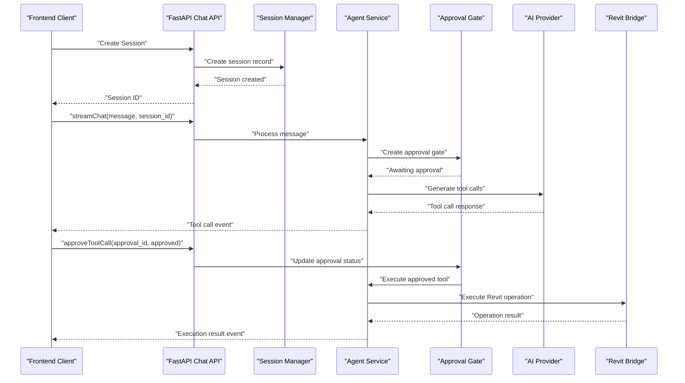
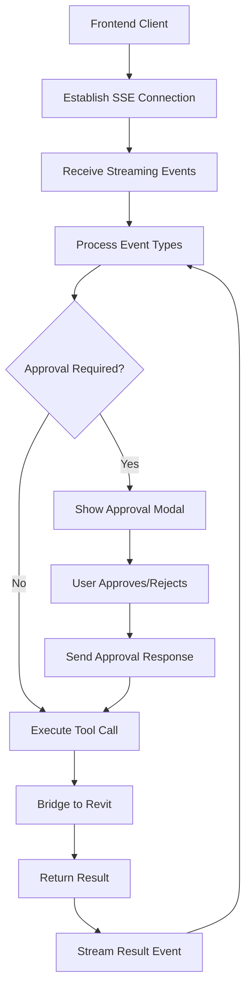
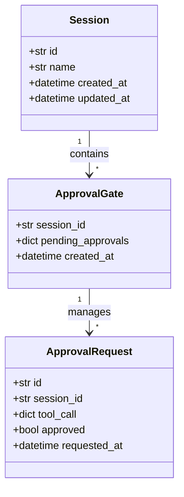
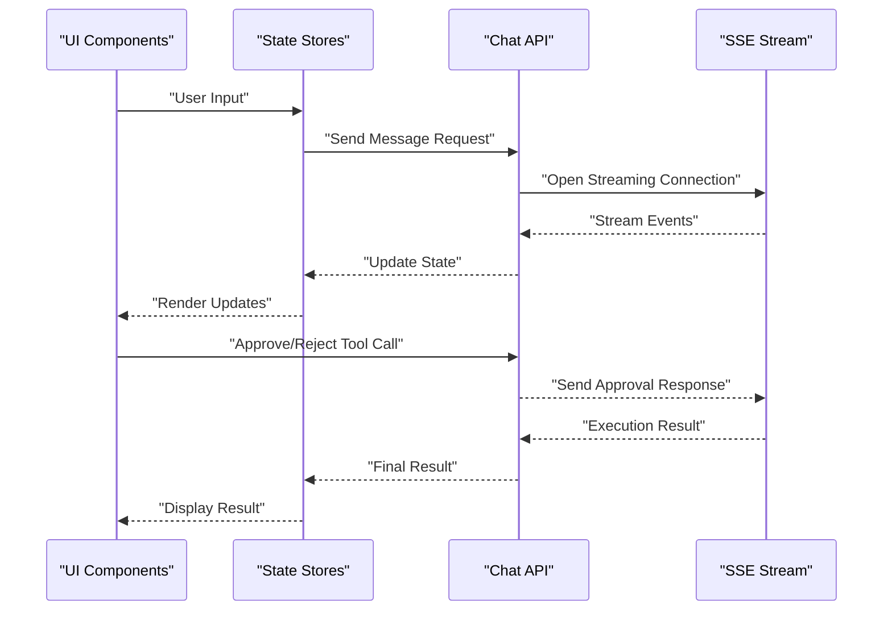

# Data Flow and Processing Pipeline

<cite>
**Referenced Files in This Document**
- [backend/main.py](file://backend/main.py)
- [backend/api/chat.py](file://backend/api/chat.py)
- [backend/api/sessions.py](file://backend/api/sessions.py)
- [backend/services/agent.py](file://backend/services/agent.py)
- [backend/services/streaming.py](file://backend/services/streaming.py)
- [backend/providers/openai.py](file://backend/providers/openai.py)
- [backend/providers/anthropic.py](file://backend/providers/anthropic.py)
- [backend/models.py](file://backend/models.py)
- [backend/database.py](file://backend/database.py)
- [frontend/src/api/chat.ts](file://frontend/src/api/chat.ts)
- [frontend/src/components/ApprovalModal.tsx](file://frontend/src/components/ApprovalModal.tsx)
- [frontend/src/store/approvalStore.ts](file://frontend/src/store/approvalStore.ts)
- [frontend/src/hooks/useChat.ts](file://frontend/src/hooks/useChat.ts)
- [frontend/src/hooks/useSessions.ts](file://frontend/src/hooks/useSessions.ts)
</cite>

## Update Summary
**Changes Made**
- Added comprehensive coverage of the new web architecture with real-time streaming capabilities
- Integrated approval workflows with database-driven session management
- Documented the frontend-backend integration with SSE streaming
- Updated data flow to reflect modern web-based processing pipeline
- Added new sections covering session management, approval gates, and streaming architecture

## Table of Contents
1. [Introduction](#introduction)
2. [Project Structure](#project-structure)
3. [Core Components](#core-components)
4. [Architecture Overview](#architecture-overview)
5. [Web Architecture Components](#web-architecture-components)
6. [Real-Time Streaming and Approval Workflows](#real-time-streaming-and-approval-workflows)
7. [Database-Driven Session Management](#database-driven-session-management)
8. [Detailed Component Analysis](#detailed-component-analysis)
9. [Frontend-Backend Integration](#frontend-backend-integration)
10. [Performance Considerations](#performance-considerations)
11. [Troubleshooting Guide](#troubleshooting-guide)
12. [Conclusion](#conclusion)
13. [Appendices](#appendices)

## Introduction
This document traces the end-to-end data flow of the AI Revit Agent processing pipeline under the new web architecture. The pipeline now features real-time streaming capabilities, approval workflows, and database-driven session management. It covers how user instructions are processed through a modern web stack, with natural language parsing, payload generation, execution planning, approval workflows, and Revit API operations, all connected through real-time streaming and persistent session management.

## Project Structure
The repository is organized into a modern web architecture with clear separation of concerns:
- backend: FastAPI application with streaming capabilities and approval workflows
- frontend: React TypeScript application with real-time streaming UI
- bridge-source: Native bridge for Revit API communication
- extension: AutoCAD plugin integration

```mermaid
graph TB
subgraph "Web Backend"
MAIN["backend/main.py"]
CHAT["backend/api/chat.py"]
SESSIONS["backend/api/sessions.py"]
AGENT["backend/services/agent.py"]
STREAMING["backend/services/streaming.py"]
DB["backend/database.py"]
MODELS["backend/models.py"]
end
subgraph "AI Providers"
OPENAI["backend/providers/openai.py"]
ANTHROPIC["backend/providers/anthropic.py"]
end
subgraph "Frontend"
FRONT_MAIN["frontend/src/App.tsx"]
CHAT_TS["frontend/src/api/chat.ts"]
APPROVAL["frontend/src/components/ApprovalModal.tsx"]
STORE["frontend/src/store/approvalStore.ts"]
USECHAT["frontend/src/hooks/useChat.ts"]
end
subgraph "Bridge Layer"
BRIDGE["bridge-source/BridgeServer.cs"]
REVIT["bridge-source/RevitAgentBridge.cs"]
END
MAIN --> CHAT
CHAT --> SESSIONS
CHAT --> AGENT
CHAT --> STREAMING
SESSIONS --> DB
DB --> MODELS
AGENT --> OPENAI
AGENT --> ANTHROPIC
FRONT_MAIN --> CHAT_TS
CHAT_TS --> APPROVAL
CHAT_TS --> STORE
CHAT_TS --> USECHAT
```

**Diagram sources**
- [backend/main.py](file://backend/main.py)
- [backend/api/chat.py](file://backend/api/chat.py)
- [backend/api/sessions.py](file://backend/api/sessions.py)
- [backend/services/agent.py](file://backend/services/agent.py)
- [backend/services/streaming.py](file://backend/services/streaming.py)
- [backend/database.py](file://backend/database.py)
- [backend/models.py](file://backend/models.py)
- [backend/providers/openai.py](file://backend/providers/openai.py)
- [backend/providers/anthropic.py](file://backend/providers/anthropic.py)
- [frontend/src/App.tsx](file://frontend/src/App.tsx)
- [frontend/src/api/chat.ts](file://frontend/src/api/chat.ts)
- [frontend/src/components/ApprovalModal.tsx](file://frontend/src/components/ApprovalModal.tsx)
- [frontend/src/store/approvalStore.ts](file://frontend/src/store/approvalStore.ts)
- [frontend/src/hooks/useChat.ts](file://frontend/src/hooks/useChat.ts)

## Core Components
- **Real-Time Chat API**: Handles SSE streaming for bidirectional communication between frontend and backend
- **Session Management**: Database-driven session lifecycle with approval gating
- **Approval Workflows**: Interactive approval system for tool execution with user consent
- **Streaming Service**: Manages real-time event streaming with proper cleanup and error handling
- **Agent Service**: Orchestrates AI provider interactions with approval gating
- **Provider Integrations**: Support for multiple AI providers (OpenAI, Anthropic, etc.)
- **Frontend Integration**: React components with real-time streaming and approval modal

Key data transformations:
- User input → Real-time streaming request
- Session ID + message → Approval gate creation
- Approved tool calls → Payload generation and execution
- Execution results → Real-time streaming responses
- Session state → Database persistence

**Section sources**
- [backend/api/chat.py](file://backend/api/chat.py)
- [backend/api/sessions.py](file://backend/api/sessions.py)
- [backend/services/agent.py](file://backend/services/agent.py)
- [backend/services/streaming.py](file://backend/services/streaming.py)
- [frontend/src/api/chat.ts](file://frontend/src/api/chat.ts)

## Architecture Overview
The new web architecture separates concerns across modern web layers with real-time streaming:
- **Frontend Layer**: React application with real-time streaming UI and approval workflows
- **API Layer**: FastAPI endpoints with SSE streaming and session management
- **Service Layer**: Agent orchestration with approval gating and provider integration
- **Data Layer**: Database-driven session management with approval tracking
- **Bridge Layer**: Native Revit API communication through bridge server



**Diagram sources**
- [backend/api/chat.py](file://backend/api/chat.py)
- [backend/api/sessions.py](file://backend/api/sessions.py)
- [backend/services/agent.py](file://backend/services/agent.py)
- [frontend/src/api/chat.ts](file://frontend/src/api/chat.ts)
- [frontend/src/components/ApprovalModal.tsx](file://frontend/src/components/ApprovalModal.tsx)

## Web Architecture Components

### Real-Time Streaming Infrastructure
The backend implements a sophisticated streaming architecture using Server-Sent Events (SSE) for real-time bidirectional communication. The streaming service manages connection lifecycle, event broadcasting, and proper cleanup.

### Session Management System
Database-driven session management provides persistent state tracking with automatic cleanup and approval gating. Sessions maintain user context and execution history throughout the pipeline.

### Approval Workflow Engine
Interactive approval system allows users to review and approve tool executions before they are sent to Revit. The approval gate maintains state and coordinates between frontend and backend.

**Section sources**
- [backend/services/streaming.py](file://backend/services/streaming.py)
- [backend/api/sessions.py](file://backend/api/sessions.py)
- [backend/services/agent.py](file://backend/services/agent.py)

## Real-Time Streaming and Approval Workflows

### Streaming Architecture
The streaming service manages real-time communication between frontend and backend using Server-Sent Events. It handles connection establishment, event broadcasting, and graceful cleanup on disconnect.



**Diagram sources**
- [backend/services/streaming.py](file://backend/services/streaming.py)
- [frontend/src/api/chat.ts](file://frontend/src/api/chat.ts)
- [frontend/src/components/ApprovalModal.tsx](file://frontend/src/components/ApprovalModal.tsx)

### Approval Workflow Process
The approval system provides interactive control over tool executions with user consent. Approval gates maintain state and coordinate between frontend and backend for secure execution.

**Section sources**
- [backend/services/agent.py](file://backend/services/agent.py)
- [frontend/src/store/approvalStore.ts](file://frontend/src/store/approvalStore.ts)
- [frontend/src/components/ApprovalModal.tsx](file://frontend/src/components/ApprovalModal.tsx)

## Database-Driven Session Management

### Session Lifecycle Management
The session management system provides complete lifecycle control with database persistence, automatic cleanup, and state tracking. Sessions maintain user context and execution history.

### Data Models and Relationships
Database models define the structure for sessions, approvals, and related metadata with proper relationships and constraints for data integrity.



**Diagram sources**
- [backend/models.py](file://backend/models.py)
- [backend/database.py](file://backend/database.py)
- [backend/api/sessions.py](file://backend/api/sessions.py)

**Section sources**
- [backend/api/sessions.py](file://backend/api/sessions.py)
- [backend/models.py](file://backend/models.py)
- [backend/database.py](file://backend/database.py)

## Detailed Component Analysis

### Web API Endpoints
The FastAPI application provides RESTful endpoints for session management and chat operations with streaming support. Endpoints handle authentication, validation, and proper error responses.

### Agent Service Orchestration
The agent service coordinates between AI providers, approval systems, and Revit bridge operations. It manages execution flow, error handling, and state persistence.

### Frontend Integration Components
React components provide real-time streaming UI with approval modals, session management, and tool call visualization. The frontend handles user interactions and displays streaming results.

**Section sources**
- [backend/api/chat.py](file://backend/api/chat.py)
- [backend/services/agent.py](file://backend/services/agent.py)
- [frontend/src/api/chat.ts](file://frontend/src/api/chat.ts)
- [frontend/src/hooks/useChat.ts](file://frontend/src/hooks/useChat.ts)

## Frontend-Backend Integration

### Real-Time Communication Protocol
The frontend communicates with the backend through REST APIs and Server-Sent Events. The chat API provides streaming capabilities with proper error handling and connection management.

### State Management Integration
Frontend state management integrates with backend services through reactive hooks and stores. Session state, approval status, and chat history are synchronized in real-time.

### User Interface Components
The React application provides intuitive interfaces for session management, chat interaction, and approval workflows. Components handle user input, display streaming results, and manage approval states.



**Diagram sources**
- [frontend/src/api/chat.ts](file://frontend/src/api/chat.ts)
- [frontend/src/store/approvalStore.ts](file://frontend/src/store/approvalStore.ts)
- [frontend/src/hooks/useChat.ts](file://frontend/src/hooks/useChat.ts)

**Section sources**
- [frontend/src/api/chat.ts](file://frontend/src/api/chat.ts)
- [frontend/src/store/approvalStore.ts](file://frontend/src/store/approvalStore.ts)
- [frontend/src/hooks/useChat.ts](file://frontend/src/hooks/useChat.ts)

## Performance Considerations
- **Real-time streaming**: Efficient SSE implementation with proper connection pooling and cleanup
- **Approval gating**: Minimal latency for user approvals with background processing
- **Database optimization**: Session caching and efficient query patterns for high-throughput scenarios
- **Frontend responsiveness**: Reactive updates with proper loading states and error boundaries
- **Memory management**: Proper cleanup of approval gates and streaming connections

## Troubleshooting Guide
Common failure points and handling:
- **Streaming connection failures**: Automatic reconnection with exponential backoff and proper error reporting
- **Approval timeout issues**: Graceful handling of unresponsive approvals with timeout mechanisms
- **Session persistence errors**: Transaction rollback and retry logic for database operations
- **Frontend state synchronization**: Proper error boundaries and fallback states for disconnected scenarios
- **Bridge communication failures**: Retry logic and proper error propagation from bridge to frontend

Error propagation:
- **Streaming errors**: Connection-level errors are propagated to frontend with appropriate recovery strategies
- **Approval failures**: Individual approval failures don't block overall session execution
- **Database errors**: Transaction-level errors are handled with rollback and proper error reporting
- **Frontend errors**: Comprehensive error boundaries prevent UI crashes and provide user feedback

**Section sources**
- [backend/services/streaming.py](file://backend/services/streaming.py)
- [backend/services/agent.py](file://backend/services/agent.py)
- [frontend/src/components/ErrorBoundary.tsx](file://frontend/src/components/ErrorBoundary.tsx)

## Conclusion
The AI Revit Agent pipeline now operates within a sophisticated web architecture that provides real-time streaming, interactive approval workflows, and database-driven session management. This modern approach enhances user experience through immediate feedback, maintains security through controlled execution, and ensures reliability through proper state management and error handling. The separation of concerns across frontend, backend, and bridge layers creates a scalable foundation for future enhancements.

## Appendices

### API Endpoint Reference
- **Session Management**: CRUD operations for session lifecycle management
- **Chat Streaming**: Real-time chat with approval workflow integration
- **Approval Management**: Tool call approval and rejection handling
- **Provider Integration**: Multi-provider AI service coordination

### Frontend Component Architecture
- **ChatWindow**: Main chat interface with streaming support
- **ApprovalModal**: Interactive approval workflow UI
- **SessionSidebar**: Session management and navigation
- **MessageBubble**: Individual message rendering with tool call support

### Database Schema Overview
- **Session table**: Core session metadata and timestamps
- **Approval tables**: Approval request tracking and status
- **Audit logging**: Complete execution history and error tracking

**Section sources**
- [backend/api/sessions.py](file://backend/api/sessions.py)
- [backend/api/chat.py](file://backend/api/chat.py)
- [frontend/src/components/ChatWindow.tsx](file://frontend/src/components/ChatWindow.tsx)
- [frontend/src/components/ApprovalModal.tsx](file://frontend/src/components/ApprovalModal.tsx)