# Design Patterns Implementation

<cite>
**Referenced Files in This Document**
- [backend/main.py](file://backend/main.py)
- [backend/api/chat.py](file://backend/api/chat.py)
- [backend/api/providers.py](file://backend/api/providers.py)
- [backend/api/sessions.py](file://backend/api/sessions.py)
- [backend/api/settings.py](file://backend/api/settings.py)
- [backend/providers/base.py](file://backend/providers/base.py)
- [backend/providers/openai.py](file://backend/providers/openai.py)
- [backend/providers/anthropic.py](file://backend/providers/anthropic.py)
- [backend/providers/gemini.py](file://backend/providers/gemini.py)
- [backend/providers/groq.py](file://backend/providers/groq.py)
- [backend/providers/openai_compat.py](file://backend/providers/openai_compat.py)
- [backend/providers/openrouter.py](file://backend/providers/openrouter.py)
- [backend/services/agent.py](file://backend/services/agent.py)
- [backend/services/streaming.py](file://backend/services/streaming.py)
- [backend/services/tool_registry.py](file://backend/services/tool_registry.py)
- [backend/services/revit_bridge.py](file://backend/services/revit_bridge.py)
- [backend/config.py](file://backend/config.py)
- [backend/database.py](file://backend/database.py)
- [backend/models.py](file://backend/models.py)
- [backend/schemas/tools.json](file://backend/schemas/tools.json)
- [frontend/src/api/chat.ts](file://frontend/src/api/chat.ts)
- [frontend/src/api/client.ts](file://frontend/src/api/client.ts)
- [frontend/src/components/ApprovalModal.tsx](file://frontend/src/components/ApprovalModal.tsx)
- [frontend/src/store/approvalStore.ts](file://frontend/src/store/approvalStore.ts)
- [frontend/src/hooks/useChat.ts](file://frontend/src/hooks/useChat.ts)
</cite>

## Update Summary
**Changes Made**
- Added FastAPI architecture patterns for RESTful API design
- Integrated Provider Adapter Pattern for AI service abstraction
- Enhanced Human-in-the-Loop Approval Workflow patterns
- Updated Frontend-Backend integration patterns
- Expanded streaming response patterns for real-time communication

## Table of Contents
1. [Introduction](#introduction)
2. [Project Structure](#project-structure)
3. [Core Components](#core-components)
4. [Architecture Overview](#architecture-overview)
5. [Detailed Component Analysis](#detailed-component-analysis)
6. [FastAPI Architecture Patterns](#fastapi-architecture-patterns)
7. [Provider Adapter Pattern](#provider-adapter-pattern)
8. [Human-in-the-Loop Approval Workflows](#human-in-the-loop-approval-workflows)
9. [Frontend-Backend Integration Patterns](#frontend-backend-integration-patterns)
10. [Streaming Response Patterns](#streaming-response-patterns)
11. [Dependency Analysis](#dependency-analysis)
12. [Performance Considerations](#performance-considerations)
13. [Troubleshooting Guide](#troubleshooting-guide)
14. [Conclusion](#conclusion)

## Introduction
This document analyzes the AI Revit Agent architecture and documents the design patterns implemented across the system. The focus is on:
- Command Pattern for payload-based execution
- Validator Pattern for comprehensive input validation
- Factory Pattern for dynamic payload generation
- Observer Pattern for approval-based workflows
- Strategy Pattern for parsing approaches
- Template Method Pattern for standardized execution flows
- **New**: FastAPI Architecture Pattern for RESTful API design
- **New**: Provider Adapter Pattern for AI service abstraction
- **New**: Enhanced Human-in-the-Loop Approval Workflow patterns
- **New**: Frontend-Backend Integration Patterns
- **New**: Streaming Response Patterns for real-time communication

We explain how these patterns are instantiated in the codebase, their benefits for maintainability and extensibility, and how they interact to achieve robust deterministic BIM operations.

## Project Structure
The system is organized into layered modules with modern FastAPI architecture:
- Application bootstrap and logging
- API Layer (FastAPI endpoints with streaming support)
- Provider Adapters (AI service abstraction layer)
- Services (business logic and tool execution)
- Database Models (ORM and persistence)
- Frontend Integration (React components and state management)

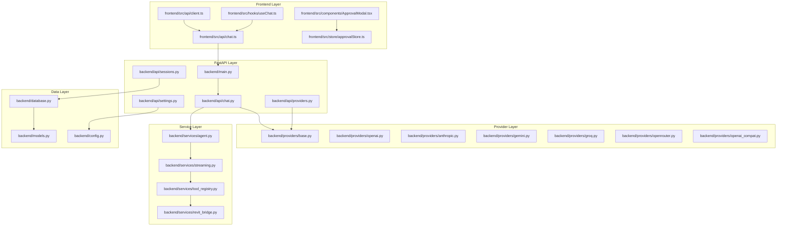

**Diagram sources**
- [backend/main.py:1-50](file://backend/main.py#L1-L50)
- [backend/api/chat.py:1-350](file://backend/api/chat.py#L1-L350)
- [backend/api/providers.py:1-200](file://backend/api/providers.py#L1-L200)
- [backend/api/sessions.py:1-150](file://backend/api/sessions.py#L1-L150)
- [backend/api/settings.py:1-120](file://backend/api/settings.py#L1-L120)
- [backend/providers/base.py:1-200](file://backend/providers/base.py#L1-L200)
- [backend/providers/openai.py:1-150](file://backend/providers/openai.py#L1-L150)
- [backend/providers/anthropic.py:1-150](file://backend/providers/anthropic.py#L1-L150)
- [backend/providers/gemini.py:1-150](file://backend/providers/gemini.py#L1-L150)
- [backend/providers/groq.py:1-150](file://backend/providers/groq.py#L1-L150)
- [backend/providers/openrouter.py:1-150](file://backend/providers/openrouter.py#L1-L150)
- [backend/providers/openai_compat.py:1-150](file://backend/providers/openai_compat.py#L1-L150)
- [backend/services/agent.py:1-300](file://backend/services/agent.py#L1-L300)
- [backend/services/streaming.py:1-250](file://backend/services/streaming.py#L1-L250)
- [backend/services/tool_registry.py:1-200](file://backend/services/tool_registry.py#L1-L200)
- [backend/services/revit_bridge.py:1-200](file://backend/services/revit_bridge.py#L1-L200)
- [backend/database.py:1-200](file://backend/database.py#L1-L200)
- [backend/models.py:1-250](file://backend/models.py#L1-L250)
- [backend/config.py:1-150](file://backend/config.py#L1-L150)
- [frontend/src/api/chat.ts:1-200](file://frontend/src/api/chat.ts#L1-L200)
- [frontend/src/api/client.ts:1-150](file://frontend/src/api/client.ts#L1-L150)
- [frontend/src/components/ApprovalModal.tsx:1-200](file://frontend/src/components/ApprovalModal.tsx#L1-L200)
- [frontend/src/store/approvalStore.ts:1-150](file://frontend/src/store/approvalStore.ts#L1-L150)
- [frontend/src/hooks/useChat.ts:1-120](file://frontend/src/hooks/useChat.ts#L1-L120)

**Section sources**
- [backend/main.py:1-50](file://backend/main.py#L1-L50)
- [backend/api/chat.py:1-350](file://backend/api/chat.py#L1-L350)
- [backend/api/providers.py:1-200](file://backend/api/providers.py#L1-L200)
- [backend/api/sessions.py:1-150](file://backend/api/sessions.py#L1-L150)
- [backend/api/settings.py:1-120](file://backend/api/settings.py#L1-L120)
- [backend/providers/base.py:1-200](file://backend/providers/base.py#L1-L200)
- [backend/providers/openai.py:1-150](file://backend/providers/openai.py#L1-L150)
- [backend/providers/anthropic.py:1-150](file://backend/providers/anthropic.py#L1-L150)
- [backend/providers/gemini.py:1-150](file://backend/providers/gemini.py#L1-L150)
- [backend/providers/groq.py:1-150](file://backend/providers/groq.py#L1-L150)
- [backend/providers/openrouter.py:1-150](file://backend/providers/openrouter.py#L1-L150)
- [backend/providers/openai_compat.py:1-150](file://backend/providers/openai_compat.py#L1-L150)
- [backend/services/agent.py:1-300](file://backend/services/agent.py#L1-L300)
- [backend/services/streaming.py:1-250](file://backend/services/streaming.py#L1-L250)
- [backend/services/tool_registry.py:1-200](file://backend/services/tool_registry.py#L1-L200)
- [backend/services/revit_bridge.py:1-200](file://backend/services/revit_bridge.py#L1-L200)
- [backend/database.py:1-200](file://backend/database.py#L1-L200)
- [backend/models.py:1-250](file://backend/models.py#L1-L250)
- [backend/config.py:1-150](file://backend/config.py#L1-L150)
- [frontend/src/api/chat.ts:1-200](file://frontend/src/api/chat.ts#L1-L200)
- [frontend/src/api/client.ts:1-150](file://frontend/src/api/client.ts#L1-L150)
- [frontend/src/components/ApprovalModal.tsx:1-200](file://frontend/src/components/ApprovalModal.tsx#L1-L200)
- [frontend/src/store/approvalStore.ts:1-150](file://frontend/src/store/approvalStore.ts#L1-L150)
- [frontend/src/hooks/useChat.ts:1-120](file://frontend/src/hooks/useChat.ts#L1-L120)

## Core Components
- Command Pattern: Implemented via standardized payload actions (create_level, create_grid) processed by a dispatcher that routes each payload to its dedicated handler. See [backend/services/agent.py:80-120](file://backend/services/agent.py#L80-L120) and [backend/services/agent.py:150-180](file://backend/services/agent.py#L150-L180).
- Validator Pattern: Centralized validation helpers and schema contracts ensure data integrity before execution. See [backend/services/tool_registry.py:60-120](file://backend/services/tool_registry.py#L60-L120) and [backend/schemas/tools.json:1-200](file://backend/schemas/tools.json#L1-L200).
- Factory Pattern: Translation layer generates structured payloads from parsed instructions. See [backend/services/agent.py:40-70](file://backend/services/agent.py#L40-L70) and [backend/services/agent.py:90-110](file://backend/services/agent.py#L90-L110).
- Observer Pattern: UI approvals act as observers triggering transitions in the execution pipeline. See [frontend/src/components/ApprovalModal.tsx:1-200](file://frontend/src/components/ApprovalModal.tsx#L1-L200) and [backend/api/chat.py:270-310](file://backend/api/chat.py#L270-L310).
- Strategy Pattern: Parser composes multiple strategies (regex patterns) to interpret instructions. See [backend/services/agent.py:20-35](file://backend/services/agent.py#L20-L35) and [backend/services/agent.py:120-140](file://backend/services/agent.py#L120-L140).
- Template Method Pattern: The plan-driven execution flow defines a fixed sequence: plan generation, visualization, approval, dependency validation, step-by-step execution, and reporting. See [backend/services/agent.py:1-20](file://backend/services/agent.py#L1-L20) and [backend/services/agent.py:180-220](file://backend/services/agent.py#L180-L220).
- **New**: FastAPI Architecture Pattern: RESTful API endpoints with dependency injection and automatic OpenAPI documentation. See [backend/main.py:1-50](file://backend/main.py#L1-L50) and [backend/api/chat.py:1-80](file://backend/api/chat.py#L1-L80).
- **New**: Provider Adapter Pattern: Abstract AI service interfaces with concrete implementations for different providers. See [backend/providers/base.py:1-200](file://backend/providers/base.py#L1-L200) and [backend/providers/openai.py:1-150](file://backend/providers/openai.py#L1-L150).
- **New**: Human-in-the-Loop Approval Workflow: Streamed conversations with explicit approval gates for tool execution. See [backend/api/chat.py:240-310](file://backend/api/chat.py#L240-L310) and [frontend/src/store/approvalStore.ts:1-150](file://frontend/src/store/approvalStore.ts#L1-L150).

**Section sources**
- [backend/services/agent.py:1-220](file://backend/services/agent.py#L1-L220)
- [backend/services/tool_registry.py:60-120](file://backend/services/tool_registry.py#L60-L120)
- [backend/schemas/tools.json:1-200](file://backend/schemas/tools.json#L1-L200)
- [frontend/src/components/ApprovalModal.tsx:1-200](file://frontend/src/components/ApprovalModal.tsx#L1-L200)
- [backend/api/chat.py:240-310](file://backend/api/chat.py#L240-L310)
- [frontend/src/store/approvalStore.ts:1-150](file://frontend/src/store/approvalStore.ts#L1-L150)
- [backend/main.py:1-50](file://backend/main.py#L1-L50)
- [backend/api/chat.py:1-80](file://backend/api/chat.py#L1-L80)
- [backend/providers/base.py:1-200](file://backend/providers/base.py#L1-L200)
- [backend/providers/openai.py:1-150](file://backend/providers/openai.py#L1-L150)

## Architecture Overview
The system enforces a deterministic, plan-driven workflow with strong separation of concerns and modern web architecture:
- FastAPI endpoints handle HTTP requests with streaming responses
- Provider adapters abstract AI service implementations
- Human-in-the-loop approvals gate tool execution
- Real-time communication between frontend and backend
- Database persistence for configuration and sessions
- Service layer orchestrates business logic and tool execution

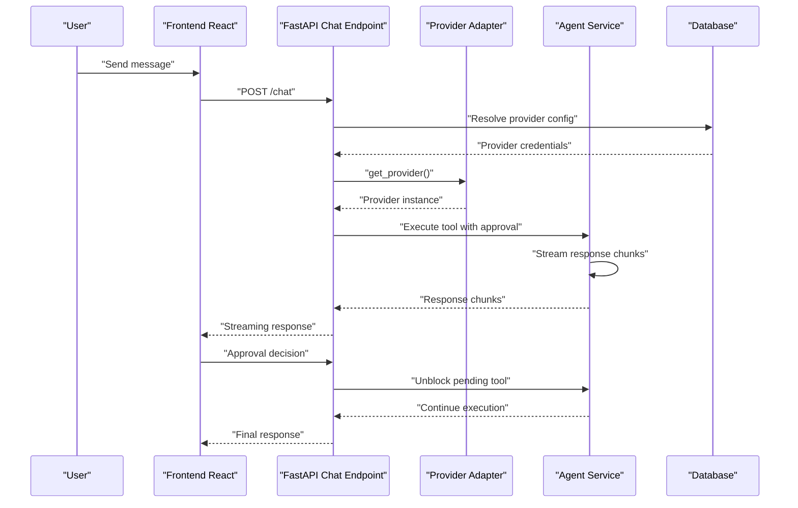

**Diagram sources**
- [backend/api/chat.py:1-350](file://backend/api/chat.py#L1-L350)
- [backend/providers/base.py:1-200](file://backend/providers/base.py#L1-L200)
- [backend/services/agent.py:1-300](file://backend/services/agent.py#L1-L300)
- [backend/database.py:1-200](file://backend/database.py#L1-L200)
- [frontend/src/api/chat.ts:1-200](file://frontend/src/api/chat.ts#L1-L200)

## Detailed Component Analysis

### Command Pattern: Payload-Based Execution
- Purpose: Encapsulate each BIM operation as a command with a standardized payload envelope.
- Implementation:
  - Dispatch function routes payloads to action-specific handlers. See [backend/services/agent.py:80-120](file://backend/services/agent.py#L80-L120).
  - Handlers execute create_level and create_grid actions. See [backend/services/agent.py:150-180](file://backend/services/agent.py#L150-L180).
  - Validation ensures payload shape and schema compliance before dispatch. See [backend/services/agent.py:120-140](file://backend/services/agent.py#L120-L140).
- Benefits:
  - Clear separation between payload definition and execution logic
  - Easy addition of new commands by extending the dispatcher
  - Consistent result format for reporting and UI

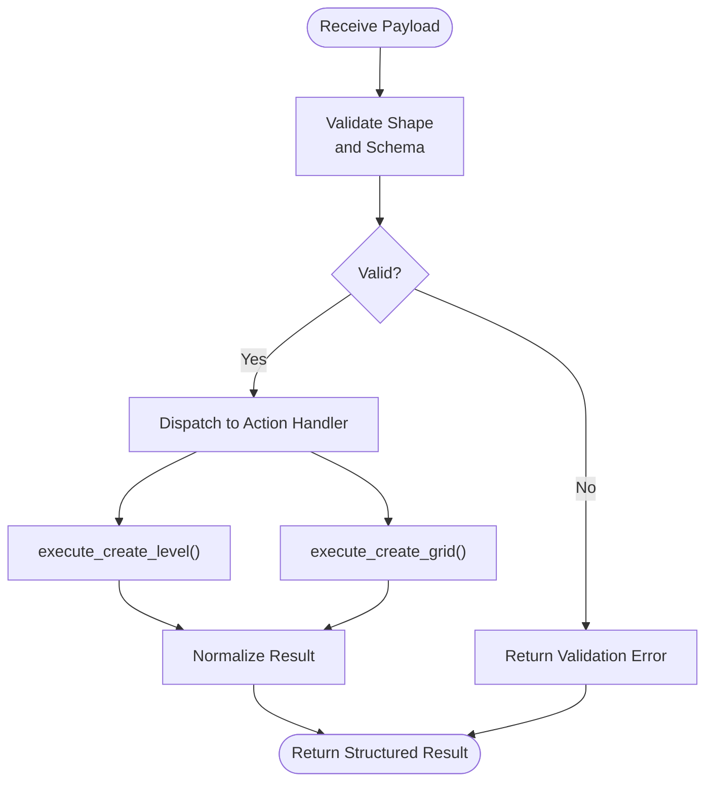

**Diagram sources**
- [backend/services/agent.py:80-120](file://backend/services/agent.py#L80-L120)
- [backend/services/agent.py:120-140](file://backend/services/agent.py#L120-L140)
- [backend/services/agent.py:150-180](file://backend/services/agent.py#L150-L180)
- [backend/services/agent.py:180-220](file://backend/services/agent.py#L180-L220)

**Section sources**
- [backend/services/agent.py:80-120](file://backend/services/agent.py#L80-L120)
- [backend/services/agent.py:120-140](file://backend/services/agent.py#L120-L140)
- [backend/services/agent.py:150-180](file://backend/services/agent.py#L150-L180)
- [backend/services/agent.py:180-220](file://backend/services/agent.py#L180-L220)

### Validator Pattern: Comprehensive Input Validation
- Purpose: Provide reusable validation logic independent of execution.
- Implementation:
  - Pure validator functions check payload shape, required fields, duplicates, and numeric constraints. See [backend/services/tool_registry.py:60-120](file://backend/services/tool_registry.py#L60-L120).
  - Schemas define required fields and types for tool execution. See [backend/schemas/tools.json:1-200](file://backend/schemas/tools.json#L1-L200).
  - Workflow orchestrates validation before execution. See [backend/services/agent.py:120-140](file://backend/services/agent.py#L120-L140).
- Benefits:
  - Separation of validation from execution allows testing and reuse
  - Early failure detection prevents invalid operations
  - Extensible schema system supports evolving payload formats

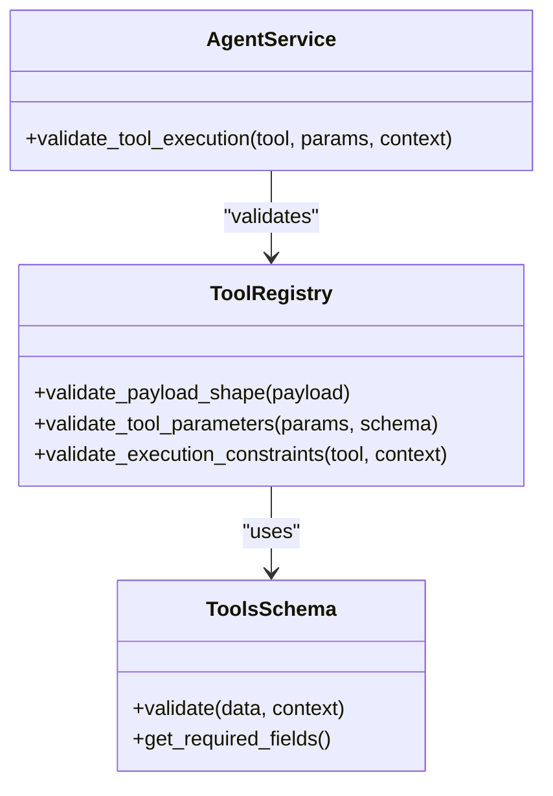

**Diagram sources**
- [backend/services/tool_registry.py:60-120](file://backend/services/tool_registry.py#L60-L120)
- [backend/schemas/tools.json:1-200](file://backend/schemas/tools.json#L1-L200)
- [backend/services/agent.py:120-140](file://backend/services/agent.py#L120-L140)

**Section sources**
- [backend/services/tool_registry.py:60-120](file://backend/services/tool_registry.py#L60-L120)
- [backend/schemas/tools.json:1-200](file://backend/schemas/tools.json#L1-L200)
- [backend/services/agent.py:120-140](file://backend/services/agent.py#L120-L140)

### Factory Pattern: Dynamic Payload Generation
- Purpose: Translate parsed instructions into standardized payloads.
- Implementation:
  - Agent service maps instruction types to payload factories. See [backend/services/agent.py:40-70](file://backend/services/agent.py#L40-L70).
  - Factories generate tool execution payloads with parameter validation and defaults. See [backend/services/agent.py:90-110](file://backend/services/agent.py#L90-L110).
  - Context-aware conflict detection prevents duplicates. See [backend/services/agent.py:140-150](file://backend/services/agent.py#L140-L150).
- Benefits:
  - Centralized payload creation logic
  - Parameter validation and defaults handled consistently
  - Context-aware validation prevents conflicts

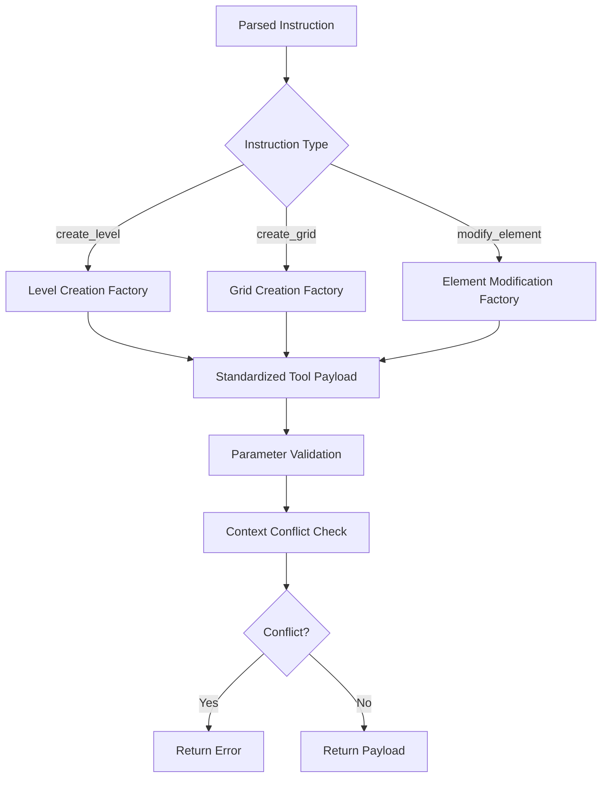

**Diagram sources**
- [backend/services/agent.py:40-70](file://backend/services/agent.py#L40-L70)
- [backend/services/agent.py:90-110](file://backend/services/agent.py#L90-L110)
- [backend/services/agent.py:140-150](file://backend/services/agent.py#L140-L150)

**Section sources**
- [backend/services/agent.py:40-70](file://backend/services/agent.py#L40-L70)
- [backend/services/agent.py:90-110](file://backend/services/agent.py#L90-L110)
- [backend/services/agent.py:140-150](file://backend/services/agent.py#L140-L150)

### Observer Pattern: Approval-Based Workflows
- Purpose: Gate execution with explicit user approvals.
- Implementation:
  - Frontend Approval Modal displays pending tool execution and collects user decisions. See [frontend/src/components/ApprovalModal.tsx:1-200](file://frontend/src/components/ApprovalModal.tsx#L1-L200).
  - Backend approval store manages pending approvals and unblocking. See [frontend/src/store/approvalStore.ts:1-150](file://frontend/src/store/approvalStore.ts#L1-L150).
  - Chat endpoint enforces approval gates before tool execution. See [backend/api/chat.py:270-310](file://backend/api/chat.py#L270-L310).
- Benefits:
  - Human-in-the-loop safety for potentially destructive operations
  - Explicit approval reduces risk of unintended tool execution
  - Separation of UI concerns from execution logic

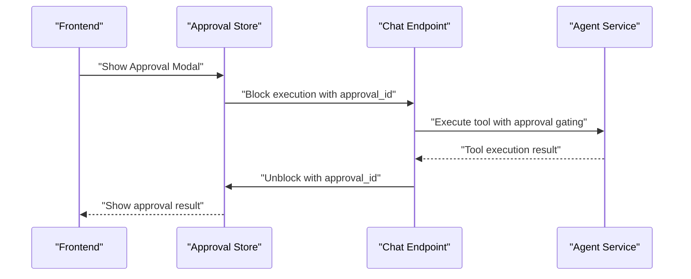

**Diagram sources**
- [frontend/src/components/ApprovalModal.tsx:1-200](file://frontend/src/components/ApprovalModal.tsx#L1-L200)
- [frontend/src/store/approvalStore.ts:1-150](file://frontend/src/store/approvalStore.ts#L1-L150)
- [backend/api/chat.py:270-310](file://backend/api/chat.py#L270-L310)

**Section sources**
- [frontend/src/components/ApprovalModal.tsx:1-200](file://frontend/src/components/ApprovalModal.tsx#L1-L200)
- [frontend/src/store/approvalStore.ts:1-150](file://frontend/src/store/approvalStore.ts#L1-L150)
- [backend/api/chat.py:270-310](file://backend/api/chat.py#L270-L310)

### Strategy Pattern: Parsing Approaches
- Purpose: Compose multiple parsing strategies to interpret controlled natural language.
- Implementation:
  - Agent service uses multiple parsing strategies for different instruction types. See [backend/services/agent.py:20-35](file://backend/services/agent.py#L20-L35).
  - Strategies handle level creation, grid creation, and element modification patterns. See [backend/services/agent.py:120-140](file://backend/services/agent.py#L120-L140).
- Benefits:
  - Extensible parsing without modifying core logic
  - Controlled grammar prevents ambiguity
  - Clear separation between patterns and strategy selection

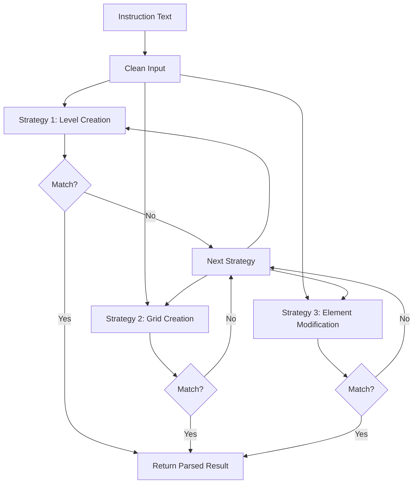

**Diagram sources**
- [backend/services/agent.py:20-35](file://backend/services/agent.py#L20-L35)
- [backend/services/agent.py:120-140](file://backend/services/agent.py#L120-L140)

**Section sources**
- [backend/services/agent.py:20-35](file://backend/services/agent.py#L20-L35)
- [backend/services/agent.py:120-140](file://backend/services/agent.py#L120-L140)

### Template Method Pattern: Standardized Execution Flows
- Purpose: Define a fixed execution sequence with hooks for customization.
- Implementation:
  - Agent service orchestrates the tool execution flow: prepare context, parse/translate, validate, execute, stream results. See [backend/services/agent.py:1-20](file://backend/services/agent.py#L1-L20) and [backend/services/agent.py:180-220](file://backend/services/agent.py#L180-L220).
  - Streaming service handles real-time response delivery. See [backend/services/streaming.py:1-250](file://backend/services/streaming.py#L1-L250).
- Benefits:
  - Consistent flow across different tool types
  - Hooks for customization (e.g., streaming callbacks)
  - Predictable behavior and easier debugging

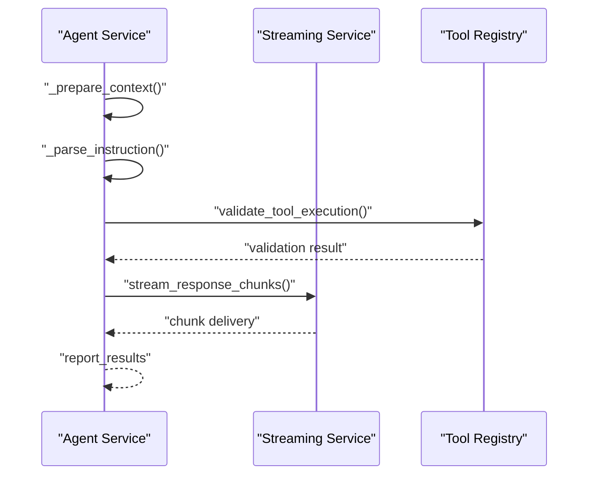

**Diagram sources**
- [backend/services/agent.py:1-20](file://backend/services/agent.py#L1-L20)
- [backend/services/agent.py:180-220](file://backend/services/agent.py#L180-L220)
- [backend/services/streaming.py:1-250](file://backend/services/streaming.py#L1-L250)

**Section sources**
- [backend/services/agent.py:1-20](file://backend/services/agent.py#L1-L20)
- [backend/services/agent.py:180-220](file://backend/services/agent.py#L180-L220)
- [backend/services/streaming.py:1-250](file://backend/services/streaming.py#L1-L250)

## FastAPI Architecture Patterns
- Purpose: Implement RESTful API design with modern Python web framework.
- Implementation:
  - Main application entry point with dependency injection and CORS configuration. See [backend/main.py:1-50](file://backend/main.py#L1-L50).
  - Chat endpoint with streaming response support and approval gating. See [backend/api/chat.py:1-80](file://backend/api/chat.py#L1-L80) and [backend/api/chat.py:240-310](file://backend/api/chat.py#L240-L310).
  - Providers endpoint for managing AI service configurations. See [backend/api/providers.py:1-200](file://backend/api/providers.py#L1-L200).
  - Sessions endpoint for managing conversation history. See [backend/api/sessions.py:1-150](file://backend/api/sessions.py#L1-L150).
  - Settings endpoint for global configuration management. See [backend/api/settings.py:1-120](file://backend/api/settings.py#L1-L120).
- Benefits:
  - Automatic OpenAPI documentation generation
  - Built-in request validation and serialization
  - Dependency injection for clean service composition
  - Streaming responses for real-time communication

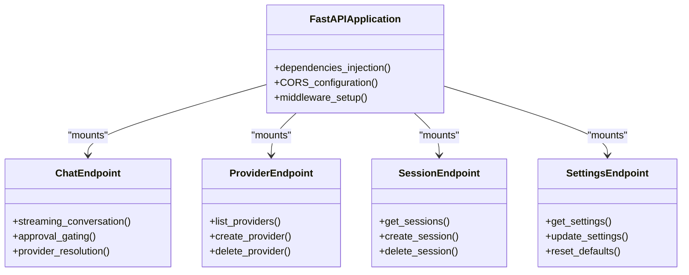

**Diagram sources**
- [backend/main.py:1-50](file://backend/main.py#L1-L50)
- [backend/api/chat.py:1-80](file://backend/api/chat.py#L1-L80)
- [backend/api/providers.py:1-200](file://backend/api/providers.py#L1-L200)
- [backend/api/sessions.py:1-150](file://backend/api/sessions.py#L1-L150)
- [backend/api/settings.py:1-120](file://backend/api/settings.py#L1-L120)

**Section sources**
- [backend/main.py:1-50](file://backend/main.py#L1-L50)
- [backend/api/chat.py:1-80](file://backend/api/chat.py#L1-L80)
- [backend/api/chat.py:240-310](file://backend/api/chat.py#L240-L310)
- [backend/api/providers.py:1-200](file://backend/api/providers.py#L1-L200)
- [backend/api/sessions.py:1-150](file://backend/api/sessions.py#L1-L150)
- [backend/api/settings.py:1-120](file://backend/api/settings.py#L1-L120)

## Provider Adapter Pattern
- Purpose: Abstract AI service implementations behind a common interface.
- Implementation:
  - Base provider interface defines common methods for all AI services. See [backend/providers/base.py:1-200](file://backend/providers/base.py#L1-L200).
  - Concrete provider implementations for OpenAI, Anthropic, Gemini, Groq, and OpenRouter. See [backend/providers/openai.py:1-150](file://backend/providers/openai.py#L1-L150), [backend/providers/anthropic.py:1-150](file://backend/providers/anthropic.py#L1-L150), [backend/providers/gemini.py:1-150](file://backend/providers/gemini.py#L1-L150), [backend/providers/groq.py:1-150](file://backend/providers/groq.py#L1-L150), [backend/providers/openrouter.py:1-150](file://backend/providers/openrouter.py#L1-L150).
  - Compatibility layer for OpenAI-compatible APIs. See [backend/providers/openai_compat.py:1-150](file://backend/providers/openai_compat.py#L1-L150).
  - Provider factory resolves appropriate implementation based on configuration. See [backend/api/providers.py:1-200](file://backend/api/providers.py#L1-L200).
- Benefits:
  - Pluggable AI service architecture
  - Consistent interface across different providers
  - Easy switching between AI services
  - Support for multiple provider types and compatibility layers

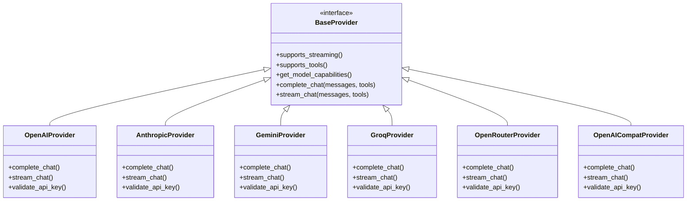

**Diagram sources**
- [backend/providers/base.py:1-200](file://backend/providers/base.py#L1-L200)
- [backend/providers/openai.py:1-150](file://backend/providers/openai.py#L1-L150)
- [backend/providers/anthropic.py:1-150](file://backend/providers/anthropic.py#L1-L150)
- [backend/providers/gemini.py:1-150](file://backend/providers/gemini.py#L1-L150)
- [backend/providers/groq.py:1-150](file://backend/providers/groq.py#L1-L150)
- [backend/providers/openrouter.py:1-150](file://backend/providers/openrouter.py#L1-L150)
- [backend/providers/openai_compat.py:1-150](file://backend/providers/openai_compat.py#L1-L150)

**Section sources**
- [backend/providers/base.py:1-200](file://backend/providers/base.py#L1-L200)
- [backend/providers/openai.py:1-150](file://backend/providers/openai.py#L1-L150)
- [backend/providers/anthropic.py:1-150](file://backend/providers/anthropic.py#L1-L150)
- [backend/providers/gemini.py:1-150](file://backend/providers/gemini.py#L1-L150)
- [backend/providers/groq.py:1-150](file://backend/providers/groq.py#L1-L150)
- [backend/providers/openrouter.py:1-150](file://backend/providers/openrouter.py#L1-L150)
- [backend/providers/openai_compat.py:1-150](file://backend/providers/openai_compat.py#L1-L150)
- [backend/api/providers.py:1-200](file://backend/api/providers.py#L1-L200)

## Human-in-the-Loop Approval Workflows
- Purpose: Enable explicit user approval for potentially risky tool executions.
- Implementation:
  - Approval modal component displays pending tool execution details. See [frontend/src/components/ApprovalModal.tsx:1-200](file://frontend/src/components/ApprovalModal.tsx#L1-L200).
  - Approval store manages approval state and communication with backend. See [frontend/src/store/approvalStore.ts:1-150](file://frontend/src/store/approvalStore.ts#L1-L150).
  - Chat endpoint implements approval gating mechanism. See [backend/api/chat.py:240-310](file://backend/api/chat.py#L240-L310).
  - Hook-based approval handling in frontend chat functionality. See [frontend/src/hooks/useChat.ts:1-120](file://frontend/src/hooks/useChat.ts#L1-L120).
- Benefits:
  - Safety-first approach to tool execution
  - Transparent approval process for users
  - Flexible approval decision handling
  - Real-time approval feedback

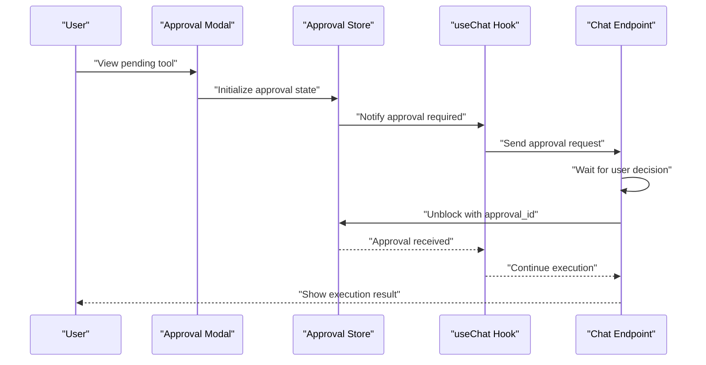

**Diagram sources**
- [frontend/src/components/ApprovalModal.tsx:1-200](file://frontend/src/components/ApprovalModal.tsx#L1-L200)
- [frontend/src/store/approvalStore.ts:1-150](file://frontend/src/store/approvalStore.ts#L1-L150)
- [frontend/src/hooks/useChat.ts:1-120](file://frontend/src/hooks/useChat.ts#L1-L120)
- [backend/api/chat.py:240-310](file://backend/api/chat.py#L240-L310)

**Section sources**
- [frontend/src/components/ApprovalModal.tsx:1-200](file://frontend/src/components/ApprovalModal.tsx#L1-L200)
- [frontend/src/store/approvalStore.ts:1-150](file://frontend/src/store/approvalStore.ts#L1-L150)
- [frontend/src/hooks/useChat.ts:1-120](file://frontend/src/hooks/useChat.ts#L1-L120)
- [backend/api/chat.py:240-310](file://backend/api/chat.py#L240-L310)

## Frontend-Backend Integration Patterns
- Purpose: Establish seamless communication between React frontend and FastAPI backend.
- Implementation:
  - API client wrapper for HTTP requests with authentication. See [frontend/src/api/client.ts:1-150](file://frontend/src/api/client.ts#L1-L150).
  - Chat API module handles conversation endpoints and streaming. See [frontend/src/api/chat.ts:1-200](file://frontend/src/api/chat.ts#L1-L200).
  - Custom React hooks for managing chat state and approval flows. See [frontend/src/hooks/useChat.ts:1-120](file://frontend/src/hooks/useChat.ts#L1-L120).
  - Real-time state management with Zustand stores. See [frontend/src/store/approvalStore.ts:1-150](file://frontend/src/store/approvalStore.ts#L1-L150).
- Benefits:
  - Type-safe API communication
  - Reactive state management
  - Seamless streaming response handling
  - Clean separation of concerns between UI and business logic

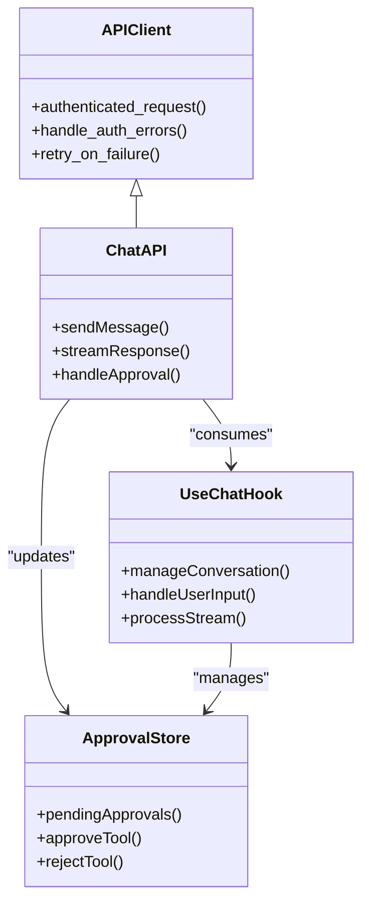

**Diagram sources**
- [frontend/src/api/client.ts:1-150](file://frontend/src/api/client.ts#L1-L150)
- [frontend/src/api/chat.ts:1-200](file://frontend/src/api/chat.ts#L1-L200)
- [frontend/src/hooks/useChat.ts:1-120](file://frontend/src/hooks/useChat.ts#L1-L120)
- [frontend/src/store/approvalStore.ts:1-150](file://frontend/src/store/approvalStore.ts#L1-L150)

**Section sources**
- [frontend/src/api/client.ts:1-150](file://frontend/src/api/client.ts#L1-L150)
- [frontend/src/api/chat.ts:1-200](file://frontend/src/api/chat.ts#L1-L200)
- [frontend/src/hooks/useChat.ts:1-120](file://frontend/src/hooks/useChat.ts#L1-L120)
- [frontend/src/store/approvalStore.ts:1-150](file://frontend/src/store/approvalStore.ts#L1-L150)

## Streaming Response Patterns
- Purpose: Enable real-time communication between backend and frontend through streaming responses.
- Implementation:
  - Streaming service handles chunked response delivery. See [backend/services/streaming.py:1-250](file://backend/services/streaming.py#L1-L250).
  - Chat endpoint implements server-sent events for streaming. See [backend/api/chat.py:1-80](file://backend/api/chat.py#L1-L80).
  - Frontend API client processes streaming responses. See [frontend/src/api/chat.ts:1-200](file://frontend/src/api/chat.ts#L1-L200).
  - React hooks manage streaming state and user interaction. See [frontend/src/hooks/useChat.ts:1-120](file://frontend/src/hooks/useChat.ts#L1-L120).
- Benefits:
  - Real-time response delivery
  - Improved user experience for long-running operations
  - Efficient memory usage for large responses
  - Progressive rendering of content

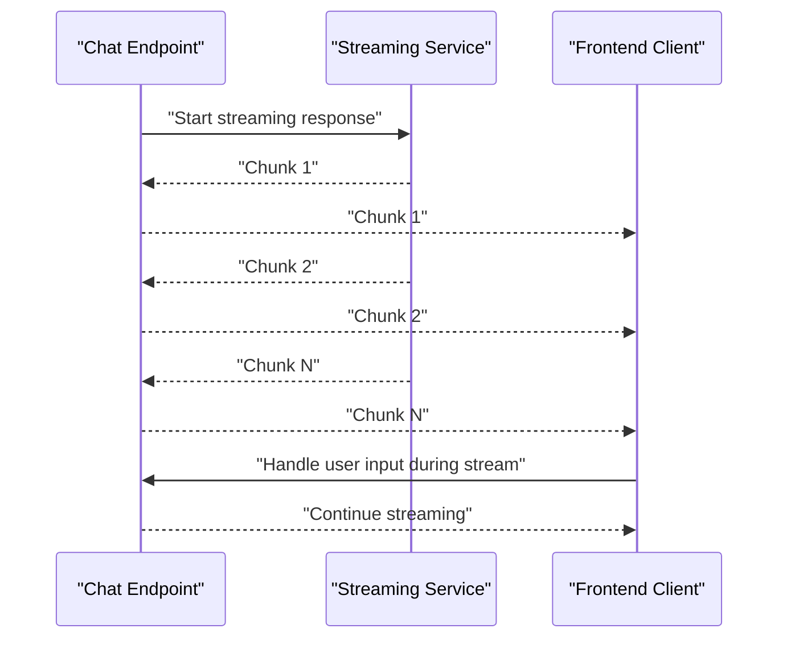

**Diagram sources**
- [backend/services/streaming.py:1-250](file://backend/services/streaming.py#L1-L250)
- [backend/api/chat.py:1-80](file://backend/api/chat.py#L1-L80)
- [frontend/src/api/chat.ts:1-200](file://frontend/src/api/chat.ts#L1-L200)
- [frontend/src/hooks/useChat.ts:1-120](file://frontend/src/hooks/useChat.ts#L1-L120)

**Section sources**
- [backend/services/streaming.py:1-250](file://backend/services/streaming.py#L1-L250)
- [backend/api/chat.py:1-80](file://backend/api/chat.py#L1-L80)
- [frontend/src/api/chat.ts:1-200](file://frontend/src/api/chat.ts#L1-L200)
- [frontend/src/hooks/useChat.ts:1-120](file://frontend/src/hooks/useChat.ts#L1-L120)

## Dependency Analysis
The following diagram highlights key dependencies among pattern implementations:

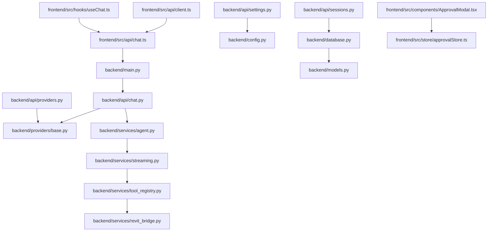

**Diagram sources**
- [backend/main.py:1-50](file://backend/main.py#L1-L50)
- [backend/api/chat.py:1-350](file://backend/api/chat.py#L1-L350)
- [backend/providers/base.py:1-200](file://backend/providers/base.py#L1-L200)
- [backend/services/agent.py:1-300](file://backend/services/agent.py#L1-L300)
- [backend/api/providers.py:1-200](file://backend/api/providers.py#L1-L200)
- [backend/api/sessions.py:1-150](file://backend/api/sessions.py#L1-L150)
- [backend/api/settings.py:1-120](file://backend/api/settings.py#L1-L120)
- [backend/services/streaming.py:1-250](file://backend/services/streaming.py#L1-L250)
- [backend/services/tool_registry.py:1-200](file://backend/services/tool_registry.py#L1-L200)
- [backend/services/revit_bridge.py:1-200](file://backend/services/revit_bridge.py#L1-L200)
- [backend/database.py:1-200](file://backend/database.py#L1-L200)
- [backend/models.py:1-250](file://backend/models.py#L1-L250)
- [backend/config.py:1-150](file://backend/config.py#L1-L150)
- [frontend/src/api/chat.ts:1-200](file://frontend/src/api/chat.ts#L1-L200)
- [frontend/src/api/client.ts:1-150](file://frontend/src/api/client.ts#L1-L150)
- [frontend/src/components/ApprovalModal.tsx:1-200](file://frontend/src/components/ApprovalModal.tsx#L1-L200)
- [frontend/src/store/approvalStore.ts:1-150](file://frontend/src/store/approvalStore.ts#L1-L150)
- [frontend/src/hooks/useChat.ts:1-120](file://frontend/src/hooks/useChat.ts#L1-L120)

**Section sources**
- [backend/main.py:1-50](file://backend/main.py#L1-L50)
- [backend/api/chat.py:1-350](file://backend/api/chat.py#L1-L350)
- [backend/providers/base.py:1-200](file://backend/providers/base.py#L1-L200)
- [backend/services/agent.py:1-300](file://backend/services/agent.py#L1-L300)
- [backend/api/providers.py:1-200](file://backend/api/providers.py#L1-L200)
- [backend/api/sessions.py:1-150](file://backend/api/sessions.py#L1-L150)
- [backend/api/settings.py:1-120](file://backend/api/settings.py#L1-L120)
- [backend/services/streaming.py:1-250](file://backend/services/streaming.py#L1-L250)
- [backend/services/tool_registry.py:1-200](file://backend/services/tool_registry.py#L1-L200)
- [backend/services/revit_bridge.py:1-200](file://backend/services/revit_bridge.py#L1-L200)
- [backend/database.py:1-200](file://backend/database.py#L1-L200)
- [backend/models.py:1-250](file://backend/models.py#L1-L250)
- [backend/config.py:1-150](file://backend/config.py#L1-L150)
- [frontend/src/api/chat.ts:1-200](file://frontend/src/api/chat.ts#L1-L200)
- [frontend/src/api/client.ts:1-150](file://frontend/src/api/client.ts#L1-L150)
- [frontend/src/components/ApprovalModal.tsx:1-200](file://frontend/src/components/ApprovalModal.tsx#L1-L200)
- [frontend/src/store/approvalStore.ts:1-150](file://frontend/src/store/approvalStore.ts#L1-L150)
- [frontend/src/hooks/useChat.ts:1-120](file://frontend/src/hooks/useChat.ts#L1-L120)

## Performance Considerations
- FastAPI provides excellent performance with automatic request validation and serialization
- Provider adapter pattern enables caching and connection pooling for better resource utilization
- Streaming responses reduce memory usage and improve perceived performance for long operations
- Human-in-the-loop approvals add minimal latency while ensuring safety
- Database queries are optimized through proper indexing and connection management
- Frontend state management minimizes unnecessary re-renders through selective state updates

## Troubleshooting Guide
- FastAPI endpoint errors: Check dependency injection configuration and route definitions. See [backend/main.py:1-50](file://backend/main.py#L1-L50) and [backend/api/chat.py:1-80](file://backend/api/chat.py#L1-L80).
- Provider adapter failures: Verify API keys and provider configuration. See [backend/providers/base.py:1-200](file://backend/providers/base.py#L1-L200) and [backend/api/providers.py:1-200](file://backend/api/providers.py#L1-L200).
- Approval workflow issues: Check approval store state and frontend modal integration. See [frontend/src/store/approvalStore.ts:1-150](file://frontend/src/store/approvalStore.ts#L1-L150) and [frontend/src/components/ApprovalModal.tsx:1-200](file://frontend/src/components/ApprovalModal.tsx#L1-L200).
- Streaming response problems: Verify backend streaming implementation and frontend event handling. See [backend/services/streaming.py:1-250](file://backend/services/streaming.py#L1-L250) and [frontend/src/api/chat.ts:1-200](file://frontend/src/api/chat.ts#L1-L200).
- Database connectivity: Check connection strings and migration status. See [backend/database.py:1-200](file://backend/database.py#L1-L200) and [backend/migrations.py:1-100](file://backend/migrations.py#L1-L100).

**Section sources**
- [backend/main.py:1-50](file://backend/main.py#L1-L50)
- [backend/api/chat.py:1-80](file://backend/api/chat.py#L1-L80)
- [backend/providers/base.py:1-200](file://backend/providers/base.py#L1-L200)
- [backend/api/providers.py:1-200](file://backend/api/providers.py#L1-L200)
- [frontend/src/store/approvalStore.ts:1-150](file://frontend/src/store/approvalStore.ts#L1-L150)
- [frontend/src/components/ApprovalModal.tsx:1-200](file://frontend/src/components/ApprovalModal.tsx#L1-L200)
- [backend/services/streaming.py:1-250](file://backend/services/streaming.py#L1-L250)
- [frontend/src/api/chat.ts:1-200](file://frontend/src/api/chat.ts#L1-L200)
- [backend/database.py:1-200](file://backend/database.py#L1-L200)
- [backend/migrations.py:1-100](file://backend/migrations.py#L1-L100)

## Conclusion
The AI Revit Agent leverages well-established design patterns to achieve a robust, deterministic, and extensible BIM automation system with modern web architecture:
- Command Pattern encapsulates operations and enables easy extension
- Validator Pattern centralizes correctness checks for reliability
- Factory Pattern transforms natural language into standardized payloads
- Observer Pattern enforces human-in-the-loop approvals
- Strategy Pattern cleanly composes parsing approaches
- Template Method Pattern standardizes execution flows
- **New**: FastAPI Architecture Pattern provides RESTful API design with streaming support
- **New**: Provider Adapter Pattern abstracts AI service implementations for flexibility
- **New**: Enhanced Human-in-the-Loop Approval Workflow ensures safety with real-time communication
- **New**: Frontend-Backend Integration Patterns enable seamless web application architecture
- **New**: Streaming Response Patterns deliver real-time communication capabilities

These patterns interact cohesively: FastAPI endpoints handle HTTP requests with streaming responses, provider adapters abstract AI service implementations, human-in-the-loop approvals gate tool execution, and real-time communication bridges frontend and backend. The template method pattern ensures consistent execution flows while the observer pattern maintains safety through explicit user approvals. This architecture balances safety, maintainability, extensibility, and modern web development practices, supporting both human-authored and AI-generated workflows.