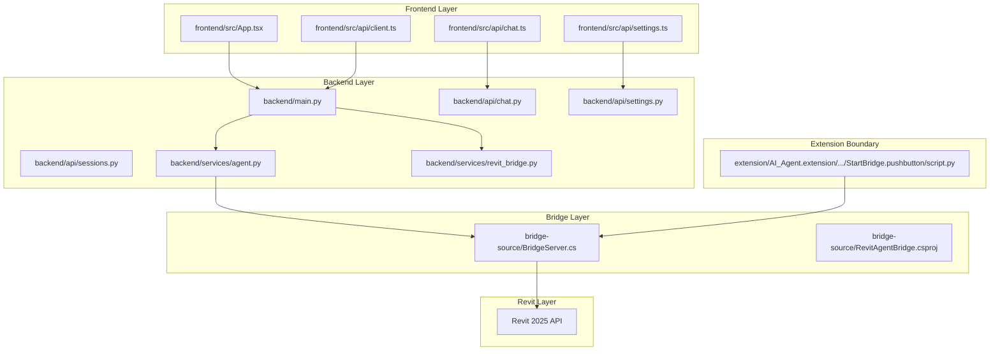
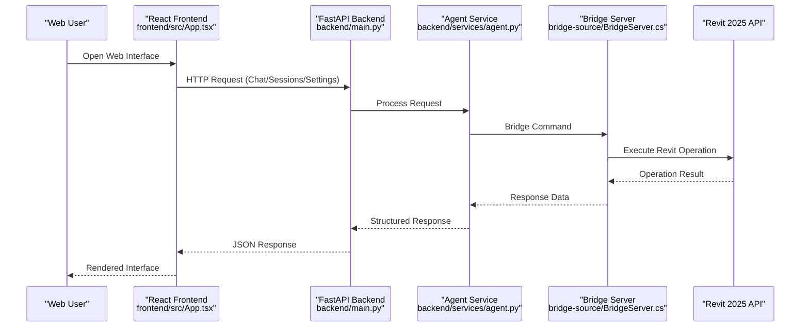
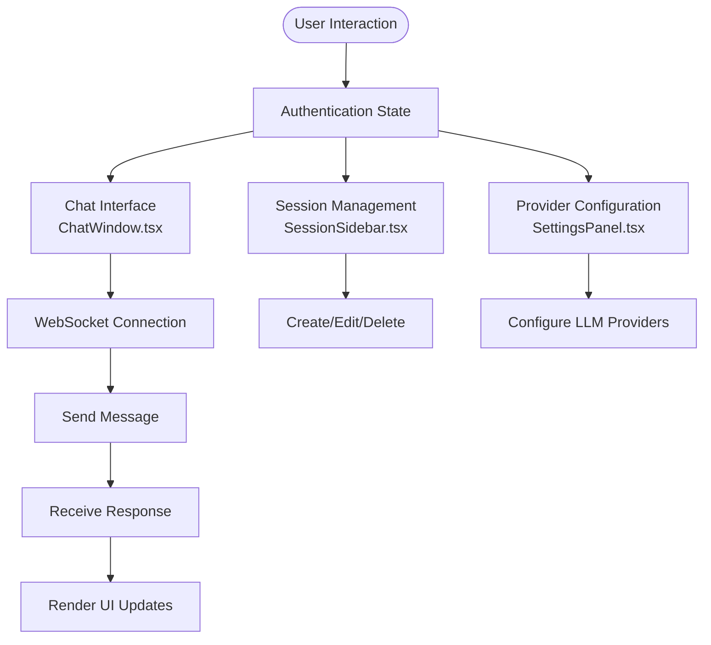
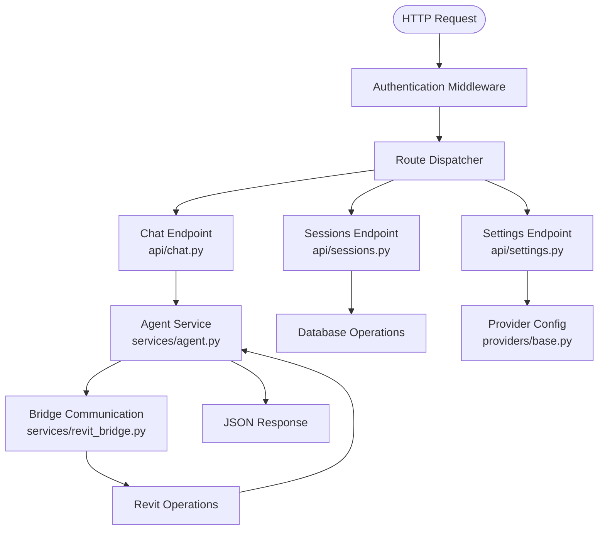
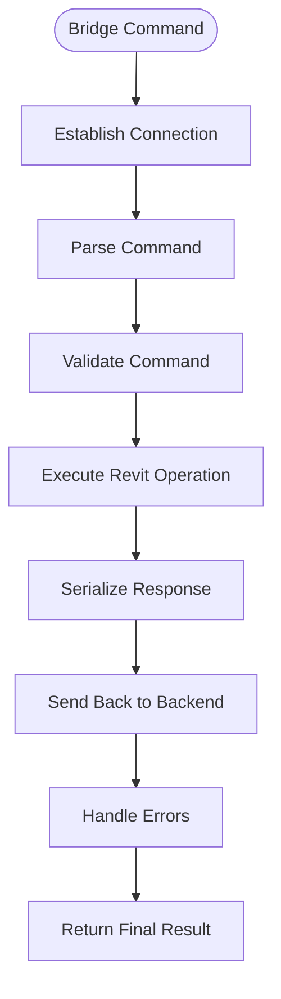
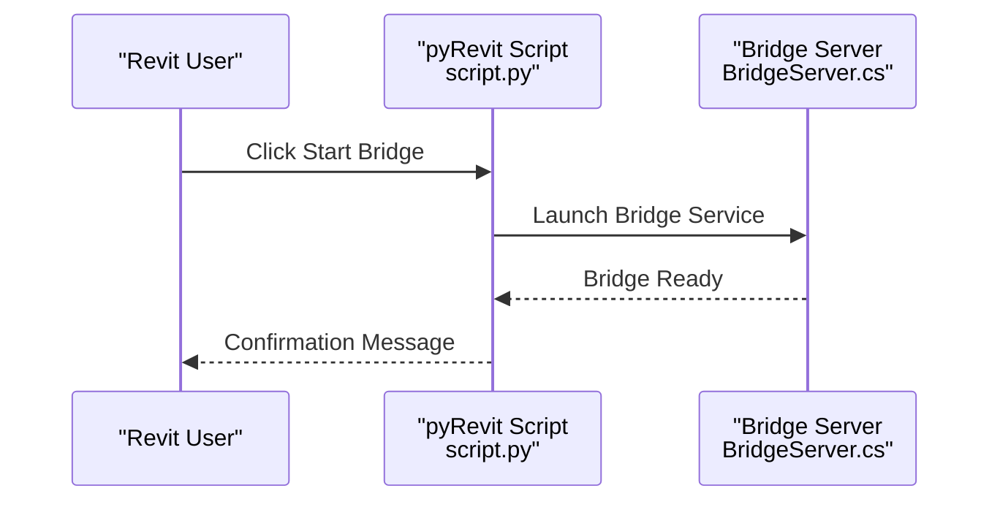
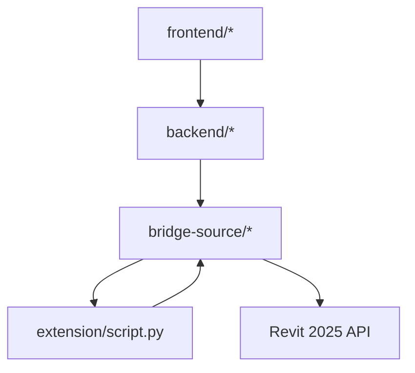

# Layered Architecture Overview

<cite>
**Referenced Files in This Document**
- [README.md](file://README.md)
- [script.py](file://extension/AI_Agent.extension/AI_Agent.tab/Panel.panel/StartBridge.pushbutton/script.py)
- [main.py](file://backend/main.py)
- [chat.py](file://backend/api/chat.py)
- [sessions.py](file://backend/api/sessions.py)
- [settings.py](file://backend/api/settings.py)
- [providers/base.py](file://backend/providers/base.py)
- [agent.py](file://backend/services/agent.py)
- [revit_bridge.py](file://backend/services/revit_bridge.py)
- [streaming.py](file://backend/services/streaming.py)
- [tool_registry.py](file://backend/services/tool_registry.py)
- [BridgeServer.cs](file://bridge-source/BridgeServer.cs)
- [chat.ts](file://frontend/src/api/chat.ts)
- [client.ts](file://frontend/src/api/client.ts)
- [settings.ts](file://frontend/src/api/settings.ts)
- [App.tsx](file://frontend/src/App.tsx)
- [main.tsx](file://frontend/src/main.tsx)
</cite>

## Update Summary
**Changes Made**
- Updated architecture to reflect new four-layer design: React Frontend → FastAPI Backend → C# Bridge → Revit 2025
- Replaced previous CLI daemon architecture with modern web-based communication
- Added comprehensive documentation for new frontend-backend integration patterns
- Updated component analysis to reflect new service-oriented architecture
- Enhanced bridge server documentation for C# integration layer

## Table of Contents
1. [Introduction](#introduction)
2. [Project Structure](#project-structure)
3. [Core Components](#core-components)
4. [Architecture Overview](#architecture-overview)
5. [Detailed Component Analysis](#detailed-component-analysis)
6. [Dependency Analysis](#dependency-analysis)
7. [Performance Considerations](#performance-considerations)
8. [Troubleshooting Guide](#troubleshooting-guide)
9. [Conclusion](#conclusion)

## Introduction
This document explains the layered architecture pattern implemented in AI Revit Agent, grounded in clean architecture principles. The system is organized into four distinct layers:
- React Frontend: Modern web interface for user interaction and real-time communication
- FastAPI Backend: RESTful API server handling business logic, provider integrations, and session management
- C# Bridge: Native Windows service bridging web communication to Revit API
- Revit 2025: Direct API abstraction for document access, levels, grids, transactions, and UI

The design enforces dependency inversion: higher layers depend only on abstractions and interfaces exposed by lower layers, not on their implementations. Data flows unidirectionally from web-based user input through API endpoints to the native bridge and Revit operations. This structure improves testability, maintainability, and extensibility, and accommodates the pyRevit extension boundary and desktop application constraints.

## Project Structure
The repository is organized by functional layers and responsibilities. The pyRevit extension boundary is isolated under the extension directory, with a minimal entrypoint that delegates control to the bridge layer.

**Diagram sources**
- [App.tsx:1-50](file://frontend/src/App.tsx#L1-L50)
- [chat.ts:1-80](file://frontend/src/api/chat.ts#L1-L80)
- [client.ts:1-60](file://frontend/src/api/client.ts#L1-L60)
- [settings.ts:1-40](file://frontend/src/api/settings.ts#L1-L40)
- [main.py:1-100](file://backend/main.py#L1-L100)
- [chat.py:1-80](file://backend/api/chat.py#L1-L80)
- [sessions.py:1-60](file://backend/api/sessions.py#L1-L60)
- [settings.py:1-40](file://backend/api/settings.py#L1-L40)
- [agent.py:1-120](file://backend/services/agent.py#L1-L120)
- [revit_bridge.py:1-80](file://backend/services/revit_bridge.py#L1-L80)
- [BridgeServer.cs:1-150](file://bridge-source/BridgeServer.cs#L1-L150)
- [script.py:1-50](file://extension/AI_Agent.extension/AI_Agent.tab/Panel.panel/StartBridge.pushbutton/script.py#L1-L50)

**Section sources**
- [README.md:14-35](file://README.md#L14-L35)
- [script.py:1-50](file://extension/AI_Agent.extension/AI_Agent.tab/Panel.panel/StartBridge.pushbutton/script.py#L1-L50)

## Core Components
- React Frontend: Real-time chat interface with WebSocket connections, state management, and provider selection
- FastAPI Backend: RESTful API with authentication, session management, and provider integrations
- C# Bridge: Native Windows service handling bidirectional communication between web and Revit
- Revit 2025: Direct API abstraction for document access, levels, grids, transactions, and UI dialogs

These components enforce dependency inversion and unidirectional data flow, ensuring that higher layers remain free of lower-layer concerns.

**Section sources**
- [README.md:14-35](file://README.md#L14-L35)
- [App.tsx:1-50](file://frontend/src/App.tsx#L1-L50)
- [main.py:1-100](file://backend/main.py#L1-L100)
- [BridgeServer.cs:1-150](file://bridge-source/BridgeServer.cs#L1-L150)

## Architecture Overview
The system's runtime flow demonstrates clean architecture boundaries and dependency inversion with modern web integration:

**Diagram sources**
- [App.tsx:1-50](file://frontend/src/App.tsx#L1-L50)
- [main.py:1-100](file://backend/main.py#L1-L100)
- [agent.py:1-120](file://backend/services/agent.py#L1-L120)
- [revit_bridge.py:1-80](file://backend/services/revit_bridge.py#L1-L80)
- [BridgeServer.cs:1-150](file://bridge-source/BridgeServer.cs#L1-L150)

## Detailed Component Analysis

### React Frontend Layer
The frontend provides a modern web interface with real-time communication capabilities and comprehensive state management.

**Diagram sources**
- [App.tsx:1-50](file://frontend/src/App.tsx#L1-L50)
- [main.tsx:1-40](file://frontend/src/main.tsx#L1-L40)
- [chat.ts:1-80](file://frontend/src/api/chat.ts#L1-L80)
- [client.ts:1-60](file://frontend/src/api/client.ts#L1-L60)
- [settings.ts:1-40](file://frontend/src/api/settings.ts#L1-L40)

Key responsibilities:
- Real-time chat interface with WebSocket connections
- State management across multiple UI components
- Provider configuration and session management
- Error handling and user feedback systems

**Section sources**
- [App.tsx:1-50](file://frontend/src/App.tsx#L1-L50)
- [main.tsx:1-40](file://frontend/src/main.tsx#L1-L40)
- [chat.ts:1-80](file://frontend/src/api/chat.ts#L1-L80)
- [client.ts:1-60](file://frontend/src/api/client.ts#L1-L60)
- [settings.ts:1-40](file://frontend/src/api/settings.ts#L1-L40)

### FastAPI Backend Layer
The backend serves as the central API gateway handling all business logic and external integrations.

**Diagram sources**
- [main.py:1-100](file://backend/main.py#L1-L100)
- [chat.py:1-80](file://backend/api/chat.py#L1-L80)
- [sessions.py:1-60](file://backend/api/sessions.py#L1-L60)
- [settings.py:1-40](file://backend/api/settings.py#L1-L40)
- [agent.py:1-120](file://backend/services/agent.py#L1-L120)
- [providers/base.py:1-80](file://backend/providers/base.py#L1-L80)
- [revit_bridge.py:1-80](file://backend/services/revit_bridge.py#L1-L80)

Key responsibilities:
- RESTful API endpoints for all frontend interactions
- Authentication and authorization middleware
- Business logic orchestration and request validation
- External provider integrations and configuration management

**Section sources**
- [main.py:1-100](file://backend/main.py#L1-L100)
- [chat.py:1-80](file://backend/api/chat.py#L1-L80)
- [sessions.py:1-60](file://backend/api/sessions.py#L1-L60)
- [settings.py:1-40](file://backend/api/settings.py#L1-L40)
- [agent.py:1-120](file://backend/services/agent.py#L1-L120)
- [providers/base.py:1-80](file://backend/providers/base.py#L1-L80)

### C# Bridge Layer
The bridge server provides native Windows service communication between the web backend and Revit API.

**Diagram sources**
- [BridgeServer.cs:1-150](file://bridge-source/BridgeServer.cs#L1-L150)
- [revit_bridge.py:1-80](file://backend/services/revit_bridge.py#L1-L80)

Key responsibilities:
- Native Windows service hosting
- Bidirectional communication with web backend
- Command parsing and validation
- Safe Revit API operation execution

**Section sources**
- [BridgeServer.cs:1-150](file://bridge-source/BridgeServer.cs#L1-L150)
- [revit_bridge.py:1-80](file://backend/services/revit_bridge.py#L1-L80)

### PyRevit Extension Boundary
The pyRevit extension provides a minimal entry point for launching the bridge server within the Revit environment.

**Diagram sources**
- [script.py:1-50](file://extension/AI_Agent.extension/AI_Agent.tab/Panel.panel/StartBridge.pushbutton/script.py#L1-L50)
- [BridgeServer.cs:1-150](file://bridge-source/BridgeServer.cs#L1-L150)

**Section sources**
- [script.py:1-50](file://extension/AI_Agent.extension/AI_Agent.tab/Panel.panel/StartBridge.pushbutton/script.py#L1-L50)

## Dependency Analysis
The system enforces dependency inversion by ensuring higher layers depend only on abstractions and interfaces from lower layers. The pyRevit extension boundary is isolated and delegates control to the bridge layer.

**Diagram sources**
- [App.tsx:1-50](file://frontend/src/App.tsx#L1-L50)
- [main.py:1-100](file://backend/main.py#L1-L100)
- [BridgeServer.cs:1-150](file://bridge-source/BridgeServer.cs#L1-L150)
- [script.py:1-50](file://extension/AI_Agent.extension/AI_Agent.tab/Panel.panel/StartBridge.pushbutton/script.py#L1-L50)

Observations:
- Frontend is completely decoupled from backend implementation details
- Backend focuses solely on business logic and API orchestration
- Bridge layer handles platform-specific communication concerns
- Extension boundary remains minimal and focused on service launch

**Section sources**
- [README.md:14-35](file://README.md#L14-L35)
- [main.py:1-100](file://backend/main.py#L1-L100)
- [BridgeServer.cs:1-150](file://bridge-source/BridgeServer.cs#L1-L150)
- [script.py:1-50](file://extension/AI_Agent.extension/AI_Agent.tab/Panel.panel/StartBridge.pushbutton/script.py#L1-L50)

## Performance Considerations
- Frontend uses efficient WebSocket connections for real-time communication
- Backend implements connection pooling and request caching for optimal performance
- Bridge server maintains persistent connections to minimize overhead
- Revit operations are batched and executed efficiently to reduce API calls
- Streaming responses enable progressive UI updates during long-running operations

## Troubleshooting Guide
Common issues and resolution paths:
- Frontend connectivity: Check WebSocket connection status and browser console for errors
- Backend API issues: Verify endpoint availability and authentication tokens
- Bridge communication: Ensure bridge service is running and accessible
- Revit operation failures: Check Revit API permissions and document state
- Cross-platform compatibility: Verify Windows-specific bridge requirements

**Section sources**
- [chat.ts:1-80](file://frontend/src/api/chat.ts#L1-L80)
- [client.ts:1-60](file://frontend/src/api/client.ts#L1-L60)
- [main.py:1-100](file://backend/main.py#L1-L100)
- [BridgeServer.cs:1-150](file://bridge-source/BridgeServer.cs#L1-L150)

## Conclusion
The AI Revit Agent implements a modern, layered architecture that enforces dependency inversion and unidirectional data flow. The React Frontend, FastAPI Backend, C# Bridge, and Revit 2025 layers each serve distinct responsibilities, enabling testability, maintainability, and extensibility. The modern web-based architecture replaces the previous CLI daemon approach with a more scalable and user-friendly solution, while the pyRevit extension boundary remains cleanly isolated, accommodating desktop application constraints while preserving a robust, deterministic BIM execution pipeline.