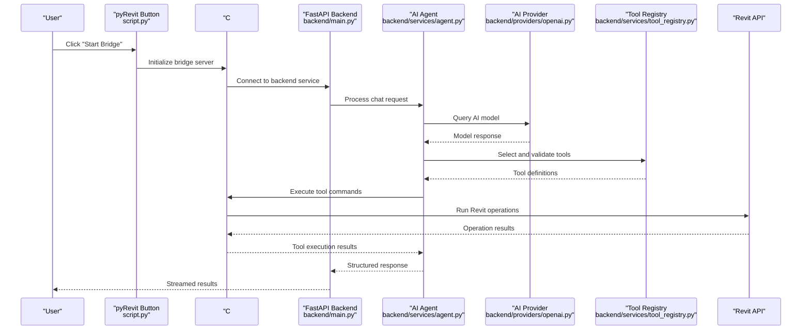
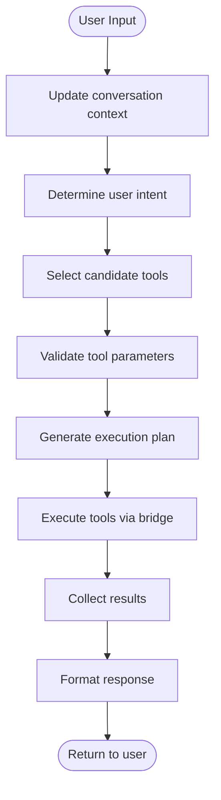
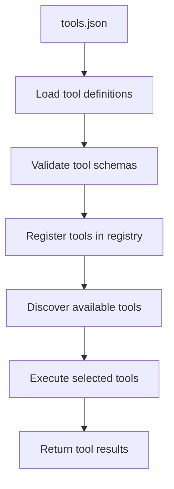
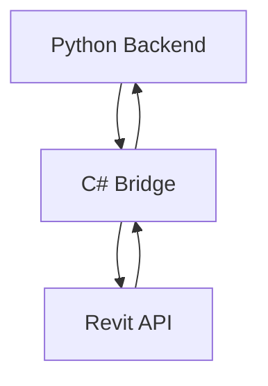
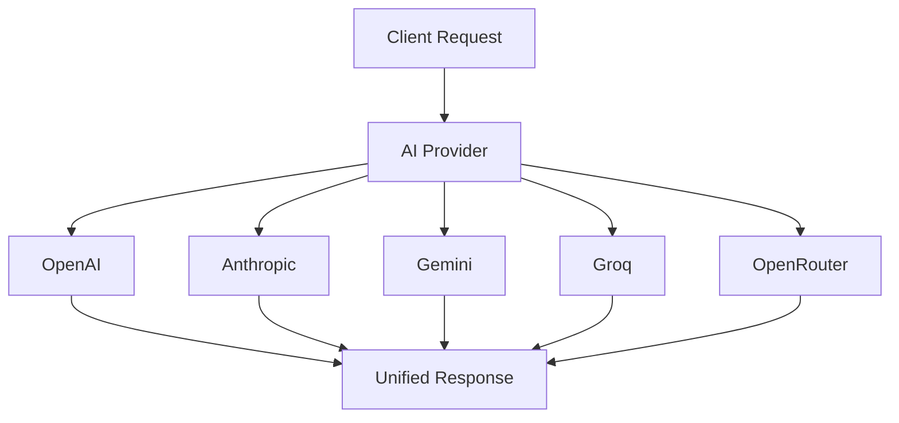
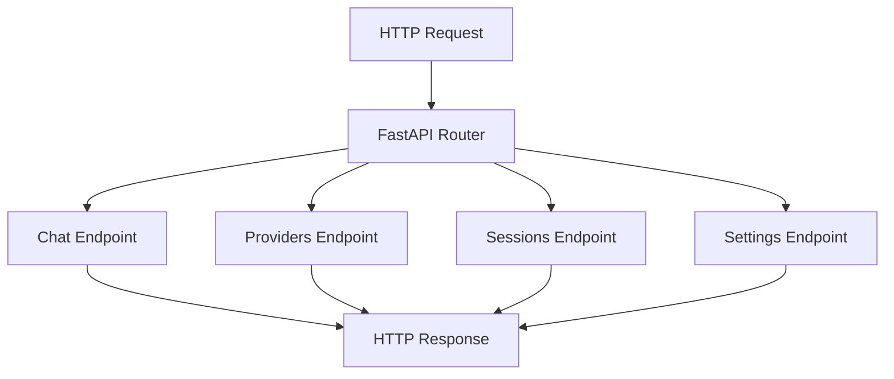
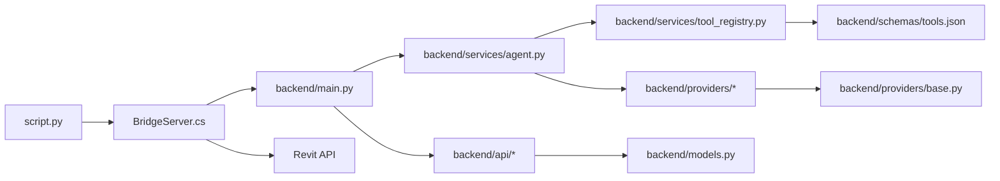

# Core Components

<cite>
**Referenced Files in This Document**
- [README.md](file://README.md)
- [script.py](file://extension/AI_Agent.extension/AI_Agent.tab/Panel.panel/StartBridge.pushbutton/script.py)
- [backend/main.py](file://backend/main.py)
- [backend/services/agent.py](file://backend/services/agent.py)
- [backend/services/tool_registry.py](file://backend/services/tool_registry.py)
- [backend/services/revit_bridge.py](file://backend/services/revit_bridge.py)
- [backend/providers/openai.py](file://backend/providers/openai.py)
- [backend/providers/anthropic.py](file://backend/providers/anthropic.py)
- [backend/providers/gemini.py](file://backend/providers/gemini.py)
- [backend/providers/groq.py](file://backend/providers/groq.py)
- [backend/providers/openrouter.py](file://backend/providers/openrouter.py)
- [backend/providers/base.py](file://backend/providers/base.py)
- [backend/api/chat.py](file://backend/api/chat.py)
- [backend/api/providers.py](file://backend/api/providers.py)
- [backend/api/sessions.py](file://backend/api/sessions.py)
- [backend/api/settings.py](file://backend/api/settings.py)
- [backend/schemas/tools.json](file://backend/schemas/tools.json)
- [bridge-source/BridgeServer.cs](file://bridge-source/BridgeServer.cs)
</cite>

## Table of Contents
1. [Introduction](#introduction)
2. [Project Structure](#project-structure)
3. [Core Components](#core-components)
4. [Architecture Overview](#architecture-overview)
5. [Detailed Component Analysis](#detailed-component-analysis)
6. [Dependency Analysis](#dependency-analysis)
7. [Performance Considerations](#performance-considerations)
8. [Troubleshooting Guide](#troubleshooting-guide)
9. [Conclusion](#conclusion)
10. [Appendices](#appendices)

## Introduction
This document explains the core components of the AI Revit Agent system with a focus on the AI agent pipeline, execution planning mechanisms, and runtime orchestration. It details the AI agent system, payload generation, and deterministic execution flow. You will learn how natural language understanding, tool selection, planning, and execution phases relate and interact, along with implementation details, invocation patterns, and component interfaces. Examples are grounded in concrete code paths from the repository to help both beginners and experienced developers understand and extend the system.

## Project Structure
The system is organized into distinct layers to maintain separation of concerns:
- extension: pyRevit entrypoint and UI wiring
- backend: FastAPI application with AI agent services and provider integrations
- bridge-source: C# bridge component for Revit integration
- frontend: React-based web interface for chat and configuration
- backend services: AI agent orchestration, tool registry, and Revit bridge
- backend providers: Multiple AI provider integrations (OpenAI, Anthropic, Gemini, Groq, OpenRouter)
- backend schemas: Tool definitions and configuration schemas
- backend API: REST endpoints for chat, providers, sessions, and settings

```mermaid
graph TB
subgraph "UI Layer"
BTN["pyRevit Button<br/>script.py"]
end
subgraph "Backend Layer"
MAIN["FastAPI Main<br/>backend/main.py"]
CHAT["Chat API<br/>backend/api/chat.py"]
PROV["Providers API<br/>backend/api/providers.py"]
SESS["Sessions API<br/>backend/api/sessions.py"]
SETT["Settings API<br/>backend/api/settings.py"]
end
subgraph "AI Services Layer"
AGENT["AI Agent<br/>backend/services/agent.py"]
TOOLREG["Tool Registry<br/>backend/services/tool_registry.py"]
BRIDGE["Revit Bridge<br/>backend/services/revit_bridge.py"]
END
subgraph "Provider Layer"
OPENAI["OpenAI Provider<br/>backend/providers/openai.py"]
ANTH["Anthropic Provider<br/>backend/providers/anthropic.py"]
GEMINI["Gemini Provider<br/>backend/providers/gemini.py"]
GROQ["Groq Provider<br/>backend/providers/groq.py"]
OPENROUTER["OpenRouter Provider<br/>backend/providers/openrouter.py"]
BASE["Base Provider<br/>backend/providers/base.py"]
END
subgraph "Bridge Layer"
CSBRIDGE["C# Bridge<br/>bridge-source/BridgeServer.cs"]
END
subgraph "Frontend Layer"
FRONT["React Frontend<br/>frontend/src/"]
END
BTN --> MAIN
MAIN --> CHAT
MAIN --> PROV
MAIN --> SESS
MAIN --> SETT
CHAT --> AGENT
PROV --> OPENAI
PROV --> ANTH
PROV --> GEMINI
PROV --> GROQ
PROV --> OPENROUTER
PROV --> BASE
AGENT --> TOOLREG
AGENT --> BRIDGE
BRIDGE --> CSBRIDGE
```

**Diagram sources**
- [script.py:1-21](file://extension/AI_Agent.extension/AI_Agent.tab/Panel.panel/StartBridge.pushbutton/script.py#L1-L21)
- [backend/main.py:1-50](file://backend/main.py#L1-L50)
- [backend/api/chat.py:1-50](file://backend/api/chat.py#L1-L50)
- [backend/api/providers.py:1-50](file://backend/api/providers.py#L1-L50)
- [backend/api/sessions.py:1-50](file://backend/api/sessions.py#L1-L50)
- [backend/api/settings.py:1-50](file://backend/api/settings.py#L1-L50)
- [backend/services/agent.py:1-50](file://backend/services/agent.py#L1-L50)
- [backend/services/tool_registry.py:1-50](file://backend/services/tool_registry.py#L1-L50)
- [backend/services/revit_bridge.py:1-50](file://backend/services/revit_bridge.py#L1-L50)
- [backend/providers/openai.py:1-50](file://backend/providers/openai.py#L1-L50)
- [backend/providers/anthropic.py:1-50](file://backend/providers/anthropic.py#L1-L50)
- [backend/providers/gemini.py:1-50](file://backend/providers/gemini.py#L1-L50)
- [backend/providers/groq.py:1-50](file://backend/providers/groq.py#L1-L50)
- [backend/providers/openrouter.py:1-50](file://backend/providers/openrouter.py#L1-L50)
- [backend/providers/base.py:1-50](file://backend/providers/base.py#L1-L50)
- [bridge-source/BridgeServer.cs:1-50](file://bridge-source/BridgeServer.cs#L1-L50)

**Section sources**
- [README.md:14-35](file://README.md#L14-L35)
- [README.md:36-54](file://README.md#L36-L54)

## Core Components
This section outlines the primary components and their roles in the AI agent pipeline.

- AI Agent System
  - Orchestrates natural language understanding, tool selection, and execution planning
  - Manages conversation context and maintains state throughout the interaction
- Tool Registry System
  - Defines available tools and their capabilities for Revit operations
  - Provides tool metadata, parameter schemas, and execution specifications
- C# Bridge Component
  - Acts as a communication layer between Python backend and Revit API
  - Handles bidirectional communication for tool execution and data exchange
- AI Provider Integrations
  - Supports multiple AI providers (OpenAI, Anthropic, Gemini, Groq, OpenRouter)
  - Provides unified interface for different provider APIs and capabilities
- Backend API Layer
  - Exposes REST endpoints for chat interactions, provider management, and session handling
  - Manages authentication, rate limiting, and request/response formatting

Key implementation references:
- AI agent orchestration: [backend/services/agent.py:1-100](file://backend/services/agent.py#L1-L100)
- Tool registry and definitions: [backend/services/tool_registry.py:1-100](file://backend/services/tool_registry.py#L1-L100), [backend/schemas/tools.json:1-200](file://backend/schemas/tools.json#L1-L200)
- C# bridge communication: [bridge-source/BridgeServer.cs:1-100](file://bridge-source/BridgeServer.cs#L1-L100)
- Provider implementations: [backend/providers/openai.py:1-80](file://backend/providers/openai.py#L1-L80), [backend/providers/anthropic.py:1-80](file://backend/providers/anthropic.py#L1-L80), [backend/providers/gemini.py:1-80](file://backend/providers/gemini.py#L1-L80), [backend/providers/groq.py:1-80](file://backend/providers/groq.py#L1-L80), [backend/providers/openrouter.py:1-80](file://backend/providers/openrouter.py#L1-L80)
- API endpoints: [backend/api/chat.py:1-100](file://backend/api/chat.py#L1-L100), [backend/api/providers.py:1-100](file://backend/api/providers.py#L1-L100), [backend/api/sessions.py:1-100](file://backend/api/sessions.py#L1-L100), [backend/api/settings.py:1-100](file://backend/api/settings.py#L1-L100)

**Section sources**
- [backend/services/agent.py:1-100](file://backend/services/agent.py#L1-L100)
- [backend/services/tool_registry.py:1-100](file://backend/services/tool_registry.py#L1-L100)
- [backend/services/revit_bridge.py:1-100](file://backend/services/revit_bridge.py#L1-L100)
- [backend/providers/openai.py:1-80](file://backend/providers/openai.py#L1-L80)
- [backend/providers/anthropic.py:1-80](file://backend/providers/anthropic.py#L1-L80)
- [backend/providers/gemini.py:1-80](file://backend/providers/gemini.py#L1-L80)
- [backend/providers/groq.py:1-80](file://backend/providers/groq.py#L1-L80)
- [backend/providers/openrouter.py:1-80](file://backend/providers/openrouter.py#L1-L80)
- [backend/providers/base.py:1-80](file://backend/providers/base.py#L1-L80)
- [backend/api/chat.py:1-100](file://backend/api/chat.py#L1-L100)
- [backend/api/providers.py:1-100](file://backend/api/providers.py#L1-L100)
- [backend/api/sessions.py:1-100](file://backend/api/sessions.py#L1-L100)
- [backend/api/settings.py:1-100](file://backend/api/settings.py#L1-L100)

## Architecture Overview
The system enforces a modern AI agent architecture with provider flexibility and robust tool execution:
1. UI triggers the pyRevit button, which starts the C# bridge and initializes the backend service
2. The FastAPI backend receives chat requests and routes them to the AI agent service
3. The AI agent processes natural language input, selects appropriate tools, and generates execution plans
4. Tools are executed through the C# bridge, which communicates with the Revit API
5. Results are streamed back to the frontend through the API layer



**Diagram sources**
- [script.py:1-21](file://extension/AI_Agent.extension/AI_Agent.tab/Panel.panel/StartBridge.pushbutton/script.py#L1-L21)
- [bridge-source/BridgeServer.cs:1-50](file://bridge-source/BridgeServer.cs#L1-L50)
- [backend/main.py:1-50](file://backend/main.py#L1-L50)
- [backend/services/agent.py:1-50](file://backend/services/agent.py#L1-L50)
- [backend/providers/openai.py:1-50](file://backend/providers/openai.py#L1-L50)
- [backend/services/tool_registry.py:1-50](file://backend/services/tool_registry.py#L1-L50)

**Section sources**
- [README.md:36-54](file://README.md#L36-L54)
- [backend/main.py:1-50](file://backend/main.py#L1-L50)

## Detailed Component Analysis

### AI Agent System
The AI agent orchestrates the entire interaction flow:
- Natural Language Understanding: Processes user input and maintains conversation context
- Tool Selection: Chooses appropriate tools based on user intent and available capabilities
- Execution Planning: Generates structured execution plans with proper sequencing
- State Management: Maintains conversation history and intermediate results



**Diagram sources**
- [backend/services/agent.py:1-100](file://backend/services/agent.py#L1-L100)
- [backend/services/tool_registry.py:1-100](file://backend/services/tool_registry.py#L1-L100)

Implementation highlights:
- Agent orchestration and state management: [backend/services/agent.py:1-100](file://backend/services/agent.py#L1-L100)
- Tool selection and validation: [backend/services/tool_registry.py:1-100](file://backend/services/tool_registry.py#L1-L100)
- Conversation context handling: [backend/api/chat.py:1-100](file://backend/api/chat.py#L1-L100)

**Section sources**
- [backend/services/agent.py:1-100](file://backend/services/agent.py#L1-L100)
- [backend/services/tool_registry.py:1-100](file://backend/services/tool_registry.py#L1-L100)
- [backend/api/chat.py:1-100](file://backend/api/chat.py#L1-L100)

### Tool Registry System
The tool registry defines and manages available tools for Revit operations:
- Tool Definitions: JSON schema defining tool capabilities, parameters, and execution methods
- Parameter Validation: Ensures tool parameters meet required specifications
- Capability Discovery: Allows dynamic discovery of available tool capabilities
- Execution Specifications: Defines how tools should be executed and validated



**Diagram sources**
- [backend/schemas/tools.json:1-200](file://backend/schemas/tools.json#L1-L200)
- [backend/services/tool_registry.py:1-100](file://backend/services/tool_registry.py#L1-L100)

Implementation highlights:
- Tool definition schema: [backend/schemas/tools.json:1-200](file://backend/schemas/tools.json#L1-L200)
- Tool registration and validation: [backend/services/tool_registry.py:1-100](file://backend/services/tool_registry.py#L1-L100)
- Dynamic tool discovery: [backend/services/agent.py:1-100](file://backend/services/agent.py#L1-L100)

**Section sources**
- [backend/schemas/tools.json:1-200](file://backend/schemas/tools.json#L1-L200)
- [backend/services/tool_registry.py:1-100](file://backend/services/tool_registry.py#L1-L100)

### C# Bridge Component
The C# bridge serves as the communication layer between Python backend and Revit API:
- Bidirectional Communication: Enables data exchange between Python services and Revit
- Command Execution: Translates Python tool requests into Revit API calls
- Result Streaming: Streams execution results back to the Python backend
- Error Handling: Manages exceptions and provides meaningful error messages



**Diagram sources**
- [bridge-source/BridgeServer.cs:1-100](file://bridge-source/BridgeServer.cs#L1-L100)
- [backend/services/revit_bridge.py:1-100](file://backend/services/revit_bridge.py#L1-L100)

Implementation highlights:
- Bridge server implementation: [bridge-source/BridgeServer.cs:1-100](file://bridge-source/BridgeServer.cs#L1-L100)
- Python bridge integration: [backend/services/revit_bridge.py:1-100](file://backend/services/revit_bridge.py#L1-L100)

**Section sources**
- [bridge-source/BridgeServer.cs:1-100](file://bridge-source/BridgeServer.cs#L1-L100)
- [backend/services/revit_bridge.py:1-100](file://backend/services/revit_bridge.py#L1-L100)

### AI Provider Integrations
Multiple AI provider integrations enable flexible model selection:
- Unified Interface: Common interface for different AI providers
- Provider-Specific Features: Leverages unique capabilities of each provider
- Configuration Management: Centralized provider configuration and credentials
- Fallback Mechanisms: Automatic fallback when primary provider fails



**Diagram sources**
- [backend/providers/openai.py:1-80](file://backend/providers/openai.py#L1-L80)
- [backend/providers/anthropic.py:1-80](file://backend/providers/anthropic.py#L1-L80)
- [backend/providers/gemini.py:1-80](file://backend/providers/gemini.py#L1-L80)
- [backend/providers/groq.py:1-80](file://backend/providers/groq.py#L1-L80)
- [backend/providers/openrouter.py:1-80](file://backend/providers/openrouter.py#L1-L80)
- [backend/providers/base.py:1-80](file://backend/providers/base.py#L1-L80)

Implementation highlights:
- Base provider interface: [backend/providers/base.py:1-80](file://backend/providers/base.py#L1-L80)
- Provider-specific implementations: [backend/providers/openai.py:1-80](file://backend/providers/openai.py#L1-L80), [backend/providers/anthropic.py:1-80](file://backend/providers/anthropic.py#L1-L80), [backend/providers/gemini.py:1-80](file://backend/providers/gemini.py#L1-L80), [backend/providers/groq.py:1-80](file://backend/providers/groq.py#L1-L80), [backend/providers/openrouter.py:1-80](file://backend/providers/openrouter.py#L1-L80)

**Section sources**
- [backend/providers/openai.py:1-80](file://backend/providers/openai.py#L1-L80)
- [backend/providers/anthropic.py:1-80](file://backend/providers/anthropic.py#L1-L80)
- [backend/providers/gemini.py:1-80](file://backend/providers/gemini.py#L1-L80)
- [backend/providers/groq.py:1-80](file://backend/providers/groq.py#L1-L80)
- [backend/providers/openrouter.py:1-80](file://backend/providers/openrouter.py#L1-L80)
- [backend/providers/base.py:1-80](file://backend/providers/base.py#L1-L80)

### Backend API Layer
REST endpoints provide access to all system functionality:
- Chat Endpoints: Handle natural language conversations and tool execution
- Provider Management: Configure and manage AI provider settings
- Session Handling: Manage conversation sessions and state persistence
- Settings Management: Configure system-wide settings and preferences



**Diagram sources**
- [backend/api/chat.py:1-100](file://backend/api/chat.py#L1-L100)
- [backend/api/providers.py:1-100](file://backend/api/providers.py#L1-L100)
- [backend/api/sessions.py:1-100](file://backend/api/sessions.py#L1-L100)
- [backend/api/settings.py:1-100](file://backend/api/settings.py#L1-L100)

Implementation highlights:
- Chat endpoint implementation: [backend/api/chat.py:1-100](file://backend/api/chat.py#L1-L100)
- Provider management: [backend/api/providers.py:1-100](file://backend/api/providers.py#L1-L100)
- Session handling: [backend/api/sessions.py:1-100](file://backend/api/sessions.py#L1-L100)
- Settings management: [backend/api/settings.py:1-100](file://backend/api/settings.py#L1-L100)

**Section sources**
- [backend/api/chat.py:1-100](file://backend/api/chat.py#L1-L100)
- [backend/api/providers.py:1-100](file://backend/api/providers.py#L1-L100)
- [backend/api/sessions.py:1-100](file://backend/api/sessions.py#L1-L100)
- [backend/api/settings.py:1-100](file://backend/api/settings.py#L1-L100)

### Component Interfaces and Invocation Patterns
- pyRevit Button Entrypoint
  - Starts the C# bridge server and initializes the backend service
  - Reference: [script.py:1-21](file://extension/AI_Agent.extension/AI_Agent.tab/Panel.panel/StartBridge.pushbutton/script.py#L1-L21)
- FastAPI Main Application
  - Initializes the backend service and configures routing
  - Reference: [backend/main.py:1-50](file://backend/main.py#L1-L50)
- AI Agent Service
  - Orchestrates the complete AI agent pipeline with tool execution
  - Reference: [backend/services/agent.py:1-100](file://backend/services/agent.py#L1-L100)
- Tool Registry
  - Manages tool definitions and provides tool selection capabilities
  - Reference: [backend/services/tool_registry.py:1-100](file://backend/services/tool_registry.py#L1-L100)
- C# Bridge
  - Handles communication between Python backend and Revit API
  - Reference: [bridge-source/BridgeServer.cs:1-100](file://bridge-source/BridgeServer.cs#L1-L100)
- API Endpoints
  - Expose REST endpoints for all system functionality
  - References: [backend/api/chat.py:1-100](file://backend/api/chat.py#L1-L100), [backend/api/providers.py:1-100](file://backend/api/providers.py#L1-L100), [backend/api/sessions.py:1-100](file://backend/api/sessions.py#L1-L100), [backend/api/settings.py:1-100](file://backend/api/settings.py#L1-L100)

**Section sources**
- [script.py:1-21](file://extension/AI_Agent.extension/AI_Agent.tab/Panel.panel/StartBridge.pushbutton/script.py#L1-L21)
- [backend/main.py:1-50](file://backend/main.py#L1-L50)
- [backend/services/agent.py:1-100](file://backend/services/agent.py#L1-L100)
- [backend/services/tool_registry.py:1-100](file://backend/services/tool_registry.py#L1-L100)
- [bridge-source/BridgeServer.cs:1-100](file://bridge-source/BridgeServer.cs#L1-L100)
- [backend/api/chat.py:1-100](file://backend/api/chat.py#L1-L100)
- [backend/api/providers.py:1-100](file://backend/api/providers.py#L1-L100)
- [backend/api/sessions.py:1-100](file://backend/api/sessions.py#L1-L100)
- [backend/api/settings.py:1-100](file://backend/api/settings.py#L1-L100)

## Dependency Analysis
The system maintains clean separation of concerns with modern AI agent architecture:
- UI depends on C# bridge initialization and backend service startup
- Backend main application depends on FastAPI configuration and service registration
- AI agent depends on tool registry and provider implementations
- Tool registry depends on JSON schema definitions
- C# bridge depends on Revit API integration
- API endpoints depend on backend services and database models
- Provider implementations depend on base provider interface



**Diagram sources**
- [script.py:1-21](file://extension/AI_Agent.extension/AI_Agent.tab/Panel.panel/StartBridge.pushbutton/script.py#L1-L21)
- [bridge-source/BridgeServer.cs:1-50](file://bridge-source/BridgeServer.cs#L1-L50)
- [backend/main.py:1-50](file://backend/main.py#L1-L50)
- [backend/services/agent.py:1-50](file://backend/services/agent.py#L1-L50)
- [backend/services/tool_registry.py:1-50](file://backend/services/tool_registry.py#L1-L50)
- [backend/providers/base.py:1-50](file://backend/providers/base.py#L1-L50)

**Section sources**
- [backend/main.py:1-50](file://backend/main.py#L1-L50)
- [backend/services/agent.py:1-50](file://backend/services/agent.py#L1-L50)
- [backend/services/tool_registry.py:1-50](file://backend/services/tool_registry.py#L1-L50)
- [backend/providers/base.py:1-50](file://backend/providers/base.py#L1-L50)
- [bridge-source/BridgeServer.cs:1-50](file://bridge-source/BridgeServer.cs#L1-L50)

## Performance Considerations
- Provider Flexibility: Multiple AI providers allow load balancing and fallback strategies
- Tool Registry Optimization: Centralized tool definitions reduce redundant processing
- Bridge Communication: Efficient C# bridge minimizes overhead in Revit API calls
- Streaming Responses: Real-time response streaming improves user experience
- Caching Strategies: Provider responses and tool definitions can be cached for better performance
- Connection Pooling: Database connections and API connections benefit from pooling

## Troubleshooting Guide
Common issues and resolutions:
- Bridge Connection Issues
  - Symptom: C# bridge fails to connect or communicate with Revit
  - Resolution: Verify bridge initialization, check firewall settings, and ensure Revit is running
  - References: [bridge-source/BridgeServer.cs:1-50](file://bridge-source/BridgeServer.cs#L1-L50)
- AI Provider Configuration
  - Symptom: Provider API calls fail or return errors
  - Resolution: Check API keys, verify provider availability, and review rate limits
  - References: [backend/providers/openai.py:1-50](file://backend/providers/openai.py#L1-L50), [backend/providers/anthropic.py:1-50](file://backend/providers/anthropic.py#L1-L50)
- Tool Registry Validation
  - Symptom: Tools fail to register or execute properly
  - Resolution: Validate JSON schema, check tool definitions, and ensure parameter compatibility
  - References: [backend/schemas/tools.json:1-100](file://backend/schemas/tools.json#L1-L100), [backend/services/tool_registry.py:1-50](file://backend/services/tool_registry.py#L1-L50)
- API Endpoint Errors
  - Symptom: HTTP requests to backend fail or return unexpected responses
  - Resolution: Check FastAPI configuration, verify endpoint routing, and inspect request/response formats
  - References: [backend/api/chat.py:1-50](file://backend/api/chat.py#L1-L50), [backend/api/providers.py:1-50](file://backend/api/providers.py#L1-L50)
- Conversation State Issues
  - Symptom: AI agent loses context or repeats information
  - Resolution: Review conversation context management and ensure proper state persistence
  - References: [backend/services/agent.py:1-50](file://backend/services/agent.py#L1-L50)

**Section sources**
- [bridge-source/BridgeServer.cs:1-50](file://bridge-source/BridgeServer.cs#L1-L50)
- [backend/providers/openai.py:1-50](file://backend/providers/openai.py#L1-L50)
- [backend/providers/anthropic.py:1-50](file://backend/providers/anthropic.py#L1-L50)
- [backend/schemas/tools.json:1-100](file://backend/schemas/tools.json#L1-L100)
- [backend/services/tool_registry.py:1-50](file://backend/services/tool_registry.py#L1-L50)
- [backend/api/chat.py:1-50](file://backend/api/chat.py#L1-L50)
- [backend/api/providers.py:1-50](file://backend/api/providers.py#L1-L50)
- [backend/services/agent.py:1-50](file://backend/services/agent.py#L1-L50)

## Conclusion
The AI Revit Agent implements a modern, flexible architecture that replaces the traditional interpreter layer with a sophisticated AI agent system. The integration of C# bridge technology enables seamless communication with Revit, while the tool registry system provides dynamic capability management. Multiple AI provider integrations offer flexibility and redundancy, making the system suitable for enterprise-scale BIM automation with robust AI-powered capabilities.

## Appendices
- Tool Definition Schema
  - Complete JSON schema for tool definitions and parameter specifications: [backend/schemas/tools.json:1-200](file://backend/schemas/tools.json#L1-L200)
- AI Provider Configuration
  - Provider-specific configuration examples and best practices: [backend/providers/openai.py:1-80](file://backend/providers/openai.py#L1-L80), [backend/providers/anthropic.py:1-80](file://backend/providers/anthropic.py#L1-L80)
- Bridge Communication Protocol
  - C# bridge implementation details and communication patterns: [bridge-source/BridgeServer.cs:1-100](file://bridge-source/BridgeServer.cs#L1-L100)
- API Endpoint Reference
  - Complete REST API documentation and usage examples: [backend/api/chat.py:1-100](file://backend/api/chat.py#L1-L100), [backend/api/providers.py:1-100](file://backend/api/providers.py#L1-L100), [backend/api/sessions.py:1-100](file://backend/api/sessions.py#L1-L100), [backend/api/settings.py:1-100](file://backend/api/settings.py#L1-L100)

**Section sources**
- [backend/schemas/tools.json:1-200](file://backend/schemas/tools.json#L1-L200)
- [backend/providers/openai.py:1-80](file://backend/providers/openai.py#L1-L80)
- [backend/providers/anthropic.py:1-80](file://backend/providers/anthropic.py#L1-L80)
- [bridge-source/BridgeServer.cs:1-100](file://bridge-source/BridgeServer.cs#L1-L100)
- [backend/api/chat.py:1-100](file://backend/api/chat.py#L1-L100)
- [backend/api/providers.py:1-100](file://backend/api/providers.py#L1-L100)
- [backend/api/sessions.py:1-100](file://backend/api/sessions.py#L1-L100)
- [backend/api/settings.py:1-100](file://backend/api/settings.py#L1-L100)