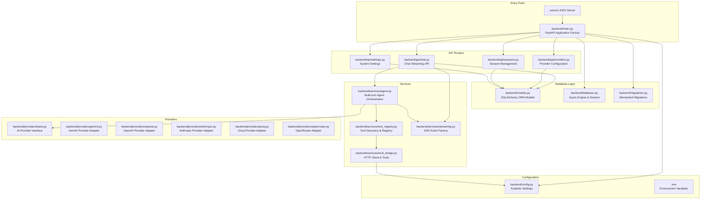
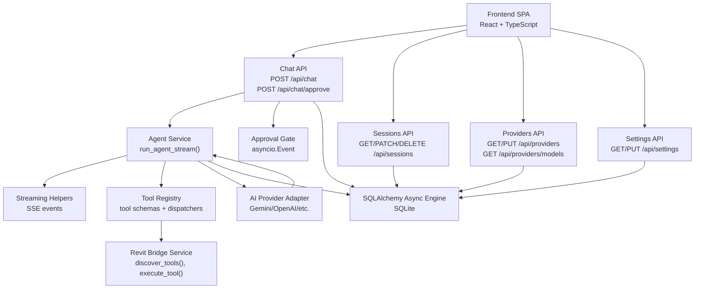
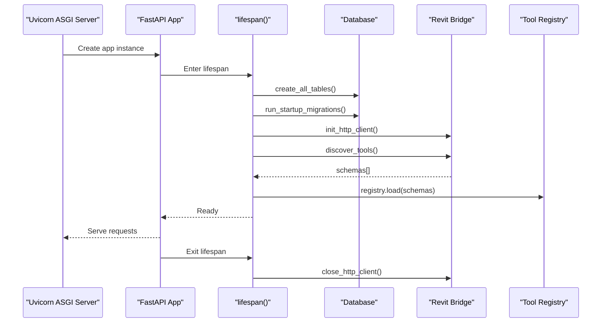
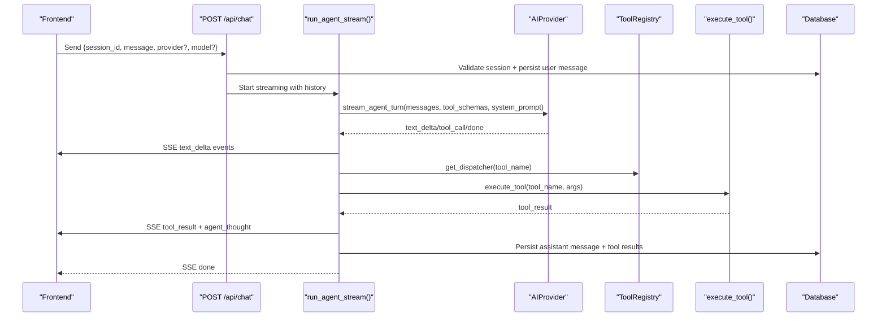
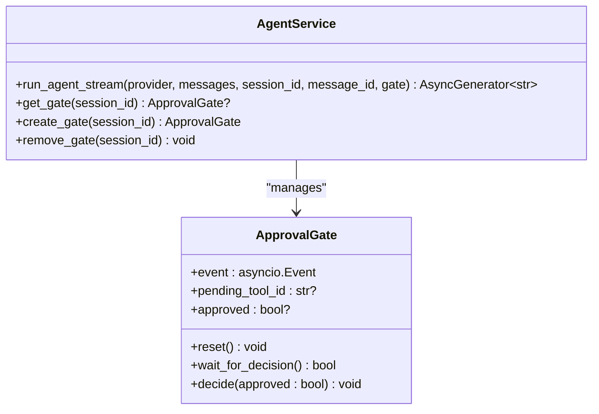
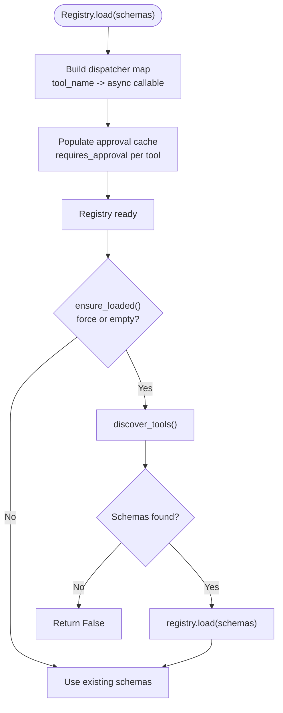
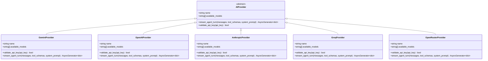
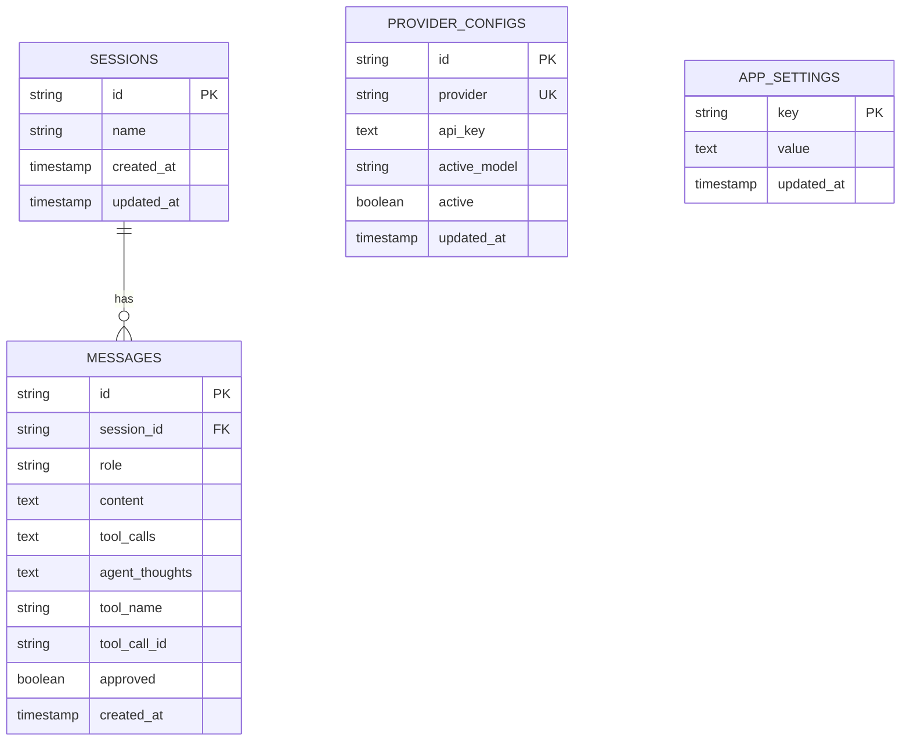
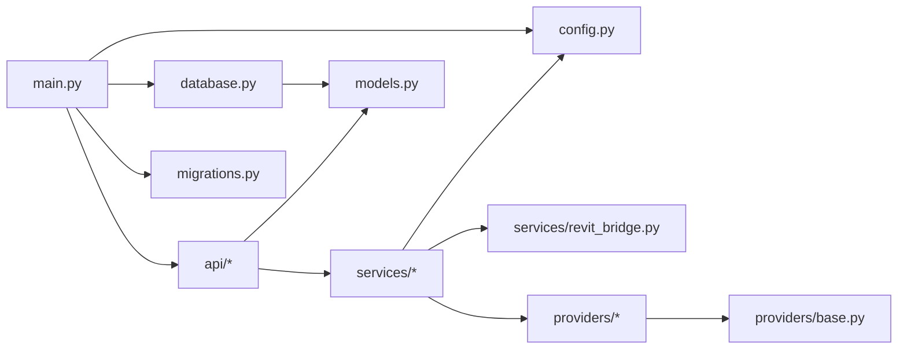

# FastAPI Backend Architecture

<cite>
**Referenced Files in This Document**
- [main.py](file://backend/main.py)
- [config.py](file://backend/config.py)
- [models.py](file://backend/models.py)
- [database.py](file://backend/database.py)
- [chat.py](file://backend/api/chat.py)
- [sessions.py](file://backend/api/sessions.py)
- [providers.py](file://backend/api/providers.py)
- [agent.py](file://backend/services/agent.py)
- [tool_registry.py](file://backend/services/tool_registry.py)
- [streaming.py](file://backend/services/streaming.py)
- [base.py](file://backend/providers/base.py)
- [gemini.py](file://backend/providers/gemini.py)
- [revit_bridge.py](file://backend/services/revit_bridge.py)
- [migrations.py](file://backend/migrations.py)
- [requirements.txt](file://backend/requirements.txt)
</cite>

## Update Summary
**Changes Made**
- Updated project structure to reflect FastAPI-based architecture replacing CLI daemon
- Added comprehensive FastAPI application lifecycle documentation
- Enhanced streaming architecture with Server-Sent Events (SSE) implementation
- Expanded AI provider integration documentation with multiple provider support
- Updated human-in-the-loop workflow documentation with approval gates
- Added comprehensive settings and configuration management
- Enhanced database architecture with SQLAlchemy 2.0 async support

## Table of Contents
1. [Introduction](#introduction)
2. [Project Structure](#project-structure)
3. [Core Components](#core-components)
4. [Architecture Overview](#architecture-overview)
5. [Detailed Component Analysis](#detailed-component-analysis)
6. [Dependency Analysis](#dependency-analysis)
7. [Performance Considerations](#performance-considerations)
8. [Troubleshooting Guide](#troubleshooting-guide)
9. [Conclusion](#conclusion)

## Introduction
This document describes the FastAPI backend architecture for the AI-Revit Agent system. The backend provides a streaming chat interface that orchestrates AI agents with human-in-the-loop approvals, integrates with multiple AI providers, persists conversation sessions, and bridges to a Revit C# bridge for executing actions within Autodesk Revit. The system emphasizes modularity, testability, and operational robustness through clear separation of concerns across configuration, data persistence, provider abstraction, tool registry, and streaming orchestration.

**Updated** Complete architectural transformation from CLI daemon to FastAPI-based backend with comprehensive streaming capabilities and AI provider integration.

## Project Structure
The backend follows a layered FastAPI architecture:
- Entry point and lifecycle management in main.py with application factory pattern
- Configuration and environment settings in config.py with Pydantic settings
- Data models and database engine/session in models.py and database.py
- API routers for chat, sessions, providers, and settings in api/
- Services for agent orchestration, tool registry, streaming, and Revit bridge in services/
- Provider adapters in providers/
- Startup migrations in migrations.py
- Dependencies in requirements.txt

**Diagram sources**
- [main.py:110-166](file://backend/main.py#L110-L166)
- [config.py:18-90](file://backend/config.py#L18-L90)
- [database.py:20-66](file://backend/database.py#L20-L66)
- [models.py:20-142](file://backend/models.py#L20-L142)
- [chat.py:37-36](file://backend/api/chat.py#L37-L36)
- [sessions.py:25-121](file://backend/api/sessions.py#L25-L121)
- [providers.py:24-243](file://backend/api/providers.py#L24-L243)
- [agent.py:39-367](file://backend/services/agent.py#L39-L367)
- [tool_registry.py:62-192](file://backend/services/tool_registry.py#L62-L192)
- [streaming.py:22-93](file://backend/services/streaming.py#L22-L93)
- [revit_bridge.py:40-202](file://backend/services/revit_bridge.py#L40-L202)
- [base.py:63-124](file://backend/providers/base.py#L63-L124)
- [gemini.py:118-200](file://backend/providers/gemini.py#L118-L200)

**Section sources**
- [main.py:1-183](file://backend/main.py#L1-L183)
- [config.py:1-90](file://backend/config.py#L1-L90)

## Core Components
- **Application factory and lifecycle**: Creates the FastAPI app with lifespan hooks, mounts routers, configures CORS, serves the React SPA in production, and manages startup/shutdown via lifespan context managers.
- **Configuration**: Centralized settings with environment variable support, development mode toggles, provider keys, database URL construction, CORS origins, and logging levels using Pydantic settings.
- **Database**: Async SQLAlchemy 2.0 engine and session factory, table creation, and dependency injection for route handlers with idempotent migrations.
- **Models**: ORM entities for sessions, messages, provider configurations, and app settings with relationships and indexes.
- **API Routers**: Chat streaming with approval gates, session CRUD, provider configuration management, and settings management.
- **Services**: Agent orchestration with multi-turn loops, approval gates, streaming helpers, tool registry with classification and dispatchers, and Revit bridge HTTP client.
- **Providers**: Abstract AIProvider interface and concrete adapters (Gemini, OpenAI, Anthropic, Groq, OpenRouter) with model lists and SDK integration.

**Updated** Enhanced with FastAPI application factory pattern, comprehensive provider support, and improved streaming architecture.

**Section sources**
- [main.py:110-166](file://backend/main.py#L110-L166)
- [config.py:18-90](file://backend/config.py#L18-L90)
- [database.py:20-66](file://backend/database.py#L20-L66)
- [models.py:20-142](file://backend/models.py#L20-L142)
- [chat.py:37-36](file://backend/api/chat.py#L37-L36)
- [sessions.py:25-121](file://backend/api/sessions.py#L25-L121)
- [providers.py:24-243](file://backend/api/providers.py#L24-L243)
- [agent.py:39-367](file://backend/services/agent.py#L39-L367)
- [tool_registry.py:62-192](file://backend/services/tool_registry.py#L62-L192)
- [streaming.py:22-93](file://backend/services/streaming.py#L22-L93)
- [revit_bridge.py:40-202](file://backend/services/revit_bridge.py#L40-L202)
- [base.py:63-124](file://backend/providers/base.py#L63-L124)
- [gemini.py:118-200](file://backend/providers/gemini.py#L118-L200)

## Architecture Overview
The backend employs a provider-agnostic agent orchestration layer that streams events to the frontend over Server-Sent Events (SSE). The agent interacts with AI providers and the Revit bridge, enforcing human-in-the-loop approvals for write actions. Sessions and messages are persisted to an SQLite database, and the system supports dynamic model discovery for certain providers.

**Updated** Complete FastAPI-based streaming architecture with comprehensive AI provider integration.

**Diagram sources**
- [main.py:130-166](file://backend/main.py#L130-L166)
- [chat.py:74-298](file://backend/api/chat.py#L74-L298)
- [agent.py:94-367](file://backend/services/agent.py#L94-L367)
- [tool_registry.py:62-192](file://backend/services/tool_registry.py#L62-L192)
- [revit_bridge.py:91-202](file://backend/services/revit_bridge.py#L91-L202)
- [streaming.py:22-93](file://backend/services/streaming.py#L22-L93)
- [providers/base.py:63-124](file://backend/providers/base.py#L63-L124)
- [database.py:20-66](file://backend/database.py#L20-L66)

## Detailed Component Analysis

### Application Lifecycle and Entry Point
The application initializes logging, ensures the data directory exists, creates database tables, initializes the shared HTTP client, discovers Revit tools, loads the tool registry, mounts API routers, and serves the React SPA in production mode. The lifespan manager coordinates startup and shutdown.

**Updated** Enhanced with FastAPI application factory pattern and comprehensive lifecycle management.

**Diagram sources**
- [main.py:62-104](file://backend/main.py#L62-L104)
- [database.py:45-66](file://backend/database.py#L45-L66)
- [migrations.py:13-36](file://backend/migrations.py#L13-L36)
- [revit_bridge.py:40-54](file://backend/services/revit_bridge.py#L40-L54)
- [tool_registry.py:77-101](file://backend/services/tool_registry.py#L77-L101)

**Section sources**
- [main.py:62-104](file://backend/main.py#L62-L104)
- [database.py:45-66](file://backend/database.py#L45-L66)
- [migrations.py:13-36](file://backend/migrations.py#L13-L36)

### Chat API and Streaming Orchestration
The chat endpoint validates sessions, resolves provider configuration, persists the user message, and streams agent responses as SSE events. It accumulates assistant text and tool calls, persists the assistant message and tool results, and handles approval gating.

**Updated** Enhanced with comprehensive streaming architecture and approval gate management.

**Diagram sources**
- [chat.py:74-298](file://backend/api/chat.py#L74-L298)
- [agent.py:94-367](file://backend/services/agent.py#L94-L367)
- [tool_registry.py:153-156](file://backend/services/tool_registry.py#L153-L156)
- [revit_bridge.py:167-202](file://backend/services/revit_bridge.py#L167-L202)
- [streaming.py:22-93](file://backend/services/streaming.py#L22-L93)

**Section sources**
- [chat.py:74-298](file://backend/api/chat.py#L74-L298)
- [agent.py:94-367](file://backend/services/agent.py#L94-L367)

### Agent Service and Approval Gates
The agent service maintains an in-memory approval gate per session using asyncio.Event. It enforces human-in-the-loop decisions for write tools, auto-approves read tools and fetch operations, and streams synthetic agent thoughts to the frontend.

**Updated** Enhanced with comprehensive approval gate management and multi-turn orchestration.

**Diagram sources**
- [agent.py:39-88](file://backend/services/agent.py#L39-L88)

**Section sources**
- [agent.py:39-88](file://backend/services/agent.py#L39-L88)

### Tool Registry and Dispatch
The tool registry caches discovered tool schemas, classifies tools as read-only or requiring approval, builds a dispatcher map, and supports lazy re-discovery with cooldowns.

**Updated** Enhanced with comprehensive tool classification and dynamic discovery.

**Diagram sources**
- [tool_registry.py:77-152](file://backend/services/tool_registry.py#L77-L152)

**Section sources**
- [tool_registry.py:62-192](file://backend/services/tool_registry.py#L62-L192)

### Provider Abstraction and Multiple AI Providers
The AIProvider interface defines a uniform contract for streaming agent turns, tool calls, and validation. The system supports multiple providers including Gemini, OpenAI, Anthropic, Groq, and OpenRouter adapters with model lists and SDK integration.

**Updated** Comprehensive provider abstraction supporting multiple AI providers with unified interface.

**Diagram sources**
- [base.py:63-124](file://backend/providers/base.py#L63-L124)
- [gemini.py:118-200](file://backend/providers/gemini.py#L118-L200)

**Section sources**
- [base.py:63-124](file://backend/providers/base.py#L63-L124)
- [gemini.py:118-200](file://backend/providers/gemini.py#L118-L200)

### Database Models and Relationships
The system models sessions, messages, provider configurations, and app settings with appropriate relationships and indexes. Messages link tool results to specific tool calls via tool_call_id for reliable history reconstruction.

**Updated** Enhanced with comprehensive database schema and relationship management.

**Diagram sources**
- [models.py:35-142](file://backend/models.py#L35-L142)

**Section sources**
- [models.py:35-142](file://backend/models.py#L35-L142)

### Configuration and Environment Management
Settings are loaded from .env with caching and property-based computed values for database URLs, CORS origins, and Revit bridge endpoints. Development mode toggles auto-approval, CORS policy, and logging verbosity.

**Updated** Enhanced with Pydantic settings and comprehensive configuration management.

**Section sources**
- [config.py:18-90](file://backend/config.py#L18-L90)

### Revit Bridge Integration
The bridge service provides health checks, tool discovery, and tool execution. It maintains a shared HTTP client for performance, supports development-mode fallbacks, and writes schema snapshots for debugging.

**Updated** Enhanced with comprehensive bridge integration and development mode support.

**Section sources**
- [revit_bridge.py:40-202](file://backend/services/revit_bridge.py#L40-L202)

### Streaming Event Contract
The streaming module defines a stable SSE event contract covering text deltas, tool call lifecycle, agent thoughts, errors, and completion signals. All events are emitted through factory functions to ensure consistency.

**Updated** Comprehensive streaming architecture with standardized event contracts.

**Section sources**
- [streaming.py:22-93](file://backend/services/streaming.py#L22-L93)

### Sessions and Providers APIs
The sessions API manages CRUD operations for chat sessions and message retrieval. The providers API lists providers, retrieves masked keys, updates provider configurations, and validates API key formats.

**Updated** Enhanced with comprehensive provider management and session handling.

**Section sources**
- [sessions.py:72-121](file://backend/api/sessions.py#L72-L121)
- [providers.py:53-243](file://backend/api/providers.py#L53-L243)

## Dependency Analysis
The backend uses a modular dependency graph with clear boundaries:
- Entry point depends on configuration, database, migrations, and services
- API routers depend on services and models
- Services depend on configuration, providers, and the bridge
- Providers depend on SDK libraries and the base interface
- Database layer depends on SQLAlchemy and configuration

**Updated** Enhanced dependency graph reflecting FastAPI architecture.

**Diagram sources**
- [main.py:31-40](file://backend/main.py#L31-L40)
- [database.py:17-42](file://backend/database.py#L17-L42)
- [models.py:17-21](file://backend/models.py#L17-L21)
- [providers/base.py:10-11](file://backend/providers/base.py#L10-L11)

**Section sources**
- [requirements.txt:1-25](file://backend/requirements.txt#L1-L25)

## Performance Considerations
- **Asynchronous I/O**: SQLAlchemy 2.0 async engine and HTTPX client enable non-blocking database and bridge operations.
- **Persistent HTTP client**: Reuses connections to the Revit bridge to reduce overhead.
- **Streaming**: SSE streaming minimizes latency and memory usage by emitting incremental chunks.
- **In-memory approval gates**: Avoids database contention for approval coordination.
- **Lazy tool discovery**: Reduces startup time and retries with cooldowns.
- **Model validation**: Prevents expensive provider calls with invalid configurations.
- **FastAPI optimization**: Application factory pattern and dependency injection for optimal performance.

**Updated** Enhanced with FastAPI-specific performance optimizations.

## Troubleshooting Guide
Common issues and resolutions:
- **Bridge unreachable in development**: The system falls back to cached schemas; ensure the bridge is started and the discovery endpoint responds.
- **Empty tool registry**: Verify Revit is running, the bridge button is clicked, and the backend is restarted.
- **Provider API key errors**: Use the providers API to validate keys and ensure they match the provider's expected format.
- **Session not found**: Confirm the session_id exists and is accessible to the current user context.
- **Exceeded turn limit**: Adjust agent_max_turns in settings for complex workflows.
- **FastAPI application startup failures**: Check uvicorn configuration and ensure all dependencies are installed.
- **Streaming connection drops**: Verify network connectivity and SSE compatibility in the browser.

**Updated** Enhanced troubleshooting guide for FastAPI architecture and streaming issues.

**Section sources**
- [revit_bridge.py:122-142](file://backend/services/revit_bridge.py#L122-L142)
- [chat.py:354-363](file://backend/api/chat.py#L354-L363)
- [providers.py:182-196](file://backend/api/providers.py#L182-L196)
- [agent.py:361-366](file://backend/services/agent.py#L361-L366)

## Conclusion
The FastAPI backend implements a robust, modular architecture for AI-assisted Revit automation. Its provider abstraction, streaming orchestration, human-in-the-loop approvals, and seamless Revit bridge integration deliver a scalable foundation for complex BIM workflows. The design emphasizes maintainability, testability, and operational flexibility through clear separation of concerns and standardized interfaces.

**Updated** Complete architectural transformation delivering enterprise-grade FastAPI backend with comprehensive AI provider integration and streaming capabilities.