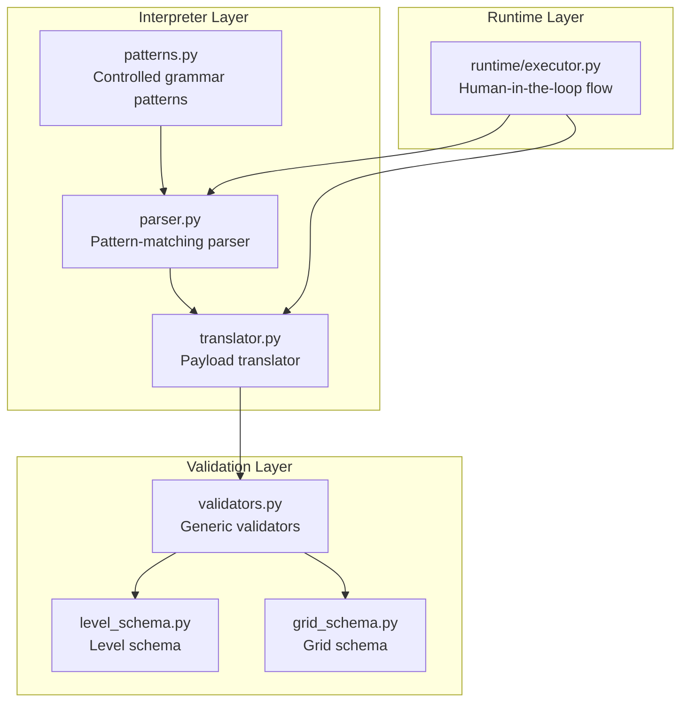
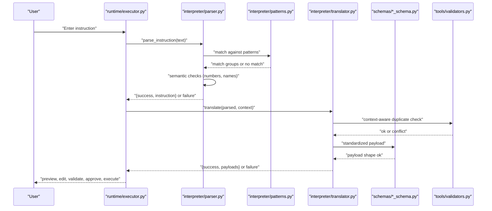
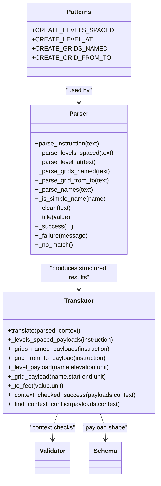
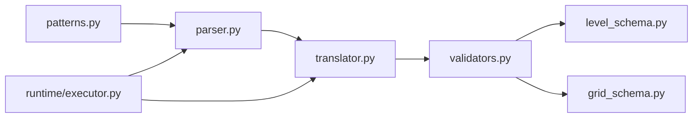

# Grammar Patterns

<cite>
**Referenced Files in This Document**
- [patterns.py](file://interpreter/patterns.py)
- [parser.py](file://interpreter/parser.py)
- [translator.py](file://interpreter/translator.py)
- [validators.py](file://tools/validators.py)
- [grid_schema.py](file://schemas/grid_schema.py)
- [level_schema.py](file://schemas/level_schema.py)
- [executor.py](file://runtime/executor.py)
- [README.md](file://README.md)
</cite>

## Table of Contents
1. [Introduction](#introduction)
2. [Project Structure](#project-structure)
3. [Core Components](#core-components)
4. [Architecture Overview](#architecture-overview)
5. [Detailed Component Analysis](#detailed-component-analysis)
6. [Dependency Analysis](#dependency-analysis)
7. [Performance Considerations](#performance-considerations)
8. [Troubleshooting Guide](#troubleshooting-guide)
9. [Conclusion](#conclusion)

## Introduction
This document explains the controlled grammar patterns that define deterministic syntax for BIM instructions. It focuses on how regular expressions enforce strict syntax rules for supported commands, how parsing and translation layers validate and transform instructions into structured payloads, and how the controlled vocabulary approach ensures reliability over natural language flexibility. It also documents the validation rules that prevent ambiguous or invalid instructions from reaching execution, and outlines how to extend the grammar while preserving determinism.

## Project Structure
The grammar and interpretation pipeline spans several modules:
- Pattern definitions: regular expressions that constrain instruction syntax
- Parser: applies patterns and enforces semantic checks
- Translator: converts parsed results into standardized payloads
- Validators and schemas: validate payload shapes and content
- Runtime executor: orchestrates instruction entry, interpretation, validation, planning, and execution

**Diagram sources**
- [patterns.py:1-29](file://interpreter/patterns.py#L1-L29)
- [parser.py:1-141](file://interpreter/parser.py#L1-L141)
- [translator.py:1-155](file://interpreter/translator.py#L1-L155)
- [validators.py:1-85](file://tools/validators.py#L1-L85)
- [level_schema.py:1-22](file://schemas/level_schema.py#L1-L22)
- [grid_schema.py:1-23](file://schemas/grid_schema.py#L1-L23)
- [executor.py:1-285](file://runtime/executor.py#L1-L285)

**Section sources**
- [patterns.py:1-29](file://interpreter/patterns.py#L1-L29)
- [parser.py:1-141](file://interpreter/parser.py#L1-L141)
- [translator.py:1-155](file://interpreter/translator.py#L1-L155)
- [validators.py:1-85](file://tools/validators.py#L1-L85)
- [level_schema.py:1-22](file://schemas/level_schema.py#L1-L22)
- [grid_schema.py:1-23](file://schemas/grid_schema.py#L1-L23)
- [executor.py:1-285](file://runtime/executor.py#L1-L285)

## Core Components
- Controlled grammar patterns: Regular expressions that define canonical instruction forms for four commands
- Parser: Applies patterns in order, performs numeric and structural checks, and returns structured results
- Translator: Converts parsed results into standardized payloads and performs context-aware duplicate-name checks
- Validators and schemas: Enforce payload shape and content rules before execution
- Runtime executor: Integrates the interpreter and validation into a human-in-the-loop workflow

Key responsibilities:
- Deterministic parsing: Each instruction must match exactly one pattern to succeed
- Controlled vocabulary: Keywords, units, and structure are strictly constrained
- Validation: Both at parse-time and payload-time to prevent ambiguity and invalid data

**Section sources**
- [patterns.py:1-29](file://interpreter/patterns.py#L1-L29)
- [parser.py:18-29](file://interpreter/parser.py#L18-L29)
- [translator.py:17-39](file://interpreter/translator.py#L17-L39)
- [validators.py:26-84](file://tools/validators.py#L26-L84)
- [executor.py:107-130](file://runtime/executor.py#L107-L130)

## Architecture Overview
The grammar pipeline transforms natural-language instructions into deterministic payloads through a strict, layered process.

**Diagram sources**
- [executor.py:107-130](file://runtime/executor.py#L107-L130)
- [parser.py:18-29](file://interpreter/parser.py#L18-L29)
- [patterns.py:6-28](file://interpreter/patterns.py#L6-L28)
- [translator.py:17-39](file://interpreter/translator.py#L17-L39)
- [validators.py:26-84](file://tools/validators.py#L26-L84)
- [level_schema.py:10-22](file://schemas/level_schema.py#L10-L22)
- [grid_schema.py:10-23](file://schemas/grid_schema.py#L10-L23)

## Detailed Component Analysis

### Pattern Definitions and Controlled Vocabulary
The grammar patterns define canonical instruction forms using regular expressions. They enforce:
- Strict keyword sequences and casing
- Numeric formats and optional units
- Specific positional arguments for coordinates and names
- Controlled vocabulary for units and tokens

Pattern types:
- CREATE_LEVELS_SPACED: Creates multiple levels at fixed spacing
- CREATE_LEVEL_AT: Creates a named level at a specific elevation
- CREATE_GRIDS_NAMED: Creates multiple parallel grids by name
- CREATE_GRID_FROM_TO: Creates a single grid from explicit coordinates

**Diagram sources**
- [patterns.py:6-28](file://interpreter/patterns.py#L6-L28)
- [parser.py:18-141](file://interpreter/parser.py#L18-L141)
- [translator.py:17-155](file://interpreter/translator.py#L17-L155)

**Section sources**
- [patterns.py:6-28](file://interpreter/patterns.py#L6-L28)
- [parser.py:32-102](file://interpreter/parser.py#L32-L102)
- [translator.py:41-106](file://interpreter/translator.py#L41-L106)

### CREATE_LEVELS_SPACED Pattern
Purpose: Create N levels spaced at a fixed distance.

Syntax rules enforced by the pattern:
- Starts with a controlled verb and quantifier
- Requires a positive integer count
- Requires a positive numeric spacing
- Optional unit among predefined tokens
- Ends with a controlled ending phrase

Additional validation:
- Count must be at least 1
- Spacing must be greater than zero

Behavior:
- Produces a structured instruction with type, count, spacing, and unit
- Translator generates multiple level payloads with elevations computed from spacing

Examples:
- Valid: “Create 3 levels spaced 4000 mm apart”
- Invalid: “Create 0 levels spaced 4000 mm apart” (count not positive)
- Invalid: “Create 3 levels spaced -1000 mm apart” (negative spacing)
- Invalid: “Create levels spaced 4000 mm apart” (missing count)

**Section sources**
- [patterns.py:6-10](file://interpreter/patterns.py#L6-L10)
- [parser.py:32-50](file://interpreter/parser.py#L32-L50)
- [translator.py:41-47](file://interpreter/translator.py#L41-L47)

### CREATE_LEVEL_AT Pattern
Purpose: Create a named level at a specific elevation.

Syntax rules enforced by the pattern:
- Starts with a controlled verb
- Requires a level name token followed by a simple identifier
- Requires an elevation token and numeric value
- Optional unit among predefined tokens

Behavior:
- Produces a structured instruction with type, name, elevation, and unit
- Translator converts name to title-case and elevation to feet

Examples:
- Valid: “Create Level 1 at elevation 0”
- Invalid: “Create Level at elevation 0” (missing level identifier)
- Invalid: “Create Level 1 at elevation text” (non-numeric elevation)

**Section sources**
- [patterns.py:12-16](file://interpreter/patterns.py#L12-L16)
- [parser.py:53-66](file://interpreter/parser.py#L53-L66)
- [translator.py:71-79](file://interpreter/translator.py#L71-L79)

### CREATE_GRIDS_NAMED Pattern
Purpose: Create multiple parallel grids by name.

Syntax rules enforced by the pattern:
- Starts with a controlled verb and pluralization
- Requires a names clause that captures comma-separated and “and”-joined identifiers
- Disallows coordinate keywords to prevent mixing forms

Additional validation:
- Names must be parsed and normalized
- Names must be simple (letters or digits only)
- At least one name is required
- Single-name form is rejected (must include coordinates)

Behavior:
- Produces a structured instruction with type and a list of names
- Translator generates multiple grid payloads with default geometry and spacing

Examples:
- Valid: “Create grids A, B, and C”
- Invalid: “Create grids A” (single name without coordinates)
- Invalid: “Create grids A from 0,0 to 0,10000” (coordinate keywords disallowed here)
- Invalid: “Create grids A and B, C” (mixed separators not supported)

**Section sources**
- [patterns.py:18-21](file://interpreter/patterns.py#L18-L21)
- [parser.py:69-85](file://interpreter/parser.py#L69-L85)
- [translator.py:50-63](file://interpreter/translator.py#L50-L63)

### CREATE_GRID_FROM_TO Pattern
Purpose: Create a single grid from explicit start and end coordinates.

Syntax rules enforced by the pattern:
- Starts with a controlled verb and singular form
- Requires a simple grid name
- Requires coordinate pairs with numeric values
- Optional unit among predefined tokens

Behavior:
- Produces a structured instruction with type, name, start, end, and unit
- Translator converts coordinates to feet and builds a single grid payload

Examples:
- Valid: “Create grid A from 0,0 to 0,10000”
- Invalid: “Create grid A from 0,0 to 0,0” (start equals end)
- Invalid: “Create grid A from x,y to u,v” (non-numeric coordinates)

**Section sources**
- [patterns.py:23-28](file://interpreter/patterns.py#L23-L28)
- [parser.py:88-102](file://interpreter/parser.py#L88-L102)
- [translator.py:66-68](file://interpreter/translator.py#L66-L68)

### Pattern Matching Logic and Grammatical Correctness
Order of application:
- The parser tries each pattern in a fixed order
- The first successful match wins
- If no pattern matches, the instruction is rejected as unsupported or ambiguous

Normalization and cleaning:
- Whitespace and trailing punctuation are normalized
- Case-insensitive matching is enabled for keywords

Name parsing:
- Comma-and combinations are normalized to commas
- Names are uppercased and stripped
- Simple-name validation restricts names to letters and digits

Units and conversions:
- Units default to millimeters when unspecified
- Feet and meters are supported for levels and grids
- Translator converts all values to Revit internal units

Ambiguity prevention:
- Certain forms are intentionally disallowed (e.g., coordinate keywords in named grid instructions)
- Numeric constraints ensure mathematical validity (positive counts and spacing)

**Section sources**
- [parser.py:18-29](file://interpreter/parser.py#L18-L29)
- [parser.py:116-125](file://interpreter/parser.py#L116-L125)
- [parser.py:105-114](file://interpreter/parser.py#L105-L114)
- [translator.py:11-15](file://interpreter/translator.py#L11-L15)
- [translator.py:99-106](file://interpreter/translator.py#L99-L106)

### Controlled Vocabulary and Determinism
Design philosophy:
- Controlled vocabulary reduces ambiguity and prevents misinterpretation
- Strict syntax and semantics ensure deterministic outcomes
- Validation occurs early (parsing) and again (payload validation) to minimize risk
- Human-in-the-loop approval prevents unintended execution

Trade-offs:
- Less flexible than natural language
- More verbose for complex instructions
- Easier to reason about and test

**Section sources**
- [README.md:3-5](file://README.md#L3-L5)
- [parser.py:1-5](file://interpreter/parser.py#L1-L5)
- [README.md:197-210](file://README.md#L197-L210)

### Adding New Patterns While Preserving Controlled Language
Guidelines:
- Define a new pattern with a descriptive constant name
- Add a corresponding parser function that:
  - Matches the pattern
  - Performs numeric and structural validations
  - Returns a structured success or failure
- Extend the translator to convert the parsed instruction into standardized payloads
- Add or reuse validators/schemas to ensure payload correctness
- Update the parser’s ordering to ensure precedence and avoid conflicts
- Document the new instruction form and constraints in tests and examples

Example steps:
- Add a new pattern constant in the patterns module
- Implement a new parser function that returns structured results
- Add a new branch in the translator to handle the new instruction type
- Add tests that cover valid and invalid forms

**Section sources**
- [patterns.py:6-28](file://interpreter/patterns.py#L6-L28)
- [parser.py:18-29](file://interpreter/parser.py#L18-L29)
- [translator.py:17-39](file://interpreter/translator.py#L17-L39)

## Dependency Analysis
The grammar pipeline exhibits clear separation of concerns:
- Patterns are independent and reusable
- Parser depends on patterns and normalization utilities
- Translator depends on validators and schemas
- Runtime executor orchestrates the entire flow and logs all stages

**Diagram sources**
- [patterns.py:1-29](file://interpreter/patterns.py#L1-L29)
- [parser.py:1-141](file://interpreter/parser.py#L1-L141)
- [translator.py:1-155](file://interpreter/translator.py#L1-L155)
- [validators.py:1-85](file://tools/validators.py#L1-L85)
- [level_schema.py:1-22](file://schemas/level_schema.py#L1-L22)
- [grid_schema.py:1-23](file://schemas/grid_schema.py#L1-L23)
- [executor.py:1-285](file://runtime/executor.py#L1-L285)

**Section sources**
- [patterns.py:1-29](file://interpreter/patterns.py#L1-L29)
- [parser.py:1-141](file://interpreter/parser.py#L1-L141)
- [translator.py:1-155](file://interpreter/translator.py#L1-L155)
- [validators.py:1-85](file://tools/validators.py#L1-L85)
- [level_schema.py:1-22](file://schemas/level_schema.py#L1-L22)
- [grid_schema.py:1-23](file://schemas/grid_schema.py#L1-L23)
- [executor.py:1-285](file://runtime/executor.py#L1-L285)

## Performance Considerations
- Pattern compilation: Regular expressions are compiled once and reused, minimizing overhead
- Early rejection: Numeric and structural checks short-circuit invalid instructions quickly
- Minimal allocations: Parsing produces compact structured results; translation constructs payloads on demand
- Logging: All stages are logged for traceability without impacting core logic

[No sources needed since this section provides general guidance]

## Troubleshooting Guide
Common issues and resolutions:
- Unsupported instruction: Ensure the instruction matches one of the defined patterns exactly
- Ambiguous instruction: Provide sufficient deterministic data (counts, coordinates, names)
- Invalid numeric values: Use positive numbers for counts and spacing; ensure elevations are numeric
- Invalid names: Use simple letters or digits; avoid spaces or special characters
- Duplicate names: Edit the payload to use a suggested alternative name
- Coordinate errors: Ensure start and end points are different and numeric

Diagnostic flow:
- Check interpretation logs for structured failure messages
- Review generated payloads and edit as needed
- Validate payloads against schemas and context before execution

**Section sources**
- [parser.py:133-136](file://interpreter/parser.py#L133-L136)
- [translator.py:116-127](file://interpreter/translator.py#L116-L127)
- [validators.py:59-84](file://tools/validators.py#L59-L84)
- [executor.py:115-130](file://runtime/executor.py#L115-L130)

## Conclusion
The grammar patterns component establishes a controlled, deterministic language for BIM instructions. By constraining syntax and vocabulary, enforcing strict validation at multiple layers, and integrating with a human-in-the-loop workflow, the system achieves reliable and predictable execution. Extending the grammar requires adding new patterns, parsers, translators, and validators while preserving the controlled language approach.