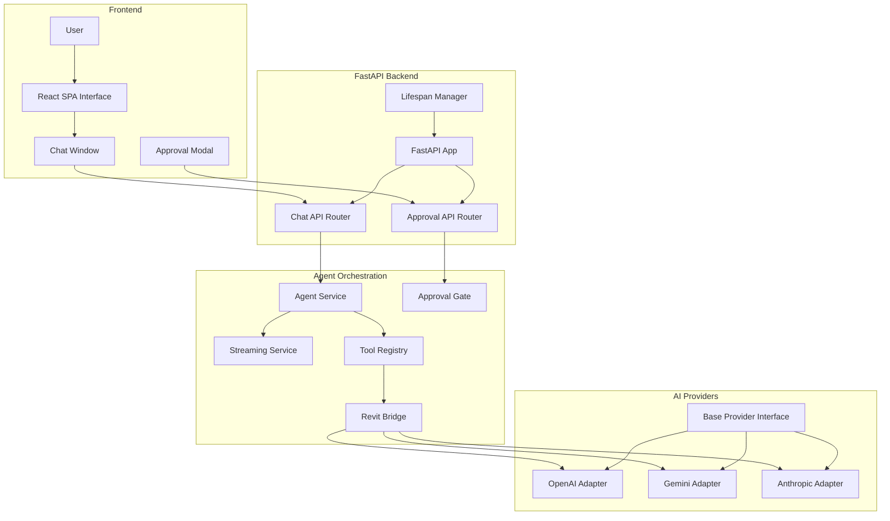
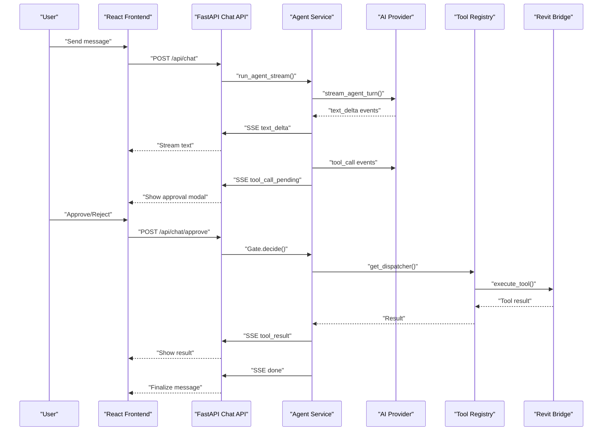
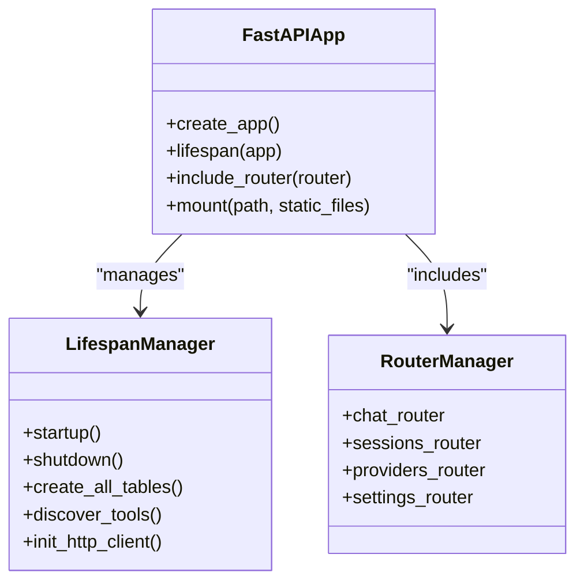
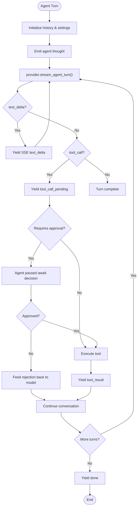
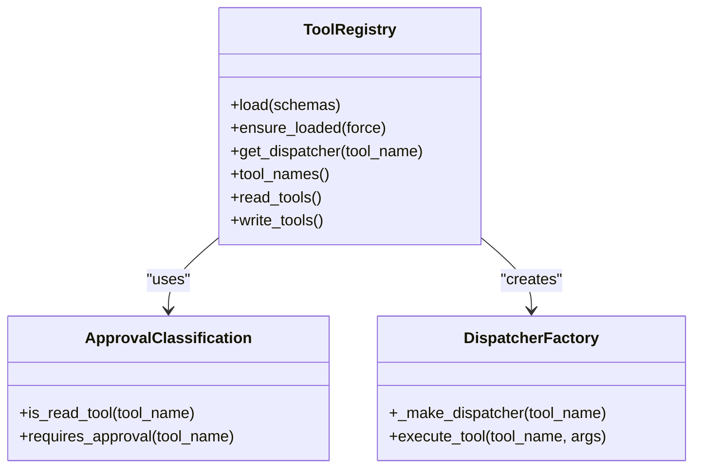
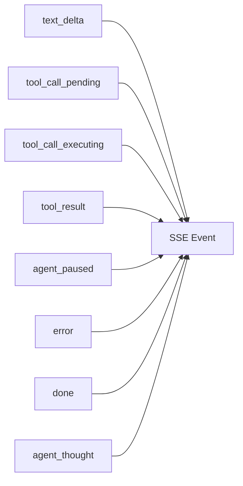
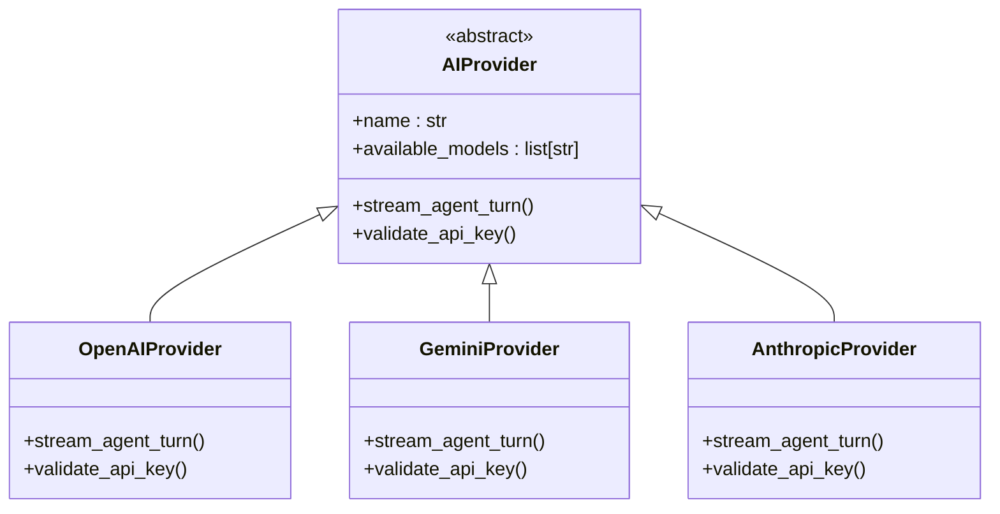
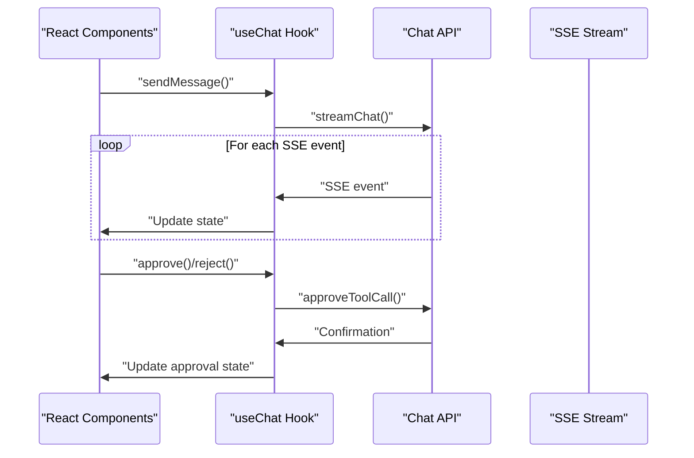
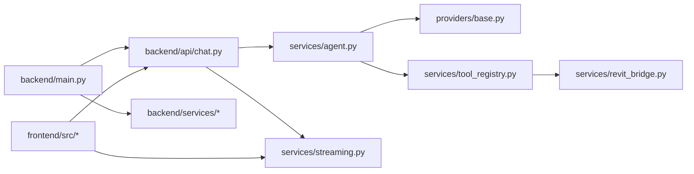

# Interpreter Layer

<cite>
**Referenced Files in This Document**
- [README.md](file://README.md)
- [backend/main.py](file://backend/main.py)
- [backend/api/chat.py](file://backend/api/chat.py)
- [backend/services/agent.py](file://backend/services/agent.py)
- [backend/services/streaming.py](file://backend/services/streaming.py)
- [backend/services/tool_registry.py](file://backend/services/tool_registry.py)
- [backend/services/revit_bridge.py](file://backend/services/revit_bridge.py)
- [backend/providers/base.py](file://backend/providers/base.py)
- [backend/config.py](file://backend/config.py)
- [backend/database.py](file://backend/database.py)
- [backend/models.py](file://backend/models.py)
- [frontend/src/App.tsx](file://frontend/src/App.tsx)
- [frontend/src/hooks/useChat.ts](file://frontend/src/hooks/useChat.ts)
</cite>

## Update Summary
**Changes Made**
- Complete removal of interpreter layer components (parser.py, translator.py, patterns.py)
- Replacement of CLI daemon architecture with FastAPI-based RESTful architecture
- New agent orchestration system with human-in-the-loop approval
- Real-time streaming via Server-Sent Events (SSE)
- Tool registry system replacing manual payload generation
- Frontend integration with React-based chat interface

## Table of Contents
1. [Introduction](#introduction)
2. [Project Structure](#project-structure)
3. [Core Components](#core-components)
4. [Architecture Overview](#architecture-overview)
5. [Detailed Component Analysis](#detailed-component-analysis)
6. [Dependency Analysis](#dependency-analysis)
7. [Performance Considerations](#performance-considerations)
8. [Troubleshooting Guide](#troubleshooting-guide)
9. [Conclusion](#conclusion)
10. [Appendices](#appendices)

## Introduction
This document explains the new FastAPI-based architecture that replaces the previous interpreter layer. The system now operates as a real-time conversational AI platform that streams responses via Server-Sent Events and manages human-in-the-loop approvals for potentially destructive actions. Users interact through a web interface that communicates with a FastAPI backend, which orchestrates AI model interactions and Revit bridge communications.

## Project Structure
The new architecture centers around a FastAPI application with modular services:
- FastAPI main application with lifespan management
- Agent service for multi-turn conversations with approval gates
- Tool registry for dynamic tool discovery and execution
- Streaming service for real-time event delivery
- Provider abstraction for multiple AI model integrations
- Revit bridge service for C# bridge communication

**Diagram sources**
- [backend/main.py:110-166](file://backend/main.py#L110-L166)
- [backend/api/chat.py:74-297](file://backend/api/chat.py#L74-L297)
- [backend/services/agent.py:94-366](file://backend/services/agent.py#L94-L366)
- [backend/services/tool_registry.py:62-191](file://backend/services/tool_registry.py#L62-L191)
- [backend/services/revit_bridge.py:91-202](file://backend/services/revit_bridge.py#L91-L202)
- [backend/providers/base.py:63-124](file://backend/providers/base.py#L63-L124)

**Section sources**
- [backend/main.py:1-183](file://backend/main.py#L1-L183)
- [backend/api/chat.py:1-435](file://backend/api/chat.py#L1-L435)

## Core Components
- **FastAPI Application**: Central HTTP server with CORS middleware and SPA routing
- **Agent Service**: Multi-turn conversation manager with approval gates for destructive actions
- **Tool Registry**: Dynamic discovery and dispatch of Revit bridge tools
- **Streaming Service**: Real-time event delivery via Server-Sent Events
- **Provider Abstraction**: Unified interface for multiple AI model integrations
- **Approval System**: Human-in-the-loop mechanism for critical operations

**Section sources**
- [backend/main.py:110-166](file://backend/main.py#L110-L166)
- [backend/services/agent.py:94-366](file://backend/services/agent.py#L94-L366)
- [backend/services/tool_registry.py:62-191](file://backend/services/tool_registry.py#L62-L191)
- [backend/services/streaming.py:22-93](file://backend/services/streaming.py#L22-L93)
- [backend/providers/base.py:63-124](file://backend/providers/base.py#L63-L124)

## Architecture Overview
The new architecture eliminates the deterministic natural language parser in favor of a flexible conversational AI system:
- **Real-time streaming**: Responses are delivered incrementally via SSE
- **Human approval**: Critical actions require explicit user consent
- **Dynamic tool discovery**: Tools are automatically discovered from the Revit bridge
- **Provider flexibility**: Support for multiple AI model providers through a common interface

**Diagram sources**
- [backend/api/chat.py:139-261](file://backend/api/chat.py#L139-L261)
- [backend/services/agent.py:159-366](file://backend/services/agent.py#L159-L366)
- [backend/services/tool_registry.py:153-183](file://backend/services/tool_registry.py#L153-L183)
- [backend/services/revit_bridge.py:167-202](file://backend/services/revit_bridge.py#L167-L202)

## Detailed Component Analysis

### FastAPI Application Architecture
The application serves as the central HTTP entry point with comprehensive initialization and lifecycle management:
- **Lifespan management**: Handles database setup, tool discovery, and HTTP client initialization
- **CORS configuration**: Enables cross-origin requests for development and production
- **Router mounting**: Includes chat, sessions, providers, and settings endpoints
- **SPA routing**: Serves React frontend in production mode with fallback routing

**Diagram sources**
- [backend/main.py:62-104](file://backend/main.py#L62-L104)
- [backend/main.py:110-166](file://backend/main.py#L110-L166)

**Section sources**
- [backend/main.py:110-166](file://backend/main.py#L110-L166)
- [backend/main.py:62-104](file://backend/main.py#L62-L104)

### Agent Service: Conversational Orchestration
The agent service manages multi-turn conversations with sophisticated approval handling:
- **Approval gates**: Shared state between agent coroutine and HTTP handler
- **Event streaming**: Yields structured SSE events for real-time UI updates
- **Tool execution**: Integrates with tool registry for dynamic action execution
- **Development mode**: Auto-approval bypass for testing scenarios

**Diagram sources**
- [backend/services/agent.py:94-366](file://backend/services/agent.py#L94-L366)

**Section sources**
- [backend/services/agent.py:94-366](file://backend/services/agent.py#L94-L366)

### Tool Registry: Dynamic Tool Management
The tool registry provides centralized management of Revit bridge tools:
- **Automatic discovery**: Periodic tool schema retrieval from bridge
- **Dispatcher mapping**: Creates callable dispatchers for each tool
- **Approval classification**: Determines which tools require human approval
- **Fallback mechanisms**: Development mode support with cached schemas

**Diagram sources**
- [backend/services/tool_registry.py:62-191](file://backend/services/tool_registry.py#L62-L191)

**Section sources**
- [backend/services/tool_registry.py:62-191](file://backend/services/tool_registry.py#L62-L191)

### Streaming Service: Real-time Event Delivery
The streaming service provides a standardized interface for real-time event communication:
- **Event types**: Comprehensive coverage of conversation states (text, tools, errors)
- **Consistent format**: JSON-encoded events with stable contracts
- **Frontend compatibility**: Structured events that drive UI updates

**Diagram sources**
- [backend/services/streaming.py:31-92](file://backend/services/streaming.py#L31-L92)

**Section sources**
- [backend/services/streaming.py:22-93](file://backend/services/streaming.py#L22-L93)

### Provider Abstraction: Multi-Model Support
The provider abstraction enables seamless integration with multiple AI model providers:
- **Unified interface**: Common methods for streaming agent turns
- **System prompts**: Standardized instructions for consistent behavior
- **Validation support**: Lightweight API key verification

**Diagram sources**
- [backend/providers/base.py:63-124](file://backend/providers/base.py#L63-L124)

**Section sources**
- [backend/providers/base.py:18-60](file://backend/providers/base.py#L18-L60)
- [backend/providers/base.py:63-124](file://backend/providers/base.py#L63-L124)

### Frontend Integration: React-based Interface
The frontend provides a modern React interface that consumes the streaming API:
- **Real-time updates**: SSE event processing for immediate UI feedback
- **Approval workflow**: Modal-based approval system for critical actions
- **Session management**: Persistent conversation state across browser sessions
- **Provider selection**: Dynamic model and provider configuration

**Diagram sources**
- [frontend/src/hooks/useChat.ts:24-96](file://frontend/src/hooks/useChat.ts#L24-L96)
- [frontend/src/App.tsx:52-79](file://frontend/src/App.tsx#L52-L79)

**Section sources**
- [frontend/src/hooks/useChat.ts:18-97](file://frontend/src/hooks/useChat.ts#L18-L97)
- [frontend/src/App.tsx:25-79](file://frontend/src/App.tsx#L25-L79)

## Dependency Analysis
The new architecture introduces a more modular dependency structure:
- **FastAPI main**: Central application with router and middleware configuration
- **Agent service**: Core orchestration with provider abstraction and tool registry
- **Streaming service**: Event formatting and delivery infrastructure
- **Provider implementations**: Specific AI model integrations
- **Frontend integration**: React components consuming the streaming API

**Diagram sources**
- [backend/main.py:31-39](file://backend/main.py#L31-L39)
- [backend/api/chat.py:27-33](file://backend/api/chat.py#L27-L33)
- [backend/services/agent.py:28-30](file://backend/services/agent.py#L28-L30)
- [backend/services/tool_registry.py:18](file://backend/services/tool_registry.py#L18)

**Section sources**
- [backend/main.py:31-39](file://backend/main.py#L31-L39)
- [backend/api/chat.py:27-33](file://backend/api/chat.py#L27-L33)

## Performance Considerations
- **Streaming architecture**: Real-time delivery reduces perceived latency
- **Connection pooling**: HTTP client reuse improves bridge communication performance
- **Event filtering**: Client-side artifact filtering prevents UI corruption
- **Memory management**: Approval gates cleaned up after session completion
- **Development optimizations**: Auto-approval bypass for testing scenarios

## Troubleshooting Guide
Common issues and resolutions:
- **Bridge connectivity**: Ensure Revit bridge is running and accessible
- **Tool discovery failures**: Check bridge health and retry tool discovery
- **Approval timeouts**: Verify approval modal is functioning and user can respond
- **Streaming interruptions**: Monitor SSE connection and handle abort scenarios
- **Provider configuration**: Validate API keys and model availability

**Section sources**
- [backend/services/revit_bridge.py:73-84](file://backend/services/revit_bridge.py#L73-L84)
- [backend/services/agent.py:256-291](file://backend/services/agent.py#L256-L291)
- [frontend/src/hooks/useChat.ts:57-66](file://frontend/src/hooks/useChat.ts#L57-L66)

## Conclusion
The new FastAPI-based architecture represents a fundamental shift from deterministic natural language processing to a flexible conversational AI system. This approach provides greater flexibility, better user experience through real-time streaming, and robust safety mechanisms through human-in-the-loop approvals. The modular design enables easy provider switching and tool expansion while maintaining consistent user interfaces and reliable operation.

## Appendices

### Appendix A: End-to-End Flow Reference
The new system operates through a streamlined flow:
- User sends message via React interface
- FastAPI routes handle authentication and session management
- Agent service orchestrates multi-turn conversation with AI provider
- Tool registry manages dynamic tool execution with approval gating
- Streaming service delivers real-time updates to frontend
- Results are persisted to database for conversation history

**Section sources**
- [backend/api/chat.py:74-261](file://backend/api/chat.py#L74-L261)
- [backend/services/agent.py:94-366](file://backend/services/agent.py#L94-L366)
- [frontend/src/hooks/useChat.ts:24-96](file://frontend/src/hooks/useChat.ts#L24-L96)