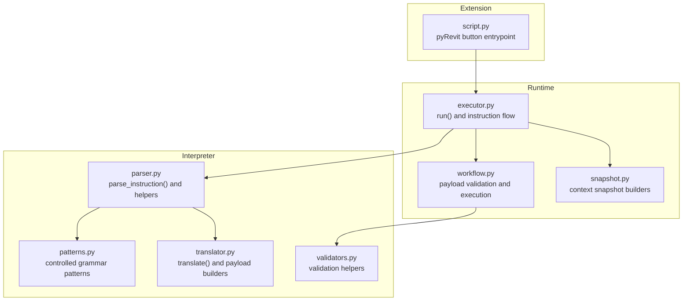
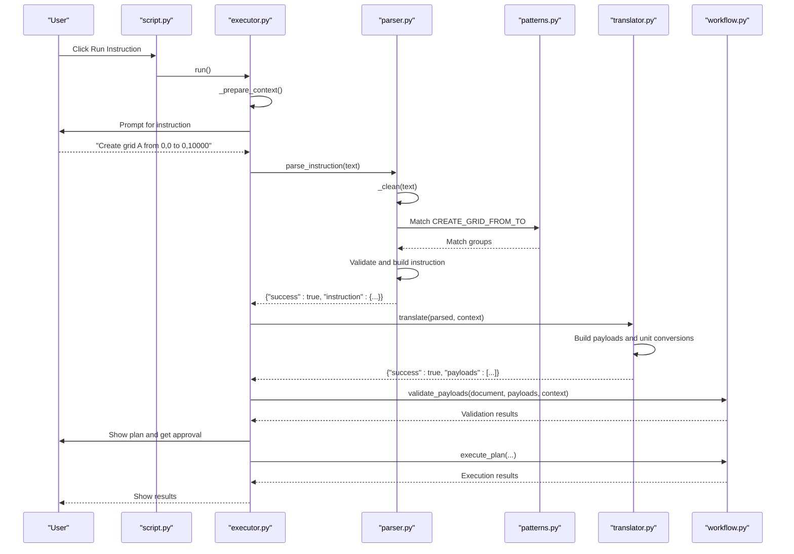
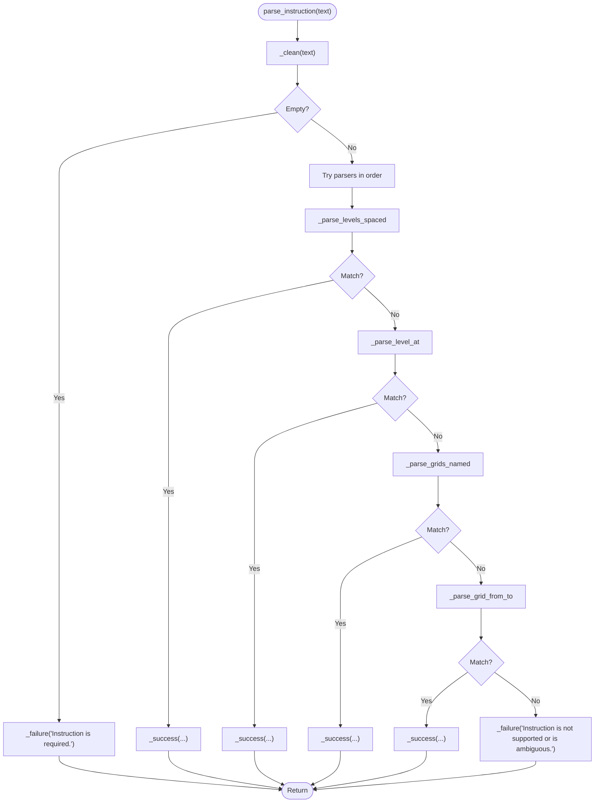
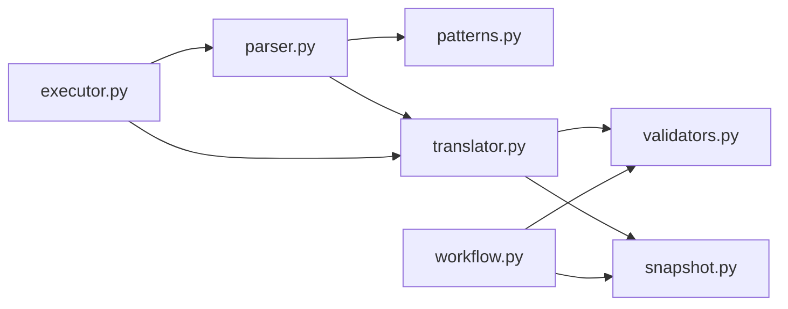

# Natural Language Parsing

<cite>
**Referenced Files in This Document**
- [parser.py](file://interpreter/parser.py)
- [patterns.py](file://interpreter/patterns.py)
- [translator.py](file://interpreter/translator.py)
- [executor.py](file://runtime/executor.py)
- [workflow.py](file://runtime/workflow.py)
- [validators.py](file://tools/validators.py)
- [snapshot.py](file://runtime_context/snapshot.py)
- [README.md](file://README.md)
- [script.py](file://extension/AIRevit.extension/AI Revit.tab/Execution.panel/Run Instruction.pushbutton/script.py)
</cite>

## Table of Contents
1. [Introduction](#introduction)
2. [Project Structure](#project-structure)
3. [Core Components](#core-components)
4. [Architecture Overview](#architecture-overview)
5. [Detailed Component Analysis](#detailed-component-analysis)
6. [Dependency Analysis](#dependency-analysis)
7. [Performance Considerations](#performance-considerations)
8. [Troubleshooting Guide](#troubleshooting-guide)
9. [Conclusion](#conclusion)

## Introduction
This document explains the natural language parsing component that converts user instructions into structured interpretation results. The parser follows a deterministic, controlled-grammar philosophy: it rejects ambiguous language in favor of explicit, structured intent. The system cleans and normalizes raw user text, then systematically applies a prioritized set of pattern-matching parsers. Each parser targets a specific instruction type (levels spaced, level at elevation, named grids, grid coordinates). Validation ensures only unambiguous, executable intent proceeds to payload generation and runtime execution.

## Project Structure
The natural language parsing pipeline spans several layers:
- Interpreter: parses user instructions and translates them into standardized payloads
- Runtime: orchestrates context snapshot creation, instruction entry, payload validation, plan generation, and execution
- Tools and schemas: provide validation helpers and payload schemas
- Extension: entrypoint that triggers the runtime flow

**Diagram sources**
- [script.py:1-21](file://extension/AIRevit.extension/AI Revit.tab/Execution.panel/Run Instruction.pushbutton/script.py#L1-L21)
- [executor.py:1-285](file://runtime/executor.py#L1-L285)
- [workflow.py:1-235](file://runtime/workflow.py#L1-L235)
- [snapshot.py:1-37](file://runtime_context/snapshot.py#L1-L37)
- [parser.py:1-141](file://interpreter/parser.py#L1-L141)
- [patterns.py:1-29](file://interpreter/patterns.py#L1-L29)
- [translator.py:1-155](file://interpreter/translator.py#L1-L155)
- [validators.py:1-85](file://tools/validators.py#L1-L85)

**Section sources**
- [README.md:14-50](file://README.md#L14-L50)
- [script.py:1-21](file://extension/AIRevit.extension/AI Revit.tab/Execution.panel/Run Instruction.pushbutton/script.py#L1-L21)
- [executor.py:107-130](file://runtime/executor.py#L107-L130)

## Core Components
- Deterministic parser: cleans input, tries parsers in order of specificity, and returns structured success/failure
- Controlled grammar patterns: strict regular expressions that define supported instruction forms
- Translator: converts parse results into standardized payloads and performs context-aware checks
- Runtime integration: orchestrates instruction entry, context snapshot creation, and payload validation

Key responsibilities:
- Cleaning and normalization of user input
- Strict pattern matching for supported instruction types
- Validation of numeric constraints and name formats
- Context-aware duplicate-name detection
- Structured error messages that prevent ambiguous instructions from reaching execution

**Section sources**
- [parser.py:18-29](file://interpreter/parser.py#L18-L29)
- [patterns.py:6-28](file://interpreter/patterns.py#L6-L28)
- [translator.py:17-38](file://interpreter/translator.py#L17-L38)
- [executor.py:107-130](file://runtime/executor.py#L107-L130)

## Architecture Overview
The natural language parsing pipeline integrates with the broader runtime flow. The pyRevit button entrypoint triggers the runtime executor, which:
1. Creates a context snapshot
2. Prompts for an instruction
3. Parses the instruction deterministically
4. Translates to payloads
5. Validates payloads against the context
6. Generates and approves a plan
7. Executes actions and reports results

**Diagram sources**
- [script.py:17-20](file://extension/AIRevit.extension/AI Revit.tab/Execution.panel/Run Instruction.pushbutton/script.py#L17-L20)
- [executor.py:107-130](file://runtime/executor.py#L107-L130)
- [parser.py:18-29](file://interpreter/parser.py#L18-L29)
- [patterns.py:23-28](file://interpreter/patterns.py#L23-L28)
- [translator.py:17-38](file://interpreter/translator.py#L17-L38)
- [workflow.py:66-81](file://runtime/workflow.py#L66-L81)

## Detailed Component Analysis

### Deterministic Parser
The parser cleans input, then applies a fixed sequence of parsers in order of specificity. If any parser succeeds, the result is returned immediately. Otherwise, a structured failure indicates ambiguity or unsupported instruction.

Processing logic:
- Clean input: normalize whitespace and strip trailing periods
- Try parsers in order:
  - Levels spaced
  - Level at elevation
  - Grid from-to coordinates
  - Named grids
- On success, return structured success with instruction metadata
- On failure, return structured failure with a clear message

**Diagram sources**
- [parser.py:18-29](file://interpreter/parser.py#L18-L29)
- [parser.py:32-50](file://interpreter/parser.py#L32-L50)
- [parser.py:53-66](file://interpreter/parser.py#L53-L66)
- [parser.py:69-85](file://interpreter/parser.py#L69-L85)
- [parser.py:88-102](file://interpreter/parser.py#L88-L102)

**Section sources**
- [parser.py:18-29](file://interpreter/parser.py#L18-L29)
- [parser.py:116-125](file://interpreter/parser.py#L116-L125)

### Instruction Cleaning and Normalization
The cleaning function:
- Ensures the input is text-like
- Strips leading/trailing whitespace and trailing periods
- Collapses internal whitespace into single spaces
- Returns empty string for non-text inputs

This normalization reduces variability in user input and improves pattern matching reliability.

**Section sources**
- [parser.py:116-125](file://interpreter/parser.py#L116-L125)

### Pattern Matching Approach
Controlled grammar patterns define strict instruction forms. Each pattern captures named groups for required values and optional units.

Supported patterns:
- Levels spaced: matches counts and spacing with optional units
- Level at elevation: matches a level name and elevation with optional units
- Named grids: matches comma-separated or “and”-joined names
- Grid from-to: matches a grid name and two coordinate pairs with optional units

Validation logic embedded in parsers:
- Levels spaced: validates positive count and positive spacing
- Grids named: rejects instructions that include “from”/“to” (coordinate instructions must use the grid-from-to form)
- Grids named: validates names are simple letters or digits, rejects single names without coordinates

**Section sources**
- [patterns.py:6-28](file://interpreter/patterns.py#L6-L28)
- [parser.py:32-50](file://interpreter/parser.py#L32-L50)
- [parser.py:53-66](file://interpreter/parser.py#L53-L66)
- [parser.py:69-85](file://interpreter/parser.py#L69-L85)
- [parser.py:88-102](file://interpreter/parser.py#L88-L102)

### Translator and Payload Generation
The translator converts successful parse results into standardized payloads:
- Levels spaced: generates multiple level payloads with computed elevations
- Level at elevation: generates one level payload
- Named grids: generates multiple parallel grid payloads with default spacing and length
- Grid from-to: generates one grid payload from explicit coordinates

Unit conversion:
- Converts parsed values to Revit’s internal feet using constants for mm and m

Context-aware checks:
- Detects conflicts with existing level/grid names from the context snapshot
- Suggests alternative names when duplicates are detected

**Section sources**
- [translator.py:17-38](file://interpreter/translator.py#L17-L38)
- [translator.py:41-47](file://interpreter/translator.py#L41-L47)
- [translator.py:50-63](file://interpreter/translator.py#L50-L63)
- [translator.py:66-68](file://interpreter/translator.py#L66-L68)
- [translator.py:94-105](file://interpreter/translator.py#L94-L105)
- [translator.py:108-127](file://interpreter/translator.py#L108-L127)
- [translator.py:139-144](file://interpreter/translator.py#L139-L144)

### Error Handling Strategy
The system enforces strict error handling to prevent ambiguous instructions from reaching execution:
- Parser-level failures: returns structured failure with a clear message
- Translator-level failures: returns structured failure for unsupported types or context conflicts
- Runtime-level validation: validates payloads against the context snapshot and rejects duplicates
- Duplicate detection: case-insensitive comparison with suggestions for alternatives

This layered approach ensures that only deterministic, structured intent proceeds to execution.

**Section sources**
- [parser.py:133-135](file://interpreter/parser.py#L133-L135)
- [translator.py:152-154](file://interpreter/translator.py#L152-L154)
- [workflow.py:114-130](file://runtime/workflow.py#L114-L130)
- [validators.py:26-31](file://tools/validators.py#L26-L31)

### Concrete Examples
Supported instructions and their outcomes:
- Levels spaced: “Create 3 levels spaced 4000 mm apart”
  - Parses into count and spacing; validates positive values
  - Translates to multiple level payloads with computed elevations
- Level at elevation: “Create Level 1 at elevation 0”
  - Parses name and elevation; validates numeric elevation
  - Translates to one level payload
- Named grids: “Create grids A, B, and C”
  - Parses comma/“and”-joined names; validates simple names
  - Translates to multiple parallel grid payloads
- Grid from-to: “Create grid A from 0,0 to 0,10000”
  - Parses name and two coordinate pairs; validates numeric coordinates
  - Translates to one grid payload

Ambiguous or invalid instructions:
- “Create grid A” or “Create levels” alone
  - Fails due to insufficient deterministic data
- Negative spacing or missing values
  - Fails due to constraint violations
- Names that are not simple letters/digits
  - Fails due to name format constraints

These examples demonstrate the controlled grammar philosophy: only explicit, structured intent is accepted.

**Section sources**
- [README.md:197-214](file://README.md#L197-L214)
- [parser.py:32-50](file://interpreter/parser.py#L32-L50)
- [parser.py:53-66](file://interpreter/parser.py#L53-L66)
- [parser.py:69-85](file://interpreter/parser.py#L69-L85)
- [parser.py:88-102](file://interpreter/parser.py#L88-L102)

## Dependency Analysis
The natural language parsing component depends on:
- Controlled grammar patterns for strict instruction forms
- Translator for payload generation and context-aware checks
- Runtime workflow for validation and execution
- Validators for duplicate-name detection and payload shape validation
- Snapshot utilities for context-aware name resolution

**Diagram sources**
- [parser.py:18-29](file://interpreter/parser.py#L18-L29)
- [patterns.py:6-28](file://interpreter/patterns.py#L6-L28)
- [translator.py:17-38](file://interpreter/translator.py#L17-L38)
- [validators.py:26-31](file://tools/validators.py#L26-L31)
- [snapshot.py:29-36](file://runtime_context/snapshot.py#L29-L36)
- [executor.py:107-130](file://runtime/executor.py#L107-L130)
- [workflow.py:114-130](file://runtime/workflow.py#L114-L130)

**Section sources**
- [parser.py:18-29](file://interpreter/parser.py#L18-L29)
- [translator.py:108-127](file://interpreter/translator.py#L108-L127)
- [workflow.py:114-130](file://runtime/workflow.py#L114-L130)

## Performance Considerations
- Pattern matching is linear-time relative to instruction length and uses compiled regular expressions
- Cleaning is O(n) with a single pass and minimal allocations
- Translation is O(n) over the number of generated payloads
- Context-aware checks are O(n) over existing names; case-insensitive comparisons are efficient for typical BIM naming sets
- The deterministic approach avoids backtracking and ambiguity, reducing computational overhead

[No sources needed since this section provides general guidance]

## Troubleshooting Guide
Common issues and resolutions:
- Instruction rejected as ambiguous
  - Ensure the instruction matches one of the controlled grammar forms
  - Provide required values (counts, spacing, names, coordinates)
- Constraint violations
  - Positive count and positive spacing for levels spaced
  - Numeric elevations and coordinates
- Duplicate names
  - Use suggested alternative names provided by the system
  - Edit payloads before validation if needed
- Unsupported action or payload shape
  - Verify payload structure and action type
  - Check that payloads include required fields

Logs and context snapshots help diagnose failures at each stage of the pipeline.

**Section sources**
- [executor.py:115-128](file://runtime/executor.py#L115-L128)
- [translator.py:108-127](file://interpreter/translator.py#L108-L127)
- [workflow.py:114-130](file://runtime/workflow.py#L114-L130)
- [validators.py:26-31](file://tools/validators.py#L26-L31)

## Conclusion
The natural language parsing component enforces a controlled grammar philosophy that rejects ambiguous language in favor of explicit, structured intent. Through deterministic cleaning, strict pattern matching, and context-aware validation, it reliably converts user instructions into standardized payloads. The layered design ensures robust error handling and clear feedback, preventing invalid or ambiguous instructions from reaching execution. This approach supports safe, predictable automation of BIM operations within the broader runtime flow.