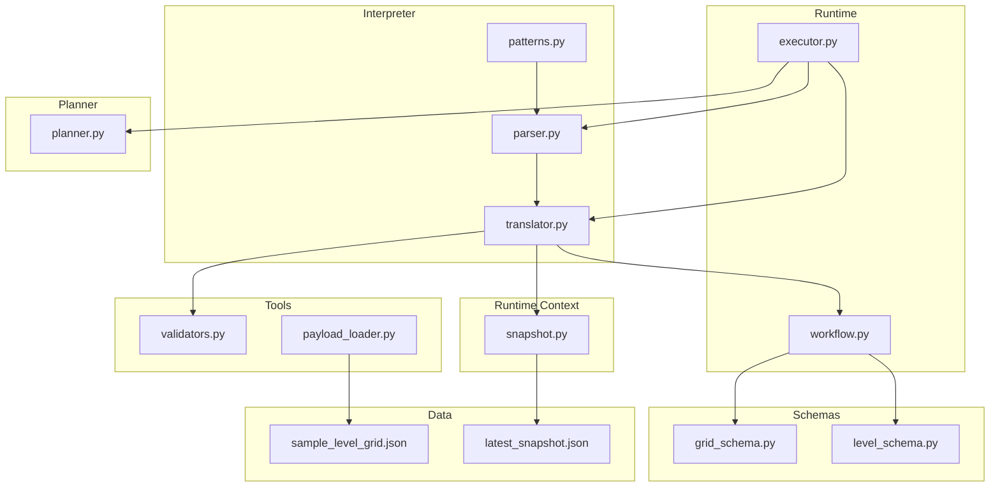
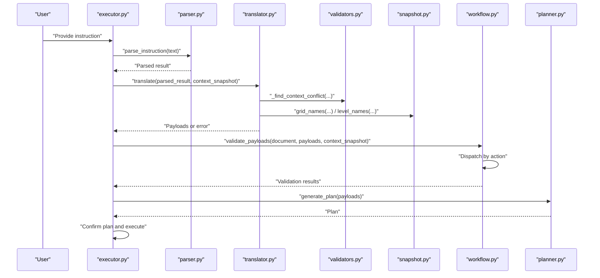
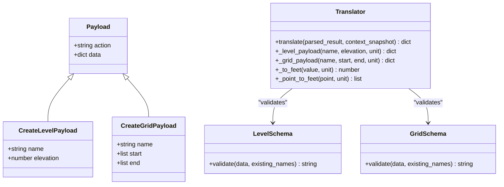
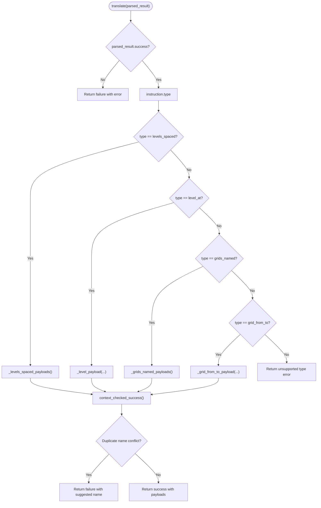
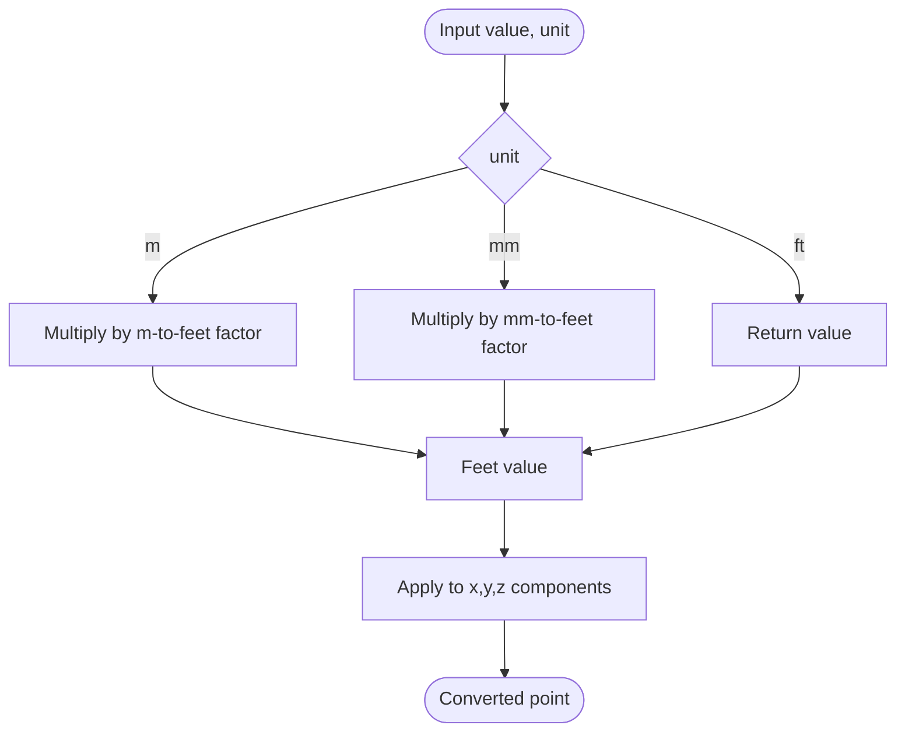
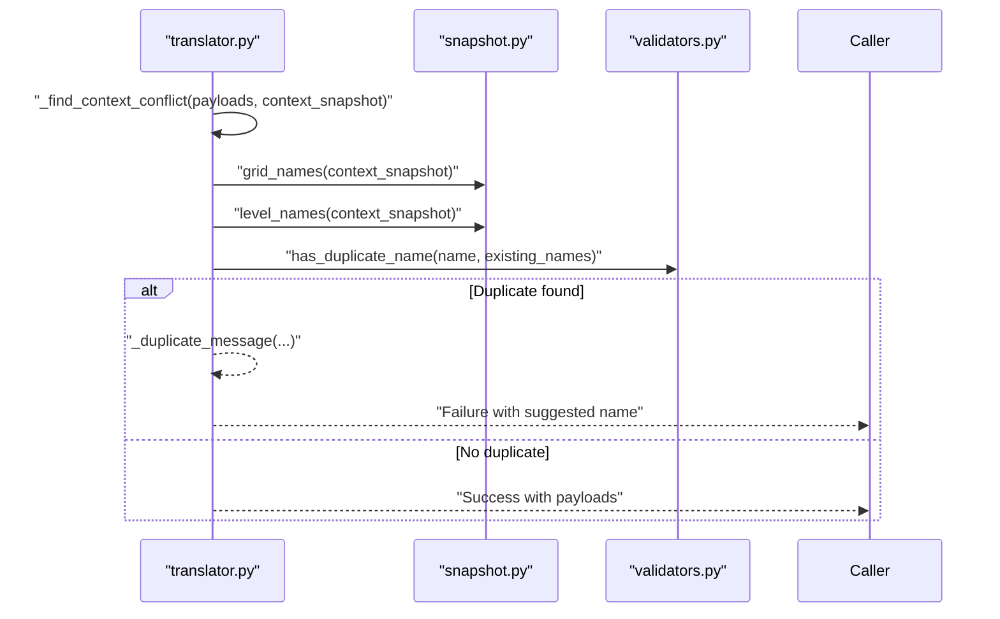
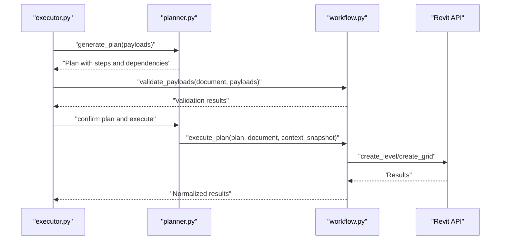
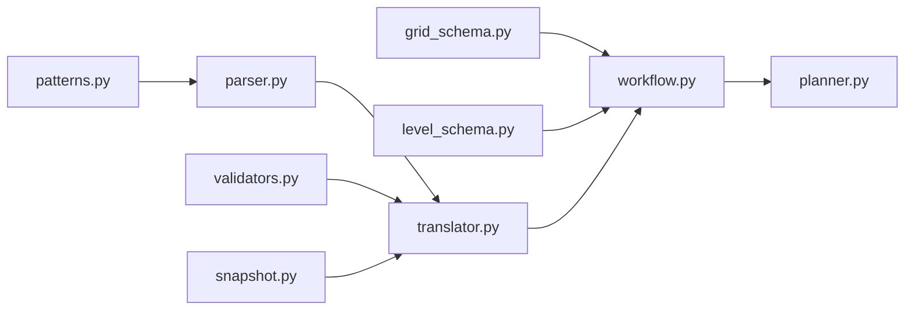

# Payload Generation

<cite>
**Referenced Files in This Document**
- [translator.py](file://interpreter/translator.py)
- [parser.py](file://interpreter/parser.py)
- [patterns.py](file://interpreter/patterns.py)
- [validators.py](file://tools/validators.py)
- [snapshot.py](file://runtime_context/snapshot.py)
- [workflow.py](file://runtime/workflow.py)
- [executor.py](file://runtime/executor.py)
- [planner.py](file://planner/planner.py)
- [grid_schema.py](file://schemas/grid_schema.py)
- [level_schema.py](file://schemas/level_schema.py)
- [payload_loader.py](file://tools/payload_loader.py)
- [sample_level_grid.json](file://data/payloads/sample_level_grid.json)
- [latest_snapshot.json](file://data/context/latest_snapshot.json)
</cite>

## Table of Contents
1. [Introduction](#introduction)
2. [Project Structure](#project-structure)
3. [Core Components](#core-components)
4. [Architecture Overview](#architecture-overview)
5. [Detailed Component Analysis](#detailed-component-analysis)
6. [Dependency Analysis](#dependency-analysis)
7. [Performance Considerations](#performance-considerations)
8. [Troubleshooting Guide](#troubleshooting-guide)
9. [Conclusion](#conclusion)
10. [Appendices](#appendices)

## Introduction
This document explains the payload generation component that transforms parsed instructions into standardized, validated payloads for the planning and execution layers. It covers how the translator converts structured interpretation results into deterministic payload formats, the payload schema design, unit conversion, context-aware validation, and the controlled nature of payload generation that ensures consistency and predictability.

## Project Structure
The payload generation pipeline spans several modules:
- Interpreter: parses natural language into structured instructions and translates them into payloads.
- Tools: pure validators and loaders that keep payload generation independent from Revit runtime.
- Schemas: define payload shapes for validation.
- Runtime: orchestrates validation, planning, and execution of payloads.
- Planner: generates deterministic plans from payloads and validates dependencies.
- Data: sample payloads and context snapshots for testing and demonstration.

**Diagram sources**
- [parser.py:1-141](file://interpreter/parser.py#L1-L141)
- [translator.py:1-155](file://interpreter/translator.py#L1-L155)
- [patterns.py:1-29](file://interpreter/patterns.py#L1-L29)
- [validators.py:1-85](file://tools/validators.py#L1-L85)
- [snapshot.py:1-37](file://runtime_context/snapshot.py#L1-L37)
- [workflow.py:1-235](file://runtime/workflow.py#L1-L235)
- [executor.py:1-285](file://runtime/executor.py#L1-L285)
- [planner.py:1-234](file://planner/planner.py#L1-L234)
- [grid_schema.py:1-23](file://schemas/grid_schema.py#L1-L23)
- [level_schema.py:1-22](file://schemas/level_schema.py#L1-L22)
- [payload_loader.py:1-60](file://tools/payload_loader.py#L1-L60)
- [sample_level_grid.json:1-18](file://data/payloads/sample_level_grid.json#L1-L18)
- [latest_snapshot.json:1-20](file://data/context/latest_snapshot.json#L1-L20)

**Section sources**
- [parser.py:1-141](file://interpreter/parser.py#L1-L141)
- [translator.py:1-155](file://interpreter/translator.py#L1-L155)
- [patterns.py:1-29](file://interpreter/patterns.py#L1-L29)
- [validators.py:1-85](file://tools/validators.py#L1-L85)
- [snapshot.py:1-37](file://runtime_context/snapshot.py#L1-L37)
- [workflow.py:1-235](file://runtime/workflow.py#L1-L235)
- [executor.py:1-285](file://runtime/executor.py#L1-L285)
- [planner.py:1-234](file://planner/planner.py#L1-L234)
- [grid_schema.py:1-23](file://schemas/grid_schema.py#L1-L23)
- [level_schema.py:1-22](file://schemas/level_schema.py#L1-L22)
- [payload_loader.py:1-60](file://tools/payload_loader.py#L1-L60)
- [sample_level_grid.json:1-18](file://data/payloads/sample_level_grid.json#L1-L18)
- [latest_snapshot.json:1-20](file://data/context/latest_snapshot.json#L1-L20)

## Core Components
- Translator: Converts parsed instruction results into standardized payloads, performs unit conversions, and applies context-aware validation to prevent duplicates.
- Parser and Patterns: Controlled natural-language parsing with explicit grammar to ensure deterministic interpretation.
- Validators: Pure validation helpers for payload shape, required fields, duplicates, and data types.
- Schemas: Define payload shapes for create_level and create_grid actions.
- Runtime Workflow: Validates payloads, dispatches actions, and executes them deterministically.
- Planner: Generates a deterministic plan from payloads and validates dependencies before execution.
- Payload Loader: Loads and formats payload JSON for inspection and editing.

Key responsibilities:
- Controlled instruction types: levels_spaced, level_at, grids_named, grid_from_to.
- Unit conversion to Revit internal units (feet).
- Context-aware duplicate-name detection and suggestions.
- Deterministic payload schema for downstream processing.

**Section sources**
- [translator.py:17-38](file://interpreter/translator.py#L17-L38)
- [parser.py:18-29](file://interpreter/parser.py#L18-L29)
- [patterns.py:6-28](file://interpreter/patterns.py#L6-L28)
- [validators.py:19-84](file://tools/validators.py#L19-L84)
- [grid_schema.py:10-22](file://schemas/grid_schema.py#L10-L22)
- [level_schema.py:10-21](file://schemas/level_schema.py#L10-L21)
- [workflow.py:66-130](file://runtime/workflow.py#L66-L130)
- [planner.py:35-61](file://planner/planner.py#L35-L61)
- [payload_loader.py:22-59](file://tools/payload_loader.py#L22-L59)

## Architecture Overview
The payload generation architecture separates interpretation, translation, validation, planning, and execution to ensure determinism and safety.

**Diagram sources**
- [executor.py:107-130](file://runtime/executor.py#L107-L130)
- [parser.py:18-29](file://interpreter/parser.py#L18-L29)
- [translator.py:17-38](file://interpreter/translator.py#L17-L38)
- [validators.py:26-31](file://tools/validators.py#L26-L31)
- [snapshot.py:29-36](file://runtime_context/snapshot.py#L29-L36)
- [workflow.py:66-130](file://runtime/workflow.py#L66-L130)
- [planner.py:35-61](file://planner/planner.py#L35-L61)

## Detailed Component Analysis

### Payload Structure and Schema Design
Each payload follows a standardized envelope:
- action: String identifying the operation (e.g., create_level, create_grid).
- data: Dictionary containing action-specific fields.

Action-specific schemas:
- create_level: requires name and elevation; validated by level_schema.
- create_grid: requires name, start, end; validated by grid_schema.

Unit standardization:
- All measurements are converted to Revit internal units (feet) before dispatch.

Context-aware validation:
- Duplicate-name checks against context snapshot names for levels and grids.

**Diagram sources**
- [translator.py:71-91](file://interpreter/translator.py#L71-L91)
- [level_schema.py:10-21](file://schemas/level_schema.py#L10-L21)
- [grid_schema.py:10-22](file://schemas/grid_schema.py#L10-L22)

**Section sources**
- [translator.py:71-91](file://interpreter/translator.py#L71-L91)
- [level_schema.py:10-21](file://schemas/level_schema.py#L10-L21)
- [grid_schema.py:10-22](file://schemas/grid_schema.py#L10-L22)

### Translation Logic and Payload Types
Supported instruction types and their transformations:

- levels_spaced
  - Input: count, spacing, unit.
  - Output: list of create_level payloads with elevations computed as index * spacing, names derived from index.
  - Unit conversion: spacing and elevations converted to feet.

- level_at
  - Input: name, elevation, unit.
  - Output: single create_level payload.

- grids_named
  - Input: list of names.
  - Output: list of create_grid payloads with default parallel alignment and offsets.
  - Unit conversion: coordinates converted to feet.

- grid_from_to
  - Input: name, start, end, unit.
  - Output: single create_grid payload.

Context-aware validation:
- After translation, payloads are checked against context snapshot names to prevent duplicates. If conflicts are found, a deterministic suggestion is provided.

**Diagram sources**
- [translator.py:17-38](file://interpreter/translator.py#L17-L38)
- [translator.py:41-63](file://interpreter/translator.py#L41-L63)
- [translator.py:108-127](file://interpreter/translator.py#L108-L127)

**Section sources**
- [translator.py:25-36](file://interpreter/translator.py#L25-L36)
- [translator.py:41-63](file://interpreter/translator.py#L41-L63)
- [translator.py:108-127](file://interpreter/translator.py#L108-L127)

### Unit Conversion System
The translator standardizes all measurements to Revit internal units (feet) using controlled conversion factors:
- Millimeters to feet: multiply by a constant factor.
- Meters to feet: multiply by a constant factor.
- Feet remain unchanged.

Point conversion:
- Each coordinate in start and end arrays is converted independently.

**Diagram sources**
- [translator.py:99-105](file://interpreter/translator.py#L99-L105)
- [translator.py:94-96](file://interpreter/translator.py#L94-L96)

**Section sources**
- [translator.py:11-14](file://interpreter/translator.py#L11-L14)
- [translator.py:99-105](file://interpreter/translator.py#L99-L105)
- [translator.py:94-96](file://interpreter/translator.py#L94-L96)

### Context-Aware Validation and Integrity
During translation, the translator checks for duplicate names against the context snapshot:
- For create_level: compare against level names from the snapshot.
- For create_grid: compare against grid names from the snapshot.
- If a conflict is detected, a deterministic duplicate message is produced with a suggested alternative name.

This ensures data integrity by preventing conflicting names before payloads reach the runtime.

**Diagram sources**
- [translator.py:116-127](file://interpreter/translator.py#L116-L127)
- [snapshot.py:29-36](file://runtime_context/snapshot.py#L29-L36)
- [validators.py:26-31](file://tools/validators.py#L26-L31)

**Section sources**
- [translator.py:116-127](file://interpreter/translator.py#L116-L127)
- [snapshot.py:29-36](file://runtime_context/snapshot.py#L29-L36)
- [validators.py:26-31](file://tools/validators.py#L26-L31)

### Example Transformations
Below are representative examples of how parsed results transform into final payloads. These illustrate the controlled nature of payload generation and the deterministic schema.

- levels_spaced
  - Parsed input: count=3, spacing=4000 mm.
  - Generated payloads: three create_level payloads with elevations at 0, spacing, 2*spacing, all in feet.

- level_at
  - Parsed input: name="Level 1", elevation=0 mm.
  - Generated payload: one create_level payload with elevation converted to feet.

- grids_named
  - Parsed input: names=["A","B","C"].
  - Generated payloads: three create_grid payloads with default parallel alignment and offsets, coordinates in feet.

- grid_from_to
  - Parsed input: name="G1", start=[0,0,0], end=[10000,0,0] mm.
  - Generated payload: one create_grid payload with start and end converted to feet.

These examples demonstrate the controlled, predictable transformation from natural language to standardized payloads.

**Section sources**
- [translator.py:41-47](file://interpreter/translator.py#L41-L47)
- [translator.py:25-30](file://interpreter/translator.py#L25-L30)
- [translator.py:50-63](file://interpreter/translator.py#L50-L63)
- [translator.py:66-68](file://interpreter/translator.py#L66-L68)

### Downstream Processing by Planner and Runtime
The planner consumes the list of payloads to build a deterministic execution plan:
- Each payload becomes a step with dependencies.
- Default dependency ordering is sequential to preserve BIM operation order.
- The plan is validated for structural correctness and dependency integrity before execution.

The runtime validates payloads against schemas and executes actions:
- validate_payloads checks payload shape, action support, schema data, and duplicates.
- execute_payload dispatches actions to create_level or create_grid.
- Results are normalized and summarized.

**Diagram sources**
- [executor.py:164-180](file://runtime/executor.py#L164-L180)
- [planner.py:35-61](file://planner/planner.py#L35-L61)
- [workflow.py:66-130](file://runtime/workflow.py#L66-L130)
- [workflow.py:163-180](file://runtime/workflow.py#L163-L180)

**Section sources**
- [planner.py:35-61](file://planner/planner.py#L35-L61)
- [workflow.py:66-130](file://runtime/workflow.py#L66-L130)
- [executor.py:133-161](file://runtime/executor.py#L133-L161)

## Dependency Analysis
The translator depends on:
- Parser and patterns for deterministic instruction parsing.
- Validators for duplicate-name checks.
- Snapshot utilities for context-aware validation.
- Schemas for payload shape validation.

The runtime workflow depends on:
- Schemas for payload validation.
- Validators for payload shape and duplicates.
- Snapshot utilities for context-aware name resolution.

**Diagram sources**
- [patterns.py:1-29](file://interpreter/patterns.py#L1-L29)
- [parser.py:18-29](file://interpreter/parser.py#L18-L29)
- [translator.py:1-15](file://interpreter/translator.py#L1-L15)
- [validators.py:1-85](file://tools/validators.py#L1-L85)
- [snapshot.py:1-37](file://runtime_context/snapshot.py#L1-L37)
- [grid_schema.py:1-23](file://schemas/grid_schema.py#L1-L23)
- [level_schema.py:1-22](file://schemas/level_schema.py#L1-L22)
- [workflow.py:1-235](file://runtime/workflow.py#L1-L235)
- [planner.py:1-234](file://planner/planner.py#L1-L234)

**Section sources**
- [translator.py:1-15](file://interpreter/translator.py#L1-L15)
- [workflow.py:1-235](file://runtime/workflow.py#L1-L235)

## Performance Considerations
- Deterministic translation and validation minimize branching and repeated computations.
- Unit conversion is O(n) per payload, with constant-time per coordinate.
- Context-aware duplicate checks are O(m) per payload, where m is the number of existing names.
- Planning and dependency validation occur once per payload list, with topological sorting providing efficient ordering.

## Troubleshooting Guide
Common issues and resolutions:
- Unsupported instruction type: Ensure the instruction matches one of the supported patterns.
- Invalid payload shape: Verify the payload envelope contains action and data fields.
- Missing required fields: Ensure create_level has name and elevation, and create_grid has name, start, end.
- Duplicate names: Use the suggested alternative name provided by the translator.
- Invalid JSON during editing: Correct the JSON syntax before resubmission.

Validation utilities:
- validate_payload_shape: Checks payload envelope structure.
- validate_level_data and validate_grid_data: Enforce schema requirements.
- has_duplicate_name: Case-insensitive duplicate detection.

**Section sources**
- [validators.py:46-84](file://tools/validators.py#L46-L84)
- [translator.py:130-144](file://interpreter/translator.py#L130-L144)
- [payload_loader.py:41-54](file://tools/payload_loader.py#L41-L54)

## Conclusion
The payload generation component provides a controlled, deterministic transformation from parsed instructions to standardized payloads. Through explicit schemas, unit conversion, and context-aware validation, it ensures data integrity and predictability for downstream planning and execution. The separation of concerns across interpreter, tools, schemas, runtime, and planner enables robust, testable, and extensible BIM operations.

## Appendices

### Appendix A: Sample Payloads and Context Snapshots
Sample payloads demonstrate the payload envelope and action-specific fields. Context snapshots provide baseline names for validation.

- Sample payloads: [sample_level_grid.json:1-18](file://data/payloads/sample_level_grid.json#L1-L18)
- Context snapshot: [latest_snapshot.json:1-20](file://data/context/latest_snapshot.json#L1-L20)

**Section sources**
- [sample_level_grid.json:1-18](file://data/payloads/sample_level_grid.json#L1-L18)
- [latest_snapshot.json:1-20](file://data/context/latest_snapshot.json#L1-L20)