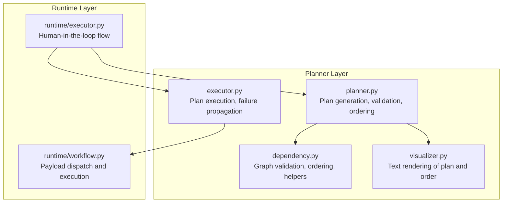
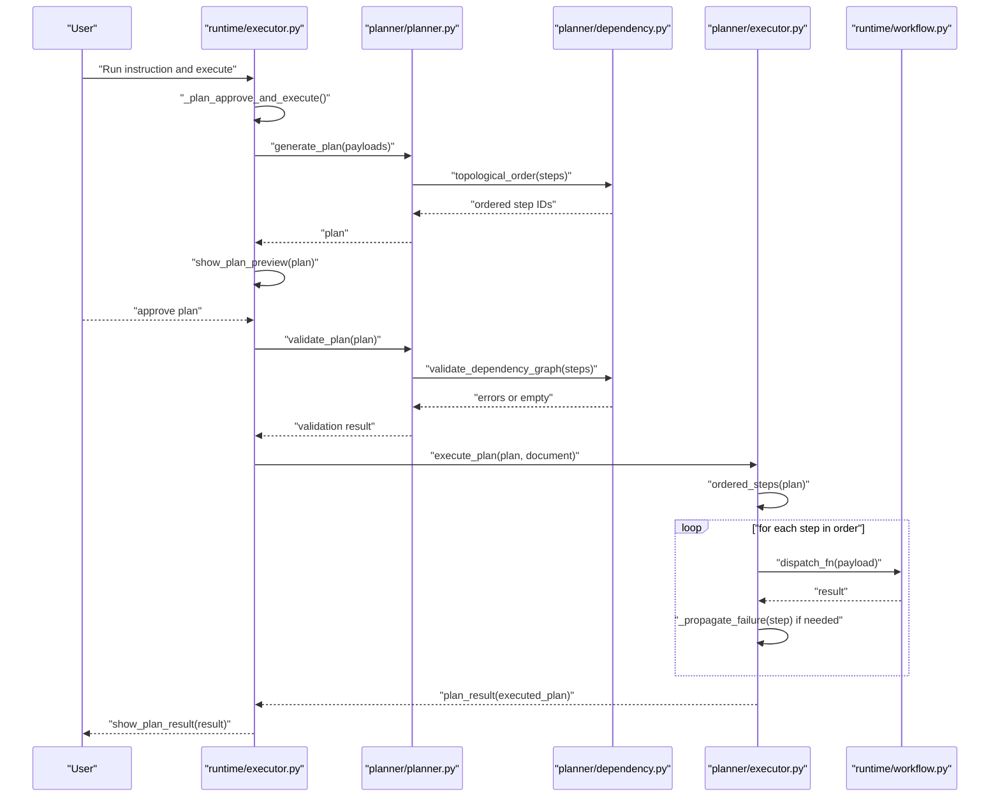
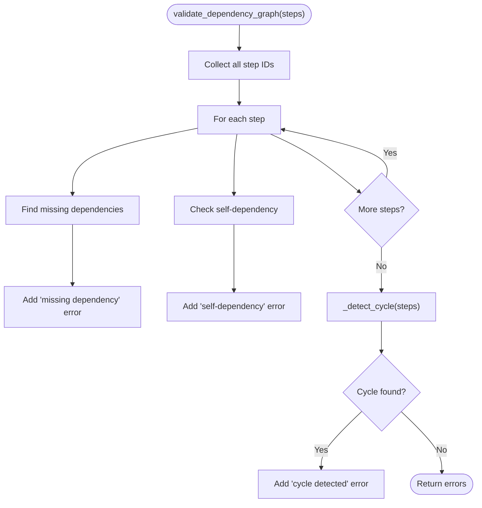
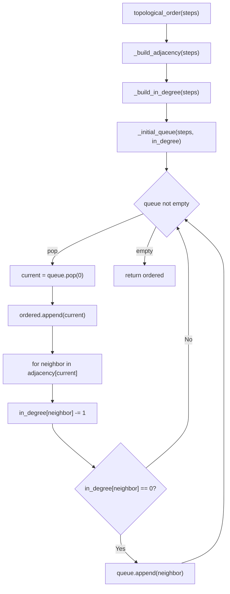
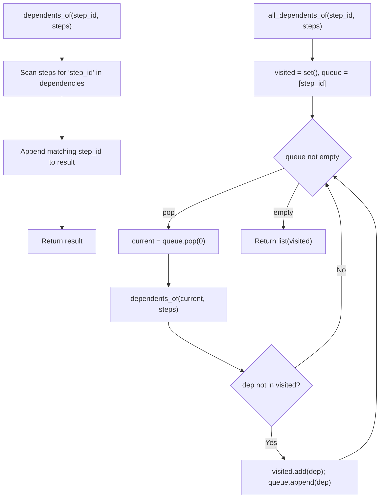
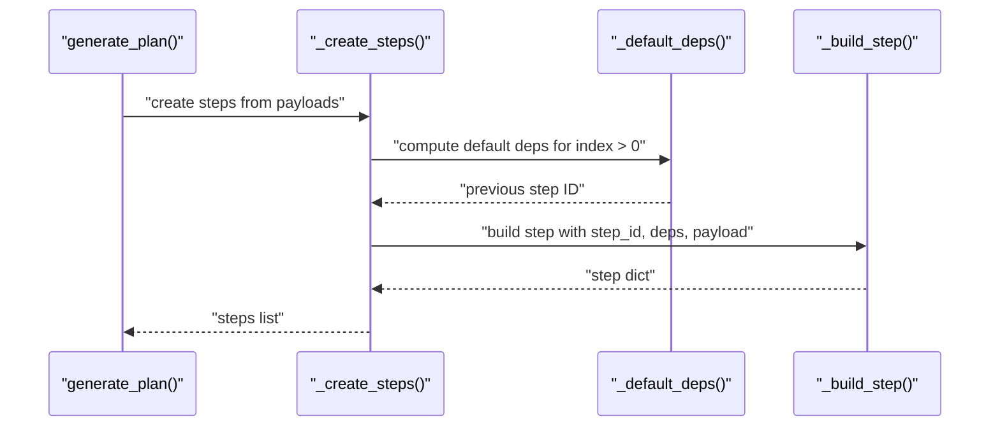
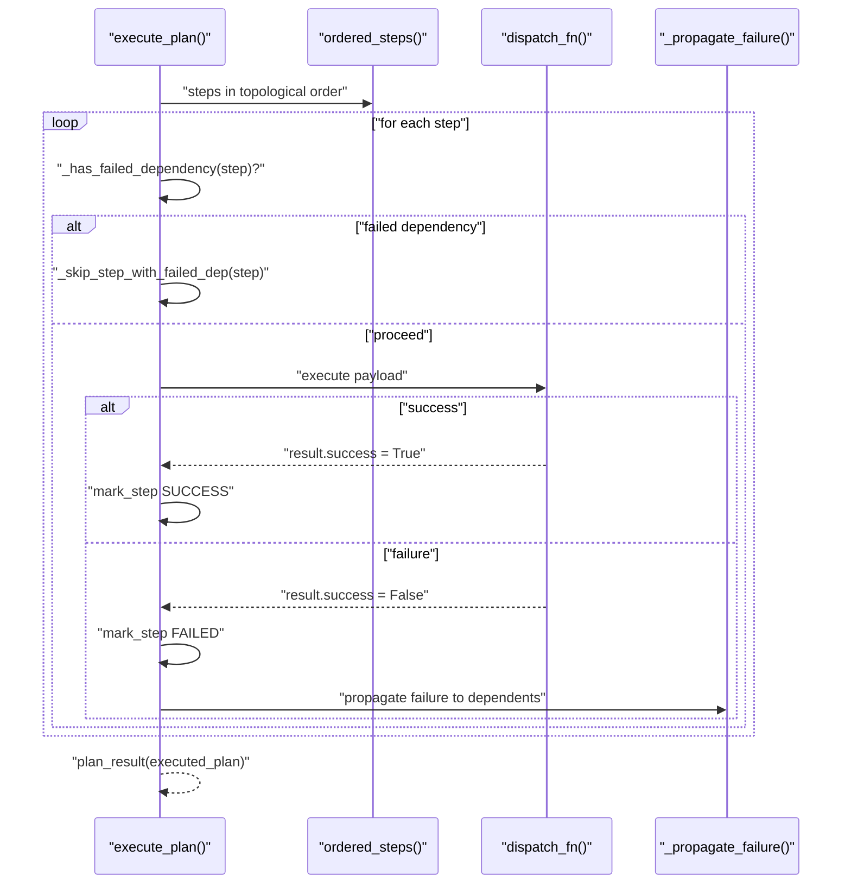
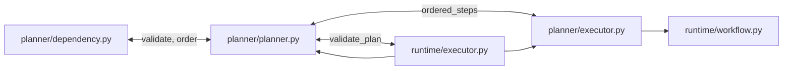

# Dependency Management

<cite>
**Referenced Files in This Document**
- [dependency.py](file://planner/dependency.py)
- [planner.py](file://planner/planner.py)
- [executor.py](file://planner/executor.py)
- [visualizer.py](file://planner/visualizer.py)
- [runtime_executor.py](file://runtime/executor.py)
- [workflow.py](file://runtime/workflow.py)
- [__init__.py](file://planner/__init__.py)
- [README.md](file://README.md)
</cite>

## Table of Contents
1. [Introduction](#introduction)
2. [Project Structure](#project-structure)
3. [Core Components](#core-components)
4. [Architecture Overview](#architecture-overview)
5. [Detailed Component Analysis](#detailed-component-analysis)
6. [Dependency Analysis](#dependency-analysis)
7. [Performance Considerations](#performance-considerations)
8. [Troubleshooting Guide](#troubleshooting-guide)
9. [Conclusion](#conclusion)
10. [Appendices](#appendices)

## Introduction
This document explains the dependency management system that constructs, validates, and orders execution steps for deterministic workflows. It covers:
- Dependency graph construction and validation
- Cycle detection to prevent circular dependencies
- Topological sorting for safe execution order
- Dependency validation ensuring referenced steps exist and form valid acyclic graphs
- Examples of explicit dependencies versus automatic sequential dependencies
- Conflict resolution strategies and debugging guidance
- Integration with the broader planning and runtime systems

The dependency layer is intentionally decoupled from Revit execution concerns to enable testing, reuse, and early failure detection.

## Project Structure
The dependency management spans the planner and runtime layers:
- Planner: plan generation, dependency validation, topological ordering, and plan visualization
- Runtime: plan approval flow, dependency validation, and step-by-step execution with failure propagation
- Workflow: payload dispatch and deterministic BIM operations

**Diagram sources**
- [dependency.py:18-224](file://planner/dependency.py#L18-L224)
- [planner.py:35-234](file://planner/planner.py#L35-L234)
- [executor.py:40-227](file://planner/executor.py#L40-L227)
- [visualizer.py:20-169](file://planner/visualizer.py#L20-L169)
- [runtime_executor.py:133-225](file://runtime/executor.py#L133-L225)
- [workflow.py:84-235](file://runtime/workflow.py#L84-L235)

**Section sources**
- [README.md:14-35](file://README.md#L14-L35)
- [__init__.py:1-18](file://planner/__init__.py#L1-L18)

## Core Components
- Dependency graph validation: checks missing dependencies, self-dependencies, and cycles
- Topological ordering: Kahn’s algorithm to compute deterministic execution order
- Dependents computation: direct and transitive dependents for failure propagation
- Plan generation: builds steps from payloads with default sequential dependencies or explicit dependencies
- Plan execution: runs steps in topological order, propagates failures, and reports results
- Visualization: renders dependency graph and execution order for human review

Key responsibilities:
- Pure reasoning layer: dependency.py operates on step dictionaries without Revit imports
- Deterministic planning: planner.py ensures reproducible plans and orders
- Failure propagation: planner.executor enforces safe downstream skipping when upstream steps fail
- Human-in-the-loop approval: runtime.executor coordinates plan preview, approval, and execution

**Section sources**
- [dependency.py:18-224](file://planner/dependency.py#L18-L224)
- [planner.py:35-234](file://planner/planner.py#L35-L234)
- [executor.py:40-227](file://planner/executor.py#L40-L227)
- [visualizer.py:20-169](file://planner/visualizer.py#L20-L169)
- [runtime_executor.py:133-225](file://runtime/executor.py#L133-L225)

## Architecture Overview
The dependency management integrates across layers to ensure safe, deterministic execution.

**Diagram sources**
- [runtime_executor.py:133-225](file://runtime/executor.py#L133-L225)
- [planner.py:35-92](file://planner/planner.py#L35-L92)
- [dependency.py:52-72](file://planner/dependency.py#L52-L72)
- [executor.py:40-95](file://planner/executor.py#L40-L95)
- [workflow.py:84-92](file://runtime/workflow.py#L84-L92)

## Detailed Component Analysis

### Dependency Graph Construction and Validation
- Validates each step’s dependencies:
  - Missing dependencies: detects references to non-existent step IDs
  - Self-dependency: detects a step depending on itself
- Detects cycles using depth-first search with recursion stack; returns one cycle path if found
- Provides human-readable dependency graph text and logs execution order for diagnostics

**Diagram sources**
- [dependency.py:18-49](file://planner/dependency.py#L18-L49)
- [dependency.py:155-172](file://planner/dependency.py#L155-L172)

**Section sources**
- [dependency.py:18-49](file://planner/dependency.py#L18-L49)
- [dependency.py:155-194](file://planner/dependency.py#L155-L194)

### Topological Ordering Implementation
- Uses Kahn’s algorithm:
  - Build adjacency list from dependencies
  - Compute in-degree for each step
  - Seed queue with steps having zero in-degree
  - Iteratively remove nodes and reduce in-degree of neighbors
  - Tie-breaking preserves original input order for determinism

**Diagram sources**
- [dependency.py:52-72](file://planner/dependency.py#L52-L72)
- [dependency.py:197-224](file://planner/dependency.py#L197-L224)

**Section sources**
- [dependency.py:52-72](file://planner/dependency.py#L52-L72)
- [dependency.py:197-224](file://planner/dependency.py#L197-L224)

### Dependents Computation for Failure Propagation
- Direct dependents: steps that list a given step ID in their dependencies
- Transitive dependents: breadth-first traversal of dependents to find all downstream steps affected by upstream failure

**Diagram sources**
- [dependency.py:75-104](file://planner/dependency.py#L75-L104)

**Section sources**
- [dependency.py:75-104](file://planner/dependency.py#L75-L104)

### Plan Generation and Default Dependencies
- Each payload becomes a step with a deterministic step ID
- Default dependency: each step depends on the previous step (sequential ordering)
- Explicit dependencies override defaults; can be provided via a mapping from step_id to dependency list

**Diagram sources**
- [planner.py:35-61](file://planner/planner.py#L35-L61)
- [planner.py:146-190](file://planner/planner.py#L146-L190)
- [planner.py:166-177](file://planner/planner.py#L166-L177)

**Section sources**
- [planner.py:35-61](file://planner/planner.py#L35-L61)
- [planner.py:146-190](file://planner/planner.py#L146-L190)
- [planner.py:166-177](file://planner/planner.py#L166-L177)

### Plan Execution and Failure Propagation
- Executes steps in topological order
- Skips steps that already failed/skipped or have failed dependencies
- On failure, marks the step failed and skips all transitive dependents

**Diagram sources**
- [executor.py:40-95](file://planner/executor.py#L40-L95)
- [executor.py:135-202](file://planner/executor.py#L135-L202)
- [workflow.py:84-92](file://runtime/workflow.py#L84-L92)

**Section sources**
- [executor.py:40-95](file://planner/executor.py#L40-L95)
- [executor.py:135-202](file://planner/executor.py#L135-L202)
- [workflow.py:84-92](file://runtime/workflow.py#L84-L92)

### Visualization and Logging
- Renders dependency graph and execution order for human review
- Logs dependency graph and order for diagnostics
- Provides plan text and result text for UI alerts

**Section sources**
- [visualizer.py:20-60](file://planner/visualizer.py#L20-L60)
- [dependency.py:125-136](file://planner/dependency.py#L125-L136)

## Dependency Analysis
- Coupling:
  - planner.planner depends on planner.dependency for validation and ordering
  - planner.executor depends on planner.dependency for transitive dependents and on planner.planner for step ordering/status
  - runtime.executor orchestrates planner and runtime.workflow for end-to-end flow
- Cohesion:
  - dependency.py encapsulates all graph-related logic (validation, ordering, helpers)
  - planner.py encapsulates plan structure, status, and ordering
  - executor.py encapsulates execution semantics and failure propagation
  - runtime.executor orchestrates the human-in-the-loop flow
- External dependencies:
  - No Revit imports in planner or dependency layers
  - runtime.executor bridges to runtime.workflow for payload execution

**Diagram sources**
- [dependency.py:18-72](file://planner/dependency.py#L18-L72)
- [planner.py:64-92](file://planner/planner.py#L64-L92)
- [executor.py:40-95](file://planner/executor.py#L40-L95)
- [runtime_executor.py:133-225](file://runtime/executor.py#L133-L225)
- [workflow.py:84-92](file://runtime/workflow.py#L84-L92)

**Section sources**
- [dependency.py:18-72](file://planner/dependency.py#L18-L72)
- [planner.py:64-92](file://planner/planner.py#L64-L92)
- [executor.py:40-95](file://planner/executor.py#L40-L95)
- [runtime_executor.py:133-225](file://runtime/executor.py#L133-L225)
- [workflow.py:84-92](file://runtime/workflow.py#L84-L92)

## Performance Considerations
- Complexity:
  - Dependency validation: O(V + E) for missing/self/cycle checks using adjacency and DFS
  - Topological sort (Kahn): O(V + E) with queue operations
  - Dependents computation: O(V + E) for BFS traversal
- Determinism:
  - Queue initialization and tie-breaking preserve input order for stable results
- Practical tips:
  - Keep dependency graphs sparse; avoid dense fan-out to minimize propagation cost
  - Prefer explicit dependencies only when necessary; default sequential ordering reduces overhead
  - Log and visualize dependency graphs to catch inefficiencies early

[No sources needed since this section provides general guidance]

## Troubleshooting Guide
Common issues and resolutions:
- Missing dependency references:
  - Symptom: Validation error indicating a step depends on a non-existent step ID
  - Resolution: Ensure all referenced step IDs exist; fix typos or omitted steps
- Self-dependency:
  - Symptom: Validation error stating a step depends on itself
  - Resolution: Remove self-reference from dependencies
- Circular dependencies:
  - Symptom: Validation error reporting a cycle path
  - Resolution: Break the cycle by removing or reworking dependencies; reconsider plan structure
- Upstream failure propagation:
  - Symptom: Downstream steps are skipped with a “dependency failed” reason
  - Resolution: Fix the upstream failing step; rerun the plan; verify transitive dependents are intended to be skipped
- Execution order surprises:
  - Symptom: Unexpected step ordering
  - Resolution: Review explicit dependencies; default sequential ordering applies when none provided

Debugging aids:
- Use dependency graph text and execution order logs to inspect relationships
- Visualize the plan before approval to catch structural issues early
- Inspect per-step status and results after execution to trace propagation

**Section sources**
- [dependency.py:18-49](file://planner/dependency.py#L18-L49)
- [dependency.py:155-172](file://planner/dependency.py#L155-L172)
- [executor.py:177-202](file://planner/executor.py#L177-L202)
- [visualizer.py:20-60](file://planner/visualizer.py#L20-L60)
- [dependency.py:125-136](file://planner/dependency.py#L125-L136)

## Conclusion
The dependency management system provides a robust, deterministic foundation for constructing, validating, and ordering execution steps. By separating dependency reasoning from execution, it enables early failure detection, human review, and safe propagation of failures. The integration with the planning and runtime layers ensures that plans are validated before any BIM operations and executed in a controlled, observable manner.

[No sources needed since this section summarizes without analyzing specific files]

## Appendices

### Explicit vs Automatic Dependencies
- Automatic sequential dependencies:
  - Default: each step depends on the previous step
  - Safe for BIM operations where creation order matters (e.g., levels before grids)
- Explicit dependencies:
  - Provided via a mapping from step_id to a list of dependency step IDs
  - Override defaults to express parallelizable or non-sequential relationships

**Section sources**
- [planner.py:166-177](file://planner/planner.py#L166-L177)
- [planner.py:146-157](file://planner/planner.py#L146-L157)

### Integration with Planning and Runtime Systems
- Planning layer:
  - generate_plan builds steps and logs dependency graph
  - validate_plan checks structural correctness and dependency integrity
  - ordered_steps returns steps respecting topological order
- Runtime layer:
  - runtime.executor coordinates plan generation, visualization, approval, dependency validation, and execution
  - runtime.workflow dispatches payloads to deterministic BIM operations

**Section sources**
- [planner.py:35-92](file://planner/planner.py#L35-L92)
- [planner.py:136-142](file://planner/planner.py#L136-L142)
- [runtime_executor.py:133-225](file://runtime/executor.py#L133-L225)
- [workflow.py:84-92](file://runtime/workflow.py#L84-L92)