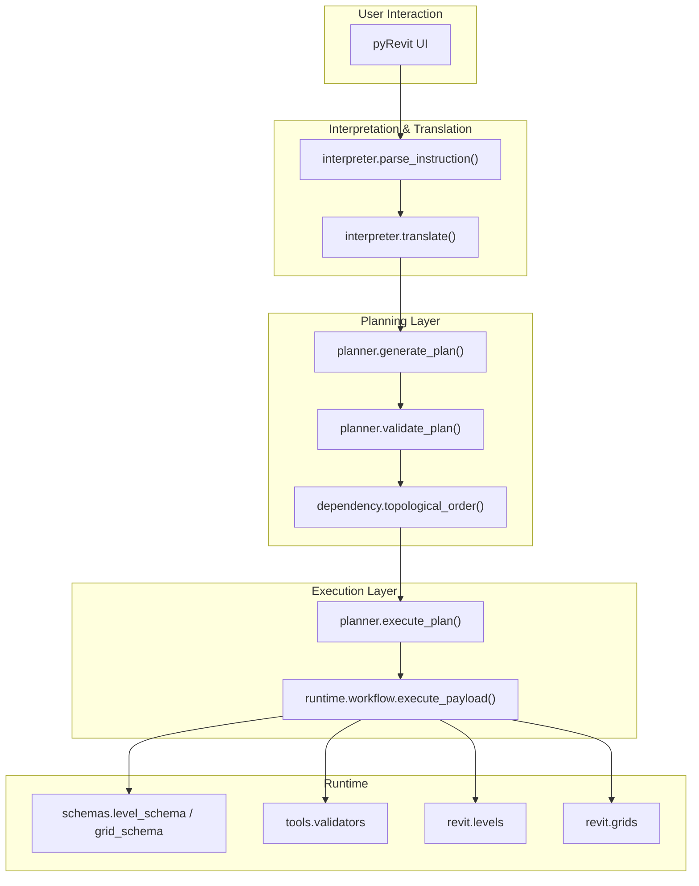
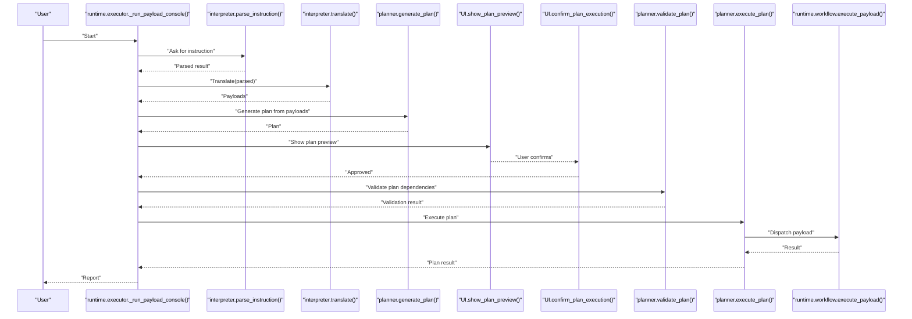
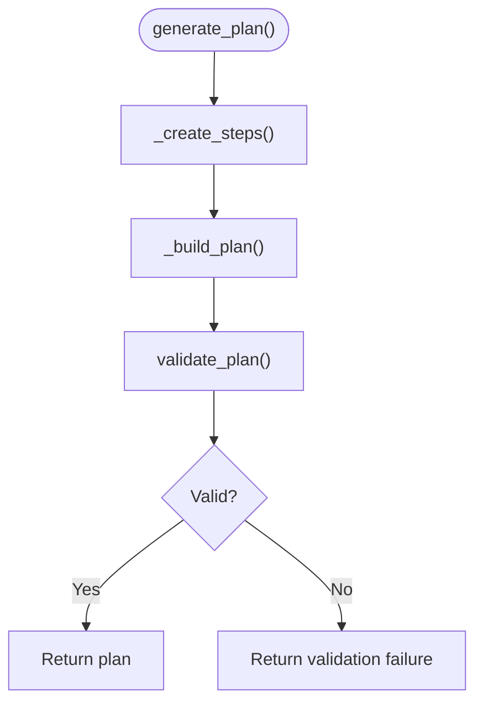
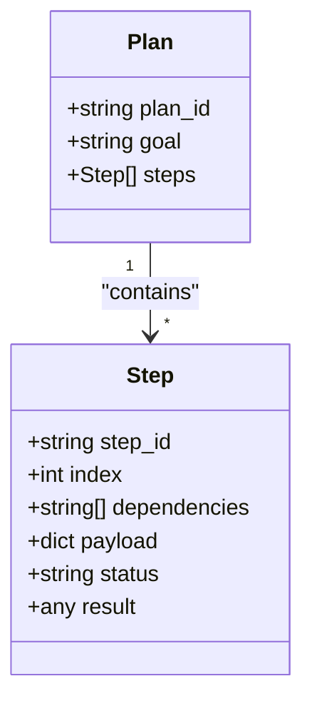
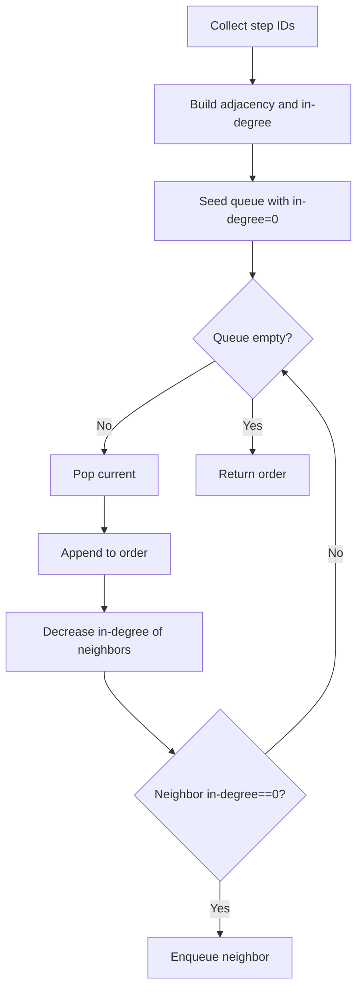
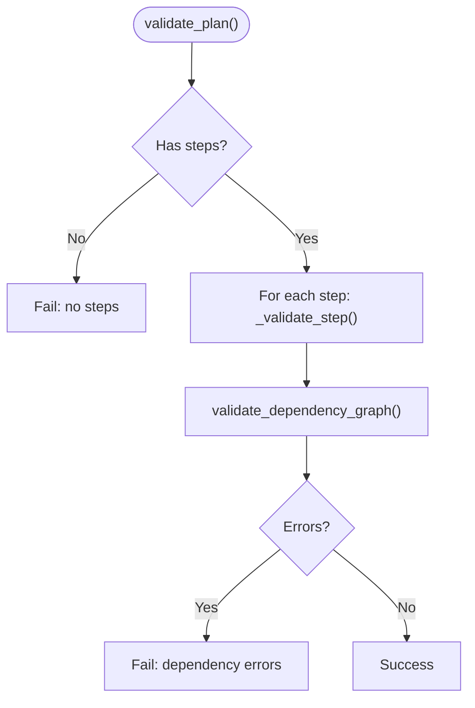
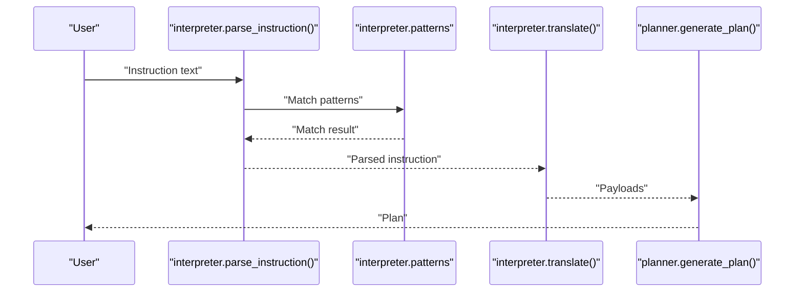
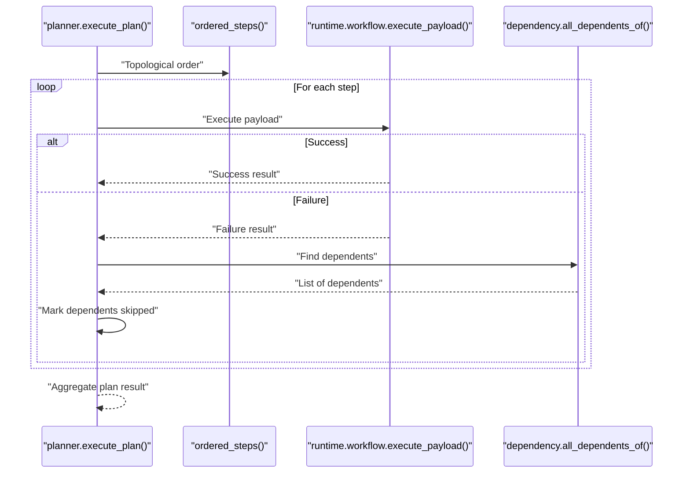
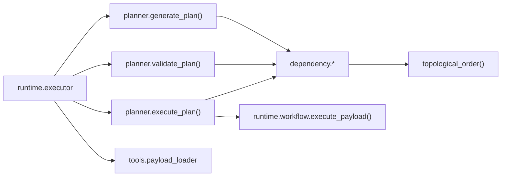

# Execution Plan Generation

<cite>
**Referenced Files in This Document**
- [planner.py](file://planner/planner.py)
- [dependency.py](file://planner/dependency.py)
- [executor.py](file://planner/executor.py)
- [parser.py](file://interpreter/parser.py)
- [translator.py](file://interpreter/translator.py)
- [patterns.py](file://interpreter/patterns.py)
- [workflow.py](file://runtime/workflow.py)
- [executor.py](file://runtime/executor.py)
- [payload_loader.py](file://tools/payload_loader.py)
- [validators.py](file://tools/validators.py)
- [level_schema.py](file://schemas/level_schema.py)
- [grid_schema.py](file://schemas/grid_schema.py)
- [grids.py](file://revit/grids.py)
- [levels.py](file://revit/levels.py)
- [sample_level_grid.json](file://data/payloads/sample_level_grid.json)
</cite>

## Table of Contents
1. [Introduction](#introduction)
2. [Project Structure](#project-structure)
3. [Core Components](#core-components)
4. [Architecture Overview](#architecture-overview)
5. [Detailed Component Analysis](#detailed-component-analysis)
6. [Dependency Analysis](#dependency-analysis)
7. [Performance Considerations](#performance-considerations)
8. [Troubleshooting Guide](#troubleshooting-guide)
9. [Conclusion](#conclusion)
10. [Appendices](#appendices)

## Introduction
This document explains the execution plan generation system that transforms raw payloads into structured, deterministic execution plans. It covers the plan generation algorithm, step creation, dependency assignment, validation, and the separation of planning from execution. It also documents the plan structure (plan_id, goal, steps, metadata), deterministic ordering guarantees, and practical examples of converting different payload types into execution steps. Finally, it outlines customization points, edge-case handling, and the benefits for BIM operations and future AI integration.

## Project Structure
The execution plan system spans several layers:
- Planning: generates plans from payloads, validates dependencies, and orders steps deterministically.
- Execution: runs planned steps respecting dependencies, propagates failures, and reports outcomes.
- Interpretation: converts natural language into structured payloads.
- Translation: normalizes parsed instructions into standardized payloads.
- Runtime: validates and executes payloads safely via the Revit API.
- Tools and Schemas: provide validation helpers and schema definitions.

**Diagram sources**
- [executor.py:133-225](file://runtime/executor.py#L133-L225)
- [planner.py:35-91](file://planner/planner.py#L35-L91)
- [dependency.py:52-72](file://planner/dependency.py#L52-L72)
- [executor.py:40-95](file://planner/executor.py#L40-L95)
- [workflow.py:84-111](file://runtime/workflow.py#L84-L111)
- [parser.py:18-29](file://interpreter/parser.py#L18-L29)
- [translator.py:17-38](file://interpreter/translator.py#L17-L38)
- [level_schema.py:19-21](file://schemas/level_schema.py#L19-L21)
- [grid_schema.py:20-22](file://schemas/grid_schema.py#L20-L22)
- [validators.py:46-56](file://tools/validators.py#L46-L56)

**Section sources**
- [executor.py:133-225](file://runtime/executor.py#L133-L225)
- [planner.py:35-91](file://planner/planner.py#L35-L91)
- [dependency.py:52-72](file://planner/dependency.py#L52-L72)
- [executor.py:40-95](file://planner/executor.py#L40-L95)
- [workflow.py:84-111](file://runtime/workflow.py#L84-L111)
- [parser.py:18-29](file://interpreter/parser.py#L18-L29)
- [translator.py:17-38](file://interpreter/translator.py#L17-L38)
- [level_schema.py:19-21](file://schemas/level_schema.py#L19-L21)
- [grid_schema.py:20-22](file://schemas/grid_schema.py#L20-L22)
- [validators.py:46-56](file://tools/validators.py#L46-L56)

## Core Components
- Planner: Converts payloads into steps, builds a plan, validates structure and dependencies, and exposes ordering utilities.
- Dependency Manager: Validates DAG integrity, detects cycles, and computes deterministic topological order.
- Executor: Executes steps in dependency order, marks results, and propagates failures to dependents.
- Interpreter and Translator: Parse natural language into structured instructions and translate them into standardized payloads.
- Runtime Workflow: Validates payloads, dispatches actions, and performs Revit operations.
- Tools and Schemas: Provide payload shape validation and schema-specific validation.

Key plan structure:
- plan_id: Unique identifier for the plan.
- goal: Human-readable description of the plan’s purpose.
- steps: Ordered list of execution steps with metadata and payload references.

**Section sources**
- [planner.py:35-91](file://planner/planner.py#L35-L91)
- [planner.py:192-198](file://planner/planner.py#L192-L198)
- [dependency.py:18-49](file://planner/dependency.py#L18-L49)
- [dependency.py:52-72](file://planner/dependency.py#L52-L72)
- [executor.py:40-95](file://planner/executor.py#L40-L95)
- [workflow.py:84-111](file://runtime/workflow.py#L84-L111)

## Architecture Overview
The system separates planning from execution to ensure deterministic ordering, early validation, and clear failure propagation. The runtime executor orchestrates the end-to-end flow: interpret, translate, plan, visualize, approve, validate dependencies, execute, and report.

**Diagram sources**
- [executor.py:67-94](file://runtime/executor.py#L67-L94)
- [executor.py:133-161](file://runtime/executor.py#L133-L161)
- [executor.py:210-225](file://runtime/executor.py#L210-L225)
- [planner.py:35-61](file://planner/planner.py#L35-L61)
- [executor.py:40-95](file://planner/executor.py#L40-L95)
- [workflow.py:84-111](file://runtime/workflow.py#L84-L111)

## Detailed Component Analysis

### Planner: Plan Generation and Validation
- Generates a plan from a list of payloads.
- Creates steps with deterministic step IDs and default sequential dependencies.
- Builds a plan with plan_id, goal, and steps.
- Validates plan structure and dependencies before execution.

**Diagram sources**
- [planner.py:35-61](file://planner/planner.py#L35-L61)
- [planner.py:146-157](file://planner/planner.py#L146-L157)
- [planner.py:192-198](file://planner/planner.py#L192-L198)
- [planner.py:64-91](file://planner/planner.py#L64-L91)

**Section sources**
- [planner.py:35-61](file://planner/planner.py#L35-L61)
- [planner.py:146-157](file://planner/planner.py#L146-L157)
- [planner.py:192-198](file://planner/planner.py#L192-L198)
- [planner.py:64-91](file://planner/planner.py#L64-L91)

### Step Creation and Metadata
- Each payload becomes one step with:
  - step_id: Deterministic ID derived from index and action.
  - index: Original position in the input list.
  - dependencies: Explicit or default sequential dependencies.
  - payload: Reference to the original payload.
  - status: Pending/Success/Failed/Skipped.
  - result: Optional execution result.

**Diagram sources**
- [planner.py:180-189](file://planner/planner.py#L180-L189)
- [planner.py:192-198](file://planner/planner.py#L192-L198)

**Section sources**
- [planner.py:180-189](file://planner/planner.py#L180-L189)
- [planner.py:192-198](file://planner/planner.py#L192-L198)

### Dependency Assignment and Ordering
- Default dependency: each step depends on the previous step (sequential).
- Explicit dependencies can override defaults.
- Topological order computed via Kahn’s algorithm with tie-breaking by original index to ensure determinism.

**Diagram sources**
- [dependency.py:52-72](file://planner/dependency.py#L52-L72)
- [dependency.py:197-223](file://planner/dependency.py#L197-L223)

**Section sources**
- [dependency.py:52-72](file://planner/dependency.py#L52-L72)
- [dependency.py:197-223](file://planner/dependency.py#L197-L223)

### Deterministic Planning Guarantees
- Deterministic step IDs: derived from index and action name.
- Deterministic plan IDs: random but reproducible identifiers suitable for IronPython.
- Deterministic ordering: Kahn’s algorithm with stable tie-breaking by index.
- Early validation: dependency graph validation prevents cycles and missing references before execution.

**Section sources**
- [planner.py:160-163](file://planner/planner.py#L160-L163)
- [planner.py:201-207](file://planner/planner.py#L201-L207)
- [dependency.py:52-72](file://planner/dependency.py#L52-L72)
- [dependency.py:18-49](file://planner/dependency.py#L18-L49)

### Validation During Plan Generation
- Structural validation: checks presence of required fields and payload shape.
- Payload validation: performed by the runtime workflow prior to planning to ensure deterministic safety.
- Dependency validation: checks for missing dependencies, self-dependencies, and cycles.

**Diagram sources**
- [planner.py:64-91](file://planner/planner.py#L64-L91)
- [planner.py:210-223](file://planner/planner.py#L210-L223)
- [dependency.py:18-49](file://planner/dependency.py#L18-L49)

**Section sources**
- [planner.py:64-91](file://planner/planner.py#L64-L91)
- [planner.py:210-223](file://planner/planner.py#L210-L223)
- [dependency.py:18-49](file://planner/dependency.py#L18-L49)

### Separation of Planning and Execution
- Planning: pure logic, no Revit API imports, deterministic, validates dependencies.
- Execution: runs steps in order, propagates failures, and reports results.
- The executor delegates all BIM operations to the runtime workflow layer.

Benefits:
- Plans can be inspected, visualized, and approved before any Revit API call.
- Deterministic planning enables consistent execution ordering regardless of input variations.
- Future AI systems can generate or modify plans without execution access.
- Validation errors are architectural, not runtime, so they fail fast.

**Section sources**
- [planner.py:8-14](file://planner/planner.py#L8-L14)
- [executor.py:2-22](file://planner/executor.py#L2-L22)
- [executor.py:40-95](file://planner/executor.py#L40-L95)

### Example: Converting Payloads to Execution Steps
- Sample payloads demonstrate two actions: create_level and create_grid.
- Each payload becomes a step with a deterministic step_id and default sequential dependency.
- The plan captures the goal, plan_id, and ordered steps.

Concrete example paths:
- [sample_level_grid.json:1-17](file://data/payloads/sample_level_grid.json#L1-L17)
- [planner.py:146-157](file://planner/planner.py#L146-L157)
- [planner.py:180-189](file://planner/planner.py#L180-L189)
- [planner.py:192-198](file://planner/planner.py#L192-L198)

**Section sources**
- [sample_level_grid.json:1-17](file://data/payloads/sample_level_grid.json#L1-L17)
- [planner.py:146-157](file://planner/planner.py#L146-L157)
- [planner.py:180-189](file://planner/planner.py#L180-L189)
- [planner.py:192-198](file://planner/planner.py#L192-L198)

### Natural Language to Payloads to Plan
- Controlled grammar patterns parse natural language into structured instructions.
- Translator normalizes instructions into standardized payloads with validated units and names.
- Planner converts payloads into a deterministic execution plan.

**Diagram sources**
- [parser.py:18-29](file://interpreter/parser.py#L18-L29)
- [patterns.py:6-28](file://interpreter/patterns.py#L6-L28)
- [translator.py:17-38](file://interpreter/translator.py#L17-L38)
- [planner.py:35-61](file://planner/planner.py#L35-L61)

**Section sources**
- [parser.py:18-29](file://interpreter/parser.py#L18-L29)
- [patterns.py:6-28](file://interpreter/patterns.py#L6-L28)
- [translator.py:17-38](file://interpreter/translator.py#L17-L38)
- [planner.py:35-61](file://planner/planner.py#L35-L61)

### Execution Flow with Failure Propagation
- Steps execute in topological order.
- If a step fails, all dependents are skipped with a clear reason.
- Final result aggregates success/failure/skip counts and per-step details.

**Diagram sources**
- [executor.py:40-95](file://planner/executor.py#L40-L95)
- [executor.py:177-202](file://planner/executor.py#L177-L202)
- [dependency.py:88-104](file://planner/dependency.py#L88-L104)
- [workflow.py:84-111](file://runtime/workflow.py#L84-L111)

**Section sources**
- [executor.py:40-95](file://planner/executor.py#L40-L95)
- [executor.py:177-202](file://planner/executor.py#L177-L202)
- [dependency.py:88-104](file://planner/dependency.py#L88-L104)
- [workflow.py:84-111](file://runtime/workflow.py#L84-L111)

## Dependency Analysis
The planner and executor depend on shared dependency utilities and the runtime workflow. The runtime executor orchestrates the end-to-end flow and depends on UI prompts and payload loaders.

**Diagram sources**
- [planner.py:35-61](file://planner/planner.py#L35-L61)
- [dependency.py:52-72](file://planner/dependency.py#L52-L72)
- [executor.py:40-95](file://planner/executor.py#L40-L95)
- [workflow.py:84-111](file://runtime/workflow.py#L84-L111)
- [executor.py:133-161](file://runtime/executor.py#L133-L161)
- [payload_loader.py:22-38](file://tools/payload_loader.py#L22-L38)

**Section sources**
- [planner.py:35-61](file://planner/planner.py#L35-L61)
- [dependency.py:52-72](file://planner/dependency.py#L52-L72)
- [executor.py:40-95](file://planner/executor.py#L40-L95)
- [workflow.py:84-111](file://runtime/workflow.py#L84-L111)
- [executor.py:133-161](file://runtime/executor.py#L133-L161)
- [payload_loader.py:22-38](file://tools/payload_loader.py#L22-L38)

## Performance Considerations
- Planning complexity: O(V + E) for dependency validation and topological sorting, where V is the number of steps and E is the number of dependencies.
- Deterministic ordering avoids expensive recomputation; re-running the same inputs yields identical plans and orderings.
- Validation occurs once per plan, preventing repeated costly checks during execution.

[No sources needed since this section provides general guidance]

## Troubleshooting Guide
Common issues and resolutions:
- Missing or malformed payloads: Structural validation enforces required fields and payload shape.
- Duplicate names: Context-aware translation detects conflicts and suggests alternatives.
- Unsupported actions: Runtime dispatcher returns unsupported action errors.
- Dependency cycles or missing references: Dependency validation catches these before execution.
- Execution failures: Failure propagation skips dependents and records reasons.

**Section sources**
- [validators.py:46-56](file://tools/validators.py#L46-L56)
- [translator.py:116-127](file://interpreter/translator.py#L116-L127)
- [workflow.py:106-111](file://runtime/workflow.py#L106-L111)
- [dependency.py:18-49](file://planner/dependency.py#L18-L49)
- [executor.py:177-202](file://planner/executor.py#L177-L202)

## Conclusion
The execution plan generation system provides a deterministic, validated, and separable approach to BIM operations. By converting raw payloads into structured plans, validating dependencies, and executing in a controlled order with failure propagation, it improves safety, traceability, and maintainability. This architecture also paves the way for future AI integration, allowing AI systems to propose or refine plans that still execute through the same validated pipeline.

[No sources needed since this section summarizes without analyzing specific files]

## Appendices

### Implementation Details for Customization
- Custom dependency mapping: Pass a dependencies dictionary to generate_plan to override default sequential dependencies.
- Custom goal description: Provide a meaningful goal string to clarify the plan’s purpose.
- Extending payload types: Add new actions to the runtime dispatcher and update schemas and validators accordingly.
- Customizing failure propagation: Modify the executor’s failure propagation rules if needed for domain-specific semantics.

**Section sources**
- [planner.py:35-46](file://planner/planner.py#L35-L46)
- [workflow.py:99-111](file://runtime/workflow.py#L99-L111)
- [level_schema.py:19-21](file://schemas/level_schema.py#L19-L21)
- [grid_schema.py:20-22](file://schemas/grid_schema.py#L20-L22)

### Edge Cases and Handling
- Empty payload list: Planning returns a failure; the runtime executor handles this gracefully.
- Single-step plans: Default dependency is empty; topological order is trivial.
- Mixed contexts: Context snapshots prevent duplicate names and ensure deterministic validation.
- Partial failures: Dependents are skipped with clear reasons; the final report enumerates outcomes.

**Section sources**
- [executor.py:171-174](file://runtime/executor.py#L171-L174)
- [translator.py:116-127](file://interpreter/translator.py#L116-L127)
- [dependency.py:52-72](file://planner/dependency.py#L52-L72)
- [executor.py:177-202](file://planner/executor.py#L177-L202)