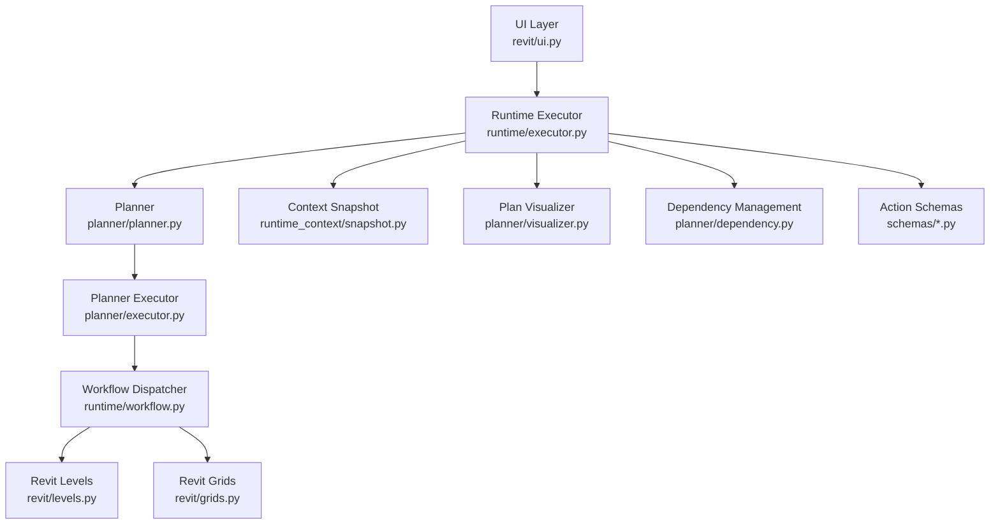
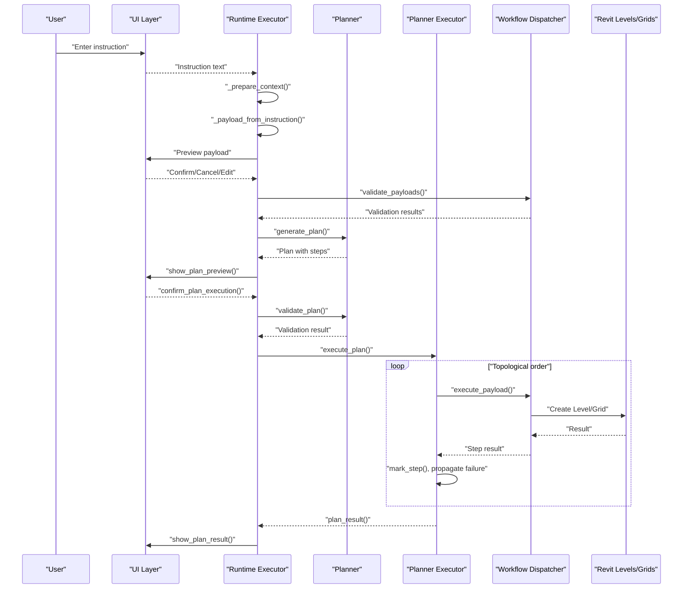
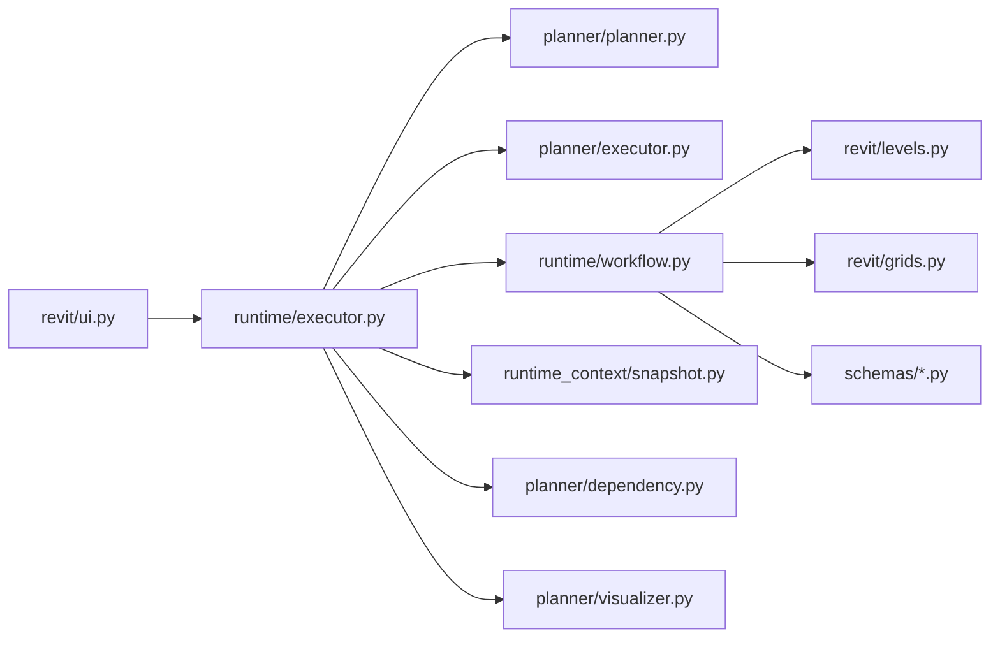
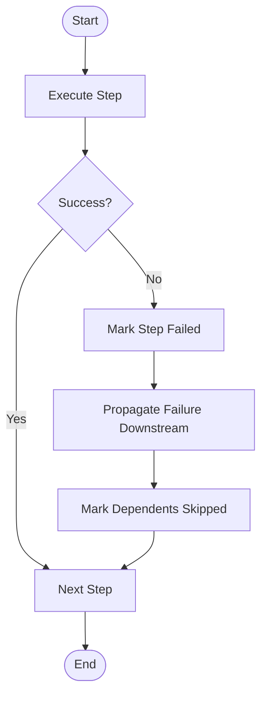

# Executor Coordination

<cite>
**Referenced Files in This Document**
- [runtime/executor.py](file://runtime/executor.py)
- [planner/executor.py](file://planner/executor.py)
- [planner/planner.py](file://planner/planner.py)
- [planner/dependency.py](file://planner/dependency.py)
- [planner/visualizer.py](file://planner/visualizer.py)
- [runtime/workflow.py](file://runtime/workflow.py)
- [runtime/context.py](file://runtime/context.py)
- [runtime_context/snapshot.py](file://runtime_context/snapshot.py)
- [revit/ui.py](file://revit/ui.py)
- [revit/grids.py](file://revit/grids.py)
- [revit/levels.py](file://revit/levels.py)
- [schemas/level_schema.py](file://schemas/level_schema.py)
- [schemas/grid_schema.py](file://schemas/grid_schema.py)
- [extension/.../Run Instruction.pushbutton/script.py](file://extension/.../Run Instruction.pushbutton/script.py)
- [app/main.py](file://app/main.py)
</cite>

## Table of Contents
1. [Introduction](#introduction)
2. [Project Structure](#project-structure)
3. [Core Components](#core-components)
4. [Architecture Overview](#architecture-overview)
5. [Detailed Component Analysis](#detailed-component-analysis)
6. [Dependency Analysis](#dependency-analysis)
7. [Performance Considerations](#performance-considerations)
8. [Troubleshooting Guide](#troubleshooting-guide)
9. [Conclusion](#conclusion)
10. [Appendices](#appendices)

## Introduction
This document explains the executor coordination system that executes planned workflows in a deterministic, human-in-the-loop manner. It covers the step-by-step execution process, status tracking, result handling, approval gates, failure propagation, monitoring, and rollback considerations. It also provides guidance on extending the executor for custom strategies and integrating with external systems.

## Project Structure
The executor coordination spans several layers:
- UI layer: collects instructions, previews payloads, and obtains approvals.
- Runtime executor: orchestrates the end-to-end flow from instruction to execution and reporting.
- Planner: generates and validates plans, defines step dependencies, and orders execution.
- Planner executor: runs steps respecting dependencies, tracks statuses, and propagates failures.
- Workflow: validates and executes payloads safely via deterministic actions.
- Context and snapshots: capture read-only model state for validation and execution.
- Revit modules: perform actual BIM operations behind transaction-safe wrappers.

**Diagram sources**
- [runtime/executor.py:1-285](file://runtime/executor.py#L1-L285)
- [planner/executor.py:1-227](file://planner/executor.py#L1-L227)
- [planner/planner.py:1-234](file://planner/planner.py#L1-L234)
- [planner/dependency.py:1-224](file://planner/dependency.py#L1-L224)
- [planner/visualizer.py:1-169](file://planner/visualizer.py#L1-L169)
- [runtime/workflow.py:1-235](file://runtime/workflow.py#L1-L235)
- [runtime_context/snapshot.py:1-37](file://runtime_context/snapshot.py#L1-L37)
- [revit/ui.py:1-257](file://revit/ui.py#L1-L257)
- [revit/levels.py:1-37](file://revit/levels.py#L1-L37)
- [revit/grids.py:1-43](file://revit/grids.py#L1-L43)
- [schemas/level_schema.py:1-22](file://schemas/level_schema.py#L1-L22)
- [schemas/grid_schema.py:1-23](file://schemas/grid_schema.py#L1-L23)

**Section sources**
- [runtime/executor.py:1-285](file://runtime/executor.py#L1-L285)
- [planner/executor.py:1-227](file://planner/executor.py#L1-L227)
- [planner/planner.py:1-234](file://planner/planner.py#L1-L234)
- [planner/dependency.py:1-224](file://planner/dependency.py#L1-L224)
- [planner/visualizer.py:1-169](file://planner/visualizer.py#L1-L169)
- [runtime/workflow.py:1-235](file://runtime/workflow.py#L1-L235)
- [runtime_context/snapshot.py:1-37](file://runtime_context/snapshot.py#L1-L37)
- [revit/ui.py:1-257](file://revit/ui.py#L1-L257)
- [revit/levels.py:1-37](file://revit/levels.py#L1-L37)
- [revit/grids.py:1-43](file://revit/grids.py#L1-L43)
- [schemas/level_schema.py:1-22](file://schemas/level_schema.py#L1-L22)
- [schemas/grid_schema.py:1-23](file://schemas/grid_schema.py#L1-L23)

## Core Components
- Runtime Executor: central coordinator that interprets instructions, builds payloads, validates, visualizes, approves, validates dependencies, executes, and reports.
- Planner: transforms payloads into a plan with steps and dependencies; validates structural soundness.
- Planner Executor: runs steps in dependency order, marks statuses, and propagates failures.
- Workflow Dispatcher: validates and executes payloads safely; supports create_level and create_grid actions.
- UI Layer: prompts for instruction, previews payloads, edits JSON, previews and approves plans, shows validation and execution results.
- Context and Snapshots: captures read-only model state for deterministic validation and execution.
- Dependency Management: validates DAG integrity and computes topological order.
- Visualizer: renders plans and results for human review.

**Section sources**
- [runtime/executor.py:1-285](file://runtime/executor.py#L1-L285)
- [planner/planner.py:1-234](file://planner/planner.py#L1-L234)
- [planner/executor.py:1-227](file://planner/executor.py#L1-L227)
- [runtime/workflow.py:1-235](file://runtime/workflow.py#L1-L235)
- [revit/ui.py:1-257](file://revit/ui.py#L1-L257)
- [runtime_context/snapshot.py:1-37](file://runtime_context/snapshot.py#L1-L37)
- [planner/dependency.py:1-224](file://planner/dependency.py#L1-L224)
- [planner/visualizer.py:1-169](file://planner/visualizer.py#L1-L169)

## Architecture Overview
The executor enforces a strict, deterministic pipeline:
1. Bootstrap application logging.
2. Prepare a read-only context snapshot from the active Revit document.
3. Collect instruction, parse, and translate into payloads.
4. Inspect and optionally edit payloads.
5. Validate payloads against schemas and context.
6. Generate a plan with steps and dependencies; visualize and obtain explicit approval.
7. Validate plan dependency graph.
8. Execute plan step-by-step with failure propagation and reporting.

**Diagram sources**
- [runtime/executor.py:49-285](file://runtime/executor.py#L49-L285)
- [planner/executor.py:40-227](file://planner/executor.py#L40-L227)
- [planner/planner.py:35-234](file://planner/planner.py#L35-L234)
- [runtime/workflow.py:84-235](file://runtime/workflow.py#L84-L235)
- [revit/levels.py:18-37](file://revit/levels.py#L18-L37)
- [revit/grids.py:18-43](file://revit/grids.py#L18-L43)
- [revit/ui.py:29-168](file://revit/ui.py#L29-L168)

## Detailed Component Analysis

### Runtime Executor
Responsibilities:
- Bootstraps logging.
- Prepares a context snapshot and persists it.
- Interprets instructions and translates to payloads.
- Allows payload preview and optional JSON editing.
- Validates payloads and displays validation errors.
- Generates plan, visualizes, obtains approval, validates dependencies, executes, and reports results.
- Handles cancellations and structured failure returns.

Key flows:
- run(): entry point that wraps the console flow and logs outcomes.
- _run_payload_console(): orchestrates instruction, payload, validation, plan, approval, dependency validation, execution, and reporting.
- _prepare_context(): creates and saves a read-only snapshot.
- _payload_from_instruction(): parses and translates instruction to payloads.
- _inspect_payload(): previews and optionally edits payload JSON.
- _plan_approve_and_execute(): generates plan, visualizes, confirms, validates dependencies, executes, and reports.
- _execute_and_report(): runs execute_plan and builds plan_result.

Human-in-the-loop approvals:
- confirm_context_preview(), preview_payload_text(), confirm_payload_edit(), edit_payload_text().
- show_validation_errors() for validation failures.
- show_plan_preview(), confirm_plan_execution() for plan approval.
- show_plan_result() for post-execution results.

Failure handling:
- Structured results with success flag, message, and results array.
- Cancellations return structured messages; validation failures return detailed results.

**Section sources**
- [runtime/executor.py:1-285](file://runtime/executor.py#L1-L285)
- [revit/ui.py:1-257](file://revit/ui.py#L1-L257)

### Planner
Responsibilities:
- Converts payloads into steps with deterministic step IDs.
- Builds plan with plan_id, goal, and steps.
- Validates plan structure and dependencies.
- Provides ordered steps via topological sort.
- Exposes status helpers and plan summary.

Execution step statuses:
- pending, success, failed, skipped.

Default dependency model:
- Sequential by default: each step depends on the previous one to ensure safe BIM ordering.

Validation:
- validate_plan() checks for missing dependencies, cycles, and malformed steps.

**Section sources**
- [planner/planner.py:1-234](file://planner/planner.py#L1-L234)

### Planner Executor
Responsibilities:
- Executes plan in dependency order.
- Dispatches each payload to the workflow dispatcher.
- Tracks and updates step statuses.
- Propagates failures to all downstream dependents.
- Produces structured plan results.

Dispatch mechanism:
- _default_dispatch() routes payloads to runtime/workflow.execute_payload().

Failure propagation:
- _has_failed_dependency(): checks if any direct dependency failed or was skipped.
- _skip_step_with_failed_dep(): marks step as skipped with reason.
- _propagate_failure(): skips all transitive dependents of a failed step.

Reporting:
- plan_result(): aggregates per-step results and produces a summary.

**Section sources**
- [planner/executor.py:1-227](file://planner/executor.py#L1-L227)

### Workflow Dispatcher
Responsibilities:
- Validates payload shape and action support.
- Dispatches to action-specific handlers.
- Supports create_level and create_grid.
- Normalizes results and logs outcomes.
- Validates payloads without executing BIM operations.

Validation:
- validate_payloads() iterates payloads and accumulates results.
- _validate_payload() checks schema compliance and duplicates using context names.

Execution:
- _dispatch_payload() routes to _execute_create_level or _execute_create_grid.
- _execute_create_level/_execute_create_grid validate data and call Revit APIs within transactions.

**Section sources**
- [runtime/workflow.py:1-235](file://runtime/workflow.py#L1-L235)

### UI Layer
Responsibilities:
- Text editor windows for instruction and payload editing.
- Alerts for previews, approvals, and results.
- Delegates plan rendering to planner.visualizer.

Approval gates:
- ask_for_instruction(), confirm_context_preview(), preview_payload_text(), confirm_payload_edit(), edit_payload_text().
- confirm_payload_execution(), show_validation_errors(), show_execution_result().
- show_plan_preview(), confirm_plan_execution(), show_plan_result().

**Section sources**
- [revit/ui.py:1-257](file://revit/ui.py#L1-L257)

### Context and Snapshots
Responsibilities:
- create_snapshot(): captures document name, units, levels, grids, and counts.
- level_names(), grid_names(): extract names from snapshot for validation.

Integration:
- Used by workflow validation and UI context preview.

**Section sources**
- [runtime_context/snapshot.py:1-37](file://runtime_context/snapshot.py#L1-L37)

### Dependency Management
Responsibilities:
- validate_dependency_graph(): detects missing dependencies and cycles.
- topological_order(): Kahn’s algorithm for deterministic ordering.
- dependents_of(), all_dependents_of(): compute direct and transitive dependents for failure propagation.

Logging:
- dependency_graph_text(), log_dependency_graph(): human-readable dependency graph and order.

**Section sources**
- [planner/dependency.py:1-224](file://planner/dependency.py#L1-L224)

### Visualizer
Responsibilities:
- Render plans and results for human review.
- plan_text(): prints plan metadata, execution order, dependencies, and steps.
- plan_result_text(): prints per-step status, errors, and element IDs.

**Section sources**
- [planner/visualizer.py:1-169](file://planner/visualizer.py#L1-L169)

### Action Schemas
Responsibilities:
- Define required fields and types for create_level and create_grid.
- Validate payload data against schemas.

**Section sources**
- [schemas/level_schema.py:1-22](file://schemas/level_schema.py#L1-L22)
- [schemas/grid_schema.py:1-23](file://schemas/grid_schema.py#L1-L23)

### Entry Point
pyRevit button entrypoint:
- Ensures project root is importable.
- Invokes runtime/executor.run().

**Section sources**
- [extension/.../Run Instruction.pushbutton/script.py:1-21](file://extension/.../Run Instruction.pushbutton/script.py#L1-L21)

### Application Bootstrap
- Initializes logging for the current pyRevit command.

**Section sources**
- [app/main.py:1-15](file://app/main.py#L1-L15)

## Dependency Analysis
The executor coordination system exhibits layered separation of concerns:
- UI depends on planner visualizer for plan rendering.
- Runtime executor depends on planner, planner executor, workflow, UI, and context.
- Planner executor depends on planner status helpers and workflow dispatcher.
- Workflow dispatcher depends on schemas and Revit modules.
- Dependency management is purely logical and independent of execution.

**Diagram sources**
- [runtime/executor.py:1-285](file://runtime/executor.py#L1-L285)
- [planner/executor.py:1-227](file://planner/executor.py#L1-L227)
- [planner/planner.py:1-234](file://planner/planner.py#L1-L234)
- [planner/dependency.py:1-224](file://planner/dependency.py#L1-L224)
- [planner/visualizer.py:1-169](file://planner/visualizer.py#L1-L169)
- [runtime/workflow.py:1-235](file://runtime/workflow.py#L1-L235)
- [runtime_context/snapshot.py:1-37](file://runtime_context/snapshot.py#L1-L37)
- [revit/ui.py:1-257](file://revit/ui.py#L1-L257)
- [revit/levels.py:1-37](file://revit/levels.py#L1-L37)
- [revit/grids.py:1-43](file://revit/grids.py#L1-L43)
- [schemas/level_schema.py:1-22](file://schemas/level_schema.py#L1-L22)
- [schemas/grid_schema.py:1-23](file://schemas/grid_schema.py#L1-L23)

**Section sources**
- [runtime/executor.py:1-285](file://runtime/executor.py#L1-L285)
- [planner/executor.py:1-227](file://planner/executor.py#L1-L227)
- [planner/planner.py:1-234](file://planner/planner.py#L1-L234)
- [planner/dependency.py:1-224](file://planner/dependency.py#L1-L224)
- [planner/visualizer.py:1-169](file://planner/visualizer.py#L1-L169)
- [runtime/workflow.py:1-235](file://runtime/workflow.py#L1-L235)
- [runtime_context/snapshot.py:1-37](file://runtime_context/snapshot.py#L1-L37)
- [revit/ui.py:1-257](file://revit/ui.py#L1-L257)
- [revit/levels.py:1-37](file://revit/levels.py#L1-L37)
- [revit/grids.py:1-43](file://revit/grids.py#L1-L43)
- [schemas/level_schema.py:1-22](file://schemas/level_schema.py#L1-L22)
- [schemas/grid_schema.py:1-23](file://schemas/grid_schema.py#L1-L23)

## Performance Considerations
- Sequential execution by default ensures safety but limits concurrency. Parallelism can be introduced only when dependencies permit and operations are independent.
- Topological ordering is O(V+E) with Kahn’s algorithm; keep dependency graphs acyclic and minimal to avoid overhead.
- Logging and UI alerts add latency; batch or defer non-critical logs in high-throughput scenarios.
- Snapshot creation reads model state once; reuse snapshots to avoid repeated reads.
- Transaction boundaries in Revit operations minimize rollback costs; avoid unnecessary transactions.

[No sources needed since this section provides general guidance]

## Troubleshooting Guide
Common issues and resolutions:
- Validation failures:
  - Use show_validation_errors() to present detailed messages.
  - Review payload shape and schema compliance; check duplicate names using context names.
- Plan dependency errors:
  - validate_plan() detects missing dependencies and cycles; fix dependencies or remove cycles.
- Step failures and propagation:
  - _propagate_failure() marks all downstream dependents as skipped; inspect plan_result_text() for skip reasons.
- Cancellations:
  - _cancelled() returns structured messages for user-initiated cancellations.
- Execution errors:
  - _failure() and normalized results provide consistent error reporting; check action-specific messages.

**Section sources**
- [runtime/executor.py:258-285](file://runtime/executor.py#L258-L285)
- [planner/executor.py:177-227](file://planner/executor.py#L177-L227)
- [runtime/workflow.py:197-235](file://runtime/workflow.py#L197-L235)
- [planner/planner.py:64-92](file://planner/planner.py#L64-L92)

## Conclusion
The executor coordination system separates planning, approval, and execution concerns while enforcing deterministic, safe workflows. It provides robust failure propagation, clear status tracking, and human-in-the-loop controls. Extensions can customize dispatch logic, introduce parallelism where safe, and integrate external systems through the workflow dispatcher and planner executor.

[No sources needed since this section summarizes without analyzing specific files]

## Appendices

### Execution Scenarios

#### Sequential Execution
- Default behavior: each step depends on the previous step.
- Safe for creation order-sensitive operations (e.g., levels before grids).
- Enforced by planner’s default dependency model.

**Section sources**
- [planner/planner.py:166-178](file://planner/planner.py#L166-L178)

#### Conditional Execution Based on Outcomes
- Use explicit dependencies to express conditions (e.g., “step B depends on step A”).
- If A fails, B is skipped; downstream dependents of B are also skipped.

**Section sources**
- [planner/executor.py:135-203](file://planner/executor.py#L135-L203)
- [planner/dependency.py:75-104](file://planner/dependency.py#L75-L104)

#### Failure Propagation Details
- Immediate propagation: upon failure, all transitive dependents are skipped.
- Clear skip reasons identify the failed dependency.

**Diagram sources**
- [planner/executor.py:177-203](file://planner/executor.py#L177-L203)

### Execution Monitoring and Reporting
- Per-step status tracking: success, failed, skipped.
- Plan summary: counts of each status.
- Structured results: per-step details, element IDs, and error codes.

**Section sources**
- [planner/planner.py:94-142](file://planner/planner.py#L94-L142)
- [planner/executor.py:98-120](file://planner/executor.py#L98-L120)
- [planner/visualizer.py:42-103](file://planner/visualizer.py#L42-L103)

### Maintaining Execution Context
- Context snapshot captured at the start of the console flow.
- Names from snapshot used for validation to prevent duplicates.

**Section sources**
- [runtime/executor.py:97-104](file://runtime/executor.py#L97-L104)
- [runtime/workflow.py:223-235](file://runtime/workflow.py#L223-L235)
- [runtime_context/snapshot.py:10-37](file://runtime_context/snapshot.py#L10-L37)

### Rollback Scenarios
- Revit operations occur inside transaction wrappers; failures abort transactions.
- No partial state is committed when a step fails.

**Section sources**
- [revit/levels.py:27-37](file://revit/levels.py#L27-L37)
- [revit/grids.py:27-37](file://revit/grids.py#L27-L37)

### Extending the Executor
- Custom dispatch: pass a custom dispatch_fn to execute_plan() to route payloads differently.
- New actions: add new actions in workflow dispatcher and schemas; update planner executor if new status semantics are needed.
- External integrations: wrap external systems in the workflow dispatcher; maintain deterministic payload format.

**Section sources**
- [planner/executor.py:40-54](file://planner/executor.py#L40-L54)
- [runtime/workflow.py:99-112](file://runtime/workflow.py#L99-L112)
- [schemas/level_schema.py:1-22](file://schemas/level_schema.py#L1-L22)
- [schemas/grid_schema.py:1-23](file://schemas/grid_schema.py#L1-L23)