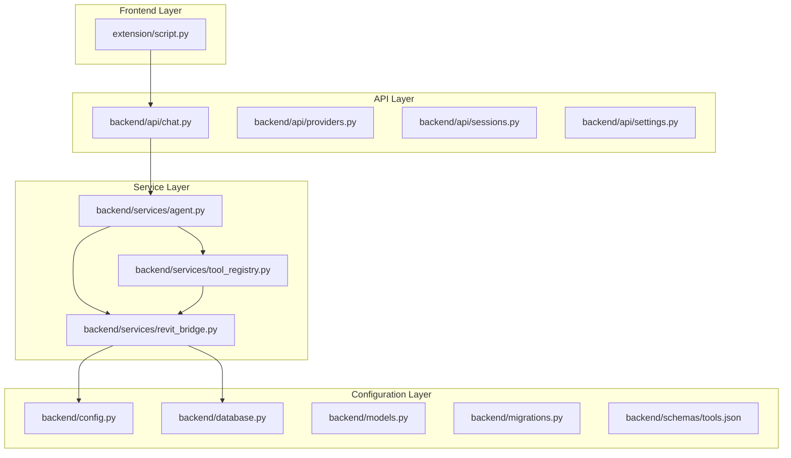
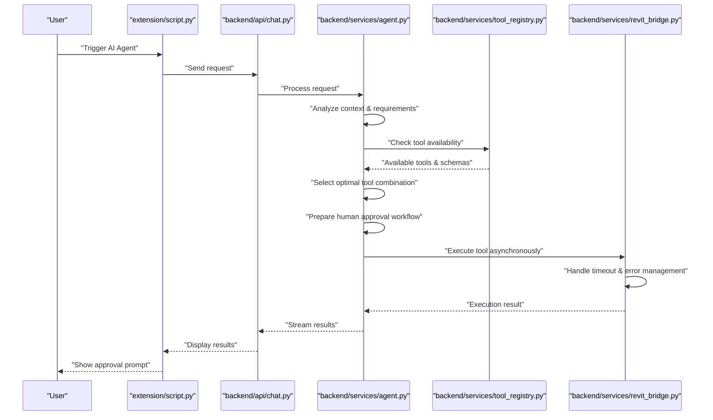
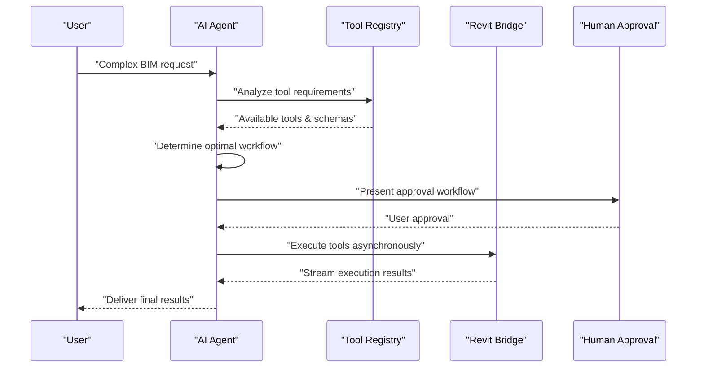

# Planning and Execution

<cite>
**Referenced Files in This Document**
- [main.py](file://backend/main.py)
- [chat.py](file://backend/api/chat.py)
- [agent.py](file://backend/services/agent.py)
- [revit_bridge.py](file://backend/services/revit_bridge.py)
- [tool_registry.py](file://backend/services/tool_registry.py)
- [providers.py](file://backend/api/providers.py)
- [sessions.py](file://backend/api/sessions.py)
- [settings.py](file://backend/api/settings.py)
- [config.py](file://backend/config.py)
- [database.py](file://backend/database.py)
- [models.py](file://backend/models.py)
- [migrations.py](file://backend/migrations.py)
- [tools.json](file://backend/schemas/tools.json)
- [script.py](file://extension/AI_Agent.extension/AI_Agent.tab/Panel.panel/StartBridge.pushbutton/script.py)
</cite>

## Update Summary
**Changes Made**
- Removed all references to deterministic planning and execution system
- Removed planner.py, dependency.py, executor.py, and visualizer.py components
- Updated architecture to reflect AI agent-based workflow with human approval
- Replaced static dependency graphs with dynamic tool execution flows
- Updated core components to focus on AI agent orchestration and tool execution
- Revised examples to show AI agent decision-making and approval workflows

## Table of Contents
1. [Introduction](#introduction)
2. [Project Structure](#project-structure)
3. [Core Components](#core-components)
4. [Architecture Overview](#architecture-overview)
5. [Detailed Component Analysis](#detailed-component-analysis)
6. [Performance Considerations](#performance-considerations)
7. [Troubleshooting Guide](#troubleshooting-guide)
8. [Conclusion](#conclusion)
9. [Appendices](#appendices)

## Introduction
This document explains the AI agent-based planning and execution subsystem responsible for workflow orchestration through intelligent decision-making and human approval processes. The system has evolved from a deterministic planning framework to an adaptive AI agent architecture that dynamically selects and executes appropriate tools based on user requests and context analysis. It covers how AI agents interpret natural language requests, select optimal tool combinations, coordinate human approvals, and execute operations through a bridge interface to Revit.

**Updated** The system now uses AI agents with human approval workflows instead of predetermined execution sequences, enabling more flexible and context-aware operation execution.

## Project Structure
The AI agent-based planning and execution system spans several integrated layers:
- AI Agent Service: Orchestrates tool selection, workflow planning, and human approval coordination
- Tool Registry: Manages available tools, their schemas, and execution dispatchers
- Revit Bridge: Provides secure communication between AI agents and Revit API operations
- API Layer: Handles chat interactions, provider configuration, and session management
- Frontend Integration: Enables user interaction through the Revit extension interface

**Diagram sources**
- [script.py:163](file://extension/AI_Agent.extension/AI_Agent.tab/Panel.panel/StartBridge.pushbutton/script.py#L163)
- [chat.py](file://backend/api/chat.py)
- [agent.py](file://backend/services/agent.py)
- [revit_bridge.py](file://backend/services/revit_bridge.py)
- [tool_registry.py](file://backend/services/tool_registry.py)
- [config.py](file://backend/config.py)
- [database.py](file://backend/database.py)
- [models.py](file://backend/models.py)
- [migrations.py](file://backend/migrations.py)
- [tools.json](file://backend/schemas/tools.json)

**Section sources**
- [script.py:163](file://extension/AI_Agent.extension/AI_Agent.tab/Panel.panel/StartBridge.pushbutton/script.py#L163)
- [chat.py](file://backend/api/chat.py)
- [agent.py](file://backend/services/agent.py)
- [revit_bridge.py](file://backend/services/revit_bridge.py)
- [tool_registry.py](file://backend/services/tool_registry.py)
- [config.py](file://backend/config.py)
- [database.py](file://backend/database.py)
- [models.py](file://backend/models.py)
- [migrations.py](file://backend/migrations.py)
- [tools.json](file://backend/schemas/tools.json)

## Core Components
- AI Agent Service: Interprets user requests, selects appropriate tools, coordinates execution, and manages human approval workflows
- Tool Registry: Maintains tool schemas, creates execution dispatchers, and handles tool availability management
- Revit Bridge: Provides secure asynchronous tool execution, handles timeouts, and manages Revit API communication
- API Endpoints: Expose chat functionality, provider configuration, session management, and settings access
- Frontend Extension: Integrates with Revit UI to trigger AI agent workflows and display results

Key responsibilities:
- AI agents analyze requests and dynamically determine optimal tool execution flows
- Human approval integration ensures safety and control over critical operations
- Tool registry enables extensible tool ecosystem with standardized schemas
- Bridge service abstracts Revit API complexity and provides error handling

**Updated** The system now focuses on AI-driven decision-making rather than predetermined execution sequences, with human oversight for critical operations.

**Section sources**
- [agent.py](file://backend/services/agent.py)
- [tool_registry.py](file://backend/services/tool_registry.py)
- [revit_bridge.py](file://backend/services/revit_bridge.py)
- [chat.py](file://backend/api/chat.py)
- [script.py:163](file://extension/AI_Agent.extension/AI_Agent.tab/Panel.panel/StartBridge.pushbutton/script.py#L163)

## Architecture Overview
The AI agent-based system follows an event-driven, approval-centric architecture:
- Frontend triggers AI agent workflows through Revit extension
- API layer receives user requests and forwards to AI agent service
- AI agent analyzes request context and selects optimal tool combination
- Tool registry validates tool availability and prepares execution environment
- Human approval workflow coordinates user consent for potentially risky operations
- Bridge service executes tools asynchronously and returns results
- Results are streamed back to frontend for user review and approval

**Diagram sources**
- [script.py:163](file://extension/AI_Agent.extension/AI_Agent.tab/Panel.panel/StartBridge.pushbutton/script.py#L163)
- [chat.py](file://backend/api/chat.py)
- [agent.py](file://backend/services/agent.py)
- [tool_registry.py](file://backend/services/tool_registry.py)
- [revit_bridge.py](file://backend/services/revit_bridge.py)

## Detailed Component Analysis

### AI Agent Service: Intelligent Workflow Orchestration
The AI agent service coordinates complex workflows through dynamic tool selection and human approval integration:
- Request analysis: Interprets natural language requests and extracts actionable requirements
- Tool selection: Evaluates available tools and determines optimal execution sequence
- Context management: Maintains state across multi-step operations and handles partial failures
- Approval coordination: Integrates human oversight for critical operations requiring manual verification
- Result aggregation: Streams partial results and final outcomes to frontend interfaces

Processing logic highlights:
- Dynamic tool chain determination based on request complexity
- Real-time context adaptation during execution
- Graceful error recovery and partial workflow rollback
- Streaming result delivery for responsive user experience

**Updated** Replaced static planning with dynamic AI-driven workflow orchestration that adapts to user requests and context conditions.

**Section sources**
- [agent.py](file://backend/services/agent.py)

### Tool Registry: Dynamic Tool Management
The tool registry maintains an extensible collection of available tools with standardized schemas:
- Schema validation: Ensures tools conform to expected input/output formats
- Dispatcher creation: Generates async execution functions for each registered tool
- Availability management: Tracks tool readiness and handles tool discovery
- Read-only tool filtering: Excludes read-only tools from execution contexts
- Execution coordination: Manages concurrent tool execution and resource allocation

Key features:
- Asynchronous tool execution with proper error handling
- Tool schema validation before execution
- Dynamic tool discovery and registration
- Timeout management for long-running operations

**Updated** Simplified from static dependency management to dynamic tool availability and execution coordination.

**Section sources**
- [tool_registry.py](file://backend/services/tool_registry.py)

### Revit Bridge: Secure Tool Execution Interface
The Revit bridge provides controlled access to Revit API operations through a secure execution interface:
- Async tool execution: Handles asynchronous tool invocation with proper error propagation
- Timeout management: Implements configurable timeouts for tool execution
- Logging integration: Provides detailed execution logs for debugging and monitoring
- Result serialization: Converts tool outputs to JSON-serializable formats
- Security boundaries: Maintains separation between AI agent and Revit API access

Execution flow:
- Tool name and parameters validation
- Bridge connection establishment
- Asynchronous tool execution with progress reporting
- Result processing and error handling
- Connection cleanup and resource release

**Updated** Replaced deterministic execution with asynchronous tool execution through a controlled bridge interface.

**Section sources**
- [revit_bridge.py](file://backend/services/revit_bridge.py)

### API Layer: Human-Centric Interaction
The API layer provides comprehensive interfaces for user interaction and system management:
- Chat endpoints: Handle natural language conversations and workflow initiation
- Provider configuration: Manage AI model providers and authentication
- Session management: Track user sessions and conversation history
- Settings access: Control system configuration and user preferences
- Streaming responses: Deliver real-time updates during long-running operations

Integration points:
- WebSocket connections for real-time communication
- Authentication middleware for secure access
- Rate limiting and usage tracking
- Audit logging for compliance and debugging

**Updated** Focused on human-machine interaction rather than automated execution sequences.

**Section sources**
- [chat.py](file://backend/api/chat.py)
- [providers.py](file://backend/api/providers.py)
- [sessions.py](file://backend/api/sessions.py)
- [settings.py](file://backend/api/settings.py)

### Frontend Extension: User Interface Integration
The frontend extension integrates AI agent capabilities directly into the Revit user interface:
- Push button triggers: Simple activation through Revit panel interface
- Context awareness: Detects current Revit document and selection state
- Status reporting: Displays execution progress and results within Revit UI
- Approval prompts: Integrates with human approval workflows
- Error handling: Provides user-friendly error messages and recovery options

UI integration features:
- Seamless Revit workflow integration
- Context-sensitive tool availability
- Real-time progress updates
- Approval workflow integration

**Updated** Enhanced user interface integration for AI agent workflows with approval mechanisms.

**Section sources**
- [script.py:163](file://extension/AI_Agent.extension/AI_Agent.tab/Panel.panel/StartBridge.pushbutton/script.py#L163)

## Performance Considerations
- Asynchronous tool execution reduces blocking operations and improves responsiveness
- Dynamic tool selection minimizes unnecessary tool invocations and optimizes resource usage
- Streaming results enable real-time feedback and reduce perceived latency
- Human approval integration adds minimal overhead while ensuring safety
- Bridge service implements efficient connection pooling and timeout management
- Tool registry caching reduces repeated schema validation overhead

**Updated** Performance characteristics now emphasize asynchronous execution and dynamic tool selection rather than deterministic planning overhead.

## Troubleshooting Guide
Common issues and resolutions:
- Tool execution timeout
  - Symptom: Long-running operations fail with timeout errors
  - Resolution: Increase timeout configuration in bridge service or break operation into smaller steps
- Tool schema validation failure
  - Symptom: Tools rejected due to invalid parameter formats
  - Resolution: Verify tool schemas in tools.json and ensure parameters match expected types
- Human approval workflow stuck
  - Symptom: Operations pending user approval indefinitely
  - Resolution: Check approval modal integration and ensure proper callback handling
- Bridge connection issues
  - Symptom: Tools fail to execute with connection errors
  - Resolution: Verify bridge server connectivity and Revit API accessibility
- Memory leaks in long sessions
  - Symptom: Progressive memory usage increase during extended operations
  - Resolution: Implement proper cleanup of tool registries and session state
- Streaming response delays
  - Symptom: Slow result delivery during long operations
  - Resolution: Optimize tool execution time and implement better progress reporting

**Updated** Troubleshooting now focuses on AI agent coordination, tool execution, and human approval workflows rather than deterministic planning issues.

**Section sources**
- [revit_bridge.py](file://backend/services/revit_bridge.py)
- [tool_registry.py](file://backend/services/tool_registry.py)
- [agent.py](file://backend/services/agent.py)

## Conclusion
The AI agent-based planning and execution subsystem provides a flexible, human-in-the-loop approach to BIM workflow automation. By replacing deterministic planning with dynamic AI-driven orchestration, the system can adapt to complex, context-dependent requirements while maintaining safety through human approval workflows. The tool registry enables extensible functionality, and the bridge service provides secure access to Revit operations. Together, these components create a robust foundation for intelligent BIM workflow execution that can handle the complexity and variability of real-world construction projects.

**Updated** The system now emphasizes AI-driven decision-making and human oversight over rigid execution sequences, enabling more adaptable and context-aware workflow automation.

## Appendices

### Example: AI Agent-Based Workflow Execution
- User request: "Create structural levels at 10-foot intervals with grid lines aligned to columns"
- AI agent analyzes request and identifies required tools (create_levels, create_grids, align_elements)
- Tool registry validates tool availability and schemas
- Agent determines optimal execution order and prepares human approval workflow
- User reviews proposed workflow and approves execution
- Bridge executes tools asynchronously with progress streaming
- Results are aggregated and presented with approval signatures

**Diagram sources**
- [agent.py](file://backend/services/agent.py)
- [tool_registry.py](file://backend/services/tool_registry.py)
- [revit_bridge.py](file://backend/services/revit_bridge.py)

**Section sources**
- [agent.py](file://backend/services/agent.py)
- [tool_registry.py](file://backend/services/tool_registry.py)
- [revit_bridge.py](file://backend/services/revit_bridge.py)