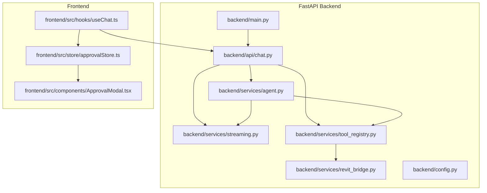
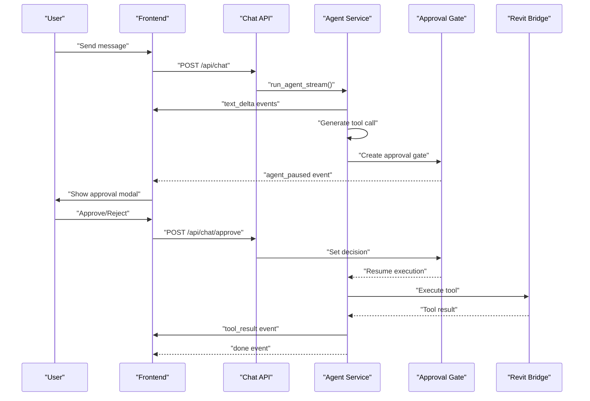
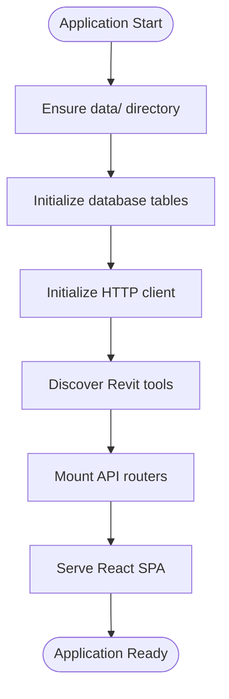
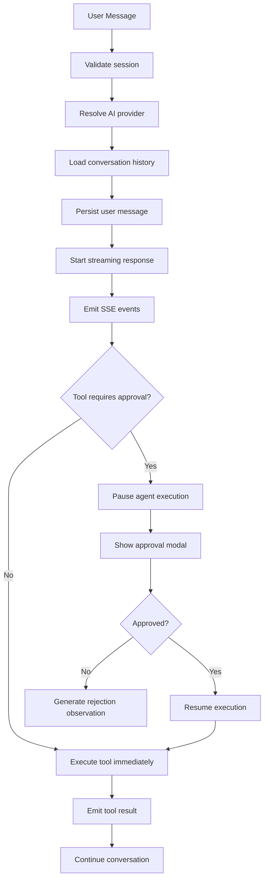
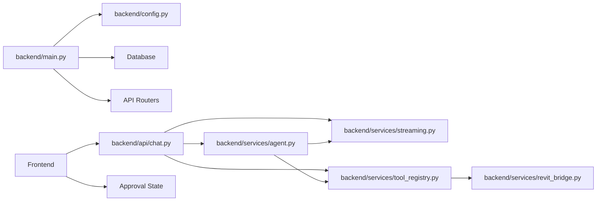

# Runtime Orchestration

<cite>
**Referenced Files in This Document**
- [backend/main.py](file://backend/main.py)
- [backend/api/chat.py](file://backend/api/chat.py)
- [backend/services/agent.py](file://backend/services/agent.py)
- [backend/services/streaming.py](file://backend/services/streaming.py)
- [backend/services/tool_registry.py](file://backend/services/tool_registry.py)
- [backend/services/revit_bridge.py](file://backend/services/revit_bridge.py)
- [backend/config.py](file://backend/config.py)
- [frontend/src/hooks/useChat.ts](file://frontend/src/hooks/useChat.ts)
- [frontend/src/store/approvalStore.ts](file://frontend/src/store/approvalStore.ts)
- [frontend/src/components/ApprovalModal.tsx](file://frontend/src/components/ApprovalModal.tsx)
</cite>

## Update Summary
**Changes Made**
- Complete removal of references to the old deterministic runtime system
- Updated architecture to reflect the new FastAPI-based AI agent orchestration system
- Added comprehensive documentation for real-time streaming with Server-Sent Events (SSE)
- Expanded approval gate mechanism documentation with detailed workflow analysis
- Enhanced tool registry documentation covering dynamic discovery and dispatcher management
- Updated troubleshooting guide to address new streaming architecture issues
- Removed all references to workflow dispatcher, planner, and deterministic execution components

## Table of Contents
1. [Introduction](#introduction)
2. [Project Structure](#project-structure)
3. [Core Components](#core-components)
4. [Architecture Overview](#architecture-overview)
5. [Detailed Component Analysis](#detailed-component-analysis)
6. [Dependency Analysis](#dependency-analysis)
7. [Performance Considerations](#performance-considerations)
8. [Troubleshooting Guide](#troubleshooting-guide)
9. [Conclusion](#conclusion)
10. [Appendices](#appendices)

## Introduction
This document explains the FastAPI-based runtime orchestration system that powers human-in-the-loop workflows with real-time streaming and approval capabilities. The system uses Server-Sent Events (SSE) to provide immediate feedback during AI agent conversations, with approval gates for write operations on the Revit model. The architecture emphasizes responsive user experience, safety through human oversight, and extensible tool execution through a dynamic registry. This replaces the previous deterministic runtime system with a modern, asynchronous approach that supports complex multi-turn conversations and real-time collaboration.

## Project Structure
The system is organized around a FastAPI backend with real-time streaming capabilities:
- Application bootstrap and FastAPI configuration with lifespan management
- Real-time streaming API with approval workflows and SSE event handling
- Agent service for multi-turn conversations with approval gates
- Tool registry for dynamic bridge integration and tool classification
- Revit bridge service for C# BridgeServer communication
- Frontend components for real-time interaction and approval modal handling

**Diagram sources**
- [backend/main.py:110-166](file://backend/main.py#L110-L166)
- [backend/api/chat.py:74-261](file://backend/api/chat.py#L74-L261)
- [backend/services/agent.py:94-366](file://backend/services/agent.py#L94-L366)
- [backend/services/streaming.py:31-92](file://backend/services/streaming.py#L31-L92)
- [backend/services/tool_registry.py:62-191](file://backend/services/tool_registry.py#L62-L191)
- [backend/services/revit_bridge.py:91-201](file://backend/services/revit_bridge.py#L91-L201)
- [frontend/src/hooks/useChat.ts:24-96](file://frontend/src/hooks/useChat.ts#L24-L96)
- [frontend/src/store/approvalStore.ts:14-21](file://frontend/src/store/approvalStore.ts#L14-L21)
- [frontend/src/components/ApprovalModal.tsx:5-63](file://frontend/src/components/ApprovalModal.tsx#L5-L63)

**Section sources**
- [backend/main.py:110-166](file://backend/main.py#L110-L166)
- [backend/api/chat.py:74-261](file://backend/api/chat.py#L74-L261)
- [backend/services/agent.py:94-366](file://backend/services/agent.py#L94-L366)
- [backend/services/streaming.py:31-92](file://backend/services/streaming.py#L31-L92)
- [backend/services/tool_registry.py:62-191](file://backend/services/tool_registry.py#L62-L191)
- [backend/services/revit_bridge.py:91-201](file://backend/services/revit_bridge.py#L91-L201)
- [frontend/src/hooks/useChat.ts:24-96](file://frontend/src/hooks/useChat.ts#L24-L96)
- [frontend/src/store/approvalStore.ts:14-21](file://frontend/src/store/approvalStore.ts#L14-L21)
- [frontend/src/components/ApprovalModal.tsx:5-63](file://frontend/src/components/ApprovalModal.tsx#L5-L63)

## Core Components
- **FastAPI Application**: Central backend service with lifespan management, database initialization, and API router mounting
- **Real-time Chat API**: Handles SSE streaming for conversations with approval workflows for tool execution
- **Agent Service**: Multi-turn conversation driver with approval gates for human-in-the-loop workflows
- **Tool Registry**: Dynamic tool schema discovery and dispatcher management for Revit bridge integration
- **Revit Bridge Service**: HTTP client for communicating with the C# BridgeServer running on localhost:8080
- **Streaming Events**: Standardized SSE event types for text deltas, tool calls, and approval states
- **Frontend Integration**: React hooks and components for real-time streaming and approval modal handling

Key responsibilities:
- **Real-time streaming**: Immediate feedback through SSE events during AI conversations
- **Approval gates**: Human oversight for write operations with modal approval interface
- **Dynamic tool discovery**: Automatic detection and registration of available Revit tools
- **State management**: Approval gate coordination between agent and HTTP endpoints
- **Error handling**: Graceful degradation with development mode soft-fails

**Section sources**
- [backend/main.py:110-166](file://backend/main.py#L110-L166)
- [backend/api/chat.py:74-261](file://backend/api/chat.py#L74-L261)
- [backend/services/agent.py:94-366](file://backend/services/agent.py#L94-L366)
- [backend/services/tool_registry.py:62-191](file://backend/services/tool_registry.py#L62-L191)
- [backend/services/revit_bridge.py:91-201](file://backend/services/revit_bridge.py#L91-L201)
- [backend/services/streaming.py:31-92](file://backend/services/streaming.py#L31-L92)
- [frontend/src/hooks/useChat.ts:24-96](file://frontend/src/hooks/useChat.ts#L24-L96)

## Architecture Overview
The FastAPI-based runtime orchestrates human-in-the-loop workflows with real-time streaming:
1. FastAPI application bootstraps with lifespan management and database initialization
2. Chat API receives user messages and starts streaming agent conversations
3. Agent service processes messages and generates tool calls with approval requirements
4. Approval gates pause execution for human review of write operations
5. Tool execution flows through the Revit bridge with standardized result handling
6. Frontend receives SSE events in real-time with approval modal integration

**Diagram sources**
- [backend/api/chat.py:139-261](file://backend/api/chat.py#L139-L261)
- [backend/services/agent.py:253-366](file://backend/services/agent.py#L253-L366)
- [backend/services/agent.py:39-88](file://backend/services/agent.py#L39-L88)
- [backend/services/revit_bridge.py:167-201](file://backend/services/revit_bridge.py#L167-L201)
- [frontend/src/hooks/useChat.ts:103-168](file://frontend/src/hooks/useChat.ts#L103-L168)

## Detailed Component Analysis

### FastAPI Application
Responsibilities:
- Application lifecycle management with startup/shutdown hooks using lifespan context manager
- Database initialization and schema migrations
- HTTP client initialization for bridge communication
- Tool registry population and health monitoring
- API router mounting and static file serving for frontend

Configuration highlights:
- Development mode enables auto-approval and relaxed CORS
- Production mode enforces approval gates and secure CORS
- Database path configurable via environment variables
- Revit bridge endpoints configurable for different deployment scenarios

**Diagram sources**
- [backend/main.py:62-104](file://backend/main.py#L62-L104)
- [backend/main.py:110-166](file://backend/main.py#L110-L166)

**Section sources**
- [backend/main.py:62-104](file://backend/main.py#L62-L104)
- [backend/main.py:110-166](file://backend/main.py#L110-L166)
- [backend/config.py:18-90](file://backend/config.py#L18-L90)

### Real-time Chat API
Responsibilities:
- Handles user messages and starts streaming agent conversations
- Manages approval requests for tool execution
- Persists conversation history to database
- Converts database messages to provider-compatible format
- Streams SSE events to frontend with real-time updates

Approval workflow:
- Tool calls requiring approval trigger agent pauses
- Frontend displays approval modal with tool details
- Approval decisions resume agent execution asynchronously
- Rejected tools generate rejection observations for model context

**Diagram sources**
- [backend/api/chat.py:74-261](file://backend/api/chat.py#L74-L261)
- [backend/api/chat.py:268-297](file://backend/api/chat.py#L268-L297)

**Section sources**
- [backend/api/chat.py:74-261](file://backend/api/chat.py#L74-L261)
- [backend/api/chat.py:268-297](file://backend/api/chat.py#L268-L297)

### Agent Service
Responsibilities:
- Multi-turn conversation driver with provider-agnostic architecture
- Approval gate management for human-in-the-loop workflows
- Tool execution coordination with dynamic registry
- SSE event generation for real-time streaming
- Conversation history management and persistence

Approval gate mechanism:
- Shared state between agent coroutine and HTTP handler
- Asynchronous event signaling for approval decisions
- Automatic approval bypass in development mode
- Comprehensive error handling and logging

Tool execution flow:
- Dynamic tool discovery and dispatcher creation
- Lazy re-discovery for stale bridge connections
- Standardized result formatting and logging
- Warning/error aggregation for debugging

**Section sources**
- [backend/services/agent.py:94-366](file://backend/services/agent.py#L94-L366)
- [backend/services/agent.py:39-88](file://backend/services/agent.py#L39-L88)

### Tool Registry
Responsibilities:
- Dynamic tool schema discovery from Revit bridge
- Tool classification as read-only or write operations
- Dispatcher map creation for tool execution
- Approval requirement caching and optimization
- Lazy loading with automatic re-discovery capability

Classification strategy:
- Explicit requires_approval field from tool schemas
- Fallback naming convention for fetch_* tools
- Read-only tools automatically executed without approval
- Write tools require explicit user approval

Registry management:
- Singleton pattern with injectable dependency
- Cooldown mechanism to prevent excessive bridge polling
- Cached schema snapshots for development mode resilience
- Comprehensive logging for debugging and monitoring

**Section sources**
- [backend/services/tool_registry.py:62-191](file://backend/services/tool_registry.py#L62-L191)
- [backend/services/tool_registry.py:35-56](file://backend/services/tool_registry.py#L35-L56)

### Revit Bridge Service
Responsibilities:
- HTTP client for communication with C# BridgeServer
- Tool discovery via GET /tools/ endpoint
- Tool execution via POST /execute/ endpoint
- Bridge health checking and connection management
- Development mode fallback with cached schemas

Connection management:
- Persistent HTTP client with keep-alive support
- Configurable timeouts and error handling
- Graceful degradation in development mode
- Schema snapshot persistence for debugging

Execution flow:
- Standardized payload format matching bridge expectations
- Comprehensive error handling with detailed logging
- Timeout configuration for long-running operations
- Result parsing and validation for consistent responses

**Section sources**
- [backend/services/revit_bridge.py:91-201](file://backend/services/revit_bridge.py#L91-L201)
- [backend/services/revit_bridge.py:40-66](file://backend/services/revit_bridge.py#L40-L66)

### Streaming Events System
Responsibilities:
- Standardized SSE event factory functions
- Consistent event contracts for frontend consumption
- Typed event generation for reliable streaming
- Comprehensive event coverage for all workflow stages

Event types:
- text_delta: Incremental assistant text streaming
- tool_call_pending: Tool execution with approval requirement
- tool_call_executing: Tool execution initiation notification
- tool_result: Tool execution completion with result data
- agent_paused: Agent waiting for human approval
- error: Unrecoverable error conditions
- done: Conversation turn completion

Event formatting:
- JSON serialization with ASCII-safe encoding
- RFC 8895 compliant SSE format
- Type-safe event construction with validation
- Consistent payload structure across all events

**Section sources**
- [backend/services/streaming.py:31-92](file://backend/services/streaming.py#L31-L92)

### Frontend Integration
Responsibilities:
- Real-time SSE event processing and state management
- Approval modal integration with tool call details
- Optimistic UI updates for immediate feedback
- Stream cancellation and error handling
- Zustand store integration for reactive state management

Approval workflow:
- Pending approval state management in Zustand store
- Modal display with formatted tool arguments
- Immediate UI feedback for approval decisions
- Asynchronous approval request submission
- Error handling for approval failures

Stream processing:
- AbortController-based stream cancellation
- Event type dispatching to appropriate stores
- Text delta accumulation and rendering
- Tool call state management and updates
- Error boundary integration for graceful degradation

**Section sources**
- [frontend/src/hooks/useChat.ts:24-96](file://frontend/src/hooks/useChat.ts#L24-L96)
- [frontend/src/store/approvalStore.ts:14-21](file://frontend/src/store/approvalStore.ts#L14-L21)
- [frontend/src/components/ApprovalModal.tsx:5-63](file://frontend/src/components/ApprovalModal.tsx#L5-L63)

## Dependency Analysis
The FastAPI architecture enforces clear separation of concerns:
- Main application depends on configuration, database, and service initialization
- Chat API depends on agent service, streaming utilities, and tool registry
- Agent service depends on provider adapters, streaming events, and tool registry
- Tool registry depends on bridge service for dynamic discovery
- Frontend depends on API endpoints and approval state management

**Diagram sources**
- [backend/main.py:110-166](file://backend/main.py#L110-L166)
- [backend/api/chat.py:74-261](file://backend/api/chat.py#L74-L261)
- [backend/services/agent.py:94-366](file://backend/services/agent.py#L94-L366)
- [backend/services/tool_registry.py:62-191](file://backend/services/tool_registry.py#L62-L191)
- [backend/services/revit_bridge.py:91-201](file://backend/services/revit_bridge.py#L91-L201)

**Section sources**
- [backend/main.py:110-166](file://backend/main.py#L110-L166)
- [backend/api/chat.py:74-261](file://backend/api/chat.py#L74-L261)
- [backend/services/agent.py:94-366](file://backend/services/agent.py#L94-L366)
- [backend/services/tool_registry.py:62-191](file://backend/services/tool_registry.py#L62-L191)
- [backend/services/revit_bridge.py:91-201](file://backend/services/revit_bridge.py#L91-L201)

## Performance Considerations
- **Streaming efficiency**: SSE events are processed incrementally, reducing memory overhead compared to traditional REST responses
- **Approval gate concurrency**: Multiple approval gates can be managed simultaneously for complex multi-tool workflows
- **Bridge communication**: Persistent HTTP client with keep-alive reduces connection overhead for frequent tool executions
- **Lazy loading**: Tool registry loads schemas on-demand, minimizing startup time and resource usage
- **Development mode optimization**: Auto-approval and cached schemas enable rapid development iteration
- **Frontend responsiveness**: Optimistic UI updates provide immediate feedback while streams are processed asynchronously

## Troubleshooting Guide
Common issues and resolutions:
- **Bridge connectivity failures**
  - Cause: Revit bridge not running or unreachable on localhost:8080
  - Resolution: Start Revit, click "Start Bridge" button, verify bridge health check passes
  - Section sources
    - [backend/services/revit_bridge.py:73-84](file://backend/services/revit_bridge.py#L73-L84)
    - [backend/services/revit_bridge.py:139-142](file://backend/services/revit_bridge.py#L139-L142)

- **Approval gate timeout issues**
  - Cause: User doesn't respond to approval modal within expected timeframe
  - Resolution: Check browser console for approval gate errors, verify network connectivity, and ensure frontend can reach approval endpoint
  - Section sources
    - [backend/services/agent.py:253-266](file://backend/services/agent.py#L253-L266)
    - [backend/api/chat.py:268-297](file://backend/api/chat.py#L268-L297)

- **Tool execution failures**
  - Cause: Bridge communication errors or invalid tool parameters
  - Resolution: Check bridge logs, verify tool schema availability, validate tool arguments format
  - Section sources
    - [backend/services/revit_bridge.py:167-201](file://backend/services/revit_bridge.py#L167-L201)
    - [backend/services/tool_registry.py:303-306](file://backend/services/tool_registry.py#L303-L306)

- **Streaming connection drops**
  - Cause: Network interruptions or server-side stream termination
  - Resolution: Verify network stability, check server logs for stream errors, ensure frontend AbortController is properly managing connections
  - Section sources
    - [frontend/src/hooks/useChat.ts:54-66](file://frontend/src/hooks/useChat.ts#L54-L66)
    - [backend/api/chat.py:185-188](file://backend/api/chat.py#L185-L188)

- **Approval modal not appearing**
  - Cause: Tool doesn't require approval or approval gate not properly initialized
  - Resolution: Verify tool classification, check approval gate state in Zustand store, ensure agent is properly paused
  - Section sources
    - [frontend/src/store/approvalStore.ts:14-21](file://frontend/src/store/approvalStore.ts#L14-L21)
    - [backend/services/agent.py:253-266](file://backend/services/agent.py#L253-L266)

- **Development mode limitations**
  - Cause: Auto-approval bypass and soft-fail behavior in development mode
  - Resolution: Set DEVELOPMENT_MODE=false for production-like behavior, configure proper API keys and bridge connectivity
  - Section sources
    - [backend/config.py:27-31](file://backend/config.py#L27-L31)
    - [backend/services/agent.py:119](file://backend/services/agent.py#L119)

## Conclusion
The FastAPI-based runtime orchestration system provides a modern, responsive architecture for human-in-the-loop AI workflows with real-time streaming capabilities. The approval gate mechanism ensures safety while maintaining developer productivity through auto-approval in development mode. The dynamic tool registry enables seamless integration with the Revit bridge, while the standardized SSE event system provides consistent real-time feedback to users. This architecture balances safety, performance, and extensibility for enterprise-grade AI-assisted Revit automation.

## Appendices

### Example Execution Scenarios
Scenario A: Real-time conversation with approval workflow
- User sends message through frontend chat interface
- Backend creates streaming response with SSE events
- Agent generates tool call requiring user approval
- Frontend displays approval modal with tool details
- User approves action, triggering bridge execution
- Results streamed back in real-time to frontend

Scenario B: Development mode auto-approval
- User sends message in development mode
- Agent auto-approves all tool calls without user intervention
- Tools execute immediately through bridge
- Results returned with development mode optimizations

Scenario C: Bridge connectivity recovery
- Bridge temporarily unavailable during tool execution
- Agent attempts lazy re-discovery of tools
- Tool registry loads cached schemas from snapshot
- Execution continues with available tool definitions

**Section sources**
- [backend/api/chat.py:139-261](file://backend/api/chat.py#L139-L261)
- [backend/services/agent.py:253-366](file://backend/services/agent.py#L253-L366)
- [backend/services/tool_registry.py:111-151](file://backend/services/tool_registry.py#L111-L151)
- [backend/services/revit_bridge.py:122-142](file://backend/services/revit_bridge.py#L122-L142)