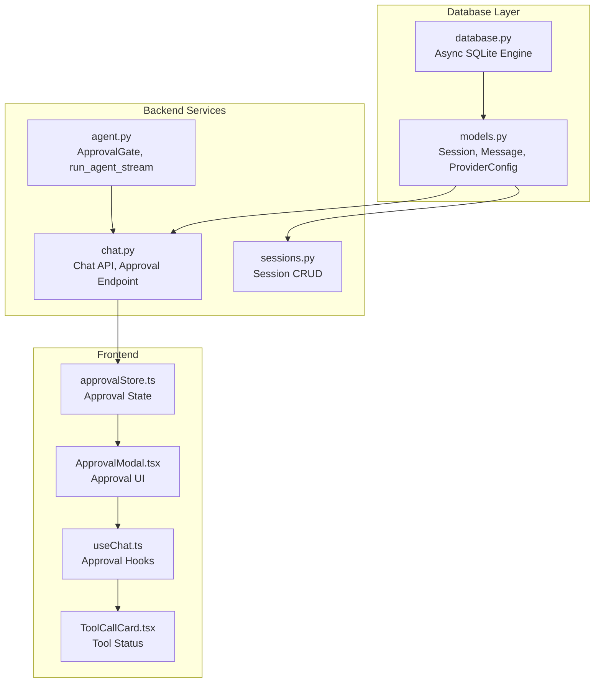
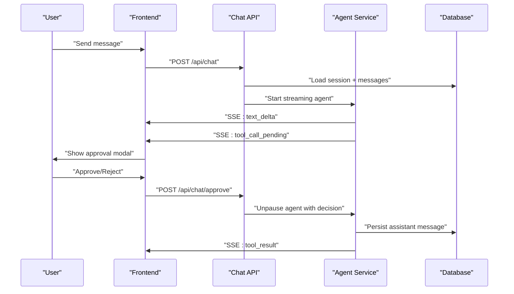
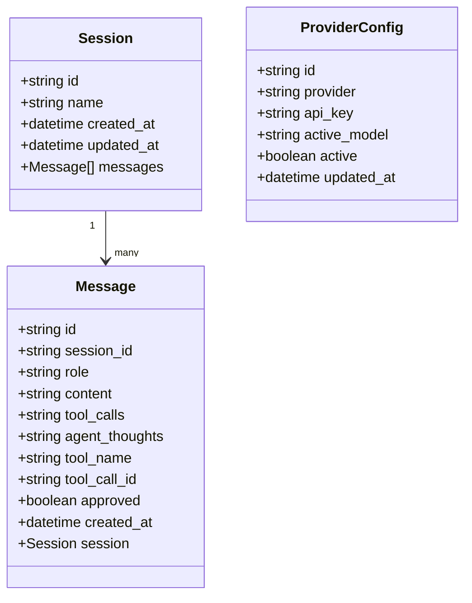
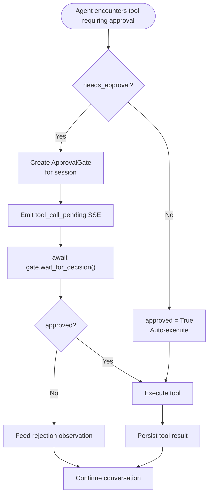
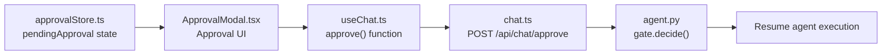

# Context Snapshots

<cite>
**Referenced Files in This Document**
- [models.py](file://backend/models.py)
- [database.py](file://backend/database.py)
- [agent.py](file://backend/services/agent.py)
- [chat.py](file://backend/api/chat.py)
- [sessions.py](file://backend/api/sessions.py)
- [approvalStore.ts](file://frontend/src/store/approvalStore.ts)
- [ApprovalModal.tsx](file://frontend/src/components/ApprovalModal.tsx)
- [useChat.ts](file://frontend/src/hooks/useChat.ts)
- [ToolCallCard.tsx](file://frontend/src/components/ToolCallCard.tsx)
</cite>

## Update Summary
**Changes Made**
- Removed all references to the old snapshot-based context system
- Replaced with database-driven session management with real-time approval workflows
- Updated architecture diagrams to reflect new approval gate system
- Added comprehensive documentation for new database models and session management
- Updated frontend components documentation to reflect new approval modal system

## Table of Contents
1. [Introduction](#introduction)
2. [Project Structure](#project-structure)
3. [Core Components](#core-components)
4. [Architecture Overview](#architecture-overview)
5. [Detailed Component Analysis](#detailed-component-analysis)
6. [Database-Driven Session Management](#database-driven-session-management)
7. [Real-Time Approval Workflows](#real-time-approval-workflows)
8. [Frontend Integration](#frontend-integration)
9. [Migration from Snapshot System](#migration-from-snapshot-system)
10. [Performance Considerations](#performance-considerations)
11. [Troubleshooting Guide](#troubleshooting-guide)
12. [Conclusion](#conclusion)

## Introduction
This document explains the database-driven session management system that replaced the old context snapshot system in AI Revit Agent. The new system uses real-time approval workflows with persistent session storage, eliminating the need for file-based snapshots while maintaining the safety and transparency benefits. Sessions are stored in an SQLite database with full conversation history, enabling robust approval gates and human-in-the-loop workflows.

## Project Structure
The new system is built around database-first session management:
- Database models: backend/models.py defines Session, Message, ProviderConfig, and AppSetting entities
- Database layer: backend/database.py provides async SQLite connection management
- Agent service: backend/services/agent.py implements real-time approval gates and streaming
- API endpoints: backend/api/chat.py and backend/api/sessions.py handle session CRUD operations
- Frontend approval system: React components manage real-time approval modals and state

**Diagram sources**
- [database.py:34-42](file://backend/database.py#L34-L42)
- [models.py:35-99](file://backend/models.py#L35-L99)
- [agent.py:39-87](file://backend/services/agent.py#L39-L87)
- [chat.py:74-297](file://backend/api/chat.py#L74-L297)
- [sessions.py:80-108](file://backend/api/sessions.py#L80-L108)
- [approvalStore.ts:14-21](file://frontend/src/store/approvalStore.ts#L14-L21)
- [ApprovalModal.tsx:5-63](file://frontend/src/components/ApprovalModal.tsx#L5-L63)
- [useChat.ts:73-97](file://frontend/src/hooks/useChat.ts#L73-L97)
- [ToolCallCard.tsx:8-33](file://frontend/src/components/ToolCallCard.tsx#L8-L33)

**Section sources**
- [database.py:34-42](file://backend/database.py#L34-L42)
- [models.py:35-99](file://backend/models.py#L35-L99)
- [agent.py:39-87](file://backend/services/agent.py#L39-L87)
- [chat.py:74-297](file://backend/api/chat.py#L74-L297)
- [sessions.py:80-108](file://backend/api/sessions.py#L80-L108)
- [approvalStore.ts:14-21](file://frontend/src/store/approvalStore.ts#L14-L21)
- [ApprovalModal.tsx:5-63](file://frontend/src/components/ApprovalModal.tsx#L5-L63)
- [useChat.ts:73-97](file://frontend/src/hooks/useChat.ts#L73-L97)
- [ToolCallCard.tsx:8-33](file://frontend/src/components/ToolCallCard.tsx#L8-L33)

## Core Components
The new system replaces snapshots with persistent session storage:

- **Session Management**: Database-driven sessions with full conversation history storage
- **Approval Gates**: Real-time approval system using asyncio Events for human-in-the-loop workflows
- **Streaming Agent**: Asynchronous agent loop with SSE event streaming and approval coordination
- **Frontend Integration**: React components for approval modals, tool call cards, and session management
- **Database Models**: SQLAlchemy ORM models for sessions, messages, provider configurations, and app settings

Key responsibilities:
- Session persistence: [Session model:35-54](file://backend/models.py#L35-L54)
- Approval gate management: [ApprovalGate class:39-64](file://backend/services/agent.py#L39-L64)
- Real-time streaming: [run_agent_stream function:94-100](file://backend/services/agent.py#L94-L100)
- Database operations: [Database engine setup:35-42](file://backend/database.py#L35-L42)
- Frontend approval state: [approvalStore:14-21](file://frontend/src/store/approvalStore.ts#L14-L21)

**Section sources**
- [models.py:35-54](file://backend/models.py#L35-L54)
- [agent.py:39-64](file://backend/services/agent.py#L39-L64)
- [agent.py:94-100](file://backend/services/agent.py#L94-L100)
- [database.py:35-42](file://backend/database.py#L35-L42)
- [approvalStore.ts:14-21](file://frontend/src/store/approvalStore.ts#L14-L21)

## Architecture Overview
The new system eliminates file-based snapshots in favor of real-time database operations:

1. **Session Creation**: Create persistent sessions with automatic timestamps
2. **Conversation Streaming**: Agent streams responses and tool calls via SSE
3. **Real-Time Approval**: Approval gates coordinate human decisions during tool execution
4. **Database Persistence**: All conversations and approvals are stored permanently
5. **Frontend Integration**: Approval modals provide immediate user feedback

**Diagram sources**
- [chat.py:74-297](file://backend/api/chat.py#L74-L297)
- [agent.py:94-100](file://backend/services/agent.py#L94-L100)
- [models.py:61-99](file://backend/models.py#L61-L99)
- [approvalStore.ts:14-21](file://frontend/src/store/approvalStore.ts#L14-L21)

**Section sources**
- [chat.py:74-297](file://backend/api/chat.py#L74-L297)
- [agent.py:94-100](file://backend/services/agent.py#L94-L100)
- [models.py:61-99](file://backend/models.py#L61-L99)
- [approvalStore.ts:14-21](file://frontend/src/store/approvalStore.ts#L14-L21)

## Detailed Component Analysis

### Database-First Session Management
The system now uses persistent sessions with full conversation history:

- **Session Entity**: Stores session metadata with automatic timestamps and cascading message relationships
- **Message Entity**: Comprehensive storage for all conversation turns including tool calls and approval states
- **Provider Configuration**: Manages active provider settings and API keys
- **App Settings**: Key-value store for application-wide configuration

**Diagram sources**
- [models.py:35-54](file://backend/models.py#L35-L54)
- [models.py:61-99](file://backend/models.py#L61-L99)
- [models.py:106-123](file://backend/models.py#L106-L123)

**Section sources**
- [models.py:35-54](file://backend/models.py#L35-L54)
- [models.py:61-99](file://backend/models.py#L61-L99)
- [models.py:106-123](file://backend/models.py#L106-L123)

### Real-Time Approval Gate System
The new approval system replaces snapshot-based context checking:

- **ApprovalGate Class**: Manages asyncio events and approval state per session
- **In-Flight Registry**: Tracks active approval gates in process memory
- **Approval Coordination**: Synchronizes agent execution with human decisions
- **Auto-Approval Logic**: Read-only tools bypass approval requirements

**Diagram sources**
- [agent.py:245-293](file://backend/services/agent.py#L245-L293)
- [agent.py:39-64](file://backend/services/agent.py#L39-L64)

**Section sources**
- [agent.py:245-293](file://backend/services/agent.py#L245-L293)
- [agent.py:39-64](file://backend/services/agent.py#L39-L64)

### Frontend Approval Integration
The frontend components work seamlessly with the new approval system:

- **Approval Store**: Centralized state management for pending approvals
- **Approval Modal**: User interface for reviewing and approving tool calls
- **Tool Call Cards**: Visual indicators for tool execution status
- **Hook Integration**: Seamless approval flow coordination

**Diagram sources**
- [approvalStore.ts:14-21](file://frontend/src/store/approvalStore.ts#L14-L21)
- [ApprovalModal.tsx:5-63](file://frontend/src/components/ApprovalModal.tsx#L5-L63)
- [useChat.ts:73-97](file://frontend/src/hooks/useChat.ts#L73-L97)
- [chat.py:268-297](file://backend/api/chat.py#L268-L297)
- [agent.py:61-64](file://backend/services/agent.py#L61-L64)

**Section sources**
- [approvalStore.ts:14-21](file://frontend/src/store/approvalStore.ts#L14-L21)
- [ApprovalModal.tsx:5-63](file://frontend/src/components/ApprovalModal.tsx#L5-L63)
- [useChat.ts:73-97](file://frontend/src/hooks/useChat.ts#L73-L97)
- [chat.py:268-297](file://backend/api/chat.py#L268-L297)
- [agent.py:61-64](file://backend/services/agent.py#L61-L64)

## Database-Driven Session Management

### Session Lifecycle
The new system manages sessions entirely through the database:

- **Creation**: Sessions are created with UUID identifiers and automatic timestamps
- **Renaming**: Sessions can be renamed through PATCH requests
- **Deletion**: Complete session deletion with cascading message removal
- **Listing**: Sessions ordered by last updated time for easy access

### Message Persistence
Messages include comprehensive metadata for full conversation reconstruction:

- **Role-based categorization**: user, assistant, tool roles
- **Tool call tracking**: JSON serialization of tool calls with approval status
- **Agent thoughts**: Separate storage for reasoning traces
- **Timestamp management**: Automatic creation and update timestamps

**Section sources**
- [sessions.py:80-108](file://backend/api/sessions.py#L80-L108)
- [models.py:61-99](file://backend/models.py#L61-L99)

## Real-Time Approval Workflows

### Approval Gate Implementation
The approval system uses process-local memory for session tracking:

- **Process Memory Storage**: `_active_gates` dictionary maps session IDs to ApprovalGate instances
- **Async Coordination**: asyncio Events synchronize agent execution with user decisions
- **Session Isolation**: Each session maintains its own approval state
- **Cleanup Management**: Gates are removed when sessions end

### Approval Flow Control
The system ensures secure human-in-the-loop workflows:

- **Tool Classification**: Read-only vs write operations determine approval requirements
- **ID Verification**: Approval requests include tool call IDs for security
- **State Validation**: Multiple checks prevent approval tampering
- **Graceful Handling**: User rejections are integrated into conversation flow

**Section sources**
- [agent.py:67-87](file://backend/services/agent.py#L67-L87)
- [agent.py:245-293](file://backend/services/agent.py#L245-L293)
- [chat.py:268-297](file://backend/api/chat.py#L268-L297)

## Frontend Integration

### Approval Modal System
The frontend provides comprehensive approval user experience:

- **Modal Interface**: Clear presentation of tool calls with formatted arguments
- **Status Indicators**: Visual feedback for approval states (pending, awaiting, executing)
- **Immediate Feedback**: Modal dismissal provides snappy user experience
- **Error Handling**: Robust error handling for approval failures

### Tool Call Visualization
Frontend components track tool execution progress:

- **Card Components**: Visual status badges for different execution states
- **Argument Display**: Formatted JSON display for tool parameters
- **Result Presentation**: Structured result display after execution
- **Read/Write Distinction**: Different styling for read-only vs write operations

**Section sources**
- [ApprovalModal.tsx:5-63](file://frontend/src/components/ApprovalModal.tsx#L5-L63)
- [ToolCallCard.tsx:8-33](file://frontend/src/components/ToolCallCard.tsx#L8-L33)
- [useChat.ts:73-97](file://frontend/src/hooks/useChat.ts#L73-L97)

## Migration from Snapshot System

### What Was Removed
The old snapshot-based system included:
- File-based context snapshots (`data/context/latest_snapshot.json`)
- Manual snapshot creation and serialization logic
- Read-only document readers for levels and grids
- Local file system dependencies for context storage

### Benefits of New System
- **Persistence**: All sessions and conversations stored permanently
- **Scalability**: Database-backed storage scales better than file systems
- **Real-time**: Immediate approval processing without file I/O
- **Audit Trail**: Complete conversation history with timestamps
- **Cloud Ready**: Database storage works across distributed deployments

### Migration Path
Organizations migrating from the old system should:
- Back up existing snapshot data if needed
- Initialize new database schema
- Test approval workflows with new system
- Validate that all existing functionality is preserved

## Performance Considerations

### Database Performance
- **Async Operations**: SQLAlchemy 2.0 async engine provides non-blocking database access
- **Connection Pooling**: Reusable connections minimize overhead
- **Efficient Queries**: Session queries optimized with proper indexing
- **Transaction Management**: Automatic commit/rollback handling

### Memory Management
- **Approval Gate Cleanup**: Gates removed when sessions end
- **Streaming Efficiency**: SSE streaming minimizes memory footprint
- **JSON Processing**: Efficient JSON serialization for tool calls and messages
- **Frontend State**: Minimal reactive state updates for approval management

### Scalability Factors
- **SQLite Limitations**: Current implementation uses SQLite for simplicity
- **Future Scaling**: Database schema supports migration to more robust databases
- **Approval Gate Limits**: Process memory approach suitable for single-user deployments
- **Cloud Deployment**: Approval gates would use Redis pub/sub in distributed environments

## Troubleshooting Guide

### Common Issues and Resolutions
- **Approval Timeout**: If approval takes too long, the agent stream may end; restart with new approval
- **Session Not Found**: Verify session ID exists in database before sending messages
- **Approval ID Mismatch**: Ensure approval request matches the current pending tool call
- **Database Connection Issues**: Check database URL and permissions for the application
- **Tool Registration Problems**: Verify Revit bridge is running and tool schemas are accessible

### Database-Related Issues
- **Migration Errors**: Ensure database schema is up to date with latest migrations
- **Connection Pool Exhaustion**: Monitor database connection limits
- **Transaction Conflicts**: Handle concurrent session access appropriately
- **Data Integrity**: Verify foreign key constraints and cascading deletes work correctly

### Frontend Integration Issues
- **Approval Modal Not Showing**: Check approval store state and tool call pending status
- **Approval Response Delays**: Network latency may affect approval response timing
- **Session List Refresh**: Frontend may need manual refresh after creating new sessions
- **Streaming Issues**: Check browser SSE support and network connectivity

**Section sources**
- [chat.py:277-297](file://backend/api/chat.py#L277-L297)
- [agent.py:262-266](file://backend/services/agent.py#L262-L266)
- [database.py:51-66](file://backend/database.py#L51-L66)

## Conclusion
The new database-driven session management system successfully replaces the old snapshot-based approach while enhancing functionality and reliability. Real-time approval workflows provide immediate human-in-the-loop control, persistent session storage ensures data longevity, and comprehensive frontend integration delivers excellent user experience. The system maintains the safety and transparency benefits of the original snapshot system while adding significant operational improvements.