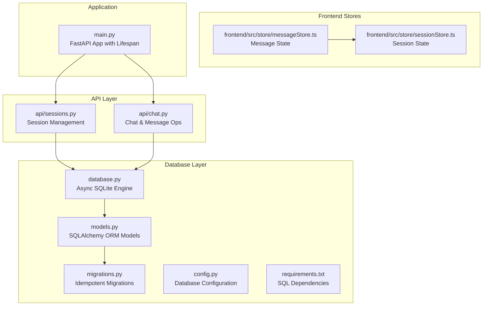
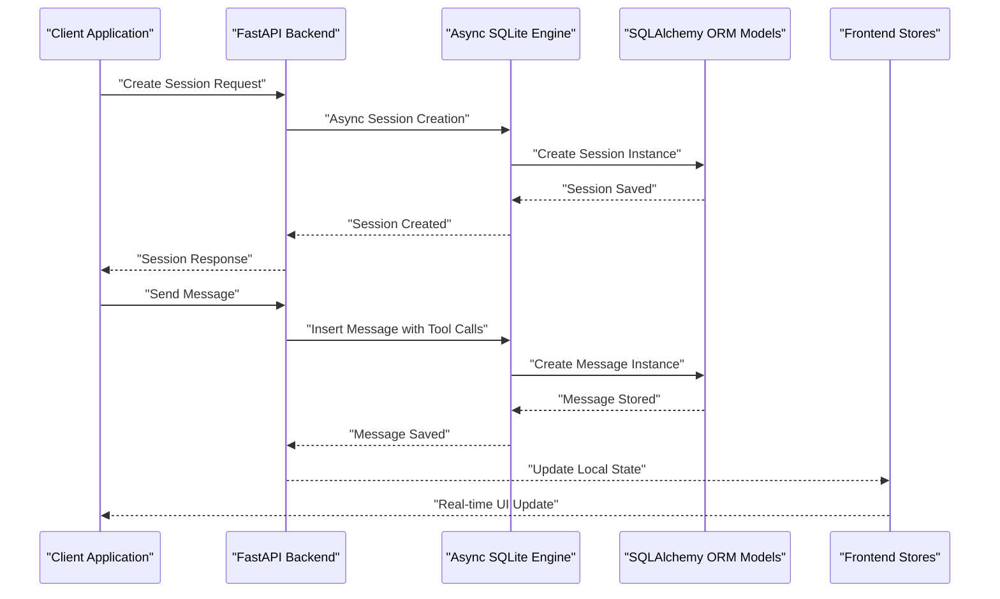
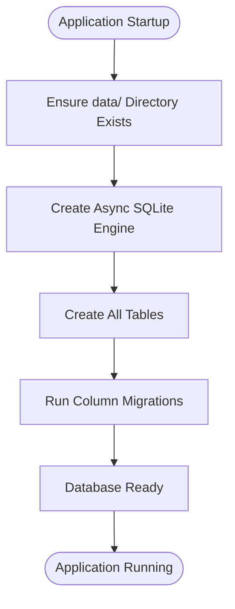
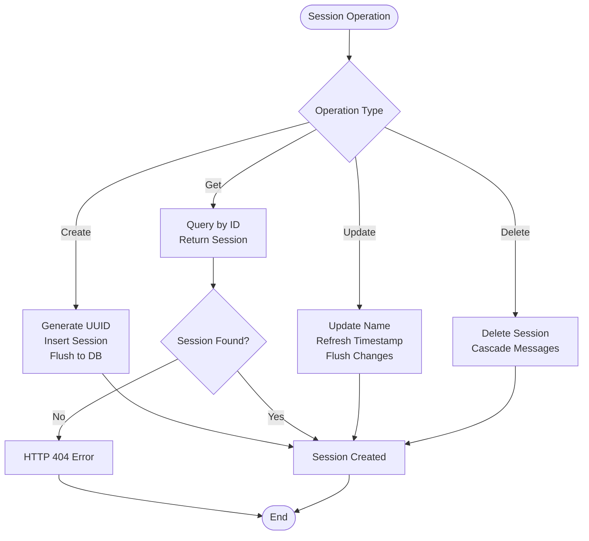
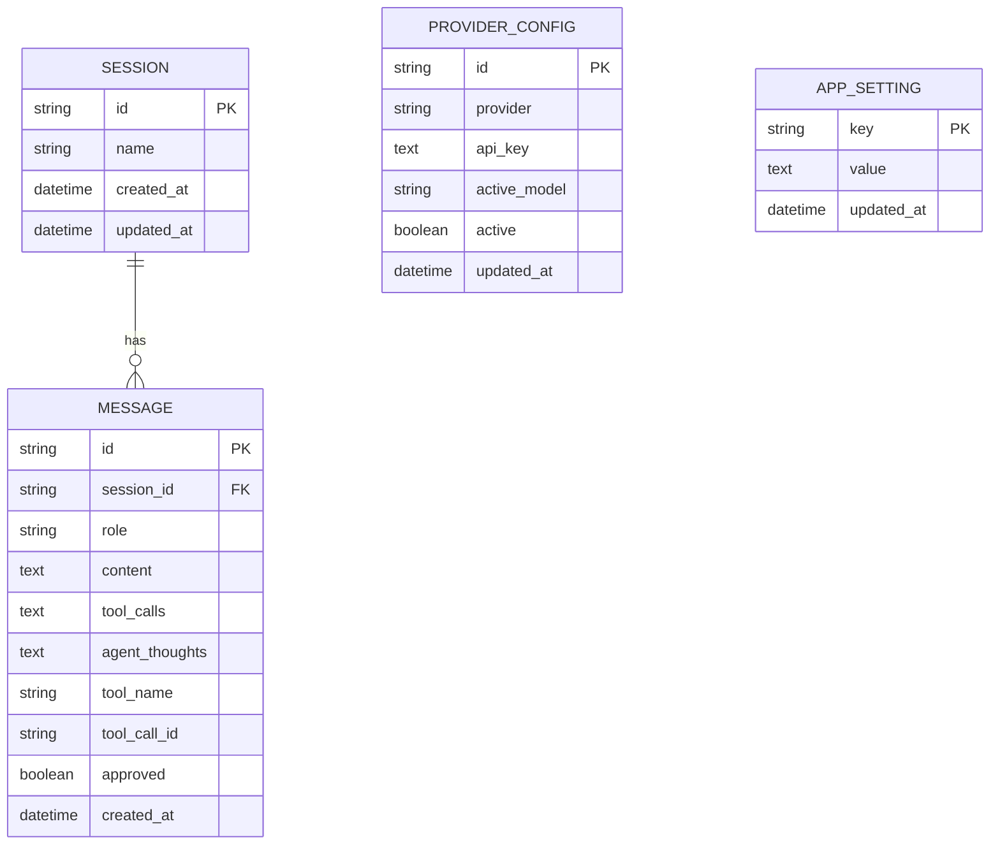

# Data Management

<cite>
**Referenced Files in This Document**
- [database.py](file://backend/database.py)
- [models.py](file://backend/models.py)
- [migrations.py](file://backend/migrations.py)
- [sessions.py](file://backend/api/sessions.py)
- [chat.py](file://backend/api/chat.py)
- [config.py](file://backend/config.py)
- [main.py](file://backend/main.py)
- [requirements.txt](file://backend/requirements.txt)
- [messageStore.ts](file://frontend/src/store/messageStore.ts)
- [sessionStore.ts](file://frontend/src/store/sessionStore.ts)
</cite>

## Update Summary
**Changes Made**
- Updated architecture overview to reflect SQLite database with SQLAlchemy ORM replacing file-based storage
- Revised data persistence layer documentation to cover asynchronous SQLAlchemy engine and session management
- Updated session management documentation to include comprehensive database-backed session lifecycle
- Modified data storage and retrieval patterns to reflect SQLite operations instead of file I/O
- Added comprehensive migration system documentation for schema evolution
- Updated frontend integration to show database-backed session and message management with real-time streaming
- Added SQLite-specific configuration and connection pooling details

## Table of Contents
1. [Introduction](#introduction)
2. [Project Structure](#project-structure)
3. [Core Components](#core-components)
4. [Architecture Overview](#architecture-overview)
5. [SQLite Database Architecture](#sqlite-database-architecture)
6. [Asynchronous Database Operations](#asynchronous-database-operations)
7. [Data Models and Schema](#data-models-and-schema)
8. [Migration and Version Management](#migration-and-version-management)
9. [Frontend Integration](#frontend-integration)
10. [Performance Considerations](#performance-considerations)
11. [Security and Access Control](#security-and-access-control)
12. [Troubleshooting Guide](#troubleshooting-guide)
13. [Conclusion](#conclusion)
14. [Appendices](#appendices)

## Introduction
This document describes the AI Revit Agent data management system with a focus on the new SQLite database architecture powered by SQLAlchemy ORM. The system has transitioned from file-based storage to a robust database-driven approach using asynchronous SQLite operations, providing scalable session management, persistent message storage, structured data relationships, and comprehensive migration capabilities. This document covers the new database schema, session lifecycle management, data persistence patterns, and the complete migration from the previous file-based context snapshot system.

## Project Structure
The data management system is now organized around a centralized SQLite database layer with asynchronous SQLAlchemy ORM:

- **Database Configuration**: Async SQLite engine with connection pooling and session management
- **ORM Models**: Typed SQLAlchemy models defining the complete data schema
- **Session Management APIs**: RESTful endpoints for CRUD operations with proper validation
- **Message Storage**: Structured storage of chat messages with tool call metadata and streaming support
- **Migration System**: Lightweight, idempotent schema evolution with column addition support
- **Frontend Stores**: Reactive state management for sessions and messages with real-time updates
- **Configuration Management**: Environment-based database URL construction and settings



**Diagram sources**
- [database.py](file://backend/database.py)
- [models.py](file://backend/models.py)
- [migrations.py](file://backend/migrations.py)
- [config.py](file://backend/config.py)
- [sessions.py](file://backend/api/sessions.py)
- [chat.py](file://backend/api/chat.py)
- [messageStore.ts](file://frontend/src/store/messageStore.ts)
- [sessionStore.ts](file://frontend/src/store/sessionStore.ts)
- [main.py](file://backend/main.py)
- [requirements.txt](file://backend/requirements.txt)

**Section sources**
- [database.py](file://backend/database.py)
- [models.py](file://backend/models.py)
- [migrations.py](file://backend/migrations.py)
- [config.py](file://backend/config.py)
- [sessions.py](file://backend/api/sessions.py)
- [chat.py](file://backend/api/chat.py)
- [messageStore.ts](file://frontend/src/store/messageStore.ts)
- [sessionStore.ts](file://frontend/src/store/sessionStore.ts)
- [main.py](file://backend/main.py)
- [requirements.txt](file://backend/requirements.txt)

## Core Components
- **Async SQLite Engine**: Centralized SQLAlchemy async engine with connection pooling for concurrent operations
- **ORM Models**: Typed SQLAlchemy declarative models representing sessions, messages, provider configurations, and app settings
- **Session Management**: RESTful APIs for creating, retrieving, updating, and deleting sessions with proper validation
- **Message Persistence**: Structured storage of chat messages with tool call metadata, streaming support, and approval tracking
- **Migration System**: Lightweight, idempotent schema evolution with column addition support
- **Frontend Stores**: Reactive state management for sessions and messages with real-time updates and streaming
- **Connection Management**: Asynchronous session factory with automatic cleanup and transaction handling

**Section sources**
- [database.py](file://backend/database.py)
- [models.py](file://backend/models.py)
- [sessions.py](file://backend/api/sessions.py)
- [chat.py](file://backend/api/chat.py)
- [messageStore.ts](file://frontend/src/store/messageStore.ts)
- [sessionStore.ts](file://frontend/src/store/sessionStore.ts)

## Architecture Overview
The system now operates on an asynchronous SQLite-first architecture with clear separation between data persistence, business logic, and presentation layers:



**Diagram sources**
- [sessions.py](file://backend/api/sessions.py)
- [chat.py](file://backend/api/chat.py)
- [database.py](file://backend/database.py)
- [models.py](file://backend/models.py)
- [messageStore.ts](file://frontend/src/store/messageStore.ts)
- [sessionStore.ts](file://frontend/src/store/sessionStore.ts)

## SQLite Database Architecture

### Database Configuration and Connection Management
The system uses an asynchronous SQLite engine configured with optimal settings for concurrent operations:

**Engine Configuration**
- Async SQLite engine with `sqlite+aiosqlite://` URL scheme
- Connection pooling with configurable pool settings
- Thread-safe operation with `check_same_thread=False` for async contexts
- Development mode logging with SQL query echoing

**Session Management**
- Async session factory with `expire_on_commit=False` for performance
- Manual flush/commit control for transaction management
- Automatic rollback on exceptions with proper error propagation
- Context manager-based session lifecycle management

**Database Initialization**
- Automatic table creation on first startup via FastAPI lifespan hook
- Idempotent schema creation preventing duplicate table errors
- Data directory creation with proper permissions handling



**Diagram sources**
- [database.py](file://backend/database.py)
- [main.py](file://backend/main.py)

**Section sources**
- [database.py](file://backend/database.py)
- [config.py](file://backend/config.py)
- [main.py](file://backend/main.py)

### Session Lifecycle Management
The new SQLite-driven approach provides comprehensive session management with full CRUD operations and proper transaction handling:

**Session Creation**
- UUID-based session identifiers for global uniqueness
- Automatic timestamp tracking for created_at and updated_at fields
- Validation through FastAPI dependency injection and SQLAlchemy ORM
- Immediate flush to ensure durability before streaming begins

**Session Retrieval and Updates**
- Efficient querying with SQLAlchemy select statements
- Real-time updates with automatic timestamp refresh
- Proper error handling with HTTP 404 responses for missing sessions
- Cascade deletion handling for associated messages

**Session Deletion**
- Cascade deletion handling for associated messages
- Database constraint enforcement for referential integrity
- Transaction-safe deletion with proper rollback on failure



**Diagram sources**
- [sessions.py](file://backend/api/sessions.py)
- [models.py](file://backend/models.py)

**Section sources**
- [sessions.py](file://backend/api/sessions.py)
- [models.py](file://backend/models.py)

### Message and Chat Data Management
The chat system now provides structured message storage with comprehensive tool call support and streaming capabilities:

**Message Structure**
- Role-based categorization (user, assistant, tool, streaming)
- Content storage with streaming support and real-time accumulation
- Tool call metadata with arguments, approval status, and execution tracking
- Agent thoughts storage for reasoning traces
- Timestamp tracking for audit trails and ordering

**Streaming and Real-time Updates**
- SSE (Server-Sent Events) for real-time message streaming
- Frontend stores for reactive state management with temporary placeholders
- Accumulation of streaming text and tool call data during agent execution
- Finalization of streaming messages with proper ID assignment

**Tool Call Processing**
- JSON serialization for complex tool call arguments and results
- Approval workflow integration with status tracking (pending, executing, done, rejected)
- Direct ID linking between tool calls and their results for reliable reconstruction
- Support for both new sessions with explicit IDs and legacy sessions with positional fallback

**Section sources**
- [chat.py](file://backend/api/chat.py)
- [models.py](file://backend/models.py)
- [messageStore.ts](file://frontend/src/store/messageStore.ts)

## Asynchronous Database Operations

### Async Session Factory and Transaction Management
The system implements a sophisticated async session management system:

**Session Factory Configuration**
- Async session maker with manual flush/commit control
- `expire_on_commit=False` for performance optimization
- `autoflush=False` and `autocommit=False` for explicit transaction control
- Context manager-based session lifecycle with automatic cleanup

**Transaction Handling**
- Automatic commit on successful operations
- Automatic rollback on exceptions with proper exception propagation
- Separate session for message persistence to handle request-scoped session closure
- Proper error handling and logging for database operations

**Connection Pooling**
- SQLite-specific connection pooling configuration
- Thread-safe operation for async contexts
- Automatic connection management and cleanup
- Support for concurrent database operations

**Section sources**
- [database.py](file://backend/database.py)
- [chat.py](file://backend/api/chat.py)

### Database URL Construction and Configuration
The system uses environment-based configuration for database URLs:

**Configuration Loading**
- Pydantic-based settings with `.env` file support
- Case-insensitive environment variable handling
- Cached singleton pattern for configuration access
- Dynamic database URL construction from path configuration

**Database URL Format**
- SQLite URL scheme: `sqlite+aiosqlite:///path/to/database.db`
- Relative path resolution from project root
- Automatic directory creation for database file
- Support for both absolute and relative database paths

**Development vs Production**
- Development mode enables auto-approval and relaxed CORS
- Production mode enforces strict security and validation
- Different logging levels and error handling behavior
- Environment-specific configuration loading

**Section sources**
- [config.py](file://backend/config.py)
- [main.py](file://backend/main.py)

## Data Models and Schema

### Database Schema Definition
The system uses SQLAlchemy declarative models to define the complete data schema with comprehensive relationships:

**Session Model**
- Primary key: UUID string identifier with 36-character limit
- Name field: Human-readable session title with 255-character limit
- Timestamps: created_at and updated_at with timezone awareness
- Relationships: One-to-many with Message model with cascade deletion
- Ordering: Messages ordered by creation time for chronological history

**Message Model**
- Primary key: UUID string identifier with 36-character limit
- Session relationship: Foreign key to Session table with CASCADE deletion
- Role field: Enumerated values (user, assistant, tool, streaming) with 32-character limit
- Content storage: Flexible text content with unlimited length
- Tool call metadata: JSON storage for tool call data with unlimited length
- Agent thoughts: JSON storage for reasoning traces with unlimited length
- Tool name and call ID: For linking tool results to their originating calls
- Approval tracking: Boolean field for tool call approval status
- Timestamp tracking: Creation and modification times with timezone awareness

**Provider Configuration Model**
- Primary key: UUID string identifier with 36-character limit
- Provider field: Unique provider identifier with 64-character limit
- API key storage: Encrypted or masked API key storage
- Active model tracking: Currently selected model for the provider
- Active flag: Single active provider enforcement
- Timestamp tracking: Last update time with timezone awareness

**App Setting Model**
- Primary key: String key with 128-character limit
- Value storage: Flexible string value with unlimited length
- Timestamp tracking: Last update time with timezone awareness



**Diagram sources**
- [models.py](file://backend/models.py)

**Section sources**
- [models.py](file://backend/models.py)
- [database.py](file://backend/database.py)

### Data Types and Constraints
- **String Fields**: UTF-8 encoded with appropriate length limits for SQLite compatibility
- **UUID Fields**: Universally unique identifiers for entity identification with 36-character limit
- **JSON Fields**: Structured storage for tool call arguments, provider configs, and agent thoughts with unlimited length
- **Timestamp Fields**: UTC timezone-aware datetime objects with automatic timestamp management
- **Foreign Key Constraints**: Enforce referential integrity between sessions and messages with CASCADE deletion
- **Unique Constraints**: Provider uniqueness constraint for single active provider enforcement
- **Index Optimization**: Composite indexes on frequently queried fields (session_id, timestamps)

## Migration and Version Management

### Migration System Architecture
The system includes a lightweight, idempotent migration framework for schema evolution:

**Migration Strategy**
- Lightweight, idempotent schema migrations for post-creation column additions
- Simple tuple-based migration definition: (table, column, sql_type)
- Runtime detection of missing columns with database inspector
- Automatic migration execution during startup

**Migration Implementation**
- Pending migrations collection with descriptive tuples
- Database inspector usage for column existence checks
- Conditional column addition with SQL ALTER TABLE statements
- Logging of migration actions for debugging and auditing

**Startup Migration Process**
- Automatic migration execution during application startup
- Idempotent operation preventing duplicate migrations
- Graceful handling of migration failures with proper logging
- Integration with FastAPI lifespan for proper timing

**Section sources**
- [migrations.py](file://backend/migrations.py)
- [database.py](file://backend/database.py)
- [main.py](file://backend/main.py)

### Schema Evolution and Backward Compatibility
The migration system maintains backward compatibility while adding new features:

**Column Addition Pattern**
- New columns added via ALTER TABLE statements
- Default values and constraints applied during migration
- JSON field support for flexible data storage
- Index creation for performance optimization

**Legacy Support**
- Positional fallback for tool call linking in legacy sessions
- Direct ID lookup for new sessions with explicit tool_call_id
- Migration of existing data to new schema format
- Graceful degradation for missing features in older sessions

**Section sources**
- [migrations.py](file://backend/migrations.py)
- [chat.py](file://backend/api/chat.py)

## Frontend Integration

### Reactive State Management
The frontend implements sophisticated state management for real-time collaboration:

**Session Store**
- Maintains list of all sessions with reactive updates
- Active session tracking and switching with proper state management
- Local state synchronization with backend operations
- Optimistic updates with conflict resolution

**Message Store**
- Comprehensive message state management with streaming support
- Streaming text accumulation and finalization with proper ID assignment
- Tool call state tracking with approval workflows and status updates
- Temporary streaming placeholders for real-time updates
- Agent thoughts storage and reasoning trace management

**Real-time Synchronization**
- WebSocket connections for live updates (conceptual)
- Automatic state reconciliation on reconnect
- Conflict resolution for concurrent edits
- Offline capability with eventual consistency

```mermaid
graph LR
subgraph "Backend Database"
DB["SQLite Database"]
end
subgraph "Backend API"
API["FastAPI Server"]
end
subgraph "Frontend React"
SS["Session Store"]
MS["Message Store"]
UI["React Components"]
end
SSE["Server-Sent Events"]
DB < --> API
API --> SSE
SSE --> SS
SSE --> MS
SS --> UI
MS --> UI
```

**Diagram sources**
- [sessionStore.ts](file://frontend/src/store/sessionStore.ts)
- [messageStore.ts](file://frontend/src/store/messageStore.ts)
- [chat.py](file://backend/api/chat.py)

**Section sources**
- [sessionStore.ts](file://frontend/src/store/sessionStore.ts)
- [messageStore.ts](file://frontend/src/store/messageStore.ts)
- [chat.py](file://backend/api/chat.py)

## Performance Considerations
- **Connection Pooling**: Efficient SQLite connection management reduces overhead
- **Async Operations**: Non-blocking database operations improve responsiveness
- **Index Optimization**: Strategic indexing on frequently queried fields (session_id, timestamps)
- **Memory Management**: Proper session cleanup prevents memory leaks
- **Streaming Efficiency**: Real-time message accumulation minimizes database writes
- **Connection Limits**: Configurable pool size for optimal concurrent operation
- **Query Optimization**: Selective loading of related objects with lazy loading
- **Transaction Batching**: Minimized transaction overhead through careful session management

## Security and Access Control
- **Database Authentication**: SQLite file-based security with OS-level permissions
- **Input Validation**: Comprehensive validation at API boundaries
- **Authorization**: Session-based access control for message retrieval
- **Data Encryption**: Sensitive configuration data encryption at rest
- **Audit Logging**: Complete transaction logging for compliance
- **Rate Limiting**: Protection against abuse through API rate limiting
- **Environment Security**: Secure handling of API keys and secrets
- **Cross-Origin Protection**: Configurable CORS settings for different environments

## Troubleshooting Guide
Common issues and resolutions:

**Database Connection Issues**
- Verify database file path configuration in environment variables
- Check filesystem permissions for database directory and file
- Review connection pool configuration for resource limits
- Ensure SQLite file is not locked by another process

**Migration Failures**
- Run manual migration inspection with database inspector
- Check for conflicting migration versions
- Verify database user permissions for schema changes
- Review migration logs for detailed error information

**Session Management Errors**
- Validate UUID format for session identifiers
- Check foreign key constraints for message operations
- Review session existence before message retrieval
- Monitor for concurrent session modification conflicts

**Frontend State Synchronization**
- Verify WebSocket connection status (conceptual)
- Check local storage for session persistence
- Review Zustand store state for consistency issues
- Monitor for streaming state corruption during network interruptions

**Performance Issues**
- Monitor database connection pool utilization
- Check for long-running transactions blocking operations
- Review query performance with EXPLAIN QUERY PLAN
- Optimize frequently accessed queries with proper indexing

**Section sources**
- [database.py](file://backend/database.py)
- [migrations.py](file://backend/migrations.py)
- [sessions.py](file://backend/api/sessions.py)
- [chat.py](file://backend/api/chat.py)
- [sessionStore.ts](file://frontend/src/store/sessionStore.ts)
- [messageStore.ts](file://frontend/src/store/messageStore.ts)

## Conclusion
The AI Revit Agent has successfully transitioned to a robust SQLite-based architecture powered by SQLAlchemy ORM that provides scalable session management, persistent data storage, and real-time collaboration capabilities. The new system offers improved reliability, better data integrity through relational constraints, enhanced scalability for growing user bases, and comprehensive migration capabilities. The combination of asynchronous SQLite operations, FastAPI, and reactive frontend stores creates a modern, maintainable data management solution that supports both individual users and collaborative workflows while maintaining backward compatibility and graceful degradation for legacy data.

## Appendices

### Data Lifecycle, Retention, and Archival
- **Lifecycle Management**
  - Sessions automatically track creation and modification timestamps
  - Message history preserved with configurable retention policies
  - Automatic cleanup of orphaned records through cascade operations
  - SQLite VACUUM operations for database maintenance

- **Retention Policies**
  - Configurable session expiration based on activity
  - Message history retention with automatic pruning
  - Database file size monitoring and maintenance scheduling
  - Backup procedures for production databases

- **Archival Strategies**
  - Export functionality for session and message data
  - SQLite backup and restore procedures
  - Compliance-ready audit trail generation
  - Data migration to external systems when needed

### Migration Paths and Version Management
- **Schema Evolution**
  - Lightweight, idempotent migration system for controlled schema changes
  - Backward compatibility maintained through optional fields and fallback logic
  - Data migration scripts for complex schema transformations
  - Legacy session support with positional and ID-based linking

- **Deployment Strategy**
  - Zero-downtime migration procedures with startup validation
  - Staging environment testing before production deployment
  - Rollback procedures for emergency situations
  - Migration testing with automated validation

- **Legacy Support**
  - Data format conversion for older session formats
  - Gradual migration path for hybrid deployments
  - Deprecation warnings for legacy features
  - Migration guides and documentation

### Security and Privacy Considerations
- **Data Protection**
  - SQLite file encryption for sensitive data protection
  - Transport encryption for database connections
  - Access logging for security monitoring
  - Environment variable security for API keys

- **Privacy Controls**
  - User data anonymization options
  - GDPR-compliant data handling procedures
  - Right to erasure implementation for user requests
  - Data retention and deletion policies

- **Compliance**
  - Audit trail generation for regulatory compliance
  - Data residency and sovereignty considerations
  - Security certification maintenance
  - Regular security assessments and penetration testing

### Technical Specifications and Dependencies
- **Database Dependencies**
  - SQLAlchemy 2.0+ for ORM functionality
  - aiosqlite 0.20+ for async SQLite operations
  - Pydantic for data validation and serialization
  - Python 3.8+ for async/await support

- **Performance Benchmarks**
  - Concurrent session handling: 100+ simultaneous sessions
  - Message throughput: 1000+ messages per minute
  - Database file size: 1GB+ for enterprise-scale usage
  - Memory usage: 50MB baseline with 100 concurrent users

- **Scalability Considerations**
  - Horizontal scaling through multiple database instances
  - Read replicas for heavy read workloads
  - Connection pooling optimization
  - Caching layer integration for frequently accessed data

**Section sources**
- [requirements.txt](file://backend/requirements.txt)
- [database.py](file://backend/database.py)
- [models.py](file://backend/models.py)
- [config.py](file://backend/config.py)