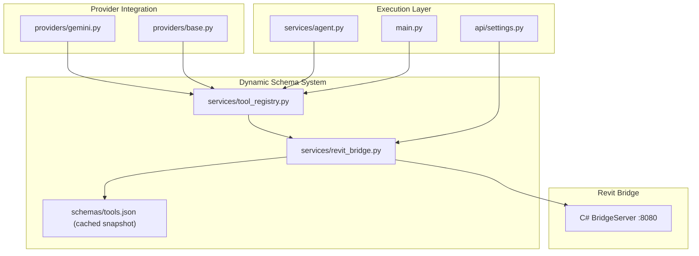
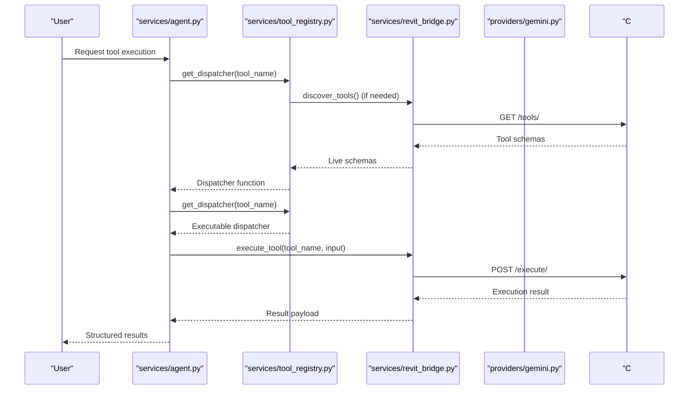
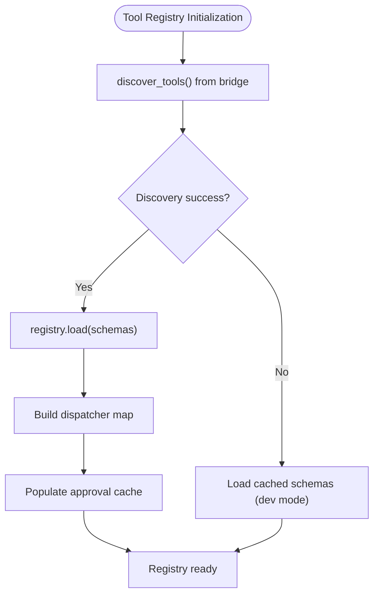
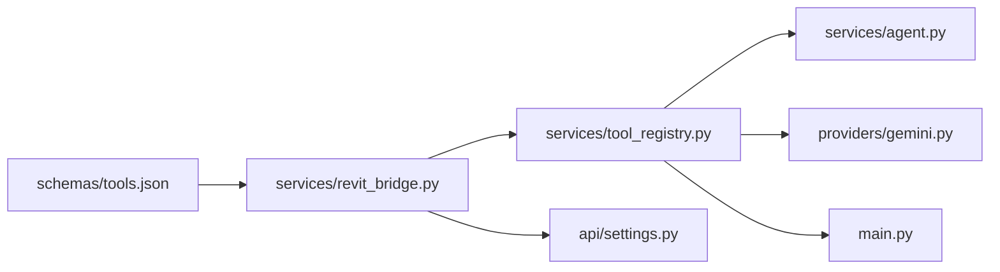

# Payload Schemas

<cite>
**Referenced Files in This Document**
- [tool_registry.py](file://backend/services/tool_registry.py)
- [revit_bridge.py](file://backend/services/revit_bridge.py)
- [main.py](file://backend/main.py)
- [settings.py](file://backend/api/settings.py)
- [tools.json](file://backend/schemas/tools.json)
- [agent.py](file://backend/services/agent.py)
- [gemini.py](file://backend/providers/gemini.py)
- [base.py](file://backend/providers/base.py)
- [README.md](file://README.md)
</cite>

## Update Summary
**Changes Made**
- Replaced static JSON schema system with dynamic tool registry that generates schemas on-the-fly from the C# bridge
- Updated core components section to reflect new dynamic schema discovery and validation approach
- Revised architecture overview to show bridge-based schema generation instead of static file loading
- Updated troubleshooting guide to address new dynamic schema error handling patterns
- Added new section on dynamic schema management and tool registry operations
- Removed references to old static schema files (level_schema.py, grid_schema.py, validators.py)

## Table of Contents
1. [Introduction](#introduction)
2. [Project Structure](#project-structure)
3. [Core Components](#core-components)
4. [Architecture Overview](#architecture-overview)
5. [Detailed Component Analysis](#detailed-component-analysis)
6. [Dynamic Schema Management](#dynamic-schema-management)
7. [Dependency Analysis](#dependency-analysis)
8. [Performance Considerations](#performance-considerations)
9. [Troubleshooting Guide](#troubleshooting-guide)
10. [Conclusion](#conclusion)
11. [Appendices](#appendices)

## Introduction
This document describes the payload schema definitions used by the AI Revit Agent for deterministic BIM operations. The system has evolved from a static JSON schema approach to a dynamic tool registry that generates schemas on-the-fly from the C# bridge. It explains the structure and validation rules for level and grid creation payloads, the translator layer that converts natural language instructions into execution-ready payloads, and the integration with planning and execution layers. It also documents schema evolution considerations, backward compatibility, and error handling patterns, and provides real-world examples from the included sample payload file.

## Project Structure
The payload system now operates through a dynamic tool registry that discovers schemas from the Revit bridge in real-time:
- Tool Registry manages live tool schemas from the bridge
- Bridge Service handles HTTP communication with the C# BridgeServer
- Providers convert tool schemas into function declarations for AI models
- Agent executes tools through the registry dispatcher
- API endpoints manage bridge status and tool refresh

**Diagram sources**
- [tool_registry.py](file://backend/services/tool_registry.py)
- [revit_bridge.py](file://backend/services/revit_bridge.py)
- [tools.json](file://backend/schemas/tools.json)
- [gemini.py](file://backend/providers/gemini.py)
- [base.py](file://backend/providers/base.py)
- [agent.py](file://backend/services/agent.py)
- [main.py](file://backend/main.py)
- [settings.py](file://backend/api/settings.py)

**Section sources**
- [README.md](file://README.md)

## Core Components
The system now uses a dynamic tool registry that generates schemas from the C# bridge rather than relying on static JSON files.

- Dynamic Tool Registry
  - Discovers tools via GET /tools/ from the Revit bridge
  - Maintains live registry of tool schemas with dispatcher map
  - Provides read/write tool classification
  - Supports automatic re-discovery with cooldown protection
  - Caches schemas to disk for offline development

- Bridge Service
  - HTTP client for C# BridgeServer running on :8080
  - Health-check functionality for bridge connectivity
  - Automatic fallback to cached schemas in development mode
  - Persistent HTTP client with keep-alive connections

- Provider Integration
  - Converts raw tool schemas into AI-compatible function declarations
  - Handles both explicit approval requirements and naming convention fallbacks
  - Supports Gemini and other provider adapters

- Agent Execution
  - Uses registry dispatcher for tool execution
  - Implements lazy re-discovery when tools become available
  - Handles execution timeouts and network failures gracefully

**Section sources**
- [tool_registry.py:62-192](file://backend/services/tool_registry.py#L62-L192)
- [revit_bridge.py:91-202](file://backend/services/revit_bridge.py#L91-L202)
- [main.py:82-97](file://backend/main.py#L82-L97)
- [agent.py:295-320](file://backend/services/agent.py#L295-L320)

## Architecture Overview
The payload lifecycle now integrates with the dynamic tool registry that generates schemas from the C# bridge in real-time.

**Diagram sources**
- [agent.py:295-320](file://backend/services/agent.py#L295-L320)
- [tool_registry.py:111-151](file://backend/services/tool_registry.py#L111-L151)
- [revit_bridge.py:91-121](file://backend/services/revit_bridge.py#L91-L121)
- [gemini.py:76-95](file://backend/providers/gemini.py#L76-L95)

## Detailed Component Analysis

### Dynamic Tool Registry
- Purpose: Manage live tool schemas discovered from the Revit bridge
- Key features:
  - Automatic tool discovery via bridge communication
  - Dispatcher map generation for immediate execution
  - Approval requirement caching and classification
  - Read/write tool categorization
  - Development mode fallback to cached schemas

**Diagram sources**
- [tool_registry.py:77-100](file://backend/services/tool_registry.py#L77-L100)
- [revit_bridge.py:122-142](file://backend/services/revit_bridge.py#L122-L142)

**Section sources**
- [tool_registry.py:62-192](file://backend/services/tool_registry.py#L62-L192)
- [revit_bridge.py:91-161](file://backend/services/revit_bridge.py#L91-L161)

### Bridge Service Operations
- Responsibilities:
  - HTTP communication with C# BridgeServer
  - Tool discovery and execution
  - Health monitoring and auto-recovery
  - Development mode fallback mechanisms
  - Persistent HTTP client management

- Key operations:
  - discover_tools(): Retrieves live tool schemas
  - execute_tool(): Executes named tools with input parameters
  - check_bridge_health(): Monitors bridge connectivity
  - _load_cached_schemas(): Loads backup schemas for development

**Section sources**
- [revit_bridge.py:91-202](file://backend/services/revit_bridge.py#L91-L202)

### Provider Schema Conversion
- Converts raw bridge tool schemas into AI-compatible function declarations
- Handles parameter type mapping (ARRAY, OBJECT, STRING, NUMBER, BOOLEAN)
- Combines tool descriptions with agent instructions
- Supports Gemini FunctionDeclaration format

**Section sources**
- [gemini.py:76-95](file://backend/providers/gemini.py#L76-L95)

### Agent Execution Flow
- Uses registry dispatcher for tool execution
- Implements lazy re-discovery when tools become available after bridge startup
- Handles execution timeouts and network failures gracefully
- Provides structured error reporting

**Section sources**
- [agent.py:295-320](file://backend/services/agent.py#L295-L320)

## Dynamic Schema Management
The system now manages schemas dynamically from the C# bridge with comprehensive fallback mechanisms.

### Schema Discovery Process
- Live discovery via GET /tools/ endpoint
- Automatic caching to schemas/tools.json for offline development
- Development mode soft-failure with cached fallback
- Production mode hard-failure on bridge unreachability

### Registry Operations
- Tool classification by naming convention (fetch_* vs write tools)
- Approval requirement caching and dynamic lookup
- Dispatcher map generation for immediate execution
- Cooldown protection for re-discovery attempts

### API Endpoints for Schema Management
- GET /api/revit/status: Bridge health check with auto-recovery
- POST /api/revit/refresh-tools: Manual tool refresh
- Automatic re-discovery when bridge reconnects

**Section sources**
- [revit_bridge.py:91-161](file://backend/services/revit_bridge.py#L91-L161)
- [tool_registry.py:111-151](file://backend/services/tool_registry.py#L111-L151)
- [settings.py:65-104](file://backend/api/settings.py#L65-L104)

## Dependency Analysis
The dynamic schema system introduces new dependencies and relationships:
- Tool Registry depends on Bridge Service for live schema discovery
- Providers depend on Tool Registry for schema conversion
- Agent depends on Tool Registry for dispatcher resolution
- Main application depends on Tool Registry for startup initialization
- API endpoints depend on Bridge Service for status monitoring

**Diagram sources**
- [revit_bridge.py](file://backend/services/revit_bridge.py)
- [tool_registry.py](file://backend/services/tool_registry.py)
- [agent.py](file://backend/services/agent.py)
- [gemini.py](file://backend/providers/gemini.py)
- [main.py](file://backend/main.py)
- [settings.py](file://backend/api/settings.py)
- [tools.json](file://backend/schemas/tools.json)

**Section sources**
- [revit_bridge.py](file://backend/services/revit_bridge.py)
- [tool_registry.py](file://backend/services/tool_registry.py)
- [agent.py](file://backend/services/agent.py)
- [gemini.py](file://backend/providers/gemini.py)
- [main.py](file://backend/main.py)
- [settings.py](file://backend/api/settings.py)
- [tools.json](file://backend/schemas/tools.json)

## Performance Considerations
- Dynamic schema discovery adds initial latency but enables real-time tool availability
- HTTP keep-alive connections reduce connection overhead for frequent tool calls
- Registry caching prevents repeated bridge calls during single application lifetime
- Development mode fallback eliminates startup failures with cached schemas
- Cooldown protection prevents excessive bridge polling during re-discovery attempts

## Troubleshooting Guide
Common issues with the dynamic schema system:

- Bridge connectivity problems:
  - Check /api/revit/status endpoint for health status
  - Verify Revit bridge is running and accessible
  - Use /api/revit/refresh-tools to force re-discovery

- Schema discovery failures:
  - Development mode falls back to cached schemas automatically
  - Production mode requires bridge to be reachable
  - Check bridge logs for registration errors

- Tool execution failures:
  - Verify tool name exists in registry
  - Check tool parameters against schema requirements
  - Monitor registry.is_loaded property for availability

- Registry stale state:
  - Lazy re-discovery attempts when tools become available
  - Manual refresh recommended after bridge restart
  - Check approval requirements for write tools

**Section sources**
- [settings.py:65-104](file://backend/api/settings.py#L65-L104)
- [revit_bridge.py:122-142](file://backend/services/revit_bridge.py#L122-L142)
- [tool_registry.py:111-151](file://backend/services/tool_registry.py#L111-L151)
- [agent.py:295-320](file://backend/services/agent.py#L295-L320)

## Conclusion
The payload schema system has evolved to use a dynamic tool registry that generates schemas on-the-fly from the C# bridge, providing real-time tool availability and eliminating the need for static JSON files. This approach offers better maintainability, automatic tool discovery, and robust fallback mechanisms while maintaining the same execution patterns and validation principles.

## Appendices

### Dynamic Schema Examples
- Real-world tool schemas are now generated dynamically from the C# bridge
- Example schemas include fetch_levels, create_grid, modify_level, and other BIM operations
- Agent instructions embedded directly in tool schemas guide proper usage

**Section sources**
- [tools.json:1-584](file://backend/schemas/tools.json#L1-L584)

### Schema Evolution and Backward Compatibility
- Dynamic schemas eliminate the need for manual schema maintenance
- New tools are automatically discovered and available in the registry
- Backward compatibility maintained through provider schema conversion
- Agent instructions embedded in schemas ensure consistent guidance

**Section sources**
- [gemini.py:76-95](file://backend/providers/gemini.py#L76-L95)
- [tools.json:1-584](file://backend/schemas/tools.json#L1-L584)

### Integration with Planning and Execution Layers
- Dynamic schemas integrate seamlessly with existing planning and execution workflows
- Tool approval requirements handled through registry classification
- Execution dispatch uses registry dispatcher map for immediate tool execution
- Status monitoring through API endpoints ensures reliable operation

**Section sources**
- [agent.py:295-320](file://backend/services/agent.py#L295-L320)
- [settings.py:65-104](file://backend/api/settings.py#L65-L104)
- [tool_registry.py:153-164](file://backend/services/tool_registry.py#L153-L164)