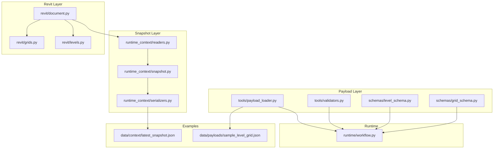
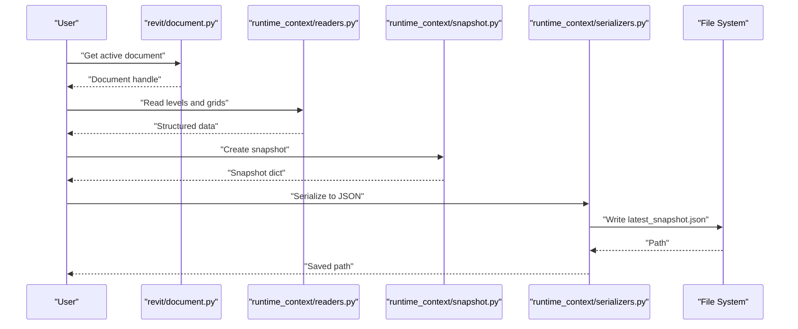
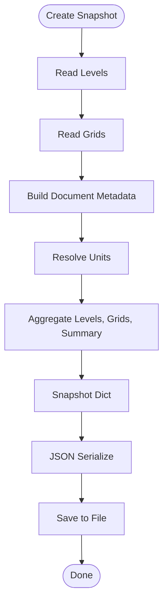
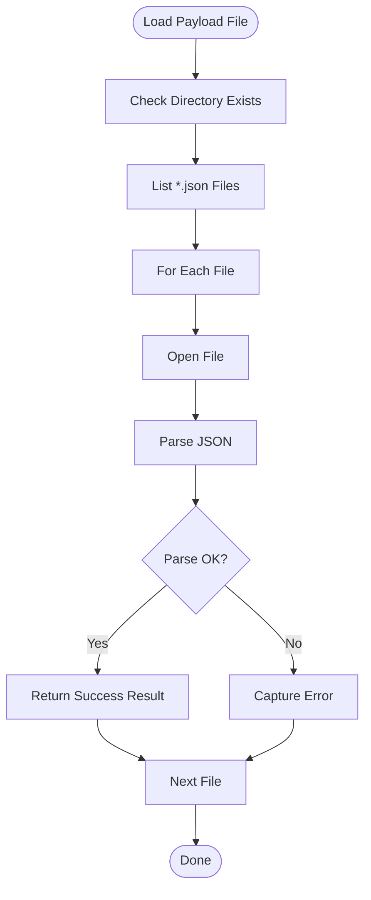
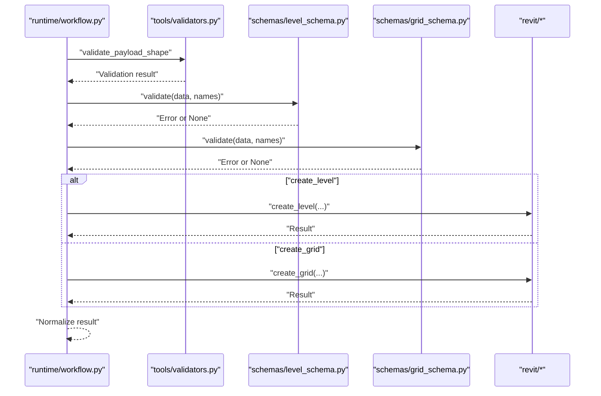
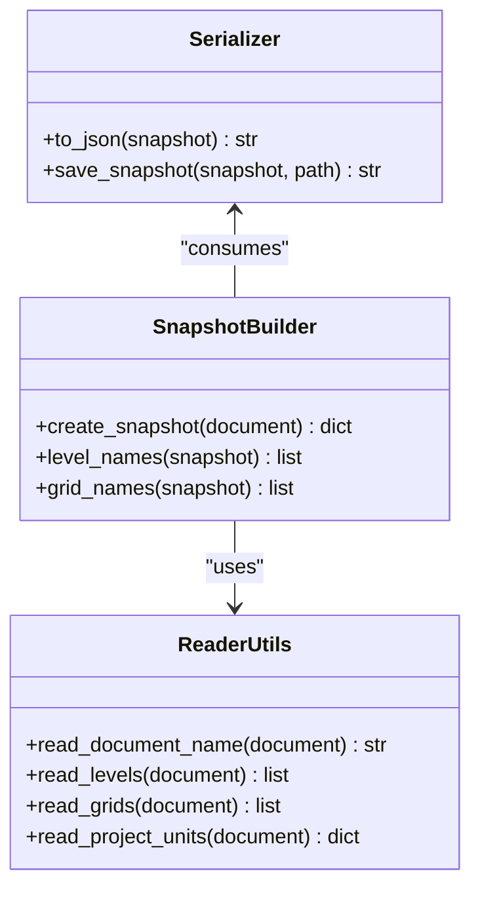
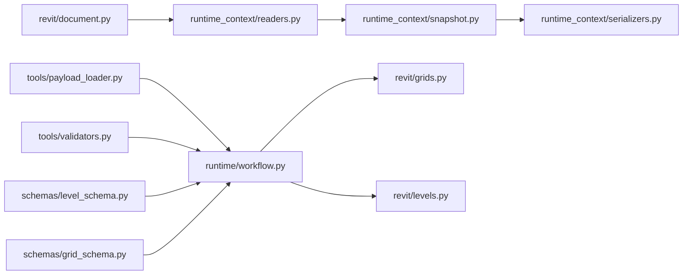

# Serialization System

<cite>
**Referenced Files in This Document**
- [runtime_context/serializers.py](file://runtime_context/serializers.py)
- [runtime_context/snapshot.py](file://runtime_context/snapshot.py)
- [runtime_context/readers.py](file://runtime_context/readers.py)
- [runtime/workflow.py](file://runtime/workflow.py)
- [tools/payload_loader.py](file://tools/payload_loader.py)
- [tools/validators.py](file://tools/validators.py)
- [schemas/level_schema.py](file://schemas/level_schema.py)
- [schemas/grid_schema.py](file://schemas/grid_schema.py)
- [revit/document.py](file://revit/document.py)
- [revit/grids.py](file://revit/grids.py)
- [revit/levels.py](file://revit/levels.py)
- [data/context/latest_snapshot.json](file://data/context/latest_snapshot.json)
- [data/payloads/sample_level_grid.json](file://data/payloads/sample_level_grid.json)
</cite>

## Table of Contents
1. [Introduction](#introduction)
2. [Project Structure](#project-structure)
3. [Core Components](#core-components)
4. [Architecture Overview](#architecture-overview)
5. [Detailed Component Analysis](#detailed-component-analysis)
6. [Dependency Analysis](#dependency-analysis)
7. [Performance Considerations](#performance-considerations)
8. [Troubleshooting Guide](#troubleshooting-guide)
9. [Conclusion](#conclusion)
10. [Appendices](#appendices)

## Introduction
This document explains the data serialization system used by the AI Revit Agent. It covers how context snapshots and execution payloads are serialized and deserialized, the formats and encoding standards used, and the storage mechanisms. It also documents the relationship between serializer utilities and the snapshot creation process, shows examples of serialized structures, and explains how serialization supports persistence, audit trails, and state recovery. Error handling, data integrity checks, and performance optimization strategies are included, along with compatibility considerations across Revit versions.

## Project Structure
The serialization system spans several modules:
- Snapshot creation and serialization utilities
- Payload loading and formatting utilities
- Validation schemas and helpers
- Revit integration points for reading document state and executing actions
- Example data files demonstrating serialized structures

**Diagram sources**
- [runtime_context/readers.py:1-62](file://runtime_context/readers.py#L1-L62)
- [runtime_context/snapshot.py:1-37](file://runtime_context/snapshot.py#L1-L37)
- [runtime_context/serializers.py:1-22](file://runtime_context/serializers.py#L1-L22)
- [tools/payload_loader.py:1-60](file://tools/payload_loader.py#L1-L60)
- [tools/validators.py:1-85](file://tools/validators.py#L1-L85)
- [schemas/level_schema.py:1-22](file://schemas/level_schema.py#L1-L22)
- [schemas/grid_schema.py:1-23](file://schemas/grid_schema.py#L1-L23)
- [revit/document.py:1-13](file://revit/document.py#L1-L13)
- [revit/grids.py:1-43](file://revit/grids.py#L1-L43)
- [revit/levels.py](file://revit/levels.py)
- [runtime/workflow.py:1-235](file://runtime/workflow.py#L1-L235)
- [data/context/latest_snapshot.json:1-20](file://data/context/latest_snapshot.json#L1-L20)
- [data/payloads/sample_level_grid.json:1-18](file://data/payloads/sample_level_grid.json#L1-L18)

**Section sources**
- [runtime_context/serializers.py:1-22](file://runtime_context/serializers.py#L1-L22)
- [runtime_context/snapshot.py:1-37](file://runtime_context/snapshot.py#L1-L37)
- [runtime_context/readers.py:1-62](file://runtime_context/readers.py#L1-L62)
- [tools/payload_loader.py:1-60](file://tools/payload_loader.py#L1-L60)
- [tools/validators.py:1-85](file://tools/validators.py#L1-L85)
- [schemas/level_schema.py:1-22](file://schemas/level_schema.py#L1-L22)
- [schemas/grid_schema.py:1-23](file://schemas/grid_schema.py#L1-L23)
- [revit/document.py:1-13](file://revit/document.py#L1-L13)
- [revit/grids.py:1-43](file://revit/grids.py#L1-L43)
- [revit/levels.py](file://revit/levels.py)
- [runtime/workflow.py:1-235](file://runtime/workflow.py#L1-L235)
- [data/context/latest_snapshot.json:1-20](file://data/context/latest_snapshot.json#L1-L20)
- [data/payloads/sample_level_grid.json:1-18](file://data/payloads/sample_level_grid.json#L1-L18)

## Core Components
- Snapshot serialization utilities: Provide JSON serialization and file persistence for context snapshots.
- Snapshot builder: Creates a compact, serializable representation of the active Revit document’s state.
- Reader utilities: Extract structured data from the Revit document without modifying it.
- Payload loader and formatter: Load JSON payload files and format payloads for display/editing.
- Validation schemas and helpers: Define and enforce payload shapes and data types.
- Workflow orchestrator: Validates and executes payloads, optionally using a context snapshot for name resolution.

Key responsibilities:
- Serialize snapshots to JSON for persistence and auditing.
- Deserialize payloads from JSON for deterministic execution.
- Validate payload envelopes and schema-compliant data.
- Maintain deterministic behavior across Revit versions via schema enforcement.

**Section sources**
- [runtime_context/serializers.py:7-22](file://runtime_context/serializers.py#L7-L22)
- [runtime_context/snapshot.py:10-26](file://runtime_context/snapshot.py#L10-L26)
- [runtime_context/readers.py:10-62](file://runtime_context/readers.py#L10-L62)
- [tools/payload_loader.py:22-60](file://tools/payload_loader.py#L22-L60)
- [tools/validators.py:46-85](file://tools/validators.py#L46-L85)
- [schemas/level_schema.py:10-22](file://schemas/level_schema.py#L10-L22)
- [schemas/grid_schema.py:10-23](file://schemas/grid_schema.py#L10-L23)
- [runtime/workflow.py:40-112](file://runtime/workflow.py#L40-L112)

## Architecture Overview
The serialization system follows a layered approach:
- Data extraction: Readers pull structured data from the Revit document.
- Snapshot composition: The snapshot builder aggregates extracted data into a serializable structure.
- Serialization: Utilities convert the snapshot to JSON and write it to disk.
- Payload lifecycle: Payloads are loaded from JSON, validated against schemas, and executed deterministically.
- Execution: Actions mutate the Revit model within controlled transactions.

**Diagram sources**
- [revit/document.py:10-13](file://revit/document.py#L10-L13)
- [runtime_context/readers.py:15-42](file://runtime_context/readers.py#L15-L42)
- [runtime_context/snapshot.py:10-26](file://runtime_context/snapshot.py#L10-L26)
- [runtime_context/serializers.py:7-22](file://runtime_context/serializers.py#L7-L22)
- [data/context/latest_snapshot.json:1-20](file://data/context/latest_snapshot.json#L1-L20)

## Detailed Component Analysis

### Snapshot Creation and Serialization
- Snapshot builder: Aggregates document metadata, units, levels, grids, and summary counts.
- Reader utilities: Provide compact representations of levels and grids; units are derived with version-safe fallbacks.
- Serializer utilities: Convert snapshot dicts to JSON and persist to disk, ensuring target directories exist.

**Diagram sources**
- [runtime_context/snapshot.py:10-26](file://runtime_context/snapshot.py#L10-L26)
- [runtime_context/readers.py:15-42](file://runtime_context/readers.py#L15-L42)
- [runtime_context/serializers.py:7-22](file://runtime_context/serializers.py#L7-L22)

**Section sources**
- [runtime_context/snapshot.py:10-26](file://runtime_context/snapshot.py#L10-L26)
- [runtime_context/readers.py:15-42](file://runtime_context/readers.py#L15-L42)
- [runtime_context/serializers.py:7-22](file://runtime_context/serializers.py#L7-L22)

### Payload Loading and Formatting
- Payload loader: Lists JSON files in a directory, loads them, and returns structured results with success/error flags.
- Formatter: Converts payload data to human-readable JSON for previews and edits.
- Envelope validation: Ensures each payload has an action and data dictionary.

**Diagram sources**
- [tools/payload_loader.py:11-39](file://tools/payload_loader.py#L11-L39)
- [tools/payload_loader.py:57-60](file://tools/payload_loader.py#L57-L60)
- [tools/validators.py:46-57](file://tools/validators.py#L46-L57)

**Section sources**
- [tools/payload_loader.py:11-39](file://tools/payload_loader.py#L11-L39)
- [tools/payload_loader.py:57-60](file://tools/payload_loader.py#L57-L60)
- [tools/validators.py:46-57](file://tools/validators.py#L46-L57)

### Schema Validation and Execution
- Level and grid schemas define required fields and types for create actions.
- Validators enforce payload envelopes and schema compliance, including duplicate-name detection.
- Workflow orchestrator validates payloads (optionally using context snapshot names), dispatches actions, and normalizes results.

**Diagram sources**
- [runtime/workflow.py:99-112](file://runtime/workflow.py#L99-L112)
- [runtime/workflow.py:114-131](file://runtime/workflow.py#L114-L131)
- [runtime/workflow.py:163-180](file://runtime/workflow.py#L163-L180)
- [tools/validators.py:46-85](file://tools/validators.py#L46-L85)
- [schemas/level_schema.py:19-22](file://schemas/level_schema.py#L19-L22)
- [schemas/grid_schema.py:20-23](file://schemas/grid_schema.py#L20-L23)
- [revit/grids.py:18-38](file://revit/grids.py#L18-L38)
- [revit/levels.py](file://revit/levels.py)

**Section sources**
- [runtime/workflow.py:99-112](file://runtime/workflow.py#L99-L112)
- [runtime/workflow.py:114-131](file://runtime/workflow.py#L114-L131)
- [runtime/workflow.py:163-180](file://runtime/workflow.py#L163-L180)
- [tools/validators.py:46-85](file://tools/validators.py#L46-L85)
- [schemas/level_schema.py:19-22](file://schemas/level_schema.py#L19-L22)
- [schemas/grid_schema.py:20-23](file://schemas/grid_schema.py#L20-L23)
- [revit/grids.py:18-38](file://revit/grids.py#L18-L38)
- [revit/levels.py](file://revit/levels.py)

### Relationship Between Serializers and Snapshot Creation
- The snapshot builder produces a dictionary containing document metadata, units, levels, grids, and counts.
- The serializer converts this dictionary to JSON and writes it to a file path, creating parent directories if needed.
- Example snapshot data is stored under the data context directory for inspection and reuse.

**Diagram sources**
- [runtime_context/snapshot.py:10-37](file://runtime_context/snapshot.py#L10-L37)
- [runtime_context/readers.py:10-62](file://runtime_context/readers.py#L10-L62)
- [runtime_context/serializers.py:7-22](file://runtime_context/serializers.py#L7-L22)

**Section sources**
- [runtime_context/snapshot.py:10-37](file://runtime_context/snapshot.py#L10-L37)
- [runtime_context/readers.py:10-62](file://runtime_context/readers.py#L10-L62)
- [runtime_context/serializers.py:7-22](file://runtime_context/serializers.py#L7-L22)
- [data/context/latest_snapshot.json:1-20](file://data/context/latest_snapshot.json#L1-L20)

### Serialized Data Structures and Examples
- Context snapshot structure: Includes document metadata, units, levels, grids, and summary counts.
- Execution payload structure: An array of objects with action and data fields; examples include create_level and create_grid.

Example references:
- Context snapshot example: [data/context/latest_snapshot.json:1-20](file://data/context/latest_snapshot.json#L1-L20)
- Execution payload example: [data/payloads/sample_level_grid.json:1-18](file://data/payloads/sample_level_grid.json#L1-L18)

**Section sources**
- [data/context/latest_snapshot.json:1-20](file://data/context/latest_snapshot.json#L1-L20)
- [data/payloads/sample_level_grid.json:1-18](file://data/payloads/sample_level_grid.json#L1-L18)

## Dependency Analysis
The serialization system exhibits clear separation of concerns:
- Snapshot layer depends on reader utilities for document state.
- Serializer utilities depend on the snapshot structure.
- Payload layer depends on validators and schemas for correctness.
- Workflow orchestrator depends on payload layer and Revit integration for execution.
- Revit layer encapsulates API calls behind controlled interfaces.

**Diagram sources**
- [runtime_context/readers.py:1-62](file://runtime_context/readers.py#L1-L62)
- [runtime_context/snapshot.py:1-37](file://runtime_context/snapshot.py#L1-L37)
- [runtime_context/serializers.py:1-22](file://runtime_context/serializers.py#L1-L22)
- [tools/payload_loader.py:1-60](file://tools/payload_loader.py#L1-L60)
- [tools/validators.py:1-85](file://tools/validators.py#L1-L85)
- [schemas/level_schema.py:1-22](file://schemas/level_schema.py#L1-L22)
- [schemas/grid_schema.py:1-23](file://schemas/grid_schema.py#L1-L23)
- [runtime/workflow.py:1-235](file://runtime/workflow.py#L1-L235)
- [revit/grids.py:1-43](file://revit/grids.py#L1-L43)
- [revit/levels.py](file://revit/levels.py)
- [revit/document.py:1-13](file://revit/document.py#L1-L13)

**Section sources**
- [runtime_context/readers.py:1-62](file://runtime_context/readers.py#L1-L62)
- [runtime_context/snapshot.py:1-37](file://runtime_context/snapshot.py#L1-L37)
- [runtime_context/serializers.py:1-22](file://runtime_context/serializers.py#L1-L22)
- [tools/payload_loader.py:1-60](file://tools/payload_loader.py#L1-L60)
- [tools/validators.py:1-85](file://tools/validators.py#L1-L85)
- [schemas/level_schema.py:1-22](file://schemas/level_schema.py#L1-L22)
- [schemas/grid_schema.py:1-23](file://schemas/grid_schema.py#L1-L23)
- [runtime/workflow.py:1-235](file://runtime/workflow.py#L1-L235)
- [revit/grids.py:1-43](file://revit/grids.py#L1-L43)
- [revit/levels.py](file://revit/levels.py)
- [revit/document.py:1-13](file://revit/document.py#L1-L13)

## Performance Considerations
- JSON serialization: Uses indentation and sorted keys for readability; consider compact serialization for large snapshots to reduce I/O overhead.
- File I/O: Ensure directory existence once per session to avoid repeated filesystem checks.
- Payload validation: Batch validation short-circuits on first error; maintain ordered payloads to minimize wasted work.
- Schema enforcement: Keep validation logic lightweight and deterministic to avoid blocking execution threads.
- Revit transactions: Group operations within transactions to reduce transaction overhead and improve stability.

[No sources needed since this section provides general guidance]

## Troubleshooting Guide
Common issues and resolutions:
- JSON parsing errors: Payload loader returns structured error results; check file encoding and syntax.
- Validation failures: Envelope and schema validators return descriptive messages; verify action names and required fields.
- Duplicate names: Validators detect duplicates across existing names and newly validated items; adjust names accordingly.
- Snapshot persistence: Serializer creates directories automatically; verify write permissions and path correctness.
- Revit API compatibility: Unit resolution includes fallbacks; if unknown units appear, inspect unit format options across API versions.

**Section sources**
- [tools/payload_loader.py:22-39](file://tools/payload_loader.py#L22-L39)
- [tools/validators.py:46-85](file://tools/validators.py#L46-L85)
- [runtime_context/serializers.py:12-22](file://runtime_context/serializers.py#L12-L22)
- [runtime_context/readers.py:45-62](file://runtime_context/readers.py#L45-L62)

## Conclusion
The AI Revit Agent’s serialization system centers on deterministic, schema-enforced payloads and compact, serializable snapshots. JSON provides a portable, human-readable format suitable for persistence, auditing, and state recovery. The system separates concerns across layers, enabling robust validation, controlled execution, and compatibility across Revit versions through schema enforcement and version-safe unit resolution.

[No sources needed since this section summarizes without analyzing specific files]

## Appendices

### Serialization Formats and Encoding Standards
- Context snapshots: JSON with indented formatting and sorted keys for readability.
- Execution payloads: JSON arrays of action objects with action and data fields.
- Encoding: UTF-8 for file I/O; JSON encoding handled by standard library.

**Section sources**
- [runtime_context/serializers.py:7-9](file://runtime_context/serializers.py#L7-L9)
- [tools/payload_loader.py:57-60](file://tools/payload_loader.py#L57-L60)
- [data/context/latest_snapshot.json:1-20](file://data/context/latest_snapshot.json#L1-L20)
- [data/payloads/sample_level_grid.json:1-18](file://data/payloads/sample_level_grid.json#L1-L18)

### Storage Mechanisms
- Snapshots: Persisted to a dedicated context directory; serializer ensures parent directories exist.
- Payloads: Loaded from a payloads directory; loader filters JSON files and returns structured results.

**Section sources**
- [runtime_context/serializers.py:12-22](file://runtime_context/serializers.py#L12-L22)
- [tools/payload_loader.py:11-19](file://tools/payload_loader.py#L11-L19)

### Data Integrity Checks
- Envelope validation: Ensures each payload has required fields and correct types.
- Schema validation: Enforces required fields and data types for create actions.
- Duplicate detection: Prevents conflicting names across existing and newly validated items.

**Section sources**
- [tools/validators.py:46-85](file://tools/validators.py#L46-L85)
- [schemas/level_schema.py:10-22](file://schemas/level_schema.py#L10-L22)
- [schemas/grid_schema.py:10-23](file://schemas/grid_schema.py#L10-L23)

### Compatibility Considerations
- Unit resolution: Attempts multiple API access patterns with fallbacks to ensure compatibility across Revit versions.
- Action support: Only supported actions are dispatched; unsupported actions return structured errors.

**Section sources**
- [runtime_context/readers.py:45-62](file://runtime_context/readers.py#L45-L62)
- [runtime/workflow.py:99-112](file://runtime/workflow.py#L99-L112)