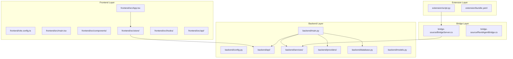
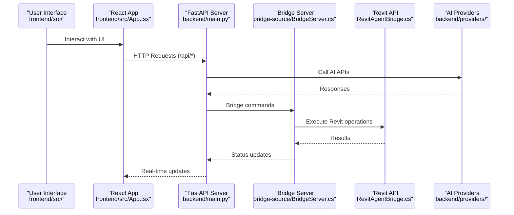

# Development Guidelines

<cite>
**Referenced Files in This Document**
- [README.md](file://README.md)
- [backend/main.py](file://backend/main.py)
- [backend/config.py](file://backend/config.py)
- [backend/api/chat.py](file://backend/api/chat.py)
- [backend/services/agent.py](file://backend/services/agent.py)
- [backend/services/revit_bridge.py](file://backend/services/revit_bridge.py)
- [backend/providers/openai.py](file://backend/providers/openai.py)
- [backend/providers/anthropic.py](file://backend/providers/anthropic.py)
- [backend/providers/gemini.py](file://backend/providers/gemini.py)
- [backend/providers/groq.py](file://backend/providers/groq.py)
- [backend/providers/openrouter.py](file://backend/providers/openrouter.py)
- [backend/providers/openai_compat.py](file://backend/providers/openai_compat.py)
- [backend/providers/base.py](file://backend/providers/base.py)
- [backend/database.py](file://backend/database.py)
- [backend/models.py](file://backend/models.py)
- [backend/migrations.py](file://backend/migrations.py)
- [backend/schemas/tools.json](file://backend/schemas/tools.json)
- [frontend/vite.config.ts](file://frontend/vite.config.ts)
- [frontend/package.json](file://frontend/package.json)
- [frontend/src/api/client.ts](file://frontend/src/api/client.ts)
- [frontend/src/App.tsx](file://frontend/src/App.tsx)
- [frontend/src/main.tsx](file://frontend/src/main.tsx)
- [frontend/src/hooks/useChat.ts](file://frontend/src/hooks/useChat.ts)
- [frontend/src/store/chatStore.ts](file://frontend/src/store/chatStore.ts)
- [frontend/src/store/sessionStore.ts](file://frontend/src/store/sessionStore.ts)
- [frontend/src/store/providerStore.ts](file://frontend/src/store/providerStore.ts)
- [frontend/src/store/uiStore.ts](file://frontend/src/store/uiStore.ts)
- [frontend/src/store/approvalStore.ts](file://frontend/src/store/approvalStore.ts)
- [frontend/src/store/messageStore.ts](file://frontend/src/store/messageStore.ts)
- [frontend/src/types/index.ts](file://frontend/src/types/index.ts)
- [extension/AI_Agent.extension/AI_Agent.tab/Panel.panel/StartBridge.pushbutton/bundle.yaml](file://extension/AI_Agent.extension/AI_Agent.tab/Panel.panel/StartBridge.pushbutton/bundle.yaml)
- [extension/AI_Agent.extension/AI_Agent.tab/Panel.panel/StartBridge.pushbutton/script.py](file://extension/AI_Agent.extension/AI_Agent.tab/Panel.panel/StartBridge.pushbutton/script.py)
</cite>

## Update Summary
**Changes Made**
- Added comprehensive documentation for the new separate backend and frontend architecture
- Documented hot reloading development workflow with Vite and Uvicorn integration
- Added production deployment guidelines using Uvicorn ASGI servers
- Updated project structure to reflect the new layered architecture with clear separation
- Added frontend development guidelines and component organization
- Documented the bridge server integration between frontend and backend

## Table of Contents
1. [Introduction](#introduction)
2. [Project Structure](#project-structure)
3. [Core Components](#core-components)
4. [Architecture Overview](#architecture-overview)
5. [Development Workflow](#development-workflow)
6. [Backend Development](#backend-development)
7. [Frontend Development](#frontend-development)
8. [Production Deployment](#production-deployment)
9. [Bridge Server Integration](#bridge-server-integration)
10. [Detailed Component Analysis](#detailed-component-analysis)
11. [Dependency Analysis](#dependency-analysis)
12. [Performance Considerations](#performance-considerations)
13. [Troubleshooting Guide](#troubleshooting-guide)
14. [Contribution Guidelines](#contribution-guidelines)
15. [Conclusion](#conclusion)

## Introduction
This document defines development guidelines for contributing to the AI Revit Agent project. The project has evolved to a modern full-stack architecture with separate backend and frontend components, featuring hot reloading during development and production deployment through Uvicorn ASGI servers.

The project enforces strict layer separation:
- backend: FastAPI application, API endpoints, business logic, and data management
- frontend: React TypeScript application with Vite-based development server
- bridge-source: C# bridge server for Revit integration
- extension: pyRevit button entrypoint for Revit plugin integration

These boundaries prevent cross-layer dependencies and ensure deterministic, testable, and maintainable BIM automation with modern development practices.

**Section sources**
- [README.md:14-35](file://README.md#L14-L35)

## Project Structure
The repository is now organized into distinct layers with clear separation of concerns. The backend handles all API logic and business operations, while the frontend manages the user interface and user interactions.



**Diagram sources**
- [backend/main.py](file://backend/main.py)
- [backend/config.py](file://backend/config.py)
- [backend/api/chat.py](file://backend/api/chat.py)
- [backend/services/agent.py](file://backend/services/agent.py)
- [frontend/vite.config.ts](file://frontend/vite.config.ts)
- [frontend/src/App.tsx](file://frontend/src/App.tsx)
- [bridge-source/BridgeServer.cs](file://bridge-source/BridgeServer.cs)
- [extension/AI_Agent.extension/AI_Agent.tab/Panel.panel/StartBridge.pushbutton/script.py](file://extension/AI_Agent.extension/AI_Agent.tab/Panel.panel/StartBridge.pushbutton/script.py)

**Section sources**
- [README.md:14-35](file://README.md#L14-L35)

## Core Components
- **Backend Application**: FastAPI main application with automatic hot reloading, configuration management, and API endpoint routing
- **Frontend Application**: React TypeScript application with Vite development server, state management through stores, and component-based architecture
- **Bridge Server**: C# bridge server that facilitates communication between the frontend and Revit through the pyRevit extension
- **Provider Layer**: Modular AI provider implementations (OpenAI, Anthropic, Gemini, Groq, OpenRouter) with unified interface
- **Service Layer**: Business logic services including agent orchestration, streaming responses, and tool registry management
- **Database Layer**: SQLAlchemy ORM models and database migrations for persistent session and chat data
- **Extension Layer**: pyRevit plugin entrypoint that starts the bridge server and integrates with Revit UI

**Section sources**
- [backend/main.py:14-182](file://backend/main.py#L14-L182)
- [frontend/vite.config.ts:1-22](file://frontend/vite.config.ts#L1-22)
- [bridge-source/BridgeServer.cs](file://bridge-source/BridgeServer.cs)
- [extension/AI_Agent.extension/AI_Agent.tab/Panel.panel/StartBridge.pushbutton/script.py](file://extension/AI_Agent.extension/AI_Agent.tab/Panel.panel/StartBridge.pushbutton/script.py)

## Architecture Overview
The modern architecture integrates a FastAPI backend with a React frontend through a bridge server, enabling seamless BIM automation with real-time communication.



**Diagram sources**
- [backend/main.py](file://backend/main.py)
- [frontend/src/App.tsx](file://frontend/src/App.tsx)
- [bridge-source/BridgeServer.cs](file://bridge-source/BridgeServer.cs)
- [backend/providers/openai.py](file://backend/providers/openai.py)
- [backend/services/agent.py](file://backend/services/agent.py)

## Development Workflow
The project uses a dual-development approach with separate backend and frontend servers running concurrently during development.

### Development Environment Setup
1. **Backend Development Server**: Uses Uvicorn with hot reloading enabled
2. **Frontend Development Server**: Uses Vite with React Fast Refresh
3. **Proxy Configuration**: Automatic forwarding of `/api` requests to backend
4. **Hot Reloading**: Both servers automatically reload on code changes

### Development Commands
- **Backend**: `uvicorn backend.main:app --reload --port 8000`
- **Frontend**: `npm run dev` (Vite development server)
- **Full Stack**: Run both servers simultaneously for integrated development

**Section sources**
- [backend/main.py:173-182](file://backend/main.py#L173-L182)
- [frontend/vite.config.ts:11-21](file://frontend/vite.config.ts#L11-L21)
- [backend/config.py:26](file://backend/config.py#L26)

## Backend Development
The backend is built with FastAPI and follows modern Python development practices with comprehensive type hints and dependency injection.

### Key Backend Features
- **Configuration Management**: Environment-based settings with development/production modes
- **API Endpoints**: Modular API structure with chat, providers, sessions, and settings
- **Database Integration**: SQLAlchemy ORM with Alembic migrations
- **Provider Abstraction**: Unified interface for multiple AI providers
- **Streaming Support**: Real-time response streaming for better user experience
- **Error Handling**: Comprehensive error handling with structured responses

### Backend Directory Structure
- **api/**: REST API endpoints and request/response models
- **services/**: Business logic services and orchestration
- **providers/**: AI provider implementations and base classes
- **data/**: Database migration scripts and seed data
- **schemas/**: JSON schemas for tool definitions and validation

**Section sources**
- [backend/main.py:66-163](file://backend/main.py#L66-L163)
- [backend/config.py:75-82](file://backend/config.py#L75-L82)
- [backend/database.py:28](file://backend/database.py#L28)

## Frontend Development
The frontend is a modern React application built with TypeScript and Vite, featuring a component-based architecture and centralized state management.

### Frontend Architecture
- **Component Library**: Reusable UI components with TypeScript interfaces
- **State Management**: Redux-style stores for chat, sessions, providers, and UI state
- **Hooks**: Custom React hooks for API communication and state synchronization
- **Type Safety**: Comprehensive TypeScript definitions for all data structures
- **Real-time Updates**: WebSocket connections for live chat interactions
- **Development Tools**: Hot module replacement and development server with proxy

### Frontend Store Architecture
- **chatStore**: Manages chat messages and conversation state
- **sessionStore**: Handles session creation, retrieval, and management
- **providerStore**: Tracks available AI providers and configurations
- **uiStore**: Controls UI state like loading indicators and modals
- **approvalStore**: Manages tool execution approvals
- **messageStore**: Handles individual message state and formatting

**Section sources**
- [frontend/vite.config.ts:1-22](file://frontend/vite.config.ts#L1-22)
- [frontend/src/store/chatStore.ts](file://frontend/src/store/chatStore.ts)
- [frontend/src/store/sessionStore.ts](file://frontend/src/store/sessionStore.ts)
- [frontend/src/store/providerStore.ts](file://frontend/src/store/providerStore.ts)
- [frontend/src/store/uiStore.ts](file://frontend/src/store/uiStore.ts)
- [frontend/src/store/approvalStore.ts](file://frontend/src/store/approvalStore.ts)
- [frontend/src/store/messageStore.ts](file://frontend/src/store/messageStore.ts)

## Production Deployment
The application can be deployed using Uvicorn ASGI servers for production environments with optimized performance and scalability.

### Production Deployment Options
- **Uvicorn ASGI**: Direct deployment using `uvicorn backend.main:app --workers N --host 0.0.0.0 --port 8000`
- **Gunicorn + Uvicorn**: Production-grade deployment with process management
- **Container Deployment**: Docker containers with proper environment configuration
- **Reverse Proxy**: Nginx or similar for SSL termination and load balancing

### Production Configuration
- **Environment Variables**: Set `DEVELOPMENT_MODE=false` for production
- **Logging**: Configure appropriate log levels for production monitoring
- **Static Files**: Serve frontend build artifacts from backend during production
- **Database**: Use production-ready database configurations

**Section sources**
- [backend/main.py:173-182](file://backend/main.py#L173-L182)
- [backend/config.py](file://backend/config.py)

## Bridge Server Integration
The bridge server acts as a crucial middleware component that enables communication between the frontend React application and the Revit API through the pyRevit extension.

### Bridge Server Architecture
- **C# Implementation**: Robust bridge server written in C# for performance and reliability
- **Communication Protocol**: JSON-based messaging between frontend and bridge
- **Revit Integration**: Direct Revit API access through the bridge server
- **Error Handling**: Comprehensive error handling and status reporting
- **Security**: Controlled access and validation of bridge commands

### Bridge Server Features
- **Command Processing**: Executes Revit operations based on frontend requests
- **Status Monitoring**: Real-time status updates and progress reporting
- **Tool Registration**: Dynamic tool registration and management
- **Connection Management**: Robust connection handling with retry mechanisms
- **Logging**: Detailed logging for debugging and monitoring bridge operations

**Section sources**
- [bridge-source/BridgeServer.cs](file://bridge-source/BridgeServer.cs)
- [bridge-source/RevitAgentBridge.cs](file://bridge-source/RevitAgentBridge.cs)
- [extension/AI_Agent.extension/AI_Agent.tab/Panel.panel/StartBridge.pushbutton/script.py](file://extension/AI_Agent.extension/AI_Agent.tab/Panel.panel/StartBridge.pushbutton/script.py)

## Detailed Component Analysis

### Clean Architecture Boundaries and Layer Separation
The new architecture maintains strict separation between frontend, backend, bridge, and extension layers:

- **Backend Layer**: FastAPI application with no frontend dependencies
- **Frontend Layer**: React application with no backend dependencies  
- **Bridge Layer**: C# server with no frontend/backend dependencies
- **Extension Layer**: pyRevit plugin that only manages bridge lifecycle

Guidelines:
- Do not import frontend components in backend modules
- Do not import backend services in frontend components
- Do not import bridge server code in frontend or backend
- Keep extension code minimal and focused on bridge management

**Section sources**
- [backend/main.py:66-163](file://backend/main.py#L66-L163)
- [frontend/src/App.tsx](file://frontend/src/App.tsx)
- [bridge-source/BridgeServer.cs](file://bridge-source/BridgeServer.cs)
- [extension/AI_Agent.extension/AI_Agent.tab/Panel.panel/StartBridge.pushbutton/script.py](file://extension/AI_Agent.extension/AI_Agent.tab/Panel.panel/StartBridge.pushbutton/script.py)

### Extending the Backend with New API Endpoints
To add new API endpoints to the backend:
1. Create a new endpoint file in `backend/api/` with appropriate FastAPI decorators
2. Define Pydantic models for request/response validation
3. Implement the endpoint logic in the service layer
4. Register the endpoint in the main application router
5. Add comprehensive error handling and logging

### Adding New AI Provider Integrations
To add support for new AI providers:
1. Create a new provider class in `backend/providers/` inheriting from `ProviderBase`
2. Implement required methods: `generate_response`, `stream_response`, and `validate_config`
3. Add provider-specific configuration and authentication handling
4. Register the provider in the provider registry
5. Test integration with the agent service

**Section sources**
- [backend/providers/base.py](file://backend/providers/base.py)
- [backend/providers/openai.py](file://backend/providers/openai.py)
- [backend/providers/anthropic.py](file://backend/providers/anthropic.py)
- [backend/providers/gemini.py](file://backend/providers/gemini.py)
- [backend/providers/groq.py](file://backend/providers/groq.py)
- [backend/providers/openrouter.py](file://backend/providers/openrouter.py)
- [backend/providers/openai_compat.py](file://backend/providers/openai_compat.py)

### Frontend Component Development Guidelines
Frontend development follows React best practices with TypeScript and modern development tools:

- **Component Structure**: Functional components with TypeScript interfaces
- **State Management**: Centralized store management with clear state boundaries
- **API Integration**: Type-safe API clients with proper error handling
- **UI Consistency**: Reusable components with consistent styling and behavior
- **Testing**: Component testing with React Testing Library

**Section sources**
- [frontend/src/components/ChatWindow.tsx](file://frontend/src/components/ChatWindow.tsx)
- [frontend/src/components/MessageBubble.tsx](file://frontend/src/components/MessageBubble.tsx)
- [frontend/src/components/ProviderSelector.tsx](file://frontend/src/components/ProviderSelector.tsx)
- [frontend/src/hooks/useChat.ts](file://frontend/src/hooks/useChat.ts)
- [frontend/src/api/client.ts](file://frontend/src/api/client.ts)

### Database Schema Management
The backend uses SQLAlchemy for database management with Alembic for migrations:

- **Model Definitions**: Clear table schemas with relationships and constraints
- **Migration System**: Automated schema versioning and updates
- **Data Integrity**: Validation and constraint enforcement
- **Performance**: Indexes and query optimization strategies

**Section sources**
- [backend/database.py](file://backend/database.py)
- [backend/models.py](file://backend/models.py)
- [backend/migrations.py](file://backend/migrations.py)

## Dependency Analysis
The new architecture creates clear dependency boundaries between layers with minimal cross-layer coupling.

```mermaid
graph LR
FRONTEND["frontend/"] --> BACKEND["backend/"]
BACKEND --> BRIDGE["bridge-source/"]
BRIDGE --> EXTENSION["extension/"]
FRONTEND --> |HTTP| BACKEND
BACKEND --> |Bridge Commands| BRIDGE
BRIDGE --> |Revit API| REVIT["Revit"]
EXTENSION --> |Start Bridge| BRIDGE
subgraph "Frontend Dependencies"
FRONTEND --> REACT["React"]
FRONTEND --> VITE["Vite"]
FRONTEND --> TYPESCRIPT["TypeScript"]
end
subgraph "Backend Dependencies"
BACKEND --> FASTAPI["FastAPI"]
BACKEND --> UVICORN["Uvicorn"]
BACKEND --> SQLALCHEMY["SQLAlchemy"]
BACKEND --> PYDANTIC["Pydantic"]
end
subgraph "Bridge Dependencies"
BRIDGE --> DOTNET[".NET Framework]
BRIDGE --> REVIT_API["Revit API"]
end
```

**Diagram sources**
- [backend/main.py](file://backend/main.py)
- [frontend/vite.config.ts](file://frontend/vite.config.ts)
- [bridge-source/BridgeServer.cs](file://bridge-source/BridgeServer.cs)
- [extension/AI_Agent.extension/AI_Agent.tab/Panel.panel/StartBridge.pushbutton/script.py](file://extension/AI_Agent.extension/AI_Agent.tab/Panel.panel/StartBridge.pushbutton/script.py)

**Section sources**
- [backend/main.py:66-163](file://backend/main.py#L66-L163)
- [frontend/vite.config.ts:1-22](file://frontend/vite.config.ts#L1-22)

## Performance Considerations
- **Backend Optimization**: Use async/await patterns, connection pooling, and efficient query strategies
- **Frontend Optimization**: Lazy loading, code splitting, and efficient state management
- **Bridge Performance**: Minimize bridge command frequency and optimize data transfer
- **Memory Management**: Proper cleanup of database connections and API resources
- **Caching Strategies**: Implement appropriate caching for static assets and API responses

## Troubleshooting Guide
Common development and deployment issues:

### Development Issues
- **Frontend Not Loading**: Check Vite proxy configuration and backend API connectivity
- **Backend Hot Reload Not Working**: Verify Uvicorn reload settings and file watching
- **Bridge Connection Failures**: Ensure bridge server is running and accessible
- **API Response Errors**: Check backend logs and validate request/response schemas

### Production Issues
- **ASGI Server Startup**: Verify Uvicorn configuration and worker settings
- **Static File Serving**: Ensure frontend build artifacts are properly served
- **Database Connectivity**: Check production database credentials and network access
- **Performance Bottlenecks**: Monitor resource usage and optimize slow queries

**Section sources**
- [backend/main.py:154-161](file://backend/main.py#L154-L161)
- [frontend/vite.config.ts:13-20](file://frontend/vite.config.ts#L13-L20)
- [backend/config.py:75-82](file://backend/config.py#L75-L82)

## Contribution Guidelines
- **Architecture Adherence**: Maintain strict layer separation and avoid cross-layer imports
- **Development Workflow**: Use hot reloading for both backend and frontend during development
- **Code Quality**: Follow TypeScript and Python best practices with comprehensive type hints
- **Testing Strategy**: Write unit tests for backend services and component tests for frontend
- **Documentation**: Update documentation for any architectural changes or new features
- **Deployment**: Test production deployment configurations before merging to main branch

### Development Process
1. **Feature Branch**: Create feature branches for new functionality
2. **Hot Reload Testing**: Test changes using development servers with hot reloading
3. **Cross-Platform Testing**: Verify functionality across different development environments
4. **Integration Testing**: Test bridge server integration and API endpoint functionality
5. **Performance Testing**: Validate performance impact of new features

**Section sources**
- [backend/main.py:173-182](file://backend/main.py#L173-L182)
- [frontend/vite.config.ts:1-22](file://frontend/vite.config.ts#L1-22)
- [bridge-source/BridgeServer.cs](file://bridge-source/BridgeServer.cs)

## Conclusion
The AI Revit Agent project now features a modern, scalable architecture with clear separation between frontend, backend, bridge, and extension layers. The new development workflow with hot reloading, combined with production deployment through Uvicorn ASGI servers, provides developers with efficient tools for building and maintaining BIM automation solutions. By following these guidelines and maintaining the established architectural boundaries, contributors can reliably extend the system while ensuring maintainability and performance across all layers.