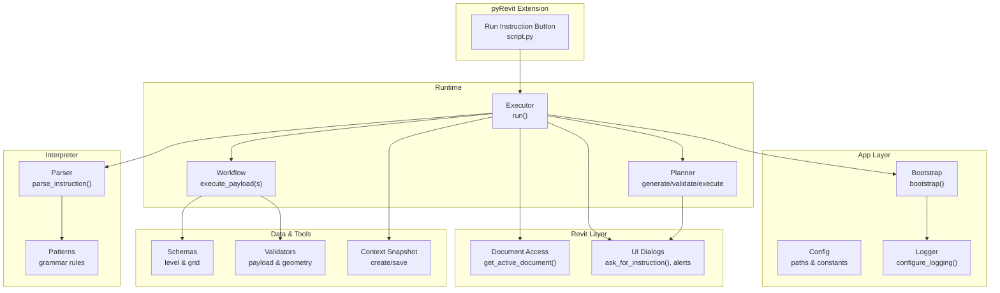
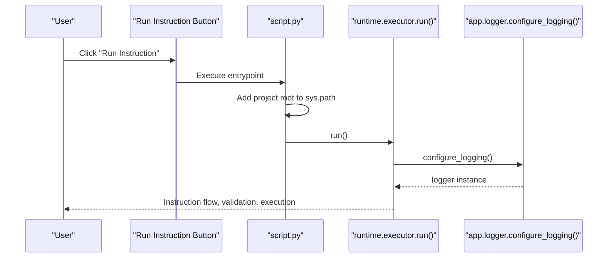
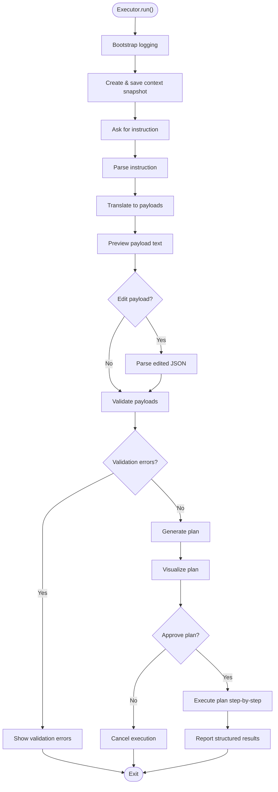
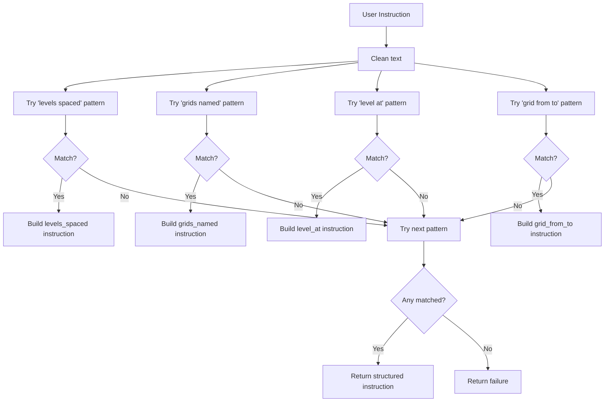
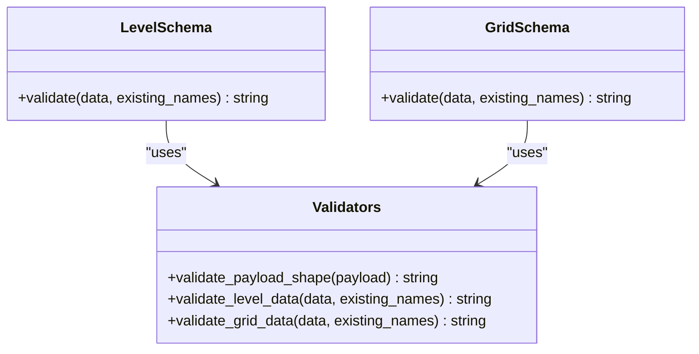
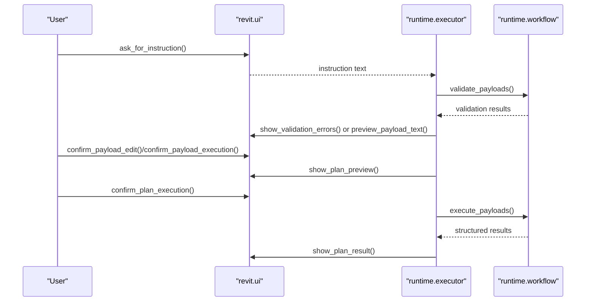
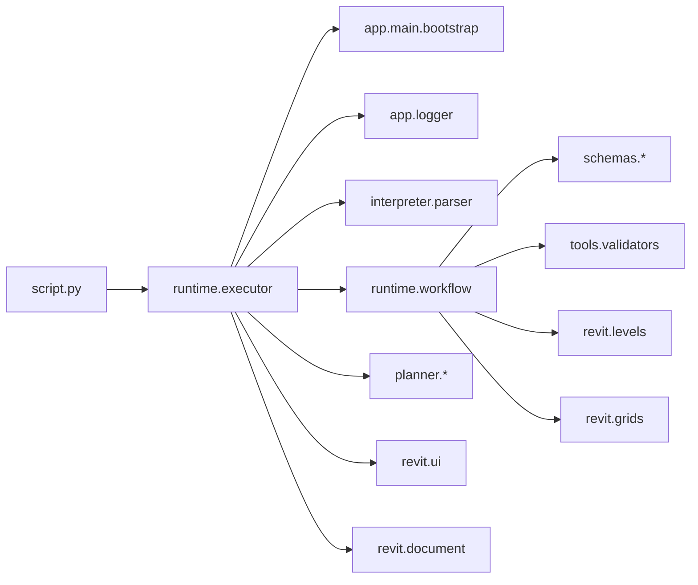

# Getting Started

<cite>
**Referenced Files in This Document**
- [README.md](file://README.md)
- [requirements.txt](file://requirements.txt)
- [script.py](file://extension/AIRevit.extension/AI%20Revit.tab/Execution.panel/Run%20Instruction.pushbutton/script.py)
- [app/main.py](file://app/main.py)
- [app/config.py](file://app/config.py)
- [app/logger.py](file://app/logger.py)
- [runtime/executor.py](file://runtime/executor.py)
- [runtime/workflow.py](file://runtime/workflow.py)
- [interpreter/parser.py](file://interpreter/parser.py)
- [interpreter/patterns.py](file://interpreter/patterns.py)
- [schemas/level_schema.py](file://schemas/level_schema.py)
- [schemas/grid_schema.py](file://schemas/grid_schema.py)
- [tools/validators.py](file://tools/validators.py)
- [revit/document.py](file://revit/document.py)
- [revit/ui.py](file://revit/ui.py)
- [data/context/latest_snapshot.json](file://data/context/latest_snapshot.json)
- [data/payloads/sample_level_grid.json](file://data/payloads/sample_level_grid.json)
</cite>

## Table of Contents
1. [Introduction](#introduction)
2. [Prerequisites](#prerequisites)
3. [Installation and Setup](#installation-and-setup)
4. [First Run Tutorial](#first-run-tutorial)
5. [Project Structure and Workspace Organization](#project-structure-and-workspace-organization)
6. [Architecture Overview](#architecture-overview)
7. [Detailed Component Analysis](#detailed-component-analysis)
8. [Dependency Analysis](#dependency-analysis)
9. [Performance Considerations](#performance-considerations)
10. [Troubleshooting Guide](#troubleshooting-guide)
11. [Verification Checklist](#verification-checklist)
12. [Conclusion](#conclusion)

## Introduction
AI Revit Agent is a minimal deterministic foundation for AI-assisted Revit automation. It integrates with pyRevit to provide a controlled natural-language interface for creating levels and grids in Revit, with structured payload validation, planning, and execution. The system emphasizes clean architecture separation: pyRevit extension entrypoint, application bootstrap, runtime orchestration, interpreter, planner, Revit API interactions, and tools/schemas for deterministic BIM operations.

Key capabilities:
- Controlled natural-language instructions (e.g., create levels spaced at intervals, create grids with coordinates)
- Structured payload generation and validation
- Planning layer for dependency-aware execution
- Human-in-the-loop approval gates
- Deterministic logging and context snapshots

## Prerequisites
Before installing and using AI Revit Agent, ensure you have:
- Basic Revit knowledge: understanding of levels, grids, and document structure
- pyRevit familiarity: ability to register extensions and reload pyRevit
- Python basics: understanding of scripts, modules, and basic file paths
- Revit and pyRevit installed and working on your machine

This project intentionally avoids external Python dependencies, relying solely on pyRevit/Revit runtime APIs.

**Section sources**
- [README.md:1-12](file://README.md#L1-L12)
- [requirements.txt:1-3](file://requirements.txt#L1-L3)

## Installation and Setup
Follow these steps to install and register the AI Revit Agent extension with pyRevit:

1. **Open the project root in your terminal**
   - Navigate to the project directory and open it in VS Code for development convenience.
   - Example command:
     - [Open VS Code:75-84](file://README.md#L75-L84)

2. **Register the extension with pyRevit**
   - Add the extension folder path to pyRevit’s registered paths.
   - Command:
     - [pyrevit extensions paths add:55-63](file://README.md#L55-L63)

3. **Reload pyRevit**
   - After registering or modifying the extension, reload pyRevit to load the new tab and button.
   - Commands:
     - [pyrevit reload:65-73](file://README.md#L65-L73)

4. **Verify installation**
   - Start or restart Revit.
   - Confirm the AI Revit tab appears with the Execution panel and Run Instruction button.
   - Click the button to trigger the runtime flow.

Notes:
- Do not open only the extension folder; open the project root to keep imports, logs, and tests discoverable.
- The extension entrypoint is a minimal script that adds the project root to sys.path and calls the runtime executor.

**Section sources**
- [README.md:55-84](file://README.md#L55-L84)
- [script.py:1-21](file://extension/AIRevit.extension/AI%20Revit.tab/Execution.panel/Run%20Instruction.pushbutton/script.py#L1-L21)

## First Run Tutorial
Complete this guided walkthrough to test the end-to-end flow:

1. **Start Revit and open the AI Revit tab**
   - Ensure the tab and Execution panel are visible after reloading pyRevit.

2. **Click the Run Instruction button**
   - The button entrypoint script sets up imports and calls the runtime executor.
   - The executor bootstraps logging and prepares a context snapshot.

3. **Enter a supported controlled instruction**
   - Examples of supported instructions:
     - [Create 3 levels spaced 4000 mm apart:197-206](file://README.md#L197-L206)
     - [Create grids A, B, and C:197-206](file://README.md#L197-L206)
     - [Create Level 1 at elevation 0:197-206](file://README.md#L197-L206)
     - [Create grid A from 0,0 to 0,10000:197-206](file://README.md#L197-L206)

4. **Review the generated payload preview**
   - The system parses the instruction and translates it into structured payloads.
   - You can optionally edit the payload JSON before validation.

5. **Optionally inspect the current context snapshot**
   - The context snapshot includes document metadata, project units, existing levels/grids, and counts.

6. **Validate and approve execution**
   - The system validates payloads against the context and schema.
   - Approve the plan execution to proceed.

7. **Confirm results**
   - The plan executes step-by-step with dependency validation.
   - View structured results including success status, messages, and created element IDs.

8. **Check logs and snapshots**
   - Runtime logs are written to logs/runtime/ai_revit_agent.log.
   - The latest context snapshot is saved to data/context/latest_snapshot.json.

Verification steps:
- After clicking the button, confirm logs/runtime/ai_revit_agent.log is created.
- Verify that levels or grids are created as requested.
- Inspect the context snapshot file for readable JSON content.

**Section sources**
- [README.md:86-100](file://README.md#L86-L100)
- [README.md:167-196](file://README.md#L167-L196)
- [README.md:197-233](file://README.md#L197-L233)
- [README.md:234-264](file://README.md#L234-L264)
- [script.py:17-21](file://extension/AIRevit.extension/AI%20Revit.tab/Execution.panel/Run%20Instruction.pushbutton/script.py#L17-L21)
- [runtime/executor.py:49-94](file://runtime/executor.py#L49-L94)
- [app/main.py:10-15](file://app/main.py#L10-L15)
- [app/logger.py:13-29](file://app/logger.py#L13-L29)
- [data/context/latest_snapshot.json](file://data/context/latest_snapshot.json)

## Project Structure and Workspace Organization
The repository is organized into layers and functional areas:

- app/: Application bootstrap, configuration, and logging setup
- extension/: pyRevit extension structure with the Run Instruction button entrypoint
- interpreter/: Controlled natural-language parsing and translation to payloads
- planner/: Planning layer for dependency-aware execution
- revit/: Direct Revit/pyRevit API interactions (document access, UI dialogs, transactions)
- runtime/: Orchestration, execution flow, and runtime context management
- runtime_context/: Context snapshot creation, serialization, and readers
- schemas/: Minimal structured schemas for future AI-generated payloads
- tools/: Pure helpers for payload loading, conversion, and validation
- data/: Context snapshots and sample payloads
- logs/: Runtime, debug, and error logs

Workspace layout highlights:
- The pyRevit button entrypoint script resides under extension/AIRevit.extension/AI Revit.tab/Execution.panel/Run Instruction.pushbutton/script.py.
- The app layer manages configuration and logging paths.
- The runtime orchestrates the instruction flow, planning, and execution.

**Section sources**
- [README.md:14-34](file://README.md#L14-L34)
- [app/config.py:10-21](file://app/config.py#L10-L21)

## Architecture Overview
The system follows a layered architecture with clear separation of concerns:

**Diagram sources**
- [script.py:17-21](file://extension/AIRevit.extension/AI%20Revit.tab/Execution.panel/Run%20Instruction.pushbutton/script.py#L17-L21)
- [app/main.py:10-15](file://app/main.py#L10-L15)
- [app/logger.py:13-29](file://app/logger.py#L13-L29)
- [runtime/executor.py:49-94](file://runtime/executor.py#L49-L94)
- [runtime/workflow.py:40-91](file://runtime/workflow.py#L40-L91)
- [interpreter/parser.py:18-30](file://interpreter/parser.py#L18-L30)
- [interpreter/patterns.py:6-28](file://interpreter/patterns.py#L6-L28)
- [revit/document.py:10-13](file://revit/document.py#L10-L13)
- [revit/ui.py:29-168](file://revit/ui.py#L29-L168)
- [schemas/level_schema.py:10-22](file://schemas/level_schema.py#L10-L22)
- [schemas/grid_schema.py:10-23](file://schemas/grid_schema.py#L10-L23)
- [tools/validators.py:46-85](file://tools/validators.py#L46-L85)

## Detailed Component Analysis

### Command-Line Registration and pyRevit Reload
- Register the extension folder with pyRevit:
  - [pyrevit extensions paths add:55-63](file://README.md#L55-L63)
- Reload pyRevit to load the new tab/button:
  - [pyrevit reload:65-73](file://README.md#L65-L73)

Verification:
- After reload, the AI Revit tab should appear in Revit.
- Clicking the Run Instruction button should initiate the runtime flow.

**Section sources**
- [README.md:55-73](file://README.md#L55-L73)

### Button Entrypoint Script
The pyRevit button script is intentionally minimal:
- Adds the project root to sys.path
- Imports and calls the runtime executor

**Diagram sources**
- [script.py:7-21](file://extension/AIRevit.extension/AI%20Revit.tab/Execution.panel/Run%20Instruction.pushbutton/script.py#L7-L21)
- [runtime/executor.py:49-64](file://runtime/executor.py#L49-L64)
- [app/logger.py:13-29](file://app/logger.py#L13-L29)

**Section sources**
- [script.py:1-21](file://extension/AIRevit.extension/AI%20Revit.tab/Execution.panel/Run%20Instruction.pushbutton/script.py#L1-L21)

### Runtime Executor Flow
The executor orchestrates the instruction-to-execution pipeline:
- Bootstraps logging
- Prepares context snapshot
- Parses instruction and translates to payloads
- Validates payloads against schema and context
- Generates and approves a plan
- Executes plan step-by-step and reports results

**Diagram sources**
- [runtime/executor.py:49-225](file://runtime/executor.py#L49-L225)

**Section sources**
- [runtime/executor.py:49-225](file://runtime/executor.py#L49-L225)

### Controlled Natural-Language Parser
The parser enforces a controlled grammar to avoid ambiguity:
- Supported patterns include spaced levels, named grids, and coordinate-based grids
- Ambiguous or unsupported instructions return structured failures

**Diagram sources**
- [interpreter/parser.py:18-30](file://interpreter/parser.py#L18-L30)
- [interpreter/patterns.py:6-28](file://interpreter/patterns.py#L6-L28)

**Section sources**
- [interpreter/parser.py:18-30](file://interpreter/parser.py#L18-L30)
- [interpreter/patterns.py:6-28](file://interpreter/patterns.py#L6-L28)

### Payload Schema and Validation
Payloads follow a strict schema enforced by validators:
- Level schema requires name and elevation
- Grid schema requires name and two 3D points (start/end)
- Validators check presence, types, duplicates, and geometric constraints

**Diagram sources**
- [schemas/level_schema.py:10-22](file://schemas/level_schema.py#L10-L22)
- [schemas/grid_schema.py:10-23](file://schemas/grid_schema.py#L10-L23)
- [tools/validators.py:46-85](file://tools/validators.py#L46-L85)

**Section sources**
- [schemas/level_schema.py:10-22](file://schemas/level_schema.py#L10-L22)
- [schemas/grid_schema.py:10-23](file://schemas/grid_schema.py#L10-L23)
- [tools/validators.py:46-85](file://tools/validators.py#L46-L85)

### UI Interaction and Human-in-the-Loop Gates
The UI layer provides approval gates and previews:
- Instruction entry dialog
- Context snapshot preview
- Payload preview and optional editing
- Plan preview and approval
- Validation error display
- Execution result visualization

**Diagram sources**
- [revit/ui.py:29-168](file://revit/ui.py#L29-L168)
- [runtime/executor.py:67-94](file://runtime/executor.py#L67-L94)
- [runtime/workflow.py:40-91](file://runtime/workflow.py#L40-L91)

**Section sources**
- [revit/ui.py:29-168](file://revit/ui.py#L29-L168)
- [runtime/executor.py:67-94](file://runtime/executor.py#L67-L94)
- [runtime/workflow.py:40-91](file://runtime/workflow.py#L40-L91)

## Dependency Analysis
The system maintains loose coupling between layers:

**Diagram sources**
- [script.py:17-21](file://extension/AIRevit.extension/AI%20Revit.tab/Execution.panel/Run%20Instruction.pushbutton/script.py#L17-L21)
- [runtime/executor.py:15-42](file://runtime/executor.py#L15-L42)
- [app/main.py:10-15](file://app/main.py#L10-L15)
- [app/logger.py:13-29](file://app/logger.py#L13-L29)
- [runtime/workflow.py:10-14](file://runtime/workflow.py#L10-L14)
- [revit/document.py:10-13](file://revit/document.py#L10-L13)

**Section sources**
- [runtime/executor.py:15-42](file://runtime/executor.py#L15-L42)
- [runtime/workflow.py:10-14](file://runtime/workflow.py#L10-L14)

## Performance Considerations
- Keep instructions concise and deterministic to minimize parsing overhead.
- Prefer plan approvals to batch multiple actions efficiently.
- Limit unnecessary context snapshot inspections to reduce I/O.
- Use the sample payloads and context snapshots for quick validation without heavy model queries.

## Troubleshooting Guide
Common setup and runtime issues:

- Extension not visible in Revit
  - Ensure the extension path was added and pyRevit was reloaded.
  - Reopen Revit after reload.
  - Reference: [Register and reload:55-73](file://README.md#L55-L73)

- Button does nothing when clicked
  - Verify the project root is in sys.path via the entrypoint script.
  - Confirm the executor is callable from the button context.
  - Reference: [Entrypoint script:7-21](file://extension/AIRevit.extension/AI%20Revit.tab/Execution.panel/Run%20Instruction.pushbutton/script.py#L7-L21)

- No logs created
  - Check that logging directory exists and is writable.
  - Confirm bootstrap initializes the logger.
  - Reference: [Logging setup:13-29](file://app/logger.py#L13-29), [Bootstrap:10-15](file://app/main.py#L10-15)

- Validation failures
  - Ensure payloads match required schema fields and types.
  - Check for duplicate names and invalid geometry.
  - Reference: [Validators:46-85](file://tools/validators.py#L46-85), [Schemas:10-22](file://schemas/level_schema.py#L10-L22)

- Interpreter failures
  - Use supported instruction patterns exactly as documented.
  - Reference: [Supported instructions:197-206](file://README.md#L197-L206), [Grammar patterns:6-28](file://interpreter/patterns.py#L6-28)

- Context snapshot issues
  - Confirm snapshot file is created and readable.
  - Reference: [Context snapshot path](file://app/config.py#L17), [Snapshot location](file://data/context/latest_snapshot.json)

**Section sources**
- [README.md:55-73](file://README.md#L55-L73)
- [script.py:7-21](file://extension/AIRevit.extension/AI%20Revit.tab/Execution.panel/Run%20Instruction.pushbutton/script.py#L7-L21)
- [app/logger.py:13-29](file://app/logger.py#L13-L29)
- [app/main.py:10-15](file://app/main.py#L10-L15)
- [tools/validators.py:46-85](file://tools/validators.py#L46-L85)
- [schemas/level_schema.py:10-22](file://schemas/level_schema.py#L10-L22)
- [interpreter/patterns.py:6-28](file://interpreter/patterns.py#L6-L28)
- [app/config.py:17](file://app/config.py#L17)
- [data/context/latest_snapshot.json](file://data/context/latest_snapshot.json)

## Verification Checklist
- [ ] Extension registered and pyRevit reloaded
- [ ] AI Revit tab visible in Revit
- [ ] Run Instruction button clickable
- [ ] Logs directory created and log file present after button click
- [ ] Context snapshot saved to data/context/latest_snapshot.json
- [ ] Supported instruction successfully parsed and validated
- [ ] Plan approved and executed with structured results
- [ ] Levels or grids created as requested

**Section sources**
- [README.md:86-100](file://README.md#L86-L100)
- [README.md:167-196](file://README.md#L167-L196)
- [README.md:234-264](file://README.md#L234-L264)
- [app/logger.py:13-29](file://app/logger.py#L13-L29)
- [app/config.py:17](file://app/config.py#L17)

## Conclusion
AI Revit Agent provides a clean, deterministic pathway from controlled natural-language instructions to Revit element creation. By following the installation steps, understanding the runtime flow, and using the verification checklist, you can confidently deploy and operate the agent within your Revit environment. For further customization, extend the interpreter grammar, schemas, or planner while maintaining the established layer boundaries.