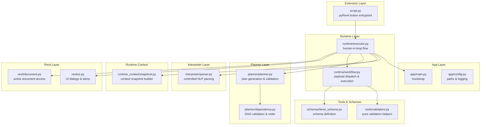
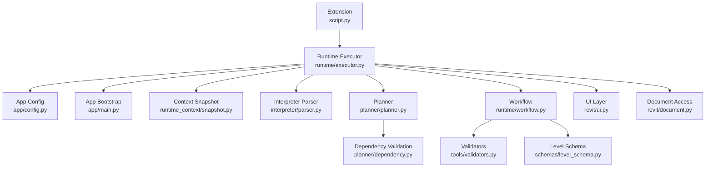
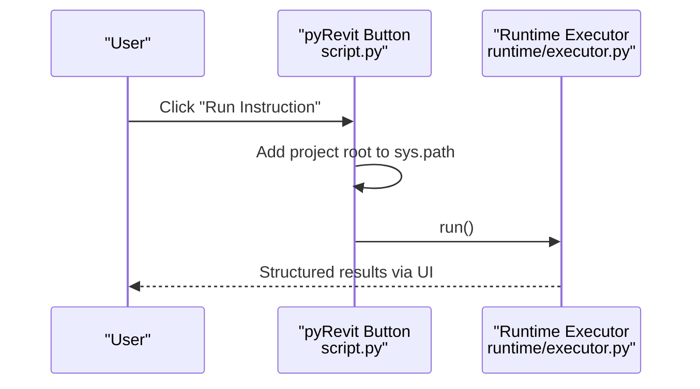
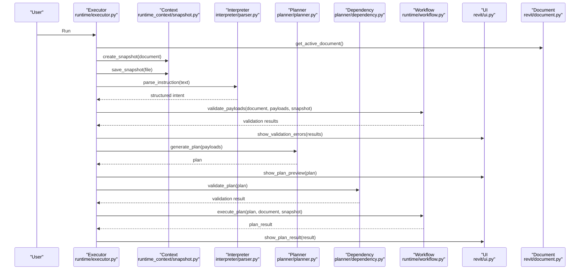
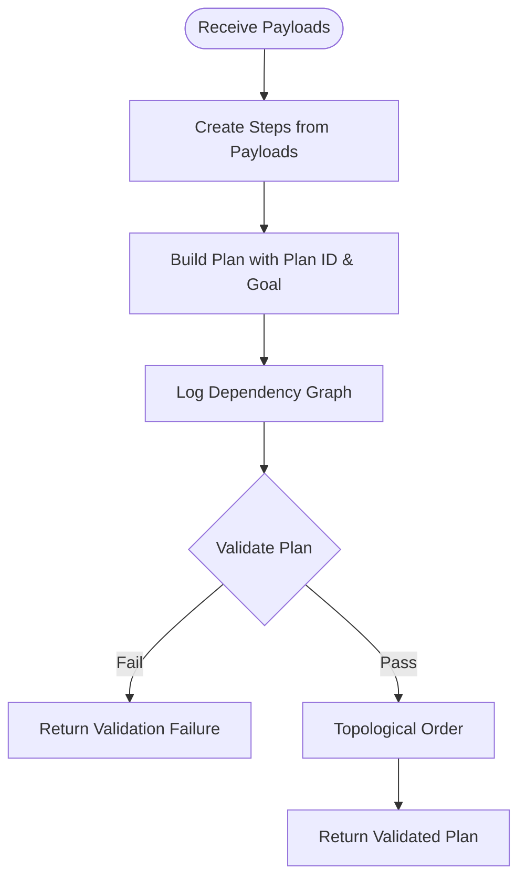
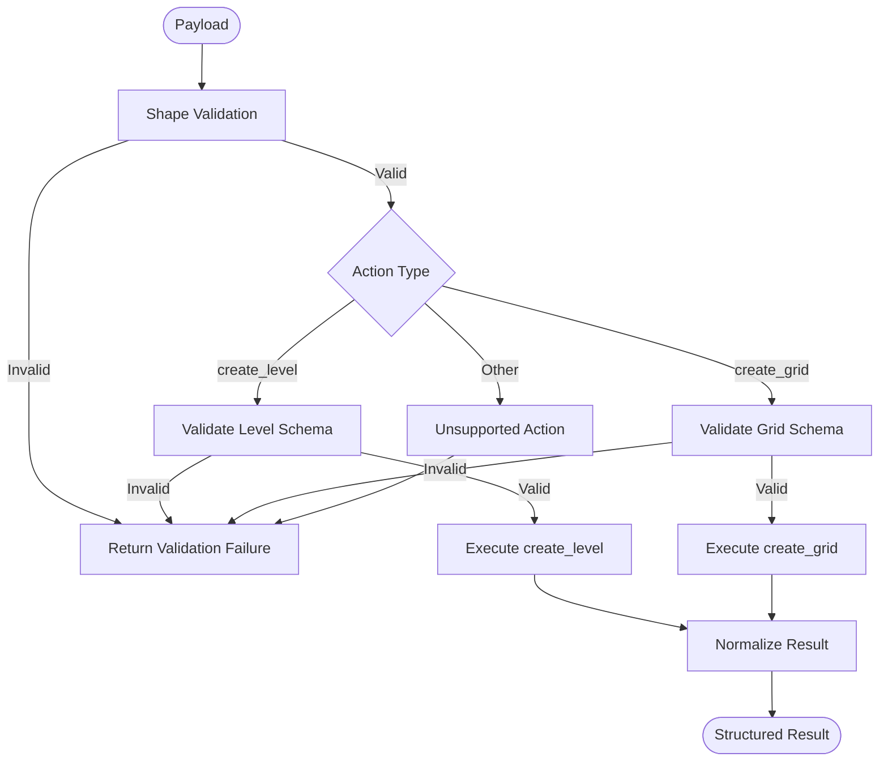
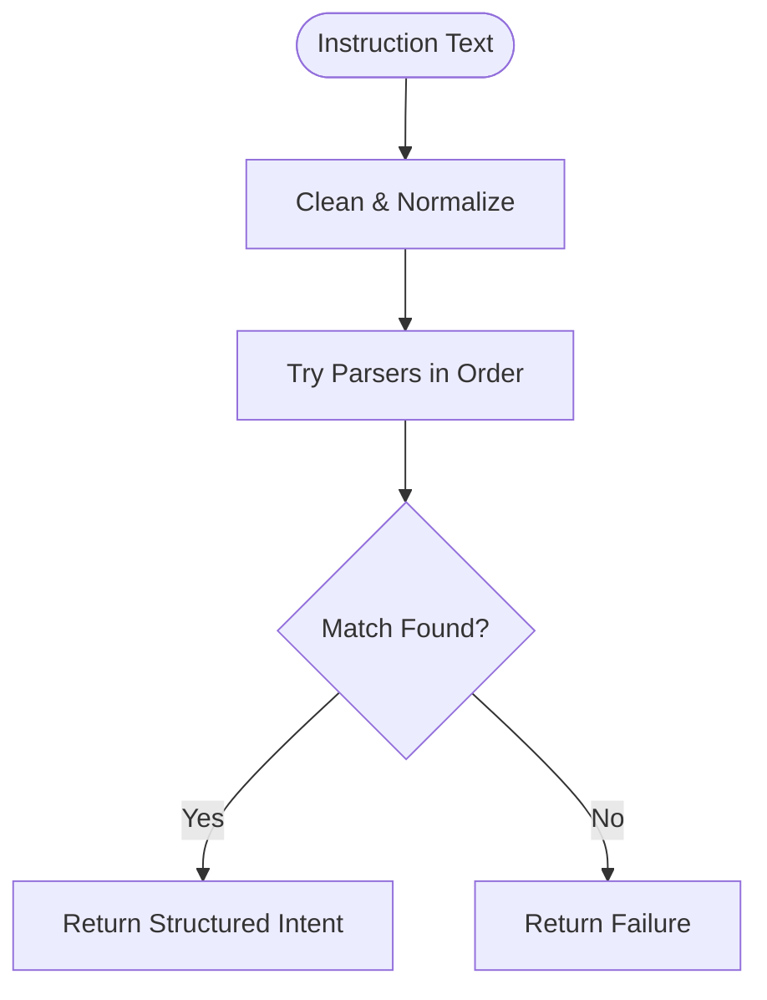
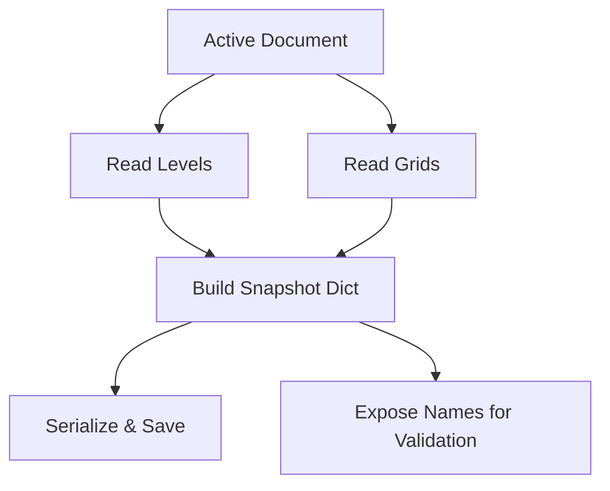
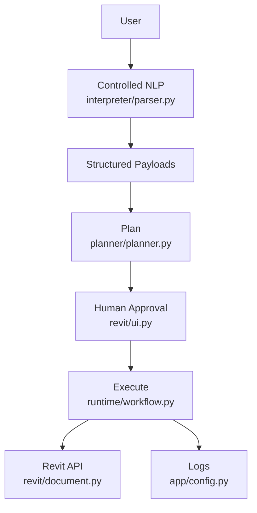
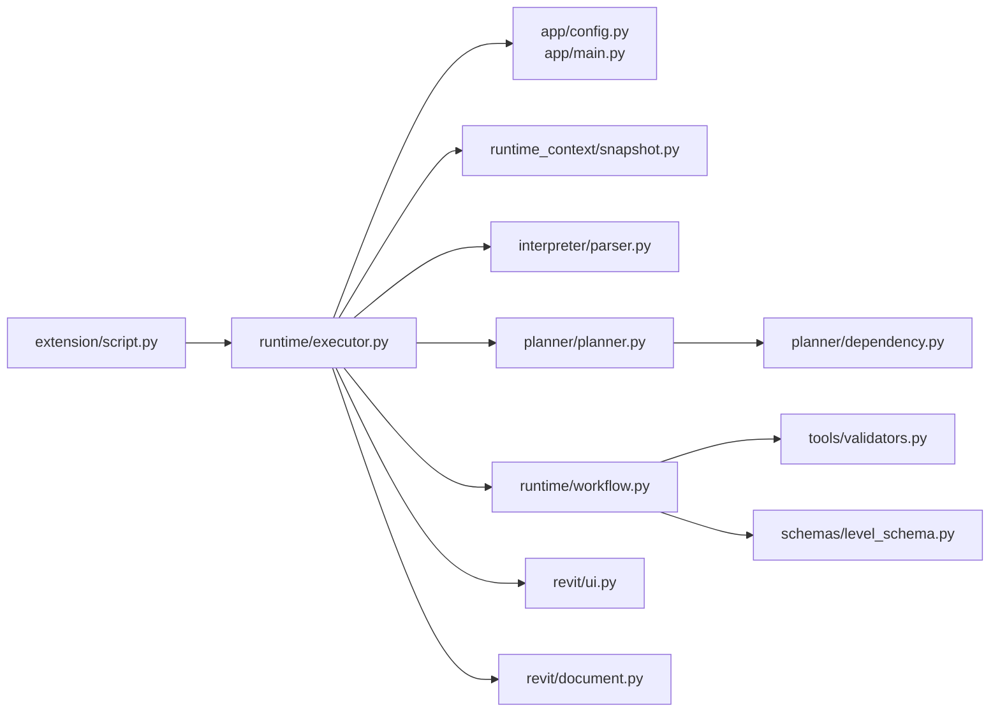

# Project Overview

<cite>
**Referenced Files in This Document**
- [README.md](file://README.md)
- [script.py](file://extension/AIRevit.extension/AI Revit.tab/Execution.panel/Run Instruction.pushbutton/script.py)
- [executor.py](file://runtime/executor.py)
- [workflow.py](file://runtime/workflow.py)
- [planner.py](file://planner/planner.py)
- [dependency.py](file://planner/dependency.py)
- [snapshot.py](file://runtime_context/snapshot.py)
- [document.py](file://revit/document.py)
- [ui.py](file://revit/ui.py)
- [parser.py](file://interpreter/parser.py)
- [validators.py](file://tools/validators.py)
- [level_schema.py](file://schemas/level_schema.py)
- [config.py](file://app/config.py)
</cite>

## Table of Contents
1. [Introduction](#introduction)
2. [Project Structure](#project-structure)
3. [Core Components](#core-components)
4. [Architecture Overview](#architecture-overview)
5. [Detailed Component Analysis](#detailed-component-analysis)
6. [Dependency Analysis](#dependency-analysis)
7. [Performance Considerations](#performance-considerations)
8. [Troubleshooting Guide](#troubleshooting-guide)
9. [Conclusion](#conclusion)

## Introduction
AI Revit Agent is a deterministic BIM automation system designed to be minimal, predictable, and human-in-the-loop. Built with Python and pyRevit, it applies clean architecture principles to separate concerns across layers: the pyRevit extension layer, the interpreter, the runtime orchestration, the planning layer, and the Revit integration layer. The system emphasizes a deterministic payload format, structured validation, and a controlled natural-language interpreter to convert simple, explicit instructions into safe, repeatable BIM operations. It intentionally avoids external AI APIs, broad business automation logic, databases, and asynchronous execution to maintain simplicity and reliability.

Practical scope and capabilities include:
- Controlled natural-language instructions such as “Create 3 levels spaced 4000 mm apart” or “Create grids A, B, and C”
- Structured payload generation and validation before any Revit write operations
- Deterministic execution planning with dependency validation and step-by-step execution
- Runtime context snapshots for reproducible reasoning and duplicate detection
- Human-in-the-loop approval gates at instruction entry, payload editing, plan visualization, and execution

These capabilities are demonstrated through the pyRevit button entrypoint, the runtime executor, and the payload-driven workflow.

**Section sources**
- [README.md:1-13](file://README.md#L1-L13)
- [README.md:36-54](file://README.md#L36-L54)
- [README.md:197-229](file://README.md#L197-L229)

## Project Structure
The repository organizes functionality into clearly defined layers and modules:

- extension/: pyRevit extension entrypoint and UI wiring
- app/: bootstrap, configuration, and logging setup
- interpreter/: controlled natural-language parsing and translation into structured payloads
- runtime/: orchestration, payload validation, and execution sequencing
- planner/: deterministic plan generation, dependency validation, and plan execution
- runtime_context/: read-only context snapshots and serialization
- revit/: direct pyRevit and Revit API interactions (document access, UI dialogs, levels/grids)
- tools/: pure helpers for validation, conversion, and payload loading
- schemas/: minimal structured schemas for future AI-generated payloads
- state/: placeholders for future runtime/session tracking
- data/: context snapshots and sample payloads
- logs/: runtime, debug, and error logs

**Diagram sources**
- [script.py:1-21](file://extension/AIRevit.extension/AI Revit.tab/Execution.panel/Run Instruction.pushbutton/script.py#L1-L21)
- [executor.py:1-43](file://runtime/executor.py#L1-L43)
- [workflow.py:1-15](file://runtime/workflow.py#L1-L15)
- [planner.py:1-14](file://planner/planner.py#L1-L14)
- [dependency.py:1-12](file://planner/dependency.py#L1-L12)
- [parser.py:1-10](file://interpreter/parser.py#L1-L10)
- [snapshot.py:1-8](file://runtime_context/snapshot.py#L1-L8)
- [document.py:1-8](file://revit/document.py#L1-L8)
- [ui.py:1-12](file://revit/ui.py#L1-L12)
- [validators.py:1-6](file://tools/validators.py#L1-L6)
- [level_schema.py:1-8](file://schemas/level_schema.py#L1-L8)
- [config.py:10-21](file://app/config.py#L10-L21)

**Section sources**
- [README.md:14-35](file://README.md#L14-L35)

## Core Components
- pyRevit extension layer: The button entrypoint script adds the project root to sys.path and invokes the runtime executor. It is intentionally minimal and delegates all logic to the runtime layer.
- Interpreter layer: Controlled natural-language parsing produces structured intent. It rejects ambiguous or unsupported instructions to ensure deterministic payloads.
- Planner layer: Converts payloads into a deterministic execution plan, validates dependencies, and enables user approval before execution.
- Runtime layer: Validates payloads, dispatches actions, and executes them deterministically. It separates planning from execution to catch architectural errors early.
- Runtime context: Builds read-only snapshots of the active document for reasoning, duplicate detection, and auditability.
- Revit layer: Provides document access and UI dialogs. All Revit API interactions are isolated here to keep orchestration and planning free of API dependencies.
- Tools and schemas: Pure validation helpers and minimal schemas define the payload contract for future AI-generated data.

**Section sources**
- [README.md:16-32](file://README.md#L16-L32)
- [script.py:1-21](file://extension/AIRevit.extension/AI Revit.tab/Execution.panel/Run Instruction.pushbutton/script.py#L1-L21)
- [executor.py:1-13](file://runtime/executor.py#L1-L13)
- [planner.py:1-14](file://planner/planner.py#L1-L14)
- [workflow.py:1-6](file://runtime/workflow.py#L1-L6)
- [snapshot.py:1-8](file://runtime_context/snapshot.py#L1-L8)
- [document.py:1-8](file://revit/document.py#L1-L8)
- [ui.py:1-9](file://revit/ui.py#L1-L9)
- [validators.py:1-6](file://tools/validators.py#L1-L6)
- [level_schema.py:1-8](file://schemas/level_schema.py#L1-L8)

## Architecture Overview
The system enforces clean architecture boundaries:
- Extension layer depends on runtime executor only
- Runtime executor orchestrates interpreter, planner, runtime workflow, and UI
- Planner is independent from execution to validate plans structurally
- Runtime workflow validates payloads and dispatches actions without importing Revit modules
- Revit layer is isolated and only handles document access and UI dialogs
- Tools and schemas are pure and reusable across layers

**Diagram sources**
- [script.py:17-20](file://extension/AIRevit.extension/AI Revit.tab/Execution.panel/Run Instruction.pushbutton/script.py#L17-L20)
- [executor.py:15-42](file://runtime/executor.py#L15-L42)
- [config.py:10-21](file://app/config.py#L10-L21)
- [main.py:10-14](file://app/main.py#L10-L14)
- [snapshot.py:10-26](file://runtime_context/snapshot.py#L10-L26)
- [parser.py:18-29](file://interpreter/parser.py#L18-L29)
- [planner.py:33-59](file://planner/planner.py#L33-L59)
- [dependency.py:17-48](file://planner/dependency.py#L17-L48)
- [workflow.py:40-91](file://runtime/workflow.py#L40-L91)
- [validators.py:46-56](file://tools/validators.py#L46-L56)
- [level_schema.py:19-21](file://schemas/level_schema.py#L19-L21)
- [ui.py:29-98](file://revit/ui.py#L29-L98)
- [document.py:10-12](file://revit/document.py#L10-L12)

## Detailed Component Analysis

### Extension Layer: pyRevit Button Entrypoint
- Purpose: Minimal wrapper that adds the project root to sys.path and calls the runtime executor.
- Behavior: Ensures imports resolve correctly and hands off control to the runtime layer for all logic.

**Diagram sources**
- [script.py:11-20](file://extension/AIRevit.extension/AI Revit.tab/Execution.panel/Run Instruction.pushbutton/script.py#L11-L20)
- [executor.py:49-64](file://runtime/executor.py#L49-L64)

**Section sources**
- [script.py:1-21](file://extension/AIRevit.extension/AI Revit.tab/Execution.panel/Run Instruction.pushbutton/script.py#L1-L21)

### Runtime Executor: Human-in-the-Loop Flow
- Purpose: Coordinates instruction entry, context snapshotting, payload generation, plan visualization, approval, dependency validation, and step-by-step execution.
- Key responsibilities:
  - Prepare context snapshot and persist it
  - Parse instruction and translate to payloads
  - Allow payload preview and optional editing
  - Validate payloads and show structured errors
  - Generate plan, visualize, and require plan approval
  - Validate plan dependencies and execute plan
  - Report structured results

**Diagram sources**
- [executor.py:67-94](file://runtime/executor.py#L67-L94)
- [executor.py:97-104](file://runtime/executor.py#L97-L104)
- [executor.py:107-130](file://runtime/executor.py#L107-L130)
- [executor.py:133-161](file://runtime/executor.py#L133-L161)
- [executor.py:164-180](file://runtime/executor.py#L164-L180)
- [executor.py:183-207](file://runtime/executor.py#L183-L207)
- [executor.py:210-225](file://runtime/executor.py#L210-L225)
- [snapshot.py:10-26](file://runtime_context/snapshot.py#L10-L26)
- [parser.py:18-29](file://interpreter/parser.py#L18-L29)
- [planner.py:33-59](file://planner/planner.py#L33-L59)
- [dependency.py:17-48](file://planner/dependency.py#L17-L48)
- [workflow.py:40-91](file://runtime/workflow.py#L40-L91)
- [ui.py:119-153](file://revit/ui.py#L119-L153)
- [document.py:10-12](file://revit/document.py#L10-L12)

**Section sources**
- [executor.py:1-13](file://runtime/executor.py#L1-L13)
- [executor.py:49-94](file://runtime/executor.py#L49-L94)
- [executor.py:133-161](file://runtime/executor.py#L133-L161)
- [executor.py:210-225](file://runtime/executor.py#L210-L225)

### Planner: Deterministic Plan Generation and Validation
- Purpose: Convert payloads into a structured execution plan with ordered steps and explicit dependencies. Validate the plan’s dependency graph to catch structural errors before execution.
- Design principles:
  - Planning is separate from execution to enable inspection and approval
  - Deterministic planning ensures reproducible plans
  - Pure dependency validation prevents cycles and missing references

**Diagram sources**
- [planner.py:33-59](file://planner/planner.py#L33-L59)
- [planner.py:62-89](file://planner/planner.py#L62-L89)
- [planner.py:134-140](file://planner/planner.py#L134-L140)
- [dependency.py:17-48](file://planner/dependency.py#L17-L48)
- [dependency.py:51-71](file://planner/dependency.py#L51-L71)

**Section sources**
- [planner.py:1-14](file://planner/planner.py#L1-L14)
- [planner.py:33-89](file://planner/planner.py#L33-L89)
- [dependency.py:1-12](file://planner/dependency.py#L1-L12)
- [dependency.py:17-48](file://planner/dependency.py#L17-L48)

### Runtime Workflow: Payload Dispatch and Execution
- Purpose: Validate payloads, dispatch actions, and execute them deterministically. It defines the payload contract and ensures duplicate detection and schema compliance.
- Supported actions: create_level, create_grid
- Validation pipeline: shape validation, action support, schema validation, duplicate detection

**Diagram sources**
- [workflow.py:84-111](file://runtime/workflow.py#L84-L111)
- [workflow.py:114-130](file://runtime/workflow.py#L114-L130)
- [workflow.py:163-180](file://runtime/workflow.py#L163-L180)
- [validators.py:46-56](file://tools/validators.py#L46-L56)
- [validators.py:59-69](file://tools/validators.py#L59-L69)
- [validators.py:72-84](file://tools/validators.py#L72-L84)

**Section sources**
- [workflow.py:1-6](file://runtime/workflow.py#L1-L6)
- [workflow.py:40-91](file://runtime/workflow.py#L40-L91)
- [validators.py:1-6](file://tools/validators.py#L1-L6)

### Interpreter: Controlled Natural-Language Parsing
- Purpose: Accept only explicit, deterministic instructions. Ambiguity or unsupported constructs cause immediate failure to preserve determinism.
- Supported patterns: spaced levels, named grids, level-at elevation, grid-from-to coordinates.

**Diagram sources**
- [parser.py:18-29](file://interpreter/parser.py#L18-L29)
- [parser.py:32-50](file://interpreter/parser.py#L32-L50)
- [parser.py:69-85](file://interpreter/parser.py#L69-L85)
- [parser.py:88-102](file://interpreter/parser.py#L88-L102)

**Section sources**
- [parser.py:1-10](file://interpreter/parser.py#L1-L10)
- [parser.py:18-29](file://interpreter/parser.py#L18-L29)

### Runtime Context: Read-Only Snapshots
- Purpose: Capture a compact, serializable snapshot of the active document for reasoning, duplicate detection, and auditability.
- Includes: document name, project units, levels, grids, and summary counts.

**Diagram sources**
- [snapshot.py:10-26](file://runtime_context/snapshot.py#L10-L26)
- [snapshot.py:29-36](file://runtime_context/snapshot.py#L29-L36)

**Section sources**
- [snapshot.py:1-8](file://runtime_context/snapshot.py#L1-L8)
- [snapshot.py:10-26](file://runtime_context/snapshot.py#L10-L26)

### Conceptual Overview
At a high level, the system transforms controlled natural-language instructions into deterministic payloads, validates them, plans execution, and executes actions under strict human oversight. The pyRevit extension layer is a thin bridge to the runtime, ensuring that all heavy lifting happens in the core automation engine.

[No sources needed since this diagram shows conceptual workflow, not actual code structure]

## Dependency Analysis
The system maintains clear separation of concerns:
- Extension depends on runtime executor only
- Runtime executor depends on app configuration, logging, context, interpreter, planner, workflow, UI, and document access
- Planner depends on dependency utilities and is independent from execution
- Workflow depends on validators and schemas, and on Revit layer for actual operations
- Revit layer depends on pyRevit and exposes document access and UI dialogs

**Diagram sources**
- [script.py:17-20](file://extension/AIRevit.extension/AI Revit.tab/Execution.panel/Run Instruction.pushbutton/script.py#L17-L20)
- [executor.py:15-42](file://runtime/executor.py#L15-L42)
- [config.py:10-21](file://app/config.py#L10-L21)
- [main.py:10-14](file://app/main.py#L10-L14)
- [snapshot.py:10-26](file://runtime_context/snapshot.py#L10-L26)
- [parser.py:18-29](file://interpreter/parser.py#L18-L29)
- [planner.py:33-59](file://planner/planner.py#L33-L59)
- [dependency.py:17-48](file://planner/dependency.py#L17-L48)
- [workflow.py:40-91](file://runtime/workflow.py#L40-L91)
- [validators.py:46-56](file://tools/validators.py#L46-L56)
- [level_schema.py:19-21](file://schemas/level_schema.py#L19-L21)
- [ui.py:29-98](file://revit/ui.py#L29-L98)
- [document.py:10-12](file://revit/document.py#L10-L12)

**Section sources**
- [README.md:14-35](file://README.md#L14-L35)

## Performance Considerations
- Deterministic planning and dependency validation occur before any Revit API calls, reducing wasted computation and preventing invalid operations.
- Pure validation and schema checks are lightweight and avoid Revit dependencies, keeping the runtime responsive.
- Logging and context snapshots are persisted to files, minimizing in-memory overhead and enabling post-run diagnostics.
- UI dialogs are modal and synchronous, ensuring predictable user interaction flow without concurrency overhead.

[No sources needed since this section provides general guidance]

## Troubleshooting Guide
Common scenarios and guidance:
- Extension registration and reload: Ensure the extension path is registered with pyRevit and reload pyRevit after changes.
- Button click behavior: After registering, start or restart Revit, confirm the tab and panel appear, and click the button to trigger the runtime.
- Instruction entry: Enter supported controlled instructions; ambiguous or unsupported instructions will fail early with structured errors.
- Payload editing: If edited JSON is invalid, the workflow stops before execution and shows validation errors.
- Approval flow: Canceling at any stage (instruction, payload, plan, or execution) prevents Revit element creation.
- Multi-action execution: Sequences of actions are processed with deterministic ordering and per-step results.
- Logging: Check runtime logs for instruction intake, interpretation, validation, approval decisions, and execution outcomes.

**Section sources**
- [README.md:55-74](file://README.md#L55-L74)
- [README.md:86-100](file://README.md#L86-L100)
- [README.md:167-196](file://README.md#L167-L196)
- [README.md:234-264](file://README.md#L234-L264)

## Conclusion
AI Revit Agent demonstrates a clean, layered architecture that prioritizes determinism, safety, and human oversight. The pyRevit extension layer is intentionally minimal, delegating all logic to the runtime executor. The interpreter, planner, and runtime workflow enforce strict validation and deterministic execution, while the Revit layer isolates API interactions. Together, these components deliver a scalable, auditable, and predictable automation foundation suitable for AI-assisted BIM workflows.

[No sources needed since this section summarizes without analyzing specific files]