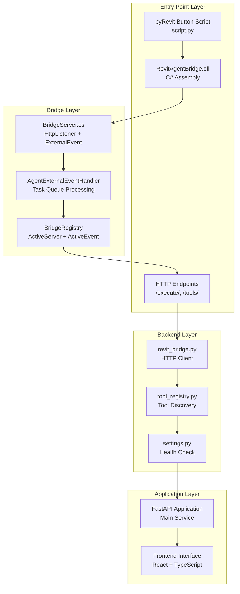
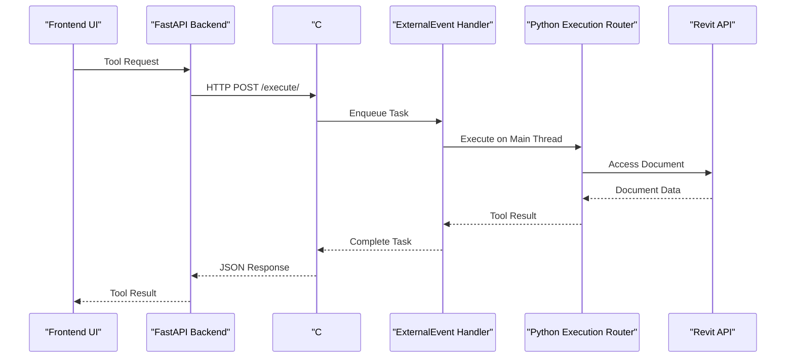
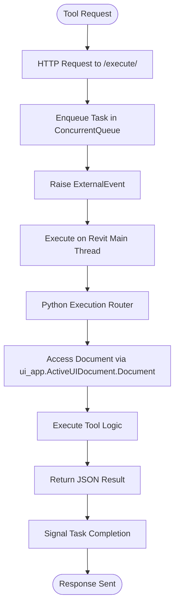
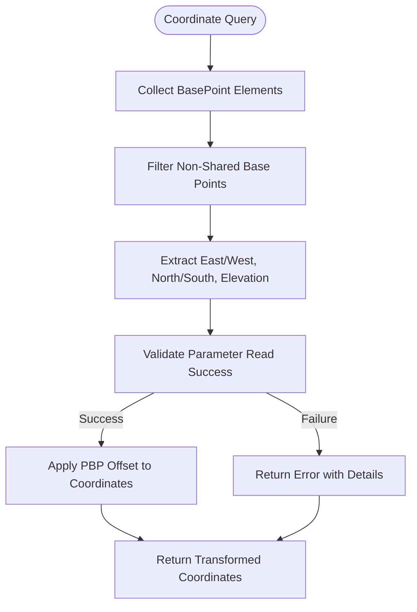
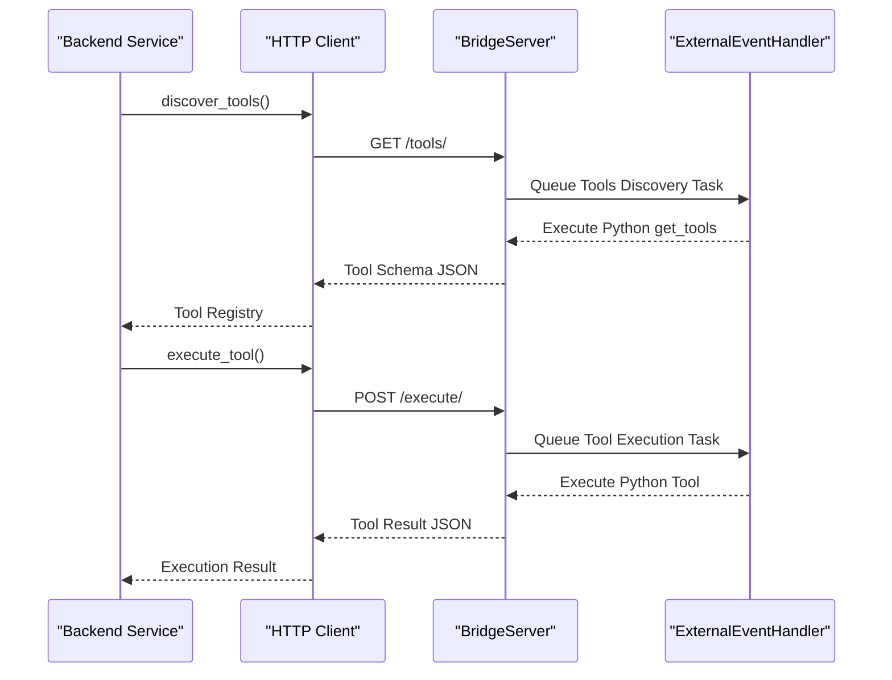
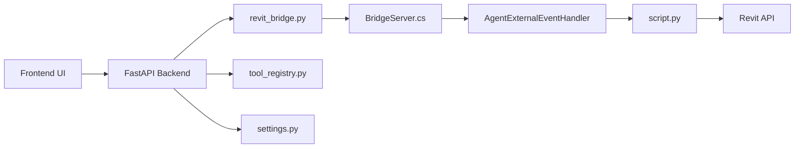

# Document Access

<cite>
**Referenced Files in This Document**
- [script.py](file://extension/AI_Agent.extension/AI_Agent.tab/Panel.panel/StartBridge.pushbutton/script.py)
- [BridgeServer.cs](file://bridge-source/BridgeServer.cs)
- [revit_bridge.py](file://backend/services/revit_bridge.py)
- [tool_registry.py](file://backend/services/tool_registry.py)
- [settings.py](file://backend/api/settings.py)
- [README.md](file://README.md)
</cite>

## Update Summary
**Changes Made**
- Updated architecture overview to reflect the new C# bridge-based document access system
- Added documentation for the new project base point integration system
- Revised the controlled access pattern to show C# bridge as the primary document access mechanism
- Updated error handling documentation to cover bridge communication failures
- Enhanced thread safety considerations for the new ExternalEvent-based architecture

## Table of Contents
1. [Introduction](#introduction)
2. [Project Structure](#project-structure)
3. [Core Components](#core-components)
4. [Architecture Overview](#architecture-overview)
5. [Detailed Component Analysis](#detailed-component-analysis)
6. [Dependency Analysis](#dependency-analysis)
7. [Performance Considerations](#performance-considerations)
8. [Troubleshooting Guide](#troubleshooting-guide)
9. [Conclusion](#conclusion)

## Introduction
This document explains the Revit document access abstraction layer and how it enforces controlled access to the active Revit document through the new C# bridge architecture. The central idea is to prevent runtime orchestration from directly importing pyRevit or low-level Revit API modules. Instead, a C# BridgeServer handles all Revit document access through a controlled ExternalEvent pattern, while the pyRevit script provides the execution router and project base point integration.

The document covers:
- The new C# bridge architecture that replaces direct pyRevit imports
- Project base point integration system for coordinate transformation
- Controlled access pattern through ExternalEvent and HTTP endpoints
- Error handling for bridge communication failures and document availability
- Thread safety considerations for the ExternalEvent-based execution model
- Guidelines for extending document access functionality while maintaining the abstraction boundary

## Project Structure
The repository is organized into three main layers with the new C# bridge architecture:
- extension: pyRevit button entrypoint with C# bridge assembly
- backend: FastAPI service layer with HTTP client for bridge communication
- bridge-source: C# BridgeServer implementation with ExternalEvent handling

**Diagram sources**
- [script.py:18-28](file://extension/AI_Agent.extension/AI_Agent.tab/Panel.panel/StartBridge.pushbutton/script.py#L18-L28)
- [BridgeServer.cs:79-210](file://bridge-source/BridgeServer.cs#L79-L210)
- [revit_bridge.py:1-201](file://backend/services/revit_bridge.py#L1-L201)
- [tool_registry.py:1-32](file://backend/services/tool_registry.py#L1-L32)
- [settings.py:65-104](file://backend/api/settings.py#L65-L104)

**Section sources**
- [README.md:106-170](file://README.md#L106-L170)
- [script.py:18-28](file://extension/AI_Agent.extension/AI_Agent.tab/Panel.panel/StartBridge.pushbutton/script.py#L18-L28)
- [BridgeServer.cs:79-210](file://bridge-source/BridgeServer.cs#L79-L210)

## Core Components
- **C# Bridge Architecture**: The BridgeServer class provides HTTP endpoints (/execute/, /tools/) that handle tool execution requests asynchronously through ExternalEvent mechanisms.
- **ExternalEvent Pattern**: AgentExternalEventHandler processes tasks in Revit's main thread using a concurrent queue, ensuring thread-safe Revit API access.
- **Project Base Point Integration**: The get_base_point_offset() function extracts coordinate offsets from the Project Base Point for proper coordinate transformation.
- **HTTP Client Layer**: The backend revit_bridge.py service communicates with the C# bridge through standardized HTTP endpoints.
- **Tool Registry Management**: The tool_registry.py service manages discovered tools and provides typed accessors for AI providers.

Key responsibilities:
- **BridgeServer.cs**: Implements HttpListener for HTTP communication and ExternalEvent coordination
- **AgentExternalEventHandler**: Manages task queuing and main-thread execution of Python tools
- **script.py**: Provides the execution router and project base point utilities
- **revit_bridge.py**: Handles HTTP communication with the C# bridge and tool discovery
- **tool_registry.py**: Manages tool schemas and provides classification for approval gating

**Section sources**
- [BridgeServer.cs:11-77](file://bridge-source/BridgeServer.cs#L11-L77)
- [BridgeServer.cs:79-210](file://bridge-source/BridgeServer.cs#L79-L210)
- [script.py:40-131](file://extension/AI_Agent.extension/AI_Agent.tab/Panel.panel/StartBridge.pushbutton/script.py#L40-L131)
- [revit_bridge.py:1-201](file://backend/services/revit_bridge.py#L1-L201)
- [tool_registry.py:1-32](file://backend/services/tool_registry.py#L1-L32)

## Architecture Overview
The new architecture enforces a strict separation through the C# bridge:
- **Entry Point**: pyRevit button loads the C# bridge assembly and initializes the BridgeServer
- **Bridge Initialization**: BridgeServer starts HTTP listeners and sets up ExternalEvent handlers
- **Tool Execution**: Frontend sends HTTP requests to /execute/ which are queued and processed on Revit's main thread
- **Project Base Point**: Coordinate transformations are handled through the get_base_point_offset() utility
- **Health Monitoring**: Backend services monitor bridge connectivity and auto-recover on reconnection

**Diagram sources**
- [BridgeServer.cs:149-171](file://bridge-source/BridgeServer.cs#L149-L171)
- [BridgeServer.cs:46-71](file://bridge-source/BridgeServer.cs#L46-L71)
- [script.py:40-56](file://extension/AI_Agent.extension/AI_Agent.tab/Panel.panel/StartBridge.pushbutton/script.py#L40-L56)

## Detailed Component Analysis

### C# Bridge Architecture and ExternalEvent Pattern
The new architecture replaces the previous pyRevit-only approach with a robust C# bridge that handles all Revit document access:

**Diagram sources**
- [BridgeServer.cs:38-71](file://bridge-source/BridgeServer.cs#L38-L71)
- [BridgeServer.cs:149-171](file://bridge-source/BridgeServer.cs#L149-L171)
- [script.py:2246-2255](file://extension/AI_Agent.extension/AI_Agent.tab/Panel.panel/StartBridge.pushbutton/script.py#L2246-L2255)

**Section sources**
- [BridgeServer.cs:31-77](file://bridge-source/BridgeServer.cs#L31-L77)
- [BridgeServer.cs:149-171](file://bridge-source/BridgeServer.cs#L149-L171)
- [script.py:40-56](file://extension/AI_Agent.extension/AI_Agent.tab/Panel.panel/StartBridge.pushbutton/script.py#L40-L56)

### Project Base Point Integration System
The new system includes comprehensive project base point handling for accurate coordinate transformations:

**Diagram sources**
- [script.py:112-131](file://extension/AI_Agent.extension/AI_Agent.tab/Panel.panel/StartBridge.pushbutton/script.py#L112-L131)

**Section sources**
- [script.py:112-131](file://extension/AI_Agent.extension/AI_Agent.tab/Panel.panel/StartBridge.pushbutton/script.py#L112-L131)
- [script.py:309-367](file://extension/AI_Agent.extension/AI_Agent.tab/Panel.panel/StartBridge.pushbutton/script.py#L309-L367)

### HTTP Client Communication Pattern
The backend services communicate with the C# bridge through standardized HTTP endpoints:

**Diagram sources**
- [revit_bridge.py:91-113](file://backend/services/revit_bridge.py#L91-L113)
- [revit_bridge.py:177-193](file://backend/services/revit_bridge.py#L177-L193)
- [BridgeServer.cs:130-171](file://bridge-source/BridgeServer.cs#L130-L171)

**Section sources**
- [revit_bridge.py:91-113](file://backend/services/revit_bridge.py#L91-L113)
- [revit_bridge.py:177-193](file://backend/services/revit_bridge.py#L177-L193)
- [BridgeServer.cs:130-171](file://bridge-source/BridgeServer.cs#L130-L171)

### Error Handling and Thread Safety
The new architecture provides comprehensive error handling and thread safety guarantees:

- **Bridge Communication Failures**: HTTP timeouts (120 seconds) and connection errors are handled gracefully with structured error responses
- **ExternalEvent Thread Safety**: All Revit API access occurs on the main thread through ExternalEvent, preventing threading violations
- **Task Queue Management**: ConcurrentQueue ensures thread-safe task processing with AutoResetEvent signaling
- **Health Monitoring**: Automatic re-discovery when bridge reconnects after downtime
- **Development Mode**: Soft-failure with cached schemas when Revit is unavailable

**Section sources**
- [BridgeServer.cs:162-170](file://bridge-source/BridgeServer.cs#L162-L170)
- [BridgeServer.cs:46-71](file://bridge-source/BridgeServer.cs#L46-L71)
- [revit_bridge.py:95-98](file://backend/services/revit_bridge.py#L95-L98)
- [settings.py:74-82](file://backend/api/settings.py#L74-L82)

### Extending Document Access Functionality
Guidelines for extending the new bridge-based architecture:
- **Add Tools to C# Bridge**: Register new tools in the Python execution router within the closure scope
- **Maintain Thread Safety**: All tool functions execute on Revit's main thread through ExternalEvent
- **Handle Project Base Point**: Use get_base_point_offset() for coordinate transformations when needed
- **HTTP Endpoint Compliance**: Follow the standardized /execute/ and /tools/ endpoint patterns
- **Error Propagation**: Return structured JSON responses with status and message fields
- **Schema Discovery**: Tools are automatically discoverable via GET /tools/ endpoint

**Section sources**
- [script.py:92-107](file://extension/AI_Agent.extension/AI_Agent.tab/Panel.panel/StartBridge.pushbutton/script.py#L92-L107)
- [BridgeServer.cs:130-148](file://bridge-source/BridgeServer.cs#L130-L148)
- [script.py:112-131](file://extension/AI_Agent.extension/AI_Agent.tab/Panel.panel/StartBridge.pushbutton/script.py#L112-L131)

## Dependency Analysis
The new architecture creates clear dependency boundaries:

**Diagram sources**
- [README.md:106-170](file://README.md#L106-L170)
- [revit_bridge.py:1-201](file://backend/services/revit_bridge.py#L1-L201)
- [BridgeServer.cs:79-210](file://bridge-source/BridgeServer.cs#L79-L210)
- [script.py:1-28](file://extension/AI_Agent.extension/AI_Agent.tab/Panel.panel/StartBridge.pushbutton/script.py#L1-L28)

**Section sources**
- [README.md:106-170](file://README.md#L106-L170)
- [revit_bridge.py:1-201](file://backend/services/revit_bridge.py#L1-L201)
- [BridgeServer.cs:79-210](file://bridge-source/BridgeServer.cs#L79-L210)
- [script.py:1-28](file://extension/AI_Agent.extension/AI_Agent.tab/Panel.panel/StartBridge.pushbutton/script.py#L1-L28)

## Performance Considerations
- **ExternalEvent Overhead**: Each tool execution requires ExternalEvent queuing and main-thread processing
- **HTTP Communication**: Network latency between backend and bridge (typically localhost)
- **Task Queue Batching**: Multiple tasks can be queued efficiently through ConcurrentQueue
- **Schema Caching**: Tool schemas are cached locally to avoid repeated discovery
- **Timeout Management**: 120-second timeout for bridge operations prevents hanging requests
- **Memory Management**: IronPython closure pattern prevents garbage collection issues

## Troubleshooting Guide
Common issues and resolutions in the new architecture:
- **Bridge Not Responding**: Check if RevitAgentBridge.dll is properly loaded and BridgeServer started
- **ExternalEvent Failures**: Verify that BridgeRegistry.ActiveEvent is properly initialized
- **HTTP Timeouts**: Monitor bridge health via /api/revit/status endpoint
- **Tool Discovery Issues**: Use /api/revit/refresh-tools to force re-discovery
- **Coordinate Transformation Errors**: Validate Project Base Point existence and parameters
- **Thread Safety Violations**: Ensure all Revit API calls happen within ExternalEvent context
- **Memory Leaks**: IronPython closure pattern prevents module-level GC issues

**Section sources**
- [BridgeServer.cs:58-60](file://bridge-source/BridgeServer.cs#L58-L60)
- [settings.py:65-84](file://backend/api/settings.py#L65-L84)
- [script.py:18-28](file://extension/AI_Agent.extension/AI_Agent.tab/Panel.panel/StartBridge.pushbutton/script.py#L18-L28)

## Conclusion
The new C# bridge architecture provides a robust, thread-safe foundation for Revit document access while maintaining the controlled access pattern. By centralizing all Revit API interactions through the BridgeServer and ExternalEvent pattern, the system ensures thread safety, provides comprehensive error handling, and enables automatic recovery from bridge disconnections. The project base point integration system adds accurate coordinate transformation capabilities, while the HTTP-based tool discovery and execution pattern maintains clean separation between frontend, backend, and Revit layers. This architecture supports future extensions while preserving the abstraction boundary that separates orchestration from document access.