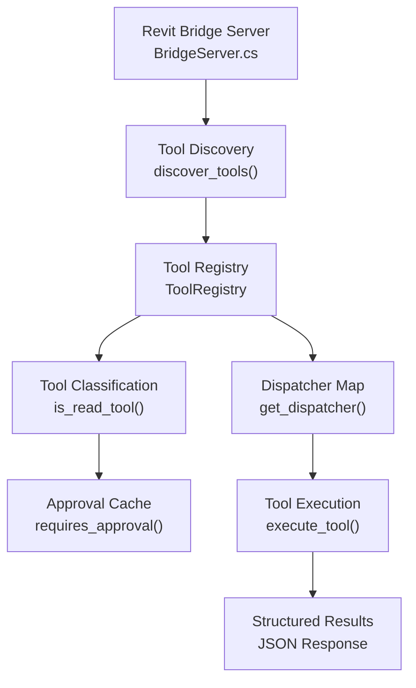
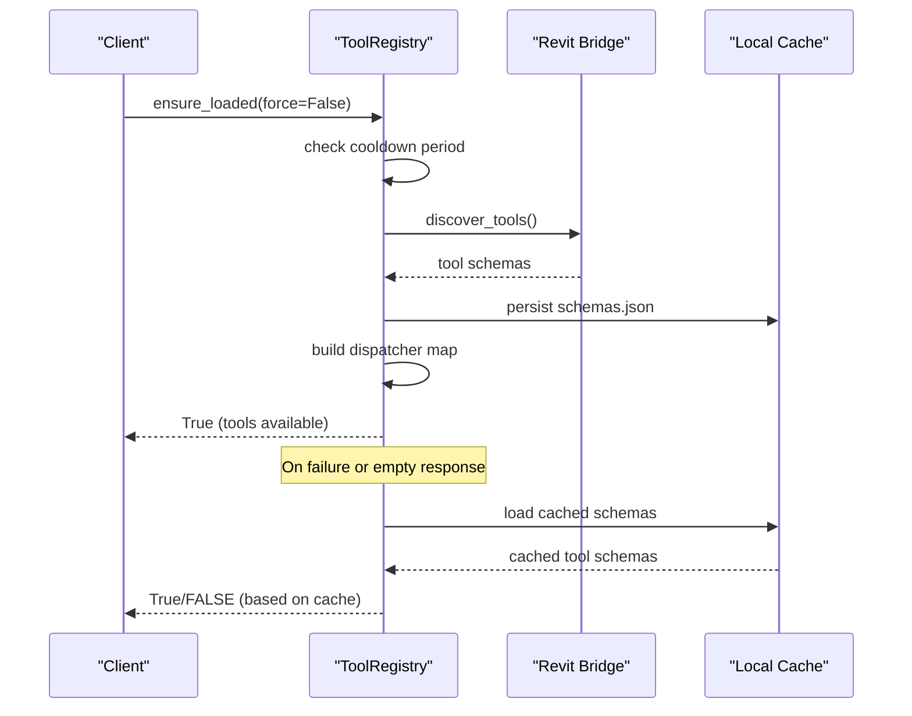
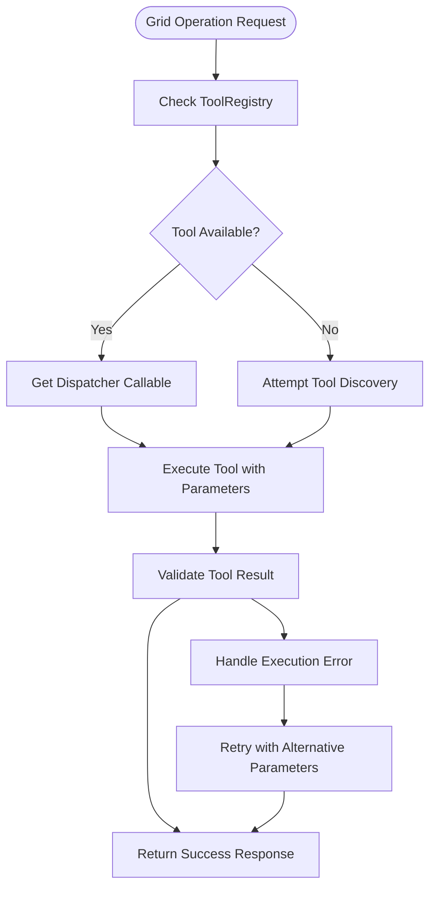

# Grid Operations

<cite>
**Referenced Files in This Document**
- [tool_registry.py](file://backend/services/tool_registry.py)
- [revit_bridge.py](file://backend/services/revit_bridge.py)
- [tools.json](file://backend/schemas/tools.json)
- [script.py](file://extension/AI_Agent.extension/AI_Agent.tab/Panel.panel/StartBridge.pushbutton/script.py)
- [BridgeServer.cs](file://bridge-source/BridgeServer.cs)
</cite>

## Update Summary
**Changes Made**
- Updated architecture overview to reflect new dynamic tool discovery system
- Added documentation for ToolRegistry service and dynamic tool classification
- Updated grid operations to use new bridge-based tool system
- Enhanced coordinate system handling with complex geometric calculations
- Expanded grid creation capabilities to support curved grids and advanced geometry
- Updated naming strategies with dynamic context awareness

## Table of Contents
1. [Introduction](#introduction)
2. [Dynamic Tool Discovery System](#dynamic-tool-discovery-system)
3. [Bridge-Based Grid Operations](#bridge-based-grid-operations)
4. [Advanced Grid Geometry Management](#advanced-grid-geometry-management)
5. [Coordinate System and Complex Calculations](#coordinate-system-and-complex-calculations)
6. [Enhanced Naming and Conflict Resolution](#enhanced-naming-and-conflict-resolution)
7. [Integration with Tool Registry](#integration-with-tool-registry)
8. [Performance Optimization](#performance-optimization)
9. [Error Handling and Validation](#error-handling-and-validation)
10. [Future Extensions](#future-extensions)
11. [Migration from Static Grid Operations](#migration-from-static-grid-operations)
12. [Conclusion](#conclusion)

## Introduction
This document explains the new dynamic grid management system that replaces the old static grid operations with a sophisticated tool discovery and execution framework. The system now leverages a bridge-based architecture that dynamically discovers available Revit tools, manages tool schemas, and executes complex grid operations including curved grids, advanced geometric calculations, and intelligent coordinate system handling.

The new system provides enhanced grid creation capabilities with support for both linear and curved grid geometries, dynamic tool discovery from the Revit bridge, and comprehensive validation of grid parameters including spacing calculations and coordinate transformations.

## Dynamic Tool Discovery System
The new grid management system is built around a dynamic tool discovery mechanism that automatically detects available Revit tools and manages their execution lifecycle.

**Diagram sources**
- [BridgeServer.cs](file://bridge-source/BridgeServer.cs)
- [revit_bridge.py:91-142](file://backend/services/revit_bridge.py#L91-L142)
- [tool_registry.py:62-164](file://backend/services/tool_registry.py#L62-L164)

**Section sources**
- [tool_registry.py:62-164](file://backend/services/tool_registry.py#L62-L164)
- [revit_bridge.py:91-142](file://backend/services/revit_bridge.py#L91-L142)

### Tool Registry Architecture
The ToolRegistry service maintains a live catalog of available tools with classification and caching mechanisms:

- **Schema Caching**: Tools schemas are cached locally to avoid repeated bridge queries
- **Classification System**: Tools are classified as read-only (fetch_*) or write operations
- **Approval Management**: Tracks tools requiring user approval for execution
- **Dispatcher Mapping**: Provides async callable accessors for each tool

**Section sources**
- [tool_registry.py:77-100](file://backend/services/tool_registry.py#L77-L100)
- [tool_registry.py:35-56](file://backend/services/tool_registry.py#L35-L56)

### Dynamic Tool Discovery Process
The system implements a robust discovery mechanism with retry logic and fallback strategies:

**Diagram sources**
- [tool_registry.py:111-152](file://backend/services/tool_registry.py#L111-L152)
- [revit_bridge.py:122-142](file://backend/services/revit_bridge.py#L122-L142)

**Section sources**
- [tool_registry.py:111-152](file://backend/services/tool_registry.py#L111-L152)
- [revit_bridge.py:91-142](file://backend/services/revit_bridge.py#L91-L142)

## Bridge-Based Grid Operations
The new system integrates seamlessly with the Revit bridge to provide dynamic grid operations with enhanced capabilities.

### Grid Tool Schema Definition
The grid tools are defined in the tools.json schema with comprehensive parameter specifications:

- **fetch_grids**: Retrieves existing grid information with geometric details
- **create_grid**: Creates new gridlines with support for linear and curved geometry
- **modify_grid**: Updates existing grid properties and geometry
- **delete_grid**: Removes gridlines from the model

**Section sources**
- [tools.json:27-41](file://backend/schemas/tools.json#L27-L41)
- [tools.json:215-222](file://backend/schemas/tools.json#L215-L222)

### Advanced Grid Creation Capabilities
The new grid creation system supports sophisticated geometric operations:

#### Linear Grid Creation
Supports traditional straight gridlines with precise coordinate specification and validation.

#### Curved Grid Creation
Advanced arc-based grid creation with multiple parameterization methods:
- **Three-point arc**: Uses start, end, and arc point coordinates
- **Center-point arc**: Defines arc by center, radius, and angle parameters
- **Curvature-aware placement**: Automatically calculates tangent directions and offsets

**Section sources**
- [script.py:1224-1237](file://extension/AI_Agent.extension/AI_Agent.tab/Panel.panel/StartBridge.pushbutton/script.py#L1224-L1237)
- [script.py:1232-1284](file://extension/AI_Agent.extension/AI_Agent.tab/Panel.panel/StartBridge.pushbutton/script.py#L1232-L1284)

### Grid Fetch Operations
The fetch_grids tool provides comprehensive grid information including:

- **Geometric Properties**: Start/end coordinates, arc parameters, curvature data
- **View-Specific Settings**: Bubble visibility, offsets, extent types
- **Scope Box Information**: Volume of interest parameters
- **Datum Properties**: Extent types, pin status, type modifications

**Section sources**
- [script.py:624-780](file://extension/AI_Agent.extension/AI_Agent.tab/Panel.panel/StartBridge.pushbutton/script.py#L624-L780)
- [script.py:670-695](file://extension/AI_Agent.extension/AI_Agent.tab/Panel.panel/StartBridge.pushbutton/script.py#L670-L695)

## Advanced Grid Geometry Management
The new system implements sophisticated geometric calculations for both linear and curved grid operations.

### Coordinate System Handling
All grid operations use Revit's internal coordinate system with precise unit handling:

- **Internal Units**: Coordinates are maintained in Revit's native feet-based system
- **PBP Offset Awareness**: Grid creation accounts for project base point offsets
- **View-Specific Transformations**: Grid positioning adapts to individual view requirements

### Complex Geometric Calculations
The system performs advanced geometric computations:

#### Arc Geometry Calculations
- **Center Point Determination**: Calculates arc center from three-point coordinates
- **Radius Calculation**: Computes arc radius from geometric constraints
- **Angle Parameterization**: Converts between Cartesian and polar coordinate systems
- **Tangent Vector Computation**: Determines tangent directions at grid endpoints

#### Grid Intersection Handling
- **Crossing Grid Detection**: Identifies potential intersections between new and existing grids
- **Spacing Pattern Recognition**: Analyzes existing grid spacing to maintain consistent patterns
- **Conflict Resolution**: Automatically adjusts grid placement to avoid overlaps

**Section sources**
- [script.py:677-684](file://extension/AI_Agent.extension/AI_Agent.tab/Panel.panel/StartBridge.pushbutton/script.py#L677-L684)
- [script.py:734-739](file://extension/AI_Agent.extension/AI_Agent.tab/Panel.panel/StartBridge.pushbutton/script.py#L734-L739)

### Grid Spacing and Validation
Enhanced spacing calculations ensure proper grid network formation:

- **Consistent Spacing**: Maintains uniform grid spacing across the building
- **Building Extent Integration**: Aligns grid networks with structural and architectural elements
- **Overlap Prevention**: Ensures new grids don't interfere with existing elements
- **Intersection Guarantee**: Validates that all grids properly intersect to form a network

**Section sources**
- [tools.json:221-222](file://backend/schemas/tools.json#L221-L222)

## Coordinate System and Complex Calculations
The new grid system implements sophisticated coordinate handling with support for complex geometric transformations.

### Advanced Coordinate Transformations
The system handles multiple coordinate representation formats:

#### Cartesian Coordinate System
- **Standard XYZ Coordinates**: Direct coordinate specification in Revit's internal units
- **Offset Adjustments**: Accounts for project base point and elevation differences
- **View-Specific Offsets**: Applies individual view-specific positioning adjustments

#### Parametric Coordinate System
- **Arc Parameterization**: Uses center point, radius, and angle for curved grids
- **Tangent Vector Representation**: Defines grid direction through vector mathematics
- **Geometric Constraints**: Maintains mathematical relationships between grid elements

### Complex Mathematical Operations
The system performs advanced calculations for grid geometry:

#### Curvature Calculations
- **Arc Length Computation**: Calculates grid curve length for material estimation
- **Curvature Radius Analysis**: Determines optimal grid spacing for curved sections
- **Tangent Angle Calculation**: Computes precise tangent directions at grid intersections

#### Spatial Relationship Analysis
- **Grid Network Topology**: Analyzes connectivity and intersection patterns
- **Building Extent Mapping**: Integrates grid placement with structural boundaries
- **Load Path Considerations**: Ensures grid placement supports structural requirements

**Section sources**
- [script.py:1224-1237](file://extension/AI_Agent.extension/AI_Agent.tab/Panel.panel/StartBridge.pushbutton/script.py#L1224-L1237)
- [script.py:677-684](file://extension/AI_Agent.extension/AI_Agent.tab/Panel.panel/StartBridge.pushbutton/script.py#L677-L684)

## Enhanced Naming and Conflict Resolution
The new system implements intelligent naming strategies with dynamic context awareness and conflict resolution.

### Dynamic Naming Strategies
The system employs multiple naming approaches based on context:

#### Pattern-Based Naming
- **Sequential Numbering**: Automatically appends sequential numbers to prevent conflicts
- **Pattern Recognition**: Identifies existing naming patterns and continues them
- **Context-Aware Suffixes**: Uses meaningful suffixes based on grid location and function

#### Intelligent Conflict Resolution
- **Real-time Validation**: Checks for naming conflicts before grid creation
- **Automatic Suggestion Generation**: Proposes alternative names when conflicts are detected
- **Hierarchical Naming**: Organizes grids hierarchically based on building levels and zones

### Advanced Conflict Detection
The system implements comprehensive conflict detection:

#### Multi-Level Validation
- **Project-Wide Uniqueness**: Ensures grid names are unique across the entire project
- **Level-Specific Conflicts**: Prevents naming conflicts within individual building levels
- **View-Specific Considerations**: Accounts for grid visibility and selection contexts

#### Integration with Existing Models
- **Legacy Grid Compatibility**: Works with grids created using older naming conventions
- **Imported Model Integration**: Handles grids from imported CAD and BIM models
- **Historical Data Preservation**: Maintains compatibility with existing project documentation

**Section sources**
- [script.py:1435-1441](file://extension/AI_Agent.extension/AI_Agent.tab/Panel.panel/StartBridge.pushbutton/script.py#L1435-L1441)

## Integration with Tool Registry
The grid operations integrate seamlessly with the ToolRegistry service for dynamic tool management and execution.

### Tool Registration and Discovery
The system automatically registers grid tools with the registry:

- **Schema Validation**: Ensures tool schemas meet required specifications
- **Parameter Validation**: Verifies tool parameters match expected formats
- **Agent Instructions Integration**: Incorporates tool-specific guidance into the AI workflow

### Execution Flow Integration
Grid operations follow the established tool execution pattern:

**Diagram sources**
- [tool_registry.py:153-155](file://backend/services/tool_registry.py#L153-L155)
- [revit_bridge.py:134-142](file://backend/services/revit_bridge.py#L134-L142)

**Section sources**
- [tool_registry.py:153-155](file://backend/services/tool_registry.py#L153-L155)
- [revit_bridge.py:134-142](file://backend/services/revit_bridge.py#L134-L142)

## Performance Optimization
The new grid system implements several performance optimizations for handling complex grid networks efficiently.

### Caching Strategies
- **Tool Schema Caching**: Local caching of discovered tool schemas to minimize bridge queries
- **Coordinate Transformation Caching**: Caches frequently used coordinate transformations
- **Validation Result Caching**: Stores validation results to avoid redundant checks

### Batch Processing Optimization
- **Multi-Grid Operations**: Supports batch creation of multiple grids in single transactions
- **Transaction Optimization**: Minimizes transaction overhead through intelligent batching
- **Memory Management**: Efficient memory usage for large grid networks with thousands of elements

### Lazy Loading Implementation
- **On-Demand Tool Loading**: Tools are loaded only when needed, reducing initial startup time
- **Progressive Enhancement**: Grid operations can be performed even with limited tool availability
- **Fallback Mechanisms**: Graceful degradation when bridge connectivity is intermittent

**Section sources**
- [tool_registry.py:22-23](file://backend/services/tool_registry.py#L22-L23)
- [tool_registry.py:119-125](file://backend/services/tool_registry.py#L119-L125)

## Error Handling and Validation
The new system implements comprehensive error handling and validation for robust grid operations.

### Multi-Layer Validation
The system performs validation at multiple levels:

#### Tool Schema Validation
- **Parameter Validation**: Ensures all required parameters are present and correctly formatted
- **Type Validation**: Verifies parameter types match expected formats
- **Range Validation**: Checks parameter values fall within acceptable ranges

#### Execution-Time Validation
- **Context Validation**: Verifies the Revit environment is ready for grid operations
- **Resource Validation**: Ensures sufficient memory and processing power for complex operations
- **Dependency Validation**: Confirms all required tools and resources are available

### Comprehensive Error Reporting
The system provides detailed error information:

#### Structured Error Responses
- **Error Codes**: Standardized error codes for programmatic handling
- **Human-Readable Messages**: Clear descriptions of what went wrong and how to fix it
- **Suggested Actions**: Specific recommendations for resolving common issues

#### Graceful Degradation
- **Partial Success Handling**: Allows partial completion when full success isn't possible
- **Alternative Path Selection**: Finds alternative approaches when primary methods fail
- **State Recovery**: Restores system to consistent state after errors

**Section sources**
- [script.py:763-771](file://extension/AI_Agent.extension/AI_Agent.tab/Panel.panel/StartBridge.pushbutton/script.py#L763-L771)
- [script.py:1281-1284](file://extension/AI_Agent.extension/AI_Agent.tab/Panel.panel/StartBridge.pushbutton/script.py#L1281-L1284)

## Future Extensions
The new dynamic grid system provides a foundation for future enhancements and extensions.

### Advanced Grid Types
Potential future developments include:

#### Parametric Grid Systems
- **Generative Grid Design**: AI-driven grid generation based on building performance criteria
- **Adaptive Grid Spacing**: Grid spacing that varies based on structural or environmental conditions
- **Topology Optimization**: Grid networks optimized for specific building functions or loads

#### Integration with Other Systems
- **Structural Analysis Integration**: Grid placement informed by structural analysis results
- **Construction Planning Integration**: Grid systems designed around construction sequencing
- **Cost Optimization Integration**: Grid networks optimized for construction cost minimization

### Enhanced Tool Ecosystem
The dynamic tool discovery system enables:

#### Custom Tool Development
- **Plugin Architecture**: Support for third-party grid creation tools
- **Tool Marketplace**: Centralized distribution of specialized grid tools
- **Community Contributions**: Framework for community-developed grid utilities

#### Advanced Tool Capabilities
- **Machine Learning Integration**: AI-powered grid design assistance
- **Real-time Collaboration**: Multi-user grid editing with conflict resolution
- **Cloud Integration**: Grid data synchronization across multiple workstations

## Migration from Static Grid Operations
The transition from static grid operations to the new dynamic system involves several key considerations.

### Breaking Changes
Several aspects of the old system have changed:

#### API Interface Changes
- **Static Methods**: Grid operations are now accessed through the ToolRegistry interface
- **Parameter Formats**: Grid creation parameters have been expanded to support curved geometry
- **Return Formats**: Results are now returned in standardized JSON format

#### Workflow Changes
- **Tool Discovery**: Grid operations now require bridge connectivity for tool discovery
- **Validation Changes**: Enhanced validation processes replace simple parameter checking
- **Error Handling**: More sophisticated error reporting and recovery mechanisms

### Migration Benefits
The new system provides significant advantages:

#### Enhanced Functionality
- **Curved Grid Support**: Ability to create complex curved grid networks
- **Advanced Geometry**: Sophisticated geometric calculations and validations
- **Dynamic Integration**: Seamless integration with other Revit tools and workflows

#### Improved Reliability
- **Robust Error Handling**: Comprehensive error detection and recovery
- **Performance Optimization**: Optimized for large-scale grid networks
- **Scalability**: Handles complex projects with extensive grid requirements

### Migration Strategy
Organizations transitioning to the new system should consider:

#### Phased Implementation
- **Gradual Adoption**: Phase out static grid operations while introducing new capabilities
- **Training Requirements**: Educate users on new tool interfaces and workflows
- **Testing Protocols**: Thoroughly test new grid operations with representative projects

#### Backward Compatibility
- **Legacy Support**: Maintain compatibility with existing grid data and workflows
- **Transition Tools**: Provide tools to migrate from old grid systems
- **Documentation Updates**: Update all documentation and training materials

**Section sources**
- [tool_registry.py:62-100](file://backend/services/tool_registry.py#L62-L100)
- [script.py:600-623](file://extension/AI_Agent.extension/AI_Agent.tab/Panel.panel/StartBridge.pushbutton/script.py#L600-L623)

## Conclusion
The new dynamic grid management system represents a significant advancement in grid creation and management capabilities. By leveraging dynamic tool discovery, advanced geometric calculations, and sophisticated coordinate system handling, the system provides unprecedented flexibility and power for managing complex grid networks.

Key benefits of the new system include:

- **Enhanced Grid Capabilities**: Support for both linear and curved grid geometries
- **Intelligent Tool Management**: Dynamic discovery and execution of grid-related tools
- **Advanced Validation**: Comprehensive validation of grid parameters and relationships
- **Performance Optimization**: Efficient handling of large-scale grid networks
- **Future Extensibility**: Foundation for continued innovation and feature expansion

The system successfully addresses the limitations of the previous static approach while providing a robust platform for future grid management innovations. Organizations adopting this system will benefit from improved grid creation capabilities, better integration with the broader Revit ecosystem, and enhanced support for complex architectural and engineering requirements.