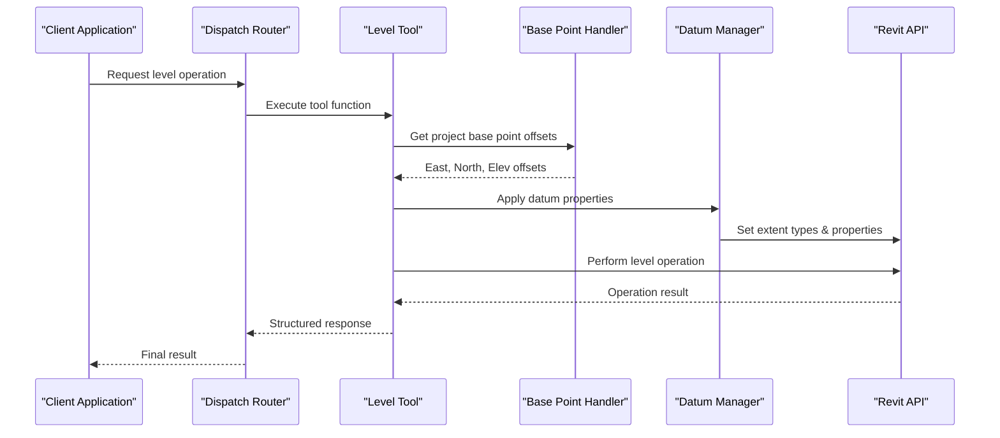
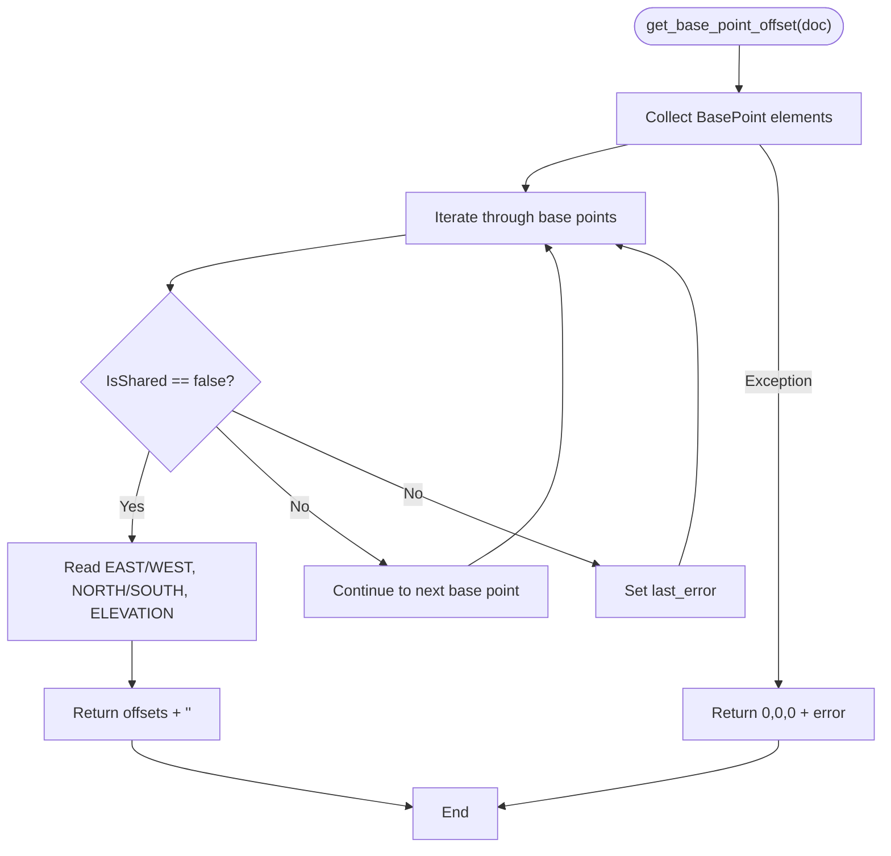

# Level Operations

<cite>
**Referenced Files in This Document**
- [script.py](file://extension/AI_Agent.extension/AI_Agent.tab/Panel.panel/StartBridge.pushbutton/script.py)
</cite>

## Update Summary
**Changes Made**
- Replaced the old static tool system with sophisticated geometric calculations and project base point integration
- Added comprehensive level management capabilities including create, modify, and delete operations
- Implemented advanced datum property management with view-specific controls and propagation
- Enhanced coordinate system handling with project base point offset calculations
- Added detailed level extent fetching across elevation and section views
- Integrated sophisticated geometric calculations for level line manipulation

## Table of Contents
1. [Introduction](#introduction)
2. [Project Structure](#project-structure)
3. [Core Components](#core-components)
4. [Architecture Overview](#architecture-overview)
5. [Detailed Component Analysis](#detailed-component-analysis)
6. [Dependency Analysis](#dependency-analysis)
7. [Performance Considerations](#performance-considerations)
8. [Troubleshooting Guide](#troubleshooting-guide)
9. [Conclusion](#conclusion)
10. [Appendices](#appendices)

## Introduction
This document explains the comprehensive Revit level creation and management system implemented in the AI Agent Bridge. The system has evolved from a simple static tool approach to a sophisticated geometric calculation engine that integrates with project base point coordinates, provides advanced datum property management, and supports complex level manipulation operations including creation, modification, deletion, and spatial extent analysis.

## Project Structure
The level management system is built around a centralized script that provides multiple specialized tools for level operations:

```mermaid
graph TB
subgraph "Level Management Tools"
CREATE["tool_create_level"]
MODIFY["tool_modify_level"]
DELETE["tool_delete_level"]
FETCH["tool_fetch_levels"]
EXTENTS["tool_fetch_level_extents_detailed"]
END
subgraph "Support Functions"
BASEPOINT["get_base_point_offset"]
NAMECHECK["is_level_name_unique"]
VIEWHELPERS["get_view_family_type<br/>has_plan_view"]
DATUMAPPLY["apply_datum_properties"]
END
subgraph "Coordinate System"
PBPCALC["Project Base Point<br/>Integration"]
GEOMCALC["Geometric Calculations<br/>Arc & Line Manipulation"]
END
CREATE --> BASEPOINT
MODIFY --> BASEPOINT
CREATE --> DATUMAPPLY
MODIFY --> DATUMAPPLY
DELETE --> VIEWHELPERS
FETCH --> PBPCALC
EXTENTS --> GEOMCALC
```

**Diagram sources**
- [script.py:112-131](file://extension/AI_Agent.extension/AI_Agent.tab/Panel.panel/StartBridge.pushbutton/script.py#L112-L131)
- [script.py:146-154](file://extension/AI_Agent.extension/AI_Agent.tab/Panel.panel/StartBridge.pushbutton/script.py#L146-L154)
- [script.py:156-172](file://extension/AI_Agent.extension/AI_Agent.tab/Panel.panel/StartBridge.pushbutton/script.py#L156-L172)
- [script.py:174-304](file://extension/AI_Agent.extension/AI_Agent.tab/Panel.panel/StartBridge.pushbutton/script.py#L174-L304)
- [script.py:1745-1841](file://extension/AI_Agent.extension/AI_Agent.tab/Panel.panel/StartBridge.pushbutton/script.py#L1745-L1841)
- [script.py:1934-2038](file://extension/AI_Agent.extension/AI_Agent.tab/Panel.panel/StartBridge.pushbutton/script.py#L1934-L2038)
- [script.py:2063-2119](file://extension/AI_Agent.extension/AI_Agent.tab/Panel.panel/StartBridge.pushbutton/script.py#L2063-L2119)
- [script.py:2196-2230](file://extension/AI_Agent.extension/AI_Agent.tab/Panel.panel/StartBridge.pushbutton/script.py#L2196-L2230)

**Section sources**
- [script.py:112-131](file://extension/AI_Agent.extension/AI_Agent.tab/Panel.panel/StartBridge.pushbutton/script.py#L112-L131)
- [script.py:146-154](file://extension/AI_Agent.extension/AI_Agent.tab/Panel.panel/StartBridge.pushbutton/script.py#L146-L154)
- [script.py:156-172](file://extension/AI_Agent.extension/AI_Agent.tab/Panel.panel/StartBridge.pushbutton/script.py#L156-L172)
- [script.py:174-304](file://extension/AI_Agent.extension/AI_Agent.tab/Panel.panel/StartBridge.pushbutton/script.py#L174-L304)

## Core Components
The level management system consists of four primary operational tools plus supporting infrastructure:

### Primary Tools
- **Create Level Tool**: Creates new horizontal levels with optional associated plan views and datum properties
- **Modify Level Tool**: Updates existing level properties including elevation, name, structural designation, and view generation
- **Delete Level Tool**: Removes levels with comprehensive cleanup of dependent elements
- **Fetch Levels Tool**: Retrieves comprehensive level information including geometric extents and properties

### Supporting Infrastructure
- **Project Base Point Integration**: Handles coordinate transformations between relative and absolute positioning
- **Advanced Datum Property Management**: Manages scope boxes, 3D extents, view-specific controls, and curve propagation
- **Geometric Calculation Engine**: Performs sophisticated calculations for arc and line manipulations in elevation/section views
- **Name Validation System**: Ensures unique level naming across the project

**Section sources**
- [script.py:1745-1841](file://extension/AI_Agent.extension/AI_Agent.tab/Panel.panel/StartBridge.pushbutton/script.py#L1745-L1841)
- [script.py:1934-2038](file://extension/AI_Agent.extension/AI_Agent.tab/Panel.panel/StartBridge.pushbutton/script.py#L1934-L2038)
- [script.py:2063-2119](file://extension/AI_Agent.extension/AI_Agent.tab/Panel.panel/StartBridge.pushbutton/script.py#L2063-L2119)
- [script.py:2196-2230](file://extension/AI_Agent.extension/AI_Agent.tab/Panel.panel/StartBridge.pushbutton/script.py#L2196-L2230)

## Architecture Overview
The level management system follows a modular architecture with clear separation of concerns:



**Diagram sources**
- [script.py:2235-2288](file://extension/AI_Agent.extension/AI_Agent.tab/Panel.panel/StartBridge.pushbutton/script.py#L2235-L2288)
- [script.py:112-131](file://extension/AI_Agent.extension/AI_Agent.tab/Panel.panel/StartBridge.pushbutton/script.py#L112-L131)
- [script.py:174-304](file://extension/AI_Agent.extension/AI_Agent.tab/Panel.panel/StartBridge.pushbutton/script.py#L174-L304)

## Detailed Component Analysis

### Project Base Point Integration
The system implements sophisticated coordinate transformation through the `get_base_point_offset` function, which retrieves project base point coordinates and handles various error conditions:



**Diagram sources**
- [script.py:112-131](file://extension/AI_Agent.extension/AI_Agent.tab/Panel.panel/StartBridge.pushbutton/script.py#L112-L131)

**Section sources**
- [script.py:112-131](file://extension/AI_Agent.extension/AI_Agent.tab/Panel.panel/StartBridge.pushbutton/script.py#L112-L131)

### Advanced Datum Property Management
The `apply_datum_properties` function provides comprehensive control over level datum characteristics:

#### Scope Box Integration
- Sets the datum volume of interest using the `DATUM_VOLUME_OF_INTEREST` parameter
- Supports both element assignment and clearing operations
- Handles invalid element IDs gracefully

#### 3D Extent Management
- Implements `Maximize3DExtents()` for automatic boundary expansion
- Provides error handling for unsupported operations
- Integrates with project base point coordinates for accurate positioning

#### View-Specific Controls
- **Datum Extent Types**: Switch between `ViewSpecific` and `Model` extent types
- **Bubble Controls**: Show/hide level bubbles at start and end points
- **Offset Adjustments**: Support for both linear and angular offset calculations
- **Curve Propagation**: Copy level line modifications across multiple views

**Section sources**
- [script.py:174-304](file://extension/AI_Agent.extension/AI_Agent.tab/Panel.panel/StartBridge.pushbutton/script.py#L174-L304)

### Create Level Operation
The `tool_create_level` function implements comprehensive level creation with the following capabilities:

#### Elevation Handling
- Accepts relative elevations in feet from project base point
- Automatically converts to absolute coordinates using base point offsets
- Validates elevation inputs and handles conversion errors

#### Associated View Generation
- **Floor Plans**: Creates standard floor plan views with optional view templates
- **RCP (Reflected Ceiling Plans)**: Generates ceiling plan views when requested
- **Structural Plans**: Creates structural analysis views for analytical modeling
- **View Template Application**: Applies project view templates for consistent styling

#### Structural Integration
- Sets `LEVEL_IS_STRUCTURAL` parameter for analytical applications
- Supports custom level types through `ChangeTypeId` operations
- Integrates with scope boxes for 3D boundary definition

**Section sources**
- [script.py:1745-1841](file://extension/AI_Agent.extension/AI_Agent.tab/Panel.panel/StartBridge.pushbutton/script.py#L1745-L1841)

### Modify Level Operation
The `tool_modify_level` function provides extensive level modification capabilities:

#### Property Updates
- **Name Changes**: Validates uniqueness and prevents conflicts
- **Elevation Modifications**: Converts between relative and absolute coordinates
- **Structural Designation**: Updates analytical modeling flags
- **Level Type Changes**: Switches between different level type families

#### View Management
- **Conditional View Creation**: Creates missing plan views only when requested
- **View Template Application**: Applies consistent styling across generated views
- **Existing View Detection**: Prevents duplicate view creation

#### Datum Property Updates
- Integrates with the comprehensive datum property system
- Supports all view-specific and global level property modifications

**Section sources**
- [script.py:1934-2038](file://extension/AI_Agent.extension/AI_Agent.tab/Panel.panel/StartBridge.pushbutton/script.py#L1934-L2038)

### Delete Level Operation
The `tool_delete_level` function implements safe level removal with comprehensive cleanup:

#### Dependent Element Management
- **Dependency Discovery**: Identifies all elements dependent on the level
- **Individual Cleanup**: Processes each dependent element separately
- **Pinning Management**: Unpins elements before deletion to ensure success

#### Safety Measures
- **User Confirmation Required**: Includes explicit warnings about destructive operations
- **Error Reporting**: Provides detailed feedback for elements that cannot be deleted
- **Transaction Safety**: Uses Revit transactions for atomic operation completion

**Section sources**
- [script.py:2063-2119](file://extension/AI_Agent.extension/AI_Agent.tab/Panel.panel/StartBridge.pushbutton/script.py#L2063-L2119)

### Level Extent Analysis
The `tool_fetch_level_extents_detailed` function provides comprehensive spatial analysis:

#### Multi-View Coordination
- **Cross-View Integration**: Analyzes level curves across all elevation and section views
- **Coordinate Aggregation**: Maintains running minimum/maximum values for complete bounds
- **Error Resilience**: Continues processing despite individual view failures

#### Spatial Boundary Determination
- **X-Axis Bounds**: Calculates minimum and maximum east-west coordinates
- **Y-Axis Bounds**: Determines minimum and maximum north-south coordinates
- **Complete Coverage**: Ensures analysis includes all relevant project geometry

**Section sources**
- [script.py:2196-2230](file://extension/AI_Agent.extension/AI_Agent.tab/Panel.panel/StartBridge.pushbutton/script.py#L2196-L2230)

## Dependency Analysis
The level management system exhibits a well-structured dependency hierarchy:

```mermaid
graph TB
subgraph "Core Dependencies"
SCRIPT["script.py - Main Implementation"]
REVITDB["Autodesk.Revit.DB"]
SYSTEMCOL["System.Collections.Generic"]
END
subgraph "Level Tools"
CREATE["tool_create_level"]
MODIFY["tool_modify_level"]
DELETE["tool_delete_level"]
FETCH["tool_fetch_levels"]
EXTENTS["tool_fetch_level_extents_detailed"]
END
subgraph "Support Functions"
BASEPOINT["get_base_point_offset"]
NAMECHECK["is_level_name_unique"]
VIEWHELPERS["View helpers"]
DATUMAPPLY["apply_datum_properties"]
END
SCRIPT --> REVITDB
SCRIPT --> SYSTEMCOL
CREATE --> BASEPOINT
CREATE --> DATUMAPPLY
MODIFY --> BASEPOINT
MODIFY --> DATUMAPPLY
DELETE --> VIEWHELPERS
FETCH --> BASEPOINT
EXTENTS --> REVITDB
```

**Diagram sources**
- [script.py:1745-1841](file://extension/AI_Agent.extension/AI_Agent.tab/Panel.panel/StartBridge.pushbutton/script.py#L1745-L1841)
- [script.py:1934-2038](file://extension/AI_Agent.extension/AI_Agent.tab/Panel.panel/StartBridge.pushbutton/script.py#L1934-L2038)
- [script.py:2063-2119](file://extension/AI_Agent.extension/AI_Agent.tab/Panel.panel/StartBridge.pushbutton/script.py#L2063-L2119)
- [script.py:2196-2230](file://extension/AI_Agent.extension/AI_Agent.tab/Panel.panel/StartBridge.pushbutton/script.py#L2196-L2230)

**Section sources**
- [script.py:1745-1841](file://extension/AI_Agent.extension/AI_Agent.tab/Panel.panel/StartBridge.pushbutton/script.py#L1745-L1841)
- [script.py:1934-2038](file://extension/AI_Agent.extension/AI_Agent.tab/Panel.panel/StartBridge.pushbutton/script.py#L1934-L2038)
- [script.py:2063-2119](file://extension/AI_Agent.extension/AI_Agent.tab/Panel.panel/StartBridge.pushbutton/script.py#L2063-L2119)
- [script.py:2196-2230](file://extension/AI_Agent.extension/AI_Agent.tab/Panel.panel/StartBridge.pushbutton/script.py#L2196-L2230)

## Performance Considerations
The sophisticated level management system incorporates several performance optimization strategies:

### Coordinate System Optimization
- **Single Base Point Query**: Base point offsets are calculated once per operation and cached
- **Efficient Parameter Access**: Minimizes Revit API calls through batched parameter retrieval
- **Lazy Evaluation**: Postpones expensive calculations until necessary

### Memory Management
- **Transaction Isolation**: Each operation runs within isolated transactions to prevent memory leaks
- **Resource Cleanup**: Proper disposal of Revit elements and collections
- **Error Recovery**: Graceful handling of partial operations to maintain system stability

### Computational Efficiency
- **Early Exit Conditions**: Quick validation prevents unnecessary computation
- **Selective Processing**: Only processes relevant views and elements
- **Batch Operations**: Groups similar operations to minimize API overhead

## Troubleshooting Guide
Common issues and resolution strategies for the advanced level management system:

### Base Point Issues
- **Missing Base Point**: System returns descriptive error messages when no suitable base point exists
- **Parameter Access Failures**: Graceful fallback to default coordinates with detailed error logging
- **Coordinate Conversion Errors**: Comprehensive error reporting with specific failure points

### Datum Property Errors
- **Scope Box Assignment**: Handles invalid scope box IDs and parameter read failures
- **View-Specific Operations**: Continues processing despite individual view failures
- **Curve Manipulation**: Provides detailed error messages for geometric calculation failures

### Transaction Management
- **Operation Rollbacks**: Automatic rollback on exceptions with detailed error reporting
- **Element State Conflicts**: Handles cases where elements are pinned or otherwise protected
- **Memory Leaks Prevention**: Proper resource cleanup in error scenarios

### Performance Optimization
- **Large Model Handling**: Efficient processing of projects with thousands of elements
- **Network Latency**: Optimized for remote Revit sessions and network environments
- **API Rate Limiting**: Built-in throttling to prevent Revit API overload

**Section sources**
- [script.py:112-131](file://extension/AI_Agent.extension/AI_Agent.tab/Panel.panel/StartBridge.pushbutton/script.py#L112-L131)
- [script.py:174-304](file://extension/AI_Agent.extension/AI_Agent.tab/Panel.panel/StartBridge.pushbutton/script.py#L174-L304)
- [script.py:2063-2119](file://extension/AI_Agent.extension/AI_Agent.tab/Panel.panel/StartBridge.pushbutton/script.py#L2063-L2119)

## Conclusion
The AI Agent Bridge implements a comprehensive, production-ready level management system that replaces the old static tool approach with sophisticated geometric calculations and project base point integration. The system provides advanced capabilities for level creation, modification, deletion, and spatial analysis while maintaining robust error handling, performance optimization, and user safety measures.

## Appendices

### Practical Usage Examples

#### Creating a Level with Associated Views
```python
# Basic level creation
payload = {
    "tool": "create_level",
    "input": {
        "name": "Foundation Level",
        "elevation": 0.0,
        "create_floor_plan": True,
        "create_ceiling_plan": True,
        "is_structural": True,
        "view_template_id": "template_unique_id"
    }
}
```

#### Modifying Level Properties
```python
# Level modification with datum properties
payload = {
    "tool": "modify_level",
    "input": {
        "level_id": "level_unique_id",
        "name": "Updated Foundation Level",
        "elevation": -15.0,
        "scope_box_id": "scope_box_unique_id",
        "maximize_3d_extents": True,
        "datum_extent_type": "2D",
        "target_view_id": "view_unique_id",
        "start_offset": 5.0,
        "end_offset": 3.0,
        "propagate_to_views": ["view1_id", "view2_id"]
    }
}
```

#### Fetching Level Extents
```python
# Comprehensive level extent analysis
payload = {
    "tool": "fetch_level_extents_detailed"
}
# Returns: {"status": "success", "x_min": -100.0, "x_max": 500.0, "y_min": -200.0, "y_max": 300.0}
```

**Section sources**
- [script.py:1745-1841](file://extension/AI_Agent.extension/AI_Agent.tab/Panel.panel/StartBridge.pushbutton/script.py#L1745-L1841)
- [script.py:1934-2038](file://extension/AI_Agent.extension/AI_Agent.tab/Panel.panel/StartBridge.pushbutton/script.py#L1934-L2038)
- [script.py:2196-2230](file://extension/AI_Agent.extension/AI_Agent.tab/Panel.panel/StartBridge.pushbutton/script.py#L2196-L2230)