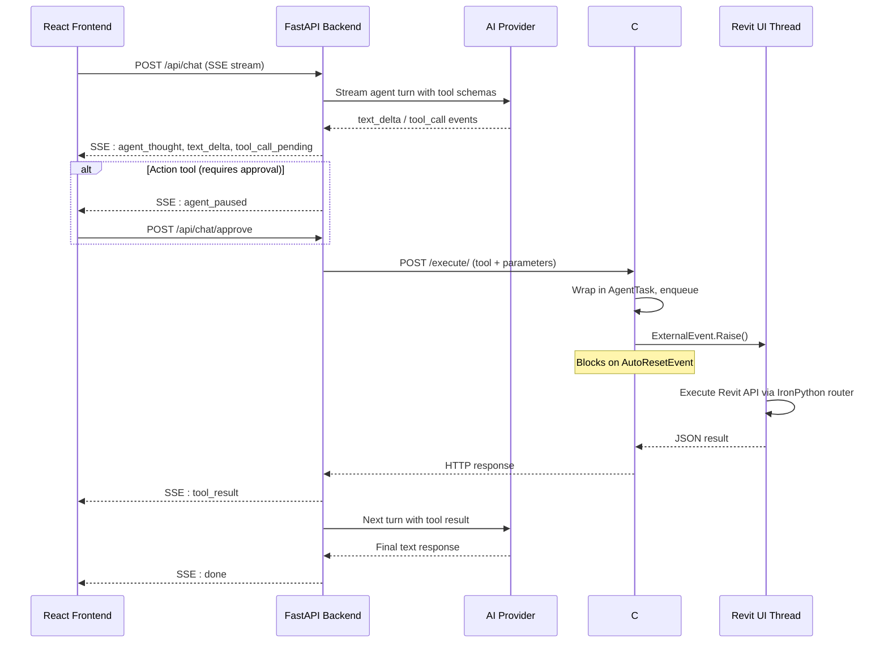
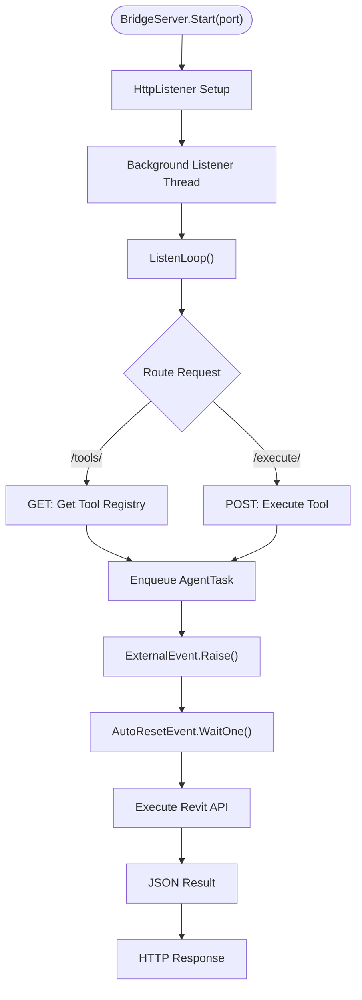
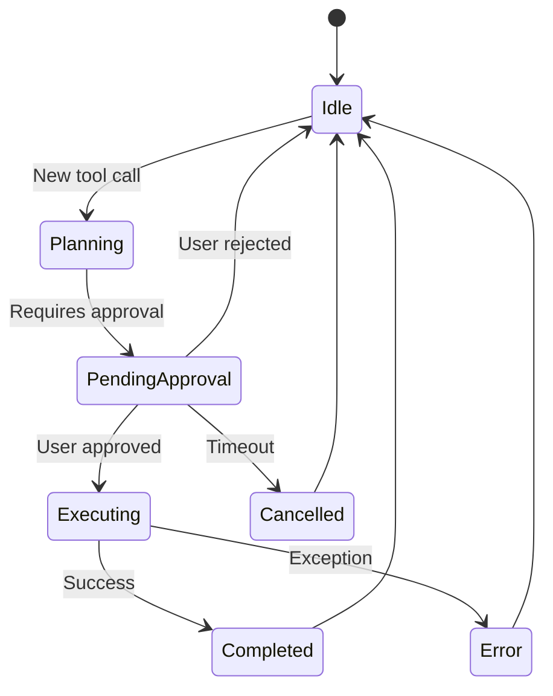
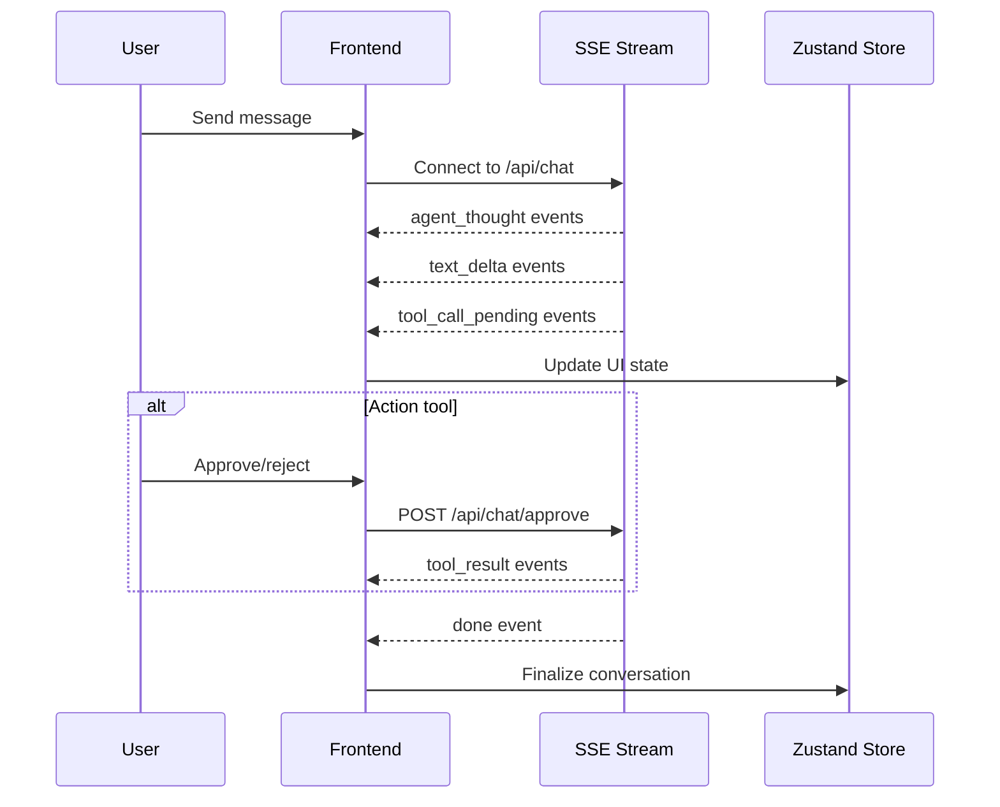
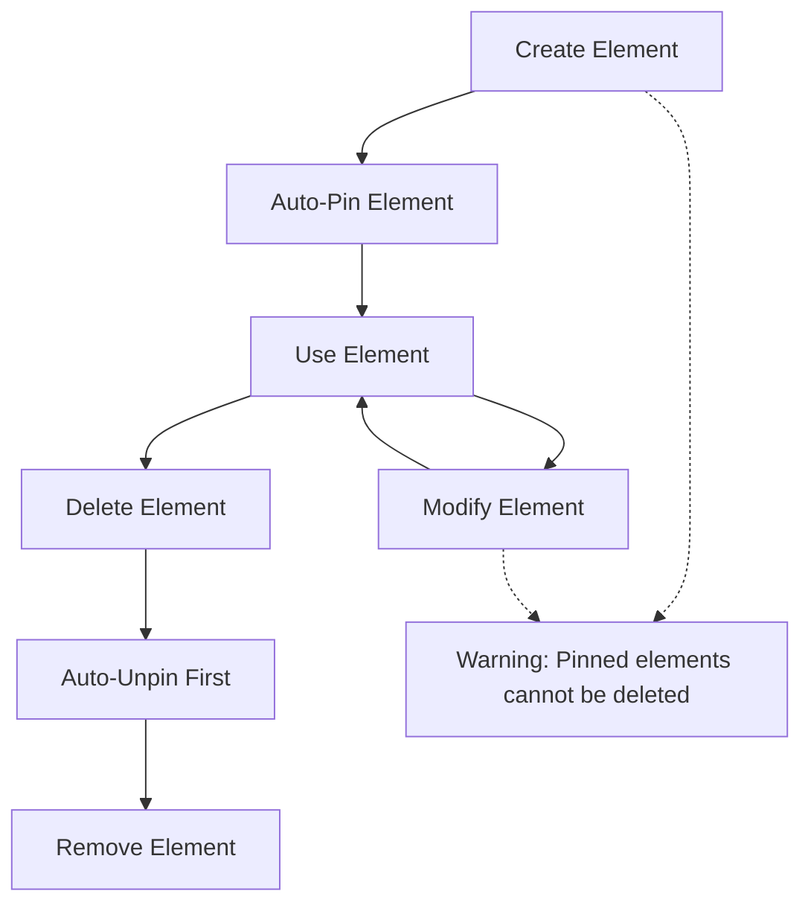
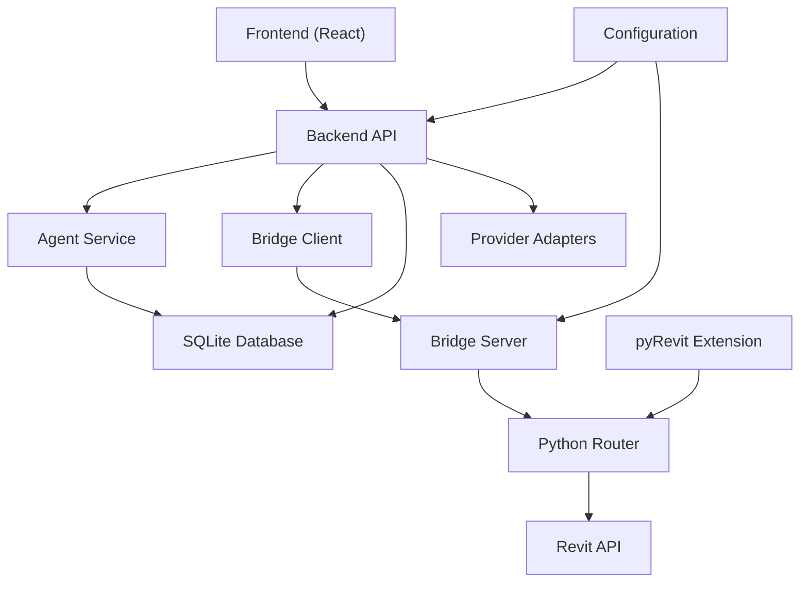

# Revit Integration

<cite>
**Referenced Files in This Document**
- [README.md](file://README.md)
- [backend/services/revit_bridge.py](file://backend/services/revit_bridge.py)
- [backend/services/agent.py](file://backend/services/agent.py)
- [backend/api/chat.py](file://backend/api/chat.py)
- [bridge-source/BridgeServer.cs](file://bridge-source/BridgeServer.cs)
- [extension/AI_Agent.extension/AI_Agent.tab/Panel.panel/StartBridge.pushbutton/script.py](file://extension/AI_Agent.extension/AI_Agent.tab/Panel.panel/StartBridge.pushbutton/script.py)
- [frontend/src/App.tsx](file://frontend/src/App.tsx)
- [frontend/src/components/ChatWindow.tsx](file://frontend/src/components/ChatWindow.tsx)
- [schemas/tools.json](file://schemas/tools.json)
</cite>

## Update Summary
**Changes Made**
- Updated architecture overview to reflect the new C# bridge server with ExternalEvent threading model
- Documented the new UI components including ApprovalModal, SettingsPanel, and enhanced ChatWindow
- Added comprehensive coverage of the new SSE streaming architecture with agent thought visibility
- Updated tool registry system with dynamic discovery and schema caching
- Enhanced error handling and approval gate mechanisms
- Documented the new frontend polling system for Revit bridge status
- Added new sections covering the complete four-layer architecture

## Table of Contents
1. [Introduction](#introduction)
2. [Project Structure](#project-structure)
3. [Core Components](#core-components)
4. [Architecture Overview](#architecture-overview)
5. [Detailed Component Analysis](#detailed-component-analysis)
6. [Dependency Analysis](#dependency-analysis)
7. [Performance Considerations](#performance-considerations)
8. [Troubleshooting Guide](#troubleshooting-guide)
9. [Conclusion](#conclusion)
10. [Appendices](#appendices)

## Introduction
This document describes the Revit AI Agent system that connects multiple LLM providers directly to Autodesk Revit 2025 via a web-based chat interface. The system features an automated AI agent with human-in-the-loop approval, dynamic tool discovery, and safe UI-thread execution through a C# bridge server with ExternalEvent threading model.

The integration implements a sophisticated four-layer architecture:
- **React Frontend**: Web-based chat interface with real-time streaming and approval modals
- **FastAPI Backend**: Python-based orchestration with provider adapters and tool registry
- **C# Bridge Server**: Thread-safe middleware using ExternalEvent and AutoResetEvent for Revit API access
- **Revit Integration**: Safe, transactional element manipulation through IronPython router

The system replaces manual pyRevit UI interactions with an automated AI agent that can perform complex BIM operations through natural language instructions, featuring comprehensive error handling and approval gates for destructive actions.

## Project Structure
The repository follows a modern web architecture with clear separation of concerns and comprehensive tool management:

```
ai_revit_agent/
├── backend/                        # FastAPI backend (Python 3.11+)
│   ├── api/                        # API route handlers
│   ├── providers/                  # AI provider adapters
│   ├── services/                   # Core business logic
│   ├── data/                       # SQLite database
│   ├── schemas/                    # Tool schema cache
│   ├── config.py                   # Configuration management
│   ├── database.py                 # Database operations
│   ├── models.py                   # Data models
│   ├── main.py                     # Application factory
│   └── requirements.txt            # Dependencies
├── frontend/                       # React frontend (Vite, TypeScript)
│   ├── src/
│   │   ├── api/                    # API client layer
│   │   ├── components/             # React components
│   │   ├── hooks/                  # Custom React hooks
│   │   ├── store/                  # State management
│   │   ├── types/                  # TypeScript definitions
│   │   ├── App.tsx                 # Root component
│   │   └── main.tsx                # Entry point
│   ├── package.json
│   └── vite.config.ts
├── bridge-source/                  # C# .NET 8.0 Bridge Server
│   ├── BridgeServer.cs             # HTTP listener + external event handling
│   └── RevitAgentBridge.csproj     # MSBuild configuration
├── extension/                      # pyRevit Extension Bundle
│   └── AI_Agent.extension/
│       └── AI_Agent.tab/
│           └── Panel.panel/
│               └── StartBridge.pushbutton/
│                   ├── bundle.yaml
│                   ├── script.py
│                   └── RevitAgentBridge.dll
└── schemas/                        # Tool schema snapshots
    └── tools.json                  # Cached tool registry
```

**Section sources**
- [README.md:106-170](file://README.md#L106-L170)

## Core Components

### Backend Services
- **Revit Bridge Service**: HTTP client for C# BridgeServer running on localhost:8080, handles tool discovery and execution with health checking
- **Agent Service**: Provider-agnostic agentic loop with human-in-the-loop approval using asyncio events and approval gates
- **Chat API**: Streaming conversation endpoint with SSE support, approval gate management, and session persistence
- **Provider Adapters**: Multi-provider support (Gemini, OpenAI, Anthropic, Groq, OpenRouter) with streaming capabilities
- **Database Layer**: SQLite persistence for sessions, messages, and provider configurations with async operations
- **Tool Registry**: Dynamic tool discovery system with schema caching and lazy loading

### C# Bridge Server
- **Thread-safe Execution**: Uses ExternalEvent and AutoResetEvent for safe Revit API access on main thread
- **HTTP Listener**: Provides REST endpoints for tool discovery (/tools/) and execution (/execute/)
- **Task Queue Management**: Concurrent queue for handling multiple tool requests with timeout handling
- **Python Router Integration**: Seamless integration with IronPython tool definitions and execution routing
- **Error Handling**: Comprehensive exception handling with structured error responses

### Frontend Components
- **Chat Interface**: Real-time streaming with agent thought visibility and tool call cards
- **Approval Modal**: Human-in-the-loop approval system for destructive actions with visual feedback
- **Session Management**: Persistent conversation sessions with SQLite storage and session sidebar
- **Provider Selection**: Dynamic provider switching with configuration management and status indicators
- **Settings Panel**: Slide-out settings with API key management and configuration persistence
- **Revit Status Monitoring**: Exponential backoff polling for bridge connectivity with status indicators

### Revit Integration Layer
- **Dynamic Tool Registry**: Auto-discovery of all available BIM tools from pyRevit extension with schema validation
- **Safe Transaction Management**: Thread-safe execution with proper error handling and transaction wrapping
- **Element Lifecycle Management**: Automatic pinning/unpinning for safety with level deletion ordering
- **Coordinate System Handling**: Consistent unit handling across tools with Project Base Point offset calculations
- **IronPython Execution**: Direct integration with Revit's IronPython environment for tool execution

**Section sources**
- [backend/services/revit_bridge.py:1-202](file://backend/services/revit_bridge.py#L1-L202)
- [backend/services/agent.py:1-367](file://backend/services/agent.py#L1-L367)
- [backend/api/chat.py:1-435](file://backend/api/chat.py#L1-L435)
- [bridge-source/BridgeServer.cs:1-210](file://bridge-source/BridgeServer.cs#L1-L210)
- [extension/AI_Agent.extension/AI_Agent.tab/Panel.panel/StartBridge.pushbutton/script.py:1-800](file://extension/AI_Agent.extension/AI_Agent.tab/Panel.panel/StartBridge.pushbutton/script.py#L1-L800)

## Architecture Overview
The system implements a sophisticated four-layer architecture with clear separation of concerns and robust error handling through ExternalEvent threading model:



**Diagram sources**
- [README.md:73-102](file://README.md#L73-L102)
- [backend/api/chat.py:74-261](file://backend/api/chat.py#L74-L261)
- [backend/services/agent.py:94-367](file://backend/services/agent.py#L94-L367)
- [bridge-source/BridgeServer.cs:120-187](file://bridge-source/BridgeServer.cs#L120-L187)

**Section sources**
- [README.md:45-103](file://README.md#L45-L103)

## Detailed Component Analysis

### C# Bridge Server Architecture
The bridge server acts as the critical middleware between the web application and Revit's API using ExternalEvent threading model:



**Diagram sources**
- [bridge-source/BridgeServer.cs:93-187](file://bridge-source/BridgeServer.cs#L93-L187)

**Section sources**
- [bridge-source/BridgeServer.cs:1-210](file://bridge-source/BridgeServer.cs#L1-L210)

### Agent Service with Approval Gates
The agent service implements a sophisticated approval system using asyncio events with comprehensive state management:



**Diagram sources**
- [backend/services/agent.py:39-65](file://backend/services/agent.py#L39-L65)
- [backend/services/agent.py:253-294](file://backend/services/agent.py#L253-L294)

**Section sources**
- [backend/services/agent.py:1-367](file://backend/services/agent.py#L1-L367)

### Frontend Streaming Architecture
The React frontend implements real-time streaming with comprehensive error handling and user experience enhancements:



**Diagram sources**
- [frontend/src/App.tsx:25-79](file://frontend/src/App.tsx#L25-L79)
- [frontend/src/components/ChatWindow.tsx:20-33](file://frontend/src/components/ChatWindow.tsx#L20-L33)

**Section sources**
- [frontend/src/App.tsx:1-127](file://frontend/src/App.tsx#L1-L127)
- [frontend/src/components/ChatWindow.tsx:1-119](file://frontend/src/components/ChatWindow.tsx#L1-L119)

### Tool Registry and Dynamic Discovery
The system implements automatic tool discovery from the pyRevit extension with comprehensive schema management:

| Tool Category | Tool Name | Description | Approval Required |
|---------------|-----------|-------------|-------------------|
| Fetch Tools | `fetch_project_info` | Document metadata | No |
| Fetch Tools | `fetch_levels` | All levels with extents | No |
| Fetch Tools | `fetch_grids` | All gridlines with coordinates | No |
| Fetch Tools | `fetch_families` | Loaded family symbols | No |
| Fetch Tools | `fetch_sheets` | Drawing sheets | No |
| Action Tools | `create_level` | New horizontal level | Yes |
| Action Tools | `create_grid` | Linear gridline | Yes |
| Action Tools | `place_family` | Family instance placement | Yes |
| Action Tools | `delete_level` | Level and dependencies | Yes |
| Action Tools | `modify_level` | Level elevation/name | Yes |
| Action Tools | `modify_grid` | Grid geometry/name | Yes |
| Action Tools | `delete_grid` | Grid deletion | Yes |
| Action Tools | `create_sheet` | New drawing sheet | Yes |

**Section sources**
- [README.md:283-325](file://README.md#L283-L325)
- [extension/AI_Agent.extension/AI_Agent.tab/Panel.panel/StartBridge.pushbutton/script.py:372-800](file://extension/AI_Agent.extension/AI_Agent.tab/Panel.panel/StartBridge.pushbutton/script.py#L372-L800)

### Element Lifecycle Management
The system implements comprehensive element lifecycle management with safety protocols:



**Diagram sources**
- [README.md:312-317](file://README.md#L312-L317)

**Section sources**
- [README.md:312-325](file://README.md#L312-L325)

## Dependency Analysis
The architecture maintains clear separation between layers with minimal coupling and comprehensive error handling:



**Diagram sources**
- [backend/services/revit_bridge.py:1-202](file://backend/services/revit_bridge.py#L1-L202)
- [backend/services/agent.py:1-367](file://backend/services/agent.py#L1-L367)
- [bridge-source/BridgeServer.cs:1-210](file://bridge-source/BridgeServer.cs#L1-L210)

**Section sources**
- [backend/services/revit_bridge.py:1-202](file://backend/services/revit_bridge.py#L1-L202)
- [backend/services/agent.py:1-367](file://backend/services/agent.py#L1-L367)
- [bridge-source/BridgeServer.cs:1-210](file://bridge-source/BridgeServer.cs#L1-L210)

## Performance Considerations
- **Connection Pooling**: HTTP client reuse for bridge communication reduces connection overhead
- **Streaming Architecture**: SSE streaming minimizes memory usage during long conversations
- **Async Processing**: Non-blocking operations in backend services improve responsiveness
- **Caching Strategy**: Tool schema caching reduces discovery overhead and improves startup times
- **Timeout Management**: 120-second timeouts prevent hanging operations with graceful error handling
- **Memory Management**: Proper cleanup of asyncio events, database connections, and HTTP clients
- **Frontend Optimization**: Virtualized message lists, efficient state updates, and exponential backoff polling
- **Thread Safety**: ExternalEvent model ensures Revit API calls execute on main thread only

## Troubleshooting Guide

### Common Issues and Solutions

**Bridge Connection Problems**
- **Symptom**: "Cannot reach Revit bridge" errors in frontend
- **Solution**: Ensure bridge button is clicked in Revit, verify port configuration matches backend settings, check firewall settings

**Approval Gate Issues**
- **Symptom**: Agent appears stuck waiting for approval
- **Solution**: Check approval modal in frontend, verify approval ID matches pending tool, ensure approval endpoint is accessible

**Tool Execution Failures**
- **Symptom**: Tools return "error" status with detailed messages
- **Solution**: Review debug logs in pyRevit output panel, check element existence and permissions, verify coordinate systems

**Frontend Streaming Issues**
- **Symptom**: Messages not appearing in real-time
- **Solution**: Check browser developer tools for SSE connection status, verify CORS configuration, ensure backend is running

**Tool Discovery Failures**
- **Symptom**: Empty tool list or "No tools available"
- **Solution**: Verify bridge is running, check pyRevit extension installation, restart bridge button, review tool schema cache

**Section sources**
- [backend/services/revit_bridge.py:73-85](file://backend/services/revit_bridge.py#L73-L85)
- [backend/services/agent.py:253-294](file://backend/services/agent.py#L253-L294)
- [frontend/src/App.tsx:43-79](file://frontend/src/App.tsx#L43-L79)

## Conclusion
The Revit AI Agent system represents a significant advancement in automated BIM operations. By replacing manual UI interactions with an intelligent AI agent and implementing a robust ExternalEvent threading model, the system provides:

- **Automated Workflows**: Complex BIM operations through natural language instructions with comprehensive tool discovery
- **Human Oversight**: Critical approval system for destructive actions with visual feedback and error handling
- **Scalable Architecture**: Four-layer design supporting multiple AI providers with thread-safe execution
- **Robust Safety**: ExternalEvent model ensures all Revit API calls execute on main thread, preventing crashes
- **Real-time Feedback**: Live streaming of agent thoughts, tool execution results, and approval processes
- **Comprehensive Error Handling**: Structured error reporting, timeout management, and graceful degradation
- **Modern UI Experience**: Real-time streaming, approval modals, settings panels, and responsive design

The system successfully bridges the gap between AI intelligence and Revit's complex API, enabling unprecedented automation while maintaining safety, reliability, and user control through comprehensive approval gates and error handling mechanisms.

## Appendices

### Usage Examples

**Starting the System**
```bash
# Build C# bridge
cd bridge-source
dotnet build -c Release

# Copy DLL to extension
Copy-Item -Path "bin\Release\net8.0-windows\RevitAgentBridge.dll" `
  -Destination "..\extension\AI_Agent.extension\AI_Agent.tab\Panel.panel\StartBridge.pushbutton\RevitAgentBridge.dll" `
  -Force

# Start development servers
cd ..
run.bat
```

**Basic Tool Usage**
- `fetch_levels`: Retrieve all levels with elevation data and curve extents
- `create_level`: Create new level with specified name and elevation
- `fetch_grids`: Get all existing gridlines with coordinates and geometry
- `create_grid`: Place new gridline between two points with optional curvature
- `fetch_families`: Get loaded family symbols for placement
- `place_family`: Place family instance at specified coordinates

**Section sources**
- [README.md:187-280](file://README.md#L187-L280)

### Configuration Reference

**Environment Variables**
- `DEVELOPMENT_MODE`: Enable/disable auto-approval and development features
- `REVIT_BRIDGE_PORT`: Port for C# bridge server (default: 8080)
- `DEFAULT_PROVIDER`: Default AI provider (gemini, openai, etc.)
- `DATABASE_PATH`: SQLite database location
- `AGENT_MAX_TURNS`: Maximum conversation turns per session

**Section sources**
- [README.md:327-352](file://README.md#L327-L352)

### Extension Points

**Adding New Tools**
1. Extend `script.py` with new tool registration using `@register_tool` decorator
2. Implement tool function with proper error handling and transaction management
3. Register tool in `python_execution_router` dispatch logic
4. Test tool in Revit environment, verify schema generation
5. Restart bridge server and backend for tool discovery

**Section sources**
- [README.md:355-385](file://README.md#L355-L385)