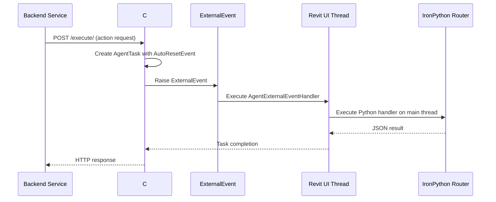
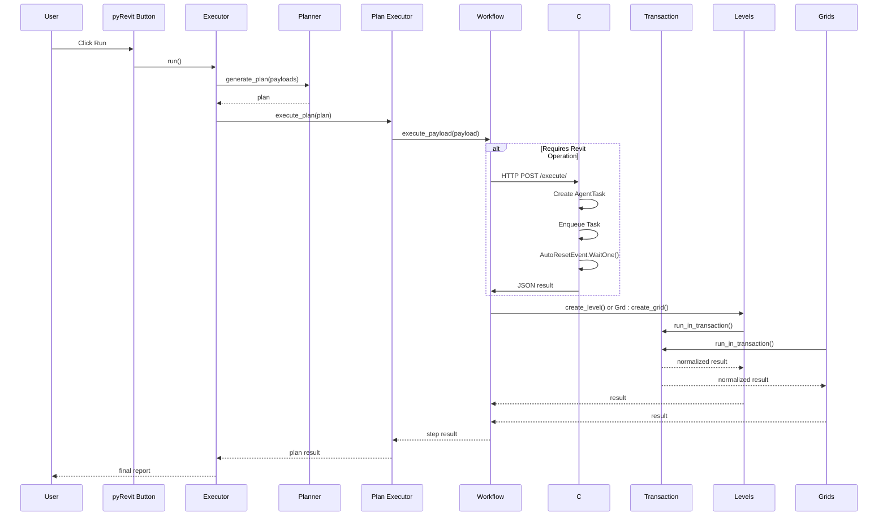
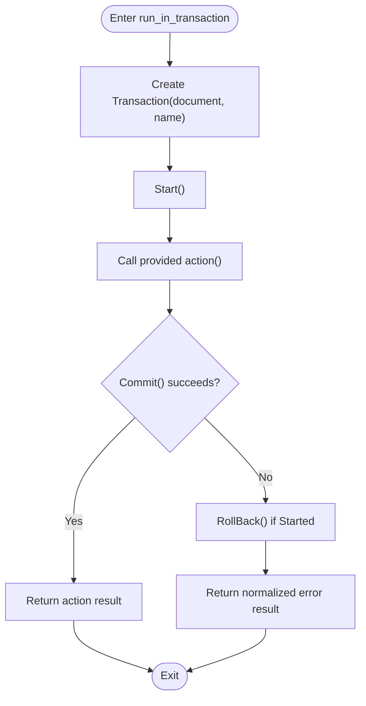
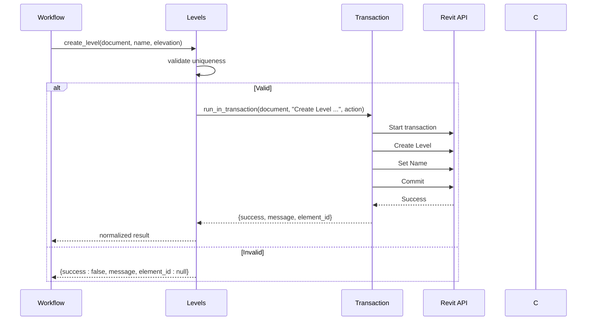
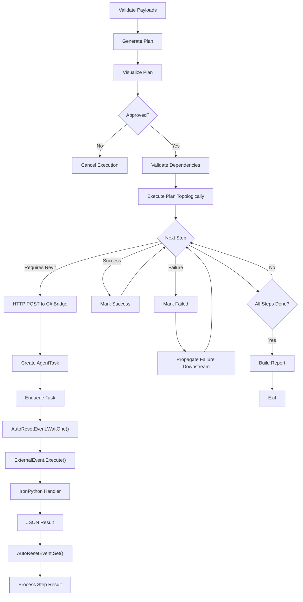
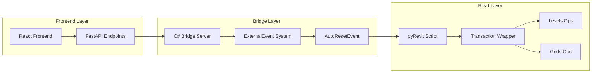

# Transaction Management

<cite>
**Referenced Files in This Document**
- [BridgeServer.cs](file://bridge-source/BridgeServer.cs)
- [revit_bridge.py](file://backend/services/revit_bridge.py)
- [script.py](file://extension/AI_Agent.extension/AI_Agent.tab/Panel.panel/StartBridge.pushbutton/script.py)
- [transactions.py](file://revit/transactions.py)
- [grids.py](file://revit/grids.py)
- [levels.py](file://revit/levels.py)
- [workflow.py](file://runtime/workflow.py)
- [executor.py](file://runtime/executor.py)
- [planner.py](file://planner/planner.py)
- [executor.py](file://planner/executor.py)
- [document.py](file://revit/document.py)
- [validators.py](file://tools/validators.py)
- [grid_schema.py](file://schemas/grid_schema.py)
- [level_schema.py](file://schemas/level_schema.py)
</cite>

## Update Summary
**Changes Made**
- Updated architecture overview to reflect new C# bridge threading model
- Added new section on C# bridge server implementation and thread safety
- Revised execution workflow to show external event-based Revit API dispatch
- Updated integration points between backend, bridge, and Revit layers
- Enhanced threading model documentation with ExternalEvent and AutoResetEvent patterns

## Table of Contents
1. [Introduction](#introduction)
2. [System Architecture](#system-architecture)
3. [C# Bridge Threading Model](#csharp-bridge-threading-model)
4. [Core Components](#core-components)
5. [Architecture Overview](#architecture-overview)
6. [Detailed Component Analysis](#detailed-component-analysis)
7. [Dependency Analysis](#dependency-analysis)
8. [Performance Considerations](#performance-considerations)
9. [Troubleshooting Guide](#troubleshooting-guide)
10. [Conclusion](#conclusion)
11. [Appendices](#appendices)

## Introduction
This document explains the transaction management and controlled abstraction layer used by the AI Revit Agent, now enhanced with a sophisticated C# bridge threading model. The system prevents Revit freezing during AI agent interactions through a thread-safe architecture that separates AI processing from Revit's single-threaded main UI thread. It focuses on the transaction wrapper pattern that centralizes Revit API write operations, ensuring consistent commit and rollback behavior within the new external event-driven execution framework.

## System Architecture
The system now operates through a multi-layered architecture with a dedicated C# bridge server that manages thread isolation and prevents Revit UI blocking:

```
┌─────────────────────────────────────────────────────────────────┐
│  React Frontend (Vite, TypeScript, Zustand)  —  :5173 / :8000  │
│  Chat UI · Session Sidebar · Provider Selector · Approval Modal │
└──────────────────────────────┬──────────────────────────────────┘
                               │  SSE / REST API
┌──────────────────────────────▼──────────────────────────────────┐
│  FastAPI Backend (Python 3.11+, SQLite)  —  :8000               │
│  Agentic Loop · Tool Registry · Provider Adapters · Persistence │
└──────────────────────────────┬──────────────────────────────────┘
                               │  HTTP (localhost:8080)
┌──────────────────────────────▼──────────────────────────────────┐
│  C# Bridge Server (.NET 8.0, HttpListener)  —  :8080            │
│  Thread-safe dispatch via ExternalEvent + AutoResetEvent        │
└──────────────────────────────┬──────────────────────────────────┘
                               │  Revit API (IronPython router)
┌──────────────────────────────▼──────────────────────────────────┐
│  Autodesk Revit 2025  —  Single-threaded UI main thread         │
│  pyRevit extension with tool definitions & action dispatch      │
└─────────────────────────────────────────────────────────────────┘
```

**Diagram sources**
- [README.md:45-102](file://README.md#L45-L102)

## C# Bridge Threading Model
The new C# bridge server implements a sophisticated threading model that prevents Revit UI freezing during AI agent interactions:

### ExternalEvent-Based Execution
The bridge uses Autodesk's ExternalEvent system to safely execute Revit API operations on the main UI thread while keeping AI processing isolated in background threads:



**Diagram sources**
- [BridgeServer.cs:31-77](file://bridge-source/BridgeServer.cs#L31-L77)

### Thread Safety and Queue Management
The bridge implements concurrent queue management with automatic reset events for thread synchronization:

- **ConcurrentQueue**: Thread-safe task queuing for multiple AI requests
- **AutoResetEvent**: Synchronization primitive for blocking/unblocking execution
- **ExternalEvent**: Autodesk's official mechanism for main-thread Revit API access
- **AgentTask**: Encapsulated request/response with completion signaling

**Section sources**
- [BridgeServer.cs:17-29](file://bridge-source/BridgeServer.cs#L17-L29)
- [BridgeServer.cs:31-77](file://bridge-source/BridgeServer.cs#L31-L77)

## Core Components
The transaction management system now operates within the enhanced C# bridge architecture:

### C# Bridge Server
- **HttpListener**: Handles incoming HTTP requests from the FastAPI backend
- **AgentExternalEventHandler**: Processes queued tasks on Revit's main thread
- **AgentTask**: Encapsulates request data with completion signaling
- **BridgeRegistry**: Manages active server and external event instances

### Enhanced Transaction Wrapper
The transaction wrapper continues to provide centralized transaction management while operating within the new threading model:
- Centralizes transaction start, commit, rollback, and error normalization
- Integrates with the C# bridge's thread-safe execution environment
- Maintains consistent result structures for success and failure across all operations

### Revit Write Operations
Level and grid creation continue to follow the established pattern:
- Pre-validate uniqueness of names using pure validators
- Define inner actions that perform write operations within transactions
- Wrap operations in transactions with descriptive names
- Normalize results to consistent structures

**Section sources**
- [BridgeServer.cs:79-120](file://bridge-source/BridgeServer.cs#L79-L120)
- [transactions.py:10-27](file://revit/transactions.py#L10-L27)
- [levels.py:18-37](file://revit/levels.py#L18-L37)
- [grids.py:18-38](file://revit/grids.py#L18-L38)

## Architecture Overview
The enhanced architecture maintains strict separation of concerns while adding thread safety and performance improvements:



**Diagram sources**
- [script.py:17-21](file://extension/AI_Agent.extension/AI_Agent.tab/Panel.panel/StartBridge.pushbutton/script.py#L17-L21)
- [executor.py:67-95](file://runtime/executor.py#L67-L95)
- [planner.py:35-62](file://planner/planner.py#L35-L62)
- [executor.py:40-96](file://planner/executor.py#L40-L96)
- [workflow.py:84-112](file://runtime/workflow.py#L84-L112)
- [BridgeServer.cs:46-71](file://bridge-source/BridgeServer.cs#L46-L71)

## Detailed Component Analysis

### C# Bridge Server Implementation
The bridge server provides thread-safe communication between the Python backend and Revit's main UI thread:

#### AgentTask Management
Each incoming request is wrapped in an AgentTask that handles:
- JSON serialization/deserialization
- AutoResetEvent completion signaling
- Exception handling and error reporting
- Thread-safe result storage

#### ExternalEvent Handler
The AgentExternalEventHandler processes tasks in FIFO order:
- Dequeues tasks from the concurrent queue
- Executes Python handlers on Revit's main thread
- Manages task completion through AutoResetEvent
- Provides robust error handling with meaningful error messages

**Section sources**
- [BridgeServer.cs:17-29](file://bridge-source/BridgeServer.cs#L17-L29)
- [BridgeServer.cs:31-77](file://bridge-source/BridgeServer.cs#L31-L77)

### Transaction Wrapper Pattern Enhancement
The transaction wrapper now operates seamlessly within the C# bridge environment:



**Diagram sources**
- [transactions.py:10-27](file://revit/transactions.py#L10-L27)

**Section sources**
- [transactions.py:10-27](file://revit/transactions.py#L10-L27)

### Transaction-Safe Operations: Levels and Grids
Operations continue to follow the established pattern with enhanced thread safety:



**Diagram sources**
- [workflow.py:163-171](file://runtime/workflow.py#L163-L171)
- [levels.py:18-37](file://revit/levels.py#L18-L37)
- [transactions.py:10-27](file://revit/transactions.py#L10-L27)

**Section sources**
- [levels.py:18-37](file://revit/levels.py#L18-L37)
- [grids.py:18-38](file://revit/grids.py#L18-L38)
- [workflow.py:163-181](file://runtime/workflow.py#L163-L181)

### Enhanced Execution Flow with C# Bridge
The new threading model significantly improves execution reliability:



**Diagram sources**
- [executor.py:67-95](file://runtime/executor.py#L67-L95)
- [planner.py:35-62](file://planner/planner.py#L35-L62)
- [executor.py:40-96](file://planner/executor.py#L40-L96)
- [BridgeServer.cs:46-71](file://bridge-source/BridgeServer.cs#L46-L71)

**Section sources**
- [executor.py:67-95](file://runtime/executor.py#L67-L95)
- [planner.py:35-62](file://planner/planner.py#L35-L62)
- [executor.py:40-96](file://planner/executor.py#L40-L96)
- [BridgeServer.cs:46-71](file://bridge-source/BridgeServer.cs#L46-L71)

## Dependency Analysis
The enhanced dependency structure reflects the new C# bridge integration:



**Diagram sources**
- [BridgeServer.cs:79-120](file://bridge-source/BridgeServer.cs#L79-L120)
- [script.py:17-21](file://extension/AI_Agent.extension/AI_Agent.tab/Panel.panel/StartBridge.pushbutton/script.py#L17-L21)
- [transactions.py:10-27](file://revit/transactions.py#L10-L27)

**Section sources**
- [BridgeServer.cs:79-120](file://bridge-source/BridgeServer.cs#L79-L120)
- [script.py:17-21](file://extension/AI_Agent.extension/AI_Agent.tab/Panel.panel/StartBridge.pushbutton/script.py#L17-L21)
- [transactions.py:10-27](file://revit/transactions.py#L10-L27)

## Performance Considerations
The new C# bridge threading model introduces several performance improvements:

### Thread Isolation Benefits
- **Non-blocking AI processing**: AI agents continue processing while Revit operations execute
- **Reduced UI blocking**: Revit UI remains responsive during complex operations
- **Parallel task execution**: Multiple AI requests can be queued and processed efficiently
- **Memory management**: Better control over memory allocation during long-running operations

### Optimized Transaction Boundaries
- **Coalesced operations**: Related write operations grouped within single transactions
- **Reduced context switching**: Minimized switching between AI processing and Revit execution
- **Efficient queue management**: ConcurrentQueue provides O(1) enqueue/dequeue operations
- **Automatic cleanup**: Proper resource cleanup through AutoResetEvent patterns

### Scalability Improvements
- **Horizontal scaling**: Multiple bridge instances can handle concurrent requests
- **Resource pooling**: Efficient reuse of ExternalEvent instances
- **Connection management**: HTTPListener provides efficient request handling
- **Error recovery**: Robust error handling prevents cascading failures

## Troubleshooting Guide
Enhanced troubleshooting for the new threading model:

### Common Issues and Remedies
- **Bridge not responding**: Verify C# bridge server is running and listening on port 8080
- **ExternalEvent registration**: Ensure Python execution delegate is properly registered
- **Task queue backlog**: Monitor concurrent queue size and AutoResetEvent timing
- **Thread deadlocks**: Check for proper AutoResetEvent.Set() calls in all execution paths
- **Memory leaks**: Verify proper cleanup of AgentTask instances after completion

### Debugging the C# Bridge
- **Log execution paths**: Monitor ExternalEvent.Raise() and Execute() method calls
- **Track task completion**: Verify AutoResetEvent.WaitOne() and Set() pairs
- **Monitor queue health**: Check concurrent queue statistics and task processing rates
- **Validate JSON serialization**: Ensure proper request/response JSON formatting

**Section sources**
- [BridgeServer.cs:52-65](file://bridge-source/BridgeServer.cs#L52-L65)
- [BridgeServer.cs:46-71](file://bridge-source/BridgeServer.cs#L46-L71)

## Conclusion
The AI Revit Agent now operates with a sophisticated C# bridge threading model that prevents Revit UI freezing while maintaining reliable transaction management. The external event-based architecture ensures thread safety, while the concurrent queue system provides efficient task processing. By combining the controlled abstraction layer with the new threading model, the system achieves both performance and reliability for complex AI-assisted BIM operations.

## Appendices

### C# Bridge Configuration Checklist
- Verify C# bridge assembly is properly built and deployed
- Ensure ExternalEvent registration occurs during Revit startup
- Configure AutoResetEvent timeouts appropriately for long-running operations
- Test concurrent task execution under load conditions
- Monitor bridge server resource utilization

**Section sources**
- [BridgeServer.cs:11-15](file://bridge-source/BridgeServer.cs#L11-L15)
- [BridgeServer.cs:79-120](file://bridge-source/BridgeServer.cs#L79-L120)

### Enhanced Transaction Lifecycle Checklist
- Start transaction with descriptive name in bridge-executed context
- Perform all write operations within action closures on main thread
- Commit on success; rollback only when transaction is still open
- Handle AutoResetEvent completion signals properly
- Normalize results for both success and failure scenarios

**Section sources**
- [transactions.py:10-27](file://revit/transactions.py#L10-L27)
- [BridgeServer.cs:66-69](file://bridge-source/BridgeServer.cs#L66-L69)

### Extensibility Guidelines for Bridge Integration
- Add new Revit operations through the C# bridge task system
- Implement proper error handling with meaningful error messages
- Register new Python handlers with the ExternalEvent system
- Extend transaction wrapper patterns for new operation types
- Implement monitoring and logging for bridge server operations

**Section sources**
- [BridgeServer.cs:31-77](file://bridge-source/BridgeServer.cs#L31-L77)
- [workflow.py:99-112](file://runtime/workflow.py#L99-L112)
- [validators.py:46-85](file://tools/validators.py#L46-L85)