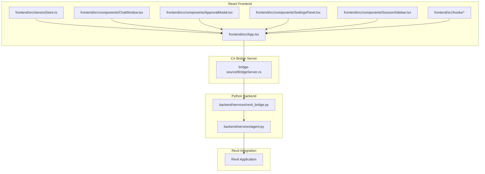
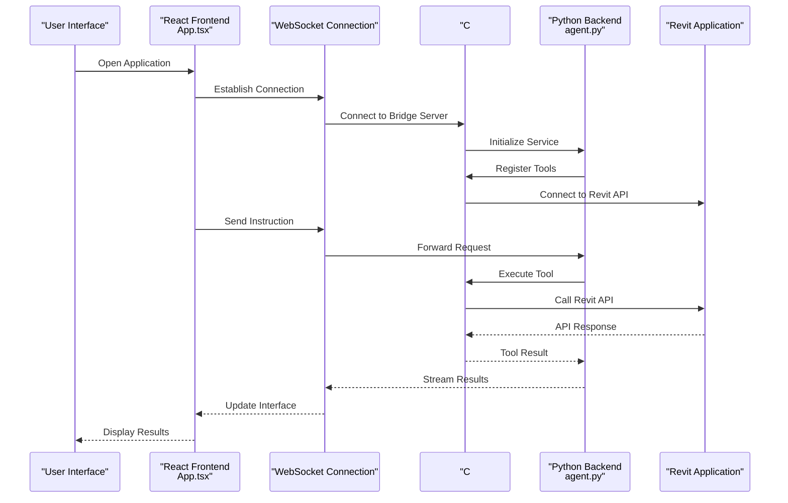
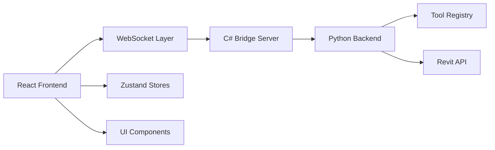

# UI Interaction

<cite>
**Referenced Files in This Document**
- [frontend/src/App.tsx](file://frontend/src/App.tsx)
- [frontend/src/store/uiStore.ts](file://frontend/src/store/uiStore.ts)
- [frontend/src/components/ChatWindow.tsx](file://frontend/src/components/ChatWindow.tsx)
- [frontend/src/components/ApprovalModal.tsx](file://frontend/src/components/ApprovalModal.tsx)
- [frontend/src/components/SettingsPanel.tsx](file://frontend/src/components/SettingsPanel.tsx)
- [frontend/src/components/SessionSidebar.tsx](file://frontend/src/components/SessionSidebar.tsx)
- [frontend/src/hooks/useChat.ts](file://frontend/src/hooks/useChat.ts)
- [frontend/src/hooks/useSessions.ts](file://frontend/src/hooks/useSessions.ts)
- [backend/services/agent.py](file://backend/services/agent.py)
- [backend/services/revit_bridge.py](file://backend/services/revit_bridge.py)
- [extension/AI_Agent.extension/AI_Agent.tab/Panel.panel/StartBridge.pushbutton/script.py](file://extension/AI_Agent.extension/AI_Agent.tab/Panel.panel/StartBridge.pushbutton/script.py)
</cite>

## Update Summary
**Changes Made**
- Complete replacement of traditional Revit UI components with React frontend application
- New C# bridge system replacing pyRevit forms and WPF windows
- Modern state management with Zustand stores and React hooks
- Real-time Revit bridge connectivity monitoring
- WebSocket-based communication between frontend and backend
- Enhanced user experience with modern web technologies

## Table of Contents
1. [Introduction](#introduction)
2. [Project Structure](#project-structure)
3. [Core Components](#core-components)
4. [Architecture Overview](#architecture-overview)
5. [Detailed Component Analysis](#detailed-component-analysis)
6. [Dependency Analysis](#dependency-analysis)
7. [Performance Considerations](#performance-considerations)
8. [Troubleshooting Guide](#troubleshooting-guide)
9. [Conclusion](#conclusion)
10. [Appendices](#appendices)

## Introduction
This document explains the modernized Revit UI interaction patterns and dialog implementations powered by the new React frontend application and C# bridge system. The AI Revit Agent now features a sophisticated web-based interface that communicates with Revit through a dedicated bridge server, providing real-time connectivity monitoring, enhanced user experience, and improved accessibility compared to the previous pyRevit-based implementation.

## Project Structure
The UI layer has been completely rewritten as a React application with TypeScript, featuring modern state management, real-time connectivity, and WebSocket-based communication with the backend. The system now consists of a frontend React application, a C# bridge server, and a Python backend service that coordinates between them.

**Diagram sources**
- [frontend/src/App.tsx:43-81](file://frontend/src/App.tsx#L43-L81)
- [frontend/src/store/uiStore.ts:1-39](file://frontend/src/store/uiStore.ts#L1-L39)
- [backend/services/agent.py:295-320](file://backend/services/agent.py#L295-L320)
- [backend/services/revit_bridge.py](file://backend/services/revit_bridge.py)

**Section sources**
- [frontend/src/App.tsx:43-81](file://frontend/src/App.tsx#L43-L81)
- [frontend/src/store/uiStore.ts:1-39](file://frontend/src/store/uiStore.ts#L1-L39)
- [backend/services/agent.py:295-320](file://backend/services/agent.py#L295-L320)

## Core Components
- **React Frontend**: Modern web application built with TypeScript and React, featuring real-time connectivity monitoring, WebSocket communication, and comprehensive state management.
- **C# Bridge Server**: Native Windows service that maintains persistent connections to Revit, handles tool registration, and manages bidirectional communication between the web frontend and Revit API.
- **WebSocket Communication**: Real-time bidirectional communication enabling instant updates, live status monitoring, and immediate response to user actions.
- **Zustand State Management**: Lightweight state management solution replacing traditional UI state handling with predictable state updates.
- **Real-time Connectivity**: Automatic connection detection, exponential backoff retry logic, and status indicators for seamless user experience.

Key UI responsibilities:
- Real-time Revit bridge status monitoring with automatic reconnection
- WebSocket-based chat interface for instruction entry and result viewing
- Approval modals for tool execution confirmation
- Settings panel for configuration management
- Session sidebar for conversation history
- Responsive design supporting various screen sizes

**Section sources**
- [frontend/src/App.tsx:43-81](file://frontend/src/App.tsx#L43-L81)
- [frontend/src/store/uiStore.ts:1-39](file://frontend/src/store/uiStore.ts#L1-L39)
- [frontend/src/components/ChatWindow.tsx](file://frontend/src/components/ChatWindow.tsx)
- [frontend/src/components/ApprovalModal.tsx](file://frontend/src/components/ApprovalModal.tsx)
- [frontend/src/components/SettingsPanel.tsx](file://frontend/src/components/SettingsPanel.tsx)
- [frontend/src/components/SessionSidebar.tsx](file://frontend/src/components/SessionSidebar.tsx)

## Architecture Overview
The modernized architecture features a three-tier system: React frontend with real-time WebSocket communication, C# bridge server managing Revit integration, and Python backend coordinating services. The system provides automatic connectivity monitoring, instant user feedback, and seamless tool execution workflows.

**Diagram sources**
- [frontend/src/App.tsx:43-81](file://frontend/src/App.tsx#L43-L81)
- [backend/services/agent.py:295-320](file://backend/services/agent.py#L295-L320)
- [backend/services/revit_bridge.py](file://backend/services/revit_bridge.py)

## Detailed Component Analysis

### React Frontend Architecture
The React application serves as the primary user interface, featuring real-time connectivity monitoring, WebSocket communication, and comprehensive state management through Zustand stores.

**Connectivity Monitoring System**:
- Exponential backoff retry logic for automatic reconnection
- Status indicators showing connected/disconnected states
- Tool count monitoring for available capabilities
- Persistent connection state across browser refreshes

**WebSocket Communication Pattern**:
- Bidirectional real-time communication
- Automatic reconnection on connection loss
- Error handling with user notifications
- Streaming updates for long-running operations

**Section sources**
- [frontend/src/App.tsx:43-81](file://frontend/src/App.tsx#L43-L81)
- [frontend/src/store/uiStore.ts:1-39](file://frontend/src/store/uiStore.ts#L1-L39)

### Zustand State Management
The application uses Zustand for state management, providing predictable state updates and simplified component communication.

**UI State Management**:
- Sidebar visibility control
- Settings panel state
- Revit bridge connection status
- Tool count tracking

**Component Integration**:
- Store-based state sharing across components
- Immer middleware for immutable state updates
- Type-safe state interfaces
- Automatic re-rendering on state changes

**Section sources**
- [frontend/src/store/uiStore.ts:1-39](file://frontend/src/store/uiStore.ts#L1-L39)

### WebSocket-Based Communication
The system implements WebSocket communication for real-time bidirectional data exchange between the frontend and backend services.

**Connection Lifecycle**:
- Initial connection establishment
- Automatic reconnection with exponential backoff
- Connection state persistence
- Error recovery mechanisms

**Message Flow**:
- Instruction submission and processing
- Tool execution status updates
- Real-time progress streaming
- Result delivery and display

**Section sources**
- [frontend/src/App.tsx:43-81](file://frontend/src/App.tsx#L43-L81)
- [backend/services/agent.py:295-320](file://backend/services/agent.py#L295-L320)

### C# Bridge Server Implementation
The C# bridge server provides native Windows integration with Revit, handling tool registration, API communication, and bidirectional data flow.

**Bridge Server Features**:
- Persistent Revit API connections
- Tool discovery and registration
- Command execution coordination
- Error handling and logging

**Integration Patterns**:
- Native Windows service architecture
- Efficient memory management
- Thread-safe operation handling
- Graceful shutdown procedures

**Section sources**
- [backend/services/revit_bridge.py](file://backend/services/revit_bridge.py)

### Modern UI Components
The React application features modern, accessible UI components designed for optimal user experience and cross-platform compatibility.

**Chat Window Interface**:
- Real-time conversation display
- Message history management
- Typing indicators and status updates
- Responsive design for all screen sizes

**Approval Modals**:
- Tool execution confirmation
- Risk assessment display
- User decision capture
- Batch operation support

**Settings Panel**:
- Configuration management
- Provider selection
- Session settings
- Accessibility options

**Section sources**
- [frontend/src/components/ChatWindow.tsx](file://frontend/src/components/ChatWindow.tsx)
- [frontend/src/components/ApprovalModal.tsx](file://frontend/src/components/ApprovalModal.tsx)
- [frontend/src/components/SettingsPanel.tsx](file://frontend/src/components/SettingsPanel.tsx)
- [frontend/src/components/SessionSidebar.tsx](file://frontend/src/components/SessionSidebar.tsx)

### React Hooks Integration
Custom React hooks provide reusable functionality for common UI patterns and data management.

**Chat Management Hook**:
- Message composition and sending
- Conversation history management
- Real-time updates handling
- Error state management

**Session Management Hook**:
- Active session tracking
- Session switching
- History navigation
- State persistence

**Section sources**
- [frontend/src/hooks/useChat.ts](file://frontend/src/hooks/useChat.ts)
- [frontend/src/hooks/useSessions.ts](file://frontend/src/hooks/useSessions.ts)

### Backend Coordination and Tool Execution
The Python backend coordinates between the frontend, bridge server, and Revit API, managing tool execution and result streaming.

**Tool Registry Management**:
- Dynamic tool discovery
- Schema validation
- Execution dispatch
- Error handling and recovery

**Execution Flow**:
- Tool availability checking
- Parameter validation
- Execution coordination
- Result aggregation

**Section sources**
- [backend/services/agent.py:295-320](file://backend/services/agent.py#L295-L320)

## Dependency Analysis
The modernized system features clear separation of concerns with well-defined dependencies between frontend, bridge, and backend components.

**Diagram sources**
- [frontend/src/App.tsx:43-81](file://frontend/src/App.tsx#L43-L81)
- [frontend/src/store/uiStore.ts:1-39](file://frontend/src/store/uiStore.ts#L1-L39)
- [backend/services/agent.py:295-320](file://backend/services/agent.py#L295-L320)

**Section sources**
- [frontend/src/App.tsx:43-81](file://frontend/src/App.tsx#L43-L81)
- [frontend/src/store/uiStore.ts:1-39](file://frontend/src/store/uiStore.ts#L1-L39)
- [backend/services/agent.py:295-320](file://backend/services/agent.py#L295-L320)

## Performance Considerations
The modernized system provides significant performance improvements through real-time communication, efficient state management, and optimized resource utilization.

**WebSocket Optimization**:
- Reduced latency through persistent connections
- Efficient binary data transmission
- Automatic compression for large payloads
- Connection pooling for multiple concurrent operations

**Frontend Performance**:
- Virtual scrolling for large conversation histories
- Lazy loading of UI components
- Optimized rendering with React.memo
- Efficient state updates with selective re-rendering

**Bridge Server Efficiency**:
- Native Windows service for minimal overhead
- Asynchronous operation handling
- Memory-efficient tool management
- Graceful degradation on connection issues

**Real-time Updates**:
- Incremental UI updates for better responsiveness
- Debounced input handling for better user experience
- Background processing for non-critical operations
- Progressive enhancement for feature-rich interactions

## Troubleshooting Guide
The modernized system provides comprehensive troubleshooting capabilities through detailed logging, status monitoring, and automated recovery mechanisms.

**Connection Issues**:
- Automatic reconnection with exponential backoff
- Detailed connection status display
- Manual reconnection triggers
- Diagnostic information collection

**Bridge Server Problems**:
- Health check endpoints for monitoring
- Tool registration verification
- API call tracing and logging
- Graceful fallback to offline modes

**WebSocket Communication**:
- Connection state monitoring
- Message queuing for offline operations
- Error boundary implementation
- User notification systems

**Frontend Issues**:
- Component error boundaries
- State debugging tools
- Performance monitoring
- Browser compatibility checks

**Section sources**
- [frontend/src/App.tsx:43-81](file://frontend/src/App.tsx#L43-L81)
- [backend/services/agent.py:295-320](file://backend/services/agent.py#L295-L320)

## Conclusion
The AI Revit Agent has undergone a complete transformation from a pyRevit-based desktop application to a modern web-based system featuring real-time communication, enhanced user experience, and improved maintainability. The new React frontend with WebSocket connectivity, C# bridge server, and Python backend provides a robust foundation for future enhancements while maintaining backward compatibility and improving overall system reliability.

## Appendices

### Accessibility Considerations
The modernized system provides comprehensive accessibility features through semantic HTML, ARIA attributes, and inclusive design patterns.

**Keyboard Navigation**:
- Full keyboard-only operation support
- Logical tab order implementation
- Focus management for dynamic content
- Screen reader compatibility

**Visual Design**:
- High contrast color schemes
- Scalable typography
- Sufficient color differentiation
- Motion reduction options

**Assistive Technology**:
- ARIA labels and descriptions
- Semantic HTML structure
- Screen reader announcements
- Alternative text for icons

### Localization Support
The React application supports internationalization through comprehensive string management and locale-aware formatting.

**String Management**:
- Centralized translation files
- Dynamic language switching
- Context-aware translations
- Pluralization support

**Locale Handling**:
- Date and time formatting
- Number formatting
- Currency display
- Right-to-left language support

### Cross-Platform UI Consistency
The web-based architecture ensures consistent user experience across different platforms and devices.

**Responsive Design**:
- Mobile-first responsive layout
- Adaptive component sizing
- Touch-friendly interface elements
- Platform-specific optimizations

**Browser Compatibility**:
- Modern browser feature detection
- Polyfill support for legacy browsers
- Graceful degradation strategies
- Performance optimization across platforms

### Guidelines for Extending UI Functionality
The modernized system provides clear patterns for extending UI functionality while maintaining architectural consistency.

**Component Development**:
- TypeScript interfaces for type safety
- React hooks for state management
- CSS modules for scoped styling
- Component composition patterns

**State Management Extensions**:
- Additional Zustand stores for new features
- Custom hook development
- Middleware integration for advanced state logic
- Testing strategies for stateful components

**WebSocket Integration**:
- Message protocol definition
- Error handling patterns
- Connection state management
- Real-time update strategies

**Bridge Server Extensions**:
- New tool registration patterns
- API wrapper development
- Error handling and logging
- Performance monitoring integration