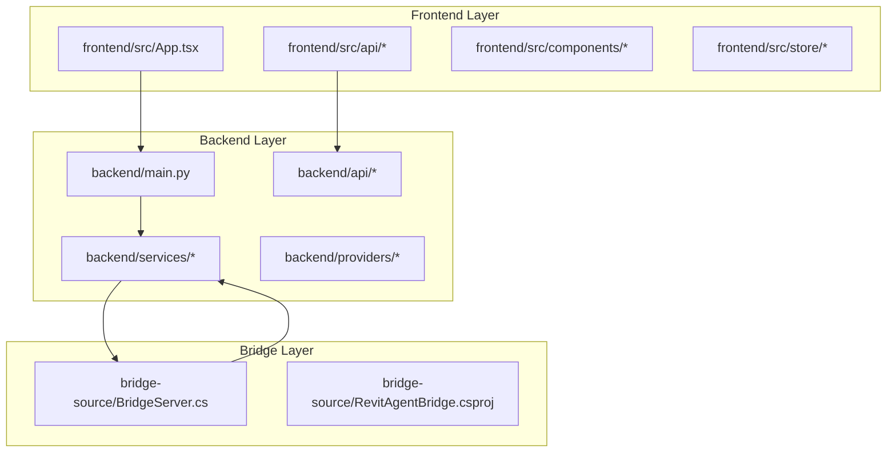
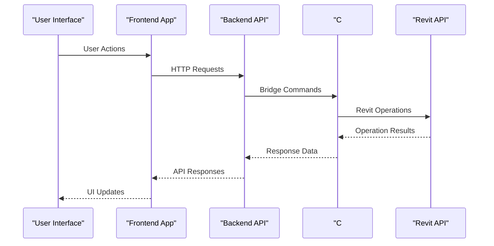
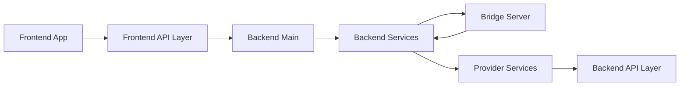

# Testing and Validation

<cite>
**Referenced Files in This Document**
- [README.md](file://README.md)
- [script.py](file://extension/AI_Agent.extension/AI_Agent.tab/Panel.panel/StartBridge.pushbutton/script.py)
- [main.py](file://backend/main.py)
- [chat.py](file://backend/api/chat.py)
- [providers.py](file://backend/api/providers.py)
- [sessions.py](file://backend/api/sessions.py)
- [settings.py](file://backend/api/settings.py)
- [agent.py](file://backend/services/agent.py)
- [revit_bridge.py](file://backend/services/revit_bridge.py)
- [streaming.py](file://backend/services/streaming.py)
- [tool_registry.py](file://backend/services/tool_registry.py)
- [anthropic.py](file://backend/providers/anthropic.py)
- [base.py](file://backend/providers/base.py)
- [gemini.py](file://backend/providers/gemini.py)
- [groq.py](file://backend/providers/groq.py)
- [openai.py](file://backend/providers/openai.py)
- [openai_compat.py](file://backend/providers/openai_compat.py)
- [openrouter.py](file://backend/providers/openrouter.py)
- [tools.json](file://backend/schemas/tools.json)
- [BridgeServer.cs](file://bridge-source/BridgeServer.cs)
- [chat.ts](file://frontend/src/api/chat.ts)
- [client.ts](file://frontend/src/api/client.ts)
- [settings.ts](file://frontend/src/api/settings.ts)
- [App.tsx](file://frontend/src/App.tsx)
</cite>

## Update Summary
**Changes Made**
- Removed references to old interpreter, planner, and runtime components that no longer exist
- Updated architecture to reflect the new backend API service and C# bridge integration
- Added testing strategies for the web application and C# bridge components
- Revised testing approaches to accommodate the split between web application and desktop bridge
- Updated component analysis to reflect current backend services and frontend architecture

## Table of Contents
1. [Introduction](#introduction)
2. [Project Structure](#project-structure)
3. [Core Components](#core-components)
4. [Architecture Overview](#architecture-overview)
5. [Detailed Component Analysis](#detailed-component-analysis)
6. [Dependency Analysis](#dependency-analysis)
7. [Performance Considerations](#performance-considerations)
8. [Troubleshooting Guide](#troubleshooting-guide)
9. [Conclusion](#conclusion)
10. [Appendices](#appendices)

## Introduction
This document provides comprehensive testing and validation guidance for the AI Revit Agent system. The system has evolved to a modern architecture with separate web application and C# bridge components, requiring different testing approaches than the previous monolithic design.

Key testing objectives for the new architecture:
- Backend API service testing for chat, providers, sessions, and settings endpoints
- C# bridge server testing for Revit integration and communication protocols
- Frontend application testing for user interface, state management, and API integration
- Cross-component integration testing between web application, bridge server, and Revit
- Provider compatibility testing across multiple AI model providers
- Streaming response validation and real-time communication testing

The system now features a clean separation between:
- Web application layer (React frontend with TypeScript)
- Backend API service (FastAPI backend)
- C# bridge server (Revit integration layer)
- AI provider services (OpenAI, Anthropic, Gemini, Groq, OpenRouter)

## Project Structure
The repository is organized into three main architectural layers:

**Diagram sources**
- [main.py](file://backend/main.py)
- [chat.ts](file://frontend/src/api/chat.ts)
- [BridgeServer.cs](file://bridge-source/BridgeServer.cs)

**Section sources**
- [README.md](file://README.md)
- [main.py](file://backend/main.py)
- [App.tsx](file://frontend/src/App.tsx)

## Core Components
The testing framework now covers three distinct layers with specialized testing approaches:

### Frontend Application Testing
- React components testing with Jest and React Testing Library
- State management testing for stores and hooks
- API integration testing for chat, settings, and session management
- User interface validation and interaction testing

### Backend API Service Testing
- FastAPI endpoint testing for chat, providers, sessions, and settings
- Database integration testing and migration validation
- Service layer testing for agent operations and bridge communication
- Provider service testing for external AI model integrations

### C# Bridge Server Testing
- Revit API integration testing and validation
- Communication protocol testing between bridge and backend
- Memory management and performance testing
- Error handling and recovery testing

**Section sources**
- [chat.ts](file://frontend/src/api/chat.ts)
- [client.ts](file://frontend/src/api/client.ts)
- [settings.ts](file://frontend/src/api/settings.ts)
- [main.py](file://backend/main.py)
- [agent.py](file://backend/services/agent.py)
- [revit_bridge.py](file://backend/services/revit_bridge.py)
- [BridgeServer.cs](file://bridge-source/BridgeServer.cs)

## Architecture Overview
The new architecture implements a distributed testing strategy across three layers with clear separation of concerns:

**Diagram sources**
- [App.tsx](file://frontend/src/App.tsx)
- [main.py](file://backend/main.py)
- [BridgeServer.cs](file://bridge-source/BridgeServer.cs)

## Detailed Component Analysis

### Frontend Application Testing
Objectives:
- Validate React component rendering and user interactions
- Test state management and data flow between components
- Ensure proper API integration and error handling
- Verify responsive design and accessibility compliance

Test Scenarios:
- Component mounting and unmounting
- User input validation and form submission
- Real-time chat interface testing
- Session management and authentication flows
- Provider selection and configuration UI
- Error boundary and fallback component testing

Expected Outcomes:
- Components render correctly with proper props and state
- User interactions trigger appropriate state changes
- API calls succeed with proper error handling
- UI responds appropriately to loading states and errors

Testing Approaches:
- Unit testing for individual components and hooks
- Integration testing for component interactions
- End-to-end testing for complete user workflows
- Performance testing for component rendering and memory usage

**Section sources**
- [App.tsx](file://frontend/src/App.tsx)
- [chat.ts](file://frontend/src/api/chat.ts)
- [client.ts](file://frontend/src/api/client.ts)
- [settings.ts](file://frontend/src/api/settings.ts)

### Backend API Service Testing
Objectives:
- Validate FastAPI endpoint functionality and data validation
- Test database operations and migration integrity
- Ensure proper service layer coordination and error handling
- Validate provider service integration and external API compatibility

Test Scenarios:
- Chat endpoint testing for message processing and streaming
- Provider endpoint testing for model availability and configuration
- Session endpoint testing for user session management
- Settings endpoint testing for configuration validation
- Agent service testing for workflow orchestration
- Tool registry testing for available operations

Expected Outcomes:
- All endpoints return appropriate HTTP status codes
- Data validation succeeds for valid inputs and fails for invalid inputs
- Database operations maintain data integrity and consistency
- Service layer handles errors gracefully with proper logging

Testing Approaches:
- Unit testing for individual API endpoints and services
- Integration testing for database and external service interactions
- Load testing for concurrent request handling
- Security testing for authentication and authorization

**Section sources**
- [main.py](file://backend/main.py)
- [chat.py](file://backend/api/chat.py)
- [providers.py](file://backend/api/providers.py)
- [sessions.py](file://backend/api/sessions.py)
- [settings.py](file://backend/api/settings.py)
- [agent.py](file://backend/services/agent.py)
- [tool_registry.py](file://backend/services/tool_registry.py)

### C# Bridge Server Testing
Objectives:
- Validate Revit API integration and element manipulation
- Test communication protocols between bridge and backend services
- Ensure memory management and performance optimization
- Validate error handling and recovery mechanisms

Test Scenarios:
- Bridge server startup and shutdown procedures
- Revit document access and modification operations
- Element creation and modification testing
- Parameter extraction and validation
- Communication protocol testing for command execution
- Memory leak detection and resource cleanup

Expected Outcomes:
- Bridge server initializes correctly and maintains stable connection
- Revit operations complete successfully without document corruption
- Communication protocols handle various command formats and responses
- Memory usage remains within acceptable limits during extended operations

Testing Approaches:
- Unit testing for individual bridge methods and operations
- Integration testing for Revit API interactions
- Performance testing for long-running operations
- Stress testing for concurrent bridge operations

**Section sources**
- [BridgeServer.cs](file://bridge-source/BridgeServer.cs)
- [revit_bridge.py](file://backend/services/revit_bridge.py)

### Provider Compatibility Testing
Objectives:
- Validate integration with multiple AI model providers
- Test provider-specific configurations and authentication
- Ensure consistent API responses across different providers
- Validate error handling and fallback mechanisms

Test Scenarios:
- Provider initialization and authentication testing
- Model parameter validation and configuration
- Response format consistency across providers
- Error handling for network issues and API limitations
- Rate limiting and quota management testing

Expected Outcomes:
- All providers initialize successfully with valid credentials
- API responses conform to expected schemas and formats
- Error conditions are handled gracefully with meaningful error messages
- Fallback mechanisms work correctly when primary providers fail

**Section sources**
- [anthropic.py](file://backend/providers/anthropic.py)
- [base.py](file://backend/providers/base.py)
- [gemini.py](file://backend/providers/gemini.py)
- [groq.py](file://backend/providers/groq.py)
- [openai.py](file://backend/providers/openai.py)
- [openai_compat.py](file://backend/providers/openai_compat.py)
- [openrouter.py](file://backend/providers/openrouter.py)

### Streaming Response Testing
Objectives:
- Validate real-time streaming response functionality
- Test progressive content delivery and UI updates
- Ensure proper buffering and error handling during streaming
- Validate connection stability and recovery mechanisms

Test Scenarios:
- Stream initialization and connection establishment
- Progressive content delivery and UI synchronization
- Network interruption and recovery testing
- Buffer overflow and performance testing under load

Expected Outcomes:
- Streams establish connections successfully and deliver content progressively
- UI updates occur in real-time without blocking or freezing
- Errors during streaming are handled gracefully with recovery attempts
- Performance remains stable under various load conditions

**Section sources**
- [streaming.py](file://backend/services/streaming.py)
- [chat.ts](file://frontend/src/api/chat.ts)

## Dependency Analysis
The new architecture introduces dependencies between the three layers with clear integration points:

**Diagram sources**
- [App.tsx](file://frontend/src/App.tsx)
- [main.py](file://backend/main.py)
- [BridgeServer.cs](file://bridge-source/BridgeServer.cs)

**Section sources**
- [main.py](file://backend/main.py)
- [agent.py](file://backend/services/agent.py)
- [revit_bridge.py](file://backend/services/revit_bridge.py)

## Performance Considerations
- Frontend performance testing for component rendering and state management
- Backend API performance testing for concurrent request handling and database operations
- Bridge server performance testing for Revit API operations and memory usage
- Provider service performance testing for external API rate limiting and response times
- Streaming performance testing for real-time content delivery and bandwidth utilization

## Troubleshooting Guide
Common failure modes and detection strategies for the new architecture:

### Frontend Issues
- Symptoms: UI not responding, components not rendering, API calls failing
- Detection: Browser developer tools, React DevTools, network tab analysis
- Resolution: Component lifecycle debugging, state management validation

### Backend API Issues
- Symptoms: Endpoint timeouts, database connection failures, service unavailability
- Detection: Backend logs, health checks, database monitoring
- Resolution: Service restart, database connection pooling, provider authentication

### Bridge Server Issues
- Symptoms: Revit crashes, memory leaks, communication failures
- Detection: Bridge logs, Revit API monitoring, memory profiling
- Resolution: Resource cleanup, connection pooling, error recovery mechanisms

### Provider Integration Issues
- Symptoms: Authentication failures, API rate limiting, response format errors
- Detection: Provider logs, API response validation, error tracking
- Resolution: Credential management, retry mechanisms, fallback strategies

**Section sources**
- [main.py](file://backend/main.py)
- [BridgeServer.cs](file://bridge-source/BridgeServer.cs)
- [chat.ts](file://frontend/src/api/chat.ts)

## Conclusion
The AI Revit Agent's new architecture enables comprehensive testing across three distinct layers with specialized approaches for each component. The separation between frontend, backend, and bridge components allows for focused testing while maintaining integration validation. This distributed testing strategy ensures reliability, performance, and maintainability across all system components.

## Appendices

### Testing Framework Setup
Recommended testing frameworks and configurations:
- Frontend: Jest, React Testing Library, Cypress for E2E testing
- Backend: Pytest, FastAPI TestClient, SQLAlchemy for database testing
- Bridge: NUnit, MSTest, or xUnit for C# testing
- Integration: Docker Compose for environment testing, Postman for API testing

### Test Data Management
- Use fixture-based testing for consistent data across test runs
- Implement test database snapshots for backend testing
- Create mock data generators for frontend component testing
- Use environment-specific test configurations for different deployment scenarios

### Continuous Integration Testing
- Automated testing in CI/CD pipelines for all three layers
- Parallel test execution for improved feedback loops
- Test coverage reporting and quality gates
- Performance regression testing in staging environments

**Section sources**
- [README.md](file://README.md)
- [main.py](file://backend/main.py)
- [BridgeServer.cs](file://bridge-source/BridgeServer.cs)
- [App.tsx](file://frontend/src/App.tsx)