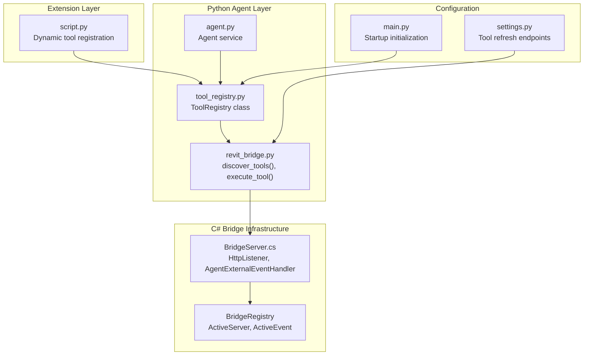
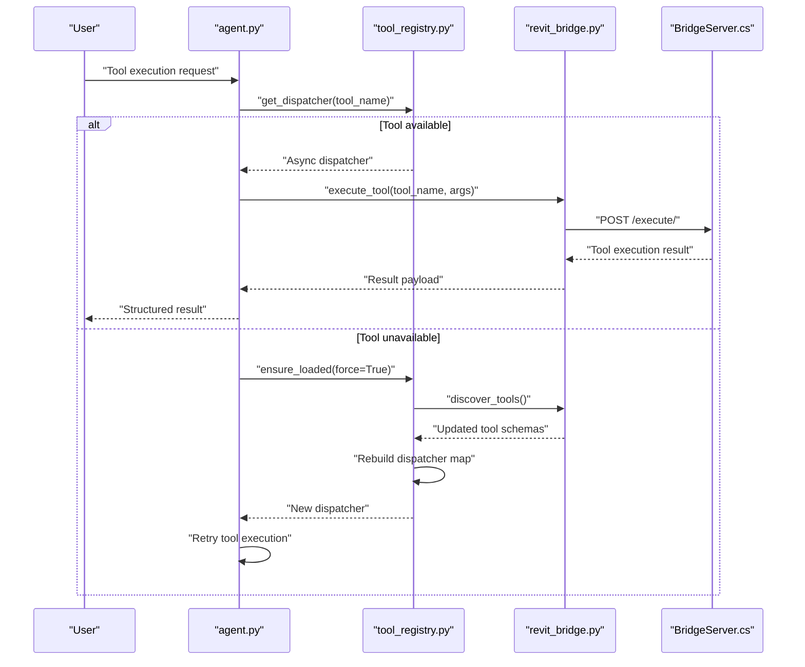
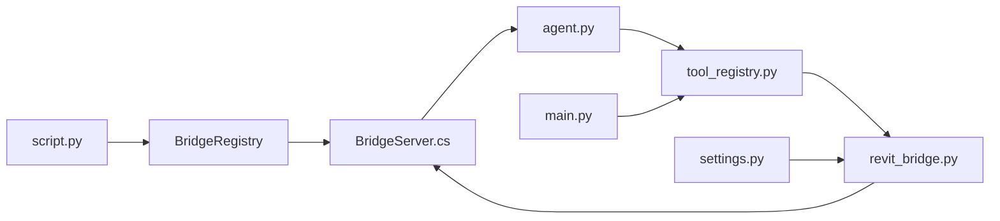

# Utilities and Tools

<cite>
**Referenced Files in This Document**
- [script.py](file://extension/AI_Agent.extension/AI_Agent.tab/Panel.panel/StartBridge.pushbutton/script.py)
- [tool_registry.py](file://backend/services/tool_registry.py)
- [revit_bridge.py](file://backend/services/revit_bridge.py)
- [agent.py](file://backend/services/agent.py)
- [BridgeServer.cs](file://bridge-source/BridgeServer.cs)
- [main.py](file://backend/main.py)
- [settings.py](file://backend/api/settings.py)
</cite>

## Update Summary
**Changes Made**
- Removed all references to the old static tool system and conversion utilities
- Added comprehensive documentation for the new dynamic tool discovery system
- Updated architecture diagrams to reflect C# bridge-based tool execution
- Removed deprecated validation utilities, payload loaders, and helper functions
- Added new sections covering dynamic tool registration and execution flow

## Table of Contents
1. [Introduction](#introduction)
2. [Project Structure](#project-structure)
3. [Core Components](#core-components)
4. [Architecture Overview](#architecture-overview)
5. [Detailed Component Analysis](#detailed-component-analysis)
6. [Dependency Analysis](#dependency-analysis)
7. [Performance Considerations](#performance-considerations)
8. [Troubleshooting Guide](#troubleshooting-guide)
9. [Conclusion](#conclusion)
10. [Appendices](#appendices)

## Introduction
This document describes the utility functions and helper tools that underpin the AI Revit Agent system. The system has evolved from a static tool architecture to a dynamic discovery-based approach powered by a C# bridge. The new architecture enables real-time tool discovery, dynamic execution routing, and seamless integration between Python agents and Revit's C# bridge infrastructure.

## Project Structure
The utilities now center around dynamic tool discovery and execution through the C# bridge. The system consists of three main layers: the Python agent service layer, the bridge communication layer, and the Revit bridge infrastructure. The extension script provides dynamic tool registration capabilities through an in-closure registry system.

**Diagram sources**
- [tool_registry.py:62-183](file://backend/services/tool_registry.py#L62-L183)
- [revit_bridge.py:91-172](file://backend/services/revit_bridge.py#L91-L172)
- [agent.py:295-320](file://backend/services/agent.py#L295-L320)
- [BridgeServer.cs:11-84](file://bridge-source/BridgeServer.cs#L11-L84)
- [script.py:85-107](file://extension/AI_Agent.extension/AI_Agent.tab/Panel.panel/StartBridge.pushbutton/script.py#L85-L107)
- [main.py:81-86](file://backend/main.py#L81-L86)
- [settings.py:86-99](file://backend/api/settings.py#L86-L99)

**Section sources**
- [tool_registry.py:1-183](file://backend/services/tool_registry.py#L1-L183)
- [revit_bridge.py:1-172](file://backend/services/revit_bridge.py#L1-L172)
- [agent.py:295-320](file://backend/services/agent.py#L295-L320)
- [BridgeServer.cs:1-84](file://bridge-source/BridgeServer.cs#L1-L84)
- [script.py:1-107](file://extension/AI_Agent.extension/AI_Agent.tab/Panel.panel/StartBridge.pushbutton/script.py#L1-L107)
- [main.py:81-86](file://backend/main.py#L81-L86)
- [settings.py:86-99](file://backend/api/settings.py#L86-L99)

## Core Components
- **Dynamic Tool Registry**: The ToolRegistry class manages tool schemas and dispatcher maps for the entire server lifetime. It loads schemas once at startup and maintains read-only access throughout the application lifecycle.
- **Bridge Communication Service**: The revit_bridge module handles HTTP communication with the C# BridgeServer, including tool discovery, execution, and health monitoring.
- **Dynamic Tool Registration**: The extension script provides an in-closure tool registry system that allows Python functions to be dynamically registered as Revit tools with full schema metadata.
- **Agent Service Integration**: The agent service coordinates tool execution, handles lazy re-discovery, and manages tool availability across requests.

Key interfaces and responsibilities:
- ToolRegistry.load(): Populates the registry from discovered schemas and builds dispatcher maps
- discover_tools(): Retrieves tool schemas from the C# BridgeServer via HTTP API
- execute_tool(): Executes individual tools through the bridge with proper error handling
- Dynamic registration: register_tool() decorator factory for Python function registration

**Section sources**
- [tool_registry.py:62-183](file://backend/services/tool_registry.py#L62-L183)
- [revit_bridge.py:91-172](file://backend/services/revit_bridge.py#L91-L172)
- [script.py:85-107](file://extension/AI_Agent.extension/AI_Agent.tab/Panel.panel/StartBridge.pushbutton/script.py#L85-L107)
- [agent.py:295-320](file://backend/services/agent.py#L295-L320)

## Architecture Overview
The new architecture implements a dynamic discovery pattern:
- The ToolRegistry loads tool schemas from the C# BridgeServer during startup
- Each tool schema is transformed into an async dispatcher that routes calls to the bridge
- The agent service lazily re-discovers tools when they become available after initial startup
- Dynamic tool registration allows Python functions to be exposed as Revit tools through the bridge

**Diagram sources**
- [agent.py:295-320](file://backend/services/agent.py#L295-L320)
- [tool_registry.py:111-151](file://backend/services/tool_registry.py#L111-L151)
- [revit_bridge.py:91-121](file://backend/services/revit_bridge.py#L91-L121)
- [BridgeServer.cs:79-172](file://bridge-source/BridgeServer.cs#L79-L172)

## Detailed Component Analysis

### Dynamic Tool Registry System
Purpose:
- Manage tool schemas and dispatcher maps for the entire server lifetime
- Handle lazy re-discovery of tools when the bridge becomes available
- Provide classified access to read vs write tools

Core functionality:
- One-time schema loading during startup with subsequent read-only access
- Automatic re-discovery attempts with cooldown protection
- Dispatcher map construction for async tool execution
- Tool classification based on naming conventions and explicit flags

Usage examples (paths only):
- Initialize and load tool registry: [tool_registry.py:77-100](file://backend/services/tool_registry.py#L77-L100)
- Lazy re-discovery mechanism: [tool_registry.py:111-151](file://backend/services/tool_registry.py#L111-L151)
- Dispatcher creation: [tool_registry.py:171-183](file://backend/services/tool_registry.py#L171-L183)

**Section sources**
- [tool_registry.py:62-183](file://backend/services/tool_registry.py#L62-L183)

### C# Bridge Communication Service
Purpose:
- Handle HTTP communication with the Revit BridgeServer
- Implement tool discovery and execution protocols
- Provide development mode fallbacks and caching

Core functions:
- discover_tools(): HTTP GET to retrieve tool schemas with caching support
- execute_tool(): HTTP POST to execute individual tools with timeout handling
- Development mode fallback: Load cached schemas when bridge is unreachable
- Health monitoring and error handling

Usage examples (paths only):
- Tool discovery with caching: [revit_bridge.py:91-121](file://backend/services/revit_bridge.py#L91-L121)
- Tool execution via bridge: [revit_bridge.py:167-172](file://backend/services/revit_bridge.py#L167-L172)
- Cached schema loading: [revit_bridge.py:145-160](file://backend/services/revit_bridge.py#L145-L160)

**Section sources**
- [revit_bridge.py:1-172](file://backend/services/revit_bridge.py#L1-L172)

### Dynamic Tool Registration System
Purpose:
- Enable Python functions to be dynamically registered as Revit tools
- Provide schema-based tool definition with parameter validation
- Support agent-specific instructions and approval requirements

Core functionality:
- In-closure registry that survives C# bridge calls
- Decorator-based tool registration system
- Schema validation and parameter specification
- Agent instructions embedding for tool descriptions

Usage examples (paths only):
- Tool registration decorator: [script.py:92-107](file://extension/AI_Agent.extension/AI_Agent.tab/Panel.panel/StartBridge.pushbutton/script.py#L92-L107)
- Dynamic registry management: [script.py:85-107](file://extension/AI_Agent.extension/AI_Agent.tab/Panel.panel/StartBridge.pushbutton/script.py#L85-L107)

**Section sources**
- [script.py:1-107](file://extension/AI_Agent.extension/AI_Agent.tab/Panel.panel/StartBridge.pushbutton/script.py#L1-L107)

### Agent Service Integration
Purpose:
- Coordinate tool execution across the dynamic discovery system
- Handle lazy re-discovery when tools become available
- Manage tool availability and error reporting

Core functionality:
- Tool dispatcher resolution with fallback mechanisms
- Lazy re-discovery on first tool execution
- Structured error handling for unavailable tools
- SSE event emission for tool execution progress

Usage examples (paths only):
- Tool execution with re-discovery: [agent.py:295-320](file://backend/services/agent.py#L295-L320)
- Dispatcher retrieval: [agent.py:298-306](file://backend/services/agent.py#L298-L306)

**Section sources**
- [agent.py:295-320](file://backend/services/agent.py#L295-L320)

### C# Bridge Infrastructure
Purpose:
- Provide HTTP server interface for tool discovery and execution
- Handle Python function execution within Revit's main thread
- Manage concurrent task queuing and completion events

Core components:
- HttpListener-based HTTP server for tool APIs
- AgentExternalEventHandler for thread-safe Python execution
- Concurrent queue for managing tool execution tasks
- BridgeRegistry for maintaining active server and event references

Usage examples (paths only):
- HTTP listener setup: [BridgeServer.cs:79-172](file://bridge-source/BridgeServer.cs#L79-L172)
- Task queue management: [BridgeServer.cs:31-77](file://bridge-source/BridgeServer.cs#L31-L77)
- Python execution delegation: [BridgeServer.cs:46-76](file://bridge-source/BridgeServer.cs#L46-L76)

**Section sources**
- [BridgeServer.cs:1-172](file://bridge-source/BridgeServer.cs#L1-L172)

## Dependency Analysis
The new architecture creates a clean separation between the Python agent layer and the C# bridge infrastructure:
- ToolRegistry depends on revit_bridge for discovery and execution
- Agent service depends on ToolRegistry for tool dispatching
- Extension script provides dynamic tool registration to the bridge
- BridgeServer handles HTTP communication and Python execution coordination

**Diagram sources**
- [script.py:28-28](file://extension/AI_Agent.extension/AI_Agent.tab/Panel.panel/StartBridge.pushbutton/script.py#L28-L28)
- [BridgeServer.cs:11-15](file://bridge-source/BridgeServer.cs#L11-L15)
- [agent.py:295-320](file://backend/services/agent.py#L295-L320)
- [tool_registry.py:62-183](file://backend/services/tool_registry.py#L62-L183)
- [revit_bridge.py:91-172](file://backend/services/revit_bridge.py#L91-L172)
- [main.py:81-86](file://backend/main.py#L81-L86)
- [settings.py:86-99](file://backend/api/settings.py#L86-L99)

**Section sources**
- [tool_registry.py:1-183](file://backend/services/tool_registry.py#L1-L183)
- [revit_bridge.py:1-172](file://backend/services/revit_bridge.py#L1-L172)
- [agent.py:295-320](file://backend/services/agent.py#L295-L320)
- [BridgeServer.cs:1-172](file://bridge-source/BridgeServer.cs#L1-L172)
- [script.py:1-107](file://extension/AI_Agent.extension/AI_Agent.tab/Panel.panel/StartBridge.pushbutton/script.py#L1-L107)
- [main.py:81-86](file://backend/main.py#L81-L86)
- [settings.py:86-99](file://backend/api/settings.py#L86-L99)

## Performance Considerations
- **Lazy Loading**: Tool schemas are loaded once and cached, minimizing repeated discovery overhead
- **Cooldown Protection**: Automatic re-discovery attempts respect a 5-second cooldown to prevent bridge hammering
- **Concurrent Execution**: The C# bridge uses concurrent queues for efficient task processing
- **Memory Management**: In-closure registry ensures proper garbage collection in IronPython environment
- **HTTP Optimization**: Cached schemas reduce network overhead during development mode

## Troubleshooting Guide
Common issues and resolutions:
- **Bridge Unreachable**: The system falls back to cached schemas in development mode; check bridge connectivity and ensure Revit is running
  - Reference: [revit_bridge.py:122-142](file://backend/services/revit_bridge.py#L122-L142)
- **Tool Not Available**: Lazy re-discovery attempts to refresh tools when they become available; wait for bridge to start or manually refresh
  - Reference: [agent.py:300-320](file://backend/services/agent.py#L300-L320)
- **Dynamic Registration Issues**: Ensure the in-closure registry is properly maintained and Python functions are decorated with register_tool
  - Reference: [script.py:85-107](file://extension/AI_Agent.extension/AI_Agent.tab/Panel.panel/StartBridge.pushbutton/script.py#L85-L107)
- **Execution Timeout**: The default 120-second timeout can be adjusted in execute_tool; check for long-running operations
  - Reference: [revit_bridge.py:167-172](file://backend/services/revit_bridge.py#L167-L172)
- **Dispatcher Not Found**: Verify tool name matches exactly and check the tool registry schemas
  - Reference: [tool_registry.py:153-155](file://backend/services/tool_registry.py#L153-L155)

**Section sources**
- [revit_bridge.py:122-142](file://backend/services/revit_bridge.py#L122-L142)
- [agent.py:300-320](file://backend/services/agent.py#L300-L320)
- [script.py:85-107](file://extension/AI_Agent.extension/AI_Agent.tab/Panel.panel/StartBridge.pushbutton/script.py#L85-L107)
- [revit_bridge.py:167-172](file://backend/services/revit_bridge.py#L167-L172)
- [tool_registry.py:153-155](file://backend/services/tool_registry.py#L153-L155)

## Conclusion
The new dynamic tool discovery architecture provides a robust foundation for AI-powered Revit operations. By leveraging the C# bridge infrastructure and dynamic registration system, the platform achieves seamless integration between Python agents and Revit's native capabilities. The architecture supports lazy loading, automatic recovery, and scalable tool execution while maintaining clean separation of concerns across the system layers.

## Appendices

### Usage Examples (Paths Only)
- Initialize tool registry: [tool_registry.py:77-100](file://backend/services/tool_registry.py#L77-L100)
- Register dynamic tool: [script.py:92-107](file://extension/AI_Agent.extension/AI_Agent.tab/Panel.panel/StartBridge.pushbutton/script.py#L92-L107)
- Execute tool via bridge: [revit_bridge.py:167-172](file://backend/services/revit_bridge.py#L167-L172)
- Manual tool refresh: [settings.py:86-99](file://backend/api/settings.py#L86-L99)
- Agent tool execution: [agent.py:295-320](file://backend/services/agent.py#L295-L320)

### Extending the Utility Library
- **Add new tools**: Use the register_tool decorator in the extension script to expose Python functions as Revit tools
- **Customize tool schemas**: Include agent instructions and parameter specifications in the registration decorator
- **Handle approvals**: Set requires_approval flag in tool schemas for security-conscious operations
- **Monitor execution**: Use the debug logging system to track tool execution and errors
- **Development mode**: Leverage cached schema fallback for offline development scenarios

**Section sources**
- [script.py:92-107](file://extension/AI_Agent.extension/AI_Agent.tab/Panel.panel/StartBridge.pushbutton/script.py#L92-L107)
- [settings.py:86-99](file://backend/api/settings.py#L86-L99)
- [agent.py:295-320](file://backend/services/agent.py#L295-L320)