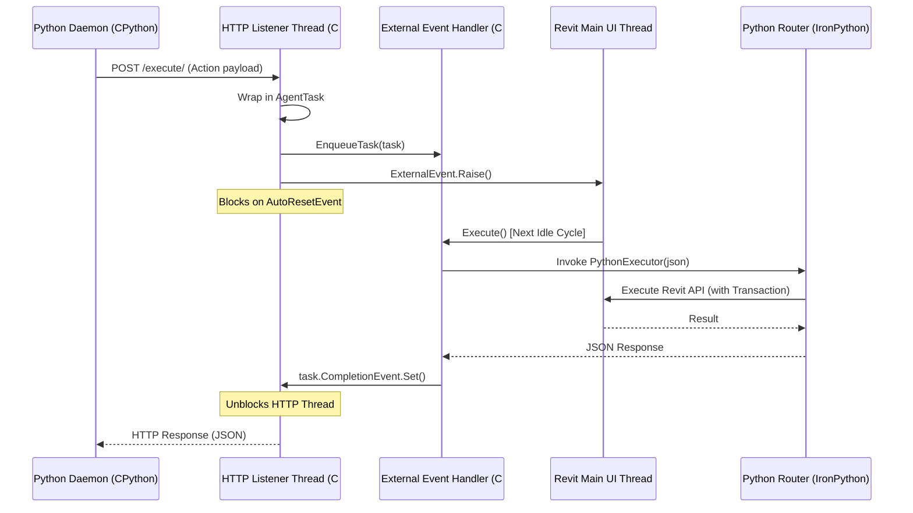

# Project Documentation: Revit AI Agent

This document provides a concise, AI-optimized overview of the Revit AI Agent repository. It is designed to enable an AI agent to quickly understand, maintain, debug, and extend the system with minimal repository exploration.

---

## 1. Project Purpose
The **Revit AI Agent** is an integration framework that connects an external LLM agent (powered by the Google Gemini API) directly to Autodesk Revit 2025. It allows the LLM to query the live BIM model context and make safe, thread-controlled modifications (e.g. placing family instances, creating sheets, or creating gridlines) via natural language commands.

---

## 2. Tech Stack
- **BIM Environment**: Autodesk Revit 2025
- **Revit Add-in UI**: pyRevit (IronPython 2.7 framework wrapper for Revit API)
- **Bridge Backend**: C# (.NET 8.0-windows, targeted for Revit 2025 Core)
- **Local AI Daemon**: Python 3.11+ (Standard CPython)
- **AI Platform**: Google GenAI SDK (`google-genai` package)
- **IPC Protocol**: HTTP/JSON over localhost (Port `8080`)

---

## 3. Architecture & Threading Model
Revit's API execution is strictly single-threaded and requires all commands to run on Revit's main UI thread. Direct multi-threaded calls to the Revit API from background listeners will cause immediate application crashes. 

To overcome this, the project implements a thread-safe asynchronous execution pipeline:



### Flow Breakdown
1. **Background Listener**: The C# [BridgeServer](file:///d:/Construction/Projects/ai_revit_agent/bridge-source/BridgeServer.cs#L79-L168) runs an `HttpListener` on a background thread.
2. **Task Enqueuing**: When a POST request arrives, the server wraps the request in an [AgentTask](file:///d:/Construction/Projects/ai_revit_agent/bridge-source/BridgeServer.cs#L17-L29) and pushes it to a thread-safe `ConcurrentQueue<AgentTask>` within the [AgentExternalEventHandler](file:///d:/Construction/Projects/ai_revit_agent/bridge-source/BridgeServer.cs#L31-L77).
3. **Signaling Revit**: The background thread raises a Revit `ExternalEvent`, which alerts Revit's main UI thread.
4. **Blocking**: The background thread blocks using `AutoResetEvent` while waiting for execution.
5. **Main Thread Execution**: During its next idle cycle, Revit's main thread runs the event handler's `Execute` method.
6. **Python Delegate Dispatch**: C# dequeues the task and invokes the registered [python_execution_router](file:///d:/Construction/Projects/ai_revit_agent/extension/AI_Agent.extension/AI_Agent.tab/Panel.panel/StartBridge.pushbutton/script.py#L28-L211) delegate.
7. **BIM Transaction**: The router runs inside the Revit document context, executes the API commands inside a `Transaction`, and returns a JSON payload.
8. **Resuming**: The handler sets the `CompletionEvent`, unblocking the HTTP thread to return the JSON response to the caller.

---

## 4. Major Components & Code Organization
- **C# Bridge Server Library** ([bridge-source](file:///d:/Construction/Projects/ai_revit_agent/bridge-source)):
  - Defines the core threading and server implementation.
  - Generates `RevitAgentBridge.dll`.
- **pyRevit Extension Bundle** ([extension](file:///d:/Construction/Projects/ai_revit_agent/extension)):
  - Declares the custom "AI Agent" ribbon tab, panel, and "Start Bridge" button.
  - Implements the IronPython execution router, fetch tools, and action tools.
- **Python Daemon** ([daemon](file:///d:/Construction/Projects/ai_revit_agent/daemon)):
  - Modular package structure:
    - `bridge/client.py` — Bridge HTTP communication and tool discovery.
    - `agent/loop.py` — Gemini chat loop with smart context-fetching system prompt.
    - `orchestrator.py` — Slim entry point with interactive prompt loop.
    - `tests/` — Unit tests and connection diagnostics.

---

## 5. IPC Protocol & API Specifications
The bridge exposes two HTTP endpoints:

| Endpoint | Method | Purpose |
|---|---|---|
| `http://127.0.0.1:8080/tools/` | `GET` | Returns the full JSON schema registry of all registered tools |
| `http://127.0.0.1:8080/execute/` | `POST` | Executes a named tool action with parameters |

### `GET /tools/`
The daemon calls this at startup to auto-discover all available tools without any manual configuration. This includes both **fetch tools** (read-only context queries) and **action tools** (BIM modifications).
- **Response Payload** (abbreviated):
  ```json
  {
    "status": "success",
    "tools": [
      {
        "name": "fetch_levels",
        "description": "Fetches all levels in the active Revit project...",
        "parameters": { "type": "object", "properties": {}, "required": [] }
      },
      {
        "name": "create_grid",
        "description": "Creates a linear reference gridline...",
        "parameters": {
          "type": "object",
          "properties": {
            "name":    { "type": "string",  "description": "Grid display name." },
            "start_x": { "type": "number", "description": "Start X in feet." }
          },
          "required": ["name", "start_x", "start_y", "end_x", "end_y"]
        }
      }
    ]
  }
  ```

### `POST /execute/` — System Actions

#### `get_context` (Internal/Diagnostic Only)
- **Purpose**: Legacy system action for diagnostics. Retrieves general metadata about the active Revit project. Not exposed to Gemini — use the individual `fetch_*` tools instead.
- **Request Payload**:
  ```json
  { "action": "get_context" }
  ```
- **Response Payload**:
  ```json
  {
    "status": "success",
    "document_title": "Project1.rvt",
    "levels": [ { "name": "Level 1", "id": "12345-abc", "elevation": 0.0 } ],
    "families": { "Single-Flush": ["36\" x 84\""] }
  }
  ```

### `POST /execute/` — Registered Fetch Tools
The AI agent calls these selectively during the conversation to gather only the context it needs. All take no parameters.

| Tool | Response Data |
|---|---|
| `fetch_project_info` | `{ "document_title", "file_path" }` |
| `fetch_levels` | `{ "levels": [{ "name", "id", "elevation" }] }` |
| `fetch_grids` | `{ "grids": [{ "name", "id", "start_point", "end_point" }] }` |
| `fetch_families` | `{ "families": { "FamilyName": ["Type1", ...] } }` |
| `fetch_sheets` | `{ "sheets": [{ "number", "name", "id" }] }` |

### `POST /execute/` — Registered Action Tools
All tools registered via `@register_tool` in [script.py](file:///d:/Construction/Projects/ai_revit_agent/extension/AI_Agent.extension/AI_Agent.tab/Panel.panel/StartBridge.pushbutton/script.py) are automatically available here. The current built-in action tools are:

#### `place_family`
Places a loaded family symbol at a 3D coordinate on a level.
```json
{
  "action": "place_family",
  "parameters": {
    "family_name": "Single-Flush",
    "type_name": "36\" x 84\"",
    "level_id": "12345-abc",
    "x": 10.0, "y": 5.0, "z": 0.0
  }
}
```

#### `create_grid`
Creates a linear reference gridline between two XY points.
```json
{
  "action": "create_grid",
  "parameters": {
    "name": "Grid A",
    "start_x": 0.0, "start_y": 0.0,
    "end_x": 100.0, "end_y": 0.0
  }
}
```

#### `create_sheet`
Creates a new drawing sheet using the first available Title Block.
```json
{
  "action": "create_sheet",
  "parameters": {
    "sheet_number": "A102",
    "sheet_name": "LOBBY ELEVATIONS"
  }
}
```

---

## 6. Database Models
The project is database-less. The active Revit project database (stored in memory and serialized to `.rvt` files) serves as the sole source of truth. The framework uses Revit's API `FilteredElementCollector` to dynamically query state and invokes API transactions to mutate it.

---

## 7. Configuration & Environment
- **GEMINI_API_KEY**: Environment variable holding the active Gemini credentials.
- **REVIT_BRIDGE_URL**: Defaults to `http://127.0.0.1:8080/execute/`.
- **ACTIVE_MODEL**: Configured in [config.py](file:///d:/Construction/Projects/ai_revit_agent/daemon/config.py) (default: `gemini-2.5-flash`).

---

## 8. Build, Run & Deployment Process

### Step 1: Compile C# Bridge
1. Open a command terminal in [bridge-source](file:///d:/Construction/Projects/ai_revit_agent/bridge-source).
2. Execute the compilation command:
   ```powershell
   dotnet build -c Release
   ```
3. Copy the output binary file `RevitAgentBridge.dll` from `bin/Release/net8.0-windows/` to [StartBridge.pushbutton](file:///d:/Construction/Projects/ai_revit_agent/extension/AI_Agent.extension/AI_Agent.tab/Panel.panel/StartBridge.pushbutton).

### Step 2: Register Add-in in pyRevit
1. Add the extension directory path `d:/Construction/Projects/ai_revit_agent/extension` to your pyRevit environment:
   ```powershell
   pyrevit extend ui AI_Agent "d:\Construction\Projects\ai_revit_agent\extension"
   ```
2. Open Revit 2025.
3. Locate the **AI Agent** tab on the Ribbon, and click the **Start Bridge** button to activate the server.

### Step 3: Run the AI Daemon
1. Open a terminal in [daemon](file:///d:/Construction/Projects/ai_revit_agent/daemon).
2. Set up the virtual environment:
   ```powershell
   python -m venv venv
   .\venv\Scripts\activate
   pip install -r requirements.txt
   ```
3. Set the API key environment variable:
   ```powershell
   $env:GEMINI_API_KEY="your-gemini-api-key"
   ```
4. Start the orchestrator daemon (interactive prompt loop):
   ```powershell
   python orchestrator.py
   ```
   The daemon will auto-discover tools from the bridge, then present an interactive prompt where you can type natural language requests.

---

## 9. Coding Conventions
- **C# Bridge**: Standard C# PascalCase conventions. Single-responsibility event handlers. Robust defensive coding to prevent crashing the host Revit application.
- **Revit-Side Python (IronPython 2.7)**: Strict compatibility requirements. Avoid modern Python 3 syntax (e.g. f-strings, type hinting, async/await, walrus operator). Use `.format()` for string interpolation. Use defensive checks for potential null objects returned by `FilteredElementCollector` properties.
- **Python Daemon (CPython 3.11+)**: Strict typing, clear structure, and direct integration with Google GenAI function-calling features.
- **Adding a New Tool**: Only [script.py](file:///d:/Construction/Projects/ai_revit_agent/extension/AI_Agent.extension/AI_Agent.tab/Panel.panel/StartBridge.pushbutton/script.py) needs to be modified. Decorate the tool with `@register_tool(name, description, parameters)` inside `python_execution_router`. The daemon auto-discovers it on next startup via `GET /tools/`. **No daemon-side code changes are required** — the modular architecture ensures new tools are automatically converted to Gemini function declarations and dispatched via the bridge.
- **Adding a New Fetch Tool**: Same process as action tools — add a `@register_tool` decorated function inside `python_execution_router` in `script.py`. Name it with a `fetch_` prefix by convention. Use empty `properties` and `required` lists in the parameters schema.

---

## 10. Integration Points
- **Revit API**: Direct binding via C# assemblies and pyRevit's `clr` module.
- **Gemini API**: Tools are dynamically discovered from the Revit bridge at daemon startup via `GET /tools/` and converted into `types.FunctionDeclaration` objects — no manual definitions needed in the daemon.
- **Tool Schema File**: The daemon auto-writes `schemas/tools.json` on every startup with the full schema snapshot from the bridge, useful for debugging and version tracking.

---

## 11. Known Limitations & Gotchas
- **IronPython Limitation**: The Python environment inside Revit runs IronPython 2.7. Writing Python 3 code in [script.py](file:///d:/Construction/Projects/ai_revit_agent/extension/AI_Agent.extension/AI_Agent.tab/Panel.panel/StartBridge.pushbutton/script.py) will throw compilation and runtime syntax exceptions. This includes the `@register_tool` decorator itself — use classic `def` style and `.format()` strings only.
- **Port Conflicts**: If port `8080` is in use, the C# `HttpListener` will fail to start.
- **DLL Rebuild Required**: After any change to [BridgeServer.cs](file:///d:/Construction/Projects/ai_revit_agent/bridge-source/BridgeServer.cs), run `dotnet build -c Release` in `bridge-source/` and copy the new `RevitAgentBridge.dll` to the `StartBridge.pushbutton/` directory.
- **IronPython GC / Closure Rule** ⚠️: IronPython garbage-collects module-level globals after a pyRevit script finishes executing. When C# later invokes `PythonExecutor` (the delegate), only the closure of `python_execution_router` survives in memory. Therefore, `TOOL_REGISTRY`, `TOOL_FUNCTIONS`, `register_tool`, and all tool implementations **must** be defined inside `python_execution_router` — **never at module level**. Breaking this rule causes `NameError: name 'X' is not defined` at dispatch time.
- **pyRevit Button Title**: Use `button.ui_title` (not `button.title`) to update the ribbon button text at runtime. The title update is best-effort; the `TaskDialog.Show` call is the reliable user feedback path.

---

## 12. Ranked File Registry & Entry Points

### 1. [BridgeServer.cs](file:///d:/Construction/Projects/ai_revit_agent/bridge-source/BridgeServer.cs)
- **Role**: Core C# threading & server logic. Hosts the HTTP Listener on two prefixes (`/execute/` and `/tools/`) and translates external requests into Revit-safe UI-thread executions using `IExternalEventHandler`.

### 2. [script.py](file:///d:/Construction/Projects/ai_revit_agent/extension/AI_Agent.extension/AI_Agent.tab/Panel.panel/StartBridge.pushbutton/script.py)
- **Role**: **Single source of truth for all tool definitions.** Hosts the `TOOL_REGISTRY` (JSON schemas) and `TOOL_FUNCTIONS` (implementations) registries. The `@register_tool` decorator auto-populates both. Contains both **fetch tools** (read-only context queries) and **action tools** (BIM modifications). Adding a new Revit tool only requires editing this file.

### 3. [orchestrator.py](file:///d:/Construction/Projects/ai_revit_agent/daemon/orchestrator.py)
- **Role**: Slim daemon entry point. Calls `load_tools_from_bridge()` at startup, then runs an interactive prompt loop.

### 4. [bridge/client.py](file:///d:/Construction/Projects/ai_revit_agent/daemon/bridge/client.py)
- **Role**: Bridge communication layer. Contains `call_revit_bridge()` for generic POST requests and `load_tools_from_bridge()` for tool discovery and Gemini FunctionDeclaration conversion.

### 5. [agent/loop.py](file:///d:/Construction/Projects/ai_revit_agent/daemon/agent/loop.py)
- **Role**: Gemini agent runtime. Contains the enhanced system prompt for smart context fetching and the `run_agent_loop()` function.

### 6. [config.py](file:///d:/Construction/Projects/ai_revit_agent/daemon/config.py)
- **Role**: Project configuration. Loads Gemini API credentials and defines `REVIT_BRIDGE_URL` and `REVIT_TOOLS_URL`.

### 7. [schemas/tools.json](file:///d:/Construction/Projects/ai_revit_agent/schemas/tools.json)
- **Role**: Auto-generated snapshot of the tool registry. Written by the daemon on every startup. Do not edit manually — it is always regenerated from the live bridge.

### 8. [RevitAgentBridge.csproj](file:///d:/Construction/Projects/ai_revit_agent/bridge-source/RevitAgentBridge.csproj)
- **Role**: C# compiler configuration file targetted for Revit 2025.

---

## 13. Core Code Implementations

### C# Bridge Engine ([BridgeServer.cs](file:///d:/Construction/Projects/ai_revit_agent/bridge-source/BridgeServer.cs))
```csharp
using System;
using System.IO;
using System.Net;
using System.Text;
using System.Threading;
using System.Collections.Concurrent;
using Autodesk.Revit.UI;

namespace RevitAgentBridge
{
    public static class BridgeRegistry
    {
        public static BridgeServer ActiveServer { get; set; }
        public static ExternalEvent ActiveEvent { get; set; }
    }

    public class AgentTask
    {
        public string RequestJson { get; }
        public string ResultJson { get; set; }
        public AutoResetEvent CompletionEvent { get; }

        public AgentTask(string json)
        {
            RequestJson = json ?? "{}";
            ResultJson = "{}";
            CompletionEvent = new AutoResetEvent(false);
        }
    }

    public class AgentExternalEventHandler : IExternalEventHandler
    {
        private readonly ConcurrentQueue<AgentTask> _taskQueue = new ConcurrentQueue<AgentTask>();

        // This delegate holds our native Python callback function
        public Func<string, string> PythonExecutor { get; set; }

        public void EnqueueTask(AgentTask task)
        {
            if (task != null)
            {
                _taskQueue.Enqueue(task);
            }
        }

        public void Execute(UIApplication app)
        {
            while (_taskQueue.TryDequeue(out AgentTask task))
            {
                try
                {
                    if (PythonExecutor != null)
                    {
                        // Safely execute the Python handler directly on Revit's main thread
                        task.ResultJson = PythonExecutor(task.RequestJson);
                    }
                    else
                    {
                        task.ResultJson = "{\"status\":\"error\",\"message\":\"Python execution delegate is not registered inside Revit AppDomain.\"}";
                    }
                }
                catch (Exception ex)
                {
                    task.ResultJson = $"{{\"status\":\"error\",\"message\":\"C# Bridge execution crash: {ex.Message}\"}}";
                }
                finally
                {
                    task.CompletionEvent.Set();
                }
            }
        }

        public string GetName()
        {
            return "BIM Agent External Event Handler";
        }
    }

    public class BridgeServer
    {
        private HttpListener _listener;
        private Thread _listenerThread;
        private readonly AgentExternalEventHandler _handler;
        private readonly ExternalEvent _externalEvent;
        private bool _isRunning;

        public BridgeServer(AgentExternalEventHandler handler, ExternalEvent externalEvent)
        {
            _handler = handler ?? throw new ArgumentNullException(nameof(handler));
            _externalEvent = externalEvent ?? throw new ArgumentNullException(nameof(externalEvent));
        }

        public void Start(int port)
        {
            if (_isRunning) return;

            _listener = new HttpListener();
            _listener.Prefixes.Add($"http://127.0.0.1:{port}/execute/");
            _listener.Start();
            _isRunning = true;

            _listenerThread = new Thread(ListenLoop)
            {
                IsBackground = true,
                Name = "RevitAgentBridge_HTTP_Listener"
            };
            _listenerThread.Start();
        }

        private void ListenLoop()
        {
            while (_isRunning && _listener != null && _listener.IsListening)
            {
                try
                {
                    HttpListenerContext context = _listener.GetContext();
                    HttpListenerRequest request = context.Request;

                    string jsonPayload;
                    using (var reader = new StreamReader(request.InputStream, request.ContentEncoding))
                    {
                        jsonPayload = reader.ReadToEnd();
                    }

                    var task = new AgentTask(jsonPayload);
                    _handler.EnqueueTask(task);
                    _externalEvent.Raise();

                    task.CompletionEvent.WaitOne();

                    byte[] buffer = Encoding.UTF8.GetBytes(task.ResultJson);
                    context.Response.ContentType = "application/json";
                    context.Response.ContentLength64 = buffer.Length;
                    context.Response.OutputStream.Write(buffer, 0, buffer.Length);
                    context.Response.OutputStream.Close();
                }
                catch (HttpListenerException)
                {
                    break;
                }
                catch (Exception)
                {
                    // Prevent thread crash
                }
            }
        }

        public void Stop()
        {
            _isRunning = false;
            if (_listener != null)
            {
                try
                {
                    _listener.Stop();
                    _listener.Close();
                }
                catch { }
                _listener = null;
            }

            if (_listenerThread != null && _listenerThread.IsAlive)
            {
                _listenerThread.Join(1000);
                _listenerThread = null;
            }
        }
    }
}
```

### Revit Python Router & Tools ([script.py](file:///d:/Construction/Projects/ai_revit_agent/extension/AI_Agent.extension/AI_Agent.tab/Panel.panel/StartBridge.pushbutton/script.py))
```python
# -*- coding: utf-8 -*-
import clr
import os
import sys

# Reference internal Revit API namespaces
from Autodesk.Revit.DB import *
from Autodesk.Revit.UI import ExternalEvent

current_dir = os.path.dirname(__file__)
dll_full_path = os.path.join(current_dir, "RevitAgentBridge.dll")

# Safely resolve binary dependencies
if os.path.exists(dll_full_path):
    try:
        clr.AddReferenceToFileAndPath(dll_full_path)
    except Exception as ex:
        sys.exit()
else:
    sys.exit()

from RevitAgentBridge import AgentExternalEventHandler, BridgeServer, BridgeRegistry

# =====================================================================
# DYNAMIC PYTHON EXECUTION ROUTER (WITH CLOSURE PROTECTION)
# =====================================================================

def python_execution_router(request_json_string):
    """
    Receives JSON payloads directly from C# on Revit's main thread.
    Contains all nested tools inside its closure scope to prevent garbage collection.
    """
    import json
    from Autodesk.Revit.DB import (
        FilteredElementCollector, Level, FamilySymbol, 
        Transaction, XYZ, Line, Grid, ViewSheet, Structure
    )
    
    # -----------------------------------------------------------------
    # NESTED CLOSURE TOOLS (With Defensive Null Checks)
    # -----------------------------------------------------------------
    
    def tool_get_context(doc, parameters):
        levels_list = []
        families_dict = {}

        # Safe Level Extraction
        level_collector = FilteredElementCollector(doc).OfClass(Level)
        for lvl in level_collector:
            try:
                if lvl:
                    levels_list.append({
                        "name": lvl.Name or "Unnamed Level",
                        "id": lvl.UniqueId,
                        "elevation": lvl.Elevation
                    })
            except Exception:
                continue

        # Safe Family Symbol Extraction (Skip system/null elements)
        symbol_collector = FilteredElementCollector(doc).OfClass(FamilySymbol)
        for symbol in symbol_collector:
            try:
                if symbol and symbol.Family:
                    fam_name = symbol.Family.Name
                    type_name = symbol.Name
                    
                    if fam_name:
                        if fam_name not in families_dict:
                            families_dict[fam_name] = []
                        if type_name and type_name not in families_dict[fam_name]:
                            families_dict[fam_name].append(type_name)
            except Exception:
                continue

        return {
            "status": "success",
            "document_title": doc.Title or "test",
            "levels": levels_list,
            "families": families_dict
        }

    def tool_place_family(doc, parameters):
        family_name = parameters.get("family_name")
        type_name = parameters.get("type_name")
        level_id = parameters.get("level_id")
        coords = parameters.get("coordinates", {"x": 0.0, "y": 0.0, "z": 0.0})

        level_el = doc.GetElement(level_id)
        if not level_el or not isinstance(level_el, Level):
            return {"status": "error", "message": "Invalid level ID."}

        target_symbol = None
        collector = FilteredElementCollector(doc).OfClass(FamilySymbol)
        for s in collector:
            try:
                if s and s.Family:
                    if s.Family.Name.lower() == family_name.lower() and s.Name.lower() == type_name.lower():
                        target_symbol = s
                        break
            except Exception:
                continue

        if not target_symbol:
            return {"status": "error", "message": "Symbol '{}-{}' is not loaded.".format(family_name, type_name)}

        with Transaction(doc, "AI Agent - Place Family") as trans:
            trans.Start()
            if not target_symbol.IsActive:
                target_symbol.Activate()
                doc.Regenerate()
            
            point = XYZ(coords.get("x", 0.0), coords.get("y", 0.0), coords.get("z", 0.0))
            instance = doc.Create.NewFamilyInstance(
                point, 
                target_symbol, 
                level_el, 
                Structure.StructuralType.NonStructural
            )
            trans.Commit()
            placed_id = instance.UniqueId

        return {
            "status": "success",
            "message": "Successfully placed element.",
            "element_id": placed_id
        }

    def tool_create_grid(doc, parameters):
        grid_name = parameters.get("name")
        start = parameters.get("start_point", {"x": 0.0, "y": 0.0})
        end = parameters.get("end_point", {"x": 0.0, "y": 0.0})

        with Transaction(doc, "AI Agent - Create Grid") as trans:
            trans.Start()
            start_point = XYZ(start.get("x", 0.0), start.get("y", 0.0), 0.0)
            end_point = XYZ(end.get("x", 0.0), end.get("y", 0.0), 0.0)
            
            grid_line = Line.CreateBound(start_point, end_point)
            new_grid = Grid.CreateGrid(doc, grid_line)
            if grid_name:
                new_grid.Name = grid_name
            trans.Commit()
            grid_id = new_grid.UniqueId

        return {
            "status": "success",
            "message": "Successfully created Grid '{}'".format(grid_name),
            "element_id": grid_id
        }

    def tool_create_sheet(doc, parameters):
        sheet_number = parameters.get("sheet_number", "A101")
        sheet_name = parameters.get("sheet_name", "UNNAMED SHEET")

        collector = FilteredElementCollector(doc).OfClass(FamilySymbol)
        title_block_symbol = None
        for symbol in collector:
            try:
                if symbol and symbol.Category and symbol.Category.Name == "Title Blocks":
                    title_block_symbol = symbol
                    break
            except Exception:
                continue

        if not title_block_symbol:
            return {"status": "error", "message": "No Title Block family loaded in this project."}

        with Transaction(doc, "AI Agent - Create Sheet") as trans:
            trans.Start()
            new_sheet = ViewSheet.Create(doc, title_block_symbol.Id)
            new_sheet.SheetNumber = sheet_number
            new_sheet.Name = sheet_name
            trans.Commit()
            sheet_id = new_sheet.UniqueId

        return {
            "status": "success",
            "message": "Successfully created sheet {} - {}".format(sheet_number, sheet_name),
            "element_id": sheet_id
        }

    # -----------------------------------------------------------------
    # ROUTER EXECUTION DISPATCH
    # -----------------------------------------------------------------
    try:
        payload = json.loads(request_json_string)
        action = payload.get("action")
        parameters = payload.get("parameters", {})

        doc = __revit__.ActiveUIDocument.Document

        if action == "get_context":
            result = tool_get_context(doc, parameters)
        elif action == "place_family":
            result = tool_place_family(doc, parameters)
        elif action == "create_grid":
            result = tool_create_grid(doc, parameters)
        elif action == "create_sheet":
            result = tool_create_sheet(doc, parameters)
        else:
            result = {"status": "error", "message": "Action '{}' has no python implementation.".format(action)}

        return json.dumps(result)
        
    except Exception as ex:
        return json.dumps({"status": "error", "message": "Fatal exception in Python: " + str(ex)})

# =====================================================================
# EVENT REGISTRATION & TOGGLE
# =====================================================================

def stop_active_bridge():
    try:
        active_server = BridgeRegistry.ActiveServer
        if active_server is not None:
            active_server.Stop()
            BridgeRegistry.ActiveServer = None
    except Exception:
         pass

if BridgeRegistry.ActiveServer is not None:
    stop_active_bridge()
else:
    try:
        handler = AgentExternalEventHandler()
        
        # BIND THE PYTHON ROUTER DIRECTLY TO THE C# EVENT HANDLER
        handler.PythonExecutor = python_execution_router

        external_event = ExternalEvent.Create(handler)

        bridge_server = BridgeServer(handler, external_event)
        bridge_server.Start(8080)

        BridgeRegistry.ActiveServer = bridge_server
        BridgeRegistry.ActiveEvent = external_event
    except Exception:
        pass
```

### Python Orchestrator Daemon ([orchestrator.py](file:///d:/Construction/Projects/ai_revit_agent/daemon/orchestrator.py))
```python
# -*- coding: utf-8 -*-
import json
import sys
import requests
from google import genai
from google.genai import types
from config import GEMINI_API_KEY, REVIT_BRIDGE_URL

client = genai.Client()

def get_revit_context() -> dict:
    """Queries the dynamic context metadata directly from Revit."""
    print("[Revit Connection] Querying active project metadata...")
    payload = {"action": "get_context"}
    try:
        response = requests.post(REVIT_BRIDGE_URL, json=payload, timeout=15)
        response_json = response.json()
        if response_json.get("status") == "success":
            return response_json
        else:
            print(f"Error: Bridge failed to retrieve context: {response_json.get('message')}")
            sys.exit(1)
    except requests.exceptions.RequestException as e:
        print(f"Error: Could not connect to the Revit Bridge at {REVIT_BRIDGE_URL}.")
        print("Please verify that the 'Start Bridge' add-in is running inside Revit.")
        sys.exit(1)

def place_family_instance(family_name: str, type_name: str, x: float, y: float, z: float, level_id: str) -> dict:
    """Places a family symbol instance at the specified coordinates."""
    payload = {
        "action": "place_family",
        "parameters": {
            "family_name": family_name,
            "type_name": type_name,
            "coordinates": {"x": x, "y": y, "z": z},
            "level_id": level_id
        }
    }
    try:
        response = requests.post(REVIT_BRIDGE_URL, json=payload, timeout=30)
        return response.json()
    except requests.exceptions.RequestException as e:
         return {"status": "error", "message": f"Bridge communication failure: {str(e)}"}

def create_sheet(sheet_number: str, sheet_name: str) -> dict:
    """
    Creates a new sheet layout (sheet plan view) in the active project.
    
    Args:
        sheet_number: The unique identifier code for the sheet (e.g. 'A101', 'A102').
        sheet_name: The descriptive title of the sheet layout (e.g. 'FIRST FLOOR PLAN').
    """
    print(f"\n[Tool Execution] Sending sheet creation request to Revit...")
    print(f" -> Sheet: {sheet_number} - {sheet_name}")
    payload = {
        "action": "create_sheet",
        "parameters": {
            "sheet_number": sheet_number,
            "sheet_name": sheet_name
        }
    }
    try:
        response = requests.post(REVIT_BRIDGE_URL, json=payload, timeout=30)
        return response.json()
    except requests.exceptions.RequestException as e:
         return {"status": "error", "message": f"Bridge communication failure: {str(e)}"}

TOOL_MAP = {
    "place_family_instance": place_family_instance,
    "create_sheet": create_sheet
}

def run_agent_loop(user_prompt: str, project_context: str):
    print(f"\n[Agent Initialization] Processing user request...")
    
    # Expose the tools directly to the Gemini Agent model
    tools = [place_family_instance, create_sheet]
    
    config = types.GenerateContentConfig(
        system_instruction=(
            "You are an active AI BIM design assistant operating inside Autodesk Revit. "
            "You have direct access to execute architectural layout modifications utilizing your tools. "
            "Examine the project metadata context closely, then call your tools to fulfill the user request."
        ),
        tools=tools,
        temperature=0.0
    )
    
    chat = client.chats.create(model="gemini-2.5-flash", config=config)
    composed_prompt = f"Active Model Context:\n{project_context}\n\nUser Request: {user_prompt}"
    
    response = chat.send_message(composed_prompt)
    
    while response.function_calls:
        for call in response.function_calls:
            tool_name = call.name
            args = call.args
            
            print(f"\n[Agent Thought] Calling Tool: {tool_name}")
            
            if tool_name in TOOL_MAP:
                observation = TOOL_MAP[tool_name](**args)
                print(f"[Observation from Revit] Response: {json.dumps(observation, indent=2)}")
                
                response = chat.send_message(
                    types.Part.from_function_response(
                        name=tool_name,
                        response={"result": observation}
                    )
                )
            else:
                error_msg = f"Requested tool '{tool_name}' is not registered."
                print(f"[Agent Error] {error_msg}")
                response = chat.send_message(
                    types.Part.from_function_response(
                        name=tool_name,
                        response={"result": {"status": "error", "message": error_msg}}
                    )
                )
                
    print("\n[Agent Loop Complete] Final Response:")
    print(response.text)
    return response.text

if __name__ == "__main__":
    real_context = get_revit_context()
    
    print("\nSuccessfully loaded live model context!")
    print(f" -> Current Document: {real_context.get('document_title')}")
    print(f" -> Found {len(real_context.get('levels', []))} level(s)")

    user_request = "Create a new sheet layout for the architectural division. Code it A102 and title it LOBBY ELEVATIONS."
    
    run_agent_loop(user_prompt=user_request, project_context=json.dumps(real_context))
```
