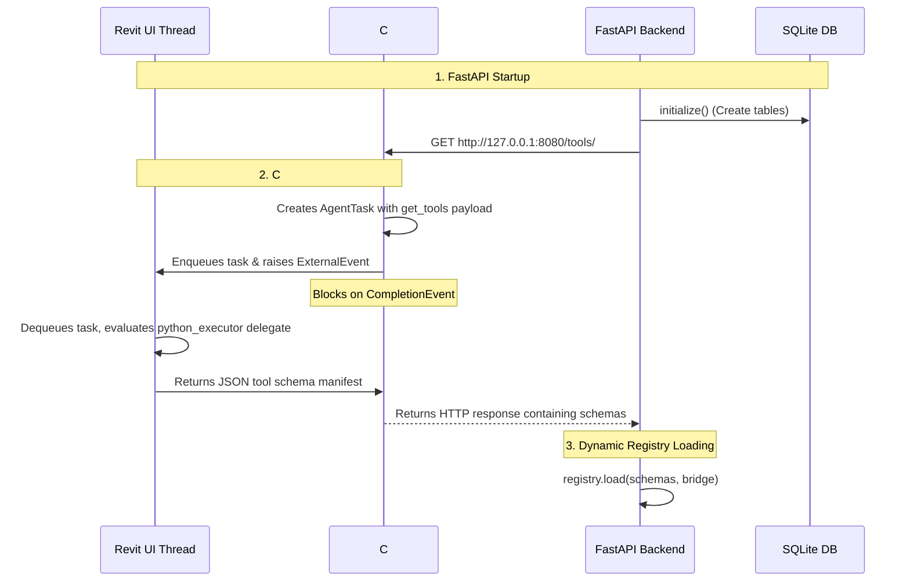
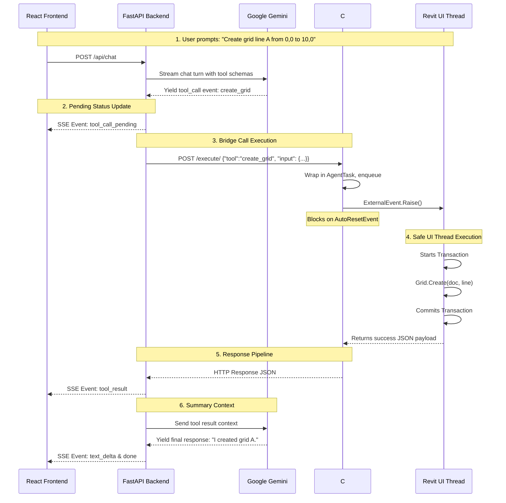

# Autodesk Revit AI Agent: Comprehensive Developer Manual

This manual serves as the definitive onboarding and technical reference guide for the **Autodesk Revit AI Agent** platform. It describes the system's architecture, details every folder and file, and explains the core code design, APIs, databases, threading models, and frontend state.

---

## 1. High-Level System Architecture

The Autodesk Revit AI Agent is a multi-process, multi-language application designed to connect a web-based conversational AI (Google Gemini) to a desktop-bound Building Information Modeling (BIM) application (Autodesk Revit 2025).

### The Thread Synchronization Challenge
Autodesk Revit uses a single-threaded architecture. All operations that read from or write to a Revit document **must** execute on Revit's main UI thread. Any external thread attempting direct Revit API calls throws a thread violation exception or crashes the application.

To solve this, the platform uses a **four-layer marshaled execution loop**:
1. **React Frontend**: Subscribes to Server-Sent Events (SSE) from the backend and updates the UI in real time.
2. **FastAPI Backend**: Orchestrates the conversation history, calls Google Gemini, registers discovered Revit tool schemas, and communicates with Revit over local HTTP loops.
3. **C# Bridge Server**: Loaded inside Revit as a compiled assembly. It runs an embedded `HttpListener` on a background thread. Incoming requests are wrapped in an `AgentTask`, placed in a queue, and executed on the Revit UI thread via the `IExternalEventHandler` pattern.
4. **pyRevit Extension**: An IronPython 2.7 environment running inside Revit. It implements the tool logic, runs transactions, and returns JSON-formatted results.

### Architectural Flowchart

```
┌─────────────────────────────────┐
│        React Frontend           │
│  (Vite + TypeScript + Zustand)  │
└────────┬───────────────▲────────┘
         │               │
  POST   │               │ Server-Sent Events (SSE)
  /chat  │               │ [text_delta, tool_call_pending, tool_result]
         ▼               │
┌────────────────────────┴────────┐
│        FastAPI Backend          │
│   (Python 3.11 + aiosqlite)     │
└────────┬───────────────▲────────┘
         │               │
    POST │               │ JSON Tool Response
/execute │               │ {"status": "success", ...}
         ▼               │
┌────────────────────────┴────────┐
│     C# Bridge (HttpListener)    │
│    (Loaded in Revit AppDomain)  │
└────────┬───────────────▲────────┘
         │               │
  Enqueues AgentTask and │ Dequeues & sets AutoResetEvent
  signals ExternalEvent  │
         ▼               │
┌────────────────────────┴────────┐
│      Revit UI Thread (Host)     │
│   (pyRevit IronPython Router)   │
└─────────────────────────────────┘
```

---

## 2. Directory & File Structure Map

```
ai_revit_agent/
├── .vscode/                        # IDE configurations and workspace themes
├── backend/                        # FastAPI Python Backend
│   ├── api/                        # HTTP Routing Controllers
│   │   ├── chat.py                 # Chat streaming & disconnection persistence
│   │   ├── providers.py            # AI model configurations & settings
│   │   ├── sessions.py             # Chat session CRUD endpoints
│   │   └── settings.py             # System status & manual tool refreshing
│   ├── core/                       # Core Reasoning Domain Layer
│   │   └── agent_loop.py           # Provider-agnostic Multi-Turn Agent Loop
│   ├── data/                       # SQLite DB Storage directory (gitignored)
│   ├── infra/                      # Persistence Layer
│   │   └── db.py                   # Async raw SQLite client (aiosqlite)
│   ├── providers/                  # AI LLM Connection Adapters
│   │   ├── base.py                 # AIProvider interface and system prompt
│   │   └── gemini.py               # Google Gemini API client integration
│   ├── schemas/                    # Automated Schema Snapshots
│   │   └── tools.json              # Cached JSON schemas of discovered Revit tools
│   ├── services/                   # Business Logic Services
│   │   ├── revit_bridge.py         # HTTP Client for the C# BridgeServer
│   │   ├── streaming.py            # Typed SSE payload generator
│   │   └── tool_registry.py        # Tool cache and dynamic dispatcher mapping
│   ├── config.py                   # Pydantic Settings configuration validator
│   ├── main.py                     # App lifespan startup hooks & production serving
│   └── requirements.txt            # Python library dependencies
├── bridge-source/                  # .NET 8.0 C# Bridge Source Code
│   ├── BridgeServer.cs             # Thread-marshaler, queues, listener, and event loops
│   └── RevitAgentBridge.csproj     # C# Project properties & Autodesk Assembly references
├── extension/                      # pyRevit Extension Files
│   └── AI_Agent.extension/
│       └── AI_Agent.tab/
│           └── Panel.panel/
│               └── StartBridge.pushbutton/
│                   ├── bundle.yaml          # Ribbon UI configuration definition
│                   ├── script.py            # Event handler bootstrapping & server start
│                   ├── tools/               # Modular Python tool definitions
│                   │   ├── __init__.py      # Tool registry, hot-reloading & routing entrypoint
│                   │   ├── grid_tools.py    # Grid database query and edit transaction operations
│                   │   └── level_tools.py   # Level elevation projection & view boundary operations
│                   └── RevitAgentBridge.dll # Compiled C# Bridge binary (copied post-build)
└── frontend/                       # Vite + React + TypeScript App
    ├── src/
    │   ├── api/                    # HTTP & SSE communication clients
    │   ├── components/             # Reusable React components
    │   ├── hooks/                  # Custom React hooks
    │   ├── store/                  # Zustand global state slices
    │   ├── types/                  # TypeScript interface mappings
    │   ├── App.tsx                 # Root React component
    │   └── main.tsx                # Frontend application entrypoint
    ├── package.json                # NPM libraries & configuration
    └── vite.config.ts              # Vite configurations & proxies
```

---

## 3. Deep Dive: Backend Application (`backend/`)

### 3.1 Setup & Configuration: `config.py`
The configuration system in [config.py](file:///d:/Construction/Projects/ai_revit_agent/backend/config.py) utilizes Pydantic's `BaseSettings` to load environment variables from `backend/.env` with strict validation.

* **Class**: `Settings`
  - Inherits from `BaseSettings`.
  - Properties:
    * `development_mode: bool`: Toggle that adjusts logging verbosity (DEBUG vs INFO) and opens CORS boundaries.
    * `gemini_api_key: str`: The fallback API key for Gemini.
    * `default_provider: str` & `default_model: str`: Default LLM settings.
    * `agent_max_turns: int`: Guardrail that sets the maximum turns allowed in `agent_loop.py` to prevent runaway reasoning loops.
    * `revit_bridge_host: str` & `revit_bridge_port: int`: Coordinate configurations pointing to Revit's bridge.
    * `database_path: str`: Location of the SQLite file relative to the `backend` folder.
* **Function**: `get_settings()`
  - Uses `lru_cache` to serve a singleton configuration instance.

---

### 3.2 Main Entrypoint & Lifespan: `main.py`
The initialization in [main.py](file:///d:/Construction/Projects/ai_revit_agent/backend/main.py) sets up the server, logs, lifespan hooks, and routing.

* **Lifespan Manager**: `lifespan(app: FastAPI)`
  * **Startup Sequence**:
    1. Instantiates `Database` and executes `db.initialize()` to configure tables. Registers the client globally in `app.state.db`.
    2. Instantiates `RevitBridgeClient` and calls `await bridge.start()` to spin up connection pools. Registers it in `app.state.revit_bridge`.
    3. Attempts an initial tool discovery: `await bridge.discover_tools()`. Loads discovered tools into the `registry` memory. If the bridge is unreachable (Revit closed), writes a graceful warning.
  * **Shutdown Sequence**:
    1. Triggers `await app.state.revit_bridge.stop()`, closing all open HTTP sessions.
* **Application Factory**: `create_app()`
  - Mounts routers (`chat`, `sessions`, `providers`, `settings`).
  - Configures CORS filters (wildcard in dev, locked origin in production).
  - Mounts the `frontend/dist` folders to serve the React SPA directly in production environments.

---

### 3.3 Persistence Layer: `infra/db.py`
The database infrastructure in [db.py](file:///d:/Construction/Projects/ai_revit_agent/backend/infra/db.py) uses the asynchronous library `aiosqlite` to write and execute raw SQL statements directly.

```mermaid
erDiagram
    sessions ||--o{ messages : "has many"
    sessions {
        TEXT id PK
        TEXT name
        TEXT created_at
        TEXT updated_at
    }
    messages {
        TEXT id PK
        TEXT session_id FK
        TEXT role
        TEXT content
        TEXT tool_calls
        TEXT agent_thoughts
        TEXT tool_name
        TEXT tool_call_id
        INTEGER approved
        TEXT created_at
    }
    provider_configs {
        TEXT id PK
        TEXT provider UNIQUE
        TEXT api_key
        TEXT active_model
        INTEGER active
        TEXT updated_at
    }
    app_settings {
        TEXT key PK
        TEXT value
        TEXT updated_at
    }
```

* **Class**: `Database`
  - **Properties**:
    * `db_path`: Absolute file location on disk.
  - **Core Methods**:
    * `initialize()`: Connects and sets `PRAGMA foreign_keys = ON;`, then creates the tables.
    * `list_sessions()`: Returns sessions sorted by `updated_at DESC`.
    * `create_session(name)`: Generates a new session UUID and commits it.
    * `save_message(...)`: Inserts a record into the `messages` table and updates the owner session's `updated_at` timestamp in a single call.
    * `get_session_messages(session_id)`: Retrieves historical messages sorted by creation time.
    * `save_provider_config(...)` & `get_provider_config(...)`: Manages LLM details. Sets the target config as the active provider and marks others inactive (`active = 0`) automatically.

---

### 3.4 API Controllers (`backend/api/`)

#### 1. [chat.py](file:///d:/Construction/Projects/ai_revit_agent/backend/api/chat.py)
Manages the chat turn execution and handles real-time response streaming.
* **Route**: `POST /api/chat`
  1. Validates the session. If missing, raises a `404` error.
  2. Resolves active AI models and configurations.
  3. Pulls chat histories from SQLite and maps them into raw dictionary objects (`db_messages_to_history()`).
  4. Saves the user's natural language prompt in the messages table.
  5. Initializes the `event_generator()` function:
     - Spawns `AgentOrchestrator` using the resolved LLM provider.
     - Runs the orchestrator loop, yielding JSON items.
     - Maps loop outputs to Server-Sent Event formats using the `SSEEventBuilder`.
     - Returns a `StreamingResponse`.
  6. **Disconnection Safety**: Uses a `finally:` block in the generator. If the user stops the response mid-stream, the generator intercepts the exception and commits all generated text segments and completed tool results to the database.

#### 2. [settings.py](file:///d:/Construction/Projects/ai_revit_agent/backend/api/settings.py)
Handles connection state checks and synchronizes tools.
* **Route**: `GET /api/revit/status`
  - Performs a quick health check: `await bridge.check_health()`.
  - **Auto-Recovery**: If polling shows the bridge has reconnected, it triggers tool re-discovery and re-registers the tools in `ToolRegistry` on the fly.
* **Route**: `POST /api/revit/refresh-tools`
  - Forces discovery and reloads tools from the bridge.

---

### 3.5 Services Layer (`backend/services/`)

#### 1. [revit_bridge.py](file:///d:/Construction/Projects/ai_revit_agent/backend/services/revit_bridge.py)
The `RevitBridgeClient` class acts as the HTTP proxy to Revit.
* **Methods**:
  - `start()` & `stop()`: Instantiates and disposes of the persistent `httpx.AsyncClient`.
  - `check_health()`: Sends a quick request to the discovery endpoint with a 3.0s timeout to check connection health.
  - `discover_tools()`: Hits `GET /tools/` on the bridge. If successful, writes a schema file snapshot to `backend/schemas/tools.json` and returns the schemas.
  - `execute_tool(tool_name, tool_input)`: Sends a `POST /execute/` request containing a JSON payload structured as `{"tool": tool_name, "input": tool_input}` to Revit.

#### 2. [tool_registry.py](file:///d:/Construction/Projects/ai_revit_agent/backend/services/tool_registry.py)
The `ToolRegistry` manages available schemas and wraps bridge execution calls.
* **Properties**:
  - `schemas`: The list of registered schemas.
* **Methods**:
  - `load(schemas, bridge)`: Registers schemas and maps each tool name to a closure:
    ```python
    def _make_dispatcher(tool_name: str, bridge: RevitBridgeClient):
        async def dispatcher(**kwargs):
            return await bridge.execute_tool(tool_name, kwargs)
        return dispatcher
    ```
    This avoids the late-binding variable scoping bug.
  - `is_read_tool(tool_name)`: Tags tools as read-only. Standardizes naming: any tool starting with `fetch_` is executed automatically without requesting user approval first.

#### 3. [streaming.py](file:///d:/Construction/Projects/ai_revit_agent/backend/services/streaming.py)
The `SSEEventBuilder` formats payloads into RFC-compliant Server-Sent Event messages.
* **Format**: `data: {JSON_PAYLOAD}\n\n`
* **Static Builders**:
  - `text_delta(content)`: Yields character chunks.
  - `agent_thought(content)`: Yields status updates.
  - `tool_call_pending(call_id, tool_name, args)`: Yields the tool metadata.
  - `tool_result(call_id, tool_name, result)`: Yields the tool output.

---

### 3.6 Reasoning Core: `core/agent_loop.py`
The orchestrator in [agent_loop.py](file:///d:/Construction/Projects/ai_revit_agent/backend/core/agent_loop.py) drives the conversation logic.

* **Class**: `AgentOrchestrator`
* **Execution Flow (`run()`)**:
  1. Copies the historical message list.
  2. Loops up to `max_turns`.
  3. Yields status update thoughts (e.g., `"Analyzing user request..."`).
  4. Initiates model streaming: `self.provider.stream_agent_turn()`.
  5. **Artifact Filtering**: Web interfaces can append trailing `[object Object]` artifacts in stream fragments. The loop uses a sliding text buffer to detect and strip this string before yielding chunks:
     ```python
     combined = _text_buffer + raw_text
     clean_text = combined.replace("[object Object]", "")
     # Yield clean segments and save the trailing end in the buffer
     ```
  6. Stores model thoughts and text responses.
  7. If the model emits tool requests, the loop:
     - Emits `tool_call_pending` and `tool_call_executing` events.
     - Runs the injected `execute_tool_fn` callback.
     - Receives the tool outputs, appends them to the historical messages list, and repeats the loop.
  8. If no tools are requested, the turn is complete and the loop breaks.

---

### 3.7 LLM Providers (`backend/providers/`)

* **[base.py](file:///d:/Construction/Projects/ai_revit_agent/backend/providers/base.py)**: Defines the abstract `AIProvider` interface. Contains the system prompt instructing models to only output tool calls from the schemas provided and explain coordinates in Revit's feet units.
* **[gemini.py](file:///d:/Construction/Projects/ai_revit_agent/backend/providers/gemini.py)**: Wraps the official Google GenAI SDK. Maps the registry's JSON tool schemas into Gemini `FunctionDeclaration` objects and parses responses.

---

## 4. Deep Dive: Revit Integration & Bridge

### 4.1 C# Bridge Server (`bridge-source/`)

The C# project compiles down to `RevitAgentBridge.dll`. It acts as the thread marshaler and is loaded into Revit.

```
                  ┌──────────────────────────────────────────────┐
                  │                 BridgeServer                 │
                  │         (Background listener thread)         │
                  └──────────────────────┬───────────────────────┘
                                         │
                               Incoming  │ HTTP Request
                                         ▼
                  ┌──────────────────────────────────────────────┐
                  │                 AgentTask                    │
                  │   - RequestJson                              │
                  │   - ResultJson                               │
                  │   - CompletionEvent (WaitOne / Blocks)       │
                  └──────────────────────┬───────────────────────┘
                                         │ Enqueues & calls
                                         │ ExternalEvent.Raise()
                                         ▼
                  ┌──────────────────────────────────────────────┐
                  │          AgentExternalEventHandler           │
                  │              (Revit UI Thread)               │
                  └──────────────────────┬───────────────────────┘
                                         │
                                         │ Dequeues & evaluates
                                         ▼
                  ┌──────────────────────────────────────────────┐
                  │           pyRevit PythonExecutor             │
                  │            - script.py execution             │
                  │            - CompletionEvent.Set()           │
                  └──────────────────────────────────────────────┘
```

#### Core Components
* **`BridgeRegistry`**: A static container classes holding runtime references to the active server and event structures.
* **`AgentTask`**: Represents a tool call task. Contains:
  - `RequestJson`: Request payload.
  - `ResultJson`: Output string buffer.
  - `CompletionEvent`: An `AutoResetEvent` used to block the HTTP thread until the task is complete.
* **`AgentExternalEventHandler`**: An `IExternalEventHandler` implementation.
  - Maintains a `ConcurrentQueue<AgentTask>`.
  - Exposes `PythonExecutor: Func<UIApplication, string, string>` delegate hook.
  - Its `Execute()` method is called by Revit when the event is raised. It dequeues tasks, calls the Python delegate, updates the results, and sets the completion events:
    ```csharp
    task.ResultJson = PythonExecutor(app, task.RequestJson);
    task.CompletionEvent.Set();
    ```
* **`BridgeServer`**: An HTTP server.
  - Listens on `http://127.0.0.1:8080/execute/` and `/tools/`.
  - Runs a background loop `ListenLoop()` to prevent blocking Revit's UI thread.
  - For each request:
    1. Instantiates `AgentTask(payload)`.
    2. Enqueues the task in the handler.
    3. Calls `_externalEvent.Raise()`, signaling Revit.
    4. Blocks via `task.CompletionEvent.WaitOne(120000)` (120-second timeout).
    5. Sends the result back as an HTTP response.

---

### 4.2 pyRevit Bootstrap (`extension/`)

* **[script.py](file:///d:/Construction/Projects/ai_revit_agent/extension/AI_Agent.extension/AI_Agent.tab/Panel.panel/StartBridge.pushbutton/script.py)**: Boots the C# bridge.
  1. Resolves and loads `RevitAgentBridge.dll` using pyRevit's `clr` module loader.
  2. Imports C# bridge classes.
  3. If a bridge instance is active, calls `.Stop()` to release the port (facilitating clean reloads).
  4. Instantiates `AgentExternalEventHandler` and points `handler.PythonExecutor` to the Python routing engine:
     ```python
     handler.PythonExecutor = registry.execute
     ```
  5. Instantiates the `BridgeServer` and starts the HTTP loop on port `8080`.
  6. Registers the active server in `BridgeRegistry.ActiveServer`.

* **[tools/](file:///d:/Construction/Projects/ai_revit_agent/extension/AI_Agent.extension/AI_Agent.tab/Panel.panel/StartBridge.pushbutton/tools/)**: Package containing the Revit tool logic.
  * **[__init__.py](file:///d:/Construction/Projects/ai_revit_agent/extension/AI_Agent.extension/AI_Agent.tab/Panel.panel/StartBridge.pushbutton/tools/__init__.py)**: 
    - Defines the `ToolRegistry` which manages Revit tools via a decorator pattern:
      ```python
      @registry.register(name="create_grid", description="...", parameters={...})
      def create_grid(doc, ui_app, tool_input):
          # Implementation...
      ```
    - Implements **Hot-Reloading** inside the `execute` dispatcher: on every request, it checks for edits in submodules (`level_tools` and `grid_tools`) and executes a Python `reload()` to pick up updates dynamically without restarting the bridge.
  * **[grid_tools.py](file:///d:/Construction/Projects/ai_revit_agent/extension/AI_Agent.extension/AI_Agent.tab/Panel.panel/StartBridge.pushbutton/tools/grid_tools.py)**: Encapsulates all query and modification operations for Revit Grids.
  * **[level_tools.py](file:///d:/Construction/Projects/ai_revit_agent/extension/AI_Agent.extension/AI_Agent.tab/Panel.panel/StartBridge.pushbutton/tools/level_tools.py)**: Encapsulates all query and modification operations for Revit Levels.

---

### 4.3 Core Revit Tools

#### 1. `fetch_levels(doc, ui_app, tool_input)`
Retrieves level details and calculates the model's footprint boundaries dynamically.
* **Precise Boundary Curve Retrieval**: Rather than falling back to the overall model footprint envelope, it queries the actual visual 2D and 3D level lines in all elevation and section views using `GetCurvesInView(DatumExtentType.Model, view)` and `GetCurvesInView(DatumExtentType.ViewSpecific, view)`. This handles stepped buildings and levels with different visual extents correctly.

#### 2. `fetch_grids(doc, ui_app, tool_input)`
Queries all grids. Determines their type (linear vs curved) and coordinates, returning detailed JSON outputs.

#### 3. `create_grid(doc, ui_app, tool_input)`
Creates a linear grid.
* Checks if a grid with the same name exists.
* Runs a Revit Transaction:
  ```python
  with Transaction(doc, "Agent - Create Grid") as trans:
      trans.Start()
      line = Line.CreateBound(start_pt, end_pt)
      new_grid = Grid.Create(doc, line)
      new_grid.Name = name
      # Set curves and vertical extents so it intersects all levels and is visible on floor plans
      new_grid.SetCurveInView(DatumExtentType.Model, view, line)
      new_grid.SetVerticalExtents(bottom, top)
      new_grid.Pinned = True
      trans.Commit()
  ```

#### 4. `modify_grid(doc, ui_app, tool_input)`
Modifies a grid's coordinates or name. Since `Grid.Curve` is read-only in the Revit API, this implements the **delete-and-recreate** pattern:
1. Temporarily renames the old grid (appending `_temp_<id>`) to avoid naming collisions.
2. Unpins and deletes the old grid.
3. Re-creates the grid line at the target coordinates.
4. Restores the target Name and Pinned status.

#### 5. `delete_grid(doc, ui_app, tool_input)`
Unpins and deletes the specified grid.

#### 6. `create_level(doc, ui_app, tool_input)`
Creates a datum level at a specified elevation.
* Can copy 2D/3D extents from an existing reference level using `copy_level_extents()`.
* Alternatively, applies coordinate bounds across views using `apply_level_extents_to_views()`.

#### 7. `modify_level(doc, ui_app, tool_input)`
Modifies a level's height, coordinates, or name. Translates 3D extents boundaries into elevation and section views by creating and applying the corresponding view curves.

#### 8. `delete_level(doc, ui_app, tool_input)`
Unpins and deletes a level.
> [!WARNING]
> Revit requires at least one level to exist in the document at all times. Attempting to delete the last level will trigger an exception.

---

## 5. Deep Dive: Frontend Application (`frontend/`)

### 5.1 Architecture & Clients (`frontend/src/api/`)

* **[client.ts](file:///d:/Construction/Projects/ai_revit_agent/frontend/src/api/client.ts)**: Configures Axios and processes SSE streams.
  - **`openSSEStream`**: Connects via `fetch()` and reads bytes using a chunk reader (`ReadableStreamDefaultReader`). Parses lines and yields structured `SSEEvent` objects.
* **[chat.ts](file:///d:/Construction/Projects/ai_revit_agent/frontend/src/api/chat.ts)**: Exports HTTP functions for session CRUD operations and exposes `streamChat` to query the SSE generator.

---

### 5.2 State Management (`frontend/src/store/`)
Uses Zustand to manage application state, split into independent slices.

* **[sessionStore.ts](file:///d:/Construction/Projects/ai_revit_agent/frontend/src/store/sessionStore.ts)**: Tracks chat sessions.
* **[messageStore.ts](file:///d:/Construction/Projects/ai_revit_agent/frontend/src/store/messageStore.ts)**: Appends, clears, and updates messages.
* **[providerStore.ts](file:///d:/Construction/Projects/ai_revit_agent/frontend/src/store/providerStore.ts)**: Manages model preferences and keys.
* **[uiStore.ts](file:///d:/Construction/Projects/ai_revit_agent/frontend/src/store/uiStore.ts)**: Tracks UI state, sidebar toggles, and theme styles.
* **[chatStore.ts](file:///d:/Construction/Projects/ai_revit_agent/frontend/src/store/chatStore.ts)**: Coordinates chat actions. Maps incoming SSE tokens to the store, updates states, and manages errors.

---

### 5.3 UI Components (`frontend/src/components/`)

* **[ChatWindow.tsx](file:///d:/Construction/Projects/ai_revit_agent/frontend/src/components/ChatWindow.tsx)**: Displays the chat stream. Auto-scrolls to follow new message bubbles and handles message input submissions.
* **[MessageBubble.tsx](file:///d:/Construction/Projects/ai_revit_agent/frontend/src/components/MessageBubble.tsx)**: Renders chat bubbles. Uses Markdown to render code segments and parses custom layout cards for tool executions.
* **[ToolCallCard.tsx](file:///d:/Construction/Projects/ai_revit_agent/frontend/src/components/ToolCallCard.tsx)**: Renders the execution status of a tool (e.g. pending, running, success, error) directly in the chat window.

---

## 6. How-It-Works Scenarios

### Scenario A: Startup Tool Discovery



---

### Scenario B: Request Execution ("Create Grid Line 'A'")



---

## 7. Developer Onboarding & Extensibility Guide

### 7.1 How to Add a New Revit Tool
To expose a new Revit action (e.g., fetching selected elements) to the agent, update the pyRevit pushbutton tool file: [tools.py](file:///d:/Construction/Projects/ai_revit_agent/extension/AI_Agent.extension/AI_Agent.tab/Panel.panel/StartBridge.pushbutton/tools.py).

#### Step 1: Define the function and decorate it
Add the tool function inside `tools.py` using the `registry.register` decorator:

```python
@registry.register(
    name="fetch_selected_elements",
    description="Gets the category names and IDs of currently selected elements in Revit.",
    parameters={
        "type": "object",
        "properties": {},
        "required": []
    }
)
def fetch_selected_elements(doc, ui_app, tool_input):
    from Autodesk.Revit.DB import Element
    from collections import OrderedDict
    
    try:
        # Get active document UI selection
        uidoc = ui_app.ActiveUIDocument
        selection_ids = uidoc.Selection.GetElementIds()
        
        elements_list = []
        for eid in selection_ids:
            el = doc.GetElement(eid)
            if el:
                elements_list.append({
                    "id": el.UniqueId,
                    "category": el.Category.Name if el.Category else "Unknown",
                    "name": el.Name
                })
                
        return OrderedDict([
            ("status", "success"),
            ("message", "Successfully retrieved selected elements."),
            ("data", {"elements": elements_list})
        ])
    except Exception as ex:
        return {"status": "error", "message": str(ex)}
```

#### Step 2: Reload the bridge in Revit
1. In Revit, click the **AI Agent** ribbon tab.
2. Click **Start Bridge**. The script will reload, registering the new tool.

#### Step 3: Trigger backend synchronization
1. In the React frontend, open Settings and click **Refresh Tools**, or restart the FastAPI backend server.
2. The backend will load the updated schemas from the bridge, making the new tool available to the Gemini agent.

---

### 7.2 IronPython 2.7 Constraints & Gotchas

#### 1. Python 3 compatibility limitations
pyRevit runs on **IronPython 2.7**. This means modern Python 3 syntax will throw compilation errors:
* **Do NOT use f-strings** (e.g., `f"{variable}"`). Use standard formatting instead: `"... {}".format(variable)`.
* Do NOT use type hinting in the function signature parameters (e.g., `def my_func(doc: Document)`).
* Use the `.Key` property instead of `.keys()` when extracting dictionary keys.

#### 2. Garbage Collection & Namespace Isolation
When a pyRevit script finishes execution, IronPython cleans up its module-level global variables. Because the C# bridge maintains references to the registered functions in memory, **all dependencies and imports must be kept self-contained within the tool functions themselves**. 
Import Revit namespaces inside the tool functions rather than at the top of the file to prevent missing module references during execution.

---

### 7.3 Troubleshooting Common Errors

#### 1. Port conflicts (`System.Net.HttpListenerException: Only one usage of each socket address is normally permitted`)
* **Cause**: Another process or an orphaned bridge session is active on port `8080`.
* **Fix**: In Revit, click the **Start Bridge** button to trigger a clean restart of the HTTP listener. Alternatively, free the port using cmd: `Stop-Process -Id (Get-NetTCPConnection -LocalPort 8080).OwningProcess`.

#### 2. Rebuilding and loading C# modifications
* **Cause**: Edits to `BridgeServer.cs` do not take effect automatically.
* **Fix**: Recompile the C# project:
  ```powershell
  cd bridge-source
  dotnet build -c Release
  ```
  Copy the compiled output `RevitAgentBridge.dll` file to the extension directory:
  ```powershell
  Copy-Item -Path "bin\Release\net8.0-windows\RevitAgentBridge.dll" `
    -Destination "..\extension\AI_Agent.extension\AI_Agent.tab\Panel.panel\StartBridge.pushbutton\RevitAgentBridge.dll" `
    -Force
  ```
  Then reload the bridge ribbon button in Revit.
