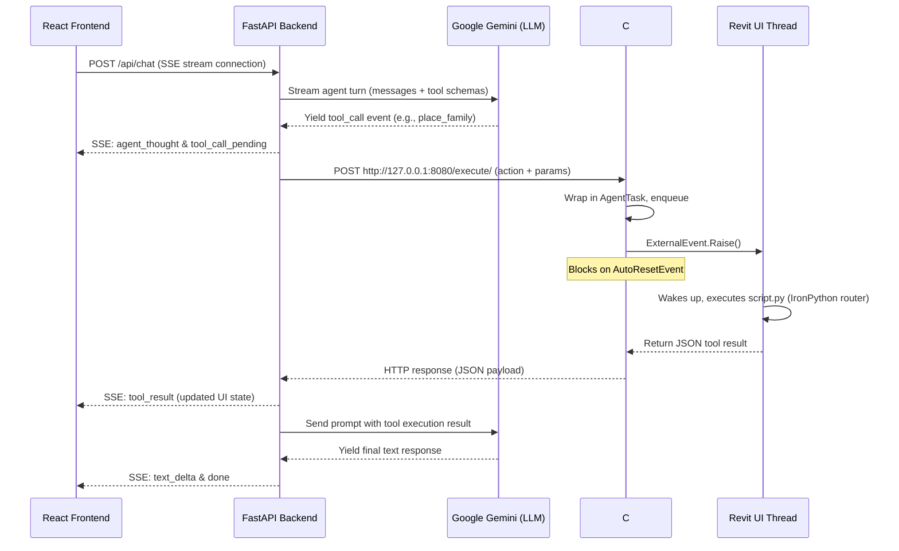

# Autodesk Revit AI Agent: Developer & User Manual

[](https://www.autodesk.com/products/revit/overview)
[](https://www.python.org/)
[](https://www.microsoft.com/windows)
[](#)

An agentic AI platform connecting **Google Gemini** directly to **Autodesk Revit 2025** via a modern, web-based chat interface. The AI agent fetches live BIM model context and performs safe, thread-controlled modifications—such as placing families, drawing gridlines, creating levels, and generating sheets—all from natural language commands.

This document serves as the absolute authority on the architecture, setup, configuration, and extensibility of the AI-Revit Agent.

---

## Table of Contents

1. [System Architecture & Core Philosophy](#1-system-architecture--core-philosophy)
   - [The Thread Synchronization Problem](#the-thread-synchronization-problem)
   - [The Four-Layer System](#the-four-layer-system)
   - [Detailed Sequence Flow](#detailed-sequence-flow)
2. [Database Design & Schema](#2-database-design--schema)
   - [Transition Away from SQLAlchemy ORM](#transition-away-from-sqlalchemy-orm)
   - [SQLite Tables & Relationships](#sqlite-tables--relationships)
3. [AI Agent Core & Generator Loop](#3-ai-agent-core--generator-loop)
   - [Decoupled Architecture](#decoupled-architecture)
   - [SSE Streaming & Event Formats](#sse-streaming-&-event-formats)
   - [Client Disconnect Handling & State Persistence](#client-disconnect-handling-&-state-persistence)
4. [Repository Structure](#4-repository-structure)
5. [Prerequisites & System Requirements](#5-prerequisites--system-requirements)
6. [Getting Started (Step-by-Step Installation)](#6-getting-started-step-by-step-installation)
   - [Step 1: Compile the C# Bridge Server](#step-1-compile-the-c-bridge-server)
   - [Step 2: Install and Load pyRevit Extension](#step-2-install-and-load-pyrevit-extension)
   - [Step 3: Setup Backend Environment](#step-3-setup-backend-environment)
   - [Step 4: Launch the Frontend & Backend](#step-4-launch-the-frontend-&-backend)
7. [BIM Tool Discovery & Lifecycle Management](#7-bim-tool-discovery--lifecycle-management)
   - [Automatic Tool Discovery](#automatic-tool-discovery)
   - [Element Pinning Lifecycle](#element-pinning-lifecycle)
   - [Level Modification Rules](#level-modification-rules)
8. [Configuration & Environment Variables](#8-configuration-&-environment-variables)
9. [Developer's Guide (How to Add Custom Tools)](#9-developers-guide-how-to-add-custom-tools)
   - [IronPython 2.7 Constraints & GC Closures](#ironpython-27-constraints-&-gc-closures)
   - [Adding a Custom Tool Step-by-Step](#adding-a-custom-tool-step-by-step)
10. [Troubleshooting & FAQs](#10-troubleshooting-&-faqs)

---

## 1. System Architecture & Core Philosophy

### The Thread Synchronization Problem

Autodesk Revit is a legacy, single-threaded desktop application. The Revit API enforces a strict constraint: **any calls modifying the document or reading Revit elements MUST execute on Revit's main UI thread**. 

If a multi-threaded web application (like our FastAPI backend) tries to call Revit API methods directly across the network, Revit will throw a `RevitServerException` or crash instantly. 

To resolve this, our system implements a C# bridge server running inside the Revit process. It uses the `IExternalEventHandler` pattern:
1. The backend sends a request to the C# Bridge.
2. The C# Bridge wraps the instruction in an `AgentTask` and places it in a concurrent queue.
3. The C# Bridge calls `ExternalEvent.Raise()`, signaling Revit's UI loop that work is waiting.
4. Meanwhile, the request thread in the C# Bridge **blocks** using an `AutoResetEvent`.
5. Revit's main UI thread wakes up, dequeues the task, processes it (via an IronPython script router), and returns the results.
6. The C# Bridge wakes up the blocked thread and returns the result to the FastAPI backend.

```
┌────────────────────────┐         ┌────────────────────────┐
│ FastAPI HTTP Request   ├────────>│  C# Bridge Server      │
│ (Asynchronous Thread)  │         │  (Blocked on Event)    │
└────────────────────────┘         └──────────┬─────────────┘
                                              │ Queue Task &
                                              │ ExternalEvent.Raise()
                                              ▼
┌────────────────────────┐         ┌────────────────────────┐
│ FastAPI HTTP Response  │<────────┤  Revit Main UI Thread  │
│ (JSON Tool Result)     │         │  (Executes API Safe)   │
└────────────────────────┘         └────────────────────────┘
```

---

### The Four-Layer System

1. **React Frontend**: The web user interface built with Vite, TypeScript, and TailwindCSS. It subscribes to a Server-Sent Events (SSE) stream to display the agent's thought process, tool executions, and text responses in real time.
2. **FastAPI Backend**: A lightweight Python 3.11+ web server. It holds the AI agent loop, stores configuration and chat history in SQLite, communicates with Gemini, and forwards tool requests to the Revit Bridge.
3. **C# Bridge Server**: A compiled .NET 8.0 assembly loaded into Revit. It runs an embedded `HttpListener` on port `8080` and manages thread dispatching.
4. **pyRevit Extension**: An IronPython 2.7 script bundle running inside Revit. It acts as the routing engine that dynamically exposes Revit API commands as JSON-capable tools.

---

### Detailed Sequence Flow

Below is the execution flow of a single user prompt that triggers a Revit command:



---

## 2. Database Design & Schema

### Transition Away from SQLAlchemy ORM

For maximum maintainability and structural clarity, this project avoids high-magic Object-Relational Mappers (ORMs) like SQLAlchemy or SQLModel. By stripping out ORM models, we:
* Eliminate schema-to-model coupling bugs.
* Ensure clear isolation between database rows and API response schemas.
* Run lightweight, performant, raw SQL queries using `aiosqlite`.
* Maintain absolute control over database schema initialization.

The database logic is centralized in a single helper class: [db.py](file:///d:/Construction/Projects/ai_revit_agent/backend/infra/db.py).

---

### SQLite Tables & Relationships

At startup, the database helper automatically creates the SQLite database at `backend/data/agent.db` with the following 4 tables:

```mermaid
erDiagram
    sessions ||--o{ messages : "has many"
    sessions {
        TEXT id PK
        TEXT name
        TEXT created_at
        TEXT updated_at
    }
    messages {
        TEXT id PK
        TEXT session_id FK
        TEXT role
        TEXT content
        TEXT tool_calls
        TEXT agent_thoughts
        TEXT tool_name
        TEXT tool_call_id
        INTEGER approved
        TEXT created_at
    }
    provider_configs {
        TEXT id PK
        TEXT provider UNIQUE
        TEXT api_key
        TEXT active_model
        INTEGER active
        TEXT updated_at
    }
    app_settings {
        TEXT key PK
        TEXT value
        TEXT updated_at
    }
```

#### 1. `sessions`
Stores unique chat conversation records.
* `id` (TEXT, PK): Unique UUID identifying the session.
* `name` (TEXT): Title of the chat session.
* `created_at` (TEXT): ISO 8601 creation timestamp.
* `updated_at` (TEXT): ISO 8601 last-updated timestamp.

#### 2. `messages`
Stores individual conversation turns, assistant progress, thoughts, and tool results.
* `id` (TEXT, PK): Unique UUID identifying the message.
* `session_id` (TEXT, FK): Links to the owner session (cascades on delete).
* `role` (TEXT): Identifies the speaker (`"user"`, `"assistant"`, or `"tool"`).
* `content` (TEXT): The message text or JSON-serialized tool output.
* `tool_calls` (TEXT, Optional): JSON string representing tool execution requests.
* `agent_thoughts` (TEXT, Optional): JSON string listing synthetic status/reasoning steps.
* `tool_name` (TEXT, Optional): Specific tool name (for role `"tool"`).
* `tool_call_id` (TEXT, Optional): Matches the ID of the tool call in the assistant message.
* `approved` (INTEGER, Optional): approval state (`1` for approved, `0` for rejected, or NULL).
* `created_at` (TEXT): ISO 8601 timestamp of creation.

#### 3. `provider_configs`
Configures AI model providers.
* `id` (TEXT, PK): Unique configuration UUID.
* `provider` (TEXT, UNIQUE): Provider name (e.g., `"gemini"`).
* `api_key` (TEXT, Optional): Configured API key (takes precedence over `.env`).
* `active_model` (TEXT, Optional): Selected model ID (e.g., `"gemini-2.5-flash"`).
* `active` (INTEGER): `1` if this is the active system provider, `0` otherwise.
* `updated_at` (TEXT): ISO 8601 timestamp of last update.

#### 4. `app_settings`
Arbitrary key-value store for app configuration and preferences.
* `key` (TEXT, PK): Configuration key.
* `value` (TEXT): Stringified value.
* `updated_at` (TEXT): ISO 8601 timestamp of last update.

---

## 3. AI Agent Core & Generator Loop

### Decoupled Architecture

The AI Orchestrator in [agent_loop.py](file:///d:/Construction/Projects/ai_revit_agent/backend/core/agent_loop.py) is decoupled from the framework layers. It does not import FastAPI components, SSE builders, or database instances. Instead, it relies on two primary abstractions:
1. **History List**: Receives conversational history as a raw list of dictionaries (`list[dict]`), conforming to standard role-content structure.
2. **Tool Execution Callback**: Accepts an asynchronous callback function (`execute_tool_cb`) to execute tools. This keeps the agentic loop purely focused on LLM reasoning.

---

### SSE Streaming & Event Formats

The backend communicates with the React frontend through a Server-Sent Events (SSE) connection at `/api/chat`. The generator yields JSON lines with specific `event` properties:

| Event Type | Purpose | Payload Schema |
|---|---|---|
| `agent_thought` | Synthetic thought logs or progress messages. | `{ "type": "agent_thought", "content": "..." }` |
| `text_delta` | Incremental text responses from the AI. | `{ "type": "text_delta", "content": "..." }` |
| `thinking_delta` | Internal chain-of-thought stream chunks from Gemini. | `{ "type": "thinking_delta", "content": "..." }` |
| `tool_call_pending` | Details of a tool call before approval/execution. | `{ "type": "tool_call_pending", "id": "...", "tool": "...", "args": {...}, "requires_approval": false }` |
| `tool_call_executing` | Signal that a tool is actively running in Revit. | `{ "type": "tool_call_executing", "id": "...", "tool": "..." }` |
| `tool_result` | Result returned from Revit tool execution. | `{ "type": "tool_result", "id": "...", "tool": "...", "result": {...}, "approved": true }` |
| `agent_paused` | Signal that the agent is paused waiting for user approval. | `{ "type": "agent_paused", "awaiting_approval_id": "...", "tool": "..." }` |
| `error` | Exception details when execution fails. | `{ "type": "error", "message": "...", "detail": "..." }` |
| `done` | Signals the end of the streaming session. | `{ "type": "done", "session_id": "...", "message_id": "..." }` |

---

### Client Disconnect Handling & State Persistence

If the user closes their browser window or clicks the **Stop** button, the FastAPI request handler catches the client disconnection. 

The SSE generator implements a strict `finally` block:
* When a disconnect occurs, the generator loop is interrupted.
* The `finally` block instantly captures all generated message deltas and completed tool execution logs.
* It commits the partial assistant response and tool records directly to SQLite.
* This ensures that no model credits or tool results are lost, and the chat history stays in sync.

---

## 4. Repository Structure

```
ai_revit_agent/
├── .vscode/                        # VS Code workspace settings
│   └── settings.json               # Configured themes, paths, and rulers
├── backend/                        # FastAPI Backend Application
│   ├── api/                        # API route handlers
│   │   ├── chat.py                 # Chat stream endpoint
│   │   ├── providers.py            # Model configuration
│   │   ├── sessions.py             # Session management
│   │   └── settings.py             # App-wide configurations and status checks
│   ├── core/                       # Core AI Orchestration
│   │   └── agent_loop.py           # Decoupled Gemini agent loop
│   ├── data/                       # SQLite DB Folder
│   │   └── agent.db                # Persistence database (gitignored)
│   ├── infra/                      # Data Infrastructure
│   │   └── db.py                   # Async raw SQLite client
│   ├── providers/                  # AI Adapters
│   │   ├── base.py                 # Provider interfaces & System Prompts
│   │   └── gemini.py               # Google Gemini integration
│   ├── schemas/                    # JSON Schema storage
│   │   └── tools.json              # Discovered Revit tools schemas
│   ├── services/                   # Business Logic Services
│   │   ├── revit_bridge.py         # HTTP client interfacing with C# Bridge
│   │   ├── streaming.py            # Event formatting utility
│   │   └── tool_registry.py        # Tool dispatcher & schemas caching
│   ├── config.py                   # Pydantic environment configuration
│   ├── main.py                     # App lifespan, CORS, and launch setup
│   └── requirements.txt            # Backend python packages
├── frontend/                       # Vite + React Frontend Application
│   ├── src/
│   │   ├── api/                    # Frontend HTTP client wrappers
│   │   ├── components/             # Reusable UI widgets
│   │   │   ├── ChatWindow.tsx      # SSE messages stream visualizer
│   │   │   ├── SessionSidebar.tsx  # Sidebar list of sessions
│   │   │   ├── SettingsPanel.tsx   # Model & API keys panel
│   │   │   └── ToolCallCard.tsx    # Visual status card for active tools
│   │   ├── store/                  # Zustand state engine
│   │   ├── types/                  # TypeScript interface declarations
│   │   ├── App.tsx                 # Root app module
│   │   └── main.tsx                # App entrypoint
│   ├── package.json                # Frontend package requirements
│   └── vite.config.ts              # Vite asset bundler configuration
├── bridge-source/                  # .NET 8.0 C# Bridge Source Code
│   ├── BridgeServer.cs             # Thread-safe dispatch logic
│   └── RevitAgentBridge.csproj     # C# project configuration
├── extension/                      # pyRevit Extension Bundle
│   └── AI_Agent.extension/
│       └── AI_Agent.tab/
│           └── Panel.panel/
│               └── StartBridge.pushbutton/
│                   ├── bundle.yaml          # pyRevit UI button declaration
│                   ├── script.py            # IronPython bridge bootstrapping
│                   ├── tools/               # Modular Python tool definitions
│                   │   ├── __init__.py      # Tool registry, hot-reloading & routing entrypoint
│                   │   ├── grid_tools.py    # Grid query/modify transaction operations
│                   │   ├── level_tools.py   # Level elevation/boundary projection operations
│                   │   └── column_tools.py  # Structural column/type management database operations
│                   └── RevitAgentBridge.dll # Built C# bridge assembly
├── .cursorrules                         # AI Agent workspace context rules
├── run.bat                         # Windows automated startup launcher
└── .gitignore                      # Git exclusion rules
```

---

## 5. Prerequisites & System Requirements

Ensure your machine meets the following parameters before proceeding:

| Dependency | Required Version | Purpose |
|---|---|---|
| **Autodesk Revit** | 2025 | Host BIM software environment. |
| **pyRevit** | 4.8.14+ | Revit Python scripting loader. |
| **Microsoft .NET SDK** | 8.0 | Required to build C# BridgeServer. |
| **Python** | 3.11.x | Backend engine host. |
| **Node.js** | 18+ (LTS recommended) | Frontend package management & Vite server. |
| **API Keys** | Google Gemini API Key | Large Language Model processing. |

---

## 6. Getting Started (Step-by-Step Installation)

### Step 1: Compile the C# Bridge Server

We must compile the assembly DLL that interfaces with the Revit process.

Open a PowerShell window:
```powershell
cd bridge-source
dotnet build -c Release
```

Copy the compiled output into the pyRevit pushbutton bundle directory:
```powershell
Copy-Item -Path "bin\Release\net8.0-windows\RevitAgentBridge.dll" `
  -Destination "..\extension\AI_Agent.extension\AI_Agent.tab\Panel.panel\StartBridge.pushbutton\RevitAgentBridge.dll" `
  -Force
```

---

### Step 2: Install and Load pyRevit Extension

Register the extension folder with pyRevit so it appears on the Revit interface ribbon:

```powershell
pyrevit extend ui AI_Agent "d:\Construction\Projects\ai_revit_agent\extension"
```

Next, boot up Autodesk Revit 2025:
1. Open any project file.
2. Look at the top navigation tabs and click the **AI Agent** tab.
3. Click **Start Bridge**.
4. A popup window should notify you: `Bridge server is running on http://127.0.0.1:8080/`.

---

### Step 3: Setup Backend Environment

1. Create a Python virtual environment:
   ```powershell
   cd backend
   python -m venv .venv
   .\.venv\Scripts\activate
   ```
2. Install Python packages:
   ```powershell
   pip install -r requirements.txt
   ```
3. Setup the environment configuration:
   ```powershell
   copy .env.example .env
   ```
4. Open `backend/.env` and supply your Gemini key:
   ```ini
   GEMINI_API_KEY=AIzaSyYourKeyHere...
   ```

---

### Step 4: Launch the Frontend & Backend

#### Option A: Automatic Launch (Recommended)
Double-click the [run.bat](file:///d:/Construction/Projects/ai_revit_agent/run.bat) file at the root of the project. It launches the backend process, builds/runs the frontend web application, and automatically opens your default browser to `http://localhost:5173`.

#### Option B: Manual Execution
Open **Terminal 1** (Backend):
```powershell
cd backend
.\.venv\Scripts\python.exe main.py
```

Open **Terminal 2** (Frontend):
```powershell
cd frontend
npm install
npm run dev
```

Browse to `http://localhost:5173`.

---

## 7. BIM Tool Discovery & Lifecycle Management

### Automatic Tool Discovery

The system uses a dynamic discovery model. 
* At startup, the FastAPI server requests a tool manifest from the Revit Bridge via `GET http://127.0.0.1:8080/tools`.
* If Revit is offline or the bridge is not running, the backend server starts gracefully, writes a warning to the logs, and serves a warning banner to the React frontend.
* As soon as Revit is opened and the bridge starts, the backend automatically registers the tools at run time.

---

### Element Pinning Lifecycle

To prevent accidental deletions or adjustments of structural assets:
* **Auto-Pin**: When the agent uses `create_level` or `create_grid`, the C# script automatically pins these elements in Revit.
* **Auto-Unpin**: If the agent attempts to delete an element using `delete_grid` or `delete_level`, the script unpins them prior to execution. This bypasses deletion blockers.

---

### Level Modification Rules

Revit documents enforce that **at least one level must exist at all times**. 
If you instruct the agent to rebuild levels:
1. The agent will **CREATE** the new levels first.
2. It will then call `fetch_levels` to obtain the parameters of the new levels.
3. Finally, it will **DELETE** the old levels.
Reversing this order will trigger Revit exceptions.

---

### Structural Column & Type Validation Rules

* **Auto-Pin/Unpin:** Newly created structural columns are pinned automatically. Deletion unpins them first.
* **Strict Type Checks:** If a column instance creation or modification requests a specific type ID that is not loaded, the bridge explicitly returns a `"not found"` error instead of falling back to defaults or ignoring it.
* **Detailed Parameter Feedback:** Type duplication and parameter editing (`duplicate_structural_column_type` and `modify_structural_column_type`) safely check .NET parameter StorageTypes (Double, Integer, String, ElementId) and return list logs indicating which parameters were successfully updated and which ones were not found or failed to write.

---

## 8. Configuration & Environment Variables

The backend is configured via `backend/.env`. Key parameters:

| Parameter | Default | Purpose |
|---|---|---|
| `DEVELOPMENT_MODE` | `true` | Opens CORS boundaries and enables traceback printing. |
| `GEMINI_API_KEY` | `""` | Google Gemini key override. |
| `DEFAULT_PROVIDER` | `gemini` | Locked to `"gemini"`. |
| `DEFAULT_MODEL` | `gemini-2.5-flash` | The default model model invoked. |
| `REVIT_BRIDGE_HOST` | `http://127.0.0.1` | The network location of the C# bridge. |
| `REVIT_BRIDGE_PORT` | `8080` | Port Revit Bridge listens on. |
| `DATABASE_PATH` | `data/agent.db` | Directory location of SQLite. |

---

## 9. Developer's Guide (How to Add Custom Tools)

### Critical IronPython Constraints & Gotchas

#### 1. Python 3 compatibility limitations
pyRevit runs on **IronPython 2.7**. This means modern Python 3 syntax will throw compilation errors:
* **Do NOT use f-strings** (e.g., `f"{variable}"`). Use standard formatting: `"... {}".format(variable)`.
* Do NOT use type hinting in function signatures (e.g., `def my_func(doc: Document)`).
* Use the `.Key` property instead of `.keys()` when extracting dictionary keys.

#### 2. Category & Enum Comparisons
In IronPython, .NET Enums do not automatically equate to standard Python integers.
* When checking an element category or comparing enums, **always cast the enum to an integer** using `int()` to prevent comparison mismatches:
  ```python
  # CORRECT
  if element.Category.Id.IntegerValue != int(BuiltInCategory.OST_StructuralColumns):
  
  # INCORRECT (Will evaluate to True in Python 2.7)
  if element.Category.Id.IntegerValue != BuiltInCategory.OST_StructuralColumns:
  ```

#### 3. Garbage Collection & Namespace Isolation
When a pyRevit script finishes execution, IronPython cleans up its module-level global variables. Because the C# bridge maintains references to the registered functions in memory, **all dependencies and imports must be kept self-contained within the tool functions themselves**. Import Revit namespaces inside the tool functions rather than at the top of the file to prevent missing module references.

---

### Modular Registry & Submodules

The project organizes all Revit commands into the `tools/` package. The `__init__.py` file registers the tools and handles routing, while specific modules (e.g. `grid_tools.py`, `level_tools.py`, or a new custom file) contain the implementation classes.

To add a new tool (e.g., query room properties):

#### 1. Define the tool function in a module:
You can implement the logic directly in a new class or module under `tools/`, or add it to an existing module. For example, create `tools/room_tools.py`:

```python
# -*- coding: utf-8 -*-
class RoomTools(object):
    def __init__(self, doc):
        self.doc = doc

    def fetch_rooms(self):
        from Autodesk.Revit.DB import FilteredElementCollector, BuiltInCategory
        from collections import OrderedDict
        
        rooms = FilteredElementCollector(self.doc).OfCategory(BuiltInCategory.OST_Rooms).WhereElementIsNotElementType().ToElements()
        rooms_data = []
        for r in rooms:
            rooms_data.append(OrderedDict([
                ("id", r.UniqueId),
                ("name", r.Name),
                ("number", r.Number),
                ("area", round(r.Area, 3))
            ]))
        return OrderedDict([
            ("status", "success"),
            ("message", "Successfully fetched rooms."),
            ("data", OrderedDict([("rooms", rooms_data)]))
        ])
```

#### 2. Register the tool in `tools/__init__.py`:
Import your logic and register it in `__init__.py` using the `@registry.register` decorator. Define the tool parameters and description:

```python
@registry.register(
    name="fetch_rooms",
    description="Returns a list of all rooms in the current Revit model including names, area, and numbers.",
    custom_instructions="Query this to inspect room boundaries and sizes before placing equipment or partitions.",
    parameters={
        "type": "object",
        "properties": {},
        "required": []
    }
)
def fetch_rooms(doc, ui_app, tool_input):
    from tools.room_tools import RoomTools
    return RoomTools(doc).fetch_rooms()
```

#### 3. Enable Hot-Reloading for Development:
Add your module to the hot-reloading block inside the `execute` method of `ToolRegistry` (in `tools/__init__.py`) so edits are picked up instantly without restarting the bridge:

```python
            if 'tools.room_tools' in sys.modules:
                reload(sys.modules['tools.room_tools'])
```

#### 4. Discovery:
The FastAPI backend will automatically discover the new tool schema on its next startup or when you click **Refresh Tools** in the web settings panel. Because of hot-reloading, you do not need to toggle or restart the pyRevit bridge button inside Revit to test python code edits.

---

## 10. Troubleshooting & FAQs

### Q: Why does changing the VS Code theme in workspace settings have no effect?
A: When installing extensions or changing themes via settings files, VS Code must register the newly installed package. Open the Command Palette (`Ctrl + Shift + P` or `F1`), run **`Developer: Reload Window`**, and check if the theme is loaded.

### Q: I get `Failed to connect to the Revit bridge` offline banner.
A: Ensure you have followed the step to build the C# Bridge and clicked **Start Bridge** under the **AI Agent** tab inside Revit. If Revit is not running, the app starts in mock-offline mode.

### Q: C# Bridge build fails saying Revit references are missing.
A: The `RevitAgentBridge.csproj` references assembly files located in Revit's installation path (`C:\Program Files\Autodesk\Revit 2025\`). If your Revit installation path is different, adjust the `<HintPath>` variables in the `.csproj` file.

### Q: How do I clear conversation logs?
A: Click the delete icon on a session in the sidebar, or stop the server and delete `backend/data/agent.db`. A new, empty database will be generated at the next startup.
