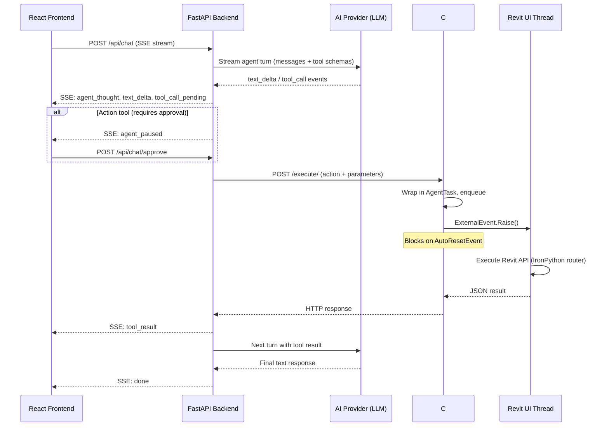

# Revit AI Agent

[](https://www.autodesk.com/products/revit/overview)
[](https://www.python.org/)
[](https://www.microsoft.com/windows)

An agentic AI platform connecting **multiple LLM providers** (Gemini, OpenAI, Anthropic, Groq, OpenRouter) directly to **Autodesk Revit 2025** via a web-based chat interface. The AI agent fetches live BIM model context and performs safe, thread-controlled modifications — placing families, drawing gridlines, creating levels/grids, managing sheets — all through natural language.

The system features **auto-discovered BIM tools**, **human-in-the-loop approval** for destructive actions, **persistent conversation sessions**, **SSE-streamed responses** with agent reasoning visibility, and **intelligent element lifecycle management**.

---

## Table of Contents

1. [Key Features](#key-features)
2. [System Architecture](#system-architecture)
3. [Repository Structure](#repository-structure)
4. [Prerequisites](#prerequisites)
5. [Getting Started](#getting-started)
   - [Step 1: Build the C# Bridge Server](#step-1-build-the-c-bridge-server)
   - [Step 2: Install the pyRevit Extension](#step-2-install-the-pyrevit-extension)
   - [Step 3: Configure the Backend](#step-3-configure-the-backend)
   - [Step 4: Run the Application](#step-4-run-the-application)
6. [Available Tools](#available-tools)
7. [Configuration](#configuration)
8. [Extending the System](#extending-the-system-adding-new-tools)
9. [Known Limitations](#known-limitations)

---

## Key Features

- **Multi-Provider AI** — Switch between Google Gemini, OpenAI, Anthropic Claude, Groq (LPU), and OpenRouter at runtime. Provider and model selection persists in the database.
- **Web-Based Chat UI** — React frontend with session sidebar, provider selector, settings panel, and real-time SSE-streamed responses with agent thought visibility.
- **Human-in-the-Loop Approval** — Action tools (create, delete, modify) pause the agent and prompt the user for approval before execution. Read-only fetch tools auto-execute. Development mode bypasses this for rapid iteration.
- **Safe UI-Thread Execution** — Bridges multi-threaded HTTP requests onto Revit's single-threaded main UI thread using `IExternalEventHandler` and `AutoResetEvent` blockers.
- **Dynamic Tool Discovery** — The backend automatically discovers all available BIM tools at startup (and lazily re-discovers if the bridge starts later). No manual configuration required.
- **Smart Context Fetching** — Instead of sending massive BIM files to the LLM, the agent uses granular `fetch_*` tools to fetch only what it needs during the conversation.
- **Persistent Sessions** — Chat sessions persist across multiple turns in SQLite, enabling long multi-turn conversations with full context retention.
- **Element Pinning Lifecycle** — Created elements are automatically pinned for safety; elements are unpinned before deletion to prevent API failures.
- **Agent Thought Visibility** — The frontend displays the agent's reasoning steps (tool calls, results, planning) in real time alongside the final response.

---

## System Architecture

The system consists of four layers:

```
┌─────────────────────────────────────────────────────────────────┐
│  React Frontend (Vite, TypeScript, Zustand)  —  :5173 / :8000  │
│  Chat UI · Session Sidebar · Provider Selector · Approval Modal │
└──────────────────────────────┬──────────────────────────────────┘
                               │  SSE / REST API
┌──────────────────────────────▼──────────────────────────────────┐
│  FastAPI Backend (Python 3.11+, SQLite)  —  :8000               │
│  Agentic Loop · Tool Registry · Provider Adapters · Persistence │
└──────────────────────────────┬──────────────────────────────────┘
                               │  HTTP (localhost:8080)
┌──────────────────────────────▼──────────────────────────────────┐
│  C# Bridge Server (.NET 8.0, HttpListener)  —  :8080            │
│  Thread-safe dispatch via ExternalEvent + AutoResetEvent        │
└──────────────────────────────┬──────────────────────────────────┘
                               │  Revit API (IronPython router)
┌──────────────────────────────▼──────────────────────────────────┐
│  Autodesk Revit 2025  —  Single-threaded UI main thread         │
│  pyRevit extension with tool definitions & action dispatch      │
└─────────────────────────────────────────────────────────────────┘
```

### Execution Workflow



---

## Repository Structure

```
ai_revit_agent/
├── backend/                        # FastAPI backend (Python 3.11+)
│   ├── api/                        # API route handlers
│   │   ├── chat.py                 # POST /api/chat, /api/chat/approve (SSE streaming)
│   │   ├── providers.py            # GET/POST /api/providers (provider config CRUD)
│   │   ├── sessions.py             # GET/POST/DELETE /api/sessions (session management)
│   │   └── settings.py             # GET /api/settings (Revit bridge status)
│   ├── providers/                  # AI provider adapters (provider-agnostic interface)
│   │   ├── base.py                 # Abstract AIProvider base class + system prompt
│   │   ├── gemini.py               # Google Gemini adapter (google-genai SDK)
│   │   ├── openai.py               # OpenAI adapter
│   │   ├── anthropic.py            # Anthropic Claude adapter
│   │   ├── groq.py                 # Groq LPU adapter
│   │   ├── openrouter.py           # OpenRouter adapter
│   │   └── openai_compat.py        # Shared OpenAI-compatible streaming logic
│   ├── services/                   # Core business logic
│   │   ├── agent.py                # Agentic loop with approval gate (async generator)
│   │   ├── revit_bridge.py         # HTTP client for C# bridge (discover + execute)
│   │   ├── streaming.py            # SSE event builders
│   │   └── tool_registry.py        # Tool schema cache + dispatcher map
│   ├── data/                       # SQLite database (auto-created)
│   ├── schemas/
│   │   └── tools.json              # Snapshot of discovered tools
│   ├── config.py                   # Pydantic Settings (.env configuration)
│   ├── database.py                 # SQLAlchemy async engine + session factory
│   ├── models.py                   # SQLAlchemy ORM models
│   ├── main.py                     # FastAPI application factory + lifespan
│   └── requirements.txt            # Python dependencies
├── frontend/                       # React frontend (Vite, TypeScript, Zustand)
│   ├── src/
│   │   ├── api/                    # API client layer (chat, sessions, settings)
│   │   ├── components/             # React components
│   │   │   ├── ChatWindow.tsx      # Main conversation view with SSE streaming
│   │   │   ├── MessageBubble.tsx   # Individual message rendering
│   │   │   ├── SessionSidebar.tsx  # Session list + new session
│   │   │   ├── ProviderSelector.tsx # Provider/model dropdown
│   │   │   ├── ApprovalModal.tsx   # Human-in-the-loop approval dialog
│   │   │   ├── SettingsPanel.tsx   # Slide-out settings (API keys, config)
│   │   │   └── ToolCallCard.tsx    # Tool call status visualization
│   │   ├── hooks/                  # Custom React hooks (useChat, useSessions)
│   │   ├── store/                  # Zustand state management
│   │   ├── types/                  # Shared TypeScript type definitions
│   │   ├── App.tsx                 # Root component
│   │   └── main.tsx                # Entry point
│   ├── package.json
│   └── vite.config.ts
├── bridge-source/                  # C# .NET 8.0 Bridge Server
│   ├── BridgeServer.cs             # HttpListener + ExternalEvent execution logic
│   └── RevitAgentBridge.csproj     # MSBuild config targeting Revit 2025
├── extension/                      # pyRevit Extension Bundle
│   └── AI_Agent.extension/
│       └── AI_Agent.tab/
│           └── Panel.panel/
│               └── StartBridge.pushbutton/
│                   ├── bundle.yaml          # pyRevit button declaration
│                   ├── script.py            # IronPython tool definitions + execution router
│                   └── RevitAgentBridge.dll # Built C# bridge assembly
├── schemas/
│   └── tools.json                  # Generated tool schema snapshot
├── run.bat                         # One-click dev launcher (backend + frontend)
└── .venv/                          # Python virtual environment
```

---

## Prerequisites

| Requirement | Notes |
|---|---|
| **Autodesk Revit 2025** | With a project open |
| **pyRevit** | v4.8.14+ or latest compatible with Revit 2025 |
| **Microsoft .NET SDK 8.0** | Required to compile the C# bridge |
| **Python 3.11+** | For the backend |
| **Node.js 18+** | For the React frontend |
| **AI Provider API Key** | At least one of: Gemini, OpenAI, Anthropic, Groq, or OpenRouter |

---

## Getting Started

### Step 1: Build the C# Bridge Server

Compile the bridge assembly that acts as the IPC middleware inside Revit:

```powershell
cd bridge-source
dotnet build -c Release
```

Copy the compiled DLL to the pyRevit button folder:

```powershell
Copy-Item -Path "bin\Release\net8.0-windows\RevitAgentBridge.dll" `
  -Destination "..\extension\AI_Agent.extension\AI_Agent.tab\Panel.panel\StartBridge.pushbutton\RevitAgentBridge.dll" `
  -Force
```

### Step 2: Install the pyRevit Extension

Register the extension directory with pyRevit:

```powershell
pyrevit extend ui AI_Agent "d:\Construction\Projects\ai_revit_agent\extension"
```

Then in Revit:
1. Open Revit 2025 with a project file.
2. Go to the **AI Agent** tab on the ribbon.
3. Click **Start Bridge**. A dialog confirms the bridge server is running on `http://127.0.0.1:8080/`.

### Step 3: Configure the Backend

1. Create the Python virtual environment (if not already done):
   ```powershell
   python -m venv .venv
   .\.venv\Scripts\activate
   ```

2. Install backend dependencies:
   ```powershell
   cd backend
   pip install -r requirements.txt
   ```

3. Copy the environment template and add your API keys:
   ```powershell
   copy .env.example .env
   ```
   Edit `backend/.env` and set at least one API key:
   ```ini
   GEMINI_API_KEY=your-gemini-key
   OPENAI_API_KEY=your-openai-key
   ANTHROPIC_API_KEY=your-anthropic-key
   GROQ_API_KEY=your-groq-key
   OPENROUTER_API_KEY=your-openrouter-key
   ```

4. Install frontend dependencies:
   ```powershell
   cd frontend
   npm install
   ```

### Step 4: Run the Application

**Option A: One-click launcher (recommended)**

Double-click `run.bat` in the project root. It starts both the backend (port 8000) and the Vite dev server (port 5173) in separate windows, then opens the browser.

**Option B: Manual startup**

Terminal 1 — Backend:
```powershell
cd backend
..\..venv\Scripts\python.exe main.py
```

Terminal 2 — Frontend:
```powershell
cd frontend
npm run dev
```

Then open **http://localhost:5173** in your browser.

**Production build** — serve the React SPA from FastAPI:
```powershell
cd frontend
npm run build
```
The backend automatically serves `frontend/dist/` at the root URL. Access the app at **http://localhost:8000**.

---

## Available Tools

Tools are auto-discovered from the Revit bridge at startup. They are classified into two categories:

### Fetch Tools (Read-Only) — Auto-Executed

| Tool | Description |
|---|---|
| `fetch_project_info` | Returns document title and file path |
| `fetch_levels` | Returns all levels with IDs, elevations, and curve extents (curve_start_x, curve_end_x) |
| `fetch_grids` | Returns all grid lines with start/end coordinates |
| `fetch_families` | Returns loaded family symbols grouped by family name |
| `fetch_sheets` | Returns all drawing sheets with number, name, and ID |

### Action Tools (Write) — Require Approval

| Tool | Description |
|---|---|
| `place_family` | Places a family instance at 3D coordinates on a level |
| `create_grid` | Creates a linear gridline between two XY points; auto-pins the new grid |
| `create_sheet` | Creates a drawing sheet using the first available title block |
| `create_level` | Creates a new level at specified elevation; auto-pins the new level |
| `delete_level` | Deletes a level and its dependent elements; unpins before deletion |
| `delete_grid` | Deletes a grid by ID; unpins before deletion |
| `modify_level` | Updates level elevation and/or name |
| `modify_grid` | Updates grid start/end points and/or name |

> **Note:** In `DEVELOPMENT_MODE=true` (the default), all action tools auto-execute without prompting for approval.

### Element Pinning Behavior

- **Auto-Pin on Create**: `create_level` and `create_grid` automatically pin newly created elements.
- **Auto-Unpin on Delete**: `delete_level` and `delete_grid` automatically unpin elements before deletion.
- Pinned elements cannot be deleted by the Revit API. This lifecycle management prevents deletion failures.

### Level Deletion Order (Critical)

Revit requires at least one level to exist at all times. When replacing levels:
1. **CREATE** new levels **first**
2. **THEN DELETE** old levels
3. After creating new levels, call `fetch_levels` again to get their curve extents for grid placement

---

## Configuration

All backend configuration is managed via `backend/.env` (or environment variables). See `backend/.env.example` for a template.

| Variable | Default | Description |
|---|---|---|
| `DEVELOPMENT_MODE` | `true` | Auto-approve all tools, open CORS, DEBUG logging, soft-fail bridge |
| `GEMINI_API_KEY` | `""` | Google Gemini API key |
| `OPENAI_API_KEY` | `""` | OpenAI API key |
| `ANTHROPIC_API_KEY` | `""` | Anthropic Claude API key |
| `GROQ_API_KEY` | `""` | Groq LPU API key |
| `OPENROUTER_API_KEY` | `""` | OpenRouter API key |
| `DEFAULT_PROVIDER` | `gemini` | Default AI provider |
| `DEFAULT_MODEL` | `gemini-2.5-flash` | Default model |
| `REVIT_BRIDGE_HOST` | `http://127.0.0.1` | Revit bridge host |
| `REVIT_BRIDGE_PORT` | `8080` | Revit bridge port |
| `BACKEND_HOST` | `0.0.0.0` | Backend listen address |
| `BACKEND_PORT` | `8000` | Backend listen port |
| `DATABASE_PATH` | `data/agent.db` | SQLite database path (relative to backend/) |

API keys can also be configured at runtime via the **Settings Panel** in the web UI (stored in the SQLite database).

> **Note:** The Revit bridge port is configurable inside the extension's [script.py](file:///d:/Construction/Projects/ai_revit_agent/extension/AI_Agent.extension/AI_Agent.tab/Panel.panel/StartBridge.pushbutton/script.py) via the `_PORT` constant (defaults to `8080`). If modified, update `REVIT_BRIDGE_PORT` in `backend/.env` to match.
>
> Logging verbosity for the extension can also be configured in `script.py` using the `_LOG_LEVEL` constant (e.g. `"DEBUG"`, `"INFO"`, `"WARN"`, `"ERROR"`, `"FATAL"`).

---

## Extending the System (Adding New Tools)

The system is designed to be **auto-extending**. To add new capabilities, modify **one file**: `extension/AI_Agent.extension/AI_Agent.tab/Panel.panel/StartBridge.pushbutton/script.py`.

### How to Add a New Tool

1. Open `script.py` and add your tool logic as a nested function inside `python_execution_router`:
   ```python
   def tool_delete_element(doc, parameters):
       element_id = parameters.get("element_id")
       el = doc.GetElement(element_id)
       if not el:
           return {"status": "error", "message": "Element not found."}

       with Transaction(doc, "AI Agent - Delete Element") as trans:
           trans.Start()
           doc.Delete(el.Id)
           trans.Commit()

       return {"status": "success", "message": "Element deleted successfully."}
   ```

2. Add the dispatch mapping:
   ```python
   elif action == "delete_element":
       result = tool_delete_element(doc, parameters)
   ```

3. Restart the pyRevit bridge button and the backend. The backend automatically discovers and registers the new tool for all AI providers.

---

## Known Limitations

- **IronPython 2.7 Syntax Constraints** — The pyRevit script runs on IronPython 2.7. Modern Python 3 syntax (f-strings, type hints, walrus operator) will cause runtime errors. Use `.format()` string formatting instead.
- **IronPython GC Closure Rule** — When pyRevit finishes executing a script, it garbage-collects module-level globals. Because C# invokes the router asynchronously, all tool sub-routines, imports, and variables **must be nested inside the `python_execution_router` function scope**.
- **Single-Threaded Revit API** — All Revit API commands must run on the `ExternalEvent` handler thread. Running Revit commands on any other thread will crash the application.
- **Pinned Elements** — Some Revit elements are pinned by default. The agent handles pinning/unpinning automatically, but custom tools should check `element.Pinned` before deletion.
- **Protected Elements** — Some system elements (like default views) cannot be deleted. The `delete_level` tool handles this with individual error recovery for each dependent element.
- **Level Deletion Order** — Revit requires at least one level. When replacing all levels, always create new ones before deleting old ones.
