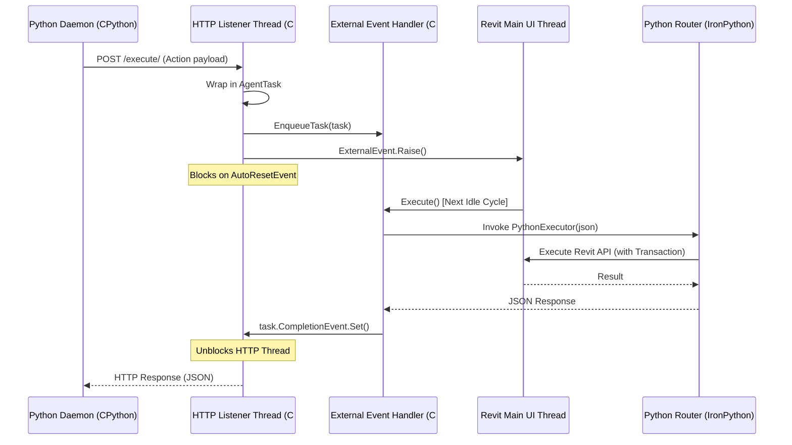

# 🏗️ Revit AI Agent

[](https://www.autodesk.com/products/revit/overview)
[](https://www.python.org/)
[](https://www.microsoft.com/windows)
[](https://deepmind.google/technologies/gemini/)

An agentic integration framework connecting external Large Language Models (powered by the **Google Gemini API**) directly with **Autodesk Revit 2025**. This allows AI agents to fetch live BIM model context and perform safe, thread-controlled modifications (such as placing families, drawing gridlines, or creating sheets) via natural language commands.

---

## 📖 Table of Contents
1. [Key Features](#-key-features)
2. [System Architecture](#%EF%B8%8F-system-architecture)
3. [Repository Structure](#-repository-structure)
4. [Prerequisites](#-prerequisites)
5. [Getting Started & Installation](#-getting-started--installation)
   - [Step 1: Build the C# Bridge Server](#step-1-build-the-c-bridge-server)
   - [Step 2: Install and Start pyRevit Extension](#step-2-install-and-start-pyrevit-extension)
   - [Step 3: Run the Python Orchestrator Daemon](#step-3-run-the-python-orchestrator-daemon)
6. [IPC API Specification](#-ipc-api-specification)
7. [Extending the System (Adding New Tools)](#-extending-the-system-adding-new-tools)
8. [Known Limitations & Workarounds](#-known-limitations--workarounds)

---

## ✨ Key Features

*   **🔒 Safe UI-Thread Execution**: Bridges external multi-threaded HTTP requests safely onto Revit's single-threaded main UI thread using `IExternalEventHandler` and `AutoResetEvent` blockers, preventing application crashes.
*   **🛠️ Dynamic Tool Discovery**: The Python daemon automatically discovers all available BIM tools at startup using the `GET /tools/` endpoint. No manual config is required on the AI side!
*   **⚡ Smart Context Fetching**: Instead of sending massive BIM files to the LLM, the agent uses granular `fetch_*` tools to fetch only what is needed dynamically during the conversation.
*   **🔄 Single Source of Truth**: Define tool schemas and Python actions in one place: the Revit-side Python script. The bridge exposes and dispatches them automatically.
*   **🤖 Native Gemini Tool Calling**: Uses the new `google-genai` Python SDK to bind discovered bridge APIs directly to the agent's function-calling loop.

---

## 🏗️ System Architecture

Revit's API execution is strictly single-threaded. Making calls from background network listener threads directly will crash the app. This framework uses a C# bridge layer hosting an `HttpListener` on a background thread that safely dispatches execution requests to Revit's main thread via an `ExternalEvent` handler.

### Execution Workflow



---

## 📂 Repository Structure

```
ai_revit_agent/
├── CONTEXT.md                    # Core system context and threading explanation
├── Project Documentation.md      # Comprehensive technical reference manual
├── README.md                     # Project overview and setup guides
├── bridge-source/                # C# .NET 8.0 Bridge Server source code
│   ├── BridgeServer.cs           # HttpListener & ExternalEvent execution logic
│   └── RevitAgentBridge.csproj   # MSBuild configuration targeting Revit 2025
├── daemon/                       # Local Python Daemon (Gemini Agent loop)
│   ├── config.py                 # Endpoint configuration & Gemini Model selection
│   ├── orchestrator.py           # Daemon entry point and user prompt loop
│   ├── requirements.txt          # Python dependencies (google-genai, requests)
│   ├── agent/
│   │   └── loop.py               # Gemini chat conversation & tool dispatcher loop
│   ├── bridge/
│   │   └── client.py             # HTTP communication client & tool discovery logic
│   └── tests/                    # Connection diagnostic & orchestrator mock tests
├── extension/                    # pyRevit Extension Bundle
│   └── AI_Agent.extension/
│       └── AI_Agent.tab/
│           └── Panel.panel/
│               └── StartBridge.pushbutton/
│                   ├── bundle.yaml        # pyRevit button declaration
│                   ├── script.py          # IronPython execution router & tool definitions
│                   └── RevitAgentBridge.dll # Built C# bridge assembly
└── schemas/                      # Generated schemas
    └── tools.json                # Snapshot of discovered tools (written at daemon startup)
```

---

## 📋 Prerequisites

Before running the application, make sure you have the following installed:
*   **Autodesk Revit 2025**
*   **pyRevit** (v4.8.14+ or latest compatible with Revit 2025)
*   **Microsoft .NET SDK 8.0** (required to compile the C# bridge)
*   **Python 3.11+** (for the local daemon)
*   **Google Gemini API Key** (Set up via Google AI Studio)

---

## 🚀 Getting Started & Installation

### Step 1: Build the C# Bridge Server
Compile the bridge assembly that acts as the IPC middleware inside Revit:

1. Open a PowerShell/Command prompt in `bridge-source/`:
   ```powershell
   cd bridge-source
   dotnet build -c Release
   ```
2. Copy the compiled DLL `RevitAgentBridge.dll` from the `bin/Release/net8.0-windows/` directory to the pyRevit button folder:
   ```powershell
   Copy-Item -Path "bin/Release/net8.0-windows/RevitAgentBridge.dll" -Destination "../extension/AI_Agent.extension/AI_Agent.tab/Panel.panel/StartBridge.pushbutton/RevitAgentBridge.dll" -Force
   ```

### Step 2: Install and Start pyRevit Extension
Link the repository extension folder to your local pyRevit configuration:

1. Register the extension directory (run as administrator if needed):
   ```powershell
   pyrevit extend ui AI_Agent "d:\Construction\Projects\ai_revit_agent\extension"
   ```
2. Open Revit 2025.
3. Locate the **AI Agent** tab on the Revit ribbon menu.
4. Click the **Start Bridge** button. The button text will change or show a dialog confirming the bridge server has successfully started on `http://127.0.0.1:8080/`.

### Step 3: Run the Python Orchestrator Daemon
Start the local Python CLI that connects the Gemini LLM with the Revit instance:

1. Open a PowerShell/Command prompt in `daemon/`:
   ```powershell
   cd daemon
   ```
2. Create and activate a Python virtual environment:
   ```powershell
   python -m venv venv
   .\venv\Scripts\activate
   ```
3. Install the required dependencies:
   ```powershell
   pip install -r requirements.txt
   ```
4. Configure your Gemini API key (replace with your actual key):
   ```powershell
   $env:GEMINI_API_KEY="your-gemini-api-key"
   ```
5. Run the orchestrator:
   ```powershell
   python orchestrator.py
   ```
6. You will see a prompt message confirming that the daemon has successfully discovered all tools from the active Revit bridge session. You can now type instructions (e.g., *"Create a sheet named 'FIRST FLOOR' with number 'A102' and place a single flush door family at coordinate 10, 5, 0 on Level 1"*).

---

## 🔌 IPC API Specification

The bridge server registers an HTTP Listener listening on port **8080** by default.

### 1. `GET /tools/`
Called by the daemon at startup. Returns JSON declarations for all registered fetch and action tools.
*   **Response Payload Structure**:
    ```json
    {
      "status": "success",
      "tools": [
        {
          "name": "create_sheet",
          "description": "Creates a new drawing sheet...",
          "parameters": {
            "type": "object",
            "properties": {
              "sheet_number": { "type": "string", "description": "Unique sheet identifier." },
              "sheet_name": { "type": "string", "description": "Name of the sheet." }
            },
            "required": ["sheet_number", "sheet_name"]
          }
        }
      ]
    }
    ```

### 2. `POST /execute/`
Sends a command to execute a particular tool inside Revit.
*   **Request Payload Structure**:
    ```json
    {
      "action": "create_sheet",
      "parameters": {
        "sheet_number": "A101",
        "sheet_name": "FLOOR PLAN"
      }
    }
    ```
*   **Response Payload Structure**:
    ```json
    {
      "status": "success",
      "message": "Successfully created sheet A101 - FLOOR PLAN",
      "element_id": "12345-abc-67890"
    }
    ```

---

## 🛠️ Extending the System (Adding New Tools)

The system is designed to be **auto-extending**. If you need to add new capabilities, you only need to modify **one file**: `extension/AI_Agent.extension/AI_Agent.tab/Panel.panel/StartBridge.pushbutton/script.py`.

### How to Add a New Tool:
1. Open the [script.py](file:///d:/Construction/Projects/ai_revit_agent/extension/AI_Agent.extension/AI_Agent.tab/Panel.panel/StartBridge.pushbutton/script.py) file.
2. Inside `python_execution_router`, implement your tool logic as a nested function. For example:
   ```python
   def tool_delete_element(doc, parameters):
       element_id = parameters.get("element_id")
       el = doc.GetElement(element_id)
       if not el:
           return {"status": "error", "message": "Element not found."}
           
       with Transaction(doc, "AI Agent - Delete Element") as trans:
           trans.Start()
           doc.Delete(el.Id)
           trans.Commit()
           
       return {"status": "success", "message": "Element deleted successfully."}
   ```
3. Add your tool dispatch mapping to the routing logic inside `python_execution_router`:
   ```python
   elif action == "delete_element":
       result = tool_delete_element(doc, parameters)
   ```
4. Restart the pyRevit bridge button and the Python daemon. The daemon automatically discovers and creates the Gemini function call for the new action.

---

## ⚠️ Known Limitations & Workarounds

*   **🐍 IronPython 2.7 Syntax Constraints**: The script running inside pyRevit runs on IronPython 2.7. Modern Python 3 syntax such as f-strings, type hints, or the walrus operator will throw runtime compilation errors. Use standard `.format()` string formatting instead.
*   **♻️ IronPython GC Closure Rule**: When pyRevit finishes executing a script, it garbage-collects module-level global variables. Because C# invokes the execution router asynchronously, variables defined outside the main router function are lost. **Ensure all tool execution sub-routines, imports, and variables are nested inside the `python_execution_router` function scope.**
*   **🔒 Single-threaded Revit API Access**: All Revit API commands must run on the thread provided by the `ExternalEvent` handler. Trying to run Revit commands inside a different background thread will cause an immediate Revit crash.
