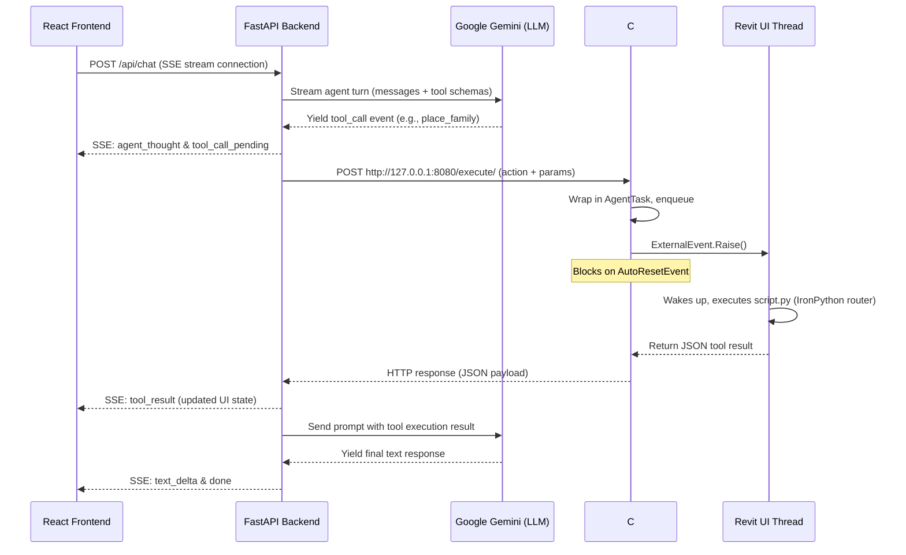
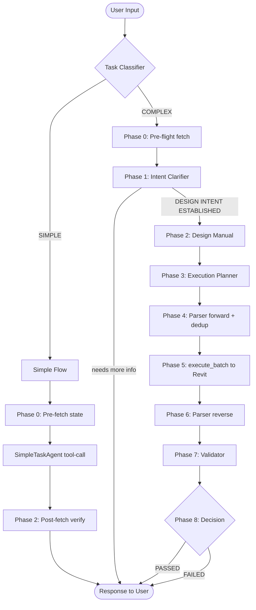

# Autodesk Revit AI Agent: Developer & User Manual

> [!IMPORTANT]
> ## 🤖 AI Coding Agent Guidelines
>
> If you are an AI coding assistant (e.g., Cursor, Copilot, Antigravity, etc.) contributing to this codebase, you **MUST** read and follow all rules below before writing or modifying any code. These are not suggestions — they are the architectural standards this project enforces.
>
> ---
>
> ### Rule 0 — Tooling & Verification
> - **ALWAYS** use the dedicated CLI utility [run_tool.py](file:///d:/Construction/Projects/ai_revit_agent/run_tool.py) to inspect, execute, chain, and batch-test all Revit bridge tools. It is the authoritative, standardized verification tool for this repository.
>
> ---
>
> ### Rule 1 — Generic, Dynamic, Scalable by Default
> - **NEVER hardcode element categories, tool names, or capability-specific logic into orchestration or pipeline code.** The system is designed to scale to hundreds of tools without requiring code changes.
> - Use runtime schema inspection to infer behavior (e.g., derive `fetch_*` targets from `create_*` tool names found in the batch result; filter schemas by prefix at runtime).
> - Any logic that names a specific Revit element category (grids, columns, walls, beams, etc.) inside the Python orchestration layer is a code smell. The LLM + tool schema system should handle category-awareness dynamically.
> - Examples of what is **NOT allowed**:
>   ```python
>   # ❌ WRONG — hardcoded categories
>   if tool == "create_grid":
>       created_grid_ids.add(eid)
>   elif tool == "create_structural_column":
>       created_column_ids.add(eid)
>   ```
>   ```python
>   # ✅ CORRECT — generic, data-driven
>   fetch_only_schemas = [s for s in self.tool_schemas if s.get("name", "").startswith("fetch_")]
>   ```
>
> ---
>
> ### Rule 2 — Clean Architecture, No Quick Fixes
> > **"The best code is the decoupled code that is agnostic of the logic of other layers."**
> - Implement every solution cleanly and maintainably. Do not introduce workarounds, monkeypatches, or "temporary" hacks that compromise the architecture.
> - Separation of concerns is mandatory: agents know only their own domain; the orchestrator only coordinates; helpers only compute; prompts only instruct.
> - No agent class should import FastAPI, aiosqlite, or SSE-related modules. No database class should contain agent logic.
> - Prefer extending the existing abstraction hierarchy over duplicating logic (e.g., add a `system_prompt` parameter to `AgentOrchestrator` rather than injecting it as a fake system message).
>
> ---
>
> ### Rule 3 — Validation Integrity (No Closed-Loop Validation)
> - **NEVER validate output by comparing LLM-generated text against LLM-generated text derived from the same source.** This produces guaranteed false positives.
> - The validation pipeline must be grounded in real Revit state:
>   - After `execute_batch`, fetch the actual created elements using `fetch_*` tools.
>   - Feed that real fetched data into the reverse parser to produce the Result Design Manual.
>   - Only then pass the Input DM and Result DM to the validator.
> - The `BIMValidatorAgent` is the authority on PASS/FAIL. Its verdict must be based on real data.
> - The reverse parser (`parser_reverse.txt`) is a **tool-calling agent** — it must autonomously call the appropriate `fetch_*` tools and build the Result DM from real values. It must **never** copy coordinates or parameters from the batch request input.
>
> ---
>
> ### Rule 4 — Prompts Are the Configuration Layer
> - All agent behaviors are defined in `.txt` prompt files under `backend/core/prompts/`. Python code must not duplicate or override these instructions inline.
> - Prompts must be generic and tool-agnostic. Do not reference specific tool names (e.g., `fetch_grids`, `create_structural_column`) in system prompts — use abstract language that applies to all tools.
> - When adding a new capability, update the prompt file first, then adjust the minimal Python scaffolding needed to expose it.
>
> ---
>
> ### Rule 5 — AgentOrchestrator Is Reusable
> - `AgentOrchestrator` in [agent_loop.py](file:///d:/Construction/Projects/ai_revit_agent/backend/core/agent_loop.py) is the standard generic multi-turn tool-calling loop. Use it for **any** pipeline phase that requires an LLM to call tools autonomously.
> - It accepts `system_prompt`, `tool_schemas`, and `max_turns` as parameters — set these appropriately per phase.
> - Do not build custom LLM-tool-call loops outside `AgentOrchestrator`. If you need new behavior, extend `AgentOrchestrator` cleanly.
>
> ---
>
> ### Rule 6 — Dedup and Safety Nets Are Mandatory
> - The `filter_duplicate_calls()` helper in [helpers.py](file:///d:/Construction/Projects/ai_revit_agent/backend/core/helpers.py) must always be applied in Phase 4 before dispatching the batch. It is a programmatic safety net that runs **regardless** of what the LLM emits.
> - Do not remove or bypass it — LLM hallucinations are expected and the safety net catches them before they cause Revit transaction aborts.
> - When adding new tool types, ensure the dedup logic is updated to cover naming/spatial conflicts for those types.
>
> ---
>
> ### Rule 7 — Phase Boundaries Must Be Respected
> - Each phase in the COMPLEX pipeline has a strictly defined input and output. Do not let one phase's logic bleed into another's.
> - Specifically:
>   - Phase 4 (Forward Parser) outputs only JSON — never executes.
>   - Phase 5 (Execution) only calls `execute_batch` — never interprets results.
>   - Phase 6 (Reverse Parser) only calls `fetch_*` tools and produces a Result DM — never creates or deletes.
>   - Phase 7 (Validator) only reads both DMs and produces a report — never fetches or modifies.
>   - Phase 8 (Decision) only reads the validator verdict — never re-runs earlier phases.
>
> ---
>
> ### Rule 8 — Tool-Safety in Phase 6
> - The reverse parser agent loop is granted **only** `fetch_*` tool schemas. Never pass write tools (`create_*`, `delete_*`, `execute_batch`) to this agent.
> - This is enforced in the orchestrator by filtering at runtime:
>   ```python
>   fetch_only_schemas = [s for s in self.tool_schemas if s.get("name", "").startswith("fetch_")]
>   ```
> - Maintain this pattern for any other read-only agent phases you introduce.

[](https://www.autodesk.com/products/revit/overview)
[](https://www.python.org/)
[](https://www.microsoft.com/windows)
[](#)

An agentic AI platform connecting **Google Gemini** directly to **Autodesk Revit 2025** via a modern, web-based chat interface. The AI agent fetches live BIM model context and performs safe, thread-controlled modifications—such as placing families, drawing gridlines, creating levels, and generating sheets—all from natural language commands.

This document serves as the absolute authority on the architecture, setup, configuration, and extensibility of the AI-Revit Agent.

---

## Table of Contents

1. [System Architecture & Core Philosophy](#1-system-architecture--core-philosophy)
   - [The Thread Synchronization Problem](#the-thread-synchronization-problem)
   - [The Four-Layer System](#the-four-layer-system)
   - [Detailed Sequence Flow](#detailed-sequence-flow)
2. [Database Design & Schema](#2-database-design--schema)
   - [Transition Away from SQLAlchemy ORM](#transition-away-from-sqlalchemy-orm)
   - [SQLite Tables & Relationships](#sqlite-tables--relationships)
3. [AI Agent Core & Generator Loop](#3-ai-agent-core--generator-loop)
   - [Decoupled Architecture](#decoupled-architecture)
   - [SSE Streaming & Event Formats](#sse-streaming-&-event-formats)
   - [Client Disconnect Handling & State Persistence](#client-disconnect-handling-&-state-persistence)
4. [Repository Structure](#4-repository-structure)
5. [Prerequisites & System Requirements](#5-prerequisites--system-requirements)
6. [Getting Started (Step-by-Step Installation)](#6-getting-started-step-by-step-installation)
   - [Step 1: Compile the C# Bridge Server](#step-1-compile-the-c-bridge-server)
   - [Step 2: Install and Load pyRevit Extension](#step-2-install-and-load-pyrevit-extension)
   - [Step 3: Setup Backend Environment](#step-3-setup-backend-environment)
   - [Step 4: Launch the Frontend & Backend](#step-4-launch-the-frontend-&-backend)
7. [BIM Tool Discovery & Lifecycle Management](#7-bim-tool-discovery--lifecycle-management)
   - [Automatic Tool Discovery](#automatic-tool-discovery)
   - [Element Pinning Lifecycle](#element-pinning-lifecycle)
   - [Level Modification Rules](#level-modification-rules)
8. [Configuration & Environment Variables](#8-configuration-&-environment-variables)
9. [Developer's Guide (How to Add Custom Tools)](#9-developers-guide-how-to-add-custom-tools)
   - [IronPython 2.7 Constraints & GC Closures](#ironpython-27-constraints-&-gc-closures)
   - [Adding a Custom Tool Step-by-Step](#adding-a-custom-tool-step-by-step)
10. [Troubleshooting & FAQs](#10-troubleshooting-&-faqs)

---

## 1. System Architecture & Core Philosophy

### The Thread Synchronization Problem

Autodesk Revit is a legacy, single-threaded desktop application. The Revit API enforces a strict constraint: **any calls modifying the document or reading Revit elements MUST execute on Revit's main UI thread**. 

If a multi-threaded web application (like our FastAPI backend) tries to call Revit API methods directly across the network, Revit will throw a `RevitServerException` or crash instantly. 

To resolve this, our system implements a C# bridge server running inside the Revit process. It uses the `IExternalEventHandler` pattern:
1. The backend sends a request to the C# Bridge.
2. The C# Bridge wraps the instruction in an `AgentTask` and places it in a concurrent queue.
3. The C# Bridge calls `ExternalEvent.Raise()`, signaling Revit's UI loop that work is waiting.
4. Meanwhile, the request thread in the C# Bridge **blocks** using an `AutoResetEvent`.
5. Revit's main UI thread wakes up, dequeues the task, processes it (via an IronPython script router), and returns the results.
6. The C# Bridge wakes up the blocked thread and returns the result to the FastAPI backend.

```
┌────────────────────────┐         ┌────────────────────────┐
│ FastAPI HTTP Request   ├────────>│  C# Bridge Server      │
│ (Asynchronous Thread)  │         │  (Blocked on Event)    │
└────────────────────────┘         └──────────┬─────────────┘
                                              │ Queue Task &
                                              │ ExternalEvent.Raise()
                                              ▼
┌────────────────────────┐         ┌────────────────────────┐
│ FastAPI HTTP Response  │<────────┤  Revit Main UI Thread  │
│ (JSON Tool Result)     │         │  (Executes API Safe)   │
└────────────────────────┘         └────────────────────────┘
```

---

### The Four-Layer System

1. **React Frontend**: The web user interface built with Vite, TypeScript, and TailwindCSS. It subscribes to a Server-Sent Events (SSE) stream to display the agent's thought process, tool executions, and text responses in real time.
2. **FastAPI Backend**: A lightweight Python 3.11+ web server. It holds the AI agent loop, stores configuration and chat history in SQLite, communicates with Gemini, and forwards tool requests to the Revit Bridge.
3. **C# Bridge Server**: A compiled .NET 8.0 assembly loaded into Revit. It runs an embedded `HttpListener` on port `8080` and manages thread dispatching.
4. **pyRevit Extension**: An IronPython 2.7 script bundle running inside Revit. It acts as the routing engine that dynamically exposes Revit API commands as JSON-capable tools.

---

### Detailed Sequence Flow

Below is the execution flow of a single user prompt that triggers a Revit command:



---

## 2. Database Design & Schema

### Transition Away from SQLAlchemy ORM

For maximum maintainability and structural clarity, this project avoids high-magic Object-Relational Mappers (ORMs) like SQLAlchemy or SQLModel. By stripping out ORM models, we:
* Eliminate schema-to-model coupling bugs.
* Ensure clear isolation between database rows and API response schemas.
* Run lightweight, performant, raw SQL queries using `aiosqlite`.
* Maintain absolute control over database schema initialization.

The database logic is centralized in a single helper class: [db.py](file:///d:/Construction/Projects/ai_revit_agent/backend/infra/db.py).

---

### SQLite Tables & Relationships

At startup, the database helper automatically creates the SQLite database at `backend/data/agent.db` with the following 4 tables:

```mermaid
erDiagram
    sessions ||--o{ messages : "has many"
    sessions {
        TEXT id PK
        TEXT name
        TEXT created_at
        TEXT updated_at
    }
    messages {
        TEXT id PK
        TEXT session_id FK
        TEXT role
        TEXT content
        TEXT tool_calls
        TEXT agent_thoughts
        TEXT tool_name
        TEXT tool_call_id
        INTEGER approved
        TEXT created_at
    }
    provider_configs {
        TEXT id PK
        TEXT provider UNIQUE
        TEXT api_key
        TEXT active_model
        INTEGER active
        TEXT updated_at
    }
    app_settings {
        TEXT key PK
        TEXT value
        TEXT updated_at
    }
```

#### 1. `sessions`
Stores unique chat conversation records.
* `id` (TEXT, PK): Unique UUID identifying the session.
* `name` (TEXT): Title of the chat session.
* `created_at` (TEXT): ISO 8601 creation timestamp.
* `updated_at` (TEXT): ISO 8601 last-updated timestamp.

#### 2. `messages`
Stores individual conversation turns, assistant progress, thoughts, and tool results.
* `id` (TEXT, PK): Unique UUID identifying the message.
* `session_id` (TEXT, FK): Links to the owner session (cascades on delete).
* `role` (TEXT): Identifies the speaker (`"user"`, `"assistant"`, or `"tool"`).
* `content` (TEXT): The message text or JSON-serialized tool output.
* `tool_calls` (TEXT, Optional): JSON string representing tool execution requests.
* `agent_thoughts` (TEXT, Optional): JSON string listing synthetic status/reasoning steps.
* `tool_name` (TEXT, Optional): Specific tool name (for role `"tool"`).
* `tool_call_id` (TEXT, Optional): Matches the ID of the tool call in the assistant message.
* `approved` (INTEGER, Optional): approval state (`1` for approved, `0` for rejected, or NULL).
* `created_at` (TEXT): ISO 8601 timestamp of creation.

#### 3. `provider_configs`
Configures AI model providers.
* `id` (TEXT, PK): Unique configuration UUID.
* `provider` (TEXT, UNIQUE): Provider name (e.g., `"gemini"`).
* `api_key` (TEXT, Optional): Configured API key (takes precedence over `.env`).
* `active_model` (TEXT, Optional): Selected model ID (e.g., `"gemini-2.5-flash"`).
* `active` (INTEGER): `1` if this is the active system provider, `0` otherwise.
* `updated_at` (TEXT): ISO 8601 timestamp of last update.

#### 4. `app_settings`
Arbitrary key-value store for app configuration and preferences.
* `key` (TEXT, PK): Configuration key.
* `value` (TEXT): Stringified value.
* `updated_at` (TEXT): ISO 8601 timestamp of last update.

---

## 3. AI Agent Core — Multi-Agent Pipeline

### Design Philosophy

The AI layer is built on a **multi-agent pipeline** where each agent has a single, focused responsibility. No agent knows about HTTP, SSE, or the database — it only knows its own domain. The `BIMOrchestrator` in [multi_agent_loop.py](file:///d:/Construction/Projects/ai_revit_agent/backend/core/multi_agent_loop.py) is the sole coordinator, driving agents sequentially and yielding live SSE events at every step.

All agents are defined in [agents.py](file:///d:/Construction/Projects/ai_revit_agent/backend/core/agents.py) and inherit from `BaseAgent`, which provides:
- `generate_response()` — blocking accumulation of one LLM turn (text-only).
- `stream_turn()` — async generator of raw provider events (tool-calling, used by `SimpleTaskAgent`).

---

### Agent Roster

| Agent | Class | Role | Skills |
|---|---|---|---|
| **Orchestrator** | `BIMOrchestrator` | Routes tasks, drives all phases, emits SSE events | — |
| **Task Classifier** | `TaskClassifier` | SIMPLE vs COMPLEX decision | — |
| **Agent 1 — Intent Clarifier** | `BIMIntentClarifierAgent` | Iterates with the user until every parameter is confirmed | — |
| **Agent 2 — Design Manual** | `BIMDesignManualAgent` | Converts approved intent into a complete numeric Input Design Manual | — |
| **Agent 3 — Planner** | `BIMExecutionPlannerAgent` | Produces a strategy plan guiding the orchestrator | — |
| **Helper — Parser** | `BIMParserAgent` | Bidirectional: Input Design Manual → JSON and result JSON → Result Design Manual | — |
| **Agent 5 — Validator** | `BIMValidatorAgent` | Compares Result Design Manual against Input Design Manual | — |
| **Simple Task Agent** | `SimpleTaskAgent` | Handles direct queries and single-element operations | Tool calls |

---

### Routing: SIMPLE vs COMPLEX

Every user turn is first classified:

- **SIMPLE**: A single direct action — fetching, creating, deleting, or modifying one element. Routes to `_simple_flow()`.
- **COMPLEX**: A coordinated multi-element layout (column grids, level stacks, etc.) requiring planning and dependency ordering. Routes to `_complex_flow()`.

---

### SIMPLE Flow

```
Phase 0 — Pre-fetch existing model state (levels, grids, columns)
Phase 1 — SimpleTaskAgent: tool-calling turn
            If info is missing → asks the user; next turn continues naturally
Phase 2 — Post-fetch verification (write ops only) → user-facing report
```

The current model state is injected as a `system` message so the agent knows what already exists and avoids creating duplicates.

---

### COMPLEX Flow (8 Phases)

```
Phase 0 — Pre-flight: fetch_levels + fetch_grids + fetch_structural_columns
Phase 1 — BIMIntentClarifierAgent: iterate until "DESIGN INTENT ESTABLISHED"
Phase 2 — BIMDesignManualAgent: produce self-contained numeric Input Design Manual
Phase 3 — BIMExecutionPlannerAgent: produce markdown strategy plan
Phase 4 — BIMParserAgent.manual_to_json(): Input DM → execute_batch JSON
           filter_duplicate_calls(): deterministic dedup safety net
Phase 5 — execute_batch → Revit (single atomic transaction)
Phase 6 — BIMParserAgent (tool-calling agent loop, fetch_* only):
           inspect batch result → infer fetch_* tools → call them → compile Result Design Manual
           from real Revit data (NOT from batch request inputs)
Phase 7 — BIMValidatorAgent: compare Result DM vs Input DM (real data vs intent)
Phase 8 — Orchestrator decision: PASSED → success report | FAILED → issue report
```



---

### Input Design Manual & Result Design Manual

A key design choice is using **human-readable markdown documents** as the intermediate representation between agents rather than intermediate JSON:

- **Input Design Manual** (Agent 2 output): A self-contained table-based document with every element's name, coordinates, levels, types, and status (NEW vs PRE-EXISTING). The Parser converts it to `execute_batch` JSON.
- **Result Design Manual** (Phase 6 output): Built by the reverse parser **after fetching the real Revit state** via `fetch_*` tools. Contains the actual coordinates, level names, and element IDs as stored in Revit — not echoed-back request inputs. The Validator compares it against the Input DM to detect placement mismatches.

This makes every intermediate step debuggable — the agent activity panel in the frontend shows the full content of each document.

---

### Programmatic Dedup Safety Net

In Phase 4, `_filter_duplicate_calls()` deterministically strips any `create_level` or `create_grid` calls whose names already exist in Revit — **regardless of what the LLM emits**. This runs on every complex task and prevents Revit transaction aborts caused by duplicate element names. The orchestrator also injects the existing state into every agent prompt as a secondary (LLM-level) guardrail.

---

### Decoupled Architecture

The `BIMOrchestrator.run()` method accepts two dependencies injected by the chat API:
1. **`messages: list[dict]`** — conversation history in standard role-content format.
2. **`execute_tool_fn: Callable`** — async callback that dispatches tool calls to the Revit bridge.

No agent imports FastAPI, SSE builders, or database clients. The orchestrator translates pipeline results into SSE event dicts using two factory helpers: `_thought()` and `_error()`.

---

### SSE Streaming & Event Formats

The backend communicates with the React frontend through a Server-Sent Events (SSE) stream at `/api/chat`. The orchestrator yields JSON dicts matching these event types:

| Event Type | Purpose | Payload Schema |
|---|---|---|
| `agent_thought` | Live pipeline status — which agent is running, what it found. | `{ "type": "agent_thought", "content": "[Agent Name] ..." }` |
| `text_delta` | Incremental text responses (intent clarification, validation reports, final summaries). | `{ "type": "text_delta", "content": "..." }` |
| `tool_call_pending` | Details of a tool call before execution. | `{ "type": "tool_call_pending", "id": "...", "tool": "...", "args": {...}, "requires_approval": false }` |
| `tool_call_executing` | Signal that a tool is dispatched to Revit. | `{ "type": "tool_call_executing", "id": "...", "tool": "..." }` |
| `tool_result` | Result returned from Revit. | `{ "type": "tool_result", "id": "...", "tool": "...", "result": {...}, "approved": true }` |
| `error` | Exception or pipeline failure details. | `{ "type": "error", "content": "...", "detail": "..." }` |
| `done` | Signals the end of the streaming session. | `{ "type": "done", "session_id": "...", "message_id": "..." }` |

---

### Client Disconnect Handling & State Persistence

If the user closes their browser or clicks **Stop**, the FastAPI request handler catches the client disconnection. The SSE generator implements a strict `finally` block:
- The generator loop is interrupted immediately.
- The `finally` block captures all accumulated message text and completed tool execution logs.
- It commits the partial assistant response and tool records to SQLite.
- No model credits or tool results are lost and chat history stays in sync.

---

## 4. Repository Structure

```
ai_revit_agent/
├── .vscode/                        # VS Code workspace settings
├── backend/                        # FastAPI Backend Application
│   ├── api/                        # HTTP route handlers
│   │   ├── chat.py                 # Chat SSE stream endpoint
│   │   ├── providers.py            # Model & API key configuration
│   │   ├── sessions.py             # Session CRUD
│   │   └── settings.py             # App-wide config & Revit status
│   ├── core/                       # Multi-Agent AI Pipeline
│   │   ├── agents.py               # All agent class definitions
│   │   │                           #   BaseAgent
│   │   │                           #   BIMIntentClarifierAgent  (Agent 1)
│   │   │                           #   BIMDesignManualAgent     (Agent 2)
│   │   │                           #   BIMExecutionPlannerAgent (Agent 3)
│   │   │                           #   BIMParserAgent           (Helper — bidirectional)
│   │   │                           #   BIMValidatorAgent        (Agent 5)
│   │   │                           #   SimpleTaskAgent
│   │   ├── multi_agent_loop.py     # BIMOrchestrator — 8-phase pipeline driver
│   │   │                           #   TaskClassifier
│   │   │                           #   SIMPLE flow  (_simple_flow)
│   │   │                           #   COMPLEX flow (_complex_flow)
│   │   │                           #   _fetch_existing_state
│   │   │                           #   _filter_duplicate_calls (dedup safety net)
│   │   └── agent_loop.py           # Legacy single-agent loop (fallback)
│   ├── data/                       # SQLite database folder
│   │   └── agent.db                # Persistence database (gitignored)
│   ├── infra/                      # Data infrastructure
│   │   └── db.py                   # Async raw SQLite client
│   ├── providers/                  # LLM provider adapters
│   │   ├── base.py                 # Provider interface & system prompts
│   │   └── gemini.py               # Google Gemini integration
│   ├── schemas/                    # JSON schema cache
│   │   └── tools.json              # Discovered Revit tool schemas
│   ├── services/                   # Business logic services
│   │   ├── revit_bridge.py         # HTTP client for C# Bridge
│   │   ├── streaming.py            # SSE event builder
│   │   └── tool_registry.py        # Tool dispatcher & schema cache
│   ├── config.py                   # Pydantic environment config
│   ├── main.py                     # App lifespan, CORS, startup
│   └── requirements.txt            # Python dependencies
├── frontend/                       # Vite + React Frontend
│   ├── src/
│   │   ├── api/                    # HTTP client wrappers
│   │   ├── components/
│   │   │   ├── ChatWindow.tsx       # Message stream & input with image attach
│   │   │   ├── MessageBubble.tsx    # Per-agent coloured activity panel
│   │   │   ├── SessionSidebar.tsx  # Session list
│   │   │   ├── SettingsPanel.tsx   # Model & API key settings
│   │   │   └── ToolCallCard.tsx    # Visual tool execution card
│   │   ├── hooks/
│   │   │   └── useChat.ts           # SSE consumer + image payload
│   │   ├── store/                  # Zustand state (messages, approvals, UI)
│   │   ├── types/                  # TypeScript interfaces (SSEEvent, ChatMessage)
│   │   ├── App.tsx                 # Root component
│   │   └── main.tsx                # Entry point
│   ├── package.json
│   └── vite.config.ts
├── bridge-source/                  # .NET 8.0 C# Bridge
│   ├── BridgeServer.cs             # Thread-safe dispatch & HttpListener
│   └── RevitAgentBridge.csproj
├── extension/                      # pyRevit Extension Bundle
│   └── AI_Agent.extension/
│       └── AI_Agent.tab/
│           └── Panel.panel/
│               └── StartBridge.pushbutton/
│                   ├── bundle.yaml          # pyRevit button declaration
│                   ├── script.py            # IronPython bridge bootstrapper
│                   ├── tools/               # Modular IronPython tool definitions
│                   │   ├── __init__.py      # Tool registry, routing & hot-reload
│                   │   ├── grid_tools.py    # Grid create/fetch/delete
│                   │   ├── level_tools.py   # Level create/fetch/delete
│                   │   └── column_tools.py  # Structural column management
│                   └── RevitAgentBridge.dll # Compiled C# bridge assembly
├── run.bat                         # Windows automated startup launcher
├── run_tool.py                     # CLI headless tool testing utility
└── .gitignore
```

---

## 5. Prerequisites & System Requirements

Ensure your machine meets the following parameters before proceeding:

| Dependency | Required Version | Purpose |
|---|---|---|
| **Autodesk Revit** | 2025 | Host BIM software environment. |
| **pyRevit** | 4.8.14+ | Revit Python scripting loader. |
| **Microsoft .NET SDK** | 8.0 | Required to build C# BridgeServer. |
| **Python** | 3.11.x | Backend engine host. |
| **Node.js** | 18+ (LTS recommended) | Frontend package management & Vite server. |
| **API Keys** | Google Gemini API Key | Large Language Model processing. |

---

## 6. Getting Started (Step-by-Step Installation)

### Step 1: Compile the C# Bridge Server

We must compile the assembly DLL that interfaces with the Revit process.

Open a PowerShell window:
```powershell
cd bridge-source
dotnet build -c Release
```

Copy the compiled output into the pyRevit pushbutton bundle directory:
```powershell
Copy-Item -Path "bin\Release\net8.0-windows\RevitAgentBridge.dll" `
  -Destination "..\extension\AI_Agent.extension\AI_Agent.tab\Panel.panel\StartBridge.pushbutton\RevitAgentBridge.dll" `
  -Force
```

---

### Step 2: Install and Load pyRevit Extension

Register the extension folder with pyRevit so it appears on the Revit interface ribbon:

```powershell
pyrevit extend ui AI_Agent "d:\Construction\Projects\ai_revit_agent\extension"
```

Next, boot up Autodesk Revit 2025:
1. Open any project file.
2. Look at the top navigation tabs and click the **AI Agent** tab.
3. Click **Start Bridge**.
4. A popup window should notify you: `Bridge server is running on http://127.0.0.1:8080/`.

---

### Step 3: Setup Backend Environment

1. Create a Python virtual environment:
   ```powershell
   cd backend
   python -m venv .venv
   .\.venv\Scripts\activate
   ```
2. Install Python packages:
   ```powershell
   pip install -r requirements.txt
   ```
3. Setup the environment configuration:
   ```powershell
   copy .env.example .env
   ```
4. Open `backend/.env` and supply your Gemini key:
   ```ini
   GEMINI_API_KEY=AIzaSyYourKeyHere...
   ```

---

### Step 4: Launch the Frontend & Backend

#### Option A: Automatic Launch (Recommended)
Double-click the [run.bat](file:///d:/Construction/Projects/ai_revit_agent/run.bat) file at the root of the project. It launches the backend process, builds/runs the frontend web application, and automatically opens your default browser to `http://localhost:5173`.

#### Option B: Manual Execution
Open **Terminal 1** (Backend):
```powershell
cd backend
.\.venv\Scripts\python.exe main.py
```

Open **Terminal 2** (Frontend):
```powershell
cd frontend
npm install
npm run dev
```

Browse to `http://localhost:5173`.

---

## 7. BIM Tool Discovery & Lifecycle Management

### Automatic Tool Discovery

The system uses a dynamic discovery model. 
* At startup, the FastAPI server requests a tool manifest from the Revit Bridge via `GET http://127.0.0.1:8080/tools`.
* If Revit is offline or the bridge is not running, the backend server starts gracefully, writes a warning to the logs, and serves a warning banner to the React frontend.
* As soon as Revit is opened and the bridge starts, the backend automatically registers the tools at run time.

---

### Element Pinning Lifecycle

To prevent accidental deletions or adjustments of structural assets:
* **Auto-Pin**: When the agent uses `create_level` or `create_grid`, the C# script automatically pins these elements in Revit.
* **Auto-Unpin**: If the agent attempts to delete an element using `delete_grid` or `delete_level`, the script unpins them prior to execution. This bypasses deletion blockers.

---

### Level Modification Rules

Revit documents enforce that **at least one level must exist at all times**. 
If you instruct the agent to rebuild levels:
1. The agent will **CREATE** the new levels first.
2. It will then call `fetch_levels` to obtain the parameters of the new levels.
3. Finally, it will **DELETE** the old levels.
Reversing this order will trigger Revit exceptions.

---

### Structural Column & Type Validation Rules

* **Auto-Pin/Unpin:** Newly created structural columns are pinned automatically. Deletion unpins them first.
* **Strict Type Checks:** If a column instance creation or modification requests a specific type ID that is not loaded, the bridge explicitly returns a `"not found"` error instead of falling back to defaults or ignoring it.
* **Detailed Parameter Feedback:** Type duplication and parameter editing (`duplicate_structural_column_type` and `modify_structural_column_type`) safely check .NET parameter StorageTypes (Double, Integer, String, ElementId) and return list logs indicating which parameters were successfully updated and which ones were not found or failed to write.

---

### Measurement & Rotation Unit Rules

All physical dimensions, coordinates, elevations, offsets, spacing, and lengths are represented and processed in decimal **feet** (the standard internal unit of the Autodesk Revit API). Rotation angles are specified in **degrees**.
* **Schemas**: Every tool schema includes explicit `measurement_unit` (default: `"feet"`) and `rotation_unit` parameters which are fed directly to the LLM (Gemini) tool definitions.
* **Results**: Every tool execution and fetch function result includes explicit `"measurement_unit": "feet"` (and `"rotation_unit": "degrees"` where applicable) fields in its response payload.

---

## 8. Configuration & Environment Variables

The backend is configured via `backend/.env`. Key parameters:

| Parameter | Default | Purpose |
|---|---|---|
| `DEVELOPMENT_MODE` | `true` | Opens CORS boundaries and enables traceback printing. |
| `GEMINI_API_KEY` | `""` | Google Gemini key override. |
| `DEFAULT_PROVIDER` | `gemini` | Locked to `"gemini"`. |
| `DEFAULT_MODEL` | `gemini-2.5-flash` | The default model model invoked. |
| `REVIT_BRIDGE_HOST` | `http://127.0.0.1` | The network location of the C# bridge. |
| `REVIT_BRIDGE_PORT` | `8080` | Port Revit Bridge listens on. |
| `DATABASE_PATH` | `data/agent.db` | Directory location of SQLite. |

---

## 9. Developer's Guide (How to Add Custom Tools)

### Critical IronPython Constraints & Gotchas

#### 1. Python 3 compatibility limitations
pyRevit runs on **IronPython 2.7**. This means modern Python 3 syntax will throw compilation errors:
* **Do NOT use f-strings** (e.g., `f"{variable}"`). Use standard formatting: `"... {}".format(variable)`.
* Do NOT use type hinting in function signatures (e.g., `def my_func(doc: Document)`).
* Use the `.Key` property instead of `.keys()` when extracting dictionary keys.

#### 2. Category & Enum Comparisons
In IronPython, .NET Enums do not automatically equate to standard Python integers.
* When checking an element category or comparing enums, **always cast the enum to an integer** using `int()` to prevent comparison mismatches:
  ```python
  # CORRECT
  if element.Category.Id.IntegerValue != int(BuiltInCategory.OST_StructuralColumns):
  
  # INCORRECT (Will evaluate to True in Python 2.7)
  if element.Category.Id.IntegerValue != BuiltInCategory.OST_StructuralColumns:
  ```

#### 3. Garbage Collection & Namespace Isolation
When a pyRevit script finishes execution, IronPython cleans up its module-level global variables. Because the C# bridge maintains references to the registered functions in memory, **all dependencies and imports must be kept self-contained within the tool functions themselves**. Import Revit namespaces inside the tool functions rather than at the top of the file to prevent missing module references.

#### 4. Handling Revit Transaction Warnings and Errors Programmatically
To prevent Revit from showing modal dialog boxes (which block the main UI thread and freeze the C# bridge server), all database modification transactions must handle failures using a custom failures preprocessor class implementing `IFailuresPreprocessor`:
* **Warnings**: Swallow warning-level messages silently using `failuresAccessor.DeleteWarning(failure)`.
* **Errors**: Roll back transactions silently on error-level messages. To prevent Revit from showing the error dialog box to explain *why* the transaction was rolled back, you must set `SetClearAfterRollback(True)` before returning `ProceedWithRollBack`:
  ```python
  opts = failuresAccessor.GetFailureHandlingOptions()
  opts.SetClearAfterRollback(True)
  failuresAccessor.SetFailureHandlingOptions(opts)
  return FailureProcessingResult.ProceedWithRollBack
  ```
* **Safe Rollbacks**: Always wrap `.RollBack()` calls in try-except blocks in your exception handlers (or use the `rollback_transaction(trans)` helper from `tools.utils`). If a transaction has already been rolled back by the failures preprocessor, calling `.RollBack()` again on it will throw a secondary exception, overshadowing the original failure description.

---

### Modular Registry & Submodules

The project organizes all Revit commands into the `tools/` package. The `__init__.py` file registers the tools and handles routing, while specific modules (e.g. `grid_tools.py`, `level_tools.py`, or a new custom file) contain the implementation classes.

To add a new tool (e.g., query room properties):

#### 1. Define the tool function in a module:
You can implement the logic directly in a new class or module under `tools/`, or add it to an existing module. For example, create `tools/room_tools.py`:

```python
# -*- coding: utf-8 -*-
class RoomTools(object):
    def __init__(self, doc):
        self.doc = doc

    def fetch_rooms(self):
        from Autodesk.Revit.DB import FilteredElementCollector, BuiltInCategory
        from collections import OrderedDict
        
        rooms = FilteredElementCollector(self.doc).OfCategory(BuiltInCategory.OST_Rooms).WhereElementIsNotElementType().ToElements()
        rooms_data = []
        for r in rooms:
            rooms_data.append(OrderedDict([
                ("id", r.UniqueId),
                ("name", r.Name),
                ("number", r.Number),
                ("area", round(r.Area, 3))
            ]))
        return OrderedDict([
            ("status", "success"),
            ("message", "Successfully fetched rooms."),
            ("data", OrderedDict([("rooms", rooms_data)]))
        ])
```

#### 2. Register the tool in `tools/__init__.py`:
Import your logic and register it in `__init__.py` using the `@registry.register` decorator. Define the tool parameters and description:

```python
@registry.register(
    name="fetch_rooms",
    description="Returns a list of all rooms in the current Revit model including names, area, and numbers.",
    custom_instructions="Query this to inspect room boundaries and sizes before placing equipment or partitions.",
    parameters={
        "type": "object",
        "properties": {},
        "required": []
    }
)
def fetch_rooms(doc, ui_app, tool_input):
    from tools.room_tools import RoomTools
    return RoomTools(doc).fetch_rooms()
```

#### 3. Enable Hot-Reloading for Development:
Add your module to the hot-reloading block inside the `execute` method of `ToolRegistry` (in `tools/__init__.py`) so edits are picked up instantly without restarting the bridge:

```python
            if 'tools.room_tools' in sys.modules:
                reload(sys.modules['tools.room_tools'])
```

#### 4. Discovery:
The FastAPI backend will automatically discover the new tool schema on its next startup or when you click **Refresh Tools** in the web settings panel. Because of hot-reloading, you do not need to toggle or restart the pyRevit bridge button inside Revit to test python code edits.

#### 5. Command-Line Testing & Verification via `run_tool.py`:
To test your newly added tool or verify existing tools, run the [run_tool.py](file:///d:/Construction/Projects/ai_revit_agent/run_tool.py) utility in the project root. It connects directly to the Revit Bridge HTTP port (`8080`) and bypasses the main chat UI for fast, headless validation.

* **List discovered schemas**:
  ```bash
  python run_tool.py list
  ```
* **Show details for a tool**:
  ```bash
  python run_tool.py show <tool_name>
  ```
* **Run a single tool**:
  ```bash
  python run_tool.py run create_grid name="Grid A" start_x=0.0 start_y=0.0 end_x=10.0 end_y=10.0
  ```
  *(Note: Values are automatically cast to their proper types: floats, integers, booleans, or parsed JSON).*
* **Run chained tools sequentially**:
  Use the `--then` separator to combine multiple commands:
  ```bash
  python run_tool.py run fetch_levels --then create_grid name="Grid A" start_x=0.0 start_y=0.0 end_x=10.0 end_y=10.0 --then fetch_grids
  ```

* **Run batch commands from a file**:
  ```bash
  python run_tool.py batch commands.txt
  # or using JSON format
  python run_tool.py batch commands.json
  ```

* **Automated Diagnostic Logging & Session Transcription**:
  The framework writes centralized runtime logs and enables easy extraction of the latest active chat sessions for rapid debugging:
  
  * **Centralized Logs**: All backend tracebacks, network payloads, and LLM streaming events are written to `backend/data/backend.log`.
  * **Transcribe Latest Session**: To dump the latest chat session (including user message, detailed multi-agent thoughts, tool call inputs, C# bridge returns, and validation reports) into a clean Markdown document:
    ```bash
    python debug_dump.py
    ```
    This generates `backend/data/latest_run.md`. This allows developers and AI assistants to quickly analyze logical errors, coordinate mismatches, and tracebacks directly in the workspace.

---

## 10. Troubleshooting & FAQs

### Q: Why does changing the VS Code theme in workspace settings have no effect?
A: When installing extensions or changing themes via settings files, VS Code must register the newly installed package. Open the Command Palette (`Ctrl + Shift + P` or `F1`), run **`Developer: Reload Window`**, and check if the theme is loaded.

### Q: I get `Failed to connect to the Revit bridge` offline banner.
A: Ensure you have followed the step to build the C# Bridge and clicked **Start Bridge** under the **AI Agent** tab inside Revit. If Revit is not running, the app starts in mock-offline mode.

### Q: C# Bridge build fails saying Revit references are missing.
A: The `RevitAgentBridge.csproj` references assembly files located in Revit's installation path (`C:\Program Files\Autodesk\Revit 2025\`). If your Revit installation path is different, adjust the `<HintPath>` variables in the `.csproj` file.

### Q: How do I clear conversation logs?
A: Click the delete icon on a session in the sidebar, or stop the server and delete `backend/data/agent.db`. A new, empty database will be generated at the next startup.
